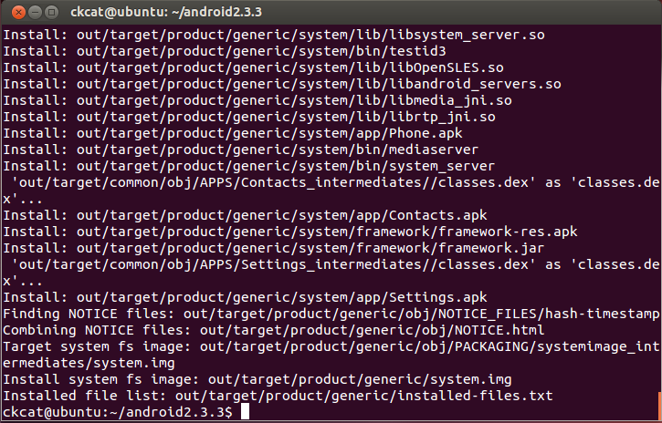
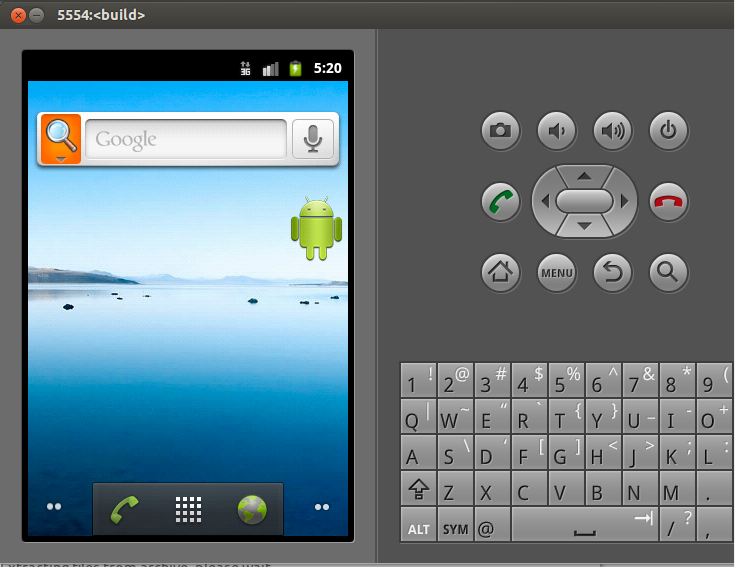
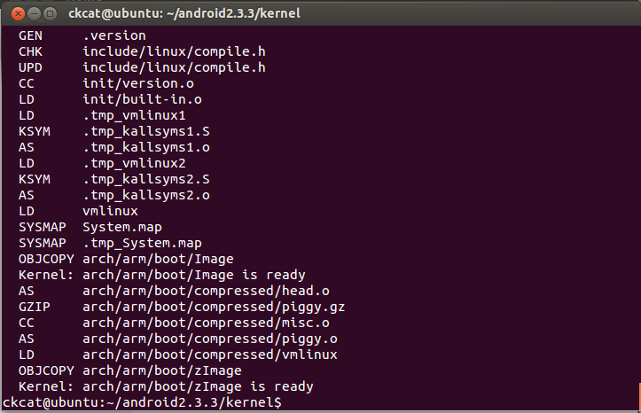
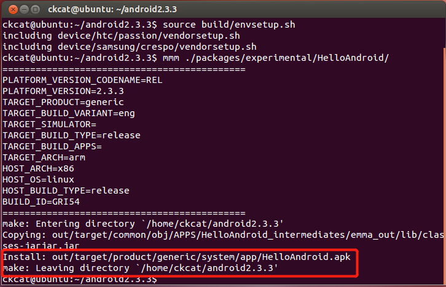
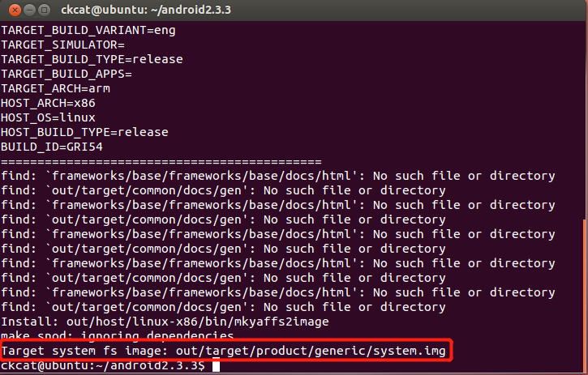
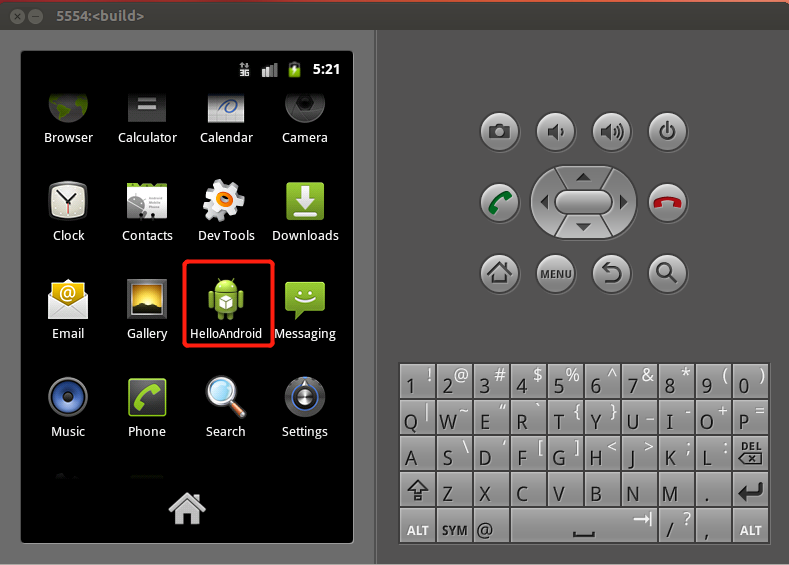

# 使用 Docker 环境

> https://hub.docker.com/repository/docker/ckcat/aosp-ubuntu12
> 
> https://github.com/CrackerCat/aosp-ubuntu12


# 使用虚拟机配置环境

## 配置环境
```
sudo apt-get -qq update
sudo apt-get -qq install aptitude # Resolve unmet dependencies with aptitude
sudo aptitude -q -y install git gnupg flex bison gperf build-essential zip curl libc6-dev libncurses5-dev:i386 x11proto-core-dev libx11-dev:i386 libreadline6-dev:i386 libgl1-mesa-glx:i386 libgl1-mesa-dev g++-multilib mingw32 tofrodos python-markdown libxml2-utils xsltproc zlib1g-dev:i386 lib32z1-dev lib32ncurses5-dev
sudo ln -s /usr/lib/i386-linux-gnu/mesa/libGL.so.1 /usr/lib/i386-linux-gnu/libGL.so

sudo mkdir /usr/lib/jvm && cd /usr/lib/jvm 
sudo curl -o jdk.bin https://mirrors.huaweicloud.com/java/jdk/6u45-b06/jdk-6u45-linux-x64.bin 
sudo chmod +x jdk.bin 
sudo ./jdk.bin 
sudo rm jdk.bin

# 在 .bashrc 末尾添加
JDK_PATH=/usr/lib/jvm/jdk1.6.0_45
PATH=${JDK_PATH}/bin:${PATH}
```
# 编译源码

## 修改源码
修改源码目录下 `/build/core/combo/HOST_linux-x86.mk` 文件，将以下语句
```
HOST_GLOBAL_CFLAGS += -D_FORTIFY_SOURCE=0
```
修改为
```
HOST_GLOBAL_CFLAGS += -U_FORTIFY_SOURCE -D_FORTIFY_SOURCE=0
```

修改源码目录下 `frameworks/base/libs/utils/Android.mk` 文件，将以下语句
```
LOCAL_CFLAGS+= -DLIBUTILS_NATIVE=1 $(TOOL_CFLAGS)
```
修改为
```
LOCAL_CFLAGS+= -DLIBUTILS_NATIVE=1 $(TOOL_CFLAGS)  -fpermissive
```

## 编译系统
进入源码目录，执行下列命令：
```
source build/envsetup.sh
make -j8
```



## 编译 sdk 
```
make sdk
```

# 运行
将 `out/host/linux-x86/bin` 和 `ANDROID_PRODUCT_OUT` 添加至 `.bashrc` 末尾。
```
export PATH=$PATH:/home/ckcat/android2.3.3/out/host/linux-x86/bin
export ANDROID_PRODUCT_OUT=/home/ckcat/android2.3.3/out/target/product/generic
```
安装运行库
```
sudo apt-get install libsdl1.2debian:i386
```
运行 `emulator` 



# 编译内核

修改 kernel 目录下的 makefile 如下所示
```
# ARCH		?= $(SUBARCH)
# CROSS_COMPILE	?=
# 下面为修改内容
ARCH		?= arm
CROSS_COMPILE	?= arm-eabi-
```

将编译工具添加至环境变量
```
export PATH=$PATH:/home/ckcat/android2.3.3/prebuilt/linux-x86/toolchain/arm-eabi-4.4.3/bin
```

配置并编译
```
make goldfish_defconfig
make -j8
```



运行：
```
emulator -kernel ./kernel/arch/arm/boot/zImage
```

# 单独编译和打包
一些命令：
```
代码编译
m	在源码树的根目录执行编译
mm	编译当前路径下所有模块，但不包含依赖
mmm [module_path]	编译指定路径下所有模块，但不包含依赖
mma	编译当前路径下所有模块，且包含依赖
mmma [module_path]	编译指定路径下所有模块，且包含依赖
make [module_name]	无参数，则表示编译整个Android代码

代码搜索
cgrep	所有C/C++文件执行搜索操作
jgrep	所有Java文件执行搜索操作
ggrep	所有Gradle文件执行搜索操作
mangrep [keyword]	所有AndroidManifest.xml文件执行搜索操作
mgrep [keyword]	所有Android.mk文件执行搜索操作
sepgrep [keyword]	所有sepolicy文件执行搜索操作
resgrep [keyword]	所有本地res/*.xml文件执行搜索操作
sgrep [keyword]	所有资源文件执行搜索操作

导航指令
croot	切换至Android根目录
cproj	切换至工程的根目录
godir [filename]	跳转到包含某个文件的目录

信息查询
hmm	查询所有的指令help信息
findmakefile	查询当前目录所在工程的Android.mk文件路径
print_lunch_menu	查询lunch可选的product
printconfig	查询各项编译变量值
gettop	查询Android源码的根目录
gettargetarch	获取TARGET_ARCH值

make clean：执行清理操作，等价于 rm -rf out/
make update-api：更新API，在framework API改动后需执行该指令，Api记录在目录frameworks/base/api；
```

## 编译
例如使用下列命令编译 HelloAndorid
```
ckcat@ubuntu:~/android2.3.3$ source build/envsetup.sh 
including device/htc/passion/vendorsetup.sh
including device/samsung/crespo/vendorsetup.sh
ckcat@ubuntu:~/android2.3.3$ mmm ./packages/experimental/HelloAndroid/
```



## 打包
运行下列命令即可重新打包 Android 系统镜像文件 `system.img` 。
```
ckcat@ubuntu:~/android2.3.3$ make snod
```



重新运行模拟器

