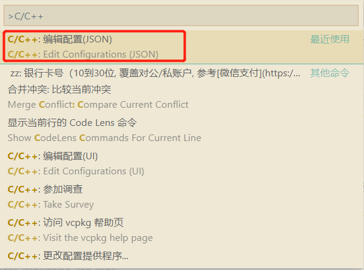
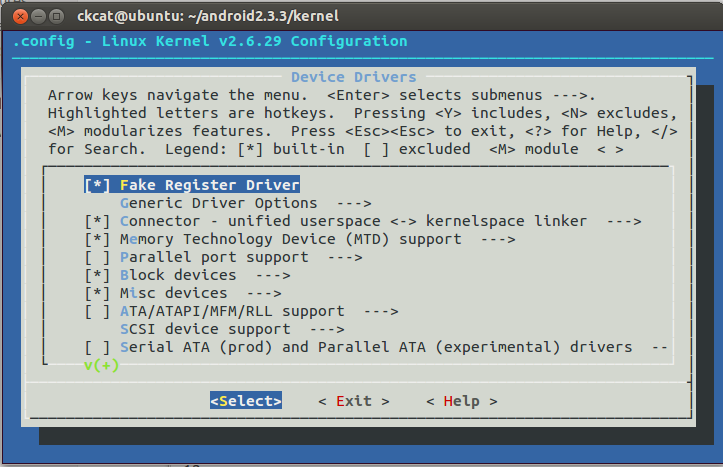
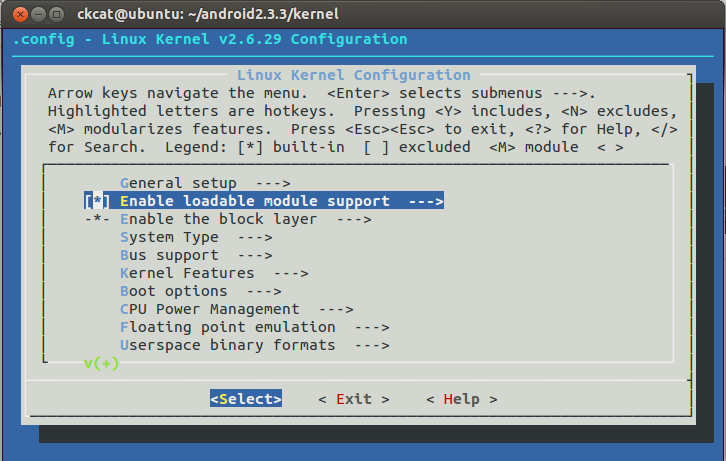
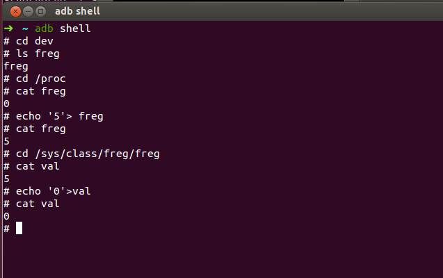
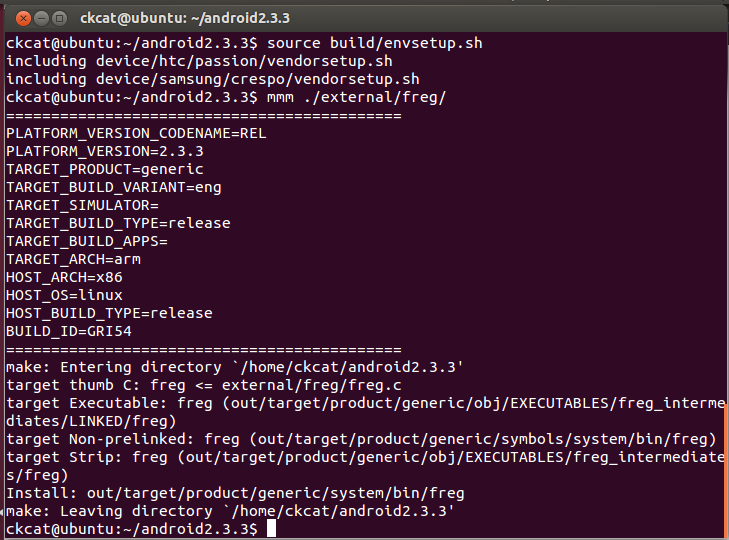
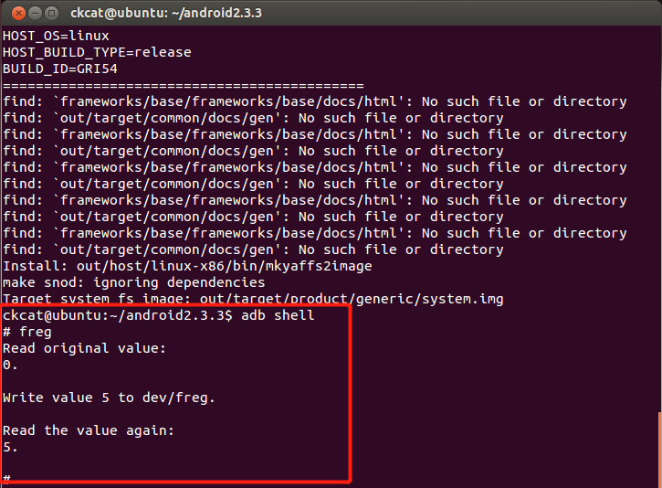
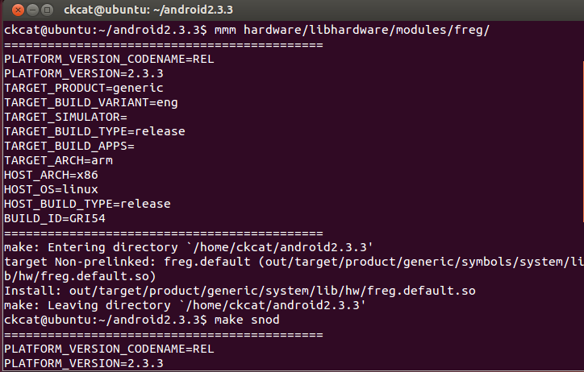

<!-- TOC -->

- [硬件抽象层](#硬件抽象层)
    - [内核开发环境设置](#内核开发环境设置)
    - [开发 Android 硬件驱动程序](#开发-android-硬件驱动程序)
        - [实现内核驱动模块](#实现内核驱动模块)
        - [修改内核 Kconfig 文件](#修改内核-kconfig-文件)
        - [修改内核 Makefile 文件](#修改内核-makefile-文件)
        - [编译内核驱动模块](#编译内核驱动模块)
        - [验证内核模块](#验证内核模块)
    - [开发 C 可执行程序验证 Android 驱动](#开发-c-可执行程序验证-android-驱动)
    - [开发 Android 硬件抽象层模块](#开发-android-硬件抽象层模块)
        - [硬件抽象层模块编写规范](#硬件抽象层模块编写规范)
            - [硬件抽象层模块命名规范](#硬件抽象层模块命名规范)
            - [硬件抽象层模块结构体定义规范](#硬件抽象层模块结构体定义规范)
        - [编写硬件抽象层模块接口](#编写硬件抽象层模块接口)
        - [硬件抽象层模块的加载过程](#硬件抽象层模块的加载过程)
        - [处理硬件设备访问权限问题](#处理硬件设备访问权限问题)
            - [修改系统代码](#修改系统代码)
            - [修改 `ramdisk.img` 镜像文件](#修改-ramdiskimg-镜像文件)
    - [开发Android硬件访问服务](#开发android硬件访问服务)
        - [定义硬件访问服务接口](#定义硬件访问服务接口)
        - [实现硬件访问服务](#实现硬件访问服务)
        - [实现硬件访问服务的 JNI 方法](#实现硬件访问服务的-jni-方法)
        - [启动硬件访问服务](#启动硬件访问服务)
    - [开发Android应用程序来使用硬件访问服务](#开发android应用程序来使用硬件访问服务)

<!-- /TOC -->

# 硬件抽象层

## 内核开发环境设置

将 `goldfish-android-goldfish-2.6.29.tar.gz` 解压到任意一个目录，然后使用 `VSCode` 打开C代码，使用 `ctrl+shift+p` 快捷键打开命令行，选择 C/C++ 编辑配置(JSON) ，如下图所示：



编辑配置文件，将 `goldfish` 内核代码解压目录的 `include` 路径添加到 `includePath` 字段，最后在 `defines` 中添加 `__KERNEL__` 宏如下所示
```
{
    "configurations": [
        {
            "name": "linux",
            "includePath": [
                "${workspaceFolder}/**",
                "goldfish根目录/goldfish/include",
                "goldfish根目录/goldfish/arch/arm/include"
            ],
            "defines": [
                "_DEBUG",
                "UNICODE",
                "_UNICODE",
                "__KERNEL__"
            ],
            "windowsSdkVersion": "10.0.18362.0",
            "compilerPath": "d:/Program Files (x86)/Microsoft Visual Studio/2019/Community/VC/Tools/MSVC/14.27.29110/bin/Hostx64/x64/cl.exe",
            "cStandard": "c11",
            "cppStandard": "c++17",
            "intelliSenseMode": "msvc-x64"
        }
    ],
    "version": 4
}
```
通过以上配置后，编写代码即可自动完成。

## 开发 Android 硬件驱动程序

### 实现内核驱动模块

相关代码见 [code](code/freg_kernel) 目录

### 修改内核 Kconfig 文件

当执行 `make menuconfig` 命令时，编译系统会读取 `arch/$(ARCH)` 目录下的 `Kconfig` 文件，我们编译的平台为 `arm` ，因此需要修改 `arch/arm/Kconfig` 文件， 使得编译系统可以找到驱动程序 `freg` 的 `Kconfig` 文件。
```
menu "Device Drivers"

source "drivers/base/Kconfig"

...
# 添加 freg 驱动的 Kconfig
source "drivers/freg/Kconfig"
endmenu
```
这样，我们执行 `make menuconfig` 命令时，就可以配置 `freg` 驱动的编译方式了。

### 修改内核 Makefile 文件

修改 `drivers` 目录下的 `Makefile` 文件，使得编译系统能够找到驱动程序 `freg` 的 `Makefile` 文件。
```
obj-$(CONFIG_FREG) += freg/
```
这样，当我们执行 make 命令来编译内核时，编译系统就会对驱动程序 freg 进行编译。

### 编译内核驱动模块

执行 `meke menuconfig` 命令配置编译方式。在配置界面 `Device Drivers` 项中选中 `Fake Register Driver` 项，按 `Y` 键或者 `M` 键，可以看到选项前面的方括号中的字符变成 `*` 或 `M` 符号，它们分别表示将驱动程序 `freg` 编译到内核中或者以模块的方式来编译。



如果以模块的方式来编译驱动，则需要选中 `Enable loadable module support` 选项，既可以使得内核支持动态加载模块。如果要使得驱动支持动态卸载模块，则需要选中 `Enable loadable module support` 的子选项 `Module unloading`，按 `Y` 键进行选中。



配置完成后，运行 `make` 命令既可以编译成功。

### 验证内核模块

编译完成后，指定内核运行 Android 模拟器。
```
emulator -kernel kernel/arch/arm/boot/zImage &
```

使用下列命令进行验证
```
# cd dev
# ls freg
freg
# cd /proc
# cat freg
0
# echo '5'> freg
# cat freg
5
# cd /sys/class/freg/freg
# cat val
5
# echo '0'>val
# cat val
0
# 
```



## 开发 C 可执行程序验证 Android 驱动

在 `/android2.3.3/external/freg` 目录中创建 `freg.c` 和 `Android.mk` 文件，编写相关代码，将 [code/freg_App](code/freg_App)。使用 `mmm ./external/freg/` 和 `make snod` 进行编译打包。



重启 Android 模拟器，运行 `freg` 程序。



## 开发 Android 硬件抽象层模块

### 硬件抽象层模块编写规范

Android 系统的硬件抽象层以模块的形式来管理各个硬件访问接口。每一个硬件模块都对应有一个动态库文件，这些动态库文件的命名需要符合一定的规范。同时，在系统内部，每一个硬件抽象层模块都使用结构体 `hw_module_t` 来描述，而硬件设备则使用结构体 `hw_device_t` 来描述。

#### 硬件抽象层模块命名规范

硬件抽象层的文件命名规范定义在 `hardware/libhardware/hardware.c` 文件中。如下所示：
```c
/**
 * There are a set of variant filename for modules. The form of the filename
 * is "<MODULE_ID>.variant.so" so for the led module the Dream variants 
 * of base "ro.product.board", "ro.board.platform" and "ro.arch" would be:
 *
 * led.trout.so
 * led.msm7k.so
 * led.ARMV6.so
 * led.default.so
 */

static const char *variant_keys[] = {
    "ro.hardware",  /* This goes first so that it can pick up a different
                       file on the emulator. */
    "ro.product.board",
    "ro.board.platform",
    "ro.arch"
};
```
这段代码和注释的意思是，硬件抽象层模块文件的命名规范为 `<MODULE_ID>.variant.so` ，其中， `MODULE_ID` 表示模块的 `ID` ， `variant` 表示是个系统属性 `ro.hardware` 、 `ro.product.board` 、 `ro.board.platform` 和 `ro.arch` 之一。系统在加载硬件抽象层模块时，依次按照 `ro.hardware` 、 `ro.product.board` 、 `ro.board.platform` 和 `ro.arch` 的顺序来取它们的属性值。如果其中的一个系统属性存在，那么就把它的值作为 `variant` 的值，然后再检查对应的文件是否存在，如果存在，那么就找到要加载的硬件抽象层模块文件了；否则，就继续查找下一个系统属性。如果这四个系统属性都不存在，或者对应于这四个系统属性的硬件抽象层模块文件都不存在，那么就使用 `<MODULE_ID>.default.so` 来作为要加载的硬件抽象层模块文件的名称。

系统属性 `ro.hardware` 是在系统启动时，由 `init` 进程负责设置的。它首先会读取 `/proc/cmdline` 文件，检查里面有没有一个名称为 `androidboot.hardware` 的属性，如果有，就把它的值作为属性 `ro.hardware` 的值；否则，就将 `/proc/cpuinfo` 文件的内容读取出来，并且将里面的硬件信息解析出来，即将 `Hardware` 字段的内容作为属性 `ro.hardware` 的值。例如，在 Android 模拟器中，从 `/proc/cpuinfo` 文件读取出来的 `Hardware` 字段内容为 `goldfish` ，于是， `init` 进程就会将属性 `ro.hardware` 的值设置为 `goldfish` 。系统属性 `ro.product.board` 、 `ro.board.platform` 和 `ro.arch` 是从 `/system/build.prop` 文件读取出来的。文件 `/system/build.prop` 是由编译系统中的编译脚本 `build/core/Makefile` 和 Shell 脚本 `build/tools/buildinfo.sh` 生成的。

#### 硬件抽象层模块结构体定义规范

结构体 `hw_module_t` 和 `hw_device_t` 及其相关的其他结构体定义在文件 `hardware/libhardware/include/hardware/hardware.h` 中。

**`struct hw_module_t`**
```c
/*
 * Value for the hw_module_t.tag field
 */

#define MAKE_TAG_CONSTANT(A,B,C,D) (((A) << 24) | ((B) << 16) | ((C) << 8) | (D))

#define HARDWARE_MODULE_TAG MAKE_TAG_CONSTANT('H', 'W', 'M', 'T')

/**
 * Every hardware module must have a data structure named HAL_MODULE_INFO_SYM
 * and the fields of this data structure must begin with hw_module_t
 * followed by module specific information.
 */
typedef struct hw_module_t {
    /** tag must be initialized to HARDWARE_MODULE_TAG */
    uint32_t tag;

    /** major version number for the module */
    uint16_t version_major;

    /** minor version number of the module */
    uint16_t version_minor;

    /** Identifier of module */
    const char *id;

    /** Name of this module */
    const char *name;

    /** Author/owner/implementor of the module */
    const char *author;

    /** Modules methods */
    struct hw_module_methods_t* methods;

    /** module's dso */
    void* dso;

    /** padding to 128 bytes, reserved for future use */
    uint32_t reserved[32-7];

} hw_module_t;
```
结构体 `hw_module_t` 中的每一个成员变量在代码中都有详细的解释，这里不再重复。不过，有五点是需要注意的：
1. 在结构体 `hw_module_t` 的定义前面有一段注释，意思是，硬件抽象层中的每一个模块都必须自定义一个硬件抽象层模块结构体，而且它的第一个成员变量的类型必须为 `hw_module_t` 。

1. 硬件抽象层中的每一个模块都必须存在一个导出符号 `HAL_MODULE_IFNO_SYM` ，即 `HMI` ，它指向一个自定义的硬件抽象层模块结构体。后面我们在分析硬件抽象层模块的加载过程时，将会看到这个导出符号的意义。

1. 结构体 `hw_module_t` 的成员变量tag的值必须设置为 `HARDWARE_MODULE_TAG` ，即设置为一个常量值 `('H'<<24|'W'<<16|'M'<<8|'T')` ，用来标志这是一个硬件抽象层模块结构体。

1. 结构体 `hw_module_t` 的成员变量 `dso` 用来保存加载硬件抽象层模块后得到的句柄值。前面提到，每一个硬件抽象层模块都对应有一个动态链接库文件。加载硬件抽象层模块的过程实际上就是调用 `dlopen` 函数来加载与其对应的动态链接库文件的过程。在调用 `dlclose` 函数来卸载这个硬件抽象层模块时，要用到这个句柄值，因此，我们在加载时需要将它保存起来。

1. 结构体 `hw_module_t` 的成员变量 `methods` 定义了一个硬件抽象层模块的操作方法列表，它的类型为 `hw_module_methods_t` ，接下来我们就介绍它的定义。

**`struct hw_module_methods_t`**
```c
typedef struct hw_module_methods_t {
    /** Open a specific device */
    int (*open)(const struct hw_module_t* module, const char* id,
            struct hw_device_t** device);

} hw_module_methods_t;
```
结构体 `hw_module_methods_t` 只有一个成员变量，它是一个函数指针，用来打开硬件抽象层模块中的硬件设备。其中函数参数的含义：
- `module` 表示要打开的硬件设备所在的模块；
- `id` 表示要打开的硬件设备的 `ID` ；
- `device` 是一个输出参数，用来描述一个已经打开的硬件设备。

由于一个硬件抽象层模块可能会包含多个硬件设备，因此，在调用结构体 `hw_module_methods_t` 的成员变量 `open` 来打开一个硬件设备时，我们需要指定它的 `ID` 。硬件抽象层中的硬件设备使用结构体 `hw_device_t` 来描述，接下来我们就介绍它的定义。

**`hw_device_t`**
```c
#define HARDWARE_DEVICE_TAG MAKE_TAG_CONSTANT('H', 'W', 'D', 'T')

/**
 * Every device data structure must begin with hw_device_t
 * followed by module specific public methods and attributes.
 */
typedef struct hw_device_t {
    /** tag must be initialized to HARDWARE_DEVICE_TAG */
    uint32_t tag;

    /** version number for hw_device_t */
    uint32_t version;

    /** reference to the module this device belongs to */
    struct hw_module_t* module;

    /** padding reserved for future use */
    uint32_t reserved[12];

    /** Close this device */
    int (*close)(struct hw_device_t* device);

} hw_device_t;
```

结构体 `hw_device_t` 中的每一个成员变量在代码中都有详细的解释，这里不再重复。不过，有三点是需要注意的。
1. 硬件抽象层模块中的每一个硬件设备都必须自定义一个硬件设备结构体，而且它的第一个成员变量的类型必须为 `hw_device_t` 。

1. 结构体 `hw_device_t` 的成员变量tag的值必须设置为 `HARDWARE_DEVICE_TAG` ，即设置为一个常量值 `('H'<<24|'W'<<16|'D'<<8|'T')` ，用来标志这是一个硬件抽象层中的硬件设备结构体。

1. 结构体 `hw_device_t` 的成员变量 `close` 是一个函数指针，它用来关闭一个硬件设备。

> **注意** 硬件抽象层中的硬件设备是由其所在的模块提供接口来打开的，而关闭则是由硬件设备自身提供接口来完成的。

### 编写硬件抽象层模块接口

每一个硬件抽象层模块在内核中都对应有一个驱动程序，硬件抽象层模块就是通过这些驱动程序来访问硬件设备的，它们是通过读写设备文件来进行通信的。

硬件抽象层中的模块接口源文件一般保存在 `hardware/libhardware` 目录中。为了方便起见，我们将虚拟硬件设备freg在硬件抽象层中的模块名称定义为 `freg` ，代码见[code](code/freg_hardware)。

代码编写完成后，使用下列命令进行编译：
```bash
mmm ./hardware/libhardware/modules/freg/
make snod
```




### 硬件抽象层模块的加载过程
在Android硬件抽象层中，负责加载硬件抽象层模块的函数是hw_get_module，它的原型如下：
```c
/hardware/libhardware/include/hardware/hardware.h
/**
 * Get the module info associated with a module by id.
 * @return: 0 == success, <0 == error and *pHmi == NULL
 */
int hw_get_module(const char *id, const struct hw_module_t **module);

```
参数：

- id是输入参数，表示要加载的硬件抽象层模块ID；
- module是输出参数，如果加载成功，那么它指向一个自定义的硬件抽象层模块结构体。

返回值：
- 函数的返回值是一个整数，如果等于0，则表示加载成功；如果小于0，则表示加载失败。

hw_get_module函数的实现

```c
/hardware/libhardware/hardware.c

/** Base path of the hal modules */
#define HAL_LIBRARY_PATH1 "/system/lib/hw"
#define HAL_LIBRARY_PATH2 "/vendor/lib/hw" //设备厂商所提供的硬件抽象层模块接口文件目录

static const char *variant_keys[] = {
    "ro.hardware",  /* This goes first so that it can pick up a different
                       file on the emulator. */
    "ro.product.board",
    "ro.board.platform",
    "ro.arch"
};

// 常量HAL_VARIANT_KEYS_COUNT表示数组variant_keys的大小。
static const int HAL_VARIANT_KEYS_COUNT =
    (sizeof(variant_keys)/sizeof(variant_keys[0]));


int hw_get_module(const char *id, const struct hw_module_t **module) 
{
    int status;
    int i;
    const struct hw_module_t *hmi = NULL;
    char prop[PATH_MAX];
    char path[PATH_MAX];

    /*
     * Here we rely on the fact that calling dlopen multiple times on
     * the same .so will simply increment a refcount (and not load
     * a new copy of the library).
     * We also assume that dlopen() is thread-safe.
     */

    /* Loop through the configuration variants looking for a module */
    for (i=0 ; i<HAL_VARIANT_KEYS_COUNT+1 ; i++) {
        if (i < HAL_VARIANT_KEYS_COUNT) {
            if (property_get(variant_keys[i], prop, NULL) == 0) {
                continue;
            }
            snprintf(path, sizeof(path), "%s/%s.%s.so",
                    HAL_LIBRARY_PATH1, id, prop);
            if (access(path, R_OK) == 0) break;

            snprintf(path, sizeof(path), "%s/%s.%s.so",
                     HAL_LIBRARY_PATH2, id, prop);
            if (access(path, R_OK) == 0) break;
        } else {
            snprintf(path, sizeof(path), "%s/%s.default.so",
                     HAL_LIBRARY_PATH1, id);
            if (access(path, R_OK) == 0) break;
        }
    }

    status = -ENOENT;
    if (i < HAL_VARIANT_KEYS_COUNT+1) {
        /* load the module, if this fails, we're doomed, and we should not try
         * to load a different variant. */
        status = load(id, path, module);
    }

    return status;
}
```
首先根据数组 `variant_keys` 在 `HAL_LIBRARY_PATH1(/system/lib/hw)` 和 `HAL_LIBRARY_PATH2(/vendor/lib/hw)` 目录中检查对应的硬件抽象层模块文件是否存在，如果存在，则结束 `for` 循环；然后调用 `load` 函数来执行加载硬件抽象层模块的操作。

```c
/**
 * Load the file defined by the variant and if successful
 * return the dlopen handle and the hmi.
 * @return 0 = success, !0 = failure.
 */
static int load(const char *id,
        const char *path,
        const struct hw_module_t **pHmi)
{
    int status;
    void *handle;
    struct hw_module_t *hmi;

    /*
     * load the symbols resolving undefined symbols before
     * dlopen returns. Since RTLD_GLOBAL is not or'd in with
     * RTLD_NOW the external symbols will not be global
     */
    handle = dlopen(path, RTLD_NOW);
    if (handle == NULL) {
        char const *err_str = dlerror();
        LOGE("load: module=%s\n%s", path, err_str?err_str:"unknown");
        status = -EINVAL;
        goto done;
    }

    /* Get the address of the struct hal_module_info. */
    // HAL_MODULE_INFO_SYM_AS_STR 符号指向的是一个自定义的硬件抽象层模块结构体，它包含了对应的硬件抽象层模块的所有信息。它的值定义为“HMI”。
    const char *sym = HAL_MODULE_INFO_SYM_AS_STR;
    hmi = (struct hw_module_t *)dlsym(handle, sym);
    if (hmi == NULL) {
        LOGE("load: couldn't find symbol %s", sym);
        status = -EINVAL;
        goto done;
    }

    /* Check that the id matches */
    if (strcmp(id, hmi->id) != 0) {
        LOGE("load: id=%s != hmi->id=%s", id, hmi->id);
        status = -EINVAL;
        goto done;
    }

    hmi->dso = handle;

    /* success */
    status = 0;

    done:
    if (status != 0) {
        hmi = NULL;
        if (handle != NULL) {
            dlclose(handle);
            handle = NULL;
        }
    } else {
        LOGV("loaded HAL id=%s path=%s hmi=%p handle=%p",
                id, path, *pHmi, handle);
    }

    *pHmi = hmi;

    return status;
}
```
硬件抽象层模块文件实际上是一个动态链接库文件，即 `so` 文件。因此调用 `dlopen` 函数将它加载到内存中。加载完成这个动态链接库文件之后，调用 `dlsym` 函数来获得里面名称为 `HAL_MODULE_INFO_SYM_AS_STR` 的符号。

### 处理硬件设备访问权限问题

#### 修改系统代码

在默认情况下，只有 `root` 用户才有权限访问系统的设备文件，这表示当前用户没有权限打开设备文件 `/dev/freg` 。解决这个问题的办法是，赋予 `root` 之外的其他用户访问设备文件 `/dev/freg` 的权限。Android 提供了 `uevent` 机制，可以在系统启动时修改设备文件的访问权限。

在 `system/core/rootdir` 目录下有一个名为 `ueventd.rc` 的配置文件，我们可以在里面增加以下一行内容来修改设备文件 `/dev/freg` 的访问权限。
```bash
/dev/freg               0666   root       root
```
这表示所有的用户均可以访问设备文件 `/dev/freg` ，即可以打开设备文件 `/dev/freg` ，以及读写它的内容。重新编译 Android 源代码工程即可生效。

#### 修改 `ramdisk.img` 镜像文件

1. 解压 `ramdisk.img` 镜像文件

镜像文件 `ramdisk.img` 是一个 `gzip` 文件，因此，我们可以执行 `gunzip` 命令对它进行解压。
```bash
ckcat@ubuntu:~/android2.3.3$ mv ./out/target/product/generic/ramdisk.img ./ramdisk.img.gz
ckcat@ubuntu:~/android2.3.3$ ls
android2.3.IAB  android2.3.PO   bionic    development  kernel    packages
android2.3.IAD  android2.3.PR   bootable  device       libcore   prebuilt
android2.3.IMB  android2.3.PRI  build     external     Makefile  ramdisk.img.gz
android2.3.IMD  android2.3.PS   cts       frameworks   ndk       sdk
android2.3.PFI  android2.3.WK3  dalvik    hardware     out       system
ckcat@ubuntu:~/android2.3.3$ gunzip ./ramdisk.img.gz 
ckcat@ubuntu:~/android2.3.3$ ls
android2.3.IAB  android2.3.PO   bionic    development  kernel    packages
android2.3.IAD  android2.3.PR   bootable  device       libcore   prebuilt
android2.3.IMB  android2.3.PRI  build     external     Makefile  ramdisk.img
android2.3.IMD  android2.3.PS   cts       frameworks   ndk       sdk
android2.3.PFI  android2.3.WK3  dalvik    hardware     out       system
```

2. 还原 `ramdisk.img` 镜像文件

解压后得到的 `ramdisk.img` 文件是一个 `cpio` 格式的归档文件，因此，我们可以执行 `cpio` 命令对它解除归档。
```bash
ckcat@ubuntu:~/android2.3.3$ mkdir ramdisk
ckcat@ubuntu:~/android2.3.3$ cd ramdisk/
ckcat@ubuntu:~/android2.3.3/ramdisk$ cpio -i -F ../ramdisk.img 
456 blocks
ckcat@ubuntu:~/android2.3.3/ramdisk$ ls
data          dev   init.goldfish.rc  proc  sys     ueventd.goldfish.rc
default.prop  init  init.rc           sbin  system  ueventd.rc
```

3. 修改 `ueventd.rc` 文件

进入到 `ramdisk` 目录中，找到 `ueventd.rc` 文件，并且往里面增加以下一行内容：
```bash
/dev/freg               0666   root       root
```

4. 重新打包 `ramdisk.img` 镜像文件

把 `ramdisk` 目录归档成 `cpio` 文件，然后压缩成 `gzip` 文件。
```bash
ckcat@ubuntu:~/android2.3.3/ramdisk$ rm -f ../ramdisk.img 
ckcat@ubuntu:~/android2.3.3/ramdisk$ find . | cpio -o -H newc > ../ramdisk.img.unzip
464 blocks
ckcat@ubuntu:~/android2.3.3/ramdisk$ cd ..
ckcat@ubuntu:~/android2.3.3$ gzip -c ./ramdisk.img.unzip >./ramdisk.img.gz
ckcat@ubuntu:~/android2.3.3$ rm -f ./ramdisk.img.unzip 
ckcat@ubuntu:~/android2.3.3$ rm -R ./ramdisk
ckcat@ubuntu:~/android2.3.3$ mv ./ramdisk.img.gz ./out/target/product/generic/ramdisk.img
```
这样，重新打包后得到的 `ramdisk.img` 镜像文件中的 `ueventd.rc` 文件就修改好了，系统在启动之后就会通过 `init` 进程来赋予系统中的所有用户访问设备文件 `/dev/freg` 的权限。

## 开发Android硬件访问服务

开发好硬件抽象层模块之后，我们通常还需要在应用程序框架层中实现一个硬件访问服务。硬件访问服务通过硬件抽象层模块来为应用程序提供硬件读写操作。由于硬件抽象层模块是使用 `C++` 语言开发的，而应用程序框架层中的硬件访问服务是使用 `Java` 语言开发的，因此，硬件访问服务必须通过 `Java` 本地接口（ `Java Native Interface` , `JNI` ）来调用硬件抽象层模块的接口。

`Android` 系统的硬件访问服务通常运行在系统进程 `System` 中，而使用这些硬件访问服务的应用程序运行在另外的进程中，即应用程序需要通过进程间通信机制来访问这些硬件访问服务。 `Android` 系统提供了一种高效的进程间通信机制—— `Binder` 进程间通信机制，应用程序就是通过它来访问运行在系统进程 `System` 中的硬件访问服务的。 `Binder` 进程间通信机制要求提供服务的一方必须实现一个具有跨进程访问能力的服务接口，以便使用服务的一方可以通过这个服务接口来访问它。因此，在实现硬件访问服务之前，我们首先要定义它的服务接口。

在本节接下来的内容中，我们将为在 `2.1` 小节中介绍的虚拟硬件设备 `freg` 开发一个硬件访问服务 `FregService` ，它所实现的硬件访问服务接口为 `IFregService` 。接下来，我们就首先介绍硬件访问服务接口 `IFregService` 的定义，然后介绍硬件访问服务 `FregService` 的实现，包括它的内部实现以及调用硬件抽象层模块的 `JNI` 实现，最后介绍如何在系统进程 `System` 中启动硬件访问服务 `FregService` 。

### 定义硬件访问服务接口

`Android` 系统提供了一种描述语言来定义具有跨进程访问能力的服务接口，这种描述语言称为 `Android` 接口描述语言（ `Android Interface Definition Language` , `AIDL` ）。以 `AIDL` 定义的服务接口文件是以 `aidl` 为后缀名的，在编译时，编译系统会将它们转换成 `Java` 文件，然后再对它们进行编译。在本节中，我们将使用 `AIDL` 来定义硬件访问服务接口 `IFregService` 。

在 `Android` 系统中，通常把硬件访问服务接口定义在 `frameworks/base/core/java/android/os `目录中，因此，我们把定义了硬件访问服务接口 `IFregService` 的文件 `IFregService.aidl `也保存在这个目录中，它的内容如下所示。

`frameworks/base/core/java/android/os/IFregService.aidl`
```java
package android.os;

interface IFregService{
    void setVal(int val);
    int getVal();
}
```
`IFregService` 服务接口只定义了两个成员函数，它们分别是 `setVal` 和 `getVal` 。其中，成员函数 `setVal` 用来往虚拟硬件设备 `freg` 的寄存器 `val` 中写入一个整数，而成员函数 `getVal` 用来从虚拟硬件设备 `freg` 的寄存器 `val` 中读出一个整数。

由于服务接口 `IFregService` 是使用 `AIDL` 语言描述的，因此，我们需要将其添加到编译脚本文件中，这样编译系统才能将其转换为 `Java` 文件，然后再对它进行编译。进入到 `frameworks/base` 目录中，打开里面的 `Android.mk` 文件，修改 `LOCAL_SRC_FILES` 变量的值。

```bash
LOCAL_SRC_FILES += \
    ...
    voip/java/android/net/sip/ISipService.aidl\
    core/java/android/os/IFregService.aidl
```
修改这个编译脚本文件之后，我们就可以使用 `mmm` 命令对硬件访问服务接口 `IFregService` 进行编译了。

```bash
ckcat@ubuntu:~/android2.3.3$ mmm frameworks/base/
```
编译后得到的 `framework.jar` 文件就包含有 `IFregService` 接口，它继承了 `android.os.IInterface` 接口。在 `IFregService` 接口内部，定义了一个 `Binder` 本地对象类 `Stub` ，它实现了 `IFregService` 接口，并且继承了 `android.os.Binder` 类。此外，在 `IFregService.Stub` 类内部，还定义了一个 `Binder` 代理对象类 `Proxy` ，它同样也实现了 `IFregService` 接口。

前面提到，用 `AIDL` 定义的服务接口是用来进行进程间通信的，其中，提供服务的进程称为 `Server` 进程，而使用服务的进程称为 `Client` 进程。在 `Server` 进程中，每一个服务都对应有一个 `Binder` 本地对象，它通过一个桩（ `Stub` ）来等待 `Client` 进程发送进程间通信请求。 `Client` 进程在访问运行 `Server` 进程中的服务之前，首先要获得它的一个 `Binder` 代理对象接口（ `Proxy` ），然后通过这个 `Binder` 代理对象接口向它发送进程间通信请求。

在接下来的 `2.4.2` 小节中，我们就将硬件访问服务 `FregService` 从 `IFregService.Stub` 类继承下来，并且实现 `IFregService` 接口的成员函数 `setVal` 和 `getVal` 。在 `2.5 `小节中，我们再介绍如何在应用程序中获得硬件访问服务 `FregService` 的一个 `Binder` 代理对象接口，即 `IFregService.Stub.Proxy` 接口。

### 实现硬件访问服务

在 `Android` 系统中，通常把硬件访问服务实现在 `frameworks/base/services/java/com/android/server` 目录中。因此，我们把实现了硬件访问服务 `FregService` 的 `FregService.java` 文件也保存在这个目录中，它的内容如下所示。

`frameworks/base/services/java/com/android/server/FregService.java`
```java
package com.android.server;

import android.content.Context;
import android.os.IFregService;
import android.util.Slog;

public class FregService extends IFregService.Stub{
    private static final String TAG = "FregService";

    private int mPtr = 0;

    FregService(){
        mPtr = init_native();
        if (mPtr == 0){
            Slog.e(TAG, "Failed to initalize freg service.");
        }

    }

    public void setVal(int val){
        if(mPtr == 0){
            Slog.e(TAG, "Freg service is not initalize.");
            return;
        }
        setVal_native(mPtr, val);
    }

    public int getVal(){
        if(mPtr == 0){
            Slog.e(TAG, "Freg service is not initalize.");
            return;
        }
        return getVal_native(mPtr);
    }

    private static native int init_native();
    private static native void setVal_native(int ptr, int val);
    private static native int getVal_native(int ptr);
};
```
硬件访问服务 `FregService` 继承了 `IFregService.Stub` 类，并且实现了 `IFregService` 接口的成员函数 `setVal` 和 `getVal` 。其中，成员函数 `setVal` 通过调用 `JNI` 方法 `setVal_native` 来写虚拟硬件设备 `freg` 的寄存器 `val` ，而成员函数 `getVal` 调用 `JNI` 方法 `getVal_native` 来读虚拟硬件设备 `freg` 的寄存器 `val` 。此外，硬件访问服务 `FregService` 在启动时，会通过调用 `JNI` 方法 `init_native` 来打开虚拟硬件设备 `freg` ，并且获得它的一个句柄值，保存在成员变量 `mPtr` 中。如果硬件访问服务 `FregService` 打开虚拟硬件设备 `freg` 失败，那么它的成员变量 `mPtr` 的值就等于 `0` ；否则，就得到一个大于 `0` 的句柄值。这个句柄值实际上是指向虚拟硬件设备 `freg` 在硬件抽象层中的一个设备对象，硬件访问服务 `FregService` 的成员函数 `setVal` 和 `getVal` 在访问虚拟硬件设备 `freg` 的寄存器 `val` 时，必须要指定这个句柄值，以便硬件访问服务 `FregService` 的 `JNI` 实现可以知道它所要访问的是哪一个硬件设备。

硬件访问服务 `FregService` 编写完成之后，就可以执行 `mmm` 命令来重新编译 `Android` 系统的 `services` 模块了。

```bash
ckcat@ubuntu:~/android2.3.3$ mmm ./frameworks/base/services/java/
```
编译后得到的 `services.jar` 文件就包含有 `FregService` 类。下面我们继续介绍硬件访问服务 `FregService` 的 `JNI` 实现。


### 实现硬件访问服务的 JNI 方法

在 `Android` 系统中，通常把硬件访问服务的 `JNI` 方法实现在 `frameworks/base/services/jni` 目录中，因此，我们把实现了硬件访问服务 `FregService` 的 `JNI` 方法的 `com_android_server_FregService.cpp` 文件也保存在这个目录中，它的内容如下所示。

`frameworks/base/services/jni/com_android_server_FregService.cpp`
```cpp

#define LOG_TAG "FregServiceJNI"

#include "jni.h"
#include "JNIHelp.h"
#include "android_runtime/AndroidRuntime.h"

#include <utils/misc.h>
#include <utils/Log.h>
#include <hardware/hardware.h>
#include <hardware/freg.h>

#include <stdio.h>

namespace android{

    // 设置虚拟硬件设备 freg 的寄存器的值
    static void freg_setVal(JNIEnv* env, jobject clazz, jint ptr, jint, value){

        // 将参数 ptr 转换成 freg_device_t 结构体
        freg_device_t* device = (freg_device_t*)ptr;
        if (!device){
            LOGE("Device fref is not open.")
        }

        int val = value;
        LOGI("Set value %d to device freg.", val)
        device->set_val(device, val);
    }

    // 读取虚拟硬件设备 freg 的寄存器的值
    static jint freg_getVal(JNIEnv* env, jobject clazz, jint ptr){

        // 将参数 ptr 转换成 freg_device_t 结构体
        freg_device_t* device = (freg_device_t*)ptr;
        if (!device){
            LOGE("Device fref is not open.")
        }
        int val = 0;
        device->get_val(device, &val);
        LOGI("Get value %d from device freg.", val)
        return val;
    }

    // 打开虚拟硬件设备 freg
    static inline int freg_device_open(const hw_module_t* module, struct freg_device_t** device){
        return module->methods->open(module, FREG_HARDWARE_DEVICE_ID, (struct hw_device_t**)device);
    }

    //初始化虚拟硬件设备 freg
    static jint freg_init(JNIEnv* env, jobject clazz){
        freg_module_t* module;
        freg_device_t* device;
        
        LOGI("Initializing HAL stub freg ......");

        // 加载硬件抽象层模块 freg
        if(hw_get_module(FREG_HARDWARE_MODULE_ID, (const struct hw_module_t**)&module) ==  0){
            LOGI("Device freg found.");

            // 打开虚拟硬件设备 freg
            if (freg_device_open(&(module->common), &device) == 0){
                LOGI("Device freg is open.");

                // 将 freg_device_t 接口转换为整型返回
                return (jint)(device);
            }
            LOGE("Failed to open device freg.");
            return 0;
        }
            LOGE("Failed to get HAL stub freg.");
            return 0;
    }

    // java 本地接口方法表
    static const JNINativeMethod method_table[] = {
        {"init_native", "()I", (void*)freg_init},
        {"setVal_native", "(II)V", (void*)freg_setVal},
        {"getVal_native", "(I)I", (void*)freg_getVal},
    };

    // 注册 java 本地方法
    int register_android_service_FregService(JNIEnv* env){
        return jniRegisterNativeMethods(env, "com/android/server/FregService", method_table, NELEM(method_table))
    }
}
```
在函数 `freg_init` 中，首先通过 `Android` 硬件抽象层提供的 `hw_get_module` 函数来加载模块 `ID` 为 `FREG_HARDWARE_MODULE_ID` 的硬件抽象层模块。在 `2.3.3` 小节中，我们已经介绍过 `hw_get_module` 函数是如何根据 `FREG_HARDWARE_MODULE_ID` 来加载 `Android` 硬件抽象层模块 `freg` 的了。函数 `hw_get_module` 最终返回一个 `hw_module_t` 接口给 `freg_init` 函数，这个 `hw_module_t` 接口实际指向的是自定义的一个硬件抽象层模块对象，即一个 `freg_module_t` 对象。

函数 `freg_init` 接着调用函数 `freg_device_open` 来打开设备 `ID` 为 `FREG_HARDWARE_DEVICE_ID` 的硬件设备，而后者又是通过调用前面获得的 `hw_module_t` 接口的操作方法列表中的 `open` 函数来打开指定的硬件设备的。在 `2.3.2` 小节中，我们将硬件抽象层模块 `freg` 的操作方法列表中的 `open` 函数设置为 `freg_device_open` ，这个函数最终返回一个 `freg_device_t` 接口给 `freg_init` 函数。

函数 `freg_init` 最后把获得的 `freg_device_t` 接口转换成一个整型句柄值，然后返回给调用者。

函数 `freg_setVal` 和 `freg_getVal` 都是首先把参数 `ptr` 转换为一个 `freg_device_t` 接口，然后分别调用它的成员函数 `set_val` 和 `get_val` 来访问虚拟硬件设备 `freg` 的寄存器 `val` 的值。

> **注意**

> 在调用 `freg_setVal` 和 `freg_getVal` 这两个 `JNI` 方法之前，调用者首先要调用 `JNI` 方法 `freg_init` 打开虚拟硬件设备 `freg` ，以便可以获得一个 `freg_device_t` 接口。

文件接着定义了一个 `JNI` 方法表 `method_table` ，分别将函数 `freg_init` 、 `freg_setVal` 和 `freg_getVal` 的 `JNI` 方法注册为 `init_native` 、 `setVal_native` 和 `getVal_native` 。文件最后调用了 `jniRegisterNativeMethods` 函数把 `JNI` 方法表 `method_table` 注册到 `Java` 虚拟机中，以便提了 `jniRegisterNativeMethods` 函数把 `JNI` 方法表 `method_table` 注册到 `Java` 虚拟机中，以便提供给硬件访问服务 `FregService` 使用。

硬件访问服务 `FregService` 的 `JNI` 方法编写完成之后，我们还需要修改 `frameworks/base/services/jni` 目录下的 `onload.cpp` 文件，在里面增加 `register_android_server_FregService` 函数的声明和调用。

`frameworks/base/services/jni/onload.cpp`
```cpp
#include "JNIHelp.h"
#include "jni.h"
#include "utils/Log.h"
#include "utils/misc.h"

namespace android {
......
int register_android_service_FregService(JNIEnv* env);
};

using namespace android;

extern "C" jint JNI_OnLoad(JavaVM* vm, void* reserved)
{
    ......
    register_android_service_FregService(env);

    return JNI_VERSION_1_4;
}
```
`onload.cpp` 文件实现在 `libandroid_servers` 模块中。当系统加载 `libandroid_servers` 模块时，就会调用实现在 `onload.cpp `文件中的 `JNI_OnLoad` 函数。这样，就可以将前面定义的三个 `JNI` 方法 `init_native` 、 `setVal_native` 和 `getVal_native` 注册到 `Java` 虚拟机中。

最后，进入到 `frameworks/base/services/jni` 目录中，打开里面的 `Android.mk` 文件，修改变量 `LOCAL_SRC_FILES` 的值。

```makefile
LOCAL_SRC_FILES:= \
    ......
    com_android_server_FregService.cpp \
    onload.cpp
```
修改好这个文件之后，我们就可以执行 `mmm` 命令来重新编译 `libandroid_servers` 模块了。

```bash
ckcat@ubuntu:~/android2.3.3$ mmm frameworks/base/services/jni
```

编译后得到的 `libandroid_servers.so` 文件就包含有 `init_native` 、 `setVal_native` 和 `getVal_native` 这三个 `JNI` 方法了。

至此，硬件访问服务 `FregService` 的实现就介绍完了。下面我们继续介绍如何在系统进程 `System` 中启动它。

### 启动硬件访问服务

前面提到， `Android` 系统的硬件访问服务通常是在系统进程 `System` 中启动的，而系统进程 `System` 是由应用程序孵化器进程 `Zygote` 负责启动的。由于应用程序孵化器进程 `Zygote` 是在系统启动时启动的，因此，把硬件访问服务运行在系统进程 `System` 中，就实现了开机时自动启动。

在本节中，我们把硬件访问服务 `FregService` 运行在系统进程 `System` 中，因此，进入到 `frameworks/base/services/java/com/android/server` 目录中，打开里面的 `SystemServer.java` 文件，修改 `ServerThread` 类的成员函数 `run` 的实现，如下所示。

`frameworks/base/services/java/com/android/server/SystemServer.java`
```java
class ServerThread extends Thread {
    ......
    @Override
    public void run() {
        ......
        if (factoryTest != SystemServer.FACTORY_TEST_LOW_LEVEL) {
            try {
                Slog.i(TAG, "Freg Service");
                ServiceManager.addService("freg", new FregService());
            } catch (Throwable e) {
                Slog.e(TAG, "Failure starting Freg Service", e);
            }
        }
        ......
    }
    ......
}
```
系统进程 `System` 在启动时，会创建一个 `ServerThread` 线程来启动系统中的关键服务，其中就包括一些硬件访问服务。在 `ServerThread` 类的成员函数 `run` 中，首先创建一个 `FregService` 实例，然后把它注册到 `Service Manager` 中。 `Service Manager` 是 `Android` 系统的 `Binder` 进程间通信机制的一个重要角色，它负责管理系统中的服务对象。注册到 `Service Manager` 中的服务对象都有一个对应的名称，使用这些服务的 `Client` 进程就是通过这些名称来向 `Service Manager` 请求它们的 `Binder` 代理对象接口的，以便可以访问它们所提供的服务。硬件访问服务 `FregService` 注册到 `Service Manager` 之后，它的启动过程就完成了。

最后，我们需要执行 `mmm` 命令来重新编译 `services` 模块。

```bash
ckcat@ubuntu:~/android2.3.3$ mmm frameworks/base/services/java/
```
编译后得到的 `services.jar `文件就包含有硬件访问服务 `FregService` ，并且在系统启动时，将它运行在系统进程 `System` 中。

至此，硬件访问服务 `FregService` 就完全实现好了。我们可以执行 `make snod` 命令来重新打包 `Android` 系统镜像文件 `system.img` 。

```bash
ckcat@ubuntu:~/android2.3.3$ make snod
```
在接下来的 `2.5` 小节中，我们将开发一个 `Android` 应用程序来访问虚拟硬件设备 `freg` 的寄存器 `val` 的值，这是通过调用硬件访问服务 `FregService` 的成员函数 `setVal` 和 `getVal` 实现的。

## 开发Android应用程序来使用硬件访问服务

相关代码见[Freg](code/Freg)，主要通过反射获取 `freg` 服务，没有必要编译成系统应用。
