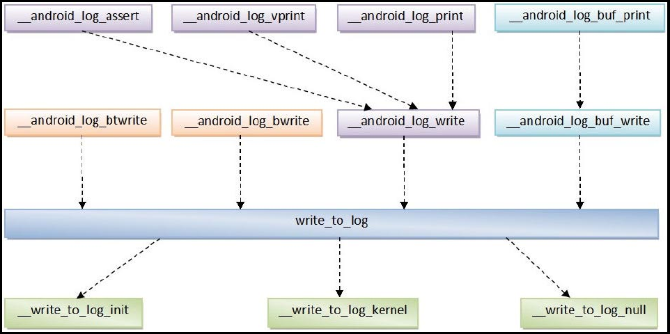
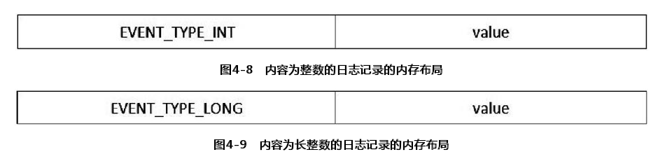
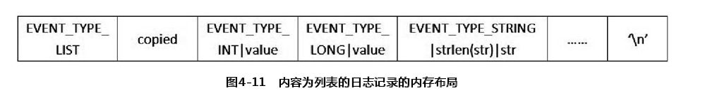

<!-- TOC -->

- [第4章  Logger 日志系统](#%E7%AC%AC4%E7%AB%A0--logger-%E6%97%A5%E5%BF%97%E7%B3%BB%E7%BB%9F)
    - [Logger 日志格式](#logger-%E6%97%A5%E5%BF%97%E6%A0%BC%E5%BC%8F)
    - [Logger 日志驱动程序](#logger-%E6%97%A5%E5%BF%97%E9%A9%B1%E5%8A%A8%E7%A8%8B%E5%BA%8F)
        - [基础数据结构](#%E5%9F%BA%E7%A1%80%E6%95%B0%E6%8D%AE%E7%BB%93%E6%9E%84)
            - [struct logger_entry](#struct-logger_entry)
            - [struct logger_log](#struct-logger_log)
            - [struct logger_reader](#struct-logger_reader)
        - [日志设备的初始化过程](#%E6%97%A5%E5%BF%97%E8%AE%BE%E5%A4%87%E7%9A%84%E5%88%9D%E5%A7%8B%E5%8C%96%E8%BF%87%E7%A8%8B)
        - [日志设备文件的打开过程](#%E6%97%A5%E5%BF%97%E8%AE%BE%E5%A4%87%E6%96%87%E4%BB%B6%E7%9A%84%E6%89%93%E5%BC%80%E8%BF%87%E7%A8%8B)
        - [日志记录的读取过程](#%E6%97%A5%E5%BF%97%E8%AE%B0%E5%BD%95%E7%9A%84%E8%AF%BB%E5%8F%96%E8%BF%87%E7%A8%8B)
        - [日志记录的写入过程](#%E6%97%A5%E5%BF%97%E8%AE%B0%E5%BD%95%E7%9A%84%E5%86%99%E5%85%A5%E8%BF%87%E7%A8%8B)
    - [运行时库层日志库](#%E8%BF%90%E8%A1%8C%E6%97%B6%E5%BA%93%E5%B1%82%E6%97%A5%E5%BF%97%E5%BA%93)
        - [__write_to_log_init](#__write_to_log_init)
        - [__write_to_log_kernel](#__write_to_log_kernel)
        - [__write_to_log_null](#__write_to_log_null)
        - [__android_log_write](#__android_log_write)
        - [__android_log_buf_write](#__android_log_buf_write)
        - [__android_log_vprint 、__android_log_print 、 __android_log_assert](#__android_log_vprint-__android_log_print--__android_log_assert)
        - [__android_log_buf_print](#__android_log_buf_print)
        - [__android_log_bwrite 、 __android_log_btwrite](#__android_log_bwrite--__android_log_btwrite)
    - [C/C++日志写入接口](#cc%E6%97%A5%E5%BF%97%E5%86%99%E5%85%A5%E6%8E%A5%E5%8F%A3)
        - [LOGV 、 LOGD 、 LOGI 、 LOGW 和 LOGE](#logv--logd--logi--logw-%E5%92%8C-loge)
        - [SLOGV 、 SLOGD 、 SLOGI 、 SLOGW 和 SLOGE](#slogv--slogd--slogi--slogw-%E5%92%8C-sloge)
        - [EVENT_TYPE_INT 、 EVENT_TYPE_LONG 和 EVENT_TYPE_STRING](#event_type_int--event_type_long-%E5%92%8C-event_type_string)
    - [Java日志写入接口](#java%E6%97%A5%E5%BF%97%E5%86%99%E5%85%A5%E6%8E%A5%E5%8F%A3)

<!-- /TOC -->

# 第4章  `Logger` 日志系统

`Android` 提供的 `Logger` 日志系统是基于内核中的 `Logger` 日志驱动程序实现的，它将日志记录保存在内核空间中。为了有效地利用内存空间， `Logger` 日志驱动程序在内部使用一个环形缓冲区来保存日志。因此，当 `Logger` 日志驱动程序中的环形缓冲区满了之后，新的日志就会覆盖旧的日志。

由于新的日志会覆盖旧的日志，因此， `Logger` 日志驱动程序根据日志的类型以及日志的输出量来对日志记录进行分类，避免重要的日志被不重要的日志覆盖，或者数据量大的日志覆盖数据量小的日志。日志的类型一共有四种，它们分别是 `main` 、 `system` 、 `radio` 和 `events` 。在 `Logger` 日志驱动程序中，这四种类型的日志分别通过 `/dev/log/main` 、 `/dev/log/system` 、 `/dev/log/radio` 和 `/dev/log/events` 四个设备文件来访问。
类型为 `main` 的日志是应用程序级别的，而类型为 `system` 的日志是系统级别的。由于系统级日志要比应用程序级日志重要，因此，把它们分开来记录，可以避免系统级日志被应用程序级日志覆盖。类型为 `radio` 的日志是与无线设备相关的，它们的量很大，因此，把它们单独记录在一起，可以避免它们覆盖其他类型的日志。类型为 `events` 的日志是专门用来诊断系统问题的，应用程序开发者不应该使用此种类型的日志。

`Android` 系统在应用程序框架层中提供了 `android.util.Log` 、 `android.util.Slog` 和 `android.util.EventLog` 三个 `Java` 接口来往 `Logger` 日志驱动程序中写入日志，它们写入的日志类型分别为 `main` 、 `system` 和 `events` 。特别地，如果使用 `android.util.Log` 和 `android.util.Slog` 接口写入的日志的标签值是以 `RIL` 开头或者等于 `HTC_RIL` 、 `AT` 、 `GSM` 、 `STK` 、 `CDMA` 、 `PHONE` 和 `SMS` 时，它们就会被转换为 `radio` 类型的日志写入到 `Logger`日志驱动程序中。相应地， `Android` 系统在运行时库层也提供了三组 `C/C++` 宏来往 `Logger` 日志驱动程序中写入日志。其中，宏 `LOGV` 、 `LOGD` 、 `LOGI` 、 `LOGW` 和 `LOGE` 用来写入 `main` 类型的日志，宏 `SLOGV` 、 `SLOGD` 、 `SLOGI` 、 `SLOGW` 和 `SLOGE` 用来写入 `system` 类型的日志，宏 `LOG_EVENT_INT` 、 `LOG_EVENT_LONG` 和 `LOG_EVENT_STRING` 用来写入 `events` 类型的日志。无论是 `Java` 日志写入接口还是 `C/C++` 日志写入接口，它们最终都是通过运行时库层的日志库 `liblog` 来往 `Logger`日志驱动程序中写入日志的。此外，系统还提供了一个 `Logcat` 工具来读取和显示 `Logger`日志驱动程序中的日志。

以上介绍的 `Logger` 日志系统框架可以通过图 `4-1` 来形象地描述。


在本章内容中，我们首先介绍 `Logger` 日志系统的日志格式，然后分析 `Logger` 日志驱动程序、运行时库层的日志库 `liblog` 、 `C/C++` 和 `Java` 日志写入接口的实现，最后分析日志读取工具 `Logcat` 的实现。

## 4.1　 `Logger` 日志格式
前面提到， `Logger` 日志一共划分为 `main` 、 `system` 、 `radio` 和 `events` 四种类型，其中，前面三种类型的日志格式是相同的，而第四种类型的日志格式稍有区别。下面我们就分别介绍它们的格式。

类型为 `main` 、 `system` 和 `radio` 的日志格式如图4-2所示。


其中， `priority` 表示日志优先级，它是一个整数； `tag` 表示日志标签，它是一个字符串； `msg` 表示日志内容，它也是一个字符串。日志优先级和日志标签可以在显示日志时作过滤字段使用。日志优先级按照重要程度一般划分为 `VERBOSE` 、 `DEBUG` 、 `INFO` 、 `WARN` 、 `ERROR` 和 `FATAL` 六种。

类型为 `events` 的日志格式如图 `4-3` 所示。


其中， `tag` 表示日志标签，它是一个整数； `msg` 表示日志内容，它是一块二进制数据，它的内容格式是由日志写入者来决定的。一般来说，这些日志内容是由一个或者多个值组成的，每个值的前面都有一个字段来描述它的类型，如图 `4-4` 所示。


其中，值的类型为整数（ `int` ）、长整数（ `long` ）、字符串（ `string` ）或者列表（ `list` ），它们分别使用数字 `1` 、 `2` 、 `3` 和 `4` 来描述。

由于 `events` 类型的日志标签是一个整数值，在显示时不具有可读性，因此， `Android` 系统使用设备上的日志标签文件 `/system/etc/event-log-tags` 来描述这些标签值的含义。这样， `Logcat` 工具在显示 `events` 类型的日志时，就可以把日志中的标签值转换为字符串。此外，该日志标签文件还用来描述 `events` 类型的日志内容的格式，它的格式如图 `4-5` 所示。


其中，第一个字段 `tag number` 表示日志标签值，它的取值范围为 `0～2147483648` ；第二个字段 `tag name` 是日志标签值对应的字符串描述，它是由字母 `[A-Z][a-z]` 、数字 `[0-9]` 或者下画线 `_` 组成的；第三个字段用来描述组成日志内容的值格式，如图 `4-6` 所示。


其中， `name` 表示日志内容值的名称； `data type` 表示日志内容值的数据类型，它的取值范围为 `1～4` ，分别表示整数（ `int` ）、长整数（ `long` ）、字符串（ `string` ）和列表（ `list` ）； `data unit` 表示日志内容值的数据单位，它的取值范围是 `1～6` ，分别表示对象数量（ `number of objects` ）、字节数（ `Number of bytes` ）、毫秒数（ `Number of milliseconds` ）、分配额（ `Number of allocations` ）、标志（ `ID` ）和百分比（ `Percent` ）。

最后，我们从Android模拟器上的日志标签文件 `/system/etc/event-log-tags` 中取出一行内容来说明类型为 `events` 的日志格式，如下所示。

```
2722 battery_level (level|1|6),(voltage|1|1),(temperature|1|1)
```

其中， `2722` 表示日志标签值，而 `battery_level` 用来描述日志标签值 `2722` 的含义。此外，从 `battery_level` 后面的内容可以看出，日志标签值等于 `2722` 的日志内容由三个值组成，它们分别是 `level` 、 `voltage` 和 `temperature` ，对应的数据类型都是整数（ `int` ），但是 `level` 的单位是百分比（ `6` ）， `voltage` 和 `temperature` 的单位均为对象数量（ `1` ）。

## 4.2  `Logger` 日志驱动程序

 `Logger` 日志驱动程序实现在系统的内核空间中，它的目录结构如下 : 

```bash
~/Android/kernel/goldfish
---- drivers
    ---- staging
        ---- android
            ---- logger.h
            ---- logger.c
```
它主要由 `logger.h` 和 `logger.c` 两个源文件组成。在本节接下来的内容中，我们首先介绍 `Logger` 日志驱动程序的基础数据结构，然后分别介绍日志设备的初始化、打开、读取和写入过程。

### 4.2.1 基础数据结构

 `Logger` 日志驱动程序主要使用到了 `Logger_entry` 、 `logger_log` 和 `logger_reader` 三个结构体。下面我们就详细描述它们的定义。 

#### struct logger_entry

`kernel/goldfish/drivers/staging/android/logger.h`
```cpp
struct logger_entry {
	__u16		len;	/* length of the payload */
	__u16		__pad;	/* no matter what, we get 2 bytes of padding */
	__s32		pid;	/* generating process's pid */
	__s32		tid;	/* generating process's tid */
	__s32		sec;	/* seconds since Epoch */
	__s32		nsec;	/* nanoseconds */
	char		msg[0];	/* the entry's payload */
};

#define LOGGER_ENTRY_MAX_LEN		(4*1024)
#define LOGGER_ENTRY_MAX_PAYLOAD	\
	(LOGGER_ENTRY_MAX_LEN - sizeof(struct logger_entry))
```

结构体 `logger_entry` 用来描述一个日志记录。每一个日志记录的最大长度为 `4K` ，其中，日志记录的有效负载长度最大等于 `4K` 减去结构体 `logger_entry` 的大小。成员变量 `len` 表示实际的日志记录的有效负载长度；成员变量 `__pad` 没有实际意义，是用来将成员变量 `pid` 的地址值对齐到 `4` 字节边界的；成员变量 `pid` 和 `tid` 记录写入该日志记录的进程的 `TGID` 和 `PID` ，即线程组 `ID` 和进程 `ID` ；成员变量 `sec` 和 `nsec` 记录写入该日志记录的时间，它们是用标准基准时间（ `Epoch` ）来描述的；成员变量 `msg` 记录的是实际写入的日志记录内容，它的长度是可变的，由成员变量 `len` 决定。

#### struct logger_log

`kernel/goldfish/drivers/staging/android/logger.c`
```cpp
/*
 * struct logger_log - represents a specific log, such as 'main' or 'radio'
 *
 * This structure lives from module insertion until module removal, so it does
 * not need additional reference counting. The structure is protected by the
 * mutex 'mutex'.
 */
struct logger_log {
	unsigned char *		buffer;	/* the ring buffer itself */
	struct miscdevice	misc;	/* misc device representing the log */
	wait_queue_head_t	wq;	/* wait queue for readers */
	struct list_head	readers; /* this log's readers */
	struct mutex		mutex;	/* mutex protecting buffer */
	size_t			w_off;	/* current write head offset */
	size_t			head;	/* new readers start here */
	size_t			size;	/* size of the log */
};
```
结构体 `logger_log` 用来描述一个日志缓冲区。在 `Logger` 日志驱动程序中，每一种类型的日志都对应有一个单独的日志缓冲区。成员变量 `buffer` 指向一个内核缓冲区，用来保存日志记录，它是循环使用的，大小由成员变量 `size` 决定；成员变量 `misc` 的类型为 `miscdevice` ，用来描述一个日志设备；成员变量 `wq` 是一个等待队列，用来记录那些正在等待读取新的日志记录的进程；成员变量 `readers` 是一个列表，用来记录那些正在读取日志记录的进程，每一个进程都使用一个结构体 `logger_reader` 来描述；成员变量 `mutex` 是一个互斥量，用来保护日志缓冲区的并发访问；成员变量 `w_off` 表示下一条要写入的日志记录在日志缓冲区中的位置；成员变量 `head` 表示当一个新的进程读取日志时，它应该从日志缓冲区中的什么位置开始读取。 

#### struct logger_reader

`kernel/goldfish/drivers/staging/android/logger.c`

```cpp
/*
 * struct logger_reader - a logging device open for reading
 *
 * This object lives from open to release, so we don't need additional
 * reference counting. The structure is protected by log->mutex.
 */
struct logger_reader {
	struct logger_log *	log;	/* associated log */
	struct list_head	list;	/* entry in logger_log's list */
	size_t			r_off;	/* current read head offset */
};
```
结构体 `logger_reader` 用来描述一个正在读取某一个日志缓冲区的日志记录的进程。成员变量 `log` 指向要读取的日志缓冲区结构体；成员变量 `list` 是一个列表项，用来连接所有读取同一种类型日志记录的进程；成员变量 `r_off` 表示当前进程要读取的下一条日志记录在日志缓冲区中的位置。

### 4.2.2　日志设备的初始化过程

日志设备的初始化过程是在 `Logger` 日志驱动程序的入口函数 `logger_init` 中进行的。在分析这个函数之前，我们首先介绍三个结构体变量 `log_main` 、 `log_events` 和 `log_radio` ，它们的类型均为 `struct logger` ，分别用来保存 `main` 、 `events` 和 `radio` 三种类型的日志记录，如下所示。

`kernel/goldfish/drivers/staging/android/logger.c`
```cpp
/*
 * Defines a log structure with name 'NAME' and a size of 'SIZE' bytes, which
 * must be a power of two, greater than LOGGER_ENTRY_MAX_LEN, and less than
 * LONG_MAX minus LOGGER_ENTRY_MAX_LEN.
 */
#define DEFINE_LOGGER_DEVICE(VAR, NAME, SIZE) \
static unsigned char _buf_ ## VAR[SIZE]; \
static struct logger_log VAR = { \
	.buffer = _buf_ ## VAR, \
	.misc = { \
		.minor = MISC_DYNAMIC_MINOR, \
		.name = NAME, \
		.fops = &logger_fops, \
		.parent = NULL, \
	}, \
	.wq = __WAIT_QUEUE_HEAD_INITIALIZER(VAR .wq), \
	.readers = LIST_HEAD_INIT(VAR .readers), \
	.mutex = __MUTEX_INITIALIZER(VAR .mutex), \
	.w_off = 0, \
	.head = 0, \
	.size = SIZE, \
};

DEFINE_LOGGER_DEVICE(log_main, LOGGER_LOG_MAIN, 64*1024)
DEFINE_LOGGER_DEVICE(log_events, LOGGER_LOG_EVENTS, 256*1024)
DEFINE_LOGGER_DEVICE(log_radio, LOGGER_LOG_RADIO, 64*1024)
```
结构体变量 `log_main` 、 `log_events` 和 `log_radio` 都是通过宏 `DEFINE_LOGGER_DEVICE` 来定义的，需要传入的三个参数分别为变量名、设备文件路径，以及要分配的日志缓冲区的大小。前面提到， `Logger` 日志系统将日志记录划分为四种类型。从理论上说，每一种类型的日志记录都应该对应有一个日志缓冲区，即在 `Logger` 日志驱动程序中对应有一个 `logger_log` 结构体，但是在目前的 `Logger` 日志驱动程序实现中，只定义了三个日志缓冲区，其中，类型为 `system` 和 `main` 的日志记录保存在同一个日志缓冲区 `log_main` 中，而类型为 `events` 和 `radio` 的日志记录分别保存在日志缓冲区 `log_events` 和 `log_radio` 中。

从宏 `DEFINE_LOGGER_DEVICE` 的定义可以看出，每一种类型的日志缓冲区都是将各自的日志记录保存在一个静态分配的 `unsigned char` 数组中，数组的大小由参数 `SIZE` 决定，其中，类型为 `main` 和 `radio` 的日志缓冲区的大小为 `64K` ，而类型为 `events` 的日志缓冲区的大小为 `256K` 。

每一个日志缓冲区都对应有一个 `misc` 类型的日志设备，以便运行在用户空间的程序可以访问它们。每一个日志设备都对应有一个文件名，它是由参数 `NAME` 指定的。从结构体变量 `log_main` 、 `log_events` 和 `log_radio` 的定义可以看出，类型为 `main` 、 `radio` 和 `events` 的日志缓冲区对应的日志设备文件分别为 `LOGGER_LOG_MAIN` 、 `LOGGER_LOG_RADIO` 和 `LOGGER_LOG_EVENTS` 。

`kernel/goldfish/drivers/staging/android/logger.h`
```cpp
#define LOGGER_LOG_RADIO	"log_radio"	/* radio-related messages */
#define LOGGER_LOG_EVENTS	"log_events"	/* system/hardware events */
#define LOGGER_LOG_MAIN		"log_main"	/* everything else */
```
`Logger` 日志驱动程序初始化完成之后，我们就可以在 `/dev/log` 目录下看到三个日志设备文件 `main` 、 `events` 和 `radio` 。这三个日志设备对应的文件操作函数表均为 `logger_fops` ，它的定义如下所示。

`kernel/goldfish/drivers/staging/android/logger.c`
```cpp
static struct file_operations logger_fops = {
	.owner = THIS_MODULE,
	.read = logger_read,
	.aio_write = logger_aio_write,
	.poll = logger_poll,
	.unlocked_ioctl = logger_ioctl,
	.compat_ioctl = logger_ioctl,
	.open = logger_open,
	.release = logger_release,
};
```
文件操作函数表 `logger_fops` 指定的日志设备文件操作函数比较多，但是我们只关注日志设备打开、读取和写入函数 `open` 、 `read` 和 `aio_write` 的定义，它们分别被设置为 `logger_open` 、 `logger_read` 和 `logger_aio_write` 函数。

每一个硬件设备都有自己的主设备号和从设备号。由于日志设备的类型为 `misc` ，并且同一类型的设备都具有相同的主设备号，因此，在定义这些日志设备时，就不需要指定它们的主设备号了，等到注册这些日志设备时，再统一指定。从宏 `DEFINE_LOGGER_DEVICE` 的定义可以看出，这些日志设备的从设备号被设置为 `MISC_DYNAMIC_MINOR` ，表示由系统动态分配，它的定义如下所示。

`kernel/goldfish/include/linux/miscdevice.h`
```cpp
#define MISC_DYNAMIC_MINOR	255
```
一般来说，我们在开发驱动程序时，都不应该去静态指定设备的从设备号，因为静态指定的从设备号会比较容易发生冲突，而动态分配的从设备号能够保证唯一性。

结构体变量 `log_main` 、 `log_events` 和 `log_radio` 的其余成员变量的初始化过程都比较简单，这里就不详细介绍了。例如，它们的成员变量 `wq` 、 `reader` 和 `mutex` 分别使用宏 `__WAIT_QUEUE_HEAD_INITIALIZER` 、 `LIST_HEAD_INIT` 和 `__MUTEX_INITIALIZER` 来初始化，因为它们的类型分别为等待队列、队列和互斥量。

我们就从函数 `logger_init` 开始，分析日志设备的初始化过程。

`kernel/goldfish/drivers/staging/android/logger.c`
```cpp
static int __init logger_init(void)
{
	int ret;

	ret = init_log(&log_main);
	if (unlikely(ret))
		goto out;

	ret = init_log(&log_events);
	if (unlikely(ret))
		goto out;

	ret = init_log(&log_radio);
	if (unlikely(ret))
		goto out;

out:
	return ret;
}
```
日志设备的初始化过程实际上就是将三个日志设备注册到系统中，这是分别通过调用函数 `init_log` 来实现的。

`kernel/goldfish/drivers/staging/android/logger.c`
```cpp
static int __init init_log(struct logger_log *log)
{
	int ret;

	ret = misc_register(&log->misc);
	if (unlikely(ret)) {
		printk(KERN_ERR "logger: failed to register misc "
		       "device for log '%s'!\n", log->misc.name);
		return ret;
	}

	printk(KERN_INFO "logger: created %luK log '%s'\n",
	       (unsigned long) log->size >> 10, log->misc.name);

	return 0;
}
```
在 `init_log` 函数中，主要是通过调用 `misc_register` 函数将相应的日志设备注册到系统中。

`kernel/goldfish/drivers/char/misc.c`
```cpp
01 int misc_register(struct miscdevice * misc)
02 {
03 	struct miscdevice *c;
04 	dev_t dev;
05 	int err = 0;
06 
07 	INIT_LIST_HEAD(&misc->list);
08 
09 	mutex_lock(&misc_mtx);
10 	list_for_each_entry(c, &misc_list, list) {
11 		if (c->minor == misc->minor) {
12 			mutex_unlock(&misc_mtx);
13 			return -EBUSY;
14 		}
15 	}
16 
17 	if (misc->minor == MISC_DYNAMIC_MINOR) {
18 		int i = DYNAMIC_MINORS;
19 		while (--i >= 0)
20 			if ( (misc_minors[i>>3] & (1 << (i&7))) == 0)
21 				break;
22 		if (i<0) {
23 			mutex_unlock(&misc_mtx);
24 			return -EBUSY;
25 		}
26 		misc->minor = i;
27 	}
28 
29 	if (misc->minor < DYNAMIC_MINORS)
30 		misc_minors[misc->minor >> 3] |= 1 << (misc->minor & 7);
31 	dev = MKDEV(MISC_MAJOR, misc->minor);
32 
33 	misc->this_device = device_create(misc_class, misc->parent, dev, NULL,
34 					  "%s", misc->name);
35 	if (IS_ERR(misc->this_device)) {
36 		err = PTR_ERR(misc->this_device);
37 		goto out;
38 	}
39 
40 	/*
41 	 * Add it to the front, so that later devices can "override"
42 	 * earlier defaults
43 	 */
44 	list_add(&misc->list, &misc_list);
45  out:
46 	mutex_unlock(&misc_mtx);
47 	return err;
48 }
```
系统中所有的 `misc` 设备都保存在一个 `misc_list` 列表中。函数第 `10` 行到第 `15` 行检查所要注册的 `misc` 设备的从设备号是否已经被注册。如果是的话，注册就失败了，因为同一类型设备的从设备号是不能相同的。由于 `Logger` 日志驱动程序已经指定它所要注册的日志设备的从设备号是动态分配的，即指定为 `MISC_DYNAMIC_MINOR` ，因此，这一步检查就通过了。

函数第 `17` 行到第 `27` 行为所要注册的日志设备分配从设备号。系统可分配的 `misc` 从设备号一共有 `64` 个，即从 `0` 到 `63` 。这些从设备号的使用情况记录在数组 `misc_minors` 中，它的定义如下所示。

`kernel/goldfish/drivers/char/misc.c`
```cpp
#define DYNAMIC_MINORS 64 /* like dynamic majors */
static unsigned char misc_minors[DYNAMIC_MINORS / 8];
```
数组 `misc_minors` 的类型为 `unsigned char` ，因此，每一个元素可以管理 `8` 个从设备号， `64` 个从设备号就需要 `8` 个元素，即数组 `misc_minors` 的大小为 `8` 。如果某一个从设备号已经被分配了，那么它在数组 `misc_minors` 中所对应的位就等于 `1` ，否则就等于 `0` 。如何在数组 `misc_minors` 中找到从设备号 `i` 所对应的位呢？首先找到它对应的数组元素位置，即 `i>>3` ，然后取出从设备号 `i` 的低三位，即 `i&7` ，那么从设备号 `i` 在数组 `misc_minors` 中对应的位便是第 `i>>3` 个元素的第 `i&7` 位了。因此，第 `20` 行只要检查这一位是否等于 `0` ，就可以知道从设备号 `i` 是否已经被分配了。如果没有被分配，那么第 `26` 行就将它分配给当前正在注册的日志设备，接着第 `30` 行在数组 `misc_minors` 中记录该从设备号已经被分配。

函数第 `31` 行使用 `misc` 主设备号 `MISC_MAJOR` 和前面得到的从设备号来创建一个设备号对象 `dev` ，接着第 `33` 行以它为参数调用函数 `device_create` 将日志设备 `misc` 注册到系统中。 `MISC_MAJOR` 是一个宏，它的定义如下所示。

`kernel/goldfish/include/linux/major.h`
```cpp
#define MISC_MAJOR		10
```
日志设备注册成功之后，函数第 `44` 行就将它添加到 `misc` 设备列表 `misc_list` 中，表示日志设备注册成功了。

第 `33` 行调用 `device_create` 函数注册日志设备时，最后一个参数用来指定日志设备的名称，即它在设备系统目录 `/dev` 中对应的文件名称。从前面的调用过程可以知道，我们要注册的三个日志设备的名称分别为 `log_main` 、 `log_events` 和 `log_radio` ，因此，应当在设备上的 `/dev` 目录中看到 `log_main` 、 `log_events` 和 `log_radio` 三个文件。然而，在本章的开头提到，这三个日志设备对应的文件分别为 `/dev/log/main` 、 `/dev/log/events` 和 `/dev/log/radio` ，这是为什么呢？

在前面的 `2.3.4` 小节中提到， `Android` 系统使用一种 `uevent` 机制来管理系统的设备文件。当 `Logger` 日志驱动程序注册一个日志设备时，内核就会发出一个 `uevent` 事件，这个 `uevent` 最终由 `init` 进程中的 `handle_device_event` 函数来处理，它的实现如下所示。

`system/core/init/devices.c`
```cpp
static void handle_device_event(struct uevent *uevent)
{
    char devpath[96];
    int devpath_ready = 0;
    char *base, *name;
    char **links = NULL;
    int block;
    int i;

    if (!strcmp(uevent->action,"add"))
        fixup_sys_perms(uevent->path);

        /* if it's not a /dev device, nothing else to do */
    if((uevent->major < 0) || (uevent->minor < 0))
        return;

        /* do we have a name? */
    name = strrchr(uevent->path, '/');
    if(!name)
        return;
    name++;

        /* too-long names would overrun our buffer */
    if(strlen(name) > 64)
        return;

        /* are we block or char? where should we live? */
    if(!strncmp(uevent->subsystem, "block", 5)) {
        block = 1;
        base = "/dev/block/";
        mkdir(base, 0755);
        if (!strncmp(uevent->path, "/devices/platform/", 18))
            links = parse_platform_block_device(uevent);
    } else {
        block = 0;
            /* this should probably be configurable somehow */
        if (!strncmp(uevent->subsystem, "usb", 3)) {
            if (!strcmp(uevent->subsystem, "usb")) {
                /* This imitates the file system that would be created
                 * if we were using devfs instead.
                 * Minors are broken up into groups of 128, starting at "001"
                 */
                int bus_id = uevent->minor / 128 + 1;
                int device_id = uevent->minor % 128 + 1;
                /* build directories */
                mkdir("/dev/bus", 0755);
                mkdir("/dev/bus/usb", 0755);
                snprintf(devpath, sizeof(devpath), "/dev/bus/usb/%03d", bus_id);
                mkdir(devpath, 0755);
                snprintf(devpath, sizeof(devpath), "/dev/bus/usb/%03d/%03d", bus_id, device_id);
                devpath_ready = 1;
            } else {
                /* ignore other USB events */
                return;
            }
        } else if (!strncmp(uevent->subsystem, "graphics", 8)) {
            base = "/dev/graphics/";
            mkdir(base, 0755);
        } else if (!strncmp(uevent->subsystem, "oncrpc", 6)) {
            base = "/dev/oncrpc/";
            mkdir(base, 0755);
        } else if (!strncmp(uevent->subsystem, "adsp", 4)) {
            base = "/dev/adsp/";
            mkdir(base, 0755);
        } else if (!strncmp(uevent->subsystem, "msm_camera", 10)) {
            base = "/dev/msm_camera/";
            mkdir(base, 0755);
        } else if(!strncmp(uevent->subsystem, "input", 5)) {
            base = "/dev/input/";
            mkdir(base, 0755);
        } else if(!strncmp(uevent->subsystem, "mtd", 3)) {
            base = "/dev/mtd/";
            mkdir(base, 0755);
        } else if(!strncmp(uevent->subsystem, "sound", 5)) {
            base = "/dev/snd/";
            mkdir(base, 0755);
        } else if(!strncmp(uevent->subsystem, "misc", 4) &&
                    !strncmp(name, "log_", 4)) {
            base = "/dev/log/";
            mkdir(base, 0755);
            name += 4;
        } else
            base = "/dev/";
    }

    if (!devpath_ready)
        snprintf(devpath, sizeof(devpath), "%s%s", base, name);

    if(!strcmp(uevent->action, "add")) {
        make_device(devpath, uevent->path, block, uevent->major, uevent->minor);
        if (links) {
            for (i = 0; links[i]; i++)
                make_link(devpath, links[i]);
        }
    }

    if(!strcmp(uevent->action, "remove")) {
        if (links) {
            for (i = 0; links[i]; i++)
                remove_link(devpath, links[i]);
        }
        unlink(devpath);
    }

    if (links) {
        for (i = 0; links[i]; i++)
            free(links[i]);
        free(links);
    }
}
```
函数 `handle_device_event` 如果发现新注册的设备类型为 `misc` ，并且设备名称是以 `log_` 开头的，它便会在 `/dev` 目录中创建一个 `log` 目录，接着将设备名称的前四个字符去掉，即去掉前面的 `log_` 子字符串，最后就使用新的设备名称在 `/dev/log` 目录下创建一个设备文件。因此，我们就不会在设备上的 `/dev` 目录中看到 `log_main` 、 `log_events` 和 `log_radio` 三个设备文件，而是在 `/dev/log` 目录中看到 `main` 、 `events` 和 `radio` 三个设备文件。

### 4.2.3　日志设备文件的打开过程
在从 `Logger` 日志驱动程序读取或者写入日志记录之前，首先要调用函数 `open` 来打开对应的日志设备文件。在 `Logger` 日志驱动程序中，日志设备文件的打开函数定义为 `logger_open` ，它的实现如下所示。

`kernel/goldfish/drivers/staging/android/logger.c`
```cpp
01 /*
02  * logger_open - the log's open() file operation
03  *
04  * Note how near a no-op this is in the write-only case. Keep it that way!
05  */
06 static int logger_open(struct inode *inode, struct file *file)
07 {
08 	struct logger_log *log;
09 	int ret;
10 
11 	ret = nonseekable_open(inode, file);
12 	if (ret)
13 		return ret;
14 
15 	log = get_log_from_minor(MINOR(inode->i_rdev));
16 	if (!log)
17 		return -ENODEV;
18 
19 	if (file->f_mode & FMODE_READ) {
20 		struct logger_reader *reader;
21 
22 		reader = kmalloc(sizeof(struct logger_reader), GFP_KERNEL);
23 		if (!reader)
24 			return -ENOMEM;
25 
26 		reader->log = log;
27 		INIT_LIST_HEAD(&reader->list);
28 
29 		mutex_lock(&log->mutex);
30 		reader->r_off = log->head;
31 		list_add_tail(&reader->list, &log->readers);
32 		mutex_unlock(&log->mutex);
33 
34 		file->private_data = reader;
35 	} else
36 		file->private_data = log;
37 
38 	return 0;
39 }
```
函数第 `11` 行调用函数 `nonseekable_open` 将相应的设备文件设置为不可随机访问，即不可以调用函数 `lseek` 来设置设备文件的当前读写位置，因为日志记录的读取或者写入都必须按顺序来进行。

函数第 `15` 行调用函数 `get_log_from_minor` 根据从设备号获得要操作的日志缓冲区结构体。

`kernel/goldfish/drivers/staging/android/logger.c`
```cpp
static struct logger_log * get_log_from_minor(int minor)
{
	if (log_main.misc.minor == minor)
		return &log_main;
	if (log_events.misc.minor == minor)
		return &log_events;
	if (log_radio.misc.minor == minor)
		return &log_radio;
	return NULL;
}
```
回到函数 `logger_open` 中，对于以写模式打开日志设备的情况，函数 `logger_open` 只是把前面获得的日志缓冲区结构体 `log` 保存在参数 `file` 的成员变量 `private_data` 中就结束了；而对于以读模式打开日志设备的情况，函数 `logger_open` 的处理就相对复杂一些。函数 `logger_open` 首先会为当前进程创建一个 `logger_reader` 结构体 `reader` ，并且对它进行初始化，其中，最重要的是第 `30` 行告诉该进程从 `log->head` 位置开始读取日志记录，然后把前面获得的日志缓冲区结构体 `log` 保存在结构体 `reader` 的成员变量 `log` 中，并且把结构体 `reader` 保存在参数 `file` 的成员变量 `private_data` 中。

### 4.2.4　日志记录的读取过程
当进程调用 `read` 函数从日志设备读取日志记录时， `Logger` 日志驱动程序中的函数 `logger_read` 就会被调用从相应的日志缓冲区中读取日志记录。

`kernel/goldfish/drivers/staging/android/logger.c`
```cpp
01 /*
02  * logger_read - our log's read() method
03  *
04  * Behavior:
05  *
06  * 	- O_NONBLOCK works
07  * 	- If there are no log entries to read, blocks until log is written to
08  * 	- Atomically reads exactly one log entry
09  *
10  * Optimal read size is LOGGER_ENTRY_MAX_LEN. Will set errno to EINVAL if read
11  * buffer is insufficient to hold next entry.
12  */
13 static ssize_t logger_read(struct file *file, char __user *buf,
14 			   size_t count, loff_t *pos)
15 {
16 	struct logger_reader *reader = file->private_data;
17 	struct logger_log *log = reader->log;
18 	ssize_t ret;
19 	DEFINE_WAIT(wait);
20 
21 start:
22 	while (1) {
23 		prepare_to_wait(&log->wq, &wait, TASK_INTERRUPTIBLE);
24 
25 		mutex_lock(&log->mutex);
26 		ret = (log->w_off == reader->r_off);
27 		mutex_unlock(&log->mutex);
28 		if (!ret)
29 			break;
30 
31 		if (file->f_flags & O_NONBLOCK) {
32 			ret = -EAGAIN;
33 			break;
34 		}
35 
36 		if (signal_pending(current)) {
37 			ret = -EINTR;
38 			break;
39 		}
40 
41 		schedule();
42 	}
43 
44 	finish_wait(&log->wq, &wait);
45 	if (ret)
46 		return ret;
47 
48 	mutex_lock(&log->mutex);
49 
50 	/* is there still something to read or did we race? */
51 	if (unlikely(log->w_off == reader->r_off)) {
52 		mutex_unlock(&log->mutex);
53 		goto start;
54 	}
55 
56 	/* get the size of the next entry */
57 	ret = get_entry_len(log, reader->r_off);
58 	if (count < ret) {
59 		ret = -EINVAL;
60 		goto out;
61 	}
62 
63 	/* get exactly one entry from the log */
64 	ret = do_read_log_to_user(log, reader, buf, ret);
65 
66 out:
67 	mutex_unlock(&log->mutex);
68 
69 	return ret;
70 }
```
函数第 `16` 行得到日志记录读取进程结构体 `reader` ，而第 `17` 行得到日志缓冲区结构体 `log` 。在前面的 `4.2.3` 小节中提到，当进程以读模式打开相应的日志设备时， `Logger` 日志驱动程序就会将上述两个结构体信息保存在打开文件结构体参数 `file` 的成员变量 `private_data` 中，因此，函数第 `16` 行和第 `17` 行就可以安全地将它们获取回来。

函数第 `22` 行到第 `42` 行的 `while` 循环用来检查日志缓冲区结构体 `log` 中是否有日志记录可读取，这主要是通过第 `26` 行代码来判断的。在进入第 `22` 行到第 `42` 行的 `while` 循环时，第 `23` 行首先调用函数 `prepare_to_wait` 将等待队列项 `wait` 加入日志记录读取进程的等待队列 `log->wq` 中。等到确认日志缓冲区结构体 `log` 有日志记录可读或者其他原因跳出该 `while` 循环时，第 `44` 行就会调用函数 `finish_wait` 将等待队列项 `wait` 从日志记录读取进程的等待队列 `log->wq` 中移除。

日志缓冲区结构体 `log` 的成员变量 `w_off` 用来描述下一条新写入的日志记录在日志缓冲区中的位置，而日志记录读取进程结构体 `reader` 的成员变量 `r_off` 用来描述当前进程下一条要读取的日志记录在日志缓冲区中的位置。当这两者相等时，就说明日志缓冲区结构体 `log` 中没有新的日志记录可读，因此， `Logger` 日志驱动程序就会继续执行第 `22` 行到第 `42` 行的 `while` 循环来等待写入新的日志记录。如果日志缓冲区结构体 `log` 中有新的日志记录可读，那么第 `26` 行得到的变量 `ret` 的值就为 `false` ，因此，第 `29` 行就会跳出第 `22` 行到第 `42` 行的 `while` 循环，准备读取日志缓冲区结构体 `log` 中的日志记录。

如果日志缓冲区结构体 `log` 中没有日志记录可读，即第 `26` 行得到的变量 `ret` 为 `true` ，那么当前进程就有可能需要进入睡眠状态，直到日志缓冲区结构体 `log` 中有新的日志记录可读为止。当前进程是通过调用第 `41` 行的函数 `schedule` 来请求内核进行一次进程调度，从而进入睡眠状态的。但是有一种特殊情况——当前进程是以非阻塞模式来打开日志设备文件，即第 `31` 行的 `if` 语句为 `true` 时，当前进程就不会因为日志缓冲区结构体 `log` 中没有日志记录可读而进入睡眠状态，它直接返回到用户空间中。一般来说，当驱动程序决定使当前进程进入睡眠状态之前，要先通过调用函数 `signal_pending` 来检查当前进程是否有信号正在等待处理。如果有的话，即第 `36` 行的 `if` 语句为 `true` ，那么这时候驱动程序就不能使当前进程进入睡眠状态，而必须要让它结束当前系统调用，以便它可以立即返回去处理那些待处理信号。

如果日志缓冲区结构体 `log` 中有日志记录可读，那么 `Logger` 日志驱动程序就会跳出第 `22` 行到第 `42` 行的 `while` 循环。但是执行到第 `51` 行时，又会再次重新判断日志缓冲区结构体 `log` 的成员变量 `w_off` 和日志读取进程结构体 `reader` 的成员变量 `r_off` 是否相等。这是因为在执行第 `48` 行代码来获取互斥量 `log->mutex` 时，可能会失败。在这种情况下，当前进程就会进入睡眠状态，直到成功获取互斥量 `log->mutex` 为止。在当前进程的睡眠过程中，日志缓冲区结构体 `log` 中的日志记录可能已经被其他进程访问过了，即 `log->w_off` 的值可能已经发生了变化。因此，第 `51` 行需要重新判断日志缓冲区结构体 `log` 的成员变量 `w_off` 和日志读取进程结构体 `reader` 的成员变量 `r_off` 是否相等。

第 `51` 行再次确认日志缓冲区结构体 `log` 中有新的日志记录可读之后，接着第 `57` 行就调用函数 `get_entry_len` 来得到下一条要读取的日志记录的长度。

`kernel/goldfish/drivers/staging/android/logger.c`
```cpp
/*
 * get_entry_len - Grabs the length of the payload of the next entry starting
 * from 'off'.
 *
 * Caller needs to hold log->mutex.
 */
static __u32 get_entry_len(struct logger_log *log, size_t off)
{
	__u16 val;

	switch (log->size - off) {
	case 1:
		memcpy(&val, log->buffer + off, 1);
		memcpy(((char *) &val) + 1, log->buffer, 1);
		break;
	default:
		memcpy(&val, log->buffer + off, 2);
	}

	return sizeof(struct logger_entry) + val;
}
```
在 `4.2.1` 小节中介绍日志记录结构体 `logger_entry` 时提到，每一条日志记录都是由两部分内容组成的，其中一部分内容用来描述日志记录，即结构体 `logger_entry` 本身所占据的内容；另一部分内容是日志记录的有效负载，即真正的日志记录内容。由于结构体 `logger_entry` 的大小是固定的，因此只要知道它的有效负载长度，就可以通过计算得到一条日志记录的长度。日志记录结构体 `logger_entry` 的有效负载长度记录在它的成员变量 `len` 中。由于成员变量 `len` 是日志记录结构体 `logger_entry` 的第一个成员变量，因此，它们的起始地址是相同的。又由于日志记录结构体 `logger_entry` 的成员变量 `len` 的类型为 `__u16` ，因此，只要读取该结构体变量地址的前两个字节的内容就可以知道对应的日志记录的长度。我们知道，日志缓冲区是循环使用的，因此，一条日志记录的前两个字节有可能分别保存在日志缓冲区的首尾字节中。因此，在计算一条日志记录的长度时，需要分两种情况来考虑。第一种情况是该日志记录的前两个字节是连在一起的；第二种情况就是前两个字节分别保存在日志缓冲区的首字节和尾字节中。

在函数 `get_entry_len` 中，第 `11` 行将日志缓冲区结构体 `log` 的总长度 `size` 减去下一条要读取的日志记录的位置 `off` 。如果得到的结果等于 `1` ，那么就说明该日志记录的长度值分别保存在日志缓冲区的首尾字节中，因此，第 `13` 行和第 `14` 行就将它的前后两个字节从日志缓冲区的尾字节和首字节中读取出来，并且将它们的内容组合在变量 `val` 中。如果得到的结果不等于 `1` ，那么就说明该日志记录的长度值保存在两个连在一起的字节中，即保存在地址 `log->buffer+off` 中，因此，第 `17` 行就直接将日志记录的长度值读取出来，并且保存在变量 `val` 中。最后，第 `20` 行将变量 `val` 的值加上结构体 `logger_entry` 的大小，就得到下一条要读取的日志记录的总长度了。

回到 `logger_read` 函数中，第 `64` 行调用函数 `do_read_log_to_user` 执行真正的日志记录读取操作。

`kernel/goldfish/drivers/staging/android/logger.c`
```cpp
01 /*
02  * do_read_log_to_user - reads exactly 'count' bytes from 'log' into the
03  * user-space buffer 'buf'. Returns 'count' on success.
04  *
05  * Caller must hold log->mutex.
06  */
07 static ssize_t do_read_log_to_user(struct logger_log *log,
08 				   struct logger_reader *reader,
09 				   char __user *buf,
10 				   size_t count)
11 {
12 	size_t len;
13 
14 	/*
15 	 * We read from the log in two disjoint operations. First, we read from
16 	 * the current read head offset up to 'count' bytes or to the end of
17 	 * the log, whichever comes first.
18 	 */
19 	len = min(count, log->size - reader->r_off);
20 	if (copy_to_user(buf, log->buffer + reader->r_off, len))
21 		return -EFAULT;
22 
23 	/*
24 	 * Second, we read any remaining bytes, starting back at the head of
25 	 * the log.
26 	 */
27 	if (count != len)
28 		if (copy_to_user(buf + len, log->buffer, count - len))
29 			return -EFAULT;
30 
31 	reader->r_off = logger_offset(reader->r_off + count);
32 
33 	return count;
34 }
```
由于一条日志记录的内容有可能同时位于日志缓冲区的末尾和开头处，即它在地址空间上是不连续的，因此，函数 `do_read_log_to_user` 就有可能需要分两次来读取它。第 `19` 行计算第一次要读取的日志记录的长度，接着第 `20` 行就将这一部分的日志记录拷贝到用户空间缓冲区 `buf` 中。第 `27` 行检查上一次是否已经将日志记录的内容读取完毕，如果未读取完毕，即第 `27` 行的 `if` 语句为 `true` ，那么第 `28` 行就会继续将第二部分的日志记录拷贝到用户空间缓冲区 `buf` 中，这样就完成了一条日志记录的读取。

**注意**

> 日志记录结构体 `log` 的成员变量 `buffer` 指向的是一个内核缓冲区。在将一个内核缓冲区的内容拷贝到一个用户空间缓冲区时，必须要调用函数 `copy_to_user` 来进行，因为用户空间缓冲区的地址有可能是无效的，而函数 `copy_to_user` 在拷贝内容之前会对它进行检查，避免访问非法地址。

当前进程从日志缓冲区结构体 `log` 中读取了一条日志记录之后，就要修改它的成员变量 `r_off` 的值，表示下次要读取的是日志缓冲区结构体 `log` 中的下一条日志记录。第 `31` 行首先将日志读取进程结构体 `reader` 的成员变量 `r_off` 的值加上前面已经读取的日志记录的长度 `count` ，然后再使用宏 `logger_offset` 来对计算结果进行调整。

`kernel/goldfish/drivers/staging/android/logger.c`
```cpp
/* logger_offset - returns index 'n' into the log via (optimized) modulus */
#define logger_offset(n)	((n) & (log->size - 1))
```
这是由于日志缓冲区是循环使用的，如果计算得到的下一条日志记录的位置大于日志缓冲区的长度，那么就需要将它绕回到日志缓冲区的前面。

**注意**

> 日志缓冲区的长度是 `2` 的 `N` 次方，因此，只要它的值减 `1` 之后，再与参数 `n` 执行按位与运算，就可以得到参数 `n` 在日志缓冲区中的正确位置。`2` 的 `N` 次方实际可以看作是 `1` 左移 `N` 位, 例如 `1` 左移 `6` 位后值为 `00100000` 即 `2` 的 `6` 次方，然后减 `1` 后的值为 `000fffff` ，最后与参数 `n` 按位与运算，其结果均在 `00100000` 范围内。

至此，日志记录的读取过程就介绍完了。接下来，我们继续分析日志记录的写入过程。

### 4.2.5　日志记录的写入过程

当进程调用函数 `write` 、 `writev` 或者 `aio_write` 往日志设备写入日志记录时， `Logger` 日志驱动程序中的函数 `logger_aio_write` 就会被调用来执行日志记录的写入操作。

`kernel/goldfish/drivers/staging/android/logger.c`
```cpp
01 /*
02  * logger_aio_write - our write method, implementing support for write(),
03  * writev(), and aio_write(). Writes are our fast path, and we try to optimize
04  * them above all else.
05  */
06 ssize_t logger_aio_write(struct kiocb *iocb, const struct iovec *iov,
07 			 unsigned long nr_segs, loff_t ppos)
08 {
09 	struct logger_log *log = file_get_log(iocb->ki_filp);
10 	size_t orig = log->w_off;
11 	struct logger_entry header;
12 	struct timespec now;
13 	ssize_t ret = 0;
14 
15 	now = current_kernel_time();
16 
17 	header.pid = current->tgid;
18 	header.tid = current->pid;
19 	header.sec = now.tv_sec;
20 	header.nsec = now.tv_nsec;
21 	header.len = min_t(size_t, iocb->ki_left, LOGGER_ENTRY_MAX_PAYLOAD);
22 
23 	/* null writes succeed, return zero */
24 	if (unlikely(!header.len))
25 		return 0;
26 
27 	mutex_lock(&log->mutex);
28 
29 	/*
30 	 * Fix up any readers, pulling them forward to the first readable
31 	 * entry after (what will be) the new write offset. We do this now
32 	 * because if we partially fail, we can end up with clobbered log
33 	 * entries that encroach on readable buffer.
34 	 */
35 	fix_up_readers(log, sizeof(struct logger_entry) + header.len);
36 
37 	do_write_log(log, &header, sizeof(struct logger_entry));
38 
39 	while (nr_segs-- > 0) {
40 		size_t len;
41 		ssize_t nr;
42 
43 		/* figure out how much of this vector we can keep */
44 		len = min_t(size_t, iov->iov_len, header.len - ret);
45 
46 		/* write out this segment's payload */
47 		nr = do_write_log_from_user(log, iov->iov_base, len);
48 		if (unlikely(nr < 0)) {
49 			log->w_off = orig;
50 			mutex_unlock(&log->mutex);
51 			return nr;
52 		}
53 
54 		iov++;
55 		ret += nr;
56 	}
57 
58 	mutex_unlock(&log->mutex);
59 
60 	/* wake up any blocked readers */
61 	wake_up_interruptible(&log->wq);
62 
63 	return ret;
64 }
```
函数的第一个参数 `iocb` 表示一个 `IO` 上下文。第二个参数 `iov` 保存了要写入的日志记录的内容，它是一个数组向量，长度由第三个参数 `nr_segs` 决定。第四个参数 `ppos` 指定日志记录的写入位置。由于日志设备中保存了下一条日志记录的写入位置，因此，第四个参数 `ppos` 是不需要使用的。

对于类型为 `main` 、 `system` 和 `radio` 的日志记录来说，它们的内容是由优先级（ `priority` ）、标签（ `tag` ）和内容（ `msg` ）三个字段组成的，分别保存在 `iov[0]` 、 `iov[1]` 和 `iov[2]` 中，这时候第三个参数 `nr_segs` 的值就为 `3` 。对于类型为 `events` 的日志记录来说，它们的内容只有标签和内容两个字段，分别保存在 `iov[0]` 和 `iov[1]` 中，这时候第三个参数 `nr_segs` 的值就为 `2` 。在特殊情况下，当类型为 `events` 的日志记录的内容只有一个值时，第二个参数 `iov` 的大小也会等于 `3` ，这时候， `iov[0]` 表示日志标签， `iov[1]` 表示日志记录的内容值类型， `iov[2]` 表示日志记录的内容值。在后面的 `4.4` 小节中分析日志的写入接口时，我们再详细介绍参数 `iov` 的使用方法。无论要写入的是什么类型的日志记录，它的总长度值都是保存在参数 `iocb` 的成员变量 `ki_left` 中的，单位是字节。

在前面的 `4.2.3` 小节提到，当进程以写模式打开日志设备时， `Logger` 日志驱动程序会把对应的日志缓冲区结构体 `log` 保存在一个打开文件结构体 `file` 的成员变量 `private_data` 中。参数 `iocb` 的成员变量 `ki_filp` 正好指向该打开文件结构体，因此，第 `9` 行就调用函数 `file_get_log` 安全地将对应的日志缓冲区结构体 `log` 获取回来。

`kernel/goldfish/drivers/staging/android/logger.c`
```cpp
static inline struct logger_log * file_get_log(struct file *file)
{
	if (file->f_mode & FMODE_READ) {
		struct logger_reader *reader = file->private_data;
		return reader->log;
	} else
		return file->private_data;
}
```
有了这个日志缓冲区结构体 `log` 之后，就可以执行日志记录的写入操作了。

回到函数 `logger_aio_write` 中，第 `11` 行首先定义一个日志记录结构体 `header` ，接着第 `17` 行到第 `21` 行对它进行初始化，即记录日志记录写入进程的 `TGID` 和 `PID` ，以及日志记录的写入时间和长度。由于一条日志记录的最大长度为 `LOGGER_ENTRY_MAX_PAYLOAD` ，因此，第 `21` 行在初始化日志记录的长度时，要取参数 `iocb` 的成员变量 `ki_left` 和宏 `LOGGER_ENTRY_MAX_PAYLOAD` 的较小值。

在将日志记录写入到日志缓冲区之前，还有一件重要的事情要做，就是修正那些正在读取该日志缓冲区的进程的当前日志记录的读取位置，即日志读取进程结构体 `logger_reader` 的成员变量 `r_off` 的值，以及修正新的日志读取进程的日志记录开始读取位置，即日志缓冲区结构体 `logger_log` 的成员变量 `head` 的值。我们知道，日志缓冲区是循环使用的，即当日志缓冲区写满之后，新的日志记录会覆盖旧的日志记录，而这些将要被覆盖的日志记录有可能正好是某些进程的下一条日志记录的读取位置。由于这些位置即将被新的日志记录覆盖，因此，我们就需要对它们进行修正，以便这些受影响的进程下次能够读取到正确的日志记录。这个修正工作要在日志记录写入前去做，这是为了保证在日志记录写入的过程中出现部分失败时，不会破坏整个日志缓冲区的内容。

修正日志记录读取进程的读取位置的工作是通过调用函数 `fix_up_readers` 来完成的，它的实现如下所示。

`kernel/goldfish/drivers/staging/android/logger.c`
```c
01 /*
02  * fix_up_readers - walk the list of all readers and "fix up" any who were
03  * lapped by the writer; also do the same for the default "start head".
04  * We do this by "pulling forward" the readers and start head to the first
05  * entry after the new write head.
06  *
07  * The caller needs to hold log->mutex.
08  */
09 static void fix_up_readers(struct logger_log *log, size_t len)
10 {
11 	size_t old = log->w_off;
12 	size_t new = logger_offset(old + len);
13 	struct logger_reader *reader;
14 
15 	if (clock_interval(old, new, log->head))
16 		log->head = get_next_entry(log, log->head, len);
17 
18 	list_for_each_entry(reader, &log->readers, list)
19 		if (clock_interval(old, new, reader->r_off))
20 			reader->r_off = get_next_entry(log, reader->r_off, len);
21 }
```
第二个参数 `len` 表示即将要写入的日志记录的总长度，它等于日志记录结构体 `logger_entry` 的长度加上日志记录的有效负载长度。第 `11` 行得到日志缓冲区结构体 `log` 的下一条日志记录的写入位置，保存在变量 `old` 中。第 `12` 行计算将新的日志记录写入到日志缓冲区结构体 `log` 之后，下一条日志记录的写入位置，保存在变量 `new` 中。位于 `old` 值和 `new` 值之间的那些日志记录读取位置是无效的，因为它们即将被新写入的日志记录覆盖。

给定一个日志记录读取位置 `c` ，判断它是否位于 `a` 和 `b` 之间是通过调用函数 `clock_interval` 来实现的，如下所示。

`kernel/goldfish/drivers/staging/android/logger.c`
```cpp
/*
 * clock_interval - is a < c < b in mod-space? Put another way, does the line
 * from a to b cross c?
 */
static inline int clock_interval(size_t a, size_t b, size_t c)
{
	if (b < a) {
		if (a < c || b >= c)
			return 1;
	} else {
		if (a < c && b >= c)
			return 1;
	}

	return 0;
}
```
函数 `clock_interval` 分两种情况来判断 `c` 是否位于 `a` 和 `b` 之间 : 第一种情况是 `b` 小于 `a` ；第二种情况是 `b` 大于等于 `a` 。在这两种情况下，如果 `c` 位于 `a` 和 `b` 之间，那么函数的返回值为 `1` ，否则为 `0` 。

回到函数 `fix_up_readers` 中，第 `16` 行修正的是新的日志读取进程在日志缓冲区结构体 `log` 中的开始读取位置，即日志缓冲区结构体 `log` 的成员变量 `head` 的值。第 `18` 行到第 `20` 行的循环语句修正的是那些正在读取日志缓冲区结构体 `log` 中的日志记录的进程的下一条日志记录的位置，即日志读取进程结构体 `reader` 的成员变量 `r_off` 的值。如果这些位置正好位于变量 `old` 和 `new` 的值之间，那么就调用函数 `get_next_entry` 将它们的值修改为下一条日志记录的位置。

`kernel/goldfish/drivers/staging/android/logger.c`
```cpp
/*
 * get_next_entry - return the offset of the first valid entry at least 'len'
 * bytes after 'off'.
 *
 * Caller must hold log->mutex.
 */
static size_t get_next_entry(struct logger_log *log, size_t off, size_t len)
{
	size_t count = 0;

	do {
		size_t nr = get_entry_len(log, off);
		off = logger_offset(off + nr);
		count += nr;
	} while (count < len);

	return off;
}
```
参数 `off` 表示要修正的位置，而参数 `len` 表示即将要写入的日志记录的长度。第 `11` 行到第 `15` 行的 `while` 循环首先调用函数 `get_entry_len` 来获得在位置 `off` 的日志记录的长度，然后将它增加到位置 `off` 中去。如果累计增加的位置大于或者等于参数 `len` 的值，那么就完成了对位置 `off` 的修正；否则，就要继续将位置 `off` 移到再下一条日志记录的位置。

回到函数 `logger_aio_write` 中，第 `37` 行到第 `56` 行代码用来将参数 `iov` 中的日志记录内容写入到日志缓冲区结构体 `log` 中。由于一条日志记录在日志缓冲区中是由一个日志记录结构体和一个有效负载组成的，因此，函数 `logger_aio_write` 就分两步将它们写入到日志缓冲区中。

函数前面已经为即将要写入的日志记录准备好了一个日志记录结构体 `header` ，因此，第 `37` 行就调用函数 `do_write_log` 将它的内容写入到日志缓冲区结构体 `log` 中。

`kernel/goldfish/drivers/staging/android/logger.c`
```cpp
01 /*
02  * do_write_log - writes 'len' bytes from 'buf' to 'log'
03  *
04  * The caller needs to hold log->mutex.
05  */
06 static void do_write_log(struct logger_log *log, const void *buf, size_t count)
07 {
08 	size_t len;
09 
10 	len = min(count, log->size - log->w_off);
11 	memcpy(log->buffer + log->w_off, buf, len);
12 
13 	if (count != len)
14 		memcpy(log->buffer, buf + len, count - len);
15 
16 	log->w_off = logger_offset(log->w_off + count);
17 
18 }
```
由于一个日志记录结构体的内容可能会被分别写在日志缓冲区的尾部和头部，因此，函数 `do_write_log` 就分两次来写入它的内容。第 `10` 行计算写入到日志缓冲区尾部的内容的长度，接着第 `11` 行就直接将对应的日志记录结构体的内容拷贝到日志缓冲区中。第 `13` 行判断前面是否已经将日志记录结构体的内容全部写入到日志缓冲区中了。如果不是，第 `14` 行就会将剩余的内容写入到日志缓冲区的头部。

**注意**

> 参数 `buf` 指向的内容即为要写入的日志记录结构体的内容，它位于内核空间中，因此，第 `11` 行和第 `14` 行将它的内容写入到日志缓冲区中时，直接调用函数 `memcpy` 来拷贝就可以了。将日志记录结构体的内容写入到日志缓冲区中之后，第 `16` 行就要更新它的成员变量 `w_off` 的值，因为它始终指向下一条日志记录的写入位置。

回到函数 `logger_aio_write` 中，第 `39` 行到第 `56` 行的 `while` 循环把参数 `iov` 的内容写入到日志缓冲区结构体 `log` 中。参数 `iov` 里面所保存的内容对应于要写入的日志记录的有效负载，它们是从用户空间传进来的，因此，函数 `logger_aio_write` 不能直接调用函数 `memcpy` 将它们拷贝到日志缓冲区结构体 `log` 中，而是调用函数 `do_write_log_from_user` 来执行拷贝操作。

`kernel/goldfish/drivers/staging/android/logger.c`
```cpp
/*
 * do_write_log_user - writes 'len' bytes from the user-space buffer 'buf' to
 * the log 'log'
 *
 * The caller needs to hold log->mutex.
 *
 * Returns 'count' on success, negative error code on failure.
 */
static ssize_t do_write_log_from_user(struct logger_log *log,
				      const void __user *buf, size_t count)
{
	size_t len;

	len = min(count, log->size - log->w_off);
	if (len && copy_from_user(log->buffer + log->w_off, buf, len))
		return -EFAULT;

	if (count != len)
		if (copy_from_user(log->buffer, buf + len, count - len))
			return -EFAULT;

	log->w_off = logger_offset(log->w_off + count);

	return count;
}
```
与日志记录结构体的写入过程类似，日志记录的有效负载也有可能会被分别写入到日志缓冲区的尾部和头部，因此，函数 `do_write_log_from_user` 就分两次来写入它的内容。第 `14` 行计算写入到日志缓冲区尾部的内容的长度，接着第 `15` 行就调用函数 `copy_from_user` 将对应的日志记录的有效负载拷贝到日志缓冲区中。第 `18` 行判断前面是否已经将日志记录的有效负载全部写入到日志缓冲区了。如果不是，第 `19` 行就会将剩余的内容写入到日志缓冲区的头部。

**注意**

> 参数 `buf` 指向的内容是保存在用户空间中的，因此，第 `15` 行和第 `19` 行将它的内容写入到日志缓冲区中时，需要调用函数 `copy_from_user` 来执行拷贝操作。将日志记录的有效负载写入到日志缓冲区中之后，接下来第 `22` 行就要更新它的成员变量 `w_off` 的值，因为它始终指向下一条日志记录的写入位置。

在前面的 `4.2.4` 小节中，我们在分析日志记录的读取过程时提到，如果日志缓冲区当前没有新的日志记录可读，那么日志读取进程就会进入到日志缓冲区的等待队列 `wq` 中去睡眠等写入新的日志记录。现在既然已经往日志缓冲区中写入新的日志记录了，函数 `logger_aio_write` 在第 `61` 行就会调用函数 `wake_up_interruptible` 来唤醒那些睡眠在日志缓冲区的等待队列 `wq` 中的进程，目的是通知它们有新的日志记录可读了。

## 4.3　运行时库层日志库

`Android` 系统在运行时库层提供了一个用来和 `Logger` 日志驱动程序进行交互的日志库 `liblog` 。通过日志库 `liblog` 提供的接口，应用程序就可以方便地往 `Logger` 日志驱动程序中写入日志记录。位于运行时库层的 `C/C++` 日志写入接口和位于应用程序框架层的 `Java` 日志写入接口都是通过 `liblog` 库提供的日志写入接口来往 `Logger` 日志驱动程序中写入日志记录的，因此，在分析这些 `C/C++` 或者 `Java` 日志写入接口之前，我们首先介绍 `liblog` 库的日志记录写入接口。

日志库 `liblog` 提供的日志记录写入接口实现在 `logd_write.c` 文件中，它的位置如下 : 

```bash
~/Android/system/core
---- liblog
    ---- logd_write.c
```
它里面实现了一系列的日志记录写入函数，如图 `4-7` 所示。



根据写入的日志记录的类型不同，这些函数可以划分为三个类别。其中，函数 `__android_log_assert` 、 `__android_log_vprint` 和 `__android_log_print` 用来写入类型为 `main` 的日志记录；函数 `__android_log_btwrite` 和 `__android_log_bwrite` 用来写入类型为 `events` 的日志记录；函数 `__android_log_buf_print` 可以写入任意一种类型的日志记录。特别地，在函数 `__android_log_write` 和 `__android_log_buf_write` 中，如果要写入的日志记录的标签以 `RIL` 开头或者等于 `HTC_RIL` 、 `AT` 、 `GSM` 、 `STK` 、 `CDMA` 、 `PHONE` 或 `SMS` ，那么它们就会被认为是 `radio` 类型的日志记录。

无论写入的是什么类型的日志记录，它们最终都是通过调用函数 `write_to_log` 写入到 `Logger` 日志驱动程序中的。 `write_to_log` 是一个函数指针，它开始时指向函数 `__write_to_log_init` 。因此，当函数 `write_to_log` 第一次被调用时，实际上执行的是函数 `__write_to_log_init` 。函数 `__write_to_log_init` 执行的是一些日志库的初始化操作，接着将函数指针 `write_to_log` 重定向到函数 `__write_to_log_kernel` 或者 `__write_to_log_null` 中，这取决于是否成功地将日志设备文件打开。

在本节接下来的内容中，我们就分别描述日志库 `liblog` 提供的日志记录写入函数的实现。

`system/core/liblog/logd_write.c`
```cpp
static int __write_to_log_init(log_id_t, struct iovec *vec, size_t nr);
static int (*write_to_log)(log_id_t, struct iovec *vec, size_t nr) = __write_to_log_init;
```
函数指针 `write_to_log` 在开始的时候被设置为函数 `__write_to_log_init` 。当它第一次被调用时，便会执行函数 `__write_to_log_init` 来初始化日志库 `liblog` ，如下所示。

### __write_to_log_init
`system/core/liblog/logd_write.c`
```cpp
static int log_fds[(int)LOG_ID_MAX] = { -1, -1, -1, -1 };

static int __write_to_log_init(log_id_t log_id, struct iovec *vec, size_t nr)
{
#ifdef HAVE_PTHREADS
    pthread_mutex_lock(&log_init_lock);
#endif

    if (write_to_log == __write_to_log_init) {
        log_fds[LOG_ID_MAIN] = log_open("/dev/"LOGGER_LOG_MAIN, O_WRONLY);
        log_fds[LOG_ID_RADIO] = log_open("/dev/"LOGGER_LOG_RADIO, O_WRONLY);
        log_fds[LOG_ID_EVENTS] = log_open("/dev/"LOGGER_LOG_EVENTS, O_WRONLY);
        log_fds[LOG_ID_SYSTEM] = log_open("/dev/"LOGGER_LOG_SYSTEM, O_WRONLY);

        write_to_log = __write_to_log_kernel;

        if (log_fds[LOG_ID_MAIN] < 0 || log_fds[LOG_ID_RADIO] < 0 ||
                log_fds[LOG_ID_EVENTS] < 0) {
            log_close(log_fds[LOG_ID_MAIN]);
            log_close(log_fds[LOG_ID_RADIO]);
            log_close(log_fds[LOG_ID_EVENTS]);
            log_fds[LOG_ID_MAIN] = -1;
            log_fds[LOG_ID_RADIO] = -1;
            log_fds[LOG_ID_EVENTS] = -1;
            write_to_log = __write_to_log_null;
        }

        if (log_fds[LOG_ID_SYSTEM] < 0) {
            log_fds[LOG_ID_SYSTEM] = log_fds[LOG_ID_MAIN];
        }
    }

#ifdef HAVE_PTHREADS
    pthread_mutex_unlock(&log_init_lock);
#endif

    return write_to_log(log_id, vec, nr);
}
```
在函数 `__write_to_log_init` 中，第 `7` 行如果发现函数指针 `write_to_log` 指向的是自己，那么就会调用函数 `open` 打开系统中的日志设备文件，并且把得到的文件描述符保存在全局数组 `log_fds` 中。

 `LOG_ID_MAIN` 、 `LOG_ID_RADIO` 、 `LOG_ID_EVENTS` 、 `LOG_ID_SYSTEM` 和 `LOG_ID_MAX` 是五个枚举值，它们的定义如下所示。

`system/core/include/cutils/log.h`
```cpp
typedef enum {
    LOG_ID_MAIN = 0,
    LOG_ID_RADIO = 1,
    LOG_ID_EVENTS = 2,
    LOG_ID_SYSTEM = 3,

    LOG_ID_MAX
} log_id_t;
```
 `LOGGER_LOG_MAIN` 、 `LOGGER_LOG_RADIO` 、 `LOGGER_LOG_EVENTS` 和 `LOGGER_LOG_SYSTEM` 是四个宏，它们的定义如下所示。

`system/core/include/cutils/logger.h`
```cpp
#define LOGGER_LOG_MAIN		"log/main"
#define LOGGER_LOG_RADIO	"log/radio"
#define LOGGER_LOG_EVENTS	"log/events"
#define LOGGER_LOG_SYSTEM	"log/system"
```
因此，函数 `__write_to_log_init` 的第8行到第11行实际上是调用宏 `log_open` 来打开 `/dev/log/main` 、 `/dev/log/radio` 、 `/dev/log/events` 和 `/dev/log/system` 四个日志设备文件。宏 `log_open` 的定义如下所示。

`system/core/liblog/logd_write.c`
```cpp
#if FAKE_LOG_DEVICE
// This will be defined when building for the host.
#define log_open(pathname, flags) fakeLogOpen(pathname, flags)
#define log_writev(filedes, vector, count) fakeLogWritev(filedes, vector, count)
#define log_close(filedes) fakeLogClose(filedes)
#else
#define log_open(pathname, flags) open(pathname, flags)
#define log_writev(filedes, vector, count) writev(filedes, vector, count)
#define log_close(filedes) close(filedes)
#endif
```
在正式环境中编译日志库 `liblog` 时，宏 `FAKE_LOG_DEVICE` 的值定义为 `0` ，因此，宏 `log_open` 实际上指向的是打开文件操作函数 `open` 。从这里同时也可以看到，在正式环境中，宏 `log_writev` 和 `log_close` 分别指向写文件操作函数 `writev` 和关闭文件操作函数 `close` 。

回到函数 `__write_to_log_init` 中，第 `15` 行的 `if` 语句判断  `/dev/log/main`  、 `/dev/log/radio` 和  `/dev/log/events`  三个日志设备文件是否都打开成功。如果是，就将函数指针 `write_to_log` 指向函数 `__write_to_log_kernel` ；否则，将函数指针 `write_to_log` 指向函数 `__write_to_log_null` 。第26行的if语句判断日志设备文件 `/dev/log/system` 是否打开成功。如果不成功，就将`log_fds[LOG_ID_SYSTEM]`的值设置为 `log_fds[LOG_ID_MAIN]` ，即将类型为 `system` 和 `main` 的日志记录都写入到日志设备文件 `/dev/log/main` 中。

### __write_to_log_kernel
`system/core/liblog/logd_write.c`
```cpp

static int __write_to_log_kernel(log_id_t log_id, struct iovec *vec, size_t nr)
{
    ssize_t ret;
    int log_fd;

    if (/*(int)log_id >= 0 &&*/ (int)log_id < (int)LOG_ID_MAX) {
        log_fd = log_fds[(int)log_id];
    } else {
        return EBADF;
    }

    do {
        ret = log_writev(log_fd, vec, nr);
    } while (ret < 0 && errno == EINTR);

    return ret;
}
```
函数 `__write_to_log_kernel` 根据参数 `log_id` 在全局数组 `log_fds` 中找到对应的日志设备文件描述符，然后调用宏 `log_writev` ，即函数 `writev` ，把日志记录写入到 `Logger` 日志驱动程序中。

**注意**

> 如果调用宏 `log_writev` 写入日志记录时， `Logger` 日志驱动程序的返回值小于 `0` ，并且错误码等于 `EINTR` ，那么就需要重新执行写入日志记录的操作。这种情况一般出现在当前进程等待写入日志记录的过程中，刚好碰到有新的信号需要处理，这时候内核就会返回一个 `EINTR` 错误码给调用者，表示需要调用者再次执行相同的操作。

### __write_to_log_null
`system/core/liblog/logd_write.c`
```cpp
static int __write_to_log_null(log_id_t log_fd, struct iovec *vec, size_t nr)
{
    return -1;
}
```
函数 `__write_to_log_null` 是一个空实现，什么也不做。在日志设备文件打开失败的情况下，函数指针 `write_to_log` 才会指向该函数。

### __android_log_write
`system/core/liblog/logd_write.c`
```cpp
01 int __android_log_write(int prio, const char *tag, const char *msg)
02 {
03     struct iovec vec[3];
04     log_id_t log_id = LOG_ID_MAIN;
05 
06     if (!tag)
07         tag = "";
08 
09     /* XXX: This needs to go! */
10     if (!strcmp(tag, "HTC_RIL") ||
11         !strncmp(tag, "RIL", 3) || /* Any log tag with "RIL" as the prefix */
12         !strcmp(tag, "AT") ||
13         !strcmp(tag, "GSM") ||
14         !strcmp(tag, "STK") ||
15         !strcmp(tag, "CDMA") ||
16         !strcmp(tag, "PHONE") ||
17         !strcmp(tag, "SMS"))
18             log_id = LOG_ID_RADIO;
19 
20     vec[0].iov_base   = (unsigned char *) &prio;
21     vec[0].iov_len    = 1;
22     vec[1].iov_base   = (void *) tag;
23     vec[1].iov_len    = strlen(tag) + 1;
24     vec[2].iov_base   = (void *) msg;
25     vec[2].iov_len    = strlen(msg) + 1;
26 
27     return write_to_log(log_id, vec, 3);
28 }
```
在默认情况下，函数 `__android_log_write` 写入的日志记录的类型为 `main` 。然而，如果传进来的日志记录的标签以 `RIL` 开头或者等于 `HTC_RIL` 、 `AT` 、 `GSM` 、 `STK` 、 `CDMA` 、 `PHONE` 或 `SMS` ，那么它就会被认为是类型为 `radio` 的日志记录。

**注意**

> 第 `20` 行到第 `25` 行首先将日志记录的优先级、标签和内容保存在数组元素 `vec[0]` 、 `vec[1]` 和 `vec[2]` 中，然后再将它们写入到 `Logger` 日志驱动程序中。日志记录的标签和内容的类型均为字符串，它们后面紧跟着的字符串结束字符 `\0` 也被写入到 `Logger` 日志驱动程序中。这样做的好处是，可以通过字符串结束字符 `\0` 来解析日志记录的标签字段和内容字段。

### __android_log_buf_write
`system/core/liblog/logd_write.c`
```cpp
int __android_log_buf_write(int bufID, int prio, const char *tag, const char *msg)
{
    struct iovec vec[3];

    if (!tag)
        tag = "";

    /* XXX: This needs to go! */
    if (!strcmp(tag, "HTC_RIL") ||
        !strncmp(tag, "RIL", 3) || /* Any log tag with "RIL" as the prefix */
        !strcmp(tag, "AT") ||
        !strcmp(tag, "GSM") ||
        !strcmp(tag, "STK") ||
        !strcmp(tag, "CDMA") ||
        !strcmp(tag, "PHONE") ||
        !strcmp(tag, "SMS"))
            bufID = LOG_ID_RADIO;

    vec[0].iov_base   = (unsigned char *) &prio;
    vec[0].iov_len    = 1;
    vec[1].iov_base   = (void *) tag;
    vec[1].iov_len    = strlen(tag) + 1;
    vec[2].iov_base   = (void *) msg;
    vec[2].iov_len    = strlen(msg) + 1;

    return write_to_log(bufID, vec, 3);
}
```
函数 `__android_log_buf_write` 的实现与函数 `__android_log_write` 的实现类似，不过它可以指定写入的日志记录的类型。特别地，如果要写入的日志记录的标签以 `RIL` 开头或者等于 `HTC_RIL` 、 `AT` 、 `GSM` 、 `STK` 、 `CDMA` 、 `PHONE` 或 `SMS` ，那么它们就会被认为是类型为 `radio` 的日志记录。

函数 `__android_log_buf_write` 与前面分析的函数 `__android_log_write` 一样，把紧跟在日志记录标签和内容后面的字符串结束符号 `\0` 也写入到 `Logger` 日志驱动程序中，目的也是为了以后从 `Logger` 日志驱动程序读取日志时，可以方便地将日志记录的标签字段和内容字段解析出来。

### __android_log_vprint 、__android_log_print 、 __android_log_assert
`system/core/liblog/logd_write.c`
```cpp
int __android_log_vprint(int prio, const char *tag, const char *fmt, va_list ap)
{
    char buf[LOG_BUF_SIZE];    

    vsnprintf(buf, LOG_BUF_SIZE, fmt, ap);

    return __android_log_write(prio, tag, buf);
}

int __android_log_print(int prio, const char *tag, const char *fmt, ...)
{
    va_list ap;
    char buf[LOG_BUF_SIZE];

    va_start(ap, fmt);
    vsnprintf(buf, LOG_BUF_SIZE, fmt, ap);
    va_end(ap);

    return __android_log_write(prio, tag, buf);
}

void __android_log_assert(const char *cond, const char *tag,
			  const char *fmt, ...)
{
    va_list ap;
    char buf[LOG_BUF_SIZE];    

    va_start(ap, fmt);
    vsnprintf(buf, LOG_BUF_SIZE, fmt, ap);
    va_end(ap);

    __android_log_write(ANDROID_LOG_FATAL, tag, buf);

    __builtin_trap(); /* trap so we have a chance to debug the situation */
}
```

函数 `__android_log_vprint` `、__android_log_print` 和 `__android_log_assert` 都是调用函数 `__android_log_write` 向 `Logger` 日志驱动程序中写入日志记录的，它们都可以使用格式化字符串来描述要写入的日志记录内容。

### __android_log_buf_print
`system/core/liblog/logd_write.c`
```cpp
int __android_log_buf_print(int bufID, int prio, const char *tag, const char *fmt, ...)
{
    va_list ap;
    char buf[LOG_BUF_SIZE];

    va_start(ap, fmt);
    vsnprintf(buf, LOG_BUF_SIZE, fmt, ap);
    va_end(ap);

    return __android_log_buf_write(bufID, prio, tag, buf);
}
```
函数 `__android_log_buf_print` 是调用函数 `__android_log_buf_write` 向 `Logger` 日志驱动程序中写入日志记录的，它可以指定要写入的日志记录的类型，以及使用格式化字符串来描述要写入的日志记录内容。

### __android_log_bwrite 、 __android_log_btwrite
`system/core/liblog/logd_write.c`
```cpp
int __android_log_bwrite(int32_t tag, const void *payload, size_t len)
{
    struct iovec vec[2];

    vec[0].iov_base = &tag;
    vec[0].iov_len = sizeof(tag);
    vec[1].iov_base = (void*)payload;
    vec[1].iov_len = len;

    return write_to_log(LOG_ID_EVENTS, vec, 2);
}

/*
 * Like __android_log_bwrite, but takes the type as well.  Doesn't work
 * for the general case where we're generating lists of stuff, but very
 * handy if we just want to dump an integer into the log.
 */
int __android_log_btwrite(int32_t tag, char type, const void *payload,
    size_t len)
{
    struct iovec vec[3];

    vec[0].iov_base = &tag;
    vec[0].iov_len = sizeof(tag);
    vec[1].iov_base = &type;
    vec[1].iov_len = sizeof(type);
    vec[2].iov_base = (void*)payload;
    vec[2].iov_len = len;

    return write_to_log(LOG_ID_EVENTS, vec, 3);
}
```
函数 `__android_log_bwrite` 和 `__android_log_btwrite` 写入的日志记录的类型为 `events` 。其中，函数 `__android_log_bwrite` 写入的日志记录的内容可以由多个值组成，而函数 `__android_log_btwrite` 写入的日志记录的内容只有一个值。在前面的 `4.1` 小节中提到，类型为 `events` 的日志记录的内容一般是由一系列值组成的，每一个值都有自己的名称、类型和单位。函数 `__android_log_btwrite` 就是通过第二个参数 `type` 来指定要写入的日志记录内容的值类型的，由于它写入的日志记录的内容只有一个值，因此，为了方便读取，就把这个值的类型抽取出来，作为一个独立的字段写入到 `Logger` 日志驱动程序中。

## 4.4　C/C++日志写入接口
在前面的 `4.3` 小节中，我们介绍了 `Android` 系统运行时库层的日志库写入接口，但是在实际开发中，我们一般不会直接使用这些接口来写日志。在实际开发中，我们常常希望有些日志只在程序的调试版本中输出，而不希望它们在发布版本中输出。 `Android` 系统就提供了三组常用的 `C/C++` 宏来封装日志写入接口，这些宏有的在程序的非调试版本中只是一个空定义，因此，可以避免在程序的发布版本中输出日志。

第一组宏是 `LOGV` 、 `LOGD` 、 `LOGI` 、 `LOGW` 和 `LOGE` ，它们用来写入类型为 `main` 的日志记录；第二组宏是 `SLOGV` 、 `SLOGD` 、 `SLOGI` 、 `SLOGW` 和 `SLOGE` ，它们用来写入类型为 `system` 的日志记录；第三组宏是 `LOG_EVENT_INT` 、 `LOG_EVENT_LONG` 和 `LOG_EVENT_STRING` ，它们用来写入类型为 `events` 的日志记录。这些宏定义在 `Android` 系统运行时库层的一个头文件 `log.h` 中，它的位置如下所示。

```bash
~/Android/system/core/include
---- cutils
    ---- log.h
```
这个头文件定义了一个宏 `LOG_NDEBUG` ，用来区分程序是调试版本还是发布版本，如下所示。

`system/core/include/cutils/log.h`
```cpp
/*
 * Normally we strip LOGV (VERBOSE messages) from release builds.
 * You can modify this (for example with "#define LOG_NDEBUG 0"
 * at the top of your source file) to change that behavior.
 */
#ifndef LOG_NDEBUG
#ifdef NDEBUG
#define LOG_NDEBUG 1
#else
#define LOG_NDEBUG 0
#endif
#endif
```
在程序的发布版本中，宏 `LOG_NDEBUG` 定义为 `1` ，而在调试版本中定义为 `0` 。通过这个宏，我们就可以将某些日志宏在程序的发布版本中定义为空，从而限制它们在程序的发布版本中输出。

这个头文件还定义了宏 `LOG_TAG` ，用作当前编译单元的默认日志记录标签，它的定义如下所示。

`system/core/include/cutils/log.h`
```cpp
/*
 * This is the local tag used for the following simplified
 * logging macros.  You can change this preprocessor definition
 * before using the other macros to change the tag.
 */
#ifndef LOG_TAG
#define LOG_TAG NULL
#endif
```
它默认定义为 `NULL` ，即没有日志记录标签。如果一个模块想要定义自己的默认日志记录标签，那么就需要使用 `#define` 指令来自定义宏 `LOG_TAG` 的值。

了解了这两个宏的定义之后，我们就开始分析这三组 `C/C++` 日志宏的实现。

### LOGV 、 LOGD 、 LOGI 、 LOGW 和 LOGE
`system/core/include/cutils/log.h`
```cpp
/*
 * Simplified macro to send a verbose log message using the current LOG_TAG.
 */
#ifndef LOGV
#if LOG_NDEBUG
#define LOGV(...)   ((void)0)
#else
#define LOGV(...) ((void)LOG(LOG_VERBOSE, LOG_TAG, __VA_ARGS__))
#endif
#endif

/*
 * Simplified macro to send a debug log message using the current LOG_TAG.
 */
#ifndef LOGD
#define LOGD(...) ((void)LOG(LOG_DEBUG, LOG_TAG, __VA_ARGS__))
#endif

/*
 * Simplified macro to send an info log message using the current LOG_TAG.
 */
#ifndef LOGI
#define LOGI(...) ((void)LOG(LOG_INFO, LOG_TAG, __VA_ARGS__))
#endif

/*
 * Simplified macro to send a warning log message using the current LOG_TAG.
 */
#ifndef LOGW
#define LOGW(...) ((void)LOG(LOG_WARN, LOG_TAG, __VA_ARGS__))
#endif

/*
 * Simplified macro to send an error log message using the current LOG_TAG.
 */
#ifndef LOGE
#define LOGE(...) ((void)LOG(LOG_ERROR, LOG_TAG, __VA_ARGS__))
#endif
```
这五个宏是用来写入类型为 `main` 的日志记录的，它们写入的日志记录的优先级分别为 `VERBOSE` 、 `DEBUG` 、 `INFO` 、 `WARN` 和 `ERROR` 。其中，宏 `LOGV` 只有在宏 `LOG_NDEBUG` 定义为 `0` 时，即在程序的调试版本中，才是有效的；否则，它只是一个空定义。

这五个宏是通过使用宏 `LOG` 来实现日志写入功能的，它的定义如下所示。

`system/core/include/cutils/log.h`
```cpp
/*
 * Basic log message macro.
 *
 * Example:
 *  LOG(LOG_WARN, NULL, "Failed with error %d", errno);
 *
 * The second argument may be NULL or "" to indicate the "global" tag.
 */
#ifndef LOG
#define LOG(priority, tag, ...) \
    LOG_PRI(ANDROID_##priority, tag, __VA_ARGS__)
#endif

/*
 * Log macro that allows you to specify a number for the priority.
 */
#ifndef LOG_PRI
#define LOG_PRI(priority, tag, ...) \
    android_printLog(priority, tag, __VA_ARGS__)
#endif

#define android_printLog(prio, tag, fmt...) \
    __android_log_print(prio, tag, fmt)
```
当宏 `LOG` 展开后，它的第一个参数 `priority` 加上前缀 `ANDROID_` 之后，就变成了另外一个宏 `LOG_PRI` 的第一个参数。例如，宏 `LOGV` 展开后就得到宏 `LOG_PRI` 的第一个参数为 `ANDROID_LOG_VERBOSE` 。这些形式为 `ANDROID_##priority` 的参数都是类型为 `android_LogPriority` 的枚举值，它们的定义如下所示。

`system/core/include/android/log.h`
```cpp
/*
 * Android log priority values, in ascending priority order.
 */
typedef enum android_LogPriority {
    ANDROID_LOG_UNKNOWN = 0,
    ANDROID_LOG_DEFAULT,    /* only for SetMinPriority() */
    ANDROID_LOG_VERBOSE,
    ANDROID_LOG_DEBUG,
    ANDROID_LOG_INFO,
    ANDROID_LOG_WARN,
    ANDROID_LOG_ERROR,
    ANDROID_LOG_FATAL,
    ANDROID_LOG_SILENT,     /* only for SetMinPriority(); must be last */
} android_LogPriority;
```
回到宏 `LOG_PRI` 的定义中，它最终是通过调用日志库 `liblog` 提供的函数 `__android_log_print` 向 `Logger` 日志驱动程序中写入日志记录的。函数 `__android_log_print` 的实现可以参考前面 `4.3` 小节的内容，这里不再详述。

### SLOGV 、 SLOGD 、 SLOGI 、 SLOGW 和 SLOGE
`system/core/include/cutils/log.h`
```cpp
/*
 * Simplified macro to send a verbose system log message using the current LOG_TAG.
 */
#ifndef SLOGV
#if LOG_NDEBUG
#define SLOGV(...)   ((void)0)
#else
#define SLOGV(...) ((void)__android_log_buf_print(LOG_ID_SYSTEM, ANDROID_LOG_VERBOSE, LOG_TAG, __VA_ARGS__))
#endif
#endif

/*
 * Simplified macro to send a debug system log message using the current LOG_TAG.
 */
#ifndef SLOGD
#define SLOGD(...) ((void)__android_log_buf_print(LOG_ID_SYSTEM, ANDROID_LOG_DEBUG, LOG_TAG, __VA_ARGS__))
#endif

/*
 * Simplified macro to send an info system log message using the current LOG_TAG.
 */
#ifndef SLOGI
#define SLOGI(...) ((void)__android_log_buf_print(LOG_ID_SYSTEM, ANDROID_LOG_INFO, LOG_TAG, __VA_ARGS__))
#endif

/*
 * Simplified macro to send a warning system log message using the current LOG_TAG.
 */
#ifndef SLOGW
#define SLOGW(...) ((void)__android_log_buf_print(LOG_ID_SYSTEM, ANDROID_LOG_WARN, LOG_TAG, __VA_ARGS__))
#endif

/*
 * Simplified macro to send an error system log message using the current LOG_TAG.
 */
#ifndef SLOGE
#define SLOGE(...) ((void)__android_log_buf_print(LOG_ID_SYSTEM, ANDROID_LOG_ERROR, LOG_TAG, __VA_ARGS__))
#endif
```
这五个宏是用来写入类型为 `system` 的日志记录的，它们写入的日志记录的优先级分别为 `VERBOSE` 、 `DEBUG` 、 `INFO` 、 `WARN` 和 `ERROR` 。其中，宏 `SLOGV` 只有在宏 `LOG_NDEBUG` 定义为 `0` 时，即在程序的调试版本中，才是有效的；否则，它只是一个空定义。

这五个宏展开之后，实际上是通过调用日志库 `liblog` 提供的函数 `__android_log_buf_print` 向 `Logger` 日志驱动程序中写入日志记录的。函数 `__android_log_buf_print` 的实现可以参考前面 `4.3` 小节的内容，这里不再详述。

### EVENT_TYPE_INT 、 EVENT_TYPE_LONG 和 EVENT_TYPE_STRING 
`system/core/include/cutils/log.h`
```cpp
/*
 * Event log entry types.  These must match up with the declarations in
 * java/android/android/util/EventLog.java.
 */
typedef enum {
    EVENT_TYPE_INT      = 0,
    EVENT_TYPE_LONG     = 1,
    EVENT_TYPE_STRING   = 2,
    EVENT_TYPE_LIST     = 3,
} AndroidEventLogType;

#define LOG_EVENT_INT(_tag, _value) {                                       \
        int intBuf = _value;                                                \
        (void) android_btWriteLog(_tag, EVENT_TYPE_INT, &intBuf,            \
            sizeof(intBuf));                                                \
    }
#define LOG_EVENT_LONG(_tag, _value) {                                      \
        long long longBuf = _value;                                         \
        (void) android_btWriteLog(_tag, EVENT_TYPE_LONG, &longBuf,          \
            sizeof(longBuf));                                               \
    }
#define LOG_EVENT_STRING(_tag, _value)                                      \
    ((void) 0)  /* not implemented -- must combine len with string */
/* TODO: something for LIST */

#define android_btWriteLog(tag, type, payload, len) \
    __android_log_btwrite(tag, type, payload, len)
```
这三个宏是用来写入类型为 `events` 的日志记录的。第 `6` 行到第 `9` 行首先定义了四个枚举值，它们分别用来代表一个整数（ `int` ）、长整数（ `long` ）、字符串（ `string` ）和列表（ `list` ）。前面提到，类型为 `events` 的日志记录的内容是由一系列值组成的，这些值是具有类型的，分别对应于 `EVENT_TYPE_INT` 、 `EVENT_TYPE_LONG` 、 `EVENT_TYPE_STRING` 和 `EVENT_TYPE_LIST` 四种类型。

宏 `LOG_EVENT_INT` 和 `LOG_EVENT_LONG` 写入的日志记录的内容分别是一个整数和一个长整数。它们展开之后，实际上是通过调用日志库 `liblog` 提供的函数 `__android_log_btwrite` 来往 `Logger` 日志驱动程序中写入日志记录的。函数 `__android_log_btwrite` 的实现可以参考前面 `4.3` 小节的内容，这里不再详述。

宏 `LOG_EVENT_STRING` 用来往 `Logger` 日志驱动程序中写入一条内容为字符串值的日志记录，但是在目前版本的实现中，它只是一个空定义。此外，在目前版本中，系统也没有定义一个用来写入内容为列表的日志记录宏。因此，如果需要往 `Logger` 日志驱动程序中写入一条内容为字符串或者列表的日志记录，那么就必须直接使用日志库 `liblog` 提供的函数 `__android_log_bwrite` 或者 `__android_log_btwrite` 。

## 4.5　Java日志写入接口

`Android` 系统在应用程序框架层中定义了三个 `Java` 日志写入接口，它们分别是 `android.util.Log` 、 `android.util.Slog` 和 `android.util.EventLog` ，写入的日志记录类型分别为 `main` 、 `system` 和 `events` 。这三个 `Java` 日志写入接口是通过 `JNI` 方法来调用日志库 `liblog` 提供的函数来实现日志记录的写入功能的。在本节内容中，我们就分别分析这三个 `Java` 日志写入接口的实现。

`frameworks/base/core/java/android/util/Log.java`
```java
public final class Log {

    /**
     * Priority constant for the println method; use Log.v.
     */
    public static final int VERBOSE = 2;

    /**
     * Priority constant for the println method; use Log.d.
     */
    public static final int DEBUG = 3;

    /**
     * Priority constant for the println method; use Log.i.
     */
    public static final int INFO = 4;

    /**
     * Priority constant for the println method; use Log.w.
     */
    public static final int WARN = 5;

    /**
     * Priority constant for the println method; use Log.e.
     */
    public static final int ERROR = 6;

    /**
     * Priority constant for the println method.
     */
    public static final int ASSERT = 7;

    ......

    public static int v(String tag, String msg) {
        return println_native(LOG_ID_MAIN, VERBOSE, tag, msg);
    }

    public static int d(String tag, String msg) {
        return println_native(LOG_ID_MAIN, DEBUG, tag, msg);
    }

    public static int i(String tag, String msg) {
        return println_native(LOG_ID_MAIN, INFO, tag, msg);
    }

    public static int w(String tag, String msg) {
        return println_native(LOG_ID_MAIN, WARN, tag, msg);
    }
    ......

    /** @hide */ public static final int LOG_ID_MAIN = 0;
    /** @hide */ public static final int LOG_ID_RADIO = 1;
    /** @hide */ public static final int LOG_ID_EVENTS = 2;
    /** @hide */ public static final int LOG_ID_SYSTEM = 3;

    /** @hide */ public static native int println_native(int bufID,
            int priority, String tag, String msg);
}
```
接口 `android.util.Log` 提供的日志记录写入成员函数比较多，不过我们只关注常用的成员函数 `v` 、 `d` 、 `i` 、 `w` 和 `e` 。这些成员函数写入的日志记录的类型都是 `main` ，而对应的日志记录的优先级分别为 `VERBOSE` 、 `DEBUG` 、 `INFO` 、 `WARN` 和 `ERROR` 。它们是通过调用 `JNI` 方法 `println_native` 来实现日志记录写入功能的，如下所示。

`frameworks/base/core/jni/android_util_Log.cpp`
```cpp
/*
 * In class android.util.Log:
 *  public static native int println_native(int buffer, int priority, String tag, String msg)
 */
static jint android_util_Log_println_native(JNIEnv* env, jobject clazz,
        jint bufID, jint priority, jstring tagObj, jstring msgObj)
{
    const char* tag = NULL;
    const char* msg = NULL;

    if (msgObj == NULL) {
        jclass npeClazz;

        npeClazz = env->FindClass("java/lang/NullPointerException");
        assert(npeClazz != NULL);

        env->ThrowNew(npeClazz, "println needs a message");
        return -1;
    }

    if (bufID < 0 || bufID >= LOG_ID_MAX) {
        jclass npeClazz;

        npeClazz = env->FindClass("java/lang/NullPointerException");
        assert(npeClazz != NULL);

        env->ThrowNew(npeClazz, "bad bufID");
        return -1;
    }

    if (tagObj != NULL)
        tag = env->GetStringUTFChars(tagObj, NULL);
    msg = env->GetStringUTFChars(msgObj, NULL);

    int res = __android_log_buf_write(bufID, (android_LogPriority)priority, tag, msg);

    if (tag != NULL)
        env->ReleaseStringUTFChars(tagObj, tag);
    env->ReleaseStringUTFChars(msgObj, msg);

    return res;
}
```
在 `JNI` 函数 `android_util_Log_println_native` 中，第 `11` 行到 `19` 行代码检查写入的日志记录的内容 `msgObj` 是否为 `null` ，接着第 `21` 行到 `29` 行代码检查写入的日志记录的类型值是否位于 `0` 和 `LOG_ID_MAX` 之间，其中， `0` 、 `1` 、 `2` 和 `3` 四个值表示的日志记录的类型分别为 `main` 、 `radio` 、 `events` 和 `system` 。通过这两个合法性检查之后，最后第 `35` 行就调用日志库 `liblog` 提供的函数 `__android_log_buf_write` 来往 `Logger` 日志驱动程序中写入日志记录。函数 `__android_log_buf_write` 的实现可以参考前面 `4.3` 小节的内容，这里不再详述。

**android.util.Slog**

```java
/**
 * @hide
 */
public final class Slog {
    ......
    public static int v(String tag, String msg) {
        return Log.println_native(Log.LOG_ID_SYSTEM, Log.VERBOSE, tag, msg);
    }

    public static int d(String tag, String msg) {
        return Log.println_native(Log.LOG_ID_SYSTEM, Log.DEBUG, tag, msg);
    }

    public static int i(String tag, String msg) {
        return Log.println_native(Log.LOG_ID_SYSTEM, Log.INFO, tag, msg);
    }

    public static int w(String tag, String msg) {
        return Log.println_native(Log.LOG_ID_SYSTEM, Log.WARN, tag, msg);
    }

    public static int e(String tag, String msg) {
        return Log.println_native(Log.LOG_ID_SYSTEM, Log.ERROR, tag, msg);
    }
    ......
}

```

**注意**

> 在接口 `android.util.Slog` 定义前面的注释中有一个 `@hide` 关键字，表示这是一个隐藏接口，只在系统内部使用，应用程序一般不应该使用该接口来写入日志记录。

接口 `android.util.Slog` 写入的日志记录的类型为 `system` ，它常用的成员函数有 `v` 、 `d` 、 `i` 、 `w` 和 `e` ，对应的日志记录的优先级分别为 `VERBOSE` 、 `DEBUG` 、 `INFO` 、 `WARN` 和 `ERROR` ，并且它们都是通过调用接口 `android.util.Log` 的 `JNI` 方法 `println_native` 来实现的。 `JNI` 方法 `println_native` 的实现已经在前面分析过了，这里不再详述。

`frameworks/base/core/java/android/util/EventLog.java`
```java
public class EventLog {
    .......

    /**
     * Record an event log message.
     * @param tag The event type tag code
     * @param value A value to log
     * @return The number of bytes written
     */
    public static native int writeEvent(int tag, int value);

    /**
     * Record an event log message.
     * @param tag The event type tag code
     * @param value A value to log
     * @return The number of bytes written
     */
    public static native int writeEvent(int tag, long value);

    /**
     * Record an event log message.
     * @param tag The event type tag code
     * @param str A value to log
     * @return The number of bytes written
     */
    public static native int writeEvent(int tag, String str);

    /**
     * Record an event log message.
     * @param tag The event type tag code
     * @param list A list of values to log
     * @return The number of bytes written
     */
    public static native int writeEvent(int tag, Object... list);
    
    ......
}
```
接口 `android.util.EventLog` 提供了四个重载版本的 `JNI` 方法 `writeEvent` 向 `Logger` 日志驱动程序中写入类型为 `events` 的日志记录，这些日志记录的内容分别为整数、长整数、字符串和列表。
我们首先分析写入整数和长整数类型日志记录的 `JNI` 方法 `writeEvent` 的实现。

`frameworks/base/core/jni/android_util_EventLog.cpp`
```cpp
/*
 * In class android.util.EventLog:
 *  static native int writeEvent(int tag, int value)
 */
static jint android_util_EventLog_writeEvent_Integer(JNIEnv* env, jobject clazz,
                                                     jint tag, jint value)
{
    return android_btWriteLog(tag, EVENT_TYPE_INT, &value, sizeof(value));
}

/*
 * In class android.util.EventLog:
 *  static native int writeEvent(long tag, long value)
 */
static jint android_util_EventLog_writeEvent_Long(JNIEnv* env, jobject clazz,
                                                  jint tag, jlong value)
{
    return android_btWriteLog(tag, EVENT_TYPE_LONG, &value, sizeof(value));
}
```
它们都是通过调用宏 `android_btWriteLog` 向 `Logger` 日志驱动程序中写入日志记录的。前者在调用宏 `android_btWriteLog` 时，指定第二个参数为 `EVENT_TYPE_INT` ，表示要写入的日志记录的内容为一个整数，它的内存布局如图4-8所示。后者在调用宏 `android_btWriteLog` 时，指定第二个参数为 `EVENT_TYPE_LONG` ，表示要写入的日志记录的内容为一个长整数，它的内存布局如图 `4-9` 所示。



宏 `android_btWriteLog` 的定义如下所示。

`system/core/include/cutils/log.h`
```cpp
#define android_btWriteLog(tag, type, payload, len) \
    __android_log_btwrite(tag, type, payload, len)
```
它指向了日志库 `liblog` 提供的函数 `__android_log_btwrite` 。函数 `__android_log_btwrite` 的实现可以参考前面 `4.3` 小节的内容，这里不再详述。

接下来，我们分析写入字符串类型日志记录的 `JNI` 方法 `writeEvent` 的实现。

`frameworks/base/core/jni/android_util_EventLog.cpp`
```cpp
01 /*
02  * In class android.util.EventLog:
03  *  static native int writeEvent(int tag, String value)
04  */
05 static jint android_util_EventLog_writeEvent_String(JNIEnv* env, jobject clazz,
06                                                     jint tag, jstring value) {
07     uint8_t buf[MAX_EVENT_PAYLOAD];
08 
09     // Don't throw NPE -- I feel like it's sort of mean for a logging function
10     // to be all crashy if you pass in NULL -- but make the NULL value explicit.
11     const char *str = value != NULL ? env->GetStringUTFChars(value, NULL) : "NULL";
12     jint len = strlen(str);
13     const int max = sizeof(buf) - sizeof(len) - 2;  // Type byte, final newline
14     if (len > max) len = max;
15 
16     buf[0] = EVENT_TYPE_STRING;
17     memcpy(&buf[1], &len, sizeof(len));
18     memcpy(&buf[1 + sizeof(len)], str, len);
19     buf[1 + sizeof(len) + len] = '\n';
20 
21     if (value != NULL) env->ReleaseStringUTFChars(value, str);
22     return android_bWriteLog(tag, buf, 2 + sizeof(len) + len);
23 }
```
内容为字符串的日志记录的内存布局如图 `4-10` 所示。


第一个字段记录日志记录内容的类型为字符串，第二个字段描述该字符串的长度，第三个字段保存的是字符串内容，第四个字段使用特殊字符 `\n` 来结束该日志记录。结合这个内存布局图，就不难理解函数 `android_util_EventLog_writeEvent_String` 的实现了。

第 `22` 行使用宏 `android_bWriteLog` 将日志记录写入到 `Logger` 日志驱动程序中，它的定义如下所示。

`system/core/include/cutils/log.h`
```cpp
#define android_bWriteLog(tag, payload, len) \
    __android_log_bwrite(tag, payload, len)
```
它指向了日志库 `liblog` 提供的函数 `__android_log_bwrite` 。函数 `__android_log_bwrite` 的实现可以参考前面 `4.3` 小节的内容，这里不再详述。

最后，我们分析写入列表类型日志记录的 `JNI` 方法 `writeEvent` 的实现。

`frameworks/base/core/jni/android_util_EventLog.cpp`
```cpp
01 /*
02  * In class android.util.EventLog:
03  *  static native int writeEvent(long tag, Object... value)
04  */
05 static jint android_util_EventLog_writeEvent_Array(JNIEnv* env, jobject clazz,
06                                                    jint tag, jobjectArray value) {
07     if (value == NULL) {
08         return android_util_EventLog_writeEvent_String(env, clazz, tag, NULL);
09     }
10 
11     uint8_t buf[MAX_EVENT_PAYLOAD];
12     const size_t max = sizeof(buf) - 1;  // leave room for final newline
13     size_t pos = 2;  // Save room for type tag & array count
14 
15     jsize copied = 0, num = env->GetArrayLength(value);
16     for (; copied < num && copied < 255; ++copied) {
17         jobject item = env->GetObjectArrayElement(value, copied);
18         if (item == NULL || env->IsInstanceOf(item, gStringClass)) {
19             if (pos + 1 + sizeof(jint) > max) break;
20             const char *str = item != NULL ? env->GetStringUTFChars((jstring) item, NULL) : "NULL";
21             jint len = strlen(str);
22             if (pos + 1 + sizeof(len) + len > max) len = max - pos - 1 - sizeof(len);
23             buf[pos++] = EVENT_TYPE_STRING;
24             memcpy(&buf[pos], &len, sizeof(len));
25             memcpy(&buf[pos + sizeof(len)], str, len);
26             pos += sizeof(len) + len;
27             if (item != NULL) env->ReleaseStringUTFChars((jstring) item, str);
28         } else if (env->IsInstanceOf(item, gIntegerClass)) {
29             jint intVal = env->GetIntField(item, gIntegerValueID);
30             if (pos + 1 + sizeof(intVal) > max) break;
31             buf[pos++] = EVENT_TYPE_INT;
32             memcpy(&buf[pos], &intVal, sizeof(intVal));
33             pos += sizeof(intVal);
34         } else if (env->IsInstanceOf(item, gLongClass)) {
35             jlong longVal = env->GetLongField(item, gLongValueID);
36             if (pos + 1 + sizeof(longVal) > max) break;
37             buf[pos++] = EVENT_TYPE_LONG;
38             memcpy(&buf[pos], &longVal, sizeof(longVal));
39             pos += sizeof(longVal);
40         } else {
41             jniThrowException(env,
42                     "java/lang/IllegalArgumentException",
43                     "Invalid payload item type");
44             return -1;
45         }
46         env->DeleteLocalRef(item);
47     }
48 
49     buf[0] = EVENT_TYPE_LIST;
50     buf[1] = copied;
51     buf[pos++] = '\n';
52     return android_bWriteLog(tag, buf, pos);
53 }
```
位于列表中的元素的值类型只能为整数、长整数或者字符串；否则，函数就会在第 `41` 行到第 `43` 行抛出一个异常。一个列表中最多可以包含 `255` 个元素，如果超过这个数值，多余的元素就会被忽略。在函数第 `16` 行到第 `47` 行的 `for` 循环中，依次取出列表中的元素，并且根据它们的值类型来组织缓冲区buf的内存布局。如果值类型为整数，那么写入到缓冲区 `buf` 的第一个字节设置为一个 `EVENT_TYPE_INT` 值，再加上一个整数值；如果值类型为长整数，那么写入到缓冲区buf的内容就为一个 `EVENT_TYPE_LONG` 值，再加上一个长整数值；如果值类型为字符串，那么写入到缓冲区buf的内容就为一个 `EVENT_TYPE_STRING` 值和一个字符串长度值，再加上字符串的内容。

将列表中的元素都写入到缓冲区 `buf` 之后，函数第 `49` 行将缓冲区 `buf` 的第一个字节设置为 `EVENT_TYPE_LIST` ，表示这是一个列表类型的日志记录；接着第 `50` 行将缓冲区 `buf` 的第二个字节设置为变量 `copied` 的值，表示在缓冲区 `buf` 中的列表元素个数；最后第 `51` 行将缓冲区 `buf` 的最后一个字节的内容设置为特殊字符 `\n` ，用作该日志记录的结束标志。这时候，缓冲区 `buf` 的内存布局就类似于图 `4-11` 。



函数第 `52` 行使用了宏 `android_bWriteLog` 将日志记录写入到 `Logger` 日志驱动程序中。前面提到，宏 `android_bWriteLog` 指向的是日志库 `liblog` 提供的函数 `__android_log_bwrite` ，它的实现可以参考前面 `4.3` 小节的内容，这里不再详述。

至此，我们就介绍完了 `Android` 系统的日志写入接口。接下来，我们继续分析如何读取并且显示 `Logger` 日志驱动程序中的日志记录。
