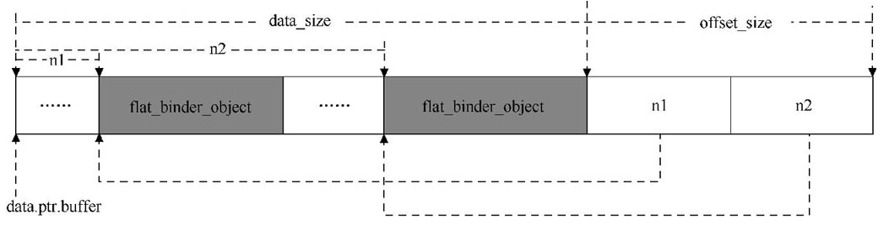
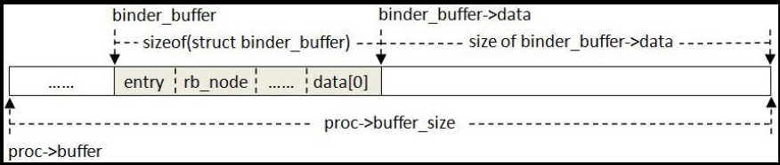
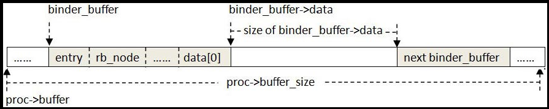
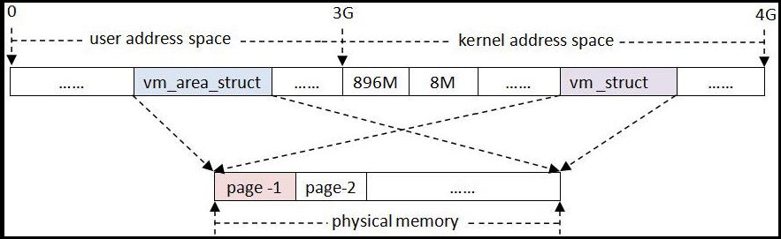
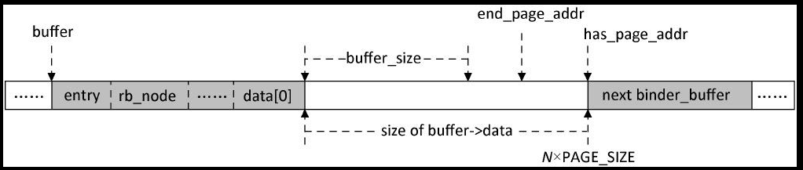
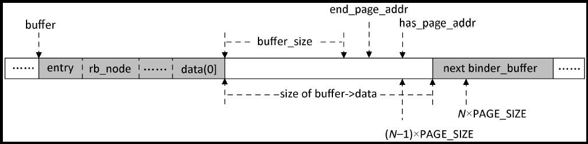
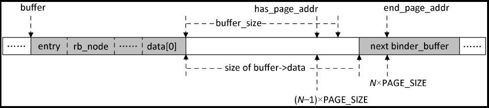
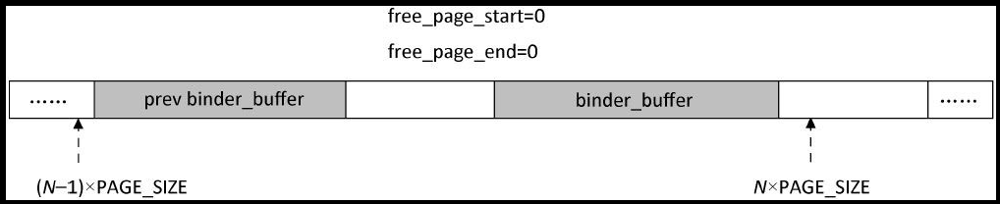
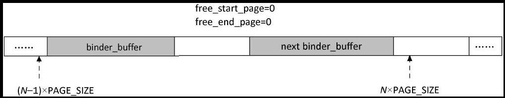
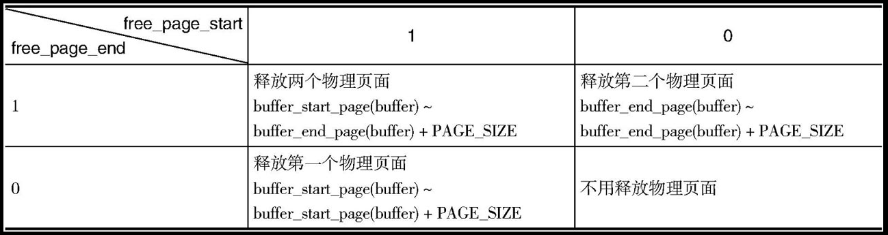

## 5.1 Binder驱动程序

`Binder` 驱动程序实现在内核空间中，它的目录结构如下：

```bash
~Android/kernel/goldfish
---- drivers
    ---- staging
        ---- android
            ---- binder.h
            ---- binder.c
```

它主要由 `binder.h` 和 `binder.c` 两个源文件组成。下面我们就开始介绍 `Binder` 驱动程序的基础知识，包括基础数据结构、初始化过程，以及设备文件 `/dev/binder `的打开（ `open` ）、内存映射（ `mmap` ）和内核缓冲区管理等操作。

### 5.1.1　基础数据结构

在 `Binder` 驱动程序中有两种类型的数据结构，其中一种是在内部使用的，另一种是在内部和外部均会使用到的。接下来，我们分别对这些数据结构进行介绍。

#### struct binder_work

`kernel/drivers/staging/android/binder.c`
```c
struct binder_work {
	struct list_head entry;
	enum {
		BINDER_WORK_TRANSACTION = 1,
		BINDER_WORK_TRANSACTION_COMPLETE,
		BINDER_WORK_NODE,
		BINDER_WORK_DEAD_BINDER,
		BINDER_WORK_DEAD_BINDER_AND_CLEAR,
		BINDER_WORK_CLEAR_DEATH_NOTIFICATION,
	} type;
};
```
结构体 `binder_work` 用来描述待处理的工作项，这些工作项有可能属于一个进程，也有会可能属于一个进程中的某一个线程。成员变量 `entry` 用来将该结构体嵌入到一个宿主结构中，成员变量 `type` 用来描述工作项的类型。根据成员变量 `type` 的取值， `Binder` 驱动程序就可以判断出一个 `binder_work` 结构体嵌入到什么类型的宿主结构中。

#### struct binder_node

`kernel/drivers/staging/android/binder.c`

```cpp
struct binder_node {                    // binder_node 用来描述一个 Binder 实体对象
	int debug_id;
	struct binder_work work;            //  用来描述待处理的工作项
	union {
		struct rb_node rb_node;
		struct hlist_node dead_node;
	};
	struct binder_proc *proc;            // 指向一个 Binder 实体对象的宿主进程
	struct hlist_head refs;
	int internal_strong_refs;
	int local_weak_refs;
	int local_strong_refs;
	void __user *ptr;            
	void __user *cookie;
	unsigned has_strong_ref : 1;
	unsigned pending_strong_ref : 1;
	unsigned has_weak_ref : 1;
	unsigned pending_weak_ref : 1;
	unsigned has_async_transaction : 1;
	unsigned accept_fds : 1;
	int min_priority : 8;
	struct list_head async_todo;
};
```
结构体 `binder_node` 用来描述一个 `Binder` 实体对象。每一个 `Service` 组件在 `Binder` 驱动程序中都对应有一个 `Binder` 实体对象，用来描述它在内核中的状态。 `Binder` 驱动程序通过强引用计数和弱引用计数技术来维护它们的生命周期。

成员变量 `proc` 指向一个 `Binder` 实体对象的宿主进程。在 `Binder` 驱动程序中，这些宿主进程通过一个 `binder_proc` 结构体来描述。宿主进程使用一个红黑树来维护它内部所有的 `Binder` 实体对象，而每一个 `Binder` 实体对象的成员变量 `rb_node` 就正好是这个红黑树中的一个节点。如果一个 `Binder` 实体对象的宿主进程已经死亡了，那么这个 `Binder` 实体对象就会通过它的成员变量 `dead_node` 保存在一个全局的 `hash` 列表中。

由于一个 `Binder` 实体对象可能会同时被多个 `Client` 组件引用，因此， `Binder` 驱动程序就使用结构体 `binder_ref` 来描述这些引用关系，并且将引用了同一个 `Binder` 实体对象的所有引用都保存在一个 `hash` 列表中。这个 `hash` 列表通过 `Binder` 实体对象的成员变量 `refs` 来描述，而 `Binder` 驱动程序通过这个成员变量就可以知道有哪些 `Client` 组件引用了同一个 `Binder` 实体对象。

成员变量 `internal_strong_refs` 和 `local_strong_refs` 均是用来描述一个 `Binder` 实体对象的强引用计数，而成员变量 `local_weak_refs` 用来描述一个 `Binder` 实体对象的弱引用计数。当一个 `Binder` 实体对象请求一个 `Service` 组件来执行某一个操作时，会增加该 `Service` 组件的强引用计数或者弱引用计数，相应地， `Binder` 实体对象会将其成员变量 `has_strong_ref` 和 `has_weak_ref` 的值设置为 `1` 。当一个 `Service` 组件完成一个 `Binder` 实体对象所请求的操作之后， `Binder` 实体对象就会请求减少该 `Service` 组件的强用计数或者弱引用计数。 `Binder` 实体对象在请求一个 `Service` 组件增加或者减少强引用计数或者弱引用计数的过程中，会将其成员变量 `pending_strong_ref` 或者 `pending_weak_ref` 的值设置为 `1` ；而当该 `Service` 组件增加或者减少了强引用计数或者弱引用计数之后， `Binder` 实体对象就会将这两个成员变量的值设置为 `0` 。

成员变量 `ptr` 和 `cookie` 分别指向一个用户空间地址，它们用来描述用户空间中的一个 `Service` 组件，其中，成员变量 `cookie` 指向该 `Service` 组件的地址，而成员变量 `ptr` 指向该 `Service` 组件内部的一个引用计数对象（类型为 `weakref_impl` ）的地址。

成员变量 `has_async_transaction` 用来描述一个 `Binder` 实体对象是否正在处理一个异步事务。如果是，它的值就等于 `1` ，否则等于 `0` 。一般情况下， `Binder` 驱动程序都是将一个事务保存在一个线程的一个 `todo` 队列中的，表示要由该线程来处理该事务。每一个事务都关联着一个 `Binder` 实体对象，表示该事务的目标处理对象，即要求与该 `Binder` 实体对象对应的 `Service` 组件在指定的线程中处理该事务。然而，当 `Binder` 驱动程序发现一个事务是异步事务时，就会将它保存在目标 `Binder` 实体对象的一个异步事务队列中，这个异步事务队列就是由该目标 `Binder` 实体对象的成员变量 `async_todo` 来描述的。异步事务的定义是那些单向的进程间通信请求，即不需要等待应答的进程间通信请求，与此相对的便是同步事务。因为不需要等待应答， `Binder` 驱动程序就认为异步事务的优先级低于同步事务，具体就表现为在同一时刻，一个 `Binder` 实体对象的所有异步事务至多只有一个会得到处理，其余的都等待在异步事务队列中，而同步事务就没有这个限制。

当一个 `Binder` 实体对象的引用计数由 `0` 变成 `1` ，或者由 `1` 变成 `0` 时， `Binder` 驱动程序就会请求相应的 `Service` 组件增加或者减少其引用计数。这时候 `Binder` 驱动程序就会将该引用计数修改操作封装成一个类型为 `binder_node` 的工作项，即将一个 `Binder` 实体对象的成员变量 `work` 的值设置为 `BINDER_WORKD_NODE` ，并且将它添加到相应进程的 `todo` 队列中去等待处理。

成员变量 `min_priority` 表示一个 `Binder` 实体对象在处理一个来自 `Client` 进程的请求时，它所要求的处理线程，即 `Server` 进程中的一个线程，应该具备的最小线程优先级，这样就保证了与该 `Binder` 实体对象对应的 `Service` 组件可以在一个具有一定优先级的线程中处理一个来自 `Client` 进程的通信请求。一个 `Service` 组件在将自己注册到 `Binder` 驱动程序时，可以指定这个最小线程优先级，而 `Binder` 驱动程序会把这个最小线程优先级保存在相应的 `Binder` 实体对象的成员变量 `min_priority` 中。

成员变量 `accept_fds` 用来描述一个 `Binder` 实体对象是否可以接收包含有文件描述符的进程间通信数据。如果它的值等于 `1` ，就表示可以接收；否则，就表示禁止接收。当一个进程向另外一个进程发送的数据中包含有文件描述符时， `Binder` 驱动程序就会自动在目标进程中打开一个相同的文件。基于安全性考虑， `Binder` 驱动程序就要通过成员变量 `accept_fds` 来防止源进程在目标进程中打开文件。

最后，成员变量 `debug_id` 用来标志一个 `Binder` 实体对象的身份，它是用来帮助调试 `Binder` 驱动程序的。

#### struct binder_ref_death

`kernel/drivers/staging/android/binder.c`
```c
struct binder_ref_death {
	struct binder_work work;
	void __user *cookie;
};
```
结构体 `binder_ref_death` 用来描述一个 `Service` 组件的死亡接收通知。在正常情况下，一个 `Service` 组件被其他 `Client` 进程引用时，它是不可以销毁的。然而， `Client` 进程是无法控制它所引用的 `Service` 组件的生命周期的，因为 `Service` 组件所在的进程可能会意外地崩溃，从而导致它意外地死亡。一个折中的处理办法是， `Client` 进程能够在它所引用的 `Service` 组件死亡时获得通知，以便可以做出相应的处理。这时候 `Client` 进程就需要将一个用来接收死亡通知的对象的地址注册到 `Binder` 驱动程序中。

成员变量 `cookie` 用来保存负责接收死亡通知的对象的地址，成员变量 `work` 的取值为 `BINDER_WORK_DEAD_BINDER` 、 `BINDER_WORK_CLEAR_DEATH_NOTIFICATION` 或者 `BINDER_WORK_DEAD_BINDER_AND_CLEAR` ，用来标志一个具体的死亡通知类型。

`Binder` 驱动程序决定要向一个 `Client` 进程发送一个 `Service` 组件死亡通知时，会将一个 `binder_ref_death` 结构体封装成一个工作项，并且根据实际情况来设置该结构体的成员变量 `work` 的值，最后将这个工作项添加到 `Client` 进程的 `todo` 队列中去等待处理。

在下面两种情况下， `Binder` 驱动程序会向一个 `Client` 进程发送一个 `Service` 组件的死亡通知。

1. 当 `Binder` 驱动程序监测到一个 `Service` 组件死亡时，它就会找到该 `Service` 组件对应的 `Binder` 实体对象，然后通过 `Binder` 实体对象的成员变量 `refs` 就可以找到所有引用了它的 `Client` 进程，最后就找到这些 `Client` 进程所注册的死亡接收通知，即一个 `binder_ref_death` 结构体。这时候 `Binder` 驱动程序就会将该 `binder_ref_death` 结构体添加到 `Client` 进程的 `todo` 队列中去等待处理。在这种情况下， `Binder` 驱动程序将死亡通知的类型设置为 `BINDER_WORK_DEAD_BINDER` 。

2. 当 `Client` 进程向 `Binder` 驱动程序注册一个死亡接收通知时，如果它所引用的 `Service` 组件已经死亡，那么 `Binder` 驱动程序就会马上发送一个死亡通知给该 `Client` 进程。在这种情况下， `Binder` 驱动程序也会将死亡通知的类型设置为 `BINDER_WORK_DEAD_BINDER` 。

另外，当 `Client` 进程向 `Binder` 驱动程序注销一个死亡接收通知时， `Binder` 驱动程也会向该 `Client` 进程的 `todo` 队列发送一个类型为 `binder_ref_death` 的工作项，用来表示注销结果。这时候又需要分两种情况来考虑。

1. 如果 `Client` 进程在注销一个死亡接收通知时，相应的 `Service` 组件还没有死亡，那么 `Binder` 驱动程序就会找到之前所注册的一个 `binder_ref_death` 结构体，并且将它的类型 `work` 修改为 `BINDER_WORK_CLEAR_DEATH_NOTIFICATION` ，然后再将该 `binder_ref_death` 结构体封装成一个工作项添加到该 `Client` 进程的 `todo` 队列中去等待处理。

2. 如果 `Client` 进程在注销一个死亡接收通知时，相应的 `Service` 组件已经死亡，那么 `Binder` 驱动程序就会找到之前所注册的一个 `binder_ref_death` 结构体，并且将它的类型 `work` 修改为 `BINDER_WORK_DEAD_BINDER_AND_CLEAR` ，然后再将该 `binder_ref_death` 结构体封装成一个工作项添加到该 `Client` 进程的 `todo` 队列中去等待处理。

`Client` 进程在处理这个工作项时，通过对应的 `binder_ref_death` 结构体的成员变量 `work` 就可以区分注销结果了，即它所引用的 `Service` 组件是否已经死亡。

#### struct binder_ref

`kernel/drivers/staging/android/binder.c`
```c
struct binder_ref {
	/* Lookups needed: */
	/*   node + proc => ref (transaction) */
	/*   desc + proc => ref (transaction, inc/dec ref) */
	/*   node => refs + procs (proc exit) */
	int debug_id;
	struct rb_node rb_node_desc;
	struct rb_node rb_node_node;
	struct hlist_node node_entry;
	struct binder_proc *proc;
	struct binder_node *node;
	uint32_t desc;
	int strong;
	int weak;
	struct binder_ref_death *death;
};
```
结构体 `binder_ref` 用来描述一个 `Binder` 引用对象。每一个 `Client` 组件在 `Binder` 驱动程序中都对应有一个 `Binder` 引用对象，用来描述它在内核中的状态。 `Binder` 驱动程序通过强引用计数和弱引用计数技术来维护它们的生命周期。

成员变量 `node` 用来描述一个 `Binder` 引用对象所引用的 `Binder` 实体对象。前面在介绍结构体 `binder_node` 时提到，每一个 `Binder` 实体对象都有一个 `hash` 列表，用来保存那些引用了它的 `Binder` 引用对象，而这些 `Binder` 引用对象的成员变量 `node_entry` 正好是这个 `hash` 列表的节点。

成员变量 `desc` 是一个句柄值，或者称为描述符，它是用来描述一个 `Binder` 引用对象的。在 `Client` 进程的用户空间中，一个 `Binder` 引用对象是使用一个句柄值来描述的，因此，当 `Client` 进程的用户空间通过 `Binder` 驱动程序来访问一个 `Service` 组件时，它只需要指定一个句柄值， `Binder` 驱动程序就可以通过该句柄值找到对应的 `Binder` 引用对象，然后再根据该 `Binder` 引用对象的成员变量 `node` 找到对应的 `Binder` 实体对象，最后就可以通过该 `Binder` 实体对象找到要访问的 `Service` 组件。

**注意**
> 一个 `Binder` 引用对象的句柄值在进程范围内是唯一的，因此，在两个不同的进程中，同一个句柄值可能代表的是两个不同的目标 `Service` 组件。

成员变量 `proc` 指向一个 `Binder` 引用对象的宿主进程。一个宿主进程使用两个红黑树来保存它内部所有的 `Binder` 引用对象，它们分别以句柄值和对应的 `Binder` 实体对象的地址来作为关键字保存这些 `Binder` 引用对象，而这些 `Binder` 引用对象的成员变量 `rb_node_desc` 和 `rb_node_node` 就正好是这两个红黑树中的节点。

成员变量 `strong` 和 `weak` 分别用来描述一个 `Binder` 引用对象的强引用计数和弱引用计数， `Binder` 驱动程序正是通过它们来维护一个 `Binder` 引用对象的生命周期的。

成员变量 `death` 指向一个 `Service` 组件的死亡接收通知。当 `Client` 进程向 `Binder` 驱动程序注册一个它所引用的 `Service` 组件的死亡接收通知时， `Binder` 驱动程序就会创建一个 `binder_ref_death` 结构体，然后保存在对应的 `Binder` 引用对象的成员变量 `death` 中。

最后，成员变量 `debug_id` 用来标志一个 `Binder` 引用对象的身份，它是用来帮助调试 `Binder` 驱动程序的。

#### struct binder_buffer

`kernel/drivers/staging/android/binder.c`
```cpp
struct binder_buffer {
	struct list_head entry; /* free and allocated entries by addesss */
	struct rb_node rb_node; /* free entry by size or allocated entry */
				/* by address */
	unsigned free : 1;
	unsigned allow_user_free : 1;
	unsigned async_transaction : 1;
	unsigned debug_id : 29;

	struct binder_transaction *transaction;

	struct binder_node *target_node;
	size_t data_size;
	size_t offsets_size;
	uint8_t data[0];
};
```
结构体 `binder_buffer` 用来描述一个内核缓冲区，它是用来在进程间传输数据的。每一个使用 `Binder` 进程间通信机制的进程在 `Binder` 驱动程序中都有一个内核缓冲区列表，用来保存 `Binder` 驱动程序为它所分配的内核缓冲区，而成员变量 `entry` 正好是这个内核缓冲区列表的一个节点。同时，进程又使用了两个红黑树来分别保存那些正在使用的内核缓冲区，以及空闲的内核缓冲区。如果一个内核缓冲区是空闲的，即它的成员变量 `free` 的值等于 `1` ，那么成员变量 `rb_node` 就是空闲内核缓冲区红黑树中的一个节点；否则，成员变量 `rb_node` 就是正在使用内核缓冲区红黑树中的一个节点。

成员变量 `transaction` 和 `target_node` 用来描述一个内核缓冲区正在交给哪一个事务以及哪一个 `Binder` 实体对象使用。 `Binder` 驱动程序使用一个 `binder_transaction` 结构体来描述一个事务，每一个事务都关联有一个目标 `Binder` 实体对象。 `Binder` 驱动程序将事务数据保存在一个内核缓冲区中，然后将它交给目标 `Binder` 实体对象处理，而目标 `Binder` 实体对象再将该内核缓冲区的内容交给相应的 `Service` 组件处理。 `Service` 组件处理完成该事务之后，如果发现传递给它的内核缓冲区的成员变量 `allow_user_free` 的值为 `1` ，那么该 `Service` 组件就会请求 `Binder` 驱动程序释放该内核缓冲区。

如果与一个内核缓冲区关联的是一个异步事务，那么 `Binder` 驱动程序就会将该内核缓冲区的成员变量 `async_transaction` 的值设置为 `1` ；否则，就将它的值设置为 `0` 。 `Binder` 驱动程序限制了分配给异步事务的内核缓冲区的大小，这样做的目的是为了保证同步事务可以优先得到内核缓冲区，以便可以快速地对该同步事务进行处理。

成员变量 `data` 指向一块大小可变的数据缓冲区，它是真正用来保存通信数据的。数据缓冲区保存的数据划分为两种类型，其中一种是普通数据，另一种是 `Binder` 对象。 `Binder` 驱动程序不关心数据缓冲区中的普通数据，但是必须要知道里面的 `Binder` 对象，因为它需要根据它们来维护内核中的 `Binder` 实体对象和 `Binder` 引用对象的生命周期。例如，如果数据缓冲区中包含了一个 `Binder` 引用，并且该数据缓冲区是传递给另外一个进程的，那么 `Binder` 驱动程序就需要为另外一个进程创建一个 `Binder` 引用对象，并且增加相应的 `Binder` 实体对象的引用计数，因为它也被另外的这个进程引用了。由于数据缓冲区中的普通数据和 `Binder` 对象是混合在一起保存的，它们之间并没有固定的顺序，因此， `Binder` 驱动程序就需要额外的数据来找到里面的 `Binder` 对象。在数据缓冲区的后面，有一个偏移数组，它记录了数据缓冲区中每一个 `Binder` 对象在数据缓冲区中的位置。偏移数组的大小保存在成员变量 `offsets_size` 中，而数据缓冲区的大小保存在成员变量 `data_size` 中。

最后，成员变量 `debug_id` 用来标志一个内核缓冲区的身份，它是用来帮助调试 `Binder` 驱动程序的。

#### struct binder_proc

`kernel/drivers/staging/android/binder.c`
```cpp
struct binder_proc {
	struct hlist_node proc_node;
	struct rb_root threads;
	struct rb_root nodes;
	struct rb_root refs_by_desc;
	struct rb_root refs_by_node;
	int pid;
	struct vm_area_struct *vma;
	struct task_struct *tsk;
	struct files_struct *files;
	struct hlist_node deferred_work_node;
	int deferred_work;
	void *buffer;
	ptrdiff_t user_buffer_offset;

	struct list_head buffers;
	struct rb_root free_buffers;
	struct rb_root allocated_buffers;
	size_t free_async_space;

	struct page **pages;
	size_t buffer_size;
	uint32_t buffer_free;
	struct list_head todo;
	wait_queue_head_t wait;
	struct binder_stats stats;
	struct list_head delivered_death;
	int max_threads;
	int requested_threads;
	int requested_threads_started;
	int ready_threads;
	long default_priority;
};
```
结构体 `binder_proc` 用来描述一个正在使用 `Binder` 进程间通信机制的进程。当一个进程调用函数 `open` 来打开设备文件 `/dev/binder` 时， `Binder` 驱动程序就会为它创建一个 `binder_proc` 结构体，并且将它保存在一个全局的 `hash` 列表中，而成员变量 `proc_node` 就正好是该 `hash` 列表中的一个节点。此外，成员变量 `pid` 、 `tsk` 和 `files` 分别指向了进程的进程组 `ID` 、任务控制块和打开文件结构体数组。

进程打开了设备文件 `/dev/binder` 之后，还必须调用函数 `mmap` 将它映射到进程的地址空间来，实际上是请求 `Binder` 驱动程序为它分配一块内核缓冲区，以便可以用来在进程间传输数据。 `Binder` 驱动程序为进程分配的内核缓冲区的大小保存在成员变量 `buffer_size` 中。这些内核缓冲区有两个地址，其中一个是内核空间地址，另外一个是用户空间地址。内核空间地址是在 `Binder` 驱动程序内部使用的，保存在成员变量 `buffer` 中，而用户空间地址是在应用程序进程内部使用的，保存在成员变量 `vma` 中。这两个地址相差一个固定的值，保存在成员变量 `user_buffer_offset` 中。这样，给定一个用户空间地址或者一个内核空间地址， `Binder` 驱动程序就可以计算出另外一个地址的大小。

**注意**
> 这两个地址指的都是虚拟地址，它们对应的物理页面保存在成员变量 `pages` 中。成员变量 `pages` 是类型为 `struct page*` 的一个数组，数组中的每一个元素都指向一个物理页面。 `Binder` 驱动程序一开始时只为该内核缓冲区分配一个物理页面，后面不够使用时，再继续分配。

成员变量 `buffer` 指向的是一块大的内核缓冲区， `Binder` 驱动程序为了方便对它进行管理，会将它划分成若干个小块。这些小块的内核缓冲区就是使用前面所介绍的结构体 `binder_buffer` 来描述的，它们保存在一个列表中，按照地址值从小到大的顺序来排列。成员变量 `buffers` 指向的便是该列表的头部。列表中的小块内核缓冲区有的是正在使用的，即已经分配了物理页面；有的是空闲的，即还没有分配物理页面，它们分别组织在两个红黑树中，其中，前者保存在成员变量 `allocated_buffers` 所描述的红黑树中，而后者保存在成员变量 `free_buffers` 所描述的红黑树中。此外，成员变量 `buffer_free` 保存了空闲内核缓冲区的大小，而成员变量 `free_async_space` 保存了当前可以用来保存异步事务数据的内核缓冲区的大小。

前面提到，每一个使用了 `Binder` 进程间通信机制的进程都有一个 `Binder` 线程池，用来处理进程间通信请求，这个 `Binder` 线程池是由 `Binder` 驱动程序来维护的。结构体 `binder_proc` 的成员变量 `threads` 是一个红黑树的根节点，它以线程 `ID` 作为关键字来组织一个进程的 `Binder` 线程池。进程可以调用函数 `ioctl` 将一个线程注册到 `Binder` 驱动程序中，同时，当进程没有足够的空闲线程在处理进程间通信请求时， `Binder` 驱动程序也可以主动要求进程注册更多的线程到 `Binder` 线程池中。 `Binder` 驱动程序最多可以主动请求进程注册的线程的数量保存在成员变量 `max_threads` 中，而成员变量 `ready_threads` 表示进程当前的空闲 `Binder` 线程数目。

**注意**
> 成员变量 `max_threads` 并不是表示 `Binder` 线程池中的最大线程数目，进程本身可以主动注册任意数目的线程到 `Binder` 线程池中。 `Binder` 驱动程序每一次主动请求进程注册一个线程时，都会将成员变量 `requested_threads` 的值加 `1` ；而当进程响应这个请求之后， `Binder` 驱动程序就会将成员变量 `requested_threads` 的值减 `1` ，而且将成员变量 `requested_threads_started` 的值加 `1` ，表示 `Binder` 驱动程序已经主动请求进程注册了多少个线程到 `Binder` 线程池中。

当进程接收到一个进程间通信请求时， `Binder` 驱动程序就将该请求封装成一个工作项，并且加入到进程的待处理工作项队列中，这个队列使用成员变量 `todo` 来描述。 `Binder` 线程池中的空闲 `Binder` 线程会睡眠在由成员变量 `wait` 所描述的一个等待队列中，当它们的宿主进程的待处理工作项队列增加了新的工作项之后， `Binder` 驱动程序就会唤醒这些线程，以便它们可以去处理新的工作项。成员变量 `default_priority` 的值被初始化为进程的优先级。当一个线程处理一个工作项时，它的线程优先级有可能会被设置为其宿主进程的优先级，即设置为成员变量 `default_priority` 的值，这是由于线程是代表其宿主进程来处理一个工作项的。线程在处理一个工作项时的优先级还会受到其他因素的影响，后面我们再详细描述。

一个进程内部包含了一系列的 `Binder` 实体对象和 `Binder` 引用对象，进程使用三个红黑树来组织它们，其中，成员变量 `nodes` 所描述的红黑树是用来组织 `Binder` 实体对象的，它以 `Binder` 实体对象的成员变量 `ptr` 作为关键字；而成员变量 `refs_by_desc` 和 `refs_by_node` 所描述的红黑树是用来组织 `Binder` 引用对象的，前者以 `Binder` 引用对象的成员变量 `desc` 作为关键字，而后者以 `Binder` 引用对象的成员变量 `node` 作为关键字。

成员变量 `deferred_work_node` 是一个 `hash` 列表，用来保存进程可以延迟执行的工作项。这些延迟工作项有三种类型，如下所示。

`kernel/drivers/staging/android/binder.c`
```c
enum {
	BINDER_DEFERRED_PUT_FILES    = 0x01,
	BINDER_DEFERRED_FLUSH        = 0x02,
	BINDER_DEFERRED_RELEASE      = 0x04,
};
```
`Binder` 驱动程序为进程分配内核缓冲区时，会为这个内核缓冲区创建一个文件描述符，进程可以通过这个文件描述符将该内核缓冲区映射到自己的地址空间。当进程不再需要使用 `Binder` 进程间通信机制时，它就会通知 `Binder` 驱动程序关闭该文件描述符，并且释放之前所分配的内核缓冲区。由于这不是一个马上就需要完成的操作，因此， `Binder` 驱动程序就会创建一个 `BINDER_DEFERRED_PUT_FILES` 类型的工作项来延迟执行该操作。

前面提到， `Binder` 线程池中的空闲 `Binder` 线程是睡眠在一个等待队列中的，进程可以通过调用函数 `flush` 来唤醒这些线程，以便它们可以检查进程是否有新的工作项需要处理。这时候 `Binder` 驱动程序就会创建一个 `BINDER_DEFERRED_FLUSH` 类型的工作项，以便可以延迟执行唤醒空闲 `Binder` 线程的操作。

当进程不再使用 `Binder` 进程间通信机制时，它就会调用函数 `close` 来关闭设备文件 `/dev/binder` ，这时候 `Binder` 驱动程序就会释放之前为它分配的资源，例如，释放进程结构体 `binder_proc` 、 `Binder` 实体对象结构体 `binder_node` 以及 `Binder` 引用对象结构体 `binder_ref` 等。由于资源的释放操作是一个比较耗时的操作，因此， `Binder` 驱动程序会创建一个 `BINDER_DEFERRED_RELEASE` 类型的事务来延迟执行它们。

`Binder` 驱动程序将所有的延迟执行的工作项保存在一个 `hash` 列表中。如果一个进程有延迟执行的工作项，那么成员变量 `deferred_work_node` 就刚好是该 `hash` 列表中的一个节点，并且使用成员变量 `deferred_work` 来描述该延迟工作项的具体类型。

当一个进程所引用的 `Service` 组件死亡时， `Binder` 驱动程序就会向该进程发送一个死亡通知。这个正在发出的死亡通知被封装成一个类型为 `BINDER_WORK_DEAD_BINDER` 或者 `BINDER_WORK_DEAD_BINDER_AND_CLEAR` 的工作项，并且保存在由成员变量 `delivered_death` 所描述的一个队列中，表示 `Binder` 驱动程序正在向进程发送的死亡通知。当进程接收到这个死亡通知之后，它便会通知 `Binder` 驱动程序，这时候 `Binder` 驱动程序就会将对应的工作项从成员变量 `delivered_death` 所描述的队列中删除。

最后，成员变量 `stats` 是用来统计进程数据的，例如，进程接收到的进程间通信请求的次数。

#### struct binder_thread

`kernel/drivers/staging/android/binder.c`
```c
struct binder_thread {
	struct binder_proc *proc; // 指向其宿主进程
	struct rb_node rb_node;
	int pid;
	int looper;
	struct binder_transaction *transaction_stack;
	struct list_head todo;
	uint32_t return_error; /* Write failed, return error code in read buf */
	uint32_t return_error2; /* Write failed, return error code in read */
		/* buffer. Used when sending a reply to a dead process that */
		/* we are also waiting on */
	wait_queue_head_t wait;
	struct binder_stats stats;
};
```
结构体 `binder_thread` 用来描述 `Binder` 线程池中的一个线程，其中，成员变量 `proc` 指向其宿主进程。前面在介绍进程结构体 `binder_proc` 时提到，进程结构体 `binder_proc` 使用一个红黑树来组织其 `Binder` 线程池中的线程，其中，结构体 `binder_thread` 的成员变量 `rb_node` 就是该红黑树中的一个节点。

一个 `Binder` 线程的 `ID` 和状态是通过成员变量 `pid` 和 `looper` 来描述的。线程状态的取值如下所示。

`kernel/drivers/staging/android/binder.c`
```c
enum {
	BINDER_LOOPER_STATE_REGISTERED  = 0x01,
	BINDER_LOOPER_STATE_ENTERED     = 0x02,
	BINDER_LOOPER_STATE_EXITED      = 0x04,
	BINDER_LOOPER_STATE_INVALID     = 0x08,
	BINDER_LOOPER_STATE_WAITING     = 0x10,
	BINDER_LOOPER_STATE_NEED_RETURN = 0x20
};
```
一个线程注册到 `Binder` 驱动程序时， `Binder` 驱动程序就会为它创建一个 `binder_thread` 结构体，并且将它的状态初始化为 `BINDER_LOOPER_STATE_NEED_RETURN` ，表示该线程需要马上返回到用户空间。由于一个线程在注册为 `Binder` 线程时可能还没有准备好去处理进程间通信请求，因此，最好返回到用户空间去做准备工作。此外，当进程调用函数 `flush` 来刷新它的 `Binder` 线程池时， `Binder` 线程池中的线程的状态也会被重置为 `BINDER_LOOPER_STATE_NEED_RETURN` 。

一个线程注册到 `Binder` 驱动程序之后，它接着就会通过 `BC_REGISTER_LOOPER` 或者 `BC_ENTER_LOOPER` 协议来通知 `Binder` 驱动程序，它可以处理进程间通信请求了，这时候 `Binder` 驱动程序就会将它的状态设置为 `BINDER_LOOPER_STATE_REGISTERED` 或者 `INDER_LOOPER_STATE_ENTERED` 。如果一个线程是应用程序主动注册的，那么它就通过 `BC_ENTER_LOOPER` 协议来通知 `Binder` 驱动程序，它已经准备就绪处理进程间通信请求了；如果一个线程是 `Binder` 驱动程序请求创建的，那么它就通过 `BC_REGISTER_LOOPER` 协议来通知 `Binder` 驱动程序，这时候 `Binder` 驱动程序就会增加它所请求进程创建的 `Binder` 线程的数目。

当一个 `Binder` 线程处于空闲状态时， `Binder` 驱动程序就会把它的状态设置为 `BINDER_LOOPER_STATE_WAITING` ；而当一个 `Binder` 线程退出时，它会通过 `BC_EXIT_LOOPER` 协议来通知 `Binder` 驱动程序，这时候 `Binder` 驱动程序就会将它的状态设置为 `BINDER_LOOPER_STATE_EXITED` 。在异常情况下，一个 `Binder` 线程的状态会被设置为 `BINDER_LOOPER_STATE_INVALID` ，例如，当该线程已经处于 `BINDER_LOOPER_STATE_REGISTERED` 状态时，如果它又再次通过 `BC_ENTER_LOOPER` 协议来通知 `Binder` 驱动程序它已经准备就绪了，那么 `Binder` 驱动程序就会将它的状态设置为 `BINDER_LOOPER_STATE_INVALID` 。

当一个来自 `Client` 进程的请求指定要由某一个 `Binder` 线程来处理时，这个请求就会加入到相应的 `binder_thread` 结构体的成员变量 `todo` 所表示的队列中，并且会唤醒这个线程来处理，因为这时候这个线程可能处于睡眠状态。

当 `Binder` 驱动程序决定将一个事务交给一个 `Binder` 线程处理时，它就会将该事务封装成一个 `binder_transaction` 结构体，并且将它添加到由线程结构体 `binder_thread` 的成员变量 `transaction_stack` 所描述的一个事务堆栈中。结构体 `binder_transaction` 的设计很巧妙，后面我们再详细介绍它的定义。

当一个 `Binder` 线程在处理一个事务 `T1` 并需要依赖于其他的 `Binder` 线程来处理另外一个事务 `T2` 时，它就会睡眠在由成员变量 `wait` 所描述的一个等待队列中，直到事务 `T2` 处理完成为止。

一个 `Binder` 线程在处理一个事务时，如果出现了异常情况，那么 `Binder` 驱动程序就会将相应的错误码保存在其成员变量 `return_error` 和 `reutrn_error2` 中，这时候线程就会将这些错误返回给用户空间应用程序处理。

最后，成员变量 `stats` 是用来统计 `Binder` 线程数据的，例如， `Binder` 线程接收到的进程间通信请求的次数。

#### struct binder_transaction

`kernel/drivers/staging/android/binder.c`
```c
struct binder_transaction {
	int debug_id;
	struct binder_work work;
	struct binder_thread *from;
	struct binder_transaction *from_parent;
	struct binder_proc *to_proc;
	struct binder_thread *to_thread;
	struct binder_transaction *to_parent;
	unsigned need_reply : 1;
	/*unsigned is_dead : 1;*/ /* not used at the moment */

	struct binder_buffer *buffer;
	unsigned int	code;
	unsigned int	flags;
	long	priority;
	long	saved_priority;
	uid_t	sender_euid;
};
```
结构体 `binder_transaction` 用来描述进程间通信过程，这个过程又称为一个事务。成员变量 `need_reply` 用来区分一个事务是同步的还是异步的。同步事务需要等待对方回复，这时候它的成员变量 `need_reply` 的值就会设置为 `1` ；否则就设置为 `0` ，表示这是一个异步事务，不需要等待回复。

成员变量 `from` 指向发起事务的线程，称为源线程；成员变量 `to_proc` 和 `to_thread` 分别指向负责处理该事务的进程和线程，称为目标进程和目标线程。当 `Binder` 驱动程序为目标进程或者目标线程创建一个事务时，就会将该事务的成员变量 `work` 的值设置为 `BINDER_WORK_TRANSACTION` ，并且将它添加到目标进程或者目标线程的 `todo` 队列中去等待处理。

成员变量 `priority` 和 `sender_euid` 分别用来描述源线程的优先级和用户 `ID` 。通过这两个成员变量，目标进程或者目标线程就可以识别事务发起方的身份。

一个线程在处理一个事务时， `Binder` 驱动程序需要修改它的线程优先级，以便满足源线程和目标 `Service` 组件的要求。 `Binder` 驱动程序在修改一个线程的优先级之前，会将它原来的线程优先级保存在一个事务结构体的成员变量 `saved_priority` 中，以便线程处理完成该事务后可以恢复原来的优先级。前面在介绍结构体 `binder_node` 时提到，目标线程在处理一个事务时，它的线程优先级不能低于目标 `Service` 组件所要求的线程优先级，而且也不能低于源线程的优先级。这时候 `Binder` 驱动程序就会将这二者中的较大值设置为目标线程的优先级。

成员变量 `buffer` 指向 `Binder` 驱动程序为该事务分配的一块内核缓冲区，它里面保存了进程间通信数据。成员变量 `code` 和 `flags` 是直接从进程间通信数据中拷贝过来的，后面在介绍结构体 `binder_transaction_data` 时，我们再详细分析。

成员变量 `from_parent` 和 `to_parent` 分别描述一个事务所依赖的另外一个事务，以及目标线程下一个需要处理的事务。假设线程 `A` 发起了一个事务 `T1` ，需要由线程 `B` 来处理；线程 `B` 在处理事务 `T1` 时，又需要线程 `C` 先处理事务 `T2` ；线程 `C` 在处理事务 `T2` 时，又需要线程 `A` 先处理事务 `T3` 。这样，事务 `T1` 就依赖于事务 `T2` ，而事务 `T2` 又依赖于事务 `T3` ，它们的关系如下：
```dotnetcli
T1 -> from_parent = T2;
T2 -> from_parent = T3;
```

对于线程 `A` 来说，它需要处理的事务有两个，分别是 `T1` 和 `T3` ，它首先要处理事务 `T3` ，然后才能处理事务 `T1` ，因此，事务 `T1` 和 `T3` 的关系如下：
```dotnetcli
T3 -> to_parent = T1;
```
考虑这样一个情景：如果线程 `C` 在发起事务 `T3` 给线程 `A` 所属的进程来处理时， `Binder` 驱动程序选择了该进程的另外一个线程 `D` 来处理该事务，这时候会出现什么情况呢？这时候线程 `A` 就会处于空闲等待状态，什么也不能做，因为它必须要等线程 `D` 处理完成事务 `T3` 后，它才可以继续执行事务 `T1` 。在这种情况下，与其让线程 `A` 闲着，还不如把事务 `T3` 交给它来处理，这样线程 `D` 就可以去处理其他事务，提高了进程的并发性。

现在，关键的问题又来了—— `Binder` 驱动程序在分发事务 `T3` 给目标进程处理时，它是如何知道线程 `A` 属于目标进程，并且正在等待事务 `T3` 的处理结果的？当线程 `B` 在处理事务 `T2` 时，就会将事务 `T2` 放在其事务堆栈 `transaction_stack` 的最前端。这样当线程 `B` 发起事务 `T3` 给线程 `C` 处理时， `Binder` 驱动程序就可以沿着线程 `B` 的事务堆栈 `transaction_stack` 向下遍历，直到发现事务 `T3` 的目标进程等于事务 `T1` 的目标进程时，它就知道线程 `A` 正在等待事务 `T3` 的处理结果了。

**注意**
> 线程 `A` 在处理事务 `T3` 时， `Binder` 驱动程序会将事务 `T3` 放在其事务堆栈 `transaction_stack` 的最前端，而在此之前，该事务堆栈 `transaction_stack` 的最前端指向的是事务 `T1` 。为了能够让线程 `A` 处理完成事务 `T3` 之后，接着处理事务 `T1` ， `Binder` 驱动程序会将事务 `T1` 保存在事务 `T3` 的成员变量 `to_parent` 中。等到线程 `A` 处理完成事务 `T3` 之后，就可以通过事务 `T3` 的成员变量 `to_parent` 找到事务 `T1` ，再将它放在线程 `A` 的事务堆栈 `transaction_stack` 的最前端了。

最后，成员变量 `debug_id` 用来标志一个事务结构体的身份，它是用来帮助调试 `Binder` 驱动程序的。

以上介绍的结构体都是在 `Binder` 驱动程序内部使用的。前面提到，应用程序进程在打开了设备文件 `/dev/binder` 之后，需要通过 `IO` 控制函数 `ioctl` 来进一步与 `Binder` 驱动程序进行交互，因此， `Binder` 驱动程序就提供了一系列的 `IO` 控制命令来和应用程序进程通信。在这些 `IO` 控制命令中，最重要的便是 `BINDER_WRITE_READ` 命令了，它的定义如下所示。

`kernel/drivers/staging/android/binder.h`
```c
#define BINDER_WRITE_READ   		_IOWR('b', 1, struct binder_write_read)
```

`IO` 控制命令 `BINDER_WRITE_READ` 后面所跟的参数是一个 `binder_write_read` 结构体，它的定义如下所示。

`kernel/drivers/staging/android/binder.h`
```c
struct binder_write_read {
	signed long	write_size;	/* bytes to write */
	signed long	write_consumed;	/* bytes consumed by driver */
	unsigned long	write_buffer;
	signed long	read_size;	/* bytes to read */
	signed long	read_consumed;	/* bytes consumed by driver */
	unsigned long	read_buffer;
};
```
结构体 `binder_write_read` 用来描述进程间通信过程中所传输的数据。这些数据包括输入数据和输出数据，其中，成员变量 `write_size` 、 `write_consumed` 和 `write_buffer` 用来描述输入数据，即从用户空间传输到 `Binder` 驱动程序的数据；而成员变量 `read_size` 、 `read_consumed` 和 `read_buffer` 用来描述输出数据，即从 `Binder` 驱动程序返回给用户空间的数据，它也是进程间通信结果数据。

成员变量 `write_buffer` 指向一个用户空间缓冲区的地址，里面保存的内容即为要传输到 `Binder` 驱动程序的数据。缓冲区 `write_buffer` 的大小由成员变量 `write_size` 来指定，单位是字节。成员变量 `write_consumed` 用来描述 `Binder` 驱动程序从缓冲区 `write_buffer` 中处理了多少个字节的数据。

成员变量 `read_buffer` 也是指向一个用户空间缓冲区的地址，里面保存的内容即为 `Binder` 驱动程序返回给用户空间的进程间通信结果数据。缓冲区 `read_buffer` 的大小由成员变量 `read_size` 来指定，单位是字节。成员变量 `read_consumed` 用来描述用户空间应用程序从缓冲区 `read_buffer` 中处理了多少个字节的数据。

缓冲区 `write_buffer` 和 `read_buffer` 的数据格式如下图所示。


它们都是一个数组，数组的每一个元素都由一个通信协议代码及其通信数据组成。协议代码又分为两种类型，其中一种是在输入缓冲区 `write_buffer` 中使用的，称为命令协议代码，另一种是在输出缓冲区 `read_buffer` 中使用的，称为返回协议代码。命令协议代码通过 `BinderDriverCommandProtocol` 枚举值来定义，而返回协议代码通过 `BinderDriverReturnProtocol` 枚举值来定义。

命令协议代码的定义如下所示。

**BinderDriverCommandProtocol**

`kernel/drivers/staging/android/binder.h`
```cpp
enum BinderDriverCommandProtocol {
	BC_TRANSACTION = _IOW('c', 0, struct binder_transaction_data),
	BC_REPLY = _IOW('c', 1, struct binder_transaction_data),
	/*
	 * binder_transaction_data: the sent command.
	 */

	BC_ACQUIRE_RESULT = _IOW('c', 2, int),
	/*
	 * not currently supported
	 * int:  0 if the last BR_ATTEMPT_ACQUIRE was not successful.
	 * Else you have acquired a primary reference on the object.
	 */

	BC_FREE_BUFFER = _IOW('c', 3, int),
	/*
	 * void *: ptr to transaction data received on a read
	 */

	BC_INCREFS = _IOW('c', 4, int),
	BC_ACQUIRE = _IOW('c', 5, int),
	BC_RELEASE = _IOW('c', 6, int),
	BC_DECREFS = _IOW('c', 7, int),
	/*
	 * int:	descriptor
	 */

	BC_INCREFS_DONE = _IOW('c', 8, struct binder_ptr_cookie),
	BC_ACQUIRE_DONE = _IOW('c', 9, struct binder_ptr_cookie),
	/*
	 * void *: ptr to binder
	 * void *: cookie for binder
	 */

	BC_ATTEMPT_ACQUIRE = _IOW('c', 10, struct binder_pri_desc),
	/*
	 * not currently supported
	 * int: priority
	 * int: descriptor
	 */

	BC_REGISTER_LOOPER = _IO('c', 11),
	/*
	 * No parameters.
	 * Register a spawned looper thread with the device.
	 */

	BC_ENTER_LOOPER = _IO('c', 12),
	BC_EXIT_LOOPER = _IO('c', 13),
	/*
	 * No parameters.
	 * These two commands are sent as an application-level thread
	 * enters and exits the binder loop, respectively.  They are
	 * used so the binder can have an accurate count of the number
	 * of looping threads it has available.
	 */

	BC_REQUEST_DEATH_NOTIFICATION = _IOW('c', 14, struct binder_ptr_cookie),
	/*
	 * void *: ptr to binder
	 * void *: cookie
	 */

	BC_CLEAR_DEATH_NOTIFICATION = _IOW('c', 15, struct binder_ptr_cookie),
	/*
	 * void *: ptr to binder
	 * void *: cookie
	 */

	BC_DEAD_BINDER_DONE = _IOW('c', 16, void *),
	/*
	 * void *: cookie
	 */
};
```
命令协议代码 `BC_TRANSACTION` 和 `BC_REPLY` 后面跟的通信数据使用一个结构体 `binder_transaction_data` 来描述。当一个进程请求另外一个进程执行某一个操作时，源进程就使用命令协议代码 `BC_TRANSACTION` 来请求 `Binder` 驱动程序将通信数据传递到目标进程；当目标进程处理完成源进程所请求的操作之后，它就使用命令协议代码 `BC_REPLY` 来请求 `Binder` 驱动程序将结果数据传递给源进程。

命令协议代码 `BC_ACQUIRE_RESULT` 在当前的 `Binder` 驱动程序实现中不支持。

命令协议代码 `BC_FREE_BUFFER` 后面跟的通信数据是一个整数，它指向了在 `Binder` 驱动程序内部所分配的一块内核缓冲区。 `Binder` 驱动程序就是通过这个内核缓冲区将源进程的通信数据传递到目标进程的。当目标进程处理完成源进程的通信请求之后，它就会使用命令协议代码 `BC_FREE_BUFFER` 来通知 `Binder` 驱动程序释放这个内核缓冲区。

命令协议代码 `BC_INCREFS` 、 `BC_ACQUIRE` 、 `BC_RELEASE` 和 `BC_DECREFS` 后面跟的通信数据是一个整数，它描述了一个 `Binder` 引用对象的句柄值，其中，命令协议代码 `BC_INCREFS` 和 `BC_DECREFS` 分别用来增加和减少一个 `Binder` 引用对象的弱引用计数；而命令协议代码 `BC_ACQUIRE` 和 `BC_RELEASE` 分别用来增加和减少一个 `Binder` 引用对象的强引用计数。

命令协议代码 `BC_INCREFS_DONE` 和 `BC_ACQUIRE_DONE` 后面跟的通信数据使用一个结构体 `binder_ptr_cookie` 来描述。 `Binder` 驱动程序第一次增加一个 `Binder` 实体对象的强引用计数或者弱引用计数时，就会使用返回协议代码 `BR_ACQUIRE` 或者 `BR_INCREFS` 来请求对应的 `Server` 进程增加对应的 `Service` 组件的强引用计数或者弱引用计数。当 `Server` 进程处理完成这两个请求之后，就会分别使用命令协议代码 `BC_INCREFS_DONE` 和 `BC_ACQUIRE_DONE` 将操作结果返回给 `Binder` 驱动程序。

命令协议代码 `BC_ATTEMPT_ACQUIRE` 在当前的 `Binder` 驱动程序实现中不支持。

命令协议代码 `BC_REGISTER_LOOPER` 、 `BC_ENTER_LOOPER` 和 `BC_EXIT_LOOPER` 后面不需要指定通信数据。一方面，当一个线程将自己注册到 `Binder` 驱动程序之后，它接着就会使用命令协议代码 `BC_ENTER_LOOPER` 来通知 `Binder` 驱动程序，它已经准备就绪处理进程间通信请求了；另一方面，当 `Binder` 驱动程序主动请求进程注册一个新的线程到它的 `Binder` 线程池中来处理进程间通信请求之后，新创建的线程就会使用命令协议代码 `BC_REGISTER_LOOPER` 来通知 `Binder` 驱动程序，它准备就绪了。最后，当一个线程要退出时，它就使用命令协议代码 `BC_EXIT_LOOPER` 从 `Binder` 驱动程序中注销，这样它就不会再接收到进程间通信请求了。

命令协议代码 `BC_REQUEST_DEATH_NOTIFICATION` 和 `BC_CLEAR_DEATH_NOTIFICATION` 后面跟的通信数据使用一个结构体 `binder_ptr_cookie` 来描述。一方面，如果一个进程希望获得它所引用的 `Service` 组件的死亡接收通知，那么它就需要使用命令协议代码 `BC_REQUEST_DEATH_NOTIFICATION` 来向 `Binder` 驱动程序注册一个死亡接收通知；另一方面，如果一个进程想注销之前所注册的一个死亡接收通知，那么它就需要使用命令协议代码 `BC_CLEAR_DEATH_NOTIFICATION` 来向 `Binder` 驱动程序发出请求。

命令协议代码 `BC_DEAD_BINDER_DONE` 后面跟的通信数据是一个 `void` 类型的指针，指向一个死亡接收通知结构体 `binder_ref_death` 的地址。当一个进程获得一个 `Service` 组件的死亡通知时，它就会使用命令协议代码 `BC_DEAD_BINDER_DONE` 来通知 `Binder` 驱动程序，它已经处理完成该 `Service` 组件的死亡通知了。

返回协议代码的定义如下所示。

**BinderDriverReturnProtocol**

`kernel/drivers/staging/android/binder.h`
```cpp
enum BinderDriverReturnProtocol {
	BR_ERROR = _IOR('r', 0, int),
	/*
	 * int: error code
	 */

	BR_OK = _IO('r', 1),
	/* No parameters! */

	BR_TRANSACTION = _IOR('r', 2, struct binder_transaction_data),
	BR_REPLY = _IOR('r', 3, struct binder_transaction_data),
	/*
	 * binder_transaction_data: the received command.
	 */

	BR_ACQUIRE_RESULT = _IOR('r', 4, int),
	/*
	 * not currently supported
	 * int: 0 if the last bcATTEMPT_ACQUIRE was not successful.
	 * Else the remote object has acquired a primary reference.
	 */

	BR_DEAD_REPLY = _IO('r', 5),
	/*
	 * The target of the last transaction (either a bcTRANSACTION or
	 * a bcATTEMPT_ACQUIRE) is no longer with us.  No parameters.
	 */

	BR_TRANSACTION_COMPLETE = _IO('r', 6),
	/*
	 * No parameters... always refers to the last transaction requested
	 * (including replies).  Note that this will be sent even for
	 * asynchronous transactions.
	 */

	BR_INCREFS = _IOR('r', 7, struct binder_ptr_cookie),
	BR_ACQUIRE = _IOR('r', 8, struct binder_ptr_cookie),
	BR_RELEASE = _IOR('r', 9, struct binder_ptr_cookie),
	BR_DECREFS = _IOR('r', 10, struct binder_ptr_cookie),
	/*
	 * void *:	ptr to binder
	 * void *: cookie for binder
	 */

	BR_ATTEMPT_ACQUIRE = _IOR('r', 11, struct binder_pri_ptr_cookie),
	/*
	 * not currently supported
	 * int:	priority
	 * void *: ptr to binder
	 * void *: cookie for binder
	 */

	BR_NOOP = _IO('r', 12),
	/*
	 * No parameters.  Do nothing and examine the next command.  It exists
	 * primarily so that we can replace it with a BR_SPAWN_LOOPER command.
	 */

	BR_SPAWN_LOOPER = _IO('r', 13),
	/*
	 * No parameters.  The driver has determined that a process has no
	 * threads waiting to service incomming transactions.  When a process
	 * receives this command, it must spawn a new service thread and
	 * register it via bcENTER_LOOPER.
	 */

	BR_FINISHED = _IO('r', 14),
	/*
	 * not currently supported
	 * stop threadpool thread
	 */

	BR_DEAD_BINDER = _IOR('r', 15, void *),
	/*
	 * void *: cookie
	 */
	BR_CLEAR_DEATH_NOTIFICATION_DONE = _IOR('r', 16, void *),
	/*
	 * void *: cookie
	 */

	BR_FAILED_REPLY = _IO('r', 17),
	/*
	 * The the last transaction (either a bcTRANSACTION or
	 * a bcATTEMPT_ACQUIRE) failed (e.g. out of memory).  No parameters.
	 */
};
```
返回协议代码 `BR_ERROR` 后面跟的通信数据是一个整数，用来描述一个错误代码。 `Binder` 驱动程序在处理应用程序进程发出的某个请求时，如果发生了异常情况，它就会使用返回协议代码 `BR_ERROR` 来通知应用程序进程。

返回协议代码 `BR_OK` 后面不需要指定通信数据。 `Binder` 驱动程序成功处理了应用程序进程发出的某一个请求之后，它就会使用返回协议代码 `BR_OK` 来通知应用程序进程。

返回协议代码 `BR_TRANSACTION` 和 `BR_REPLY` 后面跟的通信数据使用一个结构体 `binder_transaction_data` 来描述。当一个 `Client` 进程向一个 `Server` 进程发出进程间通信请求时， `Binder` 驱动程序就会使用返回协议代码 `BR_TRANSACTION` 通知该 `Server` 进程来处理该进程间通信请求；当 `Server` 进程处理完成该进程间通信请求之后， `Binder` 驱动程序就会使用返回协议代码 `BR_REPLY` 将进程间通信请求结果数据返回给 `Client` 进程。

返回协议代码 `BR_ACQUIRE_RESULT` 在当前的 `Binder` 驱动程序实现中不支持。

返回协议代码 `BR_DEAD_REPLY` 后面不需要指定通信数据。 `Binder` 驱动程序在处理进程间通信请求时，如果发现目标进程或者目标线程已经死亡，它就会使用返回协议代码 `BR_DEAD_REPLY` 来通知源进程。

返回协议代码 `BR_TRANSACTION_COMPLETE` 后面不需要指定通信数据。当 `Binder` 驱动程序接收到应用程序进程给它发送的一个命令协议代码 `BC_TRANSACTION` 或者 `BC_REPLY` 时，它就会使用返回协议代码 `BR_TRANSACTION_COMPLETE` 来通知应用程序进程，该命令协议代码已经被接收，正在分发给目标进程或者目标线程处理。

返回协议代码 `BR_INCREFS` 、 `BR_ACQUIRE` 、 `BR_RELEASE` 和 `BR_DECREFS` 后面跟的通信数据使用一个结构体 `binder_ptr_cookie` 来描述，其中，命令协议代码 `BR_INCREFS` 和 `BR_DECREFS` 分别用来增加和减少一个 `Service` 组件的弱引用计数；而命令协议代码 `BR_ACQUIRE` 和 `BR_RELEASE` 分别用来增加和减少一个 `Service` 组件的强引用计数。

返回协议代码 `BR_ATTEMPT_ACQUIRE` 在当前的 `Binder` 驱动程序实现中不支持。

返回协议代码 `BR_NOOP` 后面不需要指定通信数据。 `Binder` 驱动程序使用返回协议代码 `BR_NOOP` 来通知应用程序进程执行一个空操作，它的存在是为了方便以后可以替换为返回协议代码 `BR_SPAWN_LOOPER` 。

返回协议代码 `BR_SPAWN_LOOPER` 后面不需要指定通信数据。当 `Binder` 驱动程序发现一个进程没有足够的空闲 `Binder` 线程来处理进程间通信请求时，它就会使用返回协议代码 `BR_SPAWN_LOOPER` 来通知该进程增加一个新的线程到 `Binder` 线程池中。

返回协议代码 `BR_FINISHED` 在当前的 `Binder` 驱动程序实现中不支持。

返回协议代码 `BR_DEAD_BINDER` 和 `BR_CLEAR_DEATH_NOTIFICATION_DONE` 后面跟的通信数据是一个 `void` 类型的指针，它指向一个用来接收 `Service` 组件死亡通知的对象的地址。当 `Binder` 驱动程序监测到一个 `Service` 组件的死亡事件时，它就会使用返回协议代码 `BR_DEAD_BINDER` 来通知相应的 `Client` 进程。当 `Client` 进程通知 `Binder` 驱动程序注销它之前所注册的一个死亡接收通知时， `Binder` 驱动程序执行完成这个注销操作之后，就会使用返回协议代码 `BR_CLEAR_DEATH_NOTIFICATION_DONE` 来通知 `Client` 进程。

返回协议代码 `BR_FAILED_REPLY` 后面不需要指定通信数据。当 `Binder` 驱动程序处理一个进程发出的 `BC_TRANSACTION` 命令协议时，如果发生了异常情况，它就会使用返回协议代码 `BR_FAILED_REPLY` 来通知源进程。

介绍完 `Binder` 驱动程序提供的命令协议代码和返回协议代码之后，接下来我们继续分析这些协议所使用的两个结构体 `binder_ptr_cookie` 和 `binder_transaction_data` 的定义。

#### struct binder_ptr_cookie
`kernel/drivers/staging/android/binder.h`
```cpp
struct binder_ptr_cookie {
	void *ptr;
	void *cookie;
};
```
结构体 `binder_ptr_cookie` 用来描述一个 `Binder` 实体对象或者一个 `Service` 组件的死亡接收通知。当结构体 `binder_ptr_cookie` 描述的是一个 `Binder` 实体对象时，成员变量 `ptr` 和 `cookie` 的含义等同于前面所介绍的结构体 `binder_node` 的成员变量 `ptr` 和 `cookie` ；当结构体 `binder_ptr_cookie` 描述的是一个 `Service` 组件的死亡接收通知时，成员变量 `ptr` 指向的是一个 `Binder` 引用对象的句柄值，而成员变量 `cookie` 指向的是一个用来接收死亡通知的对象的地址。

#### struct binder_transaction_data
`kernel/drivers/staging/android/binder.h`
```cpp
struct binder_transaction_data {
	/* The first two are only used for bcTRANSACTION and brTRANSACTION,
	 * identifying the target and contents of the transaction.
	 */
	union {
		size_t	handle;	/* target descriptor of command transaction */
		void	*ptr;	/* target descriptor of return transaction */
	} target;
	void		*cookie;	/* target object cookie */
	unsigned int	code;		/* transaction command */

	/* General information about the transaction. */
	unsigned int	flags;
	pid_t		sender_pid;
	uid_t		sender_euid;
	size_t		data_size;	/* number of bytes of data */
	size_t		offsets_size;	/* number of bytes of offsets */

	/* If this transaction is inline, the data immediately
	 * follows here; otherwise, it ends with a pointer to
	 * the data buffer.
	 */
	union {
		struct {
			/* transaction data */
			const void	*buffer;
			/* offsets from buffer to flat_binder_object structs */
			const void	*offsets;
		} ptr;
		uint8_t	buf[8];
	} data;
};
```
结构体 `binder_transaction_data` 用来描述进程间通信过程中所传输的数据。

成员变量 `target` 是一个联合体，用来描述一个目标 `Binder` 实体对象或者目标 `Binder` 引用对象。如果它描述的是一个目标 `Binder` 实体对象，那么它的成员变量 `ptr` 就指向与该 `Binder` 实体对象对应的一个 `Service` 组件内部的一个弱引用计数对象（ `weakref_impl` ）的地址；如果它描述的是一个目标 `Binder` 引用对象，那么它的成员变量 `handle` 就指向该 `Binder` 引用对象的句柄值。

成员变量 `cookie` 是由应用程序进程指定的额外参数。当 `Binder` 驱动程序使用返回命令协议 `BR_TRANSACTION` 向一个 `Server` 进程发出一个进程间通信请求时，这个成员变量才有实际意义，它指向的是目标 `Service` 组件的地址。

成员变量 `code` 是由执行进程间通信的两个进程互相约定好的一个通信代码， `Binder` 驱动程序完全不关心它的含义。

成员变量 `flags` 是一个标志值，用来描述进程间通信行为特征，它的取值如下所示。

`kernel/drivers/staging/android/binder.h`
```cpp
enum transaction_flags {
	TF_ONE_WAY	= 0x01,	/* this is a one-way call: async, no return */
	TF_ROOT_OBJECT	= 0x04,	/* contents are the component's root object */
	TF_STATUS_CODE	= 0x08,	/* contents are a 32-bit status code */
	TF_ACCEPT_FDS	= 0x10,	/* allow replies with file descriptors */
};
```
目前，只使用了 `TF_ONE_WAY` 、 `TF_STATUS_CODE` 和 `TF_ACCEPT_FDS` 这三个标志值。如果成员变量 `flags` 的 `TF_ONE_WAY` 位被设置为 `1` ，就表示这是一个异步的进程间通信过程；如果成员变量 `flags` 的 `TF_ACCEPT_FDS` 位被设置为 `0` ，就表示源进程不允许目标进程返回的结果数据中包含有文件描述符；如果成员变量 `flags` 的 `TF_STATUS_CODE` 位被设置为 `1` ，就表示成员变量 `data` 所描述的数据缓冲区的内容是一个 `4` 字节的状态码。

成员变量 `sender_pid` 和 `sender_euid` 表示发起进程间通信请求的进程的 `PID` 和 `UID` 。这两个成员变量的值是由 `Binder` 驱动程序来填写的，因此，目标进程通过这两个成员变量就可以识别出源进程的身份，以便进行安全检查。

成员变量 `data_size` 和 `offsets_size` 分别用来描述一个通信数据缓冲区以及一个偏移数组的大小。成员变量 `data` 是一个联合体，它指向一个通信数据缓冲区。当通信数据较小时，就直接使用联合体内静态分配的数组 `buf` 来传输数据；当通信数据较大时，就需要使用一块动态分配的缓冲区来传输数据了。这块动态分配的缓冲区通过一个包含两个指针的结构体来描述，即通过联合体内的成员变量 `ptr` 来描述。结构体 `ptr` 的成员变量 `buffer` 指向一个数据缓冲区，它是真正用来保存通信数据的，它的大小由前面所描述的成员变量 `data_size` 来指定。当数据缓冲区中包含有 `Binder` 对象时，那么紧跟在这个数据缓冲区的后面就会有一个偏移数组 `offsets` ，用来描述数据缓冲区中每一个 `Binder` 对象的位置。有了这个偏移数组之后， `Binder` 驱动程序就可以正确地维护其内部的 `Binder` 实体对象和 `Binder` 引用对象的引用计数。

数据缓冲区中的每一个 `Binder` 对象都使用一个 `flat_binder_object` 结构体来描述。下面我们就通过一个例子来描述数据缓冲区的内存布局，如下图所示。



在上图所描述的数据缓冲区中，有两个 `Binder` 对象，相应地，偏移数组的大小就等于 `2` ，里面保存的就是这两个 `Binder` 对象在数据缓冲区中的位置 `n1` 和 `n2` 。

下面我们继续分析结构体 `flat_binder_object` 的定义。

#### struct flat_binder_object
`kernel/drivers/staging/android/binder.h`
```cpp
struct flat_binder_object {
	/* 8 bytes for large_flat_header. */
	unsigned long		type;
	unsigned long		flags;

	/* 8 bytes of data. */
	union {
		void		*binder;	/* local object */
		signed long	handle;		/* remote object */
	};

	/* extra data associated with local object */
	void			*cookie;
};
```
结构体 `flat_binder_object` 除了可以描述一个 `Binder` 实体对象和一个 `Binder` 引用对象之外，还可以用来描述一个文件描述符，它们是通过成员变量 `type` 来加以区别的。

成员变量 `type` 的取值范围如下所示。

`kernel/drivers/staging/android/binder.h`
```cpp
#define B_PACK_CHARS(c1, c2, c3, c4) \
	((((c1)<<24)) | (((c2)<<16)) | (((c3)<<8)) | (c4))
#define B_TYPE_LARGE 0x85

enum {
	BINDER_TYPE_BINDER	= B_PACK_CHARS('s', 'b', '*', B_TYPE_LARGE),
	BINDER_TYPE_WEAK_BINDER	= B_PACK_CHARS('w', 'b', '*', B_TYPE_LARGE),
	BINDER_TYPE_HANDLE	= B_PACK_CHARS('s', 'h', '*', B_TYPE_LARGE),
	BINDER_TYPE_WEAK_HANDLE	= B_PACK_CHARS('w', 'h', '*', B_TYPE_LARGE),
	BINDER_TYPE_FD		= B_PACK_CHARS('f', 'd', '*', B_TYPE_LARGE),
};
```
其中， `BINDER_TYPE_BINDER` 和 `BINDER_TYPE_WEAK_BINDER` 都是用来描述一个 `Binder` 实体对象的，前者描述的是一个强类型的 `Binder` 实体对象，而后者描述的是一个弱类型的 `Binder` 实体对象； `BINDER_TYPE_HANDLE` 和 `BINDER_TYPE_WEAK_HANDLE` 用来描述一个 `Binder` 引用对象，前者描述的是一个强类型的 `Binder` 引用对象，而后者描述的是一个弱类型的 `Binder` 引用对象； `BINDER_TYPE_FD` 用来描述一个文件描述符。

成员变量 `flags` 是一个标志值，只有当结构体 `flat_binder_object` 描述的是一个 `Binder` 实体对象时，它才有实际意义。目前只用到该成员变量的第 `0` 位到第 `8` 位。其中，第 `0` 位到第 `7` 位描述的是一个 `Binder` 实体对象在处理一个进程间通信请求时，它所运行在的线程应当具有的最小线程优先级；第 `8` 位用来描述一个 `Binder` 实体对象是否可以将一块包含有文件描述符的数据缓冲区传输给目标进程，如果它的值等于 `1` ，就表示允许，否则就不允许。

成员变量 `binder` 和 `handle` 组成了一个联合体。当结构体 `flat_binder_object` 描述的是一个 `Binder` 实体对象时，那么就使用成员变量 `binder` 来指向与该 `Binder` 实体对象对应的一个 `Service` 组件内部的一个弱引用计数对象（ `weakref_impl` ）的地址，并且使用成员变量 `cookie` 来指向该 `Service` 组件的地址；当结构体 `flat_binder_object` 描述的是一个 `Binder` 引用对象时，那么就使用成员变量 `handle` 来描述该 `Binder` 引用对象的句柄值。

至此， `Binder` 驱动程序的基础数据结构就介绍完了。接下来，我们开始分析 `Binder` 设备的初始化过程。

### 5.1.2 Binder 设备的初始化过程
`Binder` 设备的初始化过程是在 `Binder` 驱动程序的初始化函数 `binder_init` 中进行的，它的实现如下所示。

`kernel/drivers/staging/android/binder.c`
```cpp
01 static int __init binder_init(void)
02 {
03 	int ret;
04 
05 	binder_proc_dir_entry_root = proc_mkdir("binder", NULL);
06 	if (binder_proc_dir_entry_root)
07 		binder_proc_dir_entry_proc = proc_mkdir("proc", binder_proc_dir_entry_root);
08 	ret = misc_register(&binder_miscdev);
09 	if (binder_proc_dir_entry_root) {
10 		create_proc_read_entry("state", S_IRUGO, binder_proc_dir_entry_root, binder_read_proc_state, NULL);
11 		create_proc_read_entry("stats", S_IRUGO, binder_proc_dir_entry_root, binder_read_proc_stats, NULL);
12 		create_proc_read_entry("transactions", S_IRUGO, binder_proc_dir_entry_root, binder_read_proc_transactions, NULL);
13 		create_proc_read_entry("transaction_log", S_IRUGO, binder_proc_dir_entry_root, binder_read_proc_transaction_log, &binder_transaction_log);
14 		create_proc_read_entry("failed_transaction_log", S_IRUGO, binder_proc_dir_entry_root, binder_read_proc_transaction_log, &binder_transaction_log_failed);
15 	}
16 	return ret;
17 }
```
第 `5` 行到第 `7` 行代码在目标设备上创建了一个 `/proc/binder/proc` 目录，每一个使用了 `Binder` 进程间通信机制的进程在该目录下都对应有一个文件，这些文件是以进程 `ID` 来命名的，通过它们就可以读取到各个进程的 `Binder` 线程池、 `Binder` 实体对象、 `Binder` 引用对象以及内核缓冲区等信息。接下来第 `9` 行到第 `15` 行的 `if` 语句块又在 `/proc/binder` 目录下创建了五个文件 `state` 、 `stats` 、 `transactions` 、 `transaction_log` 和 `failed_transaction_log` ，通过这五个文件就可以读取到 `Binder` 驱动程序的运行状况。例如，各个命令协议（ `BinderDriverCommandProtocol` ）和返回协议（ `BinderDriverReturnProtocol` ）的请求次数、日志记录信息，以及正在执行进程间通信过程的进程信息等。

第 `8` 行调用函数 `misc_register` 来创建一个 `Binder` 设备。在前面 `4.2.2` 小节介绍日志设备的初始化过程时，我们已经分析过函数 `misc_register` 的实现了，它是用来创建一个 `misc` 类型的字符设备的。这里我们主要分析全局变量 `binder_miscdev` 的定义。

`kernel/drivers/staging/android/binder.c`
```cpp
static struct file_operations binder_fops = {
	.owner = THIS_MODULE,
	.poll = binder_poll,
	.unlocked_ioctl = binder_ioctl,
	.mmap = binder_mmap,
	.open = binder_open,
	.flush = binder_flush,
	.release = binder_release,
};

static struct miscdevice binder_miscdev = {
	.minor = MISC_DYNAMIC_MINOR,
	.name = "binder",
	.fops = &binder_fops
};
```
`Binder` 驱动程序在目标设备上创建了一个 `Binder` 设备文件 `/dev/binder` ，这个设备文件的操作方法列表是由全局变量 `binder_fops` 指定的。全局变量 `binder_fops` 为 `Binder` 设备文件 `/dev/binder` 指定文件打开、内存映射和 `IO` 控制函数分别为 `binder_open` 、 `binder_mmap` 和 `binder_ioctl` 。

在接下来的 `5.1.3` 和 `5.1.4` 小节中，我们将详细分析函数 `binder_open` 和 `binder_mmap` 的实现；在 `5.6` 到 `5.9` 小节中，我们将结合具体的使用情景来分析函数 `binder_ioctl` 的实现。

#### 5.1.3 Binder 设备文件的打开过程
一个进程在使用 `Binder` 进程间通信机制之前，首先要调用函数 `open` 打开设备文件 `/dev/binder` 来获得一个文件描述符，然后才能通过这个文件描述符来和 `Binder` 驱动程序交互，继而和其他进程执行 `Binder` 进程间通信。

从前面 `5.1.2` 小节的内容可以知道，当进程调用函数 `open` 打开设备文件 `/dev/binder` 时， `Binder` 驱动程序中的函数 `binder_open` 就会被调用，它的实现如下所示。

`kernel/drivers/staging/android/binder.c`
```cpp
01 static int binder_open(struct inode *nodp, struct file *filp)
02 {
03 	struct binder_proc *proc;
04 
05 	if (binder_debug_mask & BINDER_DEBUG_OPEN_CLOSE)
06 		printk(KERN_INFO "binder_open: %d:%d\n", current->group_leader->pid, current->pid);
07 
08 	proc = kzalloc(sizeof(*proc), GFP_KERNEL);
09 	if (proc == NULL)
10 		return -ENOMEM;
11 	get_task_struct(current);
12 	proc->tsk = current;
13 	INIT_LIST_HEAD(&proc->todo);
14 	init_waitqueue_head(&proc->wait);
15 	proc->default_priority = task_nice(current);
16 	mutex_lock(&binder_lock);
17 	binder_stats.obj_created[BINDER_STAT_PROC]++;
18 	hlist_add_head(&proc->proc_node, &binder_procs);
19 	proc->pid = current->group_leader->pid;
20 	INIT_LIST_HEAD(&proc->delivered_death);
21 	filp->private_data = proc;
22 	mutex_unlock(&binder_lock);
23 
24 	if (binder_proc_dir_entry_proc) {
25 		char strbuf[11];
26 		snprintf(strbuf, sizeof(strbuf), "%u", proc->pid);
27 		remove_proc_entry(strbuf, binder_proc_dir_entry_proc);
28 		create_proc_read_entry(strbuf, S_IRUGO, binder_proc_dir_entry_proc, binder_read_proc_proc, proc);
29 	}
30 
31 	return 0;
32 }
```
第 `8` 行首先为进程创建一个 `binder_proc` 结构体 `proc` ，接下来第 `11` 行到第 `20` 行代码对该 `binder_proc` 结构体 `proc` 进行初始化。在初始化 `binder_proc` 结构体 `proc` 的过程中，第 `12` 行、第 `15` 行和第 `19` 行代码分别使用进程的任务控制块 `current` 、进程优先级 `task_nice` ( `current` )和进程组 `ID` 来初始化 `binder_proc` 结构体 `proc` 的成员变量 `tsk` 、 `default_priority` 和 `pid` 。

第 `18` 行将 `binder_proc` 结构体 `proc` 加入到一个全局 `hash` 队列 `binder_procs` 中。全局hash队列变量 `binder_procs` 的定义如下所示。

`kernel/drivers/staging/android/binder.c`
```cpp
static HLIST_HEAD(binder_procs);
```

`Binder` 驱动程序将所有打开了设备文件 `/dev/binder` 的进程都加入到全局 `hash` 队列 `binder_procs` 中，因此，通过遍历这个 `hash` 队列就可以知道系统当前有多少个进程在使用 `Binder` 进程间通信机制。

第 `21` 行将初始化完成之后的 `binder_proc` 结构体 `proc` 保存在参数 `filp` 的成员变量 `private_data` 中。参数 `filp` 指向一个打开文件结构体，当进程调用函数 `open` 打开设备文件 `/dev/binder` 之后，内核就会返回一个文件描述符给进程，而这个文件描述符与参数 `filp` 所指向的打开文件结构体是关联在一起的。因此，当进程后面以这个文件描述符为参数调用函数 `mmap` 或者 `ioctl` 来与 `Binder` 驱动程序交互时，内核就会将与该文件描述符相关联的打开文件结构体传递给 `Binder` 驱动程序，这时候 `Binder` 驱动程序就可以通过它的成员变量 `private_data` 来获得前面在函数 `binder_open` 中为进程创建的 `binder_proc` 结构体 `proc` 。

最后，第 `24` 行到第 `29` 行的 `if` 语句块在目标设备上的 `/proc/binder/proc` 目录下创建一个以进程 `ID` 为名称的只读文件，并且以函数 `binder_read_proc_proc` 作为它的文件内容读取函数。通过读取文件 `/proc/binder/proc/<PID>` 的内容，我们就可以获得进程 `<PID>` 的 `Binder` 线程池、 `Binder` 实体对象、 `Binder` 引用对象，以及内核缓冲区等信息。

#### 5.1.4　Binder设备文件的内存映射过程
进程打开了设备文件 `/dev/binder` 之后，还必须要调用函数 `mmap` 把这个设备文件映射到进程的地址空间，然后才可以使用 `Binder` 进程间通信机制。设备文件 `/dev/binder` 对应的是一个虚拟的设备，将它映射到进程的地址空间的目的并不是对它的内容感兴趣，而是为了为进程分配内核缓冲区，以便它可以用来传输进程间通信数据。

从前面 `5.1.2` 小节的内容可以知道，当进程调用函数 `mmap` 将设备文件 `/dev/binder` 映射到自已的地址空间时， `Binder` 驱动程序中的函数 `binder_mmap` 就会被调用。函数 `binder_mmap` 比较长，我们分两段来阅读。

`kernel/drivers/staging/android/binder.c`
```cpp
01 static int binder_mmap(struct file *filp, struct vm_area_struct *vma)
02 {
03 	int ret;
04 	struct vm_struct *area;
05 	struct binder_proc *proc = filp->private_data;
06 	const char *failure_string;
07 	struct binder_buffer *buffer;
08 
09 	if ((vma->vm_end - vma->vm_start) > SZ_4M)
10 		vma->vm_end = vma->vm_start + SZ_4M;
11 
12 	if (binder_debug_mask & BINDER_DEBUG_OPEN_CLOSE)
13 		printk(KERN_INFO
14 			"binder_mmap: %d %lx-%lx (%ld K) vma %lx pagep %lx\n",
15 			proc->pid, vma->vm_start, vma->vm_end,
16 			(vma->vm_end - vma->vm_start) / SZ_1K, vma->vm_flags,
17 			(unsigned long)pgprot_val(vma->vm_page_prot));
18 
19 	if (vma->vm_flags & FORBIDDEN_MMAP_FLAGS) {
20 		ret = -EPERM;
21 		failure_string = "bad vm_flags";
22 		goto err_bad_arg;
23 	}
24 	vma->vm_flags = (vma->vm_flags | VM_DONTCOPY) & ~VM_MAYWRITE;
25 
26 	if (proc->buffer) {
27 		ret = -EBUSY;
28 		failure_string = "already mapped";
29 		goto err_already_mapped;
30 	}
```
参数 `vma` 指向一个结构体 `vm_area_struct` ，用来描述一段虚拟地址空间。此外，第 `4` 行定义的变量 `area` 指向的是一个结构体 `vm_struct` ，这也是用来描述一段虚拟地址空间的。这两个结构体所描述的虚拟地址空间有什么区别呢？我们首先需要明确的是，结构体 `vm_area_struct` 和 `vm_struct` 所描述的虚拟地址空间是连续的，但是它们对应的物理页面是可以不连续的。在 `Linux` 内核中，一个进程可以占用的虚拟地址空间是 `4G` ，其中， `0～3G` 是用户地址空间， `3G～4G` 是内核地址空间。为了区分进程的用户地址空间和内核地址空间， `Linux` 内核就分别使用结构体 `vm_area_struct` 和 `vm_struct` 来描述它们。实际上，结构体 `vm_struct` 所描述的内核地址空间范围只有 `(3G＋896M＋8M)～4G`。那么，中间空出来的 `3G～(3G＋896M＋8M)` 是用做什么的呢？原来，这部分内核地址空间是有特殊用途的。其中， `3G～(3G＋896M)` 的 `896M` 空间是用来映射物理内存的前 `896M` 的，它们之间有简单的线性对应关系；而 `(3G＋896M)～(3G＋896M＋8M)` 的 `8M` 空间是一个安全保护区，是用来检测非法指针的，即所有指向这 `8M` 空间的指针都是非法的。

参数 `filp` 指向一个打开文件结构体，它的成员变量 `private_data` 指向的是一个进程结构体 `binder_proc` ，它是在 `Binder` 驱动程序的函数 `binder_open` 中创建的。因此，第 `5` 行可以安全地将参数 `filp` 的成员变量 `private_data` 转换为一个 `binder_proc` 结构体指针，并且保存在变量 `proc` 中。参数 `vma` 的成员变量 `vm_start` 和 `vm_end` 指定了要映射的用户地址空间范围，第 `9` 行判断它是否超过 `4M` 。如果是的话，那么第 `10` 行就将它截断为 `4M` 。从这里就可以看出， `Binder` 驱动程序最多可以为进程分配 `4M` 内核缓冲区来传输进程间通信数据。

接下来第 `19` 行检查进程要映射的用户地址空间是否可写，其中， `FORBIDDEN_MMAP_FLAGS` 是一个宏，它的定义如下：

`kernel/drivers/staging/android/binder.c`
```cpp
#define FORBIDDEN_MMAP_FLAGS                (VM_WRITE)
```
`Binder` 驱动程序为进程分配的内核缓冲区在用户空间只可以读，而不可以写，因此，如果进程指定要映射的用户地址空间可写，第 `22` 行就出错返回了。

进程指定要映射的用户地址空间除了不可以写之外，也是不可以拷贝，以及禁止设置可能会执行写操作标志位的，因此，第 `19` 行代码就将参数 `vma` 的成员变量 `vm_flags` 的 `VM_DONTCOPY` 位设置为 `1` ，并且将 `VM_MAYWRITE` 位设置为 `0` 。

第 `26` 行的 `if` 语句判断进程是否重复调用函数 `mmap` 来映射设备文件 `/dev/binder` ，即 `binder_proc` 结构体 `proc` 的成员变量 `buffer` 是否已经指向一块内核缓冲区。如果是，第 `29` 行就出错返回了。

函数 `binder_mmap` 接下来就开始为进程分配内核缓冲区了，如下所示。

`kernel/drivers/staging/android/binder.c`
```cpp
32 	area = get_vm_area(vma->vm_end - vma->vm_start, VM_IOREMAP);
33 	if (area == NULL) {
34 		ret = -ENOMEM;
35 		failure_string = "get_vm_area";
36 		goto err_get_vm_area_failed;
37 	}
38 	proc->buffer = area->addr;
39 	proc->user_buffer_offset = vma->vm_start - (uintptr_t)proc->buffer;
40 
41 #ifdef CONFIG_CPU_CACHE_VIPT
42 	if (cache_is_vipt_aliasing()) {
43 		while (CACHE_COLOUR((vma->vm_start ^ (uint32_t)proc->buffer))) {
44 			printk(KERN_INFO "binder_mmap: %d %lx-%lx maps %p bad alignment\n", proc->pid, vma->vm_start, vma->vm_end, proc->buffer);
45 			vma->vm_start += PAGE_SIZE;
46 		}
47 	}
48 #endif
49 	proc->pages = kzalloc(sizeof(proc->pages[0]) * ((vma->vm_end - vma->vm_start) / PAGE_SIZE), GFP_KERNEL);
50 	if (proc->pages == NULL) {
51 		ret = -ENOMEM;
52 		failure_string = "alloc page array";
53 		goto err_alloc_pages_failed;
54 	}
55 	proc->buffer_size = vma->vm_end - vma->vm_start;
56 
57 	vma->vm_ops = &binder_vm_ops;
58 	vma->vm_private_data = proc;
59 
60 	if (binder_update_page_range(proc, 1, proc->buffer, proc->buffer + PAGE_SIZE, vma)) {
61 		ret = -ENOMEM;
62 		failure_string = "alloc small buf";
63 		goto err_alloc_small_buf_failed;
64 	}
65 	buffer = proc->buffer;
66 	INIT_LIST_HEAD(&proc->buffers);
67 	list_add(&buffer->entry, &proc->buffers);
68 	buffer->free = 1;
69 	binder_insert_free_buffer(proc, buffer);
70 	proc->free_async_space = proc->buffer_size / 2;
71 	barrier();
72 	proc->files = get_files_struct(current);
73 	proc->vma = vma;
74 
75 	/*printk(KERN_INFO "binder_mmap: %d %lx-%lx maps %p\n", proc->pid, vma->vm_start, vma->vm_end, proc->buffer);*/
76 	return 0;
77 
78 err_alloc_small_buf_failed:
79 	kfree(proc->pages);
80 	proc->pages = NULL;
81 err_alloc_pages_failed:
82 	vfree(proc->buffer);
83 	proc->buffer = NULL;
84 err_get_vm_area_failed:
85 err_already_mapped:
86 err_bad_arg:
87 	printk(KERN_ERR "binder_mmap: %d %lx-%lx %s failed %d\n", proc->pid, vma->vm_start, vma->vm_end, failure_string, ret);
88 	return ret;
89 }
```
第 `32` 行调用函数 `get_vm_area` 在进程的内核地址空间中分配一段大小为 `( vma->vm_end-vma->vm_start)` 的空间。如果分配成功，就把它的起始地址以及大小保存在 `proc->buffer` 和 `proc->buffer_size` 中，并且指定它的打开和关闭函数为 `binder_vma_open` 和 `binder_vma_close` 。

`kernel/drivers/staging/android/binder.c`
```cpp
static struct vm_operations_struct binder_vm_ops = {
	.open = binder_vma_open,
	.close = binder_vma_close,
};
```
第 `39` 行计算要映射的用户空间起始地址与前面获得的内核空间起始地址的差值，并且保存在 `proc->user_buffer_offset` 中。 `Binder` 驱动程序为进程分配的内核缓冲区有两个地址，其中一个是用户空间地址，由参数 `vma` 所指向的一个 `vm_area_struct` 结构体来描述；另一个是内核空间地址，由变量 `area` 所指向的一个 `vm_struct` 结构体来描述。进程通过用户空间地址来访问这块内核缓冲区的内容，而 `Binder` 驱动程序通过内核空间地址来访问这块内核缓冲区的内容。由于它们是连续的，并且起始地址相差一个固定值，因此，只要知道其中的一个地址，就可以方便地计算出另外一个地址。

函数接下来就要为进程要映射的虚拟地址空间 `vma` 和 `area` 分配物理页面了，即分配内核缓冲区。第 `49` 行首先创建了一个物理页面结构体指针数组，大小为 `(vma->vm_end-vma->vm_start)/PAGE_SIZE` ，即每一页虚拟地址空间都对应有一个物理页面，并且将该数组的地址保存在 `proc->pages` 中。在 `Linux` 内核中，一个物理页面的大小为 `PAGE_SIZE` 。 `PAGE_SIZE` 是一个宏，一般定义为 `4K` 。第 `60` 行接着调用函数 `binder_update_page_range` 来为虚拟地址空间 `area` 分配一个物理页面，对应的内核地址空间为 `proc->buffer～(proc->buffer+PAGE_SIZE)` 。这个物理页面分配成功之后，第 `65` 行到第 `67` 行代码就使用一个 `binder_buffer` 结构体 `buffer` 来描述它，并且将它加入到进程结构体 `proc` 的内核缓冲区列表 `buffers` 中。由于这个物理页面是空闲的，因此，第 `69` 行继续调用函数 `binder_insert_free_buffer` 将它加入到进程结构体 `proc` 的空闲内核缓冲区红黑树 `free_buffers` 中。最后，第 `70` 行将进程最大可用于异步事务的内核缓冲区大小设置为总的内核缓冲区大小的一半，这样就可以防止异步事务消耗过多的内核缓冲区，从而影响同步事务的执行。

下面我们继续分析函数 `binder_update_page_range` 和 `binder_insert_free_buffer` 的实现。

函数binder_update_page_range的作用是为一段指定的虚拟地址空间分配或者释放物理页面，它的实现如下所示。

`kernel/drivers/staging/android/binder.c`
```cpp
01 static int binder_update_page_range(struct binder_proc *proc, int allocate,
02 	void *start, void *end, struct vm_area_struct *vma)
03 {
04 	void *page_addr;
05 	unsigned long user_page_addr;
06 	struct vm_struct tmp_area;
07 	struct page **page;
08 	struct mm_struct *mm;
09 
10     ......
11 
12 	if (vma)
13 		mm = NULL;
14 	else
15 		mm = get_task_mm(proc->tsk);
16 
17 	if (mm) {
18 		down_write(&mm->mmap_sem);
19 		vma = proc->vma;
20 	}
21 
22 	if (allocate == 0)
23 		goto free_range;
24 
25     ......
26 
27 	for (page_addr = start; page_addr < end; page_addr += PAGE_SIZE) {
28 		int ret;
29 		struct page **page_array_ptr;
30 		page = &proc->pages[(page_addr - proc->buffer) / PAGE_SIZE];
31 
32 		BUG_ON(*page);
33 		*page = alloc_page(GFP_KERNEL | __GFP_ZERO);
34         ......
35         
36 		tmp_area.addr = page_addr;
37 		tmp_area.size = PAGE_SIZE + PAGE_SIZE /* guard page? */;
38 		page_array_ptr = page;
39 		ret = map_vm_area(&tmp_area, PAGE_KERNEL, &page_array_ptr);
40         ......
41         
42 		user_page_addr =
43 			(uintptr_t)page_addr + proc->user_buffer_offset;
44 		ret = vm_insert_page(vma, user_page_addr, page[0]);
45         ......
46 
47 	}
48 	if (mm) {
49 		up_write(&mm->mmap_sem);
50 		mmput(mm);
51 	}
52 	return 0;
53 
54 free_range:
55 	for (page_addr = end - PAGE_SIZE; page_addr >= start;
56 	     page_addr -= PAGE_SIZE) {
57 		page = &proc->pages[(page_addr - proc->buffer) / PAGE_SIZE];
58 		if (vma)
59 			zap_page_range(vma, (uintptr_t)page_addr +
60 				proc->user_buffer_offset, PAGE_SIZE, NULL);
61 err_vm_insert_page_failed:
62 		unmap_kernel_range((unsigned long)page_addr, PAGE_SIZE);
63 err_map_kernel_failed:
64 		__free_page(*page);
65 		*page = NULL;
66 err_alloc_page_failed:
67 		;
68 	}
69 err_no_vma:
70 	if (mm) {
71 		up_write(&mm->mmap_sem);
72 		mmput(mm);
73 	}
74 	return -ENOMEM;
75 }
```
第一个参数 `proc` 指向要操作的目标进程；第二个参数 `allocate` 的值如果等于 `0` ，就表示要释放物理页面，否则就表示要分配物理页面；第三参数 `start` 和第四个参数 `end` 指定了要操作的内核地址空间的开始地址和结束地址；第五个参数 `vma` 指向要映射的用户地址空间。第 `12` 行到第 `20` 行代码判断参数 `vma` 是否指向一个空的用户地址空间。如果是，就从目标进程 `proc` 的成员变量 `vma` 来获得要映射的用户地址空间。

第 `22` 行的 `if` 语句判断是要为内核地址空间 `start～end` 分配物理页面还是释放物理页面。如果是分配物理页面，就执行第 `27` 行到第 `46` 行的 `for` 循环；否则，就执行第 `55` 行到第 `68` 行的 `for` 循环。

我们首先分析物理内存的分配过程。由于内核地址空间 `start～end` 可能包含了多个页面，因此，第 `27` 行到第 `46` 行通过一个 `for` 循环来依次为每一个虚拟地址空间页面分配一个物理页面。第 `30` 行首先从目标进程 `proc` 的物理页面结构体指针数组 `pages` 中获得一个与内核地址空间 `page_addr～(page_addr+PAGE_SIZE)` 对应的物理页面指针，接着第 `33` 行就调用函数 `alloc_page` 为该内核地址空间分配一个物理页面。物理页面分配成功之后，接下来就要分别映射到对应的内核地址空间和用户地址空间。其中，第 `36` 行到第 `39` 行代码用来映射内核地址空间，而第 `42` 行到第 `44` 行代码用来映射用户地址空间。

**注意**

> 在映射内核地址空间时，第 `37` 行将要映射的内核地址空间大小设置为两个页面，即用一个物理页面来映射两个内核地址空间页面。为什么要这样做呢？原来， `Linux` 内核规定，在 `(3G＋896M＋8M)～4G` 范围内的任意一块内核地址空间都必须要在后面保留一块空的地址空间来作为安全保护区，用来检测非法指针。因此，第 `37` 行就在内核地址空间 `page_addr～(page_addr+PAGE_SIZE)` 的后面保留了大小为一页的安全保护区。另外一个需要注意的地方是，第 `43` 行将内核地址 `page_addr` 加上一个偏移值之后，就可以得到与它对应的用户空间地址，这个偏移值保存在目标进程结构体 `proc` 的成员变量 `user_buffer_offset` 中，它是在前面介绍的函数 `binder_mmap` 中设置的。

接着再分析物理页面的释放过程。同样是由于内核地址空间 `start～end` 可能包含了多个页面，因此，第 `55` 行到第 `68` 行通过一个 `for` 循环来依次为每一个虚拟地址空间页面释放物理页面。第 `57` 行首先从目标进程 `proc` 的物理页面结构体指针数组 `pages` 中获得一个与内核地址空间 `page_addr～(page_addr+PAGE_SIZE)` 对应的物理页面指针，接着第 `59` 行和第 `62` 行分别调用函数 `zap_page_range` 和 `unmap_kernel_range` 来解除该物理页面在用户地址空间和内核地址空间的映射，最后第 `64` 行就调用函数 `__free_page` 来释放该物理页面。

至此，函数 `binder_update_page_range` 的实现就分析完成了。接下来，我们继续分析函数 `binder_insert_free_buffer` 的实现，它的作用是将一个空闲的内核缓冲区加入到进程的空闲内核缓冲区红黑树中，如下所示。

`kernel/drivers/staging/android/binder.c`
```cpp
01 static void binder_insert_free_buffer(
02 	struct binder_proc *proc, struct binder_buffer *new_buffer)
03 {
04 	struct rb_node **p = &proc->free_buffers.rb_node;
05 	struct rb_node *parent = NULL;
06 	struct binder_buffer *buffer;
07 	size_t buffer_size;
08 	size_t new_buffer_size;
09 
10 	BUG_ON(!new_buffer->free);
11 
12 	new_buffer_size = binder_buffer_size(proc, new_buffer);
13 
14     ......
15 
16 	while (*p) {
17 		parent = *p;
18 		buffer = rb_entry(parent, struct binder_buffer, rb_node);
19 		BUG_ON(!buffer->free);
20 
21 		buffer_size = binder_buffer_size(proc, buffer);
22 
23 		if (new_buffer_size < buffer_size)
24 			p = &parent->rb_left;
25 		else
26 			p = &parent->rb_right;
27 	}
28 	rb_link_node(&new_buffer->rb_node, parent, p);
29 	rb_insert_color(&new_buffer->rb_node, &proc->free_buffers);
30 }
```
在前面的 `5.1.1` 小节中介绍结构体 `binder_proc` 时提到，它的成员变量 `free_buffers` 用来描述一个红黑树，它按照大小来组织进程中的空闲内核缓冲区。因此，在将内核缓冲区 `new_buffer` 加入到目标进程 `proc` 的空闲内缓冲区红黑树中之前，第 `12` 行首先调用函数 `binder_buffer_size` 来计算它的大小。

函数 `binder_buffer_size` 的实现如下所示。

```cpp
1 static size_t binder_buffer_size(
2 	struct binder_proc *proc, struct binder_buffer *buffer)
3 {
4 	if (list_is_last(&buffer->entry, &proc->buffers))
5 		return proc->buffer + proc->buffer_size - (void *)buffer->data;
6 	else
7 		return (size_t)list_entry(buffer->entry.next,
8 			struct binder_buffer, entry) - (size_t)buffer->data;
9 }
```
使用结构体 `binder_buffer` 描述的内核缓冲区由两块数据组成，其中一个是元数据块，用来描述内核缓冲区本身；另一个是有效数据块，用来保存真正的事务数据。一个内核缓冲区的大小指的是其有效数据块的大小。

计算一个内核缓冲区 `binder_buffer` 的大小时，需要考虑它在进程内核缓冲区列表 `buffers` 中的位置。如果它是列表中的最后一个元素，即第 `4` 行的 `if` 语句为 `true` ，那么它所描述的内核缓冲区的有效数据块就从它的成员变量 `data` 开始，一直到 `Binder` 驱动程序为进程所分配的一块连续内核地址空间的末尾。因此，第 `5` 行就首先计算 `Binder` 驱动程序为进程 `proc` 所分配的内核地址空间的末尾地址，然后再减去内核缓冲区 `buffer` 的成员变量 `data` 的地址，最后就可以得到内核缓冲区 `buffer` 的有效数据块的大小了，如下图所示。



如果内核缓冲区 `buffer` 不是进程内核缓冲区列表的最后一个元素，即函数第 `4` 行的 `if` 语句为 `false` ，那么它的大小等于下一个内核缓冲区的起始地址，再减去它的成员变量 `data` 的地址，如图5-5所示。



回到函数 `binder_insert_free_buffer` 中，得到内核缓冲区 `new_buffer` 的大小之后，接下来第 `16` 行到第 `27` 行的 `while` 循环就在目标进程 `proc` 的空闲内核缓冲区红黑树 `free_buffers` 中找到一个合适位置，最后第 `28` 行和第 `29` 行就调用函数 `rb_link_node` 和 `rb_insert_color` 将内核缓冲区 `new_buffer` 保存在这个位置上，这样就相当于将内核缓冲区 `new_buffer` 插入到目标进程 `proc` 的空闲内核缓冲区红黑树 `free_buffers` 中了。

至此， `Binder` 设备文件的内存映射过程就分析完成了。一个使用 `Binder` 进程间通信机制的进程只有将 `Binder` 设备文件映射到自己的地址空间， `Binder` 驱动程序才能够为它分配内核缓冲区，以便可以用来传输进程间通信数据。 `Binder` 驱动程序为进程分配的内核缓冲区有两个地址，其中一个是用户空间地址，另外一个是内核空间地址，它们有简单的线性对应关系，如下图所示。



`Binder` 驱动程序为进程分配的内核缓冲区即为一系列物理页面，它们分别被映射到进程的用户地址空间和内核地址空间。当 `Binder` 驱动程序需要将一块数据传输给一个进程时，它就可以先把这块数据保存在为该进程所分配的一块内核缓冲区中，然后再把这块内核缓冲区的用户空间地址告诉进程，最后进程就可以访问到里面的数据了。这样做的好处便是不需要将数据从内核空间拷贝到用户空间，从而提高了数据的传输效率。

### 5.1.5 内核缓冲区管理
开始的时候， `Binder` 驱动程序只为进程分配了一个页面的物理内存，后面会随着进程的需要而分配更多的物理内存，但是最多可以分配 `4M` 内存，这是一种按需分配的策略。物理内存的分配是以页面为单位的，但是进程一次使用的内存却不是以页面为单位的，因此， `Binder` 驱动程序为进程维护了一个内核缓冲区池，内核缓冲区池中的每一块内存都使用一个 `binder_buffer` 结构体来描述，并且保存在一个列表中。同时， `Binder` 驱动程序又将正在使用的内存块，即已经分配了物理页面的内存块，以及空闲的内存块，即还没有分配物理页面的内存块，分别保存在两个红黑树中。当正在使用的内存块使用完之后， `Binder` 驱动程序就会释放它的物理页面，并且把它加入到空闲内核缓冲区红黑树中；而当进程需要新的内存块时， `Binder` 驱动程序就从空闲内核缓冲区红黑树中分配一块合适的内核缓冲区，并且为它分配物理页面，最后交给进程来使用。

在本节接下来的内容中，我们分别介绍 `Binder` 驱动程序是如何管理进程的内核缓冲区的，包括内存缓冲区的分配、释放和查询。

#### 5.1.5.1 分配内核缓冲区

当一个进程使用命令协议 `BC_TRANSACTION` 或者 `BC_REPLY` 向另外一个进程传递数据时， `Binder` 驱动程序就需要将这些数据从用户空间拷贝到内核空间，然后再传递给目标进程。这时候 `Binder` 驱动程序就需要在目标进程的内存池中分配出一小块内核缓冲区来保存这些数据，以便可以传递给它使用。

在 `Binder` 驱动程序中，内核缓冲区的分配操作是由函数 `binder_alloc_buf` 实现的，我们分段来阅读。

```cpp
01 static struct binder_buffer *binder_alloc_buf(struct binder_proc *proc,
02 	size_t data_size, size_t offsets_size, int is_async)
03 {
04 	struct rb_node *n = proc->free_buffers.rb_node;
05 	struct binder_buffer *buffer;
06 	size_t buffer_size;
07 	struct rb_node *best_fit = NULL;
08 	void *has_page_addr;
09 	void *end_page_addr;
10 	size_t size;
11 
12     ......
13 
14 	size = ALIGN(data_size, sizeof(void *)) +
15 		ALIGN(offsets_size, sizeof(void *));
16 
17 	if (size < data_size || size < offsets_size) {
18 		binder_user_error("binder: %d: got transaction with invalid "
19 			"size %zd-%zd\n", proc->pid, data_size, offsets_size);
20 		return NULL;
21 	}
22 
23 	if (is_async &&
24 	    proc->free_async_space < size + sizeof(struct binder_buffer)) {
25 		if (binder_debug_mask & BINDER_DEBUG_BUFFER_ALLOC)
26 			printk(KERN_ERR "binder: %d: binder_alloc_buf size %zd f"
27 			       "ailed, no async space left\n", proc->pid, size);
28 		return NULL;
29 	}
```
在前面的 `5.1.1` 小节中介绍命令协议 `BinderDriverCommandProtocol` 时提到，当一个进程使用命令协议 `BC_TRANSACTION` 或者 `BC_REPLY` 来与 `Binder` 驱动程序交互时，它会从用户空间传递一个 `binder_transaction_data` 结构体给 `Binder` 驱动程序，而在 `binder_transaction_data` 结构体中，有一个数据缓冲区和一个偏移数组缓冲区，这两个缓冲区的内容就是需要拷贝到目标进程的内核缓冲区中的。

了解了这个背景知识之后，我们就可以进一步说明函数的含义了。第一个参数 `proc` 用来描述目标进程；第二个参数 `data_size` 用来描述数据缓冲区的大小；第三个参数 `offsets_size` 用来描述偏移数组缓冲区的大小；第四个参数 `is_async` 用来描述所请求的内核缓冲区是用于同步事务还是异步事务的。

第 `14` 行和第 `15` 行分别将参数 `data_size` 和 `offsets_size` 对齐到一个 `void` 指针大小边界，然后将它们相加就得到要分配的内核缓冲区的大小，并且保存在变量 `size` 中。第 `17` 行的 `if` 语句检查相加后得到的 `size` 值是否发生溢出。如果是，就说明请求分配的内核缓冲区太大了，因此，第 `20` 行就直接出错返回了。

第 `23` 行和第 `24` 行的 `if` 语句检查要分配的内核缓冲区是否是用于异步事务的。如果是，就要进一步检查请求分配的内核缓冲区的大小是否大于目标进程剩余的可用于异步事务的内核缓冲区的大小。如果是，第 `28` 行就直接出错返回了。

**注意**
> 当 `Binder` 驱动程序为进程分配一个大小为 `size` 的内核缓冲区来保存数据时，还要额外分配一个 `binder_buffer` 结构体来描述这个内核缓冲区，因此，第 `24` 行在判断请求分配的内核缓冲区的大小是否大于目标进程剩余的可用于异步事务的内核缓冲区的大小时，要将变量 `size` 的值加上一个 `binder_buffer` 结构体的大小。

通过了前面合法性检查之后，我们继续往下分析函数 `binder_alloc_buf` 的实现。

```cpp
30 	while (n) {
31 		buffer = rb_entry(n, struct binder_buffer, rb_node);
32 		BUG_ON(!buffer->free);
33 		buffer_size = binder_buffer_size(proc, buffer);
34 
35 		if (size < buffer_size) {
36 			best_fit = n;
37 			n = n->rb_left;
38 		} else if (size > buffer_size)
39 			n = n->rb_right;
40 		else {
41 			best_fit = n;
42 			break;
43 		}
44 	}
45 	if (best_fit == NULL) {
46 		printk(KERN_ERR "binder: %d: binder_alloc_buf size %zd failed, "
47 		       "no address space\n", proc->pid, size);
48 		return NULL;
49 	}
50 	if (n == NULL) {
51 		buffer = rb_entry(best_fit, struct binder_buffer, rb_node);
52 		buffer_size = binder_buffer_size(proc, buffer);
53 	}
```
第 `30` 行到第 `44` 行的 `while` 循环使用最佳适配算法在目标进程的空闲内核缓冲区红黑树中检查有没有最合适的内核缓冲区可用。如果有，就将它保存在变量 `best_fit` 中；否则，第 `47` 行就直接出错返回了。

如果变量 `n` 的值等于 `NULL` ，即第 `50` 行的 `if` 语句为 `true` ，那么就说明没能从目标进程的空闲内核缓冲区红黑树中找到一块大小刚刚合适的内核缓冲区，但是找到了一块较大的内核缓冲区，因此，第 `51` 行和第 `52` 行代码就计算实际找到的内核缓冲区 `buffer` 的大小，并且保存在变量 `buffer_size` 中。

找到了一块合适的空闲内核缓冲区之后，我们继续往下分析函数 `binder_alloc_buf` 的实现。

```cpp
54 	has_page_addr =
55 		(void *)(((uintptr_t)buffer->data + buffer_size) & PAGE_MASK);
56 	if (n == NULL) {
57 		if (size + sizeof(struct binder_buffer) + 4 >= buffer_size)
58 			buffer_size = size; /* no room for other buffers */
59 		else
60 			buffer_size = size + sizeof(struct binder_buffer);
61 	}
62 	end_page_addr =
63 		(void *)PAGE_ALIGN((uintptr_t)buffer->data + buffer_size);
64 	if (end_page_addr > has_page_addr)
65 		end_page_addr = has_page_addr;
66 	if (binder_update_page_range(proc, 1,
67 	    (void *)PAGE_ALIGN((uintptr_t)buffer->data), end_page_addr, NULL))
68 		return NULL;
```
函数第 `54` 行和第 `55` 行使用宏 `PAGE_MASK` 来计算空闲内核缓冲区 `buffer` 的结束地址所在的页面的起始地址，并且保存在变量 `has_page_addr` 中。其中，宏 `PAGE_MASK` 的定义如下所示。

`kernel/goldfish/arch/arm/include/asm/page.h`
```cpp
/* PAGE_SHIFT determines the page size */
#define PAGE_SHIFT		12
#define PAGE_SIZE		(1UL << PAGE_SHIFT)
#define PAGE_MASK		(~(PAGE_SIZE-1))
```
前面提到，如果变量 `n` 的值等于 `NULL` ，那么就说明空闲内核缓冲区 `buffer` 大于要求分配的内核缓冲区。因此，函数就需要对它进行裁剪，裁剪后就得到两块小的内核缓冲区，其中一块用来分配，另外一块要继续留在目示进程的空闲内核缓冲区红黑树中。如果裁剪后得到的第二块内核缓冲区小于或者等于 `4` 个字节，那么函数第 `58` 行就不对空闲内核缓冲区 `buffer` 进行裁剪了，而是把它都分配给目标进程来使用；如果裁剪后得到的第二块内核缓冲区大于 `4` 个字节，那么就需要将它加入到目示进程的空闲内核缓冲区红黑树中。最终将需要分配的内核缓冲区大小保存在变量 `buffer_size` 中。

得到了最终要分配的内核缓冲区的大小之后，第 `62` 行和第 `63` 行就使用宏 `PAGE_ALIGN` 将它的结束地址对齐到页面边界，并且保存在变量 `end_page_addr` 中。其中，宏 `PAGE_ALIGN` 的定义如下所示。

`kernel/include/linux/mm.h`
```cpp
/* to align the pointer to the (next) page boundary */
#define PAGE_ALIGN(addr) ALIGN(addr, PAGE_SIZE)
```
由于接下来要调用函数 `binder_update_page_range` 为前面得到的内核缓冲区分配物理页面，因此，第 `62` 行和第 `63` 行需要将要分配的内核缓冲区的结束地址对齐到页面边界。对齐之后，得到的地址 `end_page_addr` 就有可能大于原来的空闲内核缓冲区 `buffer` 的结束地址所在的页面的起始地址 `has_page_addr` ，这时候就需要将 `end_page_addr` 的值修正为 `has_page_addr` 的值，如第 `64` 行和第 `65` 行代码所示。下面我们通过三种情况来进一步说明地址 `end_page_addr` 和 `has_page_addr` 的关系。

第一种情况是空闲内核缓冲区 `buffer` 的结束地址刚好对齐到页面边界，如图 `5-7` 所示。



这时候要分配的内核缓冲区的结束地址 `end_page_addr` 就一定等于或者小于地址 `has_page_addr` ，因此，第 `64` 行的 `if` 语句就为 `false` 。

第二种情况是空闲内核缓冲区 `buffer` 的结束地址没有对齐到页面边界，这时候要分配的内核缓冲区的结束地址 `end_page_addr` 就有可能小于或者大于地址 `has_page_addr` ，如图 `5-8` 和图 `5-9` 所示。





在图 `5-8` 中，虽然空闲内核缓冲区 `buffer` 的结束地址没有对齐到页面边界，但是由于它比要分配的内核缓冲区的结束地址大，因此，第 `64` 行的 `if` 语句也为 `false` 。

在图 `5-9` 中，当要分配的内核缓冲区大小与空闲内核缓冲区 `buffer` 大小相当时，即它们的结束地址都是在同一个页面时，就会出现地址 `end_page_addr` 大于地址 `has_page_addr` 的情况。这时候，第 `64` 行的 `if` 语句就会为 `true` ，函数就需要将要分配的内核缓冲区的结束地址 `end_page_addr` 的值设置为 `has_page_addr` ，因为要分配的内核缓冲区的结束地址 `end_page_addr` 所在的页面上肯定分配了物理页面；否则，空闲内核缓冲区 `buffer` 后面的一个内核缓冲区就会位于一个无效的物理内存中。另外，假设空闲内核缓冲区 `buffer` 是目标进程的最后一个内核缓冲区，那么我们也可以推断出一定不会出现图 `5-9` 所示的情况，因为这时候空闲内核缓冲区 `buffer` 的结束地址一定是对齐到页面边界的。

计算好要分配的内核缓冲区的结束地址所在的页面地址之后，第 `66` 行和第 `67` 行就调用函数 `binder_update_page_range` 来为它分配物理页面了。函数 `binder_update_page_range` 的实现可以参考前面 `5.1.4` 小节的内容。

为要分配的内核缓冲区分配好物理页面之后，我们继续往下分析函数 `binder_alloc_buf` 的实现。

```cpp
69 	rb_erase(best_fit, &proc->free_buffers);
70 	buffer->free = 0;
71 	binder_insert_allocated_buffer(proc, buffer);
72 	if (buffer_size != size) {
73 		struct binder_buffer *new_buffer = (void *)buffer->data + size;
74 		list_add(&new_buffer->entry, &buffer->entry);
75 		new_buffer->free = 1;
76 		binder_insert_free_buffer(proc, new_buffer);
77 	}
```
第 `69` 行首先将空闲内核缓冲区从目标进程的空闲内核缓冲区红黑树中删除，接着第 `71` 行调用函数 `binder_insert_allocated_buffer` 将前面分配的内核缓冲区加入到目标进程的已分配物理页面的内核缓冲区红黑树中。

函数 `binder_insert_allocated_buffer` 的实现如下所示。

```cpp
01 static void binder_insert_allocated_buffer(
02 	struct binder_proc *proc, struct binder_buffer *new_buffer)
03 {
04 	struct rb_node **p = &proc->allocated_buffers.rb_node;
05 	struct rb_node *parent = NULL;
06 	struct binder_buffer *buffer;
07 
08 	BUG_ON(new_buffer->free);
09 
10 	while (*p) {
11 		parent = *p;
12 		buffer = rb_entry(parent, struct binder_buffer, rb_node);
13 		BUG_ON(buffer->free);
14 
15 		if (new_buffer < buffer)
16 			p = &parent->rb_left;
17 		else if (new_buffer > buffer)
18 			p = &parent->rb_right;
19 		else
20 			BUG();
21 	}
22 	rb_link_node(&new_buffer->rb_node, parent, p);
23 	rb_insert_color(&new_buffer->rb_node, &proc->allocated_buffers);
24 }
```
在前面的 `5.1.1` 小节中介绍结构体 `binder_proc` 时提到，一个进程的已分配物理页面的内核缓冲区以它们的内核空间地址值作为关键字保存在一个红黑树 `allocated_buffers` 中，因此，第 `10` 行到第 `21` 行的 `while` 循环就首先在里面找到一个合适的位置 `p` ，接着第 `22` 行和第 `23` 行就将已经分配了物理页面的内核缓冲区 `new_buffer` 添加到目标进程的红黑树 `allocated_buffers` 中。

回到函数 `binder_alloc_buf` 中，第 `72` 行检查从原来的空闲内核缓冲区中分配出来一块新的内核缓冲区之后，是否还有剩余。如果有，第 `73` 行到第 `76` 行代码就需要将剩余的内核缓冲区封装成另外一个新的空闲内核缓冲区 `new_buffer` ，并且将它添加到目标进程的内核缓冲区列表，以及空闲内核缓冲区红黑树中。

函数 `binder_alloc_buf` 将新分配的内核缓冲区返回给调用者之前，还需要对它进行一些初始化操作，如下所示。

```cpp
78 	buffer->data_size = data_size;
79 	buffer->offsets_size = offsets_size;
80 	buffer->async_transaction = is_async;
81 	if (is_async) {
82 		proc->free_async_space -= size + sizeof(struct binder_buffer);
83         ......
84 	}
85 
86 	return buffer;
87 }
```
第 `78` 行和第 `79` 行分别设置新分配的内核缓冲区的数据缓冲区和偏移数组缓冲区的大小。第 `80` 行设置这个新分配的内核缓冲区是否用于异步事务。如果是，即第 `81` 行的语句为 `true` ，那么第 `82` 行就相应地减少目标进程 `proc` 可用于异步事务的内核缓冲区的大小。最后，第 `86` 行将新分配的内核缓冲区返回给调用者。

至此，一个新的内核缓冲区的分配过程就分析完成了。接下来，我们继续分析内核缓冲区的释放过程。

#### 5.1.5.2 释放内核缓冲区
当一个进程处理完成 `Binder` 驱动程序给它发送的返回协议 `BR_TRANSACTION` 或者 `BR_REPLY` 之后，它就会使用命令协议 `BC_FREE_BUFFER` 来通知 `Binder` 驱动程序释放相应的内核缓冲区，以免浪费系统内存。

在 `Binder` 驱动程序中，释放内核缓冲区的操作是由函数 `binder_free_buf` 实现的，它的定义如下所示。

```cpp
01 static void binder_free_buf(
02 	struct binder_proc *proc, struct binder_buffer *buffer)
03 {
04 	size_t size, buffer_size;
05 
06 	buffer_size = binder_buffer_size(proc, buffer);
07 
08 	size = ALIGN(buffer->data_size, sizeof(void *)) +
09 		ALIGN(buffer->offsets_size, sizeof(void *));
10     ......
11 
12 	if (buffer->async_transaction) {
13 		proc->free_async_space += size + sizeof(struct binder_buffer);
14         ......
15 	}
16 
17 	binder_update_page_range(proc, 0,
18 		(void *)PAGE_ALIGN((uintptr_t)buffer->data),
19 		(void *)(((uintptr_t)buffer->data + buffer_size) & PAGE_MASK),
20 		NULL);
21 	rb_erase(&buffer->rb_node, &proc->allocated_buffers);
22 	buffer->free = 1;
23 	if (!list_is_last(&buffer->entry, &proc->buffers)) {
24 		struct binder_buffer *next = list_entry(buffer->entry.next,
25 						struct binder_buffer, entry);
26 		if (next->free) {
27 			rb_erase(&next->rb_node, &proc->free_buffers);
28 			binder_delete_free_buffer(proc, next);
29 		}
30 	}
31 	if (proc->buffers.next != &buffer->entry) {
32 		struct binder_buffer *prev = list_entry(buffer->entry.prev,
33 						struct binder_buffer, entry);
34 		if (prev->free) {
35 			binder_delete_free_buffer(proc, buffer);
36 			rb_erase(&prev->rb_node, &proc->free_buffers);
37 			buffer = prev;
38 		}
39 	}
40 	binder_insert_free_buffer(proc, buffer);
41 }
```
第 `6` 行计算要释放的内核缓冲区 `buffer` 的大小，并且保存在变量 `buffer_size` 中；第 `8` 行和第 `9` 行计算它的数据缓冲区，以及偏移数组缓冲区的大小之后，保存在变量 `size` 中。

第 `12` 行的 `if` 语句检查要释放的内核缓冲区 `buffer` 是否是用于异步事务的。如果是，第 `13` 行就将它所占用的大小增加到目标进程 `proc` 可用于异步事务的内核缓冲区大小 `free_async_space` 中。

第 `17` 行到第 `20` 行调用函数 `binder_update_page_range` 释放内核缓冲区 `buffer` 用来保存数据的那一部分地址空间所占用的物理页面，接着第 `21` 行将它从目标进程 `proc` 的已分配物理页面的内核缓冲区红黑树中删除。

如果要释放的内核缓冲区 `buffer` 不是目标进程 `proc` 的内核缓冲区列表中的最后一个元素，并且它前后的内核缓冲区也是空闲的，那么就需要将它们合并成一个更大的空闲内核缓冲区。第 `23` 行到第 `30` 行代码和第 `31` 行到第 `39` 行代码就是用来合并内核缓冲区 `buffer` ，以及它后面和前面的空闲内核缓冲区的。合并后得到的内核缓冲区就保存在变量 `buffer` 中，因此，第 `40` 行就调用函数 `binder_insert_free_buffer` 将它添加到目标进程 `proc` 的空闲内核缓冲区红黑树中。

合并两个连续的空闲内核缓冲区的实质是将后面一个空闲内核缓冲区删掉，然后将它所占用的地址空间追加到前面一个空闲内核缓冲区中，如图 `5-10` 所示。


**注意**
> 从进程的内核缓冲区列表中删除一个内核缓冲区时，需要考虑释放用来描述将要被删除的内核缓冲区的 `binder_buffer` 结构体所占用的物理页面。将一个空闲内核缓冲区 `buffer` 从进程的内核缓冲区列表中删除是比较简单的，只要调用函数 `list_del(&buffer->entry)` 就可以了，但是释放用来描述它的 `binder_buffer` 结构体所占用的物理页面就比较复杂了，因为这个 `binder_buffer` 结构体可能横跨在两个虚拟地址页面上，如图 `5-11` 所示。


由于 `Binder` 驱动程序是以页面大小为单位来分配物理页面的，因此，我们在删除一个空闲缓冲区时，首先需要找到用来描述它的结构体 `binder_buffer` 所在的虚拟地址页面的地址。

`Binder` 驱动程序提供了函数 `buffer_start_page` 和 `buffer_end_page` 来计算一个 `binder_buffer` 结构体所占用的虚拟地址页面的地址，如下所示。

```cpp
static void *buffer_start_page(struct binder_buffer *buffer)
{
	return (void *)((uintptr_t)buffer & PAGE_MASK);
}

static void *buffer_end_page(struct binder_buffer *buffer)
{
	return (void *)(((uintptr_t)(buffer + 1) - 1) & PAGE_MASK);
}
```
当一个 `binder_buffer` 结构体横跨两个虚拟地址页面时，函数 `buffer_start_page` 用来计算第一个虚拟地址页面的地址，而函数 `buffer_end_page` 用来计算第二个虚拟地址页面的地址；否则，函数 `buffer_start_page` 和 `buffer_end_page` 返回的是同一个虚拟地址页面的地址。接下来，我们只考虑一个 `binder_buffer` 结构体横跨两个虚拟地址页面的情况。

函数 `buffer_start_page` 的实现比较容易理解，把一个结构体 `binder_buffer` 的地址值与宏 `PAGE_MASK` 执行按位与操作，就得到第一个虚拟地址页面的地址了。

函数 `buffer_end_page` 的实现相对就复杂一些。由于参数 `buffer` 是一个 `binder_buffer` 结构体指针，因此，将它的值加 `1` 之后，就相当于将它往前移了一个 `binder_buffer` 结构体的大小，即得到这个 `binder_buffer` 结构体的末尾地址，最后这个末尾地址与宏 `PAGE_MASK` 执行按位与操作，就得到第二个虚拟地址页面的地址了。

以图 `5-11` 中的 `binder_buffer` 结构体为例，我们调用函数 `buffer_start_page` 和 `buffer_end_page` 来计算它横跨的两个虚拟地址页面的地址，结果如图 `5-12` 所示。


了解了这些基础知识之后，接下来我们开始分析用来删除 `binder_buffer` 结构体的函数 `binder_delete_free_buffer` 的实现，如下所示。

```cpp
01 static void binder_delete_free_buffer(
02 	struct binder_proc *proc, struct binder_buffer *buffer)
03 {
04 	struct binder_buffer *prev, *next = NULL;
05 	int free_page_end = 1;
06 	int free_page_start = 1;
07 
08 	BUG_ON(proc->buffers.next == &buffer->entry);
09 	prev = list_entry(buffer->entry.prev, struct binder_buffer, entry);
10 	BUG_ON(!prev->free);
11 	if (buffer_end_page(prev) == buffer_start_page(buffer)) {
12 		free_page_start = 0;
13 		if (buffer_end_page(prev) == buffer_end_page(buffer))
14 			free_page_end = 0;
15 		if (binder_debug_mask & BINDER_DEBUG_BUFFER_ALLOC)
16 			printk(KERN_INFO "binder: %d: merge free, buffer %p "
17 			       "share page with %p\n", proc->pid, buffer, prev);
18 	}
19 
20 	if (!list_is_last(&buffer->entry, &proc->buffers)) {
21 		next = list_entry(buffer->entry.next,
22 				  struct binder_buffer, entry);
23 		if (buffer_start_page(next) == buffer_end_page(buffer)) {
24 			free_page_end = 0;
25 			if (buffer_start_page(next) ==
26 			    buffer_start_page(buffer))
27 				free_page_start = 0;
28 			if (binder_debug_mask & BINDER_DEBUG_BUFFER_ALLOC)
29 				printk(KERN_INFO "binder: %d: merge free, "
30 				       "buffer %p share page with %p\n",
31 				       proc->pid, buffer, prev);
32 		}
33 	}
34 	list_del(&buffer->entry);
35 	if (free_page_start || free_page_end) {
36 		if (binder_debug_mask & BINDER_DEBUG_BUFFER_ALLOC)
37 			printk(KERN_INFO "binder: %d: merge free, buffer %p do "
38 			       "not share page%s%s with with %p or %p\n",
39 			       proc->pid, buffer, free_page_start ? "" : " end",
40 			       free_page_end ? "" : " start", prev, next);
41 		binder_update_page_range(proc, 0, free_page_start ?
42 			buffer_start_page(buffer) : buffer_end_page(buffer),
43 			(free_page_end ? buffer_end_page(buffer) :
44 			buffer_start_page(buffer)) + PAGE_SIZE, NULL);
45 	}
46 }
```
**注意**
> 在调用函数 `binder_delete_free_buffer` 来删除一个 `binder_buffer` 结构体 `buffer` 时，必须保证它指向的内核缓冲区不是目标进程 `proc` 的第一个内核缓冲区，并且该内核缓冲区以及它前面的内核缓冲区都是空闲的；否则，函数就会报错。在进一步描述函数 `binder_delete_free_buffer` 的实现之前，我们假设 `binder_buffer` 结构体 `prev` 和 `next` 分别指向要删除的内核缓冲区的前面一个内核缓冲区和后面一个内核缓冲区。

为了方便描述，我们假设 `binder_buffer` 结构体 `buffer` 、 `prev` 和 `next` 都是横跨在两个虚拟地址页面上的。第 `5` 行和第 `6` 行定义了两个变量 `free_page_start` 和 `free_page_end` ，并且将它们的值都设置为 `1` ，表示要释放 `binder_buffer` 结构体 `buffer` 所横跨的第一个虚拟地址页面和第二个虚拟地址页面所对应的物理页面。接下来会根据实际情况来调整变量 `free_page_start` 和 `free_page_end` 的值，以便可以正确地删除 `binder_buffer` 结构体 `buffer` 。

第 `11` 行到第 `16` 行的 `if` 语句块检查 `binder_buffer` 结构体 `buffer` 和 `prev` 的位置关系。如果 `binder_buffer` 结构体 `buffer` 的第一个虚拟地址页面和 `binder_buffer` 结构体 `prev` 的第二个虚拟地址页面是同一个页面，即第 `11` 行的 `if` 语句为 `true` ，那么 `binder_buffer` 结构体 `buffer` 所在的第一个虚拟地址页面所对应的物理页面就不可以释放，因此，第 `12` 行将变量 `free_page_start` 的值设置为 `0` 。如果 `binder_buffer` 结构体 `buffer` 的第二个虚拟地址页面和 `binder_buffer` 结构体 `prev` 的第二个虚拟地址页面也是同一个页面，即第 `13` 行的 `if` 语句为 `true` ，那么 `binder_buffer` 结构体 `buffer` 所在的第二个虚拟地址页面所对应的物理页面也不可以释放，因此，第 `14` 行也将变量 `free_page_end` 的值设置为 `0` 。这两种情况表明 `binder_buffer` 结构体 `buffer` 和 `prev` 同时位于一个虚拟地址页面中，如图 `5-13` 所示。



第 `21` 行到第 `27` 行的 `if` 语句块检查 `binder_buffer` 结构体 `buffer` 和 `next` 的位置关系。如果 `binder_buffer` 结构体 `buffer` 的第二个虚拟地址页面和 `binder_buffer` 结构体 `next` 的第一个虚拟地址页面是同一个页面，即第 `21` 行的 `if` 语句为 `true` ，那么 `binder_buffer` 结构体 `buffer` 所在的第二个虚拟地址页面所对应的物理页面就不可以释放，因此，第 `22` 行将变量 `free_page_end` 的值设置为 `0` 。如果 `binder_buffer` 结构体 `buffer` 的第一个虚拟地址页面和 `binder_buffer` 结构体 `next` 的第一个虚拟地址页面也是同一个页面，即第 `23` 行的 `if` 语句为 `true` ，那么 `binder_buffer` 结构体 `buffer` 所在的第一个虚拟地址页面所对应的物理页面也不可以释放，因此，第 `25` 行也将变量 `free_page_start` 的值设置为 `0` 。这两种情况表明 `binder_buffer` 结构体 `buffer` 和 `next` 同时位于一个虚拟地址页面中，如图 `5-14` 所示。



调整好变量 `free_page_start` 和 `free_page_end` 的值后，第 `29` 行首先将 `binder_buffer` 结构体 `buffer` 所描述的内核缓冲区从目标进程 `proc` 的内核缓冲区列表中删除，接着第 `30` 行的if语句检查是否需要释放 `binder_buffer` 结构体 `buffer` 所占用的物理页面。如果变量 `free_page_start` 或者 `free_page_end` 的值有一个等于 `1` ，那么第 `32` 行就需要调用函数 `binder_update_page_range` 来释放它所在的虚拟地址页面所对应的物理页面。变量 `free_page_start` 、 `free_page_end` 的值与要释放的物理页面的对应关系如表 `5-1` 所示。



#### 5.1.5.3　查询内核缓冲区
在前面的 `5.1.5.2` 小节中提到，当一个进程使用完成一个内核缓冲区之后，它就会主动使用命令协议 `BC_FREE_BUFFER` 来通知 `Binder` 驱动程序释放内核缓冲区所对应的物理页面。然而，进程只知道要释放的内核缓冲区的用户空间地址，而 `Binder` 驱动程序需要知道用来描述该内核缓冲区的一个 `binder_buffer` 结构体，然后才可以释放它所占用的物理页面。因此， `Binder` 驱动程序提供了函数 `binder_buffer_lookup` 根据一个用户空间地址来查询一个内核缓冲区，它的实现如下所示。

```cpp
01 static struct binder_buffer *binder_buffer_lookup(
02 	struct binder_proc *proc, void __user *user_ptr)
03 {
04 	struct rb_node *n = proc->allocated_buffers.rb_node;
05 	struct binder_buffer *buffer;
06 	struct binder_buffer *kern_ptr;
07 
08 	kern_ptr = user_ptr - proc->user_buffer_offset
09 		- offsetof(struct binder_buffer, data);
10 
11 	while (n) {
12 		buffer = rb_entry(n, struct binder_buffer, rb_node);
13 		BUG_ON(buffer->free);
14 
15 		if (kern_ptr < buffer)
16 			n = n->rb_left;
17 		else if (kern_ptr > buffer)
18 			n = n->rb_right;
19 		else
20 			return buffer;
21 	}
22 	return NULL;
23 }
```
`Binder` 驱动程序将一个内核缓冲区的数据传递给目标进程时，它只把数据缓冲区的用户地址传递给目标进程，即将一个 `binder_buffer` 结构体的成员变量 `data` 所指向的一块数据缓冲区的用户地址传递给目标进程。了解了这个背景知识之后，我们就可以知道，参数 `user_ptr` 是一个用户空间地址，并且它指向一个 `binder_buffer` 结构体的成员变量 `data` 的地址。

第 `8` 行和第 `9` 行中的子表达式 `user_ptr-offsetof(struct binder_buffer, data)` 用来计算一个 `binder_buffer` 结构体的用户空间地址，接着再减去目标进程 `proc` 的成员变量 `user_buffer_offset` ，就得到用户空间地址 `user_ptr` 所对应的 `binder_buffer` 结构体的内核空间地址了，最后将它保存在变量 `kern_ptr` 中。

前面计算得到的 `binder_buffer` 结构体的内核空间地址不一定指向一个有效的内核缓冲区，因此，函数就需要对它进行验证。只有验证通过后，才可以将它返回给调用者。在前面的 `5.1.1` 小节中介绍进程结构体 `binder_proc` 时提到，一个进程的已经分配物理页面的内核缓冲区，是以它的内核空间地址作为关键字保存在进程的已分配内核缓冲区红黑树 `allocated_buffers` 中的，因此，如果函数能够根据前面计算得到的 `binder_buffer` 结构体的内核空间地址在这个红黑树中找到一个对应的节点，那么就说明该 `binder_buffer` 结构体是指向一个有效的内核缓冲区的。第 `11` 行到第 `21` 行的 `while` 循环便是在目标进程 `proc` 的已分配内核缓冲区红黑树 `allocated_buffers` 中查找与内核空间地址 `kern_ptr` 对应的节点。如果能找到，那么第 `20` 行就将该节点所对应的一个 `binder_buffer` 结构体返回给调用者；否则，第 `22` 行就返回一个 `NULL` 值给调用者，表示找不到与用户空间地址 `user_ptr` 对应的内核缓冲区。

至此，我们就分析完成 `Binder` 驱动程序的基础知识了。接下来，我们继续分析应用程序框架层中的 `Binder` 进程间通信库的实现。

