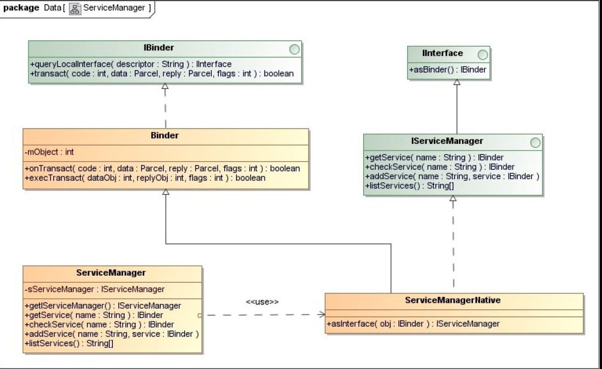

## 5.10　Binder 进程间通信机制的  `Java`  接口
在前面的小节中，我们分析的都是 `Binder` 进程间通信机制的 `C/C++` 实现，但是 `Android` 应用程序是使用 `Java` 语言开发的，那么它们是如何使用 `Binder` 进程间通信机制的呢？

我们知道， `Java` 代码可以通过 `JNI` 方法来调用 `C/C++` 代码，因此， `Android` 系统在应用程序框架层中提供了 `Binder` 进程间通信机制的 `Java` 接口，它们通过 `JNI` 方法来调用  `Binder` 库 的 `C/C++` 接口，从而提供了执行 `Binder` 进程间通信的能力。

在第 `2` 章学习 `Android` 系统的硬件抽象层时，我们先开发了一个硬件访问服务 `FregService` ，它运行在系统进程 `System` 中，并且在启动时通过 `Java` 层的 `Service Manager` 代理对象将自己注册到 `Service Manager` 中。接着又开发了一个应用程序 `Freg` ，它通过 `Java` 层的 `Service Manager` 代理对象来获得硬件访问服务 `FregService` 的一个代理对象，最后就可以通过这个代理对象来使用硬件访问服务 `FregService` 提供的服务了。

在本节中，我们将结合第 `2` 章所介绍的硬件访问服务 `FregService` ，以及使用了这个服务的应用程序 `Freg` 来分析 `Binder` 进程间通信机制的 `Java` 接口。

接下来，我们就结合硬件访问服务 `FregService` 和应用程序 `Freg` 这两个实例，通过下面五个使用情景来分析 `Binder` 进程间通信机制的 `Java` 接口。

1. `Service Manager` 的 `Java` 代理对象的获取过程。
2. `Java` 服务接口的定义和解析。
3. `Java` 服务的启动过程。
4. `Java` 服务代理对象的获取过程。
5. `Java` 服务的调用过程。

为了描述方便，在 `Java` 层中，我们将 `Service` 组件称为 `Java` 服务；相应的，将 `Service` 组件的代理对象称为 `Java` 服务代理对象。学习了 `Binder` 进程间通信机制的 `Java` 接口之后，我们就可以熟练地在 `Android` 应用程序中使用 `Binder` 进程间通信机制了。

### 5.10.1　 `Service Manager` 的 `Java` 代理对象的获取过程
在 `Java` 层中， `Service Manager` 的 `Java` 代理对象的类型为 `ServiceManagerProxy` ，它实现了 `IServiceManager` 接口，如图 `5-25` 所示。


`IServiceManager` 接口继承了 `IInterface` 接口，并且定义了四个成员函数： `getService` 、 `checkService` 、 `addService` 和 `listService` ，其中， `getService` 和 `checkService` 用来获取 `Java` 服务的代理对象， `addService` 用来注册 `Java` 服务， `listService` 用来获取注册在 `Service Manager` 中的 `Java` 服务名称列表。

 `Service Manager` 的 `Java` 代理对象的内部有一个成员变量 `mRemote` ，它的类型为 `IBinder` ，实际上指向的是一个 `BinderProxy` 对象。 `BinderProxy` 类用来描述一个 `Java` 服务代理对象，它实现了 `IBinder` 接口。 `BinderProxy` 类内部有一个类型为 `int` 的成员变量 `mObject` ，它指向 `C++` 层中的一个 `Binder` 代理对象。这样，我们就可以将一个 `Java` 服务代理对象和 `C++` 层中的一个 `Binder` 代理对象关联起来，即可以通过 `C++` 层中的 `Binder` 代理对象来实现 `Java` 服务代理对象的功能。

从 `Service Manager` 的 `Java` 代理对象的类关系图就可以知道，在创建一个 `Service Manager` 的 `Java` 代理对象之前，首先要在 `C++` 层中创建一个句柄值为 `0` 的 `Binder` 代理对象，然后再在 `Java` 层创建一个对应的 `Java` 服务代理对象。有了这个 `Java` 服务代理对象之后，我们就可以创建一个 `Service Manager` 的 `Java` 代理对象了。

在 `Java` 层中， `Service Manager` 的 `Java` 代理对象是由 `ServiceManager` 类来负责创建的，它的实现如图5-26所示。



`ServiceManager` 类内部有一个类型为 `ServiceManagerProxy` 的静态成员变量 `sServiceManager` ， `ServiceManager` 类的静态成员函数 `getService` 、 `checkService` 、 `addService` 和 `listServices` 就是通过它来实现的。 `ServiceManager` 类的另外一个静态成员函数 `getIServiceManager` 是用来创建一个 `Service Manager` 的 `Java` 代理对象的，并且保存在静态成员变量 `sServiceManager` 中。 `ServiceManager` 类的静态成员函数 `getIServiceManager` 在创建一个 `Service Manager` 的 `Java` 代理对象的过程中，会通过 `ServiceManagerNative` 类的静态成员函数 `asInterface` 将一个句柄值等于 `0` 的 `Java` 服务代理对象封装成一个 `ServiceManagerProxy` 对象。

`Java` 层的 `ServiceManagerNative` 类类似于 `C++` 层中的 `BnServiceManager` 类，它继承了 `Java` 层中的 `Binder` 类，是用来实现 `Java` 层中的 `Service Manager` 服务的。同样， `Java` 层中的 `Binder` 类类似于 `C++` 层中的B `Binder` 类，是用来实现一个 `Java` 服务的。 `Java` 层中的 `Binder` 类内部有一个类型为 `int` 的成员变量 `mObject` ，它指向 `C++` 层中的一个 `Binder` 本地对象。这样，我们就可以将一个 `Java` 服务和 `C++` 层中的一个 `Binder` 本地对象关联起来，即可以通过 `C++` 层中的 `Binder` 本地对象来实现 `Java` 服务的功能。

接下来，我们就分析 `ServiceManager` 类的静态成员函数 `getIServiceManager` 是如何创建 `Service Manager` 的 `Java` 代理对象的，它的实现如下所示。

`frameworks/base/core/Java/android/os/ServiceManager.Java`
```Java
01 public final class ServiceManager {
02     private static final String TAG = "ServiceManager";
03     private static IServiceManager sServiceManager;
04     private static HashMap<String, IBinder> sCache = new HashMap<String, IBinder>();
05 
06     private static IServiceManager getIServiceManager() {
07         if (sServiceManager != null) {
08             return sServiceManager;
09         }
10 
11         // Find the Service Manager
12         sServiceManager = ServiceManagerNative.asInterface(BinderInternal.getContextObject());
13         return sServiceManager;
14     }
15     ......
16 }
```
第 `7` 行首先判断 `ServiceManager` 类的静态成员变量 `sServiceManager` 的值是否不等于 `null` 。如果是，那么第 `8` 行就直接将它指向的一个 `ServiceManagerProxy` 对象返回给调用者；否则，第 `12` 行首先通过 `BinderInternal` 类的静态成员函数 `getContextObject` 创建一个句柄值等于 `0` 的 `Java` 服务代理对象，接着再通过 `ServiceManagerNative` 类的静态成员函数 `asInterface` 将这个 `Java` 服务代理对象封装成一个 `ServiceManagerProxy` 对象，最后保存在静态成员变量 `sServiceManager` 中，并且将它返回给调用者。

下面我们分别分析 `BinderInternal` 类的静态成员函数 `getContextObject` 和 `ServiceManagerNative` 类的静态成员函数 `asInterface` 的实现。

`BinderInternal` 类的静态成员函数 `getContextObject` 是一个 `JNI` 方法，它的定义如下所示。

`frameworks/base/core/Java/com/android/internal/os/BinderInternal.Java`
```Java
01 public class BinderInternal {
02     ......
03     
04     /**
05      * Return the global "context object" of the system.  This is usually
06      * an implementation of IServiceManager, which you can use to find
07      * other services.
08      */
09     public static final native IBinder getContextObject();
10     
11     ......
12 }
```
它是由 `C++` 层中的函数 `android_os_BinderInternal_getContextObject` 来实现的，如下所示。

`frameworks/base/core/jni/android_util_Binder.cpp`
```cpp
1 static jobject android_os_BinderInternal_getContextObject(JNIEnv* env, jobject clazz)
2 {
3     sp<IBinder> b = ProcessState::self()->getContextObject(NULL);
4     return JavaObjectForIBinder(env, b);
5 }
```
第 `3` 行调用进程中的 `ProcessState` 对象的成员函数 `getContextObject` 来获得一个句柄值等于 `NULL` ，即等于 `0` 的 `Binder` 代理对象，即一个 `BpBinder` 对象，接着第 `4` 行调用函数 `JavaObjectForIBinder` 为这个 `Binder` 代理对象创建一个 `Java` 服务代理对象，即一个 `BinderProxy` 对象，最后将它返回给调用者。

在前面的 `5.7` 小节中，我们已经分析过 `ProcessState` 类的成员函数 `getContextObject` 的实现了。接下来，我们就着重分析函数 `JavaObjectForIBinder` 的实现，看它是如何创建一个 `Java` 服务代理对象的。

在分析函数 `JavaObjectForIBinder` 的实现之前，我们先介绍三个全局变量： `gBinderOffsets` 、 `gBinderProxyOffsets` 和 `gWeakReferenceOffsets` 的定义。

全局变量 `gBinderOffsets` 是一个 `bindernative_offsets_t` 结构体，它的定义如下所示。

`frameworks/base/core/jni/android_util_Binder.cpp`
```cpp
static struct bindernative_offsets_t
{
    // Class state.
    jclass mClass;
    jmethodID mExecTransact;

    // Object state.
    jfieldID mObject;

} gBinderOffsets;
```
它有三个成员变量： `mClass` 、 `mExecTransact` 和 `mObject` ，其中， `mClass` 指向 `Java` 层中的 `Binder` 类，而 `mExecTransact` 和 `mObject` 分别指向这个 `Binder` 类的成员函数 `execTransact` 和成员变量 `mObject` 。

全局变量 `gBinderOffsets` 是在函数 `int_register_android_os_Binder` 中初始化的，如下所示。

`frameworks/base/core/jni/android_util_Binder.cpp`
```cpp
01 const char* const kBinderPathName = "android/os/Binder";
02 
03 static int int_register_android_os_Binder(JNIEnv* env)
04 {
05     jclass clazz;
06 
07     clazz = env->FindClass(kBinderPathName);
08     LOG_FATAL_IF(clazz == NULL, "Unable to find class android.os.Binder");
09 
10     gBinderOffsets.mClass = (jclass) env->NewGlobalRef(clazz);
11     gBinderOffsets.mExecTransact
12         = env->GetMethodID(clazz, "execTransact", "(IIII)Z");
13     assert(gBinderOffsets.mExecTransact);
14 
15     gBinderOffsets.mObject
16         = env->GetFieldID(clazz, "mObject", "I");
17     assert(gBinderOffsets.mObject);
18 
19     return AndroidRuntime::registerNativeMethods(
20         env, kBinderPathName,
21         gBinderMethods, NELEM(gBinderMethods));
22 }
```
全局变量 `gBinderProxyOffsets` 是一个 `binderproxy_offsets_t` 结构体，它的定义如下所示。

`frameworks/base/core/jni/android_util_Binder.cpp`
```cpp
static struct binderproxy_offsets_t
{
    // Class state.
    jclass mClass;
    jmethodID mConstructor;
    jmethodID mSendDeathNotice;

    // Object state.
    jfieldID mObject;
    jfieldID mSelf;

} gBinderProxyOffsets;
```
它有五个成员变量： `mClass` 、 `mConstructor` 、 `mSendDeathNotice` 、 `mObject` 和 `mSelf` ，其中， `mClass` 指向 `Java` 层中的 `BinderProxy` 类，而 `mConstructor` 、 `mSendDeathNotice` 、 `mObject` 和 `mSelf` 分别指向这个 `BinderProxy` 类的构造函数、静态成员函数 `sendDeathNotice` 、成员变量 `mObject` 和 `mSelf` 。

全局变量 `gBinderProxyOffsets` 是在函数 `int_register_android_os_BinderProxy` 中初始化的，如下所示。

`frameworks/base/core/jni/android_util_Binder.cpp`
```cpp
01 const char* const kBinderProxyPathName = "android/os/BinderProxy";
02 
03 static int int_register_android_os_BinderProxy(JNIEnv* env)
04 {
05     jclass clazz;
06     ......
07     
08     clazz = env->FindClass(" `Java` /lang/ref/WeakReference");
09     ......
10 
11     gBinderProxyOffsets.mClass = (jclass) env->NewGlobalRef(clazz);
12     gBinderProxyOffsets.mConstructor
13         = env->GetMethodID(clazz, "<init>", "()V");
14 
15     gBinderProxyOffsets.mSendDeathNotice
16         = env->GetStaticMethodID(clazz, "sendDeathNotice", "(Landroid/os/IBinder$DeathRecipient;)V");
17 
18 
19     gBinderProxyOffsets.mObject
20         = env->GetFieldID(clazz, "mObject", "I");
21 
22     gBinderProxyOffsets.mSelf
23         = env->GetFieldID(clazz, "mSelf", "L `Java` /lang/ref/WeakReference;");
24 
25     return AndroidRuntime::registerNativeMethods(
26         env, kBinderProxyPathName,
27         gBinderProxyMethods, NELEM(gBinderProxyMethods));
28 }
```
全局变量 `gWeakReferenceOffsets` 是一个 `weakreference_offsets_t` 结构体，它的定义如下所示。

`frameworks/base/core/jni/android_util_Binder.cpp`
```cpp
static struct weakreference_offsets_t
{
    // Class state.
    jclass mClass;
    jmethodID mGet;

} gWeakReferenceOffsets;
```
它有两个成员变量： `mClass` 和 `mGet` ，其中， `mClass` 指向 `Java` 层中的 `WeakReference` 类，而 `mGet` 指向这个 `WeakReference` 类的成员函数 `get` 。

全局变量 `gWeakReferenceOffsets` 同样是在函数 `int_register_android_os_BinderProxy` 中初始化的，如下所示：

`frameworks/base/core/jni/android_util_Binder.cpp`
```cpp
01 static int int_register_android_os_BinderProxy(JNIEnv* env)
02 {
03     jclass clazz;
04 
05     clazz = env->FindClass(" `Java` /lang/ref/WeakReference");
06     .....
07     gWeakReferenceOffsets.mClass = (jclass) env->NewGlobalRef(clazz);
08     gWeakReferenceOffsets.mGet
09         = env->GetMethodID(clazz, "get", "()L `Java` /lang/Object;");
10     .....
11 }
```
了解了全局变量 `gBinderOffsets` 、 `gBinderProxyOffsets` 和 `gWeakReferenceOffsets` 的定义之后，现在我们就可以分析函数 `JavaObjectForIBinder` 的实现了，它的定义如下所示。

`frameworks/base/core/jni/android_util_Binder.cpp`
```cpp
01 jobject JavaObjectForIBinder(JNIEnv* env, const sp<IBinder>& val)
02 {
03     if (val == NULL) return NULL;
04 
05     if (val->checkSubclass(&gBinderOffsets)) {
06         // One of our own!
07         jobject object = static_cast< JavaBBinder*>(val.get())->object();
08         ......
09         return object;
10     }
11 
12     // For the rest of the function we will hold this lock, to serialize
13     // looking/creation of Java proxies for native Binder proxies.
14     AutoMutex _l(mProxyLock);
15 
16     // Someone else's...  do we know about it?
17     jobject object = (jobject)val->findObject(&gBinderProxyOffsets);
18     if (object != NULL) {
19         jobject res = env->CallObjectMethod(object, gWeakReferenceOffsets.mGet);
20         if (res != NULL) {
21             ......
22             return res;
23         }
24         ......
25         val->detachObject(&gBinderProxyOffsets);
26         ......
27     }
28 
29     object = env->NewObject(gBinderProxyOffsets.mClass, gBinderProxyOffsets.mConstructor);
30     if (object != NULL) {
31         ......
32         // The proxy holds a reference to the native object.
33         env->SetIntField(object, gBinderProxyOffsets.mObject, (int)val.get());
34         val->incStrong(object);
35 
36         // The native object needs to hold a weak reference back to the
37         // proxy, so we can retrieve the same proxy if it is still active.
38         jobject refObject = env->NewGlobalRef(
39                 env->GetObjectField(object, gBinderProxyOffsets.mSelf));
40         val->attachObject(&gBinderProxyOffsets, refObject,
41                 jnienv_to_Javavm(env), proxy_cleanup);
42 
43         ......
44     }
45 
46     return object;
47 }
```
参数 `val` 要么指向一个 `Binder` 代理对象，要么指向一个 `Binder` 本地对象。当它指向的是一个 `Binder` 本地对象时，它的类型为 `JavaBBinder` ，后者继承了 `BBinder` 。

第 `5` 行调用参数 `val` 的成员函数 `checkSubclass` 来检查它指向的是一个 `Binder` 代理对象，还是一个 `JavaBBinder` 对象。

 `Binder` 代理对象的成员函数 `checkSubclass` 是由其父类 `IBinder` 来实现的，如下所示。

`frameworks/base/libs/binder/Binder.cpp`
```cpp
bool IBinder::checkSubclass(const void* /*subclassID*/) const
{
    return false;
}
```
它的返回值恒为 `false` 。

 `JavaBBinder`对象重写了其父类 `BBinder` 的父类 `IBinder` 的成员函数 `checkSubclass` ，如下所示。

`frameworks/base/core/jni/android_util_Binder.cpp`
```cpp
01 class  JavaBBinder : public BBinder
02 {
03 public:
04     ......
05 
06     bool checkSubclass(const void* subclassID) const
07     {
08         return subclassID == &gBinderOffsets;
09     }
10     
11     ......
12 }
```
它检查参数 `subclassID` 是否指向全局变量 `gBinderOffsets` 。如果是，它的返回值就等于 `true` ；否则，它的返回值就等于 `false` 。

回到函数 `JavaObjectForIBinder` 中，如果参数 `val` 指向的是一个 `JavaBBinder` 对象，那么调用它的成员函数 `checkSubclass` 得到的返回值就等于 `true` 。因此，这时候第 `7` 行就调用该 `JavaBBinder` 对象的成员函数 `object` 来获得一个 `Java` 对象，并且第 `9` 行将它返回给调用者。

`JavaBBinder` 类的成员函数 `object` 的实现如下所示。

`frameworks/base/core/jni/android_util_Binder.cpp`
```cpp
01 class JavaBBinder : public BBinder
02 {
03 public:
04     .....
05 
06     jobject object() const
07     {
08         return mObject;
09     }
10     
11 private:
12     JavaVM* const   mVM;
13     jobject const   mObject;
14 };
```
在后面的 `5.10.3` 小节中，我们就会知道， `JavaBBinder` 类的成员变量 `mObject` 指向的是 `Java` 层中的一个 `Binder` 对象，因此， `JavaBBinder` 类的成员函数 `object` 返回给调用者的实际上是 `Java` 层中的一个 `Binder` 对象。

回到函数 `JavaObjectForIBinder` 中，从前面的调用过程可以知道，这时候参数 `val` 指向的是一个句柄值等于 `0` 的 `Binder` 代理对象，因此，接下来就会执行第 `14` 行到第 `46` 行代码创建一个 `Java` 层的 `Java` 服务代理对象，即一个 `BinderProxy` 对象。

第 `17` 行调用 `Binder` 代理对象 `val` 的成员函数 `findObject` 来检查当前进程之前是否已经为它创建过一个 `BinderProxy` 对象了。如果是，第 `17` 行返回来的就是一个指向该 `BinderProxy` 对象的 `WeakReference` 对象 `object` ，即一个弱引用对象。由于弱引用对象 `object` 所指向的 `BinderProxy` 对象可能已经失效，因此，第 `19` 行就需要继续检查它的有效性，方法是调用它的成员函数 `get` 来获得一个强引用对象。如果能够成功地将弱引用对象 `object` 升级为一个强引用对象，即第 `20` 行的 `if` 语句为 `true` ，那么第 `22` 行就将该 `BinderProxy` 对象返回给调用者；否则，第 `25` 行就调用 `Binder` 代理对象 `val` 的成员函数 `detachObject` 来解除它与一个无效的 `BinderProxy` 对象的对应关系。

 `Binder` 代理对象内部有一个成员变量 `mObjects` ，它的类型为 `ObjectManager` ，用来管理与该 `Binder` 代理对象关联的外部对象。例如，函数 `JavaObjectForIBinder` 在为一个 `Binder` 代理对象创建一个 `Java` 服务代理对象时，就会将创建出来的 `Java` 服务代理对象保存在该 `Binder` 代理对象的成员变量 `mObjects` 中，以便以后需要获取与该 `Binder` 代理对象对应的 `Java` 服务代理对象时，就可以通过它的成员变量 `mObjects` 来直接获得。由于一个 `Binder` 代理对象所关联的外部对象可能不止一个，因此，我们需要通过额外的一个参数来关联一个 `Binder` 代理对象和一个 `Java` 服务代理对象，这个参数就是全局变量 `gBinderProxyOffsets` 的地址值。

在继续分析函数 `JavaObjectForIBinder` 的实现之前，我们首先介绍一个 `Binder` 代理对象是如何与一 `Java` 服务代理对象关联起来的。

`ObjectManager` 类的定义如下所示。

`frameworks/base/include/binder/BpBinder.h`
```cpp
01 class BpBinder : public IBinder
02 {
03 public:
04     ......
05 
06     class ObjectManager
07     {
08     public:
09                     ObjectManager();
10                     ~ObjectManager();
11 
12         void        attach( const void* objectID,
13                             void* object,
14                             void* cleanupCookie,
15                             IBinder::object_cleanup_func func);
16         void*       find(const void* objectID) const;
17         void        detach(const void* objectID);
18 
19         void        kill();
20 
21     private:
22                     ObjectManager(const ObjectManager&);
23         ObjectManager& operator=(const ObjectManager&);
24 
25         struct entry_t
26         {
27             void* object;
28             void* cleanupCookie;
29             IBinder::object_cleanup_func func;
30         };
31 
32         KeyedVector<const void*, entry_t> mObjects;
33     };
34     ......
35 
36 private:
37     ......
38             ObjectManager       mObjects;
39     ......
40 };
```
`ObjectManager` 是定义在 `BpBinder` 内部的一个类，它有一个类型为 `KeyedVector` 的成员变量 `mObjects` 。这个成员变量以一个 `void` 指针作为关键字来维护与一个 `Binder` 代理对象所关联的外部对象，这些外部对象都使用一个 `entry_t` 结构体来描述。

结构体 `entry_t` 有三个成员变量： `object` 、 `func` 和 `cleanupCookie` ，其中， `object` 指向一个外部对象的一个弱引用对象； `func` 是一个类型为 `IBinder::object_cleanup_func` 的函数指针，它是用来清理成员变量 `object` 所指向的外部对象的； `cleanupCookie` 是函数指针 `func` 所指向的清理函数的一个调用参数。

当一个 `Binder` 代理对象被析构时，我们就需要清理与它所关联的外部对象，这是通过调用它的成员变量 `mObjects` 的成员函数 `kill` 来实现的，如下所示。

`frameworks/base/libs/binder/BpBinder.cpp`
```cpp
01 void BpBinder::ObjectManager::kill()
02 {
03     const size_t N = mObjects.size();
04     LOGV("Killing %d objects in manager %p", N, this);
05     for (size_t i=0; i<N; i++) {
06         const entry_t& e = mObjects.valueAt(i);
07         if (e.func != NULL) {
08             e.func(mObjects.keyAt(i), e.object, e.cleanupCookie);
09         }
10     }
11 
12     mObjects.clear();
13 }
```
第 `5` 行到第 `10` 行的 `for` 循环遍历 `ObjectManager` 类的成员变量 `mObjects` 所描述的一个外部对象列表。由于列表中的每一个 `entry_t` 结构体都描述了一个外部对象，因此，第 `8` 行就调用它的成员变量 `func` 所指向的一个函数来清理它们。

此外， `ObjectManager` 类还提供了另外的三个成员函数： `attach` 、 `find` 和 `detach` ，分别用来增加、查找和删除外部对象，它们的实现如下所示。

`frameworks/base/libs/binder/BpBinder.cpp`
```cpp
01 void BpBinder::ObjectManager::attach(
02     const void* objectID, void* object, void* cleanupCookie,
03     IBinder::object_cleanup_func func)
04 {
05     entry_t e;
06     e.object = object;
07     e.cleanupCookie = cleanupCookie;
08     e.func = func;
09 
10     if (mObjects.indexOfKey(objectID) >= 0) {
11         ......
12         return;
13     }
14 
15     mObjects.add(objectID, e);
16 }
17 
18 void* BpBinder::ObjectManager::find(const void* objectID) const
19 {
20     const ssize_t i = mObjects.indexOfKey(objectID);
21     if (i < 0) return NULL;
22     return mObjects.valueAt(i).object;
23 }
24 
25 void BpBinder::ObjectManager::detach(const void* objectID)
26 {
27     mObjects.removeItem(objectID);
28 }
```
成员函数 `attach` 的参数 `object` 、 `cleanupCookie` 和 `func` 用来描述一个外部对象，即用来创建一个 `entry_t` 结构体；而参数 `objectID` 是用来标志前面三个参数所描述的一个外部对象的，因此，第 `15` 行就以它为关键字将前面创建的一个 `entry_t` 结构体保存在 `ObjectManager` 类的成员变量 `mObjects` 所描述的一个外部对象列表中。

成员函数 `find` 以参数 `objectID` 为关键字，在 `ObjectManager` 类的成员变量 `mObjects` 所描述的一个外部对象列表中找到一个对应的 `entry_t` 结构体，并且将这个 `entry_t` 结构体的成员变量 `object` 所指向的一个外部对象返回给调用者。

成员函数 `detach` 以参数 `objectID` 为关键字，在 `ObjectManager` 类的成员变量 `mObjects` 所描述的一个外部对象列表中删除一个对应的 `entry_t` 结构体，即解除一个外部对象与一个 `Binder` 代理对象的关联关系。

相应地， `Binder` 代理对象也提供了三个成员函数： `attachObject` 、 `findObject` 和 `detachObject` ，用来增加、查找和删除与它关联的外部对象，它们的实现如下所示。

`frameworks/base/libs/binder/BpBinder.cpp`
```cpp
01 void BpBinder::attachObject(
02     const void* objectID, void* object, void* cleanupCookie,
03     object_cleanup_func func)
04 {
05     AutoMutex _l(mLock);
06     LOGV("Attaching object %p to binder %p (manager=%p)", object, this, &mObjects);
07     mObjects.attach(objectID, object, cleanupCookie, func);
08 }
09 
10 void* BpBinder::findObject(const void* objectID) const
11 {
12     AutoMutex _l(mLock);
13     return mObjects.find(objectID);
14 }
15 
16 void BpBinder::detachObject(const void* objectID)
17 {
18     AutoMutex _l(mLock);
19     mObjects.detach(objectID);
20 }
```
它们分别是通过调用内部的成员变量 `mObjects` 的成员函数 `attach` 、 `find` 和 `detach` 来实现的，即调用前面所介绍的 `ObjectManager` 类的成员函数 `attach` 、 `find` 和 `detach` 来实现。

回到函数 `JavaObjectForIBinder` 中，如果我们还没有为 `Binder` 代理对象 `val` 创建过 `Java` 服务代理对象，那么接下来第 `29` 行就会为它创建一个 `Java` 服务代理对象 `object` 。如果创建成功，即第 `30` 行的 `if` 语句为 `true` ，那么第 `33` 行就会将 `Binder` 代理对象 `val` 的地址值设置到前面所创建的 `Java` 服务代理对象 `object` 的成员变量 `mObject` 中。接着第 `34` 行增加 `Binder` 代理对象 `val` 的强引用计数，因为它被 `Java` 服务代理对象 `object` 引用了。

 `Java` 服务代理对象内部有一个成员变量 `mSelf` ，它指向了一个引用了该 `Java` 服务代理对象的弱引用对象，即一个 `WeakReference` 对象。第 `38` 行和第 `39` 行首先获得 `Java` 服务代理对象 `object` 内部的成员变量 `mSelf` 所指向的一个弱引用对象，接着再创建一个全局引用对象来引用它。接下来第 `40` 行和第 `41` 行就通过全局变量 `gBinderProxyOffsets` 将这个全局引用对象与 `Binder` 代理对象 `val` 关联起来，相当于将前面所创建的 `Java` 服务代理对象 `object` 与 `Binder` 代理对象 `val` 关联起来。这样，当我们以后再以 `Binder` 代理对象 `val` 为参数来调用函数 `JavaObjectForIBinder` 时，就可以直接获得保存在它内部的成员变量 `mObjects` 中的 `Java` 服务代理对象了。

最后，第 `46` 行就可以将前面所创建的 `Java` 服务代理对象 `object` 返回给调用者了。

函数 `JavaObjectForIBinder` 执行完成之后，先返回到 `BinderInternal` 类的静态成员函数 `getContextObject` 中，接着再返回到 `ServiceManager` 类的静态成员函数 `getIServiceManager` 中，这时候我们就获得一个句柄值等于 `0` 的 `Java` 服务代理对象，接下来就可以调用 `ServiceManagerNative` 类的静态成员函数 `asInterface` 将它封装成一个 `Service Manager` 的 `Java` 代理对象了。

 `ServiceManagerNative` 类的静态成员函数 `asInterface` 的实现如下所示。

`frameworks/base/core/Java/android/os/ServiceManagerNative.Java`
```Java
01 public abstract class ServiceManagerNative extends Binder implements IServiceManager
02 {
03     ......
04 
05     static public IServiceManager asInterface(IBinder obj)
06     {
07         if (obj == null) {
08             return null;
09         }
10         IServiceManager in =
11             (IServiceManager)obj.queryLocalInterface(descriptor);
12         if (in != null) {
13             return in;
14         }
15         
16         return new ServiceManagerProxy(obj);
17     }
18     ......
19 }
```
参数 `obj` 指向一个 `Java` 服务代理对象，即一个 `BinderProxy` 对象，它的成员函数 `queryLocalInterface` 的返回值为 `null` ，因此，第 `16` 行就会先创建一个 `ServiceManagerProxy` 对象，即一个 `Service Manager` 的 `Java` 代理对象，接着将它返回给调用者。

回到 `ServiceManager` 类的静态成员函数 `getIServiceManager` 中，接着它就可以将获得的 `Service Manager` 的 `Java` 代理对象保存在其静态成员变量 `sServiceManager` 中，最后将它的 `IServiceManager` 接口返回给调用者。

### 5.10.2 Java 服务接口的定义和解析
在实现自己的 `Java` 服务之前，首先要定义这个 `Java` 服务要实现的接口，即定义自己的 `Java` 服务接口。在 `Android` 应用程序中，我们可以通过 `Android` 接口描述语言（ `Android Interface Definition Language, AIDL` ）来定义 `Java` 服务接口。 `AIDL` 是一种 `Binder` 进程间通信接口的描述语言，通过它来定义的 `Java` 服务接口具有执行 `Binder` 进程间通信的能力。

以 `AIDL` 定义的 `Java` 服务接口保存在一个以 `.aidl` 为后缀名的文件中，在编译时，它们会被转化为使用 `Java` 语言来描述的 `Java` 服务接口。学习这些使用 `Java` 语言描述的 `Java` 服务接口有助于我们进一步理解 `Binder` 进程间通信机制的 `Java` 接口，因此，接下来我们就以 `2.4.1` 小节中介绍的硬件访问服务接口 `IFregService` 为例，详细分析这些使用 `AIDL` 定义的 `Java` 服务接口是如何被编译为使用 `Java` 语言来描述的 `Java` 服务接口的。

硬件访问服务接口 `IFregService` 定义在文件 `IFregService.aidl` 中，文件内容如下所示。

```Java
package android.os;

interface IFregService {
    void setVal(int val);
    int getVal();
}
```
硬件访问服务接口 `IFregService` 有两个成员函数： `setVal` 和 `getVal` ，分别用来写和读虚拟硬件设备 `freg` 的寄存器 `val` 。

在编译文件 `IFregService.aidl` 时，编译系统会生成一个中间文件 `IFregService.Java`  ，它的内容如下所示。

```Java
001 /*
002  * This file is auto-generated.  DO NOT MODIFY.
003  */
004 package android.os;
005 public interface IFregService extends android.os.IInterface
006 {
007   /** Default implementation for IFregService. */
008   public static class Default implements android.os.IFregService
009   {
010     @Override public void setVal(int val) throws android.os.RemoteException
011     {
012     }
013     @Override public int getVal() throws android.os.RemoteException
014     {
015       return 0;
016     }
017     @Override
018     public android.os.IBinder asBinder() {
019       return null;
020     }
021   }
022   /** Local-side IPC implementation stub class. */
023   public static abstract class Stub extends android.os.Binder implements android.os.IFregService
024   {
025     private static final java.lang.String DESCRIPTOR = "android.os.IFregService";
026     /** Construct the stub at attach it to the interface. */
027     public Stub()
028     {
029       this.attachInterface(this, DESCRIPTOR);
030     }
031     /**
032      * Cast an IBinder object into an android.os.IFregService interface,
033      * generating a proxy if needed.
034      */
035     public static android.os.IFregService asInterface(android.os.IBinder obj)
036     {
037       if ((obj==null)) {
038         return null;
039       }
040       android.os.IInterface iin = obj.queryLocalInterface(DESCRIPTOR);
041       if (((iin!=null)&&(iin instanceof android.os.IFregService))) {
042         return ((android.os.IFregService)iin);
043       }
044       return new android.os.IFregService.Stub.Proxy(obj);
045     }
046     @Override public android.os.IBinder asBinder()
047     {
048       return this;
049     }
050     @Override public boolean onTransact(int code, android.os.Parcel data, android.os.Parcel reply, int flags) throws android.os.RemoteException
051     {
052       java.lang.String descriptor = DESCRIPTOR;
053       switch (code)
054       {
055         case INTERFACE_TRANSACTION:
056         {
057           reply.writeString(descriptor);
058           return true;
059         }
060         case TRANSACTION_setVal:
061         {
062           data.enforceInterface(descriptor);
063           int _arg0;
064           _arg0 = data.readInt();
065           this.setVal(_arg0);
066           reply.writeNoException();
067           return true;
068         }
069         case TRANSACTION_getVal:
070         {
071           data.enforceInterface(descriptor);
072           int _result = this.getVal();
073           reply.writeNoException();
074           reply.writeInt(_result);
075           return true;
076         }
077         default:
078         {
079           return super.onTransact(code, data, reply, flags);
080         }
081       }
082     }
083     private static class Proxy implements android.os.IFregService
084     {
085       private android.os.IBinder mRemote;
086       Proxy(android.os.IBinder remote)
087       {
088         mRemote = remote;
089       }
090       @Override public android.os.IBinder asBinder()
091       {
092         return mRemote;
093       }
094       public java.lang.String getInterfaceDescriptor()
095       {
096         return DESCRIPTOR;
097       }
098       @Override public void setVal(int val) throws android.os.RemoteException
099       {
100         android.os.Parcel _data = android.os.Parcel.obtain();
101         android.os.Parcel _reply = android.os.Parcel.obtain();
102         try {
103           _data.writeInterfaceToken(DESCRIPTOR);
104           _data.writeInt(val);
105           boolean _status = mRemote.transact(Stub.TRANSACTION_setVal, _data, _reply, 0);
106           if (!_status && getDefaultImpl() != null) {
107             getDefaultImpl().setVal(val);
108             return;
109           }
110           _reply.readException();
111         }
112         finally {
113           _reply.recycle();
114           _data.recycle();
115         }
116       }
117       @Override public int getVal() throws android.os.RemoteException
118       {
119         android.os.Parcel _data = android.os.Parcel.obtain();
120         android.os.Parcel _reply = android.os.Parcel.obtain();
121         int _result;
122         try {
123           _data.writeInterfaceToken(DESCRIPTOR);
124           boolean _status = mRemote.transact(Stub.TRANSACTION_getVal, _data, _reply, 0);
125           if (!_status && getDefaultImpl() != null) {
126             return getDefaultImpl().getVal();
127           }
128           _reply.readException();
129           _result = _reply.readInt();
130         }
131         finally {
132           _reply.recycle();
133           _data.recycle();
134         }
135         return _result;
136       }
137       public static android.os.IFregService sDefaultImpl;
138     }
139     static final int TRANSACTION_setVal = (android.os.IBinder.FIRST_CALL_TRANSACTION + 0);
140     static final int TRANSACTION_getVal = (android.os.IBinder.FIRST_CALL_TRANSACTION + 1);
141     public static boolean setDefaultImpl(android.os.IFregService impl) {
142       // Only one user of this interface can use this function
143       // at a time. This is a heuristic to detect if two different
144       // users in the same process use this function.
145       if (Stub.Proxy.sDefaultImpl != null) {
146         throw new IllegalStateException("setDefaultImpl() called twice");
147       }
148       if (impl != null) {
149         Stub.Proxy.sDefaultImpl = impl;
150         return true;
151       }
152       return false;
153     }
154     public static android.os.IFregService getDefaultImpl() {
155       return Stub.Proxy.sDefaultImpl;
156     }
157   }
158   public void setVal(int val) throws android.os.RemoteException;
159   public int getVal() throws android.os.RemoteException;
160 }
```
文件定义了一个 `Java` 接口 `IFregService` 、一个 `Java` 抽象类 `IFregService.Stub` 和一个 `Java` 类 `IFregService.Stub.Proxy` ，其中， `Java` 抽象类 `IFregService.Stub` 是在 `Java` 接口 `IFregService` 内部定义的，而 `Java` 类 `IFregService.Stub.Proxy` 是在 `Java` 抽象类 `IFregService.Stub` 内部定义的。

`IFregService.Stub` 和 `IFregService.Stub.Proxy` 类都实现了 `IFregService` 接口，其中， `IFregService.Stub` 类用来描述一个 `Java` 服务，而 `IFregService.Stub.Proxy` 类用来描述一个 `Java` 服务代理对象。我们要实现的硬件访问服务 `FregService` 就是以 `IFregService.Stub` 为父类的，并且实现了它的 `IFregService` 接口的两个成员函数 `setVal` 和 `getVal` 。

`IFregService.Stub` 类的静态成员函数 `asInterface` 通常用来将一个 `Java` 服务代理对象，即一个 `BinderProxy` 对象封装成一个 `IFregService.Stub.Proxy` 对象，即一个实现了 `IFregService` 接口的 `Java` 服务代理对象。

`IFregService.Stub` 类的成员函数 `onTransact` 是用来接收和分发进程间通信请求的。当 `Client` 进程向一个实现了 `IFregService` 接口的 `Java` 服务发送一个类型为 `TRANSACTION_setVal` 或者 `TRANSACTION_getVal` 的进程间通信请求时， `IFregService.Stub` 类的成员函数 `onTransact` 就会被调用，它分别将这两种类型的进程间通信请求分发给由其子类所重写的两个成员函数 `setVal` 和 `getVal` 来处理。

`IFregService.Stub.Proxy` 类内部有一个成员变量 `mRemote` ，它指向的是一个 `Java` 服务代理对象，即一个 `BinderProxy` 对象，用来向一个实现了 `IFregService` 接口的 `Java` 服务发送进程间通信请求。

`IFregService.Stub.Proxy` 类实现了 `IFregService` 接口的两个成员函数： `setVal` 和 `getVal` ，它们分别向一个实现了 `IFregService` 接口的 `Java` 服务发送一个类型为 `TRANSACTION_setVal` 和 `TRANSACTION_getVal` 的进程间通信请求。

得到了使用 `Java` 语言描述的 `Java` 服务接口之后，接下来我们继续分析 `Java` 服务的启动过程、 `Java` 服务代理对象的获取过程，以及 `Java` 服务的调用过程。

### 5.10.3　 `Java` 服务的启动过程
 `Java` 服务一般是运行在 `Android` 系统进程 `System` 或者 `Android` 应用程序进程中的，它们在启动之前，同样需要将自己注册到 `Service Manager` 中，以便 `Client` 进程可以通过 `Service Manager` 来获得它们的 `Java` 服务代理对象。

由于 `Android` 系统进程 `System` 和 `Android` 应用程序进程在启动时会在内部启动一个 `Binder` 线程池，因此，运行在它们里面的 `Java` 服务在启动时，只需要将自己注册到 `Service Manager` 中就可以了。接下来，我们就以 `2.4` 小节介绍的硬件访问服务 `FregService` 为例，详细分析一个 `Java` 服务的启动过程。

硬件访问服务 `FregService` 是从 `IFregService.Stub` 类继承下来的，它是一个实现了 `IFregService` 接口的 `Java` 服务，它的定义如下所示。

```Java
package com.android.server;

import android.content.Context;
import android.os.IFregService;
import android.util.Slog;

public class FregService extends IFregService.Stub{
	......
};
```
硬件访问服务 `FregService` 是在 `Android` 系统进程 `System` 中启动的，如下所示。

`frameworks/services/java/com/android/server/ServerThread.java`
```Java 
01 class ServerThread extends Thread{
02 	......
03 	
04 	@override
05 	public void run(){
06 		......
07 		
08 		try {
09 			Slog.i(TAG, "Freg Service");
10 			ServiceManager.addService("freg", new FregService());
11 		} catch (Throwable e) {
12 			Slog.e(TAG, "Failure starting Freg Service", e);
13 		}
14 		
15 		......
16 	}
17 }
```
`Android` 系统进程 `System` 在启动时，会创建一个 `ServerThread` 线程来启动系统中的关键服务，硬件访问服务 `FregService` 就是在这个 `ServerThread` 线程中启动的。第 `10` 行首先创建一个硬件访问服务 `FregService` ，接着再调用 `ServiceManager` 类的静态成员函数 `addService` 将它注册到 `Service Manager` 中。

接下来，我们首先分析硬件访问服务 `FregService` 的创建过程，然后再分析它的注册过程。

由于硬件访问服务 `FregService` 继承了 `IFregService.Stub` 类，而后者又继承了 `Binder` 类，因此，硬件访问服务 `FregService` 在创建的过程中，会调用 `Binder` 类的构造函数来执行初始化操作。

 `Binder` 类的构造函数的实现如下所示。

```Java
01 public class Binder implements IBinder {
02     ......
03 
04     private int mObject;
05 
06     ......
07     
08     public Binder() {
09         init();
10     ......
11     }
12     
13     private native final void init();
14     ......
15 }
```
它主要是调用了成员函数 `init` 来执行初始化工作。 `Binder` 类的成员函数 `init` 是一个 `JNI` 方法，它的实现如下所示。

`frameworks/base/core/jni/android_util_Binder.cpp`
```cpp
1 static void android_os_Binder_init(JNIEnv* env, jobject clazz)
2 {
3     JavaBBinderHolder* jbh = new  `Java` BBinderHolder(env, clazz);
4     ......
5     
6     jbh->incStrong(clazz);
7     env->SetIntField(clazz, gBinderOffsets.mObject, (int)jbh);
8 }
```
参数 `clazz` 指向的是前面在 `Java` 层中创建的硬件访问服务 `FregService` ，第 `3` 行以它为参数在 `C++` 层中创建了一个 `JavaBBinderHolder` 对象 `jbh` ，接着第 `6` 行代码增加了 `JavaBBinderHolder` 对象 `jbh` 的强引用计数，因为它被 `Java` 层中的硬件访问服务 `FregService` 引用了。最后，第 `7` 行代码将 `JavaBBinderHolder` 对象 `jbh` 的地址值保存在硬件访问服务 `FregService` 的父类 `Binder` 的成员变量 `mObject` 中。这样，运行在 `Java` 层中的硬件访问服务 `FregService` 就可以通过它的成员变量 `mObject` 来访问运行在 `C++` 层中的 `JavaBBinderHolder` 对象 `jbh` 了。

 `JavaBBinderHolder` 对象 `jbh` 的创建过程如下所示。

`frameworks/base/core/jni/android_util_Binder.cpp`
```cpp
01 class JavaBBinderHolder : public RefBase
02 {
03 public:
04     JavaBBinderHolder(JNIEnv* env, jobject object)
05         : mObject(object)
06     {
07         LOGV("Creating JavaBBinderHolder for Object %p\n", object);
08     }
09     ......
10 
11 private:
12     Mutex           mLock;
13     jobject         mObject;
14     wp<JavaBBinder> mBinder;
15 };
```
它将参数 `object` 保存在自己的成员变量 `mObject` 中。从前面的调用过程可以知道，参数 `object` 指向的是一个在 `Java` 层中创建的硬件访问服务 `FregService` 。这样，运行在 `C++` 层中的 `JavaBBinderHolder` 对象 `jbh` 就可以通过它的成员变量 `mObject` 来访问运行在 `Java` 层中的硬件访问服务 `FregService` 了。

`JavaBBinderHolder` 类还有一个成员变量 `mBinder` ，它指向的是一个 `JavaBBinder` 对象。 `JavaBBinder` 类继承了 `Binder` 库中的 `BBinder` 类，因此，它可以用来描述一个 `Binder` 本地对象。

至此，硬件访问服务 `FregService` 的创建过程就结束了。从它的创建过程可以知道，它在 `C++` 层中有一个对应的 `JavaBBinderHolder` 对象，而这个 `JavaBBinderHolder` 对象通过其成员变量 `mBinder` 持有一个类型为 `JavaBBinder` 的 `Binder` 本地对象。接下来我们就会看到，硬件访问服务 `FregService` 的进程间通信功能就是通过与其对应的 `JavaBBinderHolder` 对象所持有的一个类型为 `JavaBBinder` 的 `Binder` 本地对象来实现的。

硬件访问服务 `FregService` 创建完成之后，返回到 `ServerThread` 类的成员函数 `run` 中，接下来就调用 `ServiceManager` 类的静态成员函数 `addService` 将它注册到 `Service Manager` 中。

 `ServiceManager` 类的静态成员函数 `addService` 的实现如下所示。

`frameworks/base/core/Java/android/os/ServiceManager.Java`
```Java
    public static void addService(String name, IBinder service) {
        try {
            getIServiceManager().addService(name, service);
        } catch (RemoteException e) {
            Log.e(TAG, "error in addService", e);
        }
    }
```
第 `6` 行首先调用 `ServiceManager` 类的静态成员函数 `getIServiceManager` 来获得一个 `Service Manager` 的 `Java` 代理对象，接着再调用这个 `Java` 代理对象的成员函数 `addService` 将 `Java` 服务 `service` 注册到 `ServiceManager` 中，并且指定这个 `Java` 服务 `service` 的注册名称将 `Java` 服务 `service` 注册到 `ServiceManager` 中，并且指定这个 `Java` 服务 `service` 的注册名称为 `name` 。

`ServiceManager` 的 `Java` 代理对象的成员函数 `addService` 的实现如下所示。

`frameworks/base/core/Java/android/os/ServiceManagerNative.Java`
```Java
    public void addService(String name, IBinder service)
            throws RemoteException {
        Parcel data = Parcel.obtain();
        Parcel reply = Parcel.obtain();
        data.writeInterfaceToken(IServiceManager.descriptor);
        data.writeString(name);
        data.writeStrongBinder(service);
        mRemote.transact(ADD_SERVICE_TRANSACTION, data, reply, 0);
        reply.recycle();
        data.recycle();
    }
    private IBinder mRemote;
```
类似于 `C++` 层中的 `Parcel` 类， `Java` 层中的 `Parcel` 类也是用来封装进程间通信数据的。 `Java` 层中的每一个 `Parcel` 对象在 `C++` 层中都有一个对应的 `Parcel` 对象，后者的地址值就保存在前者的成员变量 `mObject` 中。当我们将进程间通信数据封装在一个 `Java` 层中的 `Parcel` 对象时，这个 `Java` 层中的 `Parcel` 对象就会通过其成员变量 `mObject` 找到与它对应的运行在 `C++` 层中的 `Parcel` 对象，并且将这些进程间通信数据封装到 `C++` 层中的 `Parcel` 对象里面去。

第 `6` 行和第 `7` 行创建了两个 `Parcel` 对象 `data` 和 `reply` ，其中， `Parcel` 对象 `data` 是用来封装进程间通信数据的，而 `Parcel` 对象 `reply` 是用来封装进程间通信结果数据的。第 `8` 行首先调用 `Parcel` 对象 `data` 的成员函数 `writeInterfaceToken` 写入一个进程间通信头，接着第 `9` 行调用 `Parcel` 对象 `data` 的成员函数 `writeString` 写入一个即将要注册的 `Java` 服务的名称，最后第 `10` 行调用 `Parcel` 对象 `data` 的成员函数 `wrtieStrongBinder` 写入一个即将要注册的 `Java` 服务。下面我们就着重分析即将要注册的 `Java` 服务，即硬件访问服务 `FregService` 是如何写入到 `Parcel` 对象 `data` 中的。

 `Java` 层中的 `Parcel` 类的成员函数 `wrtieStrongBinder` 是一个 `JNI` 方法，它的定义如下所示。

`frameworks/base/core/Java/android/os/Parcel.Java`
```Java
    public final native void writeStrongBinder(IBinder val);
```
它对应的实现函数为 `android_os_Parcel_writeStrongBinder` ，如下所示。

`frameworks/base/core/jni/android_util_Binder.cpp`
```cpp
1 static void android_os_Parcel_writeStrongBinder(JNIEnv* env, jobject clazz, jobject object)
2 {
3     Parcel* parcel = parcelForJavaObject(env, clazz);
4     if (parcel != NULL) {
5         const status_t err = parcel->writeStrongBinder(ibinderForJavaObject(env, object));
6         ......
7     }
8 }
```
参数 `clazz` 指向的是一个 `Java` 层中的 `Parcel` 对象，第 `3` 行调用函数 `parecelForJavaObject` 获得一个与它对应的、运行在 `C++` 层中的 `Parcel` 对象 `parcel` 。

参数 `object` 指向的是即将要注册的 `Java` 服务，第 `5` 行首先调用函数 `ibinderForJavaObject` 来获得一个与它对应的 `Binder` 本地对象，然后再将这个 `Binder` 本地对象写入到前面得到的 `Parcel` 对象 `parcel` 中。在前面的 `5.8.1.1` 小节中，我们已经分析过 `C++` 层中的 `Parcel` 类的成员函数 `writeStrongBinder` 的实现了，因此，接下来我们就重点分析函数 `ibinderForJavaObject` 是如何根据参数 `object` 来获得一个对应的 `Binder` 本地对象的。

函数 `ibinderForJavaObject` 的实现如下所示。

`frameworks/base/core/jni/android_util_Binder.cpp`
```cpp
01 sp<IBinder> ibinderForJavaObject(JNIEnv* env, jobject obj)
02 {
03     if (obj == NULL) return NULL;
04 
05     if (env->IsInstanceOf(obj, gBinderOffsets.mClass)) {
06         JavaBBinderHolder* jbh = (JavaBBinderHolder*)
07             env->GetIntField(obj, gBinderOffsets.mObject);
08         return jbh != NULL ? jbh->get(env) : NULL;
09     }
10 
11     if (env->IsInstanceOf(obj, gBinderProxyOffsets.mClass)) {
12         return (IBinder*)
13             env->GetIntField(obj, gBinderProxyOffsets.mObject);
14     }
15 
16     LOGW("ibinderForJavaObject: %p is not a Binder object", obj);
17     return NULL;
18 }
```
参数 `obj` 要么指向一个 `Java` 服务，要么指向一个 `Java` 服务代理对象；否则，第 `17` 行就给调用者返回一个 `NULL` 值，表示它不能将参数 `obj` 转换成一个 `Binder` 本地对象或者一个 `Binder` 代理对象。

如果参数 `obj` 指向的是一个 `Java` 服务代理对象，即第 `11` 行的 `if` 语句为 `true` ，那么第 `12` 行和第 `13` 行代码就找到与它对应的一个 `Binder` 代理对象，并且将这个 `Binder` 代理对象返回给调用者。在前面的 `5.10.1` 小节中提到， `Java` 层中的每一个 `Java` 服务代理对象在 `C++` 层中都有一个对应的 `Binder` 代理对象，并且这个 `Binder` 代理对象的地址值就保存在它的成员变量 `mObject` 中。因此，第 `12` 行和第 `13` 行代码可以轻易地找到与参数 `obj` 对应的 `Binder` 代理对象。

从前面的调用过程可以知道，参数 `obj` 指向的是即将要注册的硬件访问服务 `FregService` ，它是一个 `Java` 服务，因此，第 `5` 行的 `if` 语句为 `true` ，函数接下来会执行第 `6` 行到第 `8` 行代码来获得一个 `Binder` 本地对象。

前面提到，一个 `Java` 服务的成员变量 `mObject` 中保存的是与其对应的一个 `JavaBBinderHolder` 对象，因此，第 `6` 行和第 `7` 行代码就可以安全地将参数 `obj` 的成员变量 `mObject` 转换为一个 `JavaBBinderHolder` 对象 `jbh` 。接着第 `8` 行调用 `JavaBBinderHolder` 对象 `jbh` 的成员函数 `get` 来获得一个 `Binder` 本地对象。

`JavaBBinderHolder` 类的成员函数 `get` 的实现如下所示。

`frameworks/base/core/jni/android_util_Binder.cpp`
```cpp
    sp<JavaBBinder> get(JNIEnv* env)
    {
        AutoMutex _l(mLock);
        sp<JavaBBinder> b = mBinder.promote();
        if (b == NULL) {
            b = new JavaBBinder(env, mObject);
            mBinder = b;
            LOGV("Creating JavaBinder %p (refs %p) for Object %p, weakCount=%d\n",
                 b.get(), b->getWeakRefs(), mObject, b->getWeakRefs()->getWeakCount());
        }

        return b;
    }
```
前面提到， `JavaBBinderHolder` 类的成员变量 `mBinder` 指向的是一个类型为 `JavaBBinder` 的 `Binder` 本地对象，而成员变量 `mObject` 指向的是一个 `Java` 服务。

 `JavaBBinderHolder` 类的成员函数 `get` 用来将成员变量 `mBinder` 所指向的一个 `JavaBBinder` 对象返回给调用者。由于成员变量 `mBinder` 是一个类型为 `JavaBBinder` 的弱指针，即此时它指向的 `JavaBBinder` 对象可能已经被销毁，因此，在将它返回给调用者之前，首先要将它升级为一个类型为 `JavaBBinder` 的强指针。如果升级成功，那么第 `15` 行就可以直接将成员变量 `mBinder` 所指向的一个 `JavaBBinder` 对象返回给调用者了；否则，第 `10` 行和第 `11` 行就需要先创建一个 `JavaBBinder` 对象保存在成员变量 `mBinder` 中，接着第 `15` 行再将这个 `JavaBBinder` 对象返回给调用者。

类型为 `JavaBBinder` 的 `Binder` 本地对象内部有一个成员变量 `mObject` ，它指向了一个 `Java` 服务，它是在 `JavaBBinder` 类的构造函数中被始化的，如下所示。

`frameworks/base/core/jni/android_util_Binder.cpp`
```cpp
01 class JavaBBinder : public BBinder
02 {
03 public:
04     JavaBBinder(JNIEnv* env, jobject object)
05         : mVM(jnienv_to_Javavm(env)), mObject(env->NewGlobalRef(object))
06     {
07         ......
08     }
09     ......
10 
11 private:
12     JavaVM* const   mVM;
13     jobject const   mObject;
14 };
```
从前面的调用过程可以知道，一个 `JavaBBinder` 对象的成员变量 `mObject` 所指向的 `Java` 服务实际上就是持有该 `JavaBBinder` 对象的 `JavaBBinderHolder` 对象的成员变量 `mObject` 所指向的 `Java` 服务，因此，这时候我们就将一个 `Java` 服务分别与一个 `JavaBBinderHolder` 对象和一个 `JavaBBinder` 对象关联起来。

返回到 `Service Manager` 的 `Java` 代理对象的成员函数 `addService` 中，将要传递给 `Service Manager` 的进程间通信数据写入到 `Parcel` 对象 `data` 中之后，接着就调用它的成员变量 `mRemote` 的成员函数 `transact` 向 `Service Manager` 发送一个类型为 `ADD_SERVICE_TRANSACTION` 的进程间通信请求，即请求 `Service Manager` 将一个 `Java` 服务注册到它里面去。从前面 `5.10.1` 小节的内容可以知道， `Service Manager` 的 `Java` 代理对象的成员变量 `mRemote` 指向的是一个句柄值等于 `0` 的 `Java` 服务代理对象，因此，接下来就会执行 `BinderProxy` 类的成员函数 `transact` 来向 `Service Manager` 发送一个进程间通信请求。

`BinderProxy` 类的成员函数 `transact` 是一个 `JNI` 方法，它的定义如下所示。

`frameworks/base/core/Java/android/os/Binder.Java` 
```Java
    public native boolean transact(int code, Parcel data, Parcel reply,
            int flags) throws RemoteException;
```
它对应的实现函数为 `android_os_BinderProxy_transact` ，如下所示。

`frameworks/base/core/jni/android_util_Binder.cpp`
```cpp
01 static jboolean android_os_BinderProxy_transact(JNIEnv* env, jobject obj,
02                                                 jint code, jobject dataObj,
03                                                 jobject replyObj, jint flags)
04 {
05     ......
06     
07     Parcel* data = parcelForJavaObject(env, dataObj);
08     ......
09     Parcel* reply = parcelForJavaObject(env, replyObj);
10     ......
11 
12     IBinder* target = (IBinder*)
13         env->GetIntField(obj, gBinderProxyOffsets.mObject);
14     ......
15     
16     status_t err = target->transact(code, *data, reply, flags);
17     ......
18 
19     if (err == NO_ERROR) {
20         return JNI_TRUE;
21     } else if (err == UNKNOWN_TRANSACTION) {
22         return JNI_FALSE;
23     }
24 
25     signalExceptionForError(env, obj, err);
26     return JNI_FALSE;
27 }
```
第 `7` 行和第 `9` 行分别将 `Java` 层中的两个 `Parcel` 对象 `dataObj` 和 `replyObj` 转换为 `C++` 层中的 `Parcel` 对象 `data` 和 `reply` ，前者包含了要传递给 `Service Manager` 的进程间通信数据，而后者用来保存从 `Service Manager` 返回来的进程间通信结果数据。

参数 `obj` 指向的是一个 `Java` 服务代理对象，第 `12` 行和第 `13` 行将它的成员变量 `mObject` 转换为一个 `Binder` 代理对象 `target` 。从前面的调用过程可以知道，前面得到的 `Binder` 代理对象 `target` 是一个句柄值等于 `0` 的 `Binder` 代理对象。

第 `16` 行调用 `Binder` 代理对象 `target` 的成员函数 `transact` 向 `Server Manager` 发送一个类型为 `code` 的进程间通信请求，即一个类型为 `ADD_SERVICE_TRANSACTION` 的进程间通信请求。 `Service Manager` 接收到这个进程间通信请求之后，就会将保存在 `Parcel` 对象 `data` 中的一个 `Binder` 本地对象的信息取出来，并且注册到它内部去。将一个 `Binder` 本地对象注册到 `Service Manager` 中的过程可以参考前面 `5.8.1` 小节的内容，这里就不详述了。

至此， `Java` 服务的启动过程就分析完成了。从这个过程可以看出，在注册一个 `Java` 服务时，我们并不是真的将这个 `Java` 服务注册到 `Service Manager` 中，而是将与它对应的一个类型为 `JavaBBinder` 的 `Binder` 本地对象注册到 `Service Manager` 中。这样，当这个类型为 `JavaBBinder` 的 `Binder` 本地对象接收到来自 `Client` 进程的进程间通信请求时，它就需要将这些进程间通信请求交给它所对应的 `Java` 服务来处理。

### 5.10.4　 `Java` 服务代理对象的获取过程
 `Java` 服务将自己注册到 `Service Manager` 中之后， `Android` 应用程序就可以通过 `Service Manager` 来获得它的一个 `Java` 服务代理对象了。有了这个 `Java` 服务代理对象之后， `Android` 应用程序就可以使用相应的 `Java` 服务了。在本节中，我们将以 `2.5` 小节中介绍的 `Android` 应用程序 `Freg` 为例，详细分析一个 `Java` 服务代理对象的获取过程。

`Android` 应用程序 `Freg` 获取硬件访问服务 `FregService` 的一个 `Java` 代理对象的代码片段如下所示。

```Java
01    try {
02        //获得ServiceManager类
03        Class<?> ServiceManager = Class.forName("android.os.ServiceManager");
04        
05        //获得ServiceManager的getService方法
06        Method getService = ServiceManager.getMethod("getService", String.class);
07            
08        //调用getService获取RemoteService
09        IBinder oRemoteService = (IBinder) getService.invoke(null,"freg");
10        
11        fregService = IFregService.Stub.asInterface(oRemoteService);
12        
13    } catch (Exception e) {
14        // TODO Auto-generated catch block
15        e.printStackTrace();
16    }
```
第 `3` 行到第 `11` 行代码首先通过 `ServiceManager` 类的静态成员函数 `getService` 来获得一个名称为 "freg" 的 `Java` 服务代理对象，接着再调用 `IFregService.Stub` 类的静态成员函数 `asInterface` 将这个 `Java` 服务代理对象封装成一个实现了 `IFregService` 接口的 `Java` 服务代理对象。由于前面我们注册的硬件访问服务 `FregService` 的名称为 "freg" ，因此，第 `9` 行代码调用 `ServiceManager` 类的静态成员函数 `getService` 就可以获得硬件访问服务 `FregService` 的一个 `Java` 代理对象了。

接下来，我们就分别分析 `ServiceManager` 类的静态成员函数 `getService` 和 `IFregService.Stub` 类的静态成员函数 `asInterface` 的实现。

 `ServiceManager` 类的静态成员函数getService的实现如下所示。

`frameworks/base/core/Java/android/os/ServiceManager.Java`
```Java
01    public static IBinder getService(String name) {
02        try {
03            IBinder service = sCache.get(name);
04            if (service != null) {
05                return service;
06            } else {
07                return getIServiceManager().getService(name);
08            }
09        } catch (RemoteException e) {
10            Log.e(TAG, "error in getService", e);
11        }
12        return null;
13    }
```
 `ServiceManager` 类的静态成员变量 `sCache` 用来保存前面已经获得的 `Java` 服务代理对象，这些 `Java` 服务代理对象是以它们所引用的 `Java` 服务的名称作为关键字来保存的，因此，第 `3` 行首先在 `ServiceManager` 类的静态成员变量 `sCache` 中检查是否已经存在一个与参数 `name` 对应的 `Java` 服务代理对象。如果存在，即第 `4` 行的 `if` 语句为 `true` ，那么第 `5` 行就直接将前面获得的 `Java` 服务代理对象 `service` 返回给调用者；否则，第 `7` 行就首先调用 `ServiceManager` 类的静态成员函数 `getIServiceManager` 来获得一个 `Service Manager` 的 `Java` 代理对象，接着再调用这个 `Service Manager` 的 `Java` 代理对象的成员函数 `getService` 来获得与参数 `name` 对应的 `Java` 服务代理对象。

 `Service Manager` 的 `Java` 代理对象的成员函数 `getService` 的实现如下所示。

`frameworks/base/core/Java/android/os/ServiceManagerNative.Java`
```Java
01    public IBinder getService(String name) throws RemoteException {
02        Parcel data = Parcel.obtain();
03        Parcel reply = Parcel.obtain();
04        data.writeInterfaceToken(IServiceManager.descriptor);
05        data.writeString(name);
06        mRemote.transact(GET_SERVICE_TRANSACTION, data, reply, 0);
07        IBinder binder = reply.readStrongBinder();
08        reply.recycle();
09        data.recycle();
10        return binder;
11    }
```
与在前面 `5.10.3` 小节中分析的 `Service Manager` 的 `Java` 代理对象的成员函数 `addService` 的实现类似， `Service Manager` 的 `Java` 代理对象的成员函数 `getService` 也是通过内部的一个句柄值为 `0` 的 `Java` 代理对象来与 `Service Manager` 通信的。两者的区别在于请求 `Service Manager` 执行的操作不同，其中，前者请求 `Service Manager` 执行一个 `ADD_SERVICE_TRANSACTION` 操作，而后者请求 `Service Manager` 执行一个 `GET_SERVICE_TRANSACTION` 操作。

`Service Manager` 处理完成 `GET_SERVICE_TRANSACTION` 操作之后，就会将一个 `Binder` 代理对象保存在 `Parcel` 对象 `reply` 中。因此，第 `10` 行就调用 `Parcel` 对象 `reply` 的成员函数 `readStrongBinder` 将它读取出来，以及将它转换为一个 `Java` 服务代理对象。

 `Java` 层中的 `Parcel` 类的成员函数 `readStrongBinder` 是一个 `JNI` 方法，它的定义如下所示。

`frameworks/base/core/Java/android/os/Parcel.Java`
```Java
    public final native IBinder readStrongBinder();
```
它对应的实现函数为 `android_os_Parcel_readStrongBinder` ，如下所示。

`frameworks/base/core/jni/android_util_Binder.cpp`
```cpp
1 static jobject android_os_Parcel_readStrongBinder(JNIEnv* env, jobject clazz)
2 {
3     Parcel* parcel = parcelFor `Java` Object(env, clazz);
4     if (parcel != NULL) {
5         return JavaObjectForIBinder(env, parcel->readStrongBinder());
6     }
7     return NULL;
8 }
```
参数 `clazz` 指向的是一个 `Java` 层中的 `Parcel` 对象，因此，第 `3` 行调用函数 `parcelForJavaObject` 获得一个与它对应的、运行在 `C++` 层中的 `Parcel` 对象 `parcel` 。

由于 `Parcel` 对象 `parcel` 里面保存了一个 `Binder` 代理对象，因此，第 `5` 行首先调用它的成员函数 `readStrongBinder` 将这个 `Binder` 代理对象读取出来，接着再调用函数 `JavaObjectForIBinder` 获得一个对应的 `Java` 服务代理对象，最后将这个 `Java` 服务代理对象返回给调用者。 `C++` 层中 `Parcel` 类的成员函数 `readStrongBinder` 以及函数 `JavaObjectForIBinder` 的实现可以参考前面的 `5.9` 和 `5.10.1` 小节的内容，这里不再详述。

获得了一个 `Java` 服务代理对象之后，返回到 `Activity` 组件 `Freg` 的成员函数 `onCreate` 中，接着它就调用 `IFregService.Stub` 类的静态成员函数 `asInterface` 将这个 `Java` 服务代理对象封装成一个实现了 `IFregService` 接口的 `Java` 服务代理对象，即一个 `IFregService.Stub.Proxy` 对象。

 `IFregService.Stub` 类的静态成员函数 `asInterface` 的实现如下所示。

```Java
01    public static android.os.IFregService asInterface(android.os.IBinder obj)
02    {
03      if ((obj==null)) {
04        return null;
05      }
06      android.os.IInterface iin = obj.queryLocalInterface(DESCRIPTOR);
07      if (((iin!=null)&&(iin instanceof android.os.IFregService))) {
08        return ((android.os.IFregService)iin);
09      }
10      return new android.os.IFregService.Stub.Proxy(obj);
11    }
```
从前面的调用过程可以知道，参数 · 指向的是一个 `Java` 服务代理对象，即一个 `BinderProxy` 对象。由于 `BinderProxy` 类的成员函数 `queryLocalInterface` 的返回值为 `null` ，因此，第 `16` 行就会将参数 `obj` 所指向的一个 `Java` 服务代理对象封装成一个 `IFregService.Stub.Proxy` 对象，最后再将这个 `IFregService.Stub.Proxy` 对象返回给调用者。

至此，一个 `Java` 服务代理对象的获取过程就分析完成了。在接下来的 `5.10.5` 小节中，我们继续分析 `Java` 服务的调用过程。

### 5.10.5 Java 服务的调用过程
`Android` 应用程序获得了一个 `Java` 服务代理对象之后，就可以通过 `Binder` 进程间通信机制使用这个 `Java` 服务了。在本节中，我们将以 `2.5` 小节介绍的 `Android` 应用程序 `Freg` 为例，详细分析 `Java` 服务的调用过程。

`Android` 应用程序 `Freg` 获取了硬件访问服务 `FregService` 的一个 `Java` 代理对象之后，就可以调用这个实现了 `IFregService` 接口的 `Java` 代理对象的成员函数 `getVal` 和 `setVal` 来读写虚拟硬件设备 `freg` 的寄存器 `val` 了，如下面的第 `12` 行和第 `20` 行代码所示。

```Java
01	@Override
02	public void onClick(View v) {
03		// TODO Auto-generated method stub
04		if (v.equals(readButton)) {
05			try {
06				int val = fregService.getVal();
07				String text = String.valueOf(val);
08				valueText.setText(text);
09			} catch (Exception e) {
10				Log.e(TAG, "Remote Exception while reading value to freg service.");
11			}
12		}else if (v.equals(writeButton)) {
13			try {
14				String text = valueText.getText().toString();
15				int val = Integer.parseInt(text);
16				fregService.setVal(val);
17			} catch (Exception e) {
18				Log.e(TAG, "Remote Exception while writing value to freg service.");
19			}
20		}else if (v.equals(clearButton)) {
21				String text = "";
22				valueText.setText(text);
23		}
24	}
```
接下来，我们就详细分析第 `6` 行调用硬件访问服务 `FregService` 的 `Java` 代理对象 `fregService` 的成员函数 `getVal` 来读取虚拟硬件设备 `freg` 的寄存器 `val` 的过程。

从前面 `5.10.4` 小节的内容可以知道，硬件访问服务 `FregService` 的 `Java` 代理对象的类型为 `IFregService.Stub.Proxy` ，它的成员函数 `getVal` 的实现如下所示。

```Java
01      @Override public int getVal() throws android.os.RemoteException
02      {
03        android.os.Parcel _data = android.os.Parcel.obtain();
04        android.os.Parcel _reply = android.os.Parcel.obtain();
05        int _result;
06        try {
07          _data.writeInterfaceToken(DESCRIPTOR);
08          boolean _status = mRemote.transact(Stub.TRANSACTION_getVal, _data, _reply, 0);
09          if (!_status && getDefaultImpl() != null) {
10            return getDefaultImpl().getVal();
11          }
12          _reply.readException();
13          _result = _reply.readInt();
14        }
15        finally {
16          _reply.recycle();
17          _data.recycle();
18        }
19        return _result;
20      }
```
硬件访问服务 `FregService` 的 `Java` 代理对象的成员函数 `getVal` 首先将进程间通信数据写入到一个 `Parcel` 对象 `_data` 中，接着再调用内部的一个 `Java` 代理对象 `mRemote` 的成员函数 `transact` 来向硬件访问服务 `FregService` 发送一个类型为 `Stub.TRANSACTION_getVal` 的进数 `transact` 来向硬件访问服务 `FregService` 发送一个类型为 `Stub.TRANSACTION_getVal` 的进程间通信请求。硬件访问服务 `FregService` 处理完成这个进程间通信请求之后，就将进程间通信结果数据返回来，保存在另外一个 `Parcel` 对象 `_reply` 中。

在前面的 `5.10.3` 小节中，由于我们是将一个与硬件访问服务 `FregService` 相关联的类型为 `JavaBBinder` 的 `Binder` 本地对象注册到 `Service Manager` 中，因此， `Binder` 驱动程序就会将应用程序 `Freg` 发送过来的 `Stub.TRANSACTION_getVal` 进程间通信请求分发给这个类型为 `JavaBBinder` 的 `Binder` 本地对象的成员函数 `onTransact` 来处理。

`JavaBBinder` 类的成员函数 `onTransact` 的实现如下所示。

`frameworks/base/core/jni/android_util_Binder.cpp`
```cpp
01 class JavaBBinder : public BBinder
02 {
03     ......
04 
05     virtual status_t onTransact(
06         uint32_t code, const Parcel& data, Parcel* reply, uint32_t flags = 0)
07     {
08         JNIEnv* env = Javavm_to_jnienv(mVM);
09 
10         ......
11         
12         jboolean res = env->CallBooleanMethod(mObject, gBinderOffsets.mExecTransact,
13             code, (int32_t)&data, (int32_t)reply, flags);
14 
15         ......
16         
17         return res != JNI_FALSE ? NO_ERROR : UNKNOWN_TRANSACTION;
18     }
19 
20     ......
21     
22     JavaVM* const   mVM;
23     jobject const   mObject;
24 };
```
在前面的 `5.10.3` 小节中提到， `JavaBBinder` 类的成员变量 `mObject` 指向的是一个 `Java` 服务。在这个情景中，这个 `Java` 服务便是硬件访问服务 `FregService` ，因此，第 `12` 行代码就将 `Binder` 驱动程序中发送过来的进程间通信请求分发给硬件访问服务 `FregService` 的成员函数 `execTransact` 来处理。硬件访问服务 `FregService` 继承了 `Binder` 类，并且继承了它的成员函数 `execTransact` ，因此，第 `12` 行代码实际上是调用了 `Binder` 类的成员函数 `execTransact` 。

 `Binder` 类的成员函数 `execTransact` 的实现如下所示。

`frameworks/base/core/Java/android/os/Binder.Java`
```Java
01    // Entry point from android_util_Binder.cpp's onTransact
02    private boolean execTransact(int code, int dataObj, int replyObj,
03            int flags) {
04        Parcel data = Parcel.obtain(dataObj);
05        Parcel reply = Parcel.obtain(replyObj);
06        // theoretically, we should call transact, which will call onTransact,
07        // but all that does is rewind it, and we just got these from an IPC,
08        // so we'll just call it directly.
09        boolean res;
10        try {
11            res = onTransact(code, data, reply, flags);
12        } catch (RemoteException e) {
13            reply.writeException(e);
14            res = true;
15        } catch (RuntimeException e) {
16            reply.writeException(e);
17            res = true;
18        }
19        reply.recycle();
20        data.recycle();
21        return res;
22    }
```
参数 `dataObj` 和 `replyObj` 分别指向 `C++` 层中的两个 `Parcel` 对象，其中，参数 `dataObj` 指向的 `Parcel` 对象包含了进程间通信数据，而参数 `replyObj` 指向的 `Parcel` 对象用来保存进程间通信结果数据。第 `4` 行和第 `5` 行首先将 `C++` 层中的这两个 `Parcel` 对象转换成 `Java` 层中的两个 `Parcel` 对象 `data` 和 `reply` ，接着第 `11` 行代码调用了由子类重写的成员函数 `onTransact` 来处理当前接收到的进程间通信请求。硬件访问服务 `FregService` 继承了 `IFregService.Stub` 类，并且继承了它的成员函数 `onTransact` ，因此，第 `13` 行代码实际上是调用了 `IFregService.Stub` 类的成员函数 `onTransact` 。

`IFregService.Stub` 类的成员函数 `onTransact` 的实现如下所示。

```Java
01    @Override public boolean onTransact(int code, android.os.Parcel data, android.os.Parcel reply, int flags) throws android.os.RemoteException
02    {
03      java.lang.String descriptor = DESCRIPTOR;
04      switch (code)
05      {
06        case INTERFACE_TRANSACTION:
07        {
08          reply.writeString(descriptor);
09          return true;
10        }
11        case TRANSACTION_setVal:
12        {
13          data.enforceInterface(descriptor);
14          int _arg0;
15          _arg0 = data.readInt();
16          this.setVal(_arg0);
17          reply.writeNoException();
18          return true;
19        }
20        case TRANSACTION_getVal:
21        {
22          data.enforceInterface(descriptor);
23          int _result = this.getVal();
24          reply.writeNoException();
25          reply.writeInt(_result);
26          return true;
27        }
28        default:
29        {
30          return super.onTransact(code, data, reply, flags);
31        }
32      }
33    }
```
由于应用程序 `Freg` 发送过来的进程间通信请求的类型为 `TRANSACTION_getVal` ，因此，第 `23` 行就会调用由子类实现的成员函数 `getVal` 来处理这个进程间通信请求。最后将处理结果保存在 `Parcel` 对象 `reply` 中，用来返回给应用程序 `Freg` 。

硬件访问服务 `FregService` 的成员函数 `getVal` 的实现如下所示。

`frameworks/services/java/com/android/server/FregService.java`
```java
01	public class FregService extends IFregService.Stub{
02		......
03		
04		public int getVal(){
05			if(mPtr == 0){
06				Slog.e(TAG, "Freg service is not initalize.");
07				return 0;
08			}
09			return getVal_native(mPtr);
10		}
11		......
12	};
```
第 `9` 行调用 `JNI` 方法 `getVal_native` 来读取虚拟硬件设备 `freg` 的寄存器 `val` ，最后将获得的值返回给调用者。 `JNI` 方法 `getVal_native` 的实现可以参考前面 `2.4` 小节的内容，这里不再详述。

至此，一个 `Java` 服务的调用过程就分析完成了，整个 `Binder` 进程间通信机制的 `Java` 接口也分析完成了。它们通过 `JNI` 方法来封装 `Binder` 库的 `C++` 接口，从而使得 `Android` 应用程序可以通过 `Java` 语言来使用 `Binder` 进程间通信机制。


