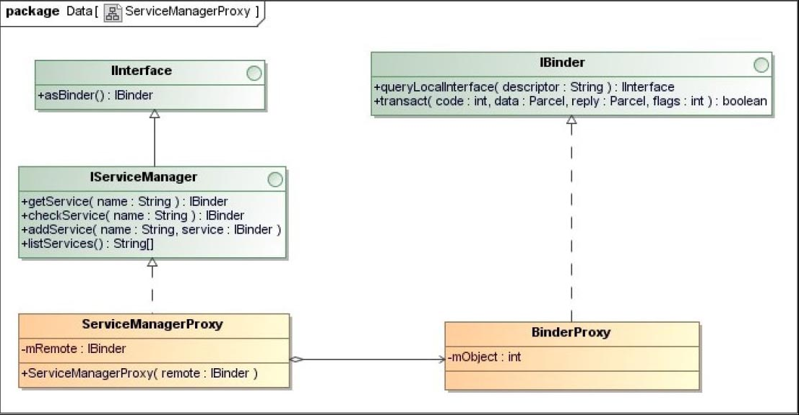

## 5.10　Binder进程间通信机制的Java接口
在前面的小节中，我们分析的都是Binder进程间通信机制的C/C++实现，但是Android应用程序是使用Java语言开发的，那么它们是如何使用Binder进程间通信机制的呢？

我们知道，Java代码可以通过JNI方法来调用C/C++代码，因此，Android系统在应用程序框架层中提供了Binder进程间通信机制的Java接口，它们通过JNI方法来调用Binde库的C/C++接口，从而提供了执行Binder进程间通信的能力。

在第2章学习Android系统的硬件抽象层时，我们先开发了一个硬件访问服务FregService，它运行在系统进程System中，并且在启动时通过Java层的Service Manager代理对象将自己注册到Service Manager中。接着又开发了一个应用程序Freg，它通过Java层的Service Manager代理对象来获得硬件访问服务FregService的一个代理对象，最后就可以通过这个代理对象来使用硬件访问服务FregService提供的服务了。

在本节中，我们将结合第2章所介绍的硬件访问服务FregService，以及使用了这个服务的应用程序Freg来分析Binder进程间通信机制的Java接口。

接下来，我们就结合硬件访问服务FregService和应用程序Freg这两个实例，通过下面五个使用情景来分析Binder进程间通信机制的Java接口。

1. Service Manager的Java代理对象的获取过程。
1. Java服务接口的定义和解析。
1. Java服务的启动过程。
1. Java服务代理对象的获取过程。
1. Java服务的调用过程。

为了描述方便，在Java层中，我们将Service组件称为Java服务；相应的，将Service组件的代理对象称为Java服务代理对象。学习了Binder进程间通信机制的Java接口之后，我们就可以熟练地在Android应用程序中使用Binder进程间通信机制了。

### 5.10.1　Service Manager的Java代理对象的获取过程
在Java层中，Service Manager的Java代理对象的类型为ServiceManagerProxy，它实现了IServiceManager接口，如图5-25所示。



IServiceManager接口继承了IInterface接口，并且定义了四个成员函数：getService、checkService、addService和listService，其中，getService和checkService用来获取Java服务的代理对象，addService用来注册Java服务，listService用来获取注册在Service Manager中的Java服务名称列表。

Service Manager的Java代理对象的内部有一个成员变量mRemote，它的类型为IBinder，实际上指向的是一个BinderProxy对象。BinderProxy类用来描述一个Java服务代理对象，它实现了IBinder接口。BinderProxy类内部有一个类型为int的成员变量mObject，它指向C++层中的一个Binder代理对象。这样，我们就可以将一个Java服务代理对象和C++层中的一个Binder代理对象关联起来，即可以通过C++层中的Binder代理对象来实现Java服务代理对象的功能。

从Service Manager的Java代理对象的类关系图就可以知道，在创建一个Service Manager的Java代理对象之前，首先要在C++层中创建一个句柄值为0的Binder代理对象，然后再在Java层创建一个对应的Java服务代理对象。有了这个Java服务代理对象之后，我们就可以创建一个Service Manager的Java代理对象了。

在Java层中，Service Manager的Java代理对象是由ServiceManager类来负责创建的，它的实现如图5-26所示。


ServiceManager类内部有一个类型为ServiceManagerProxy的静态成员变量sServiceManager，ServiceManager类的静态成员函数getService、checkService、addService和listServices就是通过它来实现的。ServiceManager类的另外一个静态成员函数getIServiceManager是用来创建一个Service Manager的Java代理对象的，并且保存在静态成员变量sServiceManager中。ServiceManager类的静态成员函数getIServiceManager在创建一个Service Manager的Java代理对象的过程中，会通过ServiceManagerNative类的静态成员函数asInterface将一个句柄值等于0的Java服务代理对象封装成一个ServiceManagerProxy对象。

Java层的ServiceManagerNative类类似于C++层中的BnServiceManager类，它继承了Java层中的Binder类，是用来实现Java层中的Service Manager服务的。同样，Java层中的Binder类类似于C++层中的BBinder类，是用来实现一个Java服务的。Java层中的Binder类内部有一个类型为int的成员变量mObject，它指向C++层中的一个Binde本地对象。这样，我们就可以将一个Java服务和C++层中的一个Binder本地对象关联起来，即可以通过C++层中的Binder本地对象来实现Java服务的功能。

接下来，我们就分析ServiceManager类的静态成员函数getIServiceManager是如何创建Service Manager的Java代理对象的，它的实现如下所示。

`frameworks/base/core/java/android/os/ServiceManager.java`
```java
01 public final class ServiceManager {
02     private static final String TAG = "ServiceManager";
03     private static IServiceManager sServiceManager;
04     private static HashMap<String, IBinder> sCache = new HashMap<String, IBinder>();
05 
06     private static IServiceManager getIServiceManager() {
07         if (sServiceManager != null) {
08             return sServiceManager;
09         }
10 
11         // Find the service manager
12         sServiceManager = ServiceManagerNative.asInterface(BinderInternal.getContextObject());
13         return sServiceManager;
14     }
15     ......
16 }
```
第7行首先判断ServiceManager类的静态成员变量sServiceManager的值是否不等于null。如果是，那么第8行就直接将它指向的一个ServiceManagerProxy对象返回给调用者；否则，第12行首先通过BinderInternal类的静态成员函数getContextObject创建一个句柄值等于0的Java服务代理对象，接着再通过ServiceManagerNative类的静态成员函数asInterface将这个Java服务代理对象封装成一个ServiceManagerProxy对象，最后保存在静态成员变量sServiceManager中，并且将它返回给调用者。

下面我们分别分析BinderInternal类的静态成员函数getContextObject和ServiceManagerNative类的静态成员函数asInterface的实现。

BinderInternal类的静态成员函数getContextObject是一个JNI方法，它的定义如下所示。

`frameworks/base/core/java/com/android/internal/os/BinderInternal.java`
```java
01 public class BinderInternal {
02     ......
03     
04     /**
05      * Return the global "context object" of the system.  This is usually
06      * an implementation of IServiceManager, which you can use to find
07      * other services.
08      */
09     public static final native IBinder getContextObject();
10     
11     ......
12 }
```
它是由C++层中的函数android_os_BinderInternal_getContextObject来实现的，如下所示。

`frameworks/base/core/jni/android_util_Binder.cpp`
```cpp
1 static jobject android_os_BinderInternal_getContextObject(JNIEnv* env, jobject clazz)
2 {
3     sp<IBinder> b = ProcessState::self()->getContextObject(NULL);
4     return javaObjectForIBinder(env, b);
5 }
```
第3行调用进程中的ProcessState对象的成员函数getContextObject来获得一个句柄值等于NULL，即等于0的Binder代理对象，即一个BpBinder对象，接着第4行调用函数javaObjectForIBinder为这个Binder代理对象创建一个Java服务代理对象，即一个BinderProxy对象，最后将它返回给调用者。

在前面的5.7小节中，我们已经分析过ProcessState类的成员函数getContextObject的实现了。接下来，我们就着重分析函数javaObjectForIBinder的实现，看它是如何创建一个Java服务代理对象的。

在分析函数javaObjectForIBinder的实现之前，我们先介绍三个全局变量：gBinderOffsets、gBinderProxyOffsets和gWeakReferenceOffsets的定义。

全局变量gBinderOffsets是一个bindernative_offsets_t结构体，它的定义如下所示。

`frameworks/base/core/jni/android_util_Binder.cpp`
```cpp
static struct bindernative_offsets_t
{
    // Class state.
    jclass mClass;
    jmethodID mExecTransact;

    // Object state.
    jfieldID mObject;

} gBinderOffsets;
```
它有三个成员变量：mClass、mExecTransact和mObject，其中，mClass指向Java层中的Binder类，而mExecTransact和mObject分别指向这个Binder类的成员函数execTransact和成员变量mObject。

全局变量gBinderOffsets是在函数int_register_android_os_Binder中初始化的，如下所示。

`frameworks/base/core/jni/android_util_Binder.cpp`
```cpp
01 const char* const kBinderPathName = "android/os/Binder";
02 
03 static int int_register_android_os_Binder(JNIEnv* env)
04 {
05     jclass clazz;
06 
07     clazz = env->FindClass(kBinderPathName);
08     LOG_FATAL_IF(clazz == NULL, "Unable to find class android.os.Binder");
09 
10     gBinderOffsets.mClass = (jclass) env->NewGlobalRef(clazz);
11     gBinderOffsets.mExecTransact
12         = env->GetMethodID(clazz, "execTransact", "(IIII)Z");
13     assert(gBinderOffsets.mExecTransact);
14 
15     gBinderOffsets.mObject
16         = env->GetFieldID(clazz, "mObject", "I");
17     assert(gBinderOffsets.mObject);
18 
19     return AndroidRuntime::registerNativeMethods(
20         env, kBinderPathName,
21         gBinderMethods, NELEM(gBinderMethods));
22 }
```
全局变量gBinderProxyOffsets是一个binderproxy_offsets_t结构体，它的定义如下所示。

`frameworks/base/core/jni/android_util_Binder.cpp`
```cpp
static struct binderproxy_offsets_t
{
    // Class state.
    jclass mClass;
    jmethodID mConstructor;
    jmethodID mSendDeathNotice;

    // Object state.
    jfieldID mObject;
    jfieldID mSelf;

} gBinderProxyOffsets;
```
它有五个成员变量：mClass、mConstructor、mSendDeathNotice、mObject和mSelf，其中，mClass指向Java层中的BinderProxy类，而mConstructor、mSendDeathNotice、mObject和mSelf分别指向这个BinderProxy类的构造函数、静态成员函数sendDeathNotice、成员变量mObject和mSelf。

全局变量gBinderProxyOffsets是在函数int_register_android_os_BinderProxy中初始化的，如下所示。

`frameworks/base/core/jni/android_util_Binder.cpp`
```cpp
01 const char* const kBinderProxyPathName = "android/os/BinderProxy";
02 
03 static int int_register_android_os_BinderProxy(JNIEnv* env)
04 {
05     jclass clazz;
06     ......
07     
08     clazz = env->FindClass("java/lang/ref/WeakReference");
09     ......
10 
11     gBinderProxyOffsets.mClass = (jclass) env->NewGlobalRef(clazz);
12     gBinderProxyOffsets.mConstructor
13         = env->GetMethodID(clazz, "<init>", "()V");
14 
15     gBinderProxyOffsets.mSendDeathNotice
16         = env->GetStaticMethodID(clazz, "sendDeathNotice", "(Landroid/os/IBinder$DeathRecipient;)V");
17 
18 
19     gBinderProxyOffsets.mObject
20         = env->GetFieldID(clazz, "mObject", "I");
21 
22     gBinderProxyOffsets.mSelf
23         = env->GetFieldID(clazz, "mSelf", "Ljava/lang/ref/WeakReference;");
24 
25     return AndroidRuntime::registerNativeMethods(
26         env, kBinderProxyPathName,
27         gBinderProxyMethods, NELEM(gBinderProxyMethods));
28 }
```
全局变量gWeakReferenceOffsets是一个weakreference_offsets_t结构体，它的定义如下所示。

`frameworks/base/core/jni/android_util_Binder.cpp`
```cpp
static struct weakreference_offsets_t
{
    // Class state.
    jclass mClass;
    jmethodID mGet;

} gWeakReferenceOffsets;
```
它有两个成员变量：mClass和mGet，其中，mClass指向Java层中的WeakReference类，而mGet指向这个WeakReference类的成员函数get。

全局变量gWeakReferenceOffsets同样是在函数int_register_android_os_BinderProxy中初始化的，如下所示：

`frameworks/base/core/jni/android_util_Binder.cpp`
```cpp
01 static int int_register_android_os_BinderProxy(JNIEnv* env)
02 {
03     jclass clazz;
04 
05     clazz = env->FindClass("java/lang/ref/WeakReference");
06     .....
07     gWeakReferenceOffsets.mClass = (jclass) env->NewGlobalRef(clazz);
08     gWeakReferenceOffsets.mGet
09         = env->GetMethodID(clazz, "get", "()Ljava/lang/Object;");
10     .....
11 }
```
了解了全局变量gBinderOffsets、gBinderProxyOffsets和gWeakReferenceOffsets的定义之后，现在我们就可以分析函数javaObjectForIBinder的实现了，它的定义如下所示。

`frameworks/base/core/jni/android_util_Binder.cpp`
```cpp
01 jobject javaObjectForIBinder(JNIEnv* env, const sp<IBinder>& val)
02 {
03     if (val == NULL) return NULL;
04 
05     if (val->checkSubclass(&gBinderOffsets)) {
06         // One of our own!
07         jobject object = static_cast<JavaBBinder*>(val.get())->object();
08         ......
09         return object;
10     }
11 
12     // For the rest of the function we will hold this lock, to serialize
13     // looking/creation of Java proxies for native Binder proxies.
14     AutoMutex _l(mProxyLock);
15 
16     // Someone else's...  do we know about it?
17     jobject object = (jobject)val->findObject(&gBinderProxyOffsets);
18     if (object != NULL) {
19         jobject res = env->CallObjectMethod(object, gWeakReferenceOffsets.mGet);
20         if (res != NULL) {
21             ......
22             return res;
23         }
24         ......
25         val->detachObject(&gBinderProxyOffsets);
26         ......
27     }
28 
29     object = env->NewObject(gBinderProxyOffsets.mClass, gBinderProxyOffsets.mConstructor);
30     if (object != NULL) {
31         ......
32         // The proxy holds a reference to the native object.
33         env->SetIntField(object, gBinderProxyOffsets.mObject, (int)val.get());
34         val->incStrong(object);
35 
36         // The native object needs to hold a weak reference back to the
37         // proxy, so we can retrieve the same proxy if it is still active.
38         jobject refObject = env->NewGlobalRef(
39                 env->GetObjectField(object, gBinderProxyOffsets.mSelf));
40         val->attachObject(&gBinderProxyOffsets, refObject,
41                 jnienv_to_javavm(env), proxy_cleanup);
42 
43         ......
44     }
45 
46     return object;
47 }
```
参数val要么指向一个Binder代理对象，要么指向一个Binder本地对象。当它指向的是一个Binder本地对象时，它的类型为JavaBBinder，后者继承了BBinder。

第5行调用参数val的成员函数checkSubclass来检查它指向的是一个Binder代理对象，还是一个JavaBBinder对象。

Binder代理对象的成员函数checkSubclass是由其父类IBinder来实现的，如下所示。

`frameworks/base/libs/binder/Binder.cpp`
```cpp
bool IBinder::checkSubclass(const void* /*subclassID*/) const
{
    return false;
}
```
它的返回值恒为false。

JavaBBinder对象重写了其父类BBinder的父类IBinder的成员函数checkSubclass，如下所示。

`frameworks/base/core/jni/android_util_Binder.cpp`
```cpp
01 class JavaBBinder : public BBinder
02 {
03 public:
04     ......
05 
06     bool    checkSubclass(const void* subclassID) const
07     {
08         return subclassID == &gBinderOffsets;
09     }
10     
11     ......
12 }
```
它检查参数subclassID是否指向全局变量gBinderOffsets。如果是，它的返回值就等于true；否则，它的返回值就等于false。

回到函数javaObjectForIBinder中，如果参数val指向的是一个JavaBBinder对象，那么调用它的成员函数checkSubclass得到的返回值就等于true。因此，这时候第7行就调用该JavaBBinder对象的成员函数object来获得一个Java对象，并且第9行将它返回给调用者。

JavaBBinder类的成员函数object的实现如下所示。

`frameworks/base/core/jni/android_util_Binder.cpp`
```cpp
01 class JavaBBinder : public BBinder
02 {
03 public:
04     .....
05 
06     jobject object() const
07     {
08         return mObject;
09     }
10     
11 private:
12     JavaVM* const   mVM;
13     jobject const   mObject;
14 };
```
在后面的5.10.3小节中，我们就会知道，JavaBBinder类的成员变量mObject指向的是Java层中的一个Binder对象，因此，JavaBBinder类的成员函数object返回给调用者的实际上是Java层中的一个Binder对象。

回到函数javaObjectForIBinder中，从前面的调用过程可以知道，这时候参数val指向的是一个句柄值等于0的Binder代理对象，因此，接下来就会执行第14行到第46行代码创建一个Java层的Java服务代理对象，即一个BinderProxy对象。

第17行调用Binder代理对象val的成员函数findObject来检查当前进程之前是否已经为它创建过一个BinderProxy对象了。如果是，第17行返回来的就是一个指向该BinderProxy对象的WeakReference对象object，即一个弱引用对象。由于弱引用对象object所指向的BinderProxy对象可能已经失效，因此，第19行就需要继续检查它的有效性，方法是调用它的成员函数get来获得一个强引用对象。如果能够成功地将弱引用对象object升级为一个强引用对象，即第20行的if语句为true，那么第22行就将该BinderProxy对象返回给调用者；否则，第25行就调用Binder代理对象val的成员函数detachObject来解除它与一个无效的BinderProxy对象的对应关系。

Binder代理对象内部有一个成员变量mObjects，它的类型为ObjectManager，用来管理与该Binder代理对象关联的外部对象。例如，函数javaObjectForIBinder在为一个Binder代理对象创建一个Java服务代理对象时，就会将创建出来的Java服务代理对象保存在该Binder代理对象的成员变量mObjects中，以便以后需要获取与该Binder代理对象对应的Java服务代理对象时，就可以通过它的成员变量mObjects来直接获得。由于一个Binder代理对象所关联的外部对象可能不止一个，因此，我们需要通过额外的一个参数来关联一个Binder代理对象和一个Java服务代理对象，这个参数就是全局变量gBinderProxyOffsets的地址值。

在继续分析函数javaObjectForIBinder的实现之前，我们首先介绍一个Binder代理对象是如何与一Java服务代理对象关联起来的。

ObjectManager类的定义如下所示。

`frameworks/base/include/binder/BpBinder.h`
```cpp
01 class BpBinder : public IBinder
02 {
03 public:
04     ......
05 
06     class ObjectManager
07     {
08     public:
09                     ObjectManager();
10                     ~ObjectManager();
11 
12         void        attach( const void* objectID,
13                             void* object,
14                             void* cleanupCookie,
15                             IBinder::object_cleanup_func func);
16         void*       find(const void* objectID) const;
17         void        detach(const void* objectID);
18 
19         void        kill();
20 
21     private:
22                     ObjectManager(const ObjectManager&);
23         ObjectManager& operator=(const ObjectManager&);
24 
25         struct entry_t
26         {
27             void* object;
28             void* cleanupCookie;
29             IBinder::object_cleanup_func func;
30         };
31 
32         KeyedVector<const void*, entry_t> mObjects;
33     };
34     ......
35 
36 private:
37     ......
38             ObjectManager       mObjects;
39     ......
40 };
```
ObjectManager是定义在BpBinder内部的一个类，它有一个类型为KeyedVector的成员变量mObjects。这个成员变量以一个void指针作为关键字来维护与一个Binder代理对象所关联的外部对象，这些外部对象都使用一个entry_t结构体来描述。

结构体entry_t有三个成员变量：object、func和cleanupCookie，其中，object指向一个外部对象的一个弱引用对象；func是一个类型为IBinder::object_cleanup_func的函数指针，它是用来清理成员变量object所指向的外部对象的；cleanupCookie是函数指针func所指向的清理函数的一个调用参数。

当一个Binder代理对象被析构时，我们就需要清理与它所关联的外部对象，这是通过调用它的成员变量mObjects的成员函数kill来实现的，如下所示。

`frameworks/base/libs/binder/BpBinder.cpp`
```cpp
01 void BpBinder::ObjectManager::kill()
02 {
03     const size_t N = mObjects.size();
04     LOGV("Killing %d objects in manager %p", N, this);
05     for (size_t i=0; i<N; i++) {
06         const entry_t& e = mObjects.valueAt(i);
07         if (e.func != NULL) {
08             e.func(mObjects.keyAt(i), e.object, e.cleanupCookie);
09         }
10     }
11 
12     mObjects.clear();
13 }
```
第5行到第10行的for循环遍历ObjectManager类的成员变量mObjects所描述的一个外部对象列表。由于列表中的每一个entry_t结构体都描述了一个外部对象，因此，第8行就调用它的成员变量func所指向的一个函数来清理它们。

此外，ObjectManager类还提供了另外的三个成员函数：attach、find和detach，分别用来增加、查找和删除外部对象，它们的实现如下所示。

`frameworks/base/libs/binder/BpBinder.cpp`
```cpp
01 void BpBinder::ObjectManager::attach(
02     const void* objectID, void* object, void* cleanupCookie,
03     IBinder::object_cleanup_func func)
04 {
05     entry_t e;
06     e.object = object;
07     e.cleanupCookie = cleanupCookie;
08     e.func = func;
09 
10     if (mObjects.indexOfKey(objectID) >= 0) {
11         ......
12         return;
13     }
14 
15     mObjects.add(objectID, e);
16 }
17 
18 void* BpBinder::ObjectManager::find(const void* objectID) const
19 {
20     const ssize_t i = mObjects.indexOfKey(objectID);
21     if (i < 0) return NULL;
22     return mObjects.valueAt(i).object;
23 }
24 
25 void BpBinder::ObjectManager::detach(const void* objectID)
26 {
27     mObjects.removeItem(objectID);
28 }
```
成员函数attach的参数object、cleanupCookie和func用来描述一个外部对象，即用来创建一个entry_t结构体；而参数objectID是用来标志前面三个参数所描述的一个外部对象的，因此，第15行就以它为关键字将前面创建的一个entry_t结构体保存在ObjectManager类的成员变量mObjects所描述的一个外部对象列表中。

成员函数find以参数objectID为关键字，在ObjectManager类的成员变量mObjects所描述的一个外部对象列表中找到一个对应的entry_t结构体，并且将这个entry_t结构体的成员变量object所指向的一个外部对象返回给调用者。

成员函数detach以参数objectID为关键字，在ObjectManager类的成员变量mObjects所描述的一个外部对象列表中删除一个对应的entry_t结构体，即解除一个外部对象与一个Binder代理对象的关联关系。

相应地，Binder代理对象也提供了三个成员函数：attachObject、findObject和detachObject，用来增加、查找和删除与它关联的外部对象，它们的实现如下所示。

`frameworks/base/libs/binder/BpBinder.cpp`
```cpp
01 void BpBinder::attachObject(
02     const void* objectID, void* object, void* cleanupCookie,
03     object_cleanup_func func)
04 {
05     AutoMutex _l(mLock);
06     LOGV("Attaching object %p to binder %p (manager=%p)", object, this, &mObjects);
07     mObjects.attach(objectID, object, cleanupCookie, func);
08 }
09 
10 void* BpBinder::findObject(const void* objectID) const
11 {
12     AutoMutex _l(mLock);
13     return mObjects.find(objectID);
14 }
15 
16 void BpBinder::detachObject(const void* objectID)
17 {
18     AutoMutex _l(mLock);
19     mObjects.detach(objectID);
20 }
```
它们分别是通过调用内部的成员变量mObjects的成员函数attach、find和detach来实现的，即调用前面所介绍的ObjectManager类的成员函数attach、find和detach来实现。

回到函数javaObjectForIBinder中，如果我们还没有为Binder代理对象val创建过Java服务代理对象，那么接下来第29行就会为它创建一个Java服务代理对象object。如果创建成功，即第30行的if语句为true，那么第33行就会将Binder代理对象val的地址值设置到前面所创建的Java服务代理对象object的成员变量mObject中。接着第34行增加Binder代理对象val的强引用计数，因为它被Java服务代理对象object引用了。

Java服务代理对象内部有一个成员变量mSelf，它指向了一个引用了该Java服务代理对象的弱引用对象，即一个WeakReference对象。第38行和第39行首先获得Java服务代理对象object内部的成员变量mSelf所指向的一个弱引用对象，接着再创建一个全局引用对象来引用它。接下来第40行和第41行就通过全局变量gBinderProxyOffsets将这个全局引用对象与Binder代理对象val关联起来，相当于将前面所创建的Java服务代理对象object与Binder代理对象val关联起来。这样，当我们以后再以Binder代理对象val为参数来调用函数javaObjectForIBinder时，就可以直接获得保存在它内部的成员变量mObjects中的Java服务代理对象了。

最后，第46行就可以将前面所创建的Java服务代理对象object返回给调用者了。

函数javaObjectForIBinder执行完成之后，先返回到BinderInternal类的静态成员函数getContextObject中，接着再返回到ServiceManager类的静态成员函数getIServiceManager中，这时候我们就获得一个句柄值等于0的Java服务代理对象，接下来就可以调用ServiceManagerNative类的静态成员函数asInterface将它封装成一个Service Manager的Java代理对象了。

ServiceManagerNative类的静态成员函数asInterface的实现如下所示。

`frameworks/base/core/java/android/os/ServiceManagerNative.java`
```java
01 public abstract class ServiceManagerNative extends Binder implements IServiceManager
02 {
03     ......
04 
05     static public IServiceManager asInterface(IBinder obj)
06     {
07         if (obj == null) {
08             return null;
09         }
10         IServiceManager in =
11             (IServiceManager)obj.queryLocalInterface(descriptor);
12         if (in != null) {
13             return in;
14         }
15         
16         return new ServiceManagerProxy(obj);
17     }
18     ......
19 }
```
参数obj指向一个Java服务代理对象，即一个BinderProxy对象，它的成员函数queryLocalInterface的返回值为null，因此，第16行就会先创建一个ServiceManagerProxy对象，即一个Service Manager的Java代理对象，接着将它返回给调用者。

回到ServiceManager类的静态成员函数getIServiceManager中，接着它就可以将获得的Service Manager的Java代理对象保存在其静态成员变量sServiceManager中，最后将它的IServiceManager接口返回给调用者。

### 5.10.2　Java服务接口的定义和解析
在实现自己的Java服务之前，首先要定义这个Java服务要实现的接口，即定义自己的Java服务接口。在Android应用程序中，我们可以通过Android接口描述语言（Android Interface Definition Language, AIDL）来定义Java服务接口。AIDL是一种Binder进程间通信接口的描述语言，通过它来定义的Java服务接口具有执行Binder进程间通信的能力。

以AIDL定义的Java服务接口保存在一个以“.aidl”为后缀名的文件中，在编译时，它们会被转化为使用Java语言来描述的Java服务接口。学习这些使用Java语言描述的Java服务接口有助于我们进一步理解Binder进程间通信机制的Java接口，因此，接下来我们就以2.4.1小节中介绍的硬件访问服务接口IFregService为例，详细分析这些使用AIDL定义的Java服务接口是如何被编译为使用Java语言来描述的Java服务接口的。

硬件访问服务接口IFregService定义在文件IFregService.aidl中，文件内容如下所示。

```dotnetcli

```
硬件访问服务接口IFregService有两个成员函数：setVal和getVal，分别用来写和读虚拟硬件设备freg的寄存器val。

在编译文件IFregService.aidl时，编译系统会生成一个中间文件IFregService.java，它的内容如下所示。

```java

```
文件定义了一个Java接口IFregService、一个Java抽象类IFregService.Stub和一个Java类IFregService.Stub.Proxy，其中，Java抽象类IFregService.Stub是在Java接口IFregService内部定义的，而Java类IFregService.Stub.Proxy是在Java抽象类IFregService.Stub内部定义的。

IFregService.Stub和IFregService.Stub.Proxy类都实现了IFregService接口，其中，IFregService.Stub类用来描述一个Java服务，而IFregService.Stub.Proxy类用来描述一个Java服务代理对象。我们要实现的硬件访问服务FregService就是以IFregService.Stub为父类的，并且实现了它的IFregService接口的两个成员函数setVal和getVal。

IFregService.Stub类的静态成员函数asInterface通常用来将一个Java服务代理对象，即一个BinderProxy对象封装成一个IFregService.Stub.Proxy对象，即一个实现了IFregService接口的Java服务代理对象。

IFregService.Stub类的成员函数onTransact是用来接收和分发进程间通信请求的。当Client进程向一个实现了IFregService接口的Java服务发送一个类型为TRANSACTION_setVal或者TRANSACTION_getVal的进程间通信请求时，IFregService.Stub类的成员函数onTransact就会被调用，它分别将这两种类型的进程间通信请求分发给由其子类所重写的两个成员函数setVal和getVal来处理。
IFregService.Stub.Proxy类内部有一个成员变量mRemote，它指向的是一个Java服务代理对象，即一个BinderProxy对象，用来向一个实现了IFregService接口的Java服务发送进程间通信请求。

IFregService.Stub.Proxy类实现了IFregService接口的两个成员函数：setVal和getVal，它们分别向一个实现了IFregService接口的Java服务发送一个类型为TRANSACTION_setVal和TRANSACTION_getVal的进程间通信请求。

得到了使用Java语言描述的Java服务接口之后，接下来我们继续分析Java服务的启动过程、Java服务代理对象的获取过程，以及Java服务的调用过程。

### 5.10.3　Java服务的启动过程
Java服务一般是运行在Android系统进程System或者Android应用程序进程中的，它们在启动之前，同样需要将自己注册到Service Manager中，以便Client进程可以通过Service Manager来获得它们的Java服务代理对象。

由于Android系统进程System和Android应用程序进程在启动时会在内部启动一个Binder线程池【8】，因此，运行在它们里面的Java服务在启动时，只需要将自己注册到Service Manager中就可以了。接下来，我们就以2.4小节介绍的硬件访问服务FregService为例，详细分析一个Java服务的启动过程。

硬件访问服务FregService是从IFregService.Stub类继承下来的，它是一个实现了IFregService接口的Java服务，它的定义如下所示。

```java

```
硬件访问服务FregService是在Android系统进程System中启动的，如下所示。

```java

```
Android系统进程System在启动时，会创建一个ServerThread线程来启动系统中的关键服务，硬件访问服务FregService就是在这个ServerThread线程中启动的。第10行首先创建一个硬件访问服务FregService，接着再调用ServiceManager类的静态成员函数addService将它注册到Service Manager中。
接下来，我们首先分析硬件访问服务FregService的创建过程，然后再分析它的注册过程。

由于硬件访问服务FregService继承了IFregService.Stub类，而后者又继承了Binder类，因此，硬件访问服务FregService在创建的过程中，会调用Binder类的构造函数来执行初始化操作。

Binder类的构造函数的实现如下所示。

```java
01 public class Binder implements IBinder {
02     ......
03 
04     private int mObject;
05 
06     ......
07     
08     public Binder() {
09         init();
10     ......
11     }
12     
13     private native final void init();
14     ......
15 }
```
它主要是调用了成员函数init来执行初始化工作。Binder类的成员函数init是一个JNI方法，它的实现如下所示。

`frameworks/base/core/jni/android_util_Binder.cpp`
```cpp
1 static void android_os_Binder_init(JNIEnv* env, jobject clazz)
2 {
3     JavaBBinderHolder* jbh = new JavaBBinderHolder(env, clazz);
4     ......
5     
6     jbh->incStrong(clazz);
7     env->SetIntField(clazz, gBinderOffsets.mObject, (int)jbh);
8 }
```
参数clazz指向的是前面在Java层中创建的硬件访问服务FregService，第3行以它为参数在C++层中创建了一个JavaBBinderHolder对象jbh，接着第6行代码增加了JavaBBinderHolder对象jbh的强引用计数，因为它被Java层中的硬件访问服务FregService引用了。最后，第7行代码将JavaBBinderHolder对象jbh的地址值保存在硬件访问服务FregService的父类Binder的成员变量mObject中。这样，运行在Java层中的硬件访问服务FregService就可以通过它的成员变量mObject来访问运行在C++层中的JavaBBinderHolder对象jbh了。

JavaBBinderHolder对象jbh的创建过程如下所示。

`frameworks/base/core/jni/android_util_Binder.cpp`
```cpp
01 class JavaBBinderHolder : public RefBase
02 {
03 public:
04     JavaBBinderHolder(JNIEnv* env, jobject object)
05         : mObject(object)
06     {
07         LOGV("Creating JavaBBinderHolder for Object %p\n", object);
08     }
09     ......
10 
11 private:
12     Mutex           mLock;
13     jobject         mObject;
14     wp<JavaBBinder> mBinder;
15 };
```
它将参数object保存在自己的成员变量mObject中。从前面的调用过程可以知道，参数object指向的是一个在Java层中创建的硬件访问服务FregService。这样，运行在C++层中的JavaBBinderHolder对象jbh就可以通过它的成员变量mObject来访问运行在Java层中的硬件访问服务FregService了。

JavaBBinderHolder类还有一个成员变量mBinder，它指向的是一个JavaBBinder对象。JavaBBinder类继承了Binder库中的BBinder类，因此，它可以用来描述一个Binder本地对象。

至此，硬件访问服务FregService的创建过程就结束了。从它的创建过程可以知道，它在C++层中有一个对应的JavaBBinderHolder对象，而这个JavaBBinderHolder对象通过其成员变量mBinder持有一个类型为JavaBBinder的Binder本地对象。接下来我们就会看到，硬件访问服务FregService的进程间通信功能就是通过与其对应的JavaBBinderHolder对象所持有的一个类型为JavaBBinder的Binder本地对象来实现的。

硬件访问服务FregService创建完成之后，返回到ServerThread类的成员函数run中，接下来就调用ServiceManager类的静态成员函数addService将它注册到Service Manager中。

ServiceManager类的静态成员函数addService的实现如下所示。

`frameworks/base/core/java/android/os/ServiceManager.java`
```java
    public static void addService(String name, IBinder service) {
        try {
            getIServiceManager().addService(name, service);
        } catch (RemoteException e) {
            Log.e(TAG, "error in addService", e);
        }
    }
```
第6行首先调用ServiceManager类的静态成员函数getIServiceManager来获得一个Service Manager的Java代理对象，接着再调用这个Java代理对象的成员函数addService将Java服务service注册到ServiceManager中，并且指定这个Java服务service的注册名称将Java服务service注册到ServiceManager中，并且指定这个Java服务service的注册名称为name。

ServiceManager的Java代理对象的成员函数addService的实现如下所示。

`frameworks/base/core/java/android/os/ServiceManagerNative.java`
```java
    public void addService(String name, IBinder service)
            throws RemoteException {
        Parcel data = Parcel.obtain();
        Parcel reply = Parcel.obtain();
        data.writeInterfaceToken(IServiceManager.descriptor);
        data.writeString(name);
        data.writeStrongBinder(service);
        mRemote.transact(ADD_SERVICE_TRANSACTION, data, reply, 0);
        reply.recycle();
        data.recycle();
    }
    private IBinder mRemote;
```
类似于C++层中的Parcel类，Java层中的Parcel类也是用来封装进程间通信数据的。Java层中的每一个Parcel对象在C++层中都有一个对应的Parcel对象，后者的地址值就保存在前者的成员变量mObject中。当我们将进程间通信数据封装在一个Java层中的Parcel对象时，这个Java层中的Parcel对象就会通过其成员变量mObject找到与它对应的运行在C++层中的Parcel对象，并且将这些进程间通信数据封装到C++层中的Parcel对象里面去。

第6行和第7行创建了两个Parcel对象data和reply，其中，Parcel对象data是用来封装进程间通信数据的，而Parcel对象reply是用来封装进程间通信结果数据的。第8行首先调用Parcel对象data的成员函数writeInterfaceToken写入一个进程间通信头，接着第9行调用Parcel对象data的成员函数writeString写入一个即将要注册的Java服务的名称，最后第10行调用Parcel对象data的成员函数wrtieStrongBinder写入一个即将要注册的Java服务。下面我们就着重分析即将要注册的Java服务，即硬件访问服务FregService是如何写入到Parcel对象data中的。

Java层中的Parcel类的成员函数wrtieStrongBinder是一个JNI方法，它的定义如下所示。

`frameworks/base/core/java/android/os/Parcel.java`
```java
    public final native void writeStrongBinder(IBinder val);
```
它对应的实现函数为android_os_Parcel_writeStrongBinder，如下所示。

`frameworks/base/core/jni/android_util_Binder.cpp`
```cpp
1 static void android_os_Parcel_writeStrongBinder(JNIEnv* env, jobject clazz, jobject object)
2 {
3     Parcel* parcel = parcelForJavaObject(env, clazz);
4     if (parcel != NULL) {
5         const status_t err = parcel->writeStrongBinder(ibinderForJavaObject(env, object));
6         ......
7     }
8 }
```
参数clazz指向的是一个Java层中的Parcel对象，第3行调用函数parecelForJavaObject获得一个与它对应的、运行在C++层中的Parcel对象parcel。

参数object指向的是即将要注册的Java服务，第5行首先调用函数ibinderForJavaObject来获得一个与它对应的Binder本地对象，然后再将这个Binder本地对象写入到前面得到的Parcel对象parcel中。在前面的5.8.1.1小节中，我们已经分析过C++层中的Parcel类的成员函数writeStrongBinder的实现了，因此，接下来我们就重点分析函数ibinderForJavaObject是如何根据参数object来获得一个对应的Binder本地对象的。

函数ibinderForJavaObject的实现如下所示。

`frameworks/base/core/jni/android_util_Binder.cpp`
```cpp
01 sp<IBinder> ibinderForJavaObject(JNIEnv* env, jobject obj)
02 {
03     if (obj == NULL) return NULL;
04 
05     if (env->IsInstanceOf(obj, gBinderOffsets.mClass)) {
06         JavaBBinderHolder* jbh = (JavaBBinderHolder*)
07             env->GetIntField(obj, gBinderOffsets.mObject);
08         return jbh != NULL ? jbh->get(env) : NULL;
09     }
10 
11     if (env->IsInstanceOf(obj, gBinderProxyOffsets.mClass)) {
12         return (IBinder*)
13             env->GetIntField(obj, gBinderProxyOffsets.mObject);
14     }
15 
16     LOGW("ibinderForJavaObject: %p is not a Binder object", obj);
17     return NULL;
18 }
```
参数obj要么指向一个Java服务，要么指向一个Java服务代理对象；否则，第17行就给调用者返回一个NULL值，表示它不能将参数obj转换成一个Binder本地对象或者一个Binder代理对象。

如果参数obj指向的是一个Java服务代理对象，即第11行的if语句为true，那么第12行和第13行代码就找到与它对应的一个Binder代理对象，并且将这个Binder代理对象返回给调用者。在前面的5.10.1小节中提到，Java层中的每一个Java服务代理对象在C++层中都有一个对应的Binder代理对象，并且这个Binder代理对象的地址值就保存在它的成员变量mObject中。因此，第12行和第13行代码可以轻易地找到与参数obj对应的Binder代理对象。

从前面的调用过程可以知道，参数obj指向的是即将要注册的硬件访问服务FregService，它是一个Java服务，因此，第5行的if语句为true，函数接下来会执行第6行到第8行代码来获得一个Binder本地对象。

前面提到，一个Java服务的成员变量mObject中保存的是与其对应的一个JavaBBinderHolder对象，因此，第6行和第7行代码就可以安全地将参数obj的成员变量mObject转换为一个JavaBBinderHolder对象jbh。接着第8行调用JavaBBinderHolder对象jbh的成员函数get来获得一个Binder本地对象。

JavaBBinderHolder类的成员函数get的实现如下所示。

`frameworks/base/core/jni/android_util_Binder.cpp`
```cpp
    sp<JavaBBinder> get(JNIEnv* env)
    {
        AutoMutex _l(mLock);
        sp<JavaBBinder> b = mBinder.promote();
        if (b == NULL) {
            b = new JavaBBinder(env, mObject);
            mBinder = b;
            LOGV("Creating JavaBinder %p (refs %p) for Object %p, weakCount=%d\n",
                 b.get(), b->getWeakRefs(), mObject, b->getWeakRefs()->getWeakCount());
        }

        return b;
    }
```
前面提到，JavaBBinderHolder类的成员变量mBinder指向的是一个类型为JavaBBinder的Binder本地对象，而成员变量mObject指向的是一个Java服务。

JavaBBinderHolder类的成员函数get用来将成员变量mBinder所指向的一个JavaBBinder对象返回给调用者。由于成员变量mBinder是一个类型为JavaBBinder的弱指针，即此时它指向的JavaBBinder对象可能已经被销毁，因此，在将它返回给调用者之前，首先要将它升级为一个类型为JavaBBinder的强指针。如果升级成功，那么第15行就可以直接将成员变量mBinder所指向的一个JavaBBinder对象返回给调用者了；否则，第10行和第11行就需要先创建一个JavaBBinder对象保存在成员变量mBinder中，接着第15行再将这个JavaBBinder对象返回给调用者。

类型为JavaBBinder的Binder本地对象内部有一个成员变量mObject，它指向了一个Java服务，它是在JavaBBinder类的构造函数中被始化的，如下所示。

`frameworks/base/core/jni/android_util_Binder.cpp`
```cpp
01 class JavaBBinder : public BBinder
02 {
03 public:
04     JavaBBinder(JNIEnv* env, jobject object)
05         : mVM(jnienv_to_javavm(env)), mObject(env->NewGlobalRef(object))
06     {
07         ......
08     }
09     ......
10 
11 private:
12     JavaVM* const   mVM;
13     jobject const   mObject;
14 };
```
从前面的调用过程可以知道，一个JavaBBinder对象的成员变量mObject所指向的Java服务实际上就是持有该JavaBBinder对象的JavaBBinderHolder对象的成员变量mObject所指向的Java服务，因此，这时候我们就将一个Java服务分别与一个JavaBBinderHolder对象和一个JavaBBinder对象关联起来。

返回到Service Manager的Java代理对象的成员函数addService中，将要传递给Service Manager的进程间通信数据写入到Parcel对象data中之后，接着就调用它的成员变量mRemote的成员函数transact向Service Manager发送一个类型为ADD_SERVICE_TRANSACTION的进程间通信请求，即请求Service Manager将一个Java服务注册到它里面去。从前面5.10.1小节的内容可以知道，Service Manager的Java代理对象的成员变量mRemote指向的是一个句柄值等于0的Java服务代理对象，因此，接下来就会执行BinderProxy类的成员函数transact来向Service Manager发送一个进程间通信请求。

BinderProxy类的成员函数transact是一个JNI方法，它的定义如下所示。

frameworks/base/core/java/android/os/Binder.java
```java
    public native boolean transact(int code, Parcel data, Parcel reply,
            int flags) throws RemoteException;
```
它对应的实现函数为android_os_BinderProxy_transact，如下所示。

`frameworks/base/core/jni/android_util_Binder.cpp`
```cpp
01 static jboolean android_os_BinderProxy_transact(JNIEnv* env, jobject obj,
02                                                 jint code, jobject dataObj,
03                                                 jobject replyObj, jint flags)
04 {
05     ......
06     
07     Parcel* data = parcelForJavaObject(env, dataObj);
08     ......
09     Parcel* reply = parcelForJavaObject(env, replyObj);
10     ......
11 
12     IBinder* target = (IBinder*)
13         env->GetIntField(obj, gBinderProxyOffsets.mObject);
14     ......
15     
16     status_t err = target->transact(code, *data, reply, flags);
17     ......
18 
19     if (err == NO_ERROR) {
20         return JNI_TRUE;
21     } else if (err == UNKNOWN_TRANSACTION) {
22         return JNI_FALSE;
23     }
24 
25     signalExceptionForError(env, obj, err);
26     return JNI_FALSE;
27 }
```
第7行和第9行分别将Java层中的两个Parcel对象dataObj和replyObj转换为C++层中的Parcel对象data和reply，前者包含了要传递给Service Manager的进程间通信数据，而后者用来保存从Service Manager返回来的进程间通信结果数据。

参数obj指向的是一个Java服务代理对象，第12行和第13行将它的成员变量mObject转换为一个Binder代理对象target。从前面的调用过程可以知道，前面得到的Binder代理对象target是一个句柄值等于0的Binder代理对象。

第16行调用Binder代理对象target的成员函数transact向Server Manager发送一个类型为code的进程间通信请求，即一个类型为ADD_SERVICE_TRANSACTION的进程间通信请求。Service Manager接收到这个进程间通信请求之后，就会将保存在Parcel对象data中的一个Binder本地对象的信息取出来，并且注册到它内部去。将一个Binder本地对象注册到Service Manager中的过程可以参考前面5.8.1小节的内容，这里就不详述了。

至此，Java服务的启动过程就分析完成了。从这个过程可以看出，在注册一个Java服务时，我们并不是真的将这个Java服务注册到Service Manager中，而是将与它对应的一个类型为JavaBBinder的Binder本地对象注册到Service Manager中。这样，当这个类型为JavaBBinder的Binder本地对象接收到来自Client进程的进程间通信请求时，它就需要将这些进程间通信请求交给它所对应的Java服务来处理。

### 5.10.4　Java服务代理对象的获取过程
Java服务将自己注册到Service Manager中之后，Android应用程序就可以通过Service Manager来获得它的一个Java服务代理对象了。有了这个Java服务代理对象之后，Android应用程序就可以使用相应的Java服务了。在本节中，我们将以2.5小节中介绍的Android应用程序Freg为例，详细分析一个Java服务代理对象的获取过程。

Android应用程序Freg获取硬件访问服务FregService的一个Java代理对象的代码片段如下所示。

```java

```
第11行和第12行代码首先通过ServiceManager类的静态成员函数getService来获得一个名称为“freg”的Java服务代理对象，接着再调用IFregService.Stub类的静态成员函数asInterface将这个Java服务代理对象封装成一个实现了IFregService接口的Java服务代理对象。由于前面我们注册的硬件访问服务FregService的名称为“freg”，因此，第12行代码调用ServiceManager类的静态成员函数getService就可以获得硬件访问服务FregService的一个Java代理对象了。

接下来，我们就分别分析ServiceManager类的静态成员函数getService和IFregService.Stub类的静态成员函数asInterface的实现。

ServiceManager类的静态成员函数getService的实现如下所示。

`frameworks/base/core/java/android/os/ServiceManager.java`
```java
    public static IBinder getService(String name) {
        try {
            IBinder service = sCache.get(name);
            if (service != null) {
                return service;
            } else {
                return getIServiceManager().getService(name);
            }
        } catch (RemoteException e) {
            Log.e(TAG, "error in getService", e);
        }
        return null;
    }
```
ServiceManager类的静态成员变量sCache用来保存前面已经获得的Java服务代理对象，这些Java服务代理对象是以它们所引用的Java服务的名称作为关键字来保存的，因此，第6行首先在ServiceManager类的静态成员变量sCache中检查是否已经存在一个与参数name对应的Java服务代理对象。如果存在，即第7行的if语句为true，那么第8行就直接将前面获得的Java服务代理对象service返回给调用者；否则，第10行就首先调用ServiceManager类的静态成员函数getIServiceManager来获得一个Service Manager的Java代理对象，接着再调用这个Service Manager的Java代理对象的成员函数getService来获得与参数name对应的Java服务代理对象。

Service Manager的Java代理对象的成员函数getService的实现如下所示。

`frameworks/base/core/java/android/os/ServiceManagerNative.java`
```java
    public IBinder getService(String name) throws RemoteException {
        Parcel data = Parcel.obtain();
        Parcel reply = Parcel.obtain();
        data.writeInterfaceToken(IServiceManager.descriptor);
        data.writeString(name);
        mRemote.transact(GET_SERVICE_TRANSACTION, data, reply, 0);
        IBinder binder = reply.readStrongBinder();
        reply.recycle();
        data.recycle();
        return binder;
    }
```
与在前面5.10.3小节中分析的Service Manager的Java代理对象的成员函数addService的实现类似，Service Manager的Java代理对象的成员函数getService也是通过内部的一个句柄值为0的Java代理对象来与Service Manager通信的。两者的区别在于请求Service Manager执行的操作不同，其中，前者请求Service Manager执行一个ADD_SERVICE_TRANSACTION操作，而后者请求Service Manager执行一个GET_SERVICE_TRANSACTION操作。

Service Manager处理完成GET_SERVICE_TRANSACTION操作之后，就会将一个Binder代理对象保存在Parcel对象reply中。因此，第10行就调用Parcel对象reply的成员函数readStrongBinder将它读取出来，以及将它转换为一个Java服务代理对象。

Java层中的Parcel类的成员函数readStrongBinder是一个JNI方法，它的定义如下所示。

`frameworks/base/core/java/android/os/Parcel.java`
```java
    public final native IBinder readStrongBinder();
```
它对应的实现函数为android_os_Parcel_readStrongBinder，如下所示。

`frameworks/base/core/jni/android_util_Binder.cpp`
```cpp
1 static jobject android_os_Parcel_readStrongBinder(JNIEnv* env, jobject clazz)
2 {
3     Parcel* parcel = parcelForJavaObject(env, clazz);
4     if (parcel != NULL) {
5         return javaObjectForIBinder(env, parcel->readStrongBinder());
6     }
7     return NULL;
8 }
```
参数clazz指向的是一个Java层中的Parcel对象，因此，第3行调用函数parcelForJavaObject获得一个与它对应的、运行在C++层中的Parcel对象parcel。

由于Parcel对象parcel里面保存了一个Binder代理对象，因此，第5行首先调用它的成员函数readStrongBinder将这个Binder代理对象读取出来，接着再调用函数javaObjectForIBinder获得一个对应的Java服务代理对象，最后将这个Java服务代理对象返回给调用者。C++层中Parcel类的成员函数readStrongBinder以及函数javaObjectForIBinder的实现可以参考前面的5.9和5.10.1小节的内容，这里不再详述。

获得了一个Java服务代理对象之后，返回到Activity组件Freg的成员函数onCreate中，接着它就调用IFregService.Stub类的静态成员函数asInterface将这个Java服务代理对象封装成一个实现了IFregService接口的Java服务代理对象，即一个IFregService.Stub.Proxy对象。

IFregService.Stub类的静态成员函数asInterface的实现如下所示。

```java

```
从前面的调用过程可以知道，参数obj指向的是一个Java服务代理对象，即一个BinderProxy对象。由于BinderProxy类的成员函数queryLocalInterface的返回值为null，因此，第16行就会将参数obj所指向的一个Java服务代理对象封装成一个IFregService.Stub.Proxy对象，最后再将这个IFregService.Stub.Proxy对象返回给调用者。

至此，一个Java服务代理对象的获取过程就分析完成了。在接下来的5.10.5小节中，我们继续分析Java服务的调用过程。

### 5.10.5　Java服务的调用过程
Android应用程序获得了一个Java服务代理对象之后，就可以通过Binder进程间通信机制使用这个Java服务了。在本节中，我们将以2.5小节介绍的Android应用程序Freg为例，详细分析Java服务的调用过程。

Android应用程序Freg获取了硬件访问服务FregService的一个Java代理对象之后，就可以调用这个实现了IFregService接口的Java代理对象的成员函数getVal和setVal来读写虚拟硬件设备freg的寄存器val了，如下面的第12行和第20行代码所示。

```java

```
接下来，我们就详细分析第12行调用硬件访问服务FregService的Java代理对象fregService的成员函数getVal来读取虚拟硬件设备freg的寄存器val的过程。

从前面5.10.4小节的内容可以知道，硬件访问服务FregService的Java代理对象的类型为IFregService.Stub.Proxy，它的成员函数getVal的实现如下所示。

```java

```
硬件访问服务FregService的Java代理对象的成员函数getVal首先将进程间通信数据写入到一个Parcel对象_data中，接着再调用内部的一个Java代理对象mRemote的成员函数transact来向硬件访问服务FregService发送一个类型为Stub.TRANSACTION_getVal的进数transact来向硬件访问服务FregService发送一个类型为Stub.TRANSACTION_getVal的进程间通信请求。硬件访问服务FregService处理完成这个进程间通信请求之后，就将进程间通信结果数据返回来，保存在另外一个Parcel对象_reply中。

在前面的5.10.3小节中，由于我们是将一个与硬件访问服务FregService相关联的类型为JavaBBinder的Binder本地对象注册到Service Manager中，因此，Binder驱动程序就会将应用程序Freg发送过来的Stub.TRANSACTION_getVal进程间通信请求分发给这个类型为JavaBBinder的Binder本地对象的成员函数onTransact来处理。
JavaBBinder类的成员函数onTransact的实现如下所示。

`frameworks/base/core/jni/android_util_Binder.cpp`
```cpp
01 class JavaBBinder : public BBinder
02 {
03     ......
04 
05     virtual status_t onTransact(
06         uint32_t code, const Parcel& data, Parcel* reply, uint32_t flags = 0)
07     {
08         JNIEnv* env = javavm_to_jnienv(mVM);
09 
10         ......
11         
12         jboolean res = env->CallBooleanMethod(mObject, gBinderOffsets.mExecTransact,
13             code, (int32_t)&data, (int32_t)reply, flags);
14 
15         ......
16         
17         return res != JNI_FALSE ? NO_ERROR : UNKNOWN_TRANSACTION;
18     }
19 
20     ......
21     
22     JavaVM* const   mVM;
23     jobject const   mObject;
24 };
```
在前面的5.10.3小节中提到，JavaBBinder类的成员变量mObject指向的是一个Java服务。在这个情景中，这个Java服务便是硬件访问服务FregService，因此，第12行代码就将Binder驱动程序中发送过来的进程间通信请求分发给硬件访问服务FregService的成员函数execTransact来处理。硬件访问服务FregService继承了Binder类，并且继承了它的成员函数execTransact，因此，第12行代码实际上是调用了Binder类的成员函数execTransact。

Binder类的成员函数execTransact的实现如下所示。

`frameworks/base/core/java/android/os/Binder.java`
```java
    // Entry point from android_util_Binder.cpp's onTransact
    private boolean execTransact(int code, int dataObj, int replyObj,
            int flags) {
        Parcel data = Parcel.obtain(dataObj);
        Parcel reply = Parcel.obtain(replyObj);
        // theoretically, we should call transact, which will call onTransact,
        // but all that does is rewind it, and we just got these from an IPC,
        // so we'll just call it directly.
        boolean res;
        try {
            res = onTransact(code, data, reply, flags);
        } catch (RemoteException e) {
            reply.writeException(e);
            res = true;
        } catch (RuntimeException e) {
            reply.writeException(e);
            res = true;
        }
        reply.recycle();
        data.recycle();
        return res;
    }
```
参数dataObj和replyObj分别指向C++层中的两个Parcel对象，其中，参数dataObj指向的Parcel对象包含了进程间通信数据，而参数replyObj指向的Parcel对象用来保存进程间通信结果数据。第6行和第7行首先将C++层中的这两个Parcel对象转换成Java层中的两个Parcel对象data和reply，接着第13行代码调用了由子类重写的成员函数onTransact来处理当前接收到的进程间通信请求。硬件访问服务FregService继承了IFregService.Stub类，并且继承了它的成员函数onTransact，因此，第13行代码实际上是调用了IFregService.Stub类的成员函数onTransact。

IFregService.Stub类的成员函数onTransact的实现如下所示。

```java

```
第10行调用JNI方法getVal_native来读取虚拟硬件设备freg的寄存器val，最后将获得的值返回给调用者。JNI方法getVal_native的实现可以参考前面2.4小节的内容，这里不再详述。

至此，一个Java服务的调用过程就分析完成了，整个Binder进程间通信机制的Java接口也分析完成了。它们通过JNI方法来封装Binder库的C++接口，从而使得Android应用程序可以通过Java语言来使用Binder进程间通信机制。


