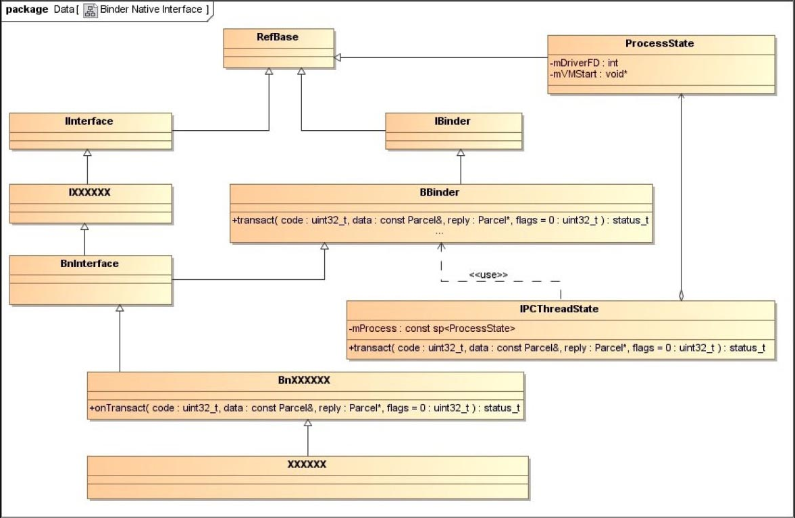
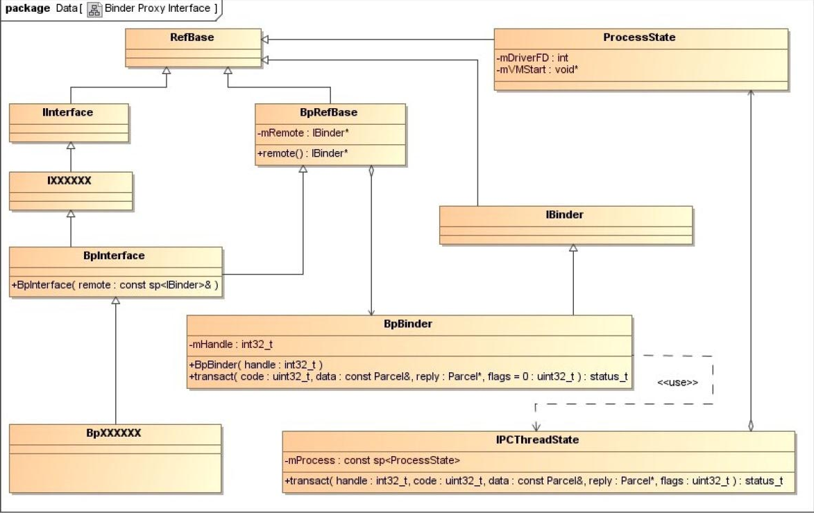
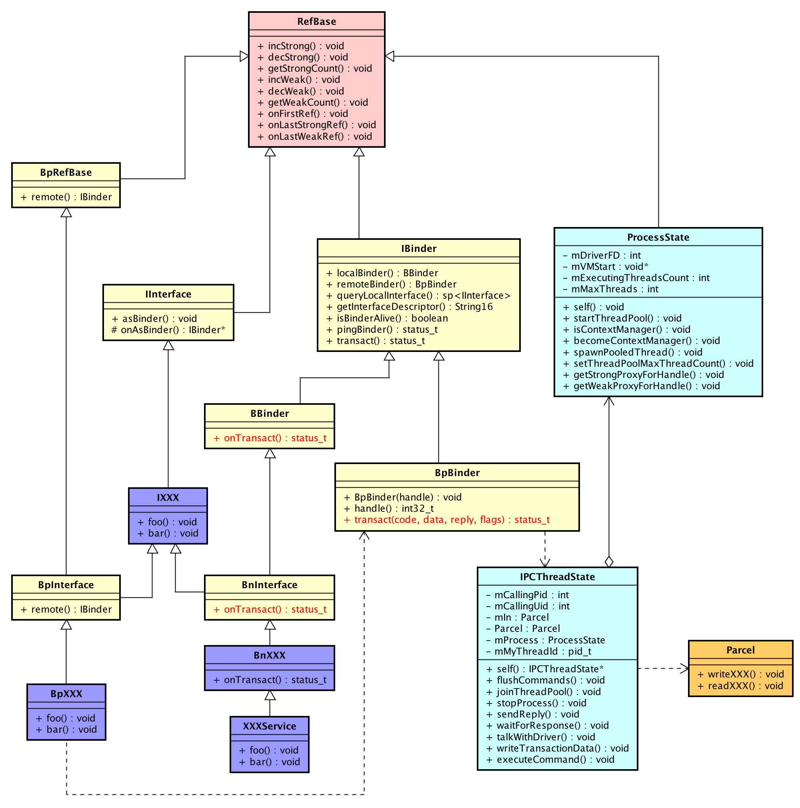

## 5.2　Binder进程间通信库
`Android` 系统在应用程序框架层中将各种 `Binder` 驱动程序操作封装成一个 `Binder` 库，这样进程就可以方便地调用 `Binder` 库提供的接口来实现进程间通信。在本节中，我们将学习 `Binder` 库的基础知识，以便加深对 `Binder` 驱动程序的理解。在接下来的 `5.3` 小节中，我们将使用 `Binder` 库创建一个进程间通信应用实例。

在 `Binder` 库中， `Service` 组件和 `Client` 组件分别使用模板类 `BnInterface` 和 `BpInterface` 来描述，其中，前者称为 `Binder` 本地对象，后者称为 `Binder` 代理对象。 `Binder` 库中的 `Binder` 本地对象和 `Binder` 代理对象分别对应于 `Binder` 驱动程序中的 `Binder` 实体对象和 `Binder` 引用对象。下面我们就主要介绍这两个模板类的实现。

模板类 `BnInterface` 和 `BpInterface` 的定义如下所示。

`frameworks/base/include/binder/IInterface.h`
```cpp
01 template<typename INTERFACE>
02 class BnInterface : public INTERFACE, public BBinder
03 {
04 public:
05     virtual sp<IInterface>      queryLocalInterface(const String16& _descriptor);
06     virtual const String16&     getInterfaceDescriptor() const;
07 
08 protected:
09     virtual IBinder*            onAsBinder();
10 };
11 
12 template<typename INTERFACE>
13 class BpInterface : public INTERFACE, public BpRefBase
14 {
15 public:
16                                 BpInterface(const sp<IBinder>& remote);
17 
18 protected:
19     virtual IBinder*            onAsBinder();
20 };
```
模板参数 `INTERFACE` 是一个由进程自定义的 `Service` 组件接口，模板类 `BnInterface` 和 `BpInterface` 都需要实现该接口。在使用 `Binder` 库开发 `Service` 组件和 `Client` 组件时，除了要定义 `Service` 组件接口之外，还必须要实现一个 `Binder` 本地对象类和一个 `Binder` 代理对象类，它们分别继承于模板类 `BnInterface` 和 `BpInterface` 。例如，在接下来的 `5.3` 小节要介绍的 `Binder` 进程间通信应用实例中，我们首先定义一个硬件访问服务接口 `IFregService` ，用来访问第 `2` 章介绍的虚拟硬件设备 `freg` 的寄存器 `val` 的值；然后又自定义一个 `Binder` 本地对象类 `BnFregService` 和一个 `Binder` 代理对象类 `BpFregService` ，它们分别继承于模板类 `BnInterface` 和 `BpInterface` ，并且实现了 `IFregService` 接口。

模板类 `BnInterface` 继承了 `BBinder` 类，后者为 `Binder` 本地对象提供了抽象的进程间通信接口，它的定义如下所示。

`frameworks/base/include/binder/Binder.h`
```cpp
class BBinder : public IBinder
{
public:
    ......
    
    virtual status_t    transact(   uint32_t code,
                                    const Parcel& data,
                                    Parcel* reply,
                                    uint32_t flags = 0);
    ......

protected:
    ......

    virtual status_t    onTransact( uint32_t code,
                                    const Parcel& data,
                                    Parcel* reply,
                                    uint32_t flags = 0);
    ......
};
```
`BBinder` 类有两个重要的成员函数 `transact` 和 `onTransact` 。当一个 `Binder` 代理对象通过 `Binder` 驱动程序向一个 `Binder` 本地对象发出一个进程间通信请求时， `Binder` 驱动程序就会调用该 `Binder` 本地对象的成员函数 `transact` 来处理该请求。成员函数 `onTransact` 是由 `BBinder` 的子类，即 `Binder` 本地对象类来实现的，它负责分发与业务相关的进程间通信请求。事实上，与业务相关的进程间通信请求是由 `Binder` 本地对象类的子类，即 `Service` 组件类来负责处理的。例如，在接下来的 `5.3` 小节将要介绍的 `Binder` 进程间通信应用实例中， `Binder` 本地对象类 `BnFregService` 重写了父类 `BBinder` 的成员函数 `onTransact` ，并且将访问虚拟硬件设备 `freg` 的寄存器 `val` 的操作分发给其子类 `FregService` 来处理。

`BBinder` 类又继承了 `IBinder` 类，而后者又继承了 `RefBase` 类。从第 `3` 章的内容可以知道，继承了 `RefBase` 类的子类的对象均可以通过强指针和弱指针来维护它们的生命周期，换句话说，就是 `Binder` 本地对象是通过引用计数技术来维护生命周期的。由于 `Binder` 本地对象受到 `Binder` 驱动程序中的 `Binder` 实体对象，以及运行在 `Client` 进程中的 `Binder` 代理对象引用，因此，它的引用计数技术比较复杂，在后面的 `5.4` 小节中，我们再详细分析。

模板类 `BpInterface` 继承了 `BpRefBase` 类，后者为 `Binder` 代理对象提供了抽象的进程间通信接口，它的定义如下所示。

`frameworks/base/include/binder/Binder.h`
```cpp
class BpRefBase : public virtual RefBase
{
protected:
                            BpRefBase(const sp<IBinder>& o);
    ......

    inline  IBinder*        remote()                { return mRemote; }
    inline  IBinder*        remote() const          { return mRemote; }

private:
    ......

    IBinder* const          mRemote;
    ......
};
```
`BpRefBase` 类又继承了 `RefBase` 类，因此，它的子类对象，即 `Binder` 代理对象也可以通过强指针和弱指针来维护生命周期。同样，在后面的 `5.4` 小节中，我们再详细分析 `Binder` 代理对象的生命周期。

`BpRefBase` 类有一个重要的成员变量 `mRemote` ，它指向一个 `BpBinder` 对象，可以通过成员函数 `remote` 来获取。 `BpBinder` 类实现了 `BpRefBase` 类的进程间通信接口，它的定义如下所示。

`frameworks/base/include/binder/BpBinder.h`
```cpp
class BpBinder : public IBinder
{
public:
                        BpBinder(int32_t handle);

    inline  int32_t     handle() const { return mHandle; }

    ......
    
    virtual status_t    transact(   uint32_t code,
                                    const Parcel& data,
                                    Parcel* reply,
                                    uint32_t flags = 0);

    ......

private:
    const   int32_t             mHandle;
    ......
};

```
`BpBinder` 类的成员变量 `mHandle` 是一个整数，它表示一个 `Client` 组件的句柄值，可以通过成员函数 `handle` 来获取。在前面的 `5.1.1` 小节中介绍结构体 `binder_ref` 时提到，每一个 `Client` 组件在 `Binder` 驱动程序中都对应有一个 `Binder` 引用对象，而每一个 `Binder` 引用对象都有一个句柄值，其中， `Client` 组件就是通过这个句柄值来和 `Binder` 驱动程序中的 `Binder` 引用对象建立对应关系的。

`BpBinder` 类的成员函数 `transact` 用来向运行在 `Server` 进程中的 `Service` 组件发送进程间通信请求，这是通过 `Binder` 驱动程序间接实现的。 `BpBinder` 类的成员函数 `transact` 会把 `BpBinder` 类的成员变量 `mHandle` ，以及进程间通信数据发送给 `Binder` 驱动程序，这样 `Binder` 驱动程序就能够根据这个句柄值来找到对应的 `Binder` 引用对象，继而找到对应的 `Binder` 实体对象，最后就可以将进程间通信数据发送给对应的 `Service` 组件了。

无论是 `BBinder` 类，还是 `BpBinder` 类，它们都是通过 `IPCThreadState` 类来和 `Binder` 驱动程序交互的。 `IPCThreadState` 类的定义如下所示。

`frameworks/base/include/binder/IPCThreadState.h`
```cpp
class IPCThreadState
{
public:
    static  IPCThreadState*     self();
    
    ......
            
            status_t            transact(int32_t handle,
                                         uint32_t code, const Parcel& data,
                                         Parcel* reply, uint32_t flags);
    ......
    
private:
    ......
            status_t            talkWithDriver(bool doReceive=true);
    ......
    
    const   sp<ProcessState>    mProcess;
    ......
};

```
在前面的 `5.1.1` 小节中介绍结构体 `binder_proc` 时提到，每一个使用了 `Binder` 进程间通信机制的进程都有一个 `Binder` 线程池，用来处理进程间通信请求。对于每一个 `Binder` 线程来说，它的内部都有一个 `IPCThreadState` 对象，我们可以通过 `IPCThreadState` 类的静态成员函数 `self` 来获取，并且调用它的成员函数 `transanct` 来和 `Binder` 驱动程序交互。在 `IPCThreadState` 类的成员函数 `transanct` 内部，与 `Binder` 驱动程序的交互操作又是通过调用成员函数 `talkWithDriver` 来实现的，它一方面负责向 `Binder` 驱动程序发送进程间通信请求，另一方面又负责接收来自 `Binder` 驱动程序的进程间通信请求。

`IPCThreadState` 类有一个成员变量 `mProcess` ，它指向一个 `ProcessState` 对象。对于每一个使用了 `Binder` 进程间通信机制的进程来说，它的内部都有一个 `ProcessState` 对象，它负责初始化 `Binder` 设备，即打开设备文件 `/dev/binder` ，以及将设备文件 `/dev/binder` 映射到进程的地址空间。由于这个 `ProcessState` 对象在进程范围内是唯一的，因此， `Binder` 线程池中的每一个线程都可以通过它来和 `Binder` 驱动程序建立连接。

ProcessState类的定义如下所示。

`frameworks/base/include/binder/ProcessState.h`
```cpp
class ProcessState : public virtual RefBase
{
public:
    static  sp<ProcessState>    self();
    ......
private:
    ......
            int                 mDriverFD;
            void*               mVMStart;
    ......
};
```
进程中的 `ProcessState` 对象可以通过 `ProcessState` 类的静态成员函数 `self` 来获取。第一次调用 `ProcessState` 类的静态成员函数 `self` 时， `Binder` 库就会为进程创建一个 `ProcessState` 对象，并且调用函数 `open` 来打开设备文件 `/dev/binder` ，接着又调用函数 `mmap` 将它映射到进程的地址空间，即请求 `Binder` 驱动程序为进程分配内核缓冲区。设备文件 `/dev/binder` 映射到进程的地址空间后，得到的内核缓冲区的用户地址就保存在其成员变量 `mVMStart` 中。

至此， `Binder` 库的基础知识就介绍完了。下面我们通过图 `5-15` 和图 `5-16` 来总结 `Service` 组件和 `Client` 组件的实现原理。





在图 `5-15` 和图 `5-16` 中， `IXXXXXX` 表示 `Service` 组件和 `Client` 组件都要实现的服务接口； `BnXXXXXX` 、 `BpXXXXXX` 分别表示 `Service` 组件和 `Client` 组件要继承的 `Binder` 本地对象类和 `Binder` 代理对象类； `XXXXXX` 表示一个 `Service` 组件。在接下来的 `5.3` 小节要介绍的 `Binder` 进程间通信应用实例中，这四个类就分别为 `IFregService` 、 `BnFregService` 、 `BpFregService` 和 `FregService` 。实现了这四个类，我们就可以使用 `Binder` 库来实现进程间通信了。

**补充**
另外说明一下，Binder服务的实现类（图中紫色部分）通常都会遵守下面的命名规则：

- 服务的接口使用I字母作为前缀
- 远程接口使用Bp作为前缀
- 本地接口使用Bn作为前缀



参考[理解Android Binder机制(2/3)：C++层](https://paul.pub/android-binder-cpp/#id-%E4%B8%BB%E8%A6%81%E7%BB%93%E6%9E%84)