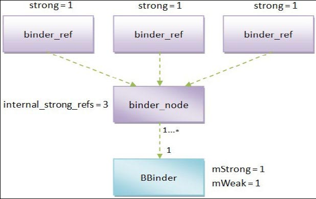

## 5.4　Binder对象引用计数技术

通过对 `Binder` 驱动程序和 `Binder` 库的学习，我们知道，在 `Client` 进程和 `Server` 进程的一次通信过程中，涉及了四种类型的对象，它们分别是位于 `Binder` 驱动程序中的 `Binder` 实体对象（ `binder_node` ）和 `Binder` 引用对象（ `binder_ref` ），以及位于 `Binder` 库中的 `Binder` 本地对象（ `BBinder` ）和 `Binder` 代理对象（ `BpBinder` ），它们的交互过程下图所示。


它们的交互过程可以划分为五个步骤，如下所示。
1. 运行在 `Client` 进程中的 `Binder` 代理对象通过 `Binder` 驱动程序向运行在 `Server` 进程中的 `Binder` 本地对象发出一个进程间通信请求， `Binder` 驱动程序接着就根据 `Client` 进程传递过来的 `Binder` 代理对象的句柄值来找到对应的 `Binder` 引用对象。
1. `Binder` 驱动程序根据前面找到的 `Binder` 引用对象找到对应的 `Binder` 实体对象，并且创建一个事务（ `binder_transaction` ）来描述该次进程间通信过程。
1. `Binder` 驱动程序根据前面找到的 `Binder` 实体对象来找到运行在 `Server` 进程中的 `Binder` 本地对象，并且将 `Client` 进程传递过来的通信数据发送给它处理。
1. `Binder` 本地对象处理完成 `Client` 进程的通信请求之后，就将通信结果返回给 `Binder` 驱动程序， `Binder` 驱动程序接着就找到前面所创建的一个事务。
1. `Binder` 驱动程序根据前面找到的事务的相关属性来找到发出通信请求的 `Client` 进程，并且通知 `Client` 进程将通信结果返回给对应的 `Binder` 代理对象处理。

从这个过程就可以看出， `Binder` 代理对象依赖于 `Binder` 引用对象，而 `Binder` 引用对象又依赖于 `Binder` 实体对象，最后， `Binder` 实体对象又依赖于 `Binder` 本地对象。这样， `Binder` 进程间通信机制就必须采用一种技术措施来保证，不能销毁一个还被其他对象依赖着的对象。为了维护这些 `Binder` 对象的依赖关系， `Binder` 进程间通信机制采用了引用计数技术来维护每一个 `Binder` 对象的生命周期。

接下来，我们就分析 `Binder` 驱动程序和 `Binder` 库是如何维护 `Binder` 本地对象、 `Binder` 实体对象、 `Binder` 引用对象和 `Binder` 代理对象的生命周期的。

### 5.4.1 Binder 本地对象的生命周期
 `Binder` 本地对象是一个类型为 `BBinder` 的对象，它是在用户空间中创建的，并且运行在 `Server` 进程中。 `Binder` 本地对象一方面会被运行在 `Server` 进程中的其他对象引用，另一方面也会被 `Binder` 驱动程序中的 `Binder` 实体对象引用。由于 `BBinder` 类继承了 `RefBase` 类，因此， `Server` 进程中的其他对象可以简单地通过智能指针来引用这些 `Binder` 本地对象，以便可以控制它们的生命周期。由于 `Binder` 驱动程序中的 `Binder` 实体对象是运行在内核空间的，它不能够通过智能指针来引用运行在用户空间的 `Binder` 本地对象，因此， `Binder` 驱动程序就需要和 `Server` 进程约定一套规则来维护它们的引用计数，避免它们在还被 `Binder` 实体对象引用的情况下销毁。

 `Server` 进程将一个 `Binder` 本地对象注册到 `Server Manager` 时， `Binder` 驱动程序就会为它创建一个 `Binder` 实体对象。接下来，当 `Client` 进程通过 `Service Manager` 来查询一个 `Binder` 本地对象的代理对象接口时， `Binder` 驱动程序就会为它所对应的 `Binder` 实体对象创建一个 `Binder` 引用对象，接着再使用 `BR_INCREFS` 和 `BR_ACQUIRE` 协议来通知对应的 `Server` 进程增加对应的 `Binder` 本地对象的弱引用计数和强引用计数。这样就能保证 `Client` 进程中的 `Binder` 代理对象在引用一个 `Binder` 本地对象期间，该 `Binder` 本地对象不会被销毁。当没有任何 `Binder` 代理对象引用一个 `Binder` 本地对象时， `Binder` 驱动程序就会使用 `BR_DECREFS` 和 `BR_RELEASE` 协议来通知对应的 `Server` 进程减少对应的 `Binder` 本地对象的弱引用计数和强引用计数。

总结来说， `Binder` 驱动程序就是通过 `BR_INCREFS` 、 `BR_ACQUIRE` 、 `BR_DECREFS` 和 `BR_RELEASE` 协议来引用运行在 `Server` 进程中的 `Binder` 本地对象的，相关的代码实现在函数 `binder_thread_read` 中，如下所示。

`kernel/drivers/staging/android/binder.c`
```cpp
01 static int
02 binder_thread_read(struct binder_proc *proc, struct binder_thread *thread,
03 	void  __user *buffer, int size, signed long *consumed, int non_block)
04 {
05     ......
06 	
07 	while (1) {
08 		uint32_t cmd;
09 		struct binder_transaction_data tr;
10 		struct binder_work *w;
11 		struct binder_transaction *t = NULL;
12 
13 		if (!list_empty(&thread->todo))
14 			w = list_first_entry(&thread->todo, struct binder_work, entry);
15 		else if (!list_empty(&proc->todo) && wait_for_proc_work)
16 			w = list_first_entry(&proc->todo, struct binder_work, entry);
17 		else {
18             ......
19 		}
20 
21 		if (end - ptr < sizeof(tr) + 4)
22 			break;
23 		switch (w->type) {
24         ......
25 		case BINDER_WORK_NODE: {
26 			struct binder_node *node = container_of(w, struct binder_node, work);
27 			uint32_t cmd = BR_NOOP;
28 			const char *cmd_name;
29 			int strong = node->internal_strong_refs || node->local_strong_refs;
30 			int weak = !hlist_empty(&node->refs) || node->local_weak_refs || strong;
31 			if (weak && !node->has_weak_ref) {
32 				cmd = BR_INCREFS;
33 				cmd_name = "BR_INCREFS";
34 				node->has_weak_ref = 1;
35 				node->pending_weak_ref = 1;
36 				node->local_weak_refs++;
37 			} else if (strong && !node->has_strong_ref) {
38 				cmd = BR_ACQUIRE;
39 				cmd_name = "BR_ACQUIRE";
40 				node->has_strong_ref = 1;
41 				node->pending_strong_ref = 1;
42 				node->local_strong_refs++;
43 			} else if (!strong && node->has_strong_ref) {
44 				cmd = BR_RELEASE;
45 				cmd_name = "BR_RELEASE";
46 				node->has_strong_ref = 0;
47 			} else if (!weak && node->has_weak_ref) {
48 				cmd = BR_DECREFS;
49 				cmd_name = "BR_DECREFS";
50 				node->has_weak_ref = 0;
51 			}
52 			if (cmd != BR_NOOP) {
53 				if (put_user(cmd, (uint32_t __user *)ptr))
54 					return -EFAULT;
55 				ptr += sizeof(uint32_t);
56 				if (put_user(node->ptr, (void * __user *)ptr))
57 					return -EFAULT;
58 				ptr += sizeof(void *);
59 				if (put_user(node->cookie, (void * __user *)ptr))
60 					return -EFAULT;
61 				ptr += sizeof(void *);
62                 ......
63 			} else {
64 				list_del_init(&w->entry);
65                 ......
66 			}
67 		} break;
68         ......
69 		}
70     }
71 	
72     ......
73 	return 0;
74 }
```
**注意**

> 当 `Binder` 驱动程序要和目标进程或者目标线程通信时，它就会把一个工作项加入到它的 `todo` 队列中。目标进程或者目标线程会不断地调用 `Binder` 驱动程序中的函数 `binder_thread_read` 来检查它的 `todo` 队列中有没有新的工作项。如果有，目标进程或者目标线程就会将它取出来，并且返回到用户空间去处理。第 `13` 行到第 `19` 行的 `if` 语句就是用来检查目标进程或者目标线程中的 `todo` 队列的，并且将里面的待处理工作项保存在变量 `w` 中。

当 `Binder` 驱动程序使用协议 `BR_INCREFS` 、 `BR_ACQUIRE` 、 `BR_DECREFS` 和 `BR_RELEASE` 来和 `Server` 进程通信时，它就将一个类型为 `BINDER_WORK_NODE` 的工作项加入到该 `Server` 进程的 `todo` 队列中。类型为 `BINDER_WORK_NODE` 的工作项是与一个 `Binder` 实体对象相关的，表示要修改与该 `Binder` 实体对象所对应的 `Binder` 本地对象的引用计数。第 `29` 行和第 `30` 行检查该 `Binder` 实体对象是否有强引用计数和弱引用计数。如果该 `Binder` 实体对象有强引用计数，那么就将变量 `strong` 的值设置为 `1` ；否则，就设置为 `0` 。同样，如果该 `Binder` 实体对象有弱引用计数，那么就将变量 `weak` 的值设置为 `1` ；否则，就设置为 `0` 。

在前面的 `5.1.1` 小节中介绍结构体 `binder_node` 时提到，如果 `Binder` 驱动程序已经请求运行 `Server` 进程中的一个 `Binder` 本地对象为它内部的一个 `Binder` 实体对象增加了强引用计数和弱引用计数，那么 `Binder` 驱动程序就会将该 `Binder` 实体对象的成员变量 `has_strong_ref` 和 `has_weak_ref` 的值设置为 `1` ；否则，就设置为 `0` ，表示接下来要增加该 `Binder` 本地对象的强引用计数和弱引用计数。

第 `31` 行到第 `51` 行的 `if` 语句就根据变量 `strong` 和 `weak` 的值，以及目标 `Binder` 实体对象的成员变量 `has_strong_ref` 和 `has_weak_ref` 的值，来判断通知目标进程增加还是减少一个对应的 `Binder` 本地对象的强引用计数或者弱引用计数，判断规则如下所示。

- 如果变量 `weak` 的值等于 `1` ，并且目标 `Binder` 实体对象的成员变量 `has_weak_ref` 的值等于 `0` ，那么就说明该 `Binder` 实体对象已经引用了一个 `Binder` 本地对象，但是还没有增加它的弱引用计数。因此，第 `32` 行到第 `36` 行代码就使用 `BR_INCREFS` 协议来请求增加对应的 `Binder` 本地对象的弱引用计数。

- 如果变量 `strong` 的值等于1，并且目标 `Binder` 实体对象的成员变量 `has_strong_ref` 的值等于 `0` ，那么就说明该 `Binder` 实体对象已经引用了一个 `Binder` 本地对象，但是还没有增加它的强引用计数。因此，第 `38` 行到第 `42` 行代码就使用 `BR_ACQUIRE` 协议来请求增加对应的 `Binder` 本地对象的强引用计数。

- 如果变量 `strong` 的值等于 `0` ，并且目标 `Binder` 实体对象的成员变量 `has_strong_ref` 的值等于 `1` ，那么就说明该 `Binder` 实体对象已经不再引用一个 `Binder` 本地对象了，但是还没有减少它的强引用计数。因此，第 `44` 行到第 `46` 行代码就使用 `BR_RELEASE` 协议来请求减少对应的 `Binder` 本地对象的强引用计数。

- 如果变量 `weak` 的值等于 `0` ，并且目标 `Binder` 实体对象的成员变量 `has_weak_ref` 的值等于 `1` ，那么就说明该 `Binder` 实体对象已经不再引用一个 `Binder` 本地对象了，但是还没有减少它的弱引用计数。因此，第 `48` 行到第 `50` 行代码就使用 `BR_DECREFS` 协议来请求减少对应的 `Binder` 本地对象的弱引用计数。

第 `53` 行到第 `61` 行代码将前面准备好的协议以及协议内容写入到由 `Server` 进程所提供的一个用户空间缓冲区，然后返回到 `Server` 进程的用户空间。 `Server` 进程是通过 `Binder` 库提供的 `IPCThreadState` 接口来处理 `Binder` 驱动程序发送给它的协议的，具体来说，就是在 `IPCThreadState` 类的成员函数 `executeCommand` 中处理 `BR_INCREFS` 、 `BR_ACQUIRE` 、 `BR_DECREFS` 和 `BR_RELEASE` 这四个协议，如下所示。

`frameworks/base/libs/binder/IPCThreadState.cpp`
```cpp
01 status_t IPCThreadState::executeCommand(int32_t cmd)
02 {
03     BBinder* obj;
04     RefBase::weakref_type* refs;
05     status_t result = NO_ERROR;
06     
07     switch (cmd) {
08     ......
09     case BR_ACQUIRE:
10         refs = (RefBase::weakref_type*)mIn.readInt32();
11         obj = (BBinder*)mIn.readInt32();
12         ......
13         obj->incStrong(mProcess.get());
14         ......
15         mOut.writeInt32(BC_ACQUIRE_DONE);
16         mOut.writeInt32((int32_t)refs);
17         mOut.writeInt32((int32_t)obj);
18         break;
19         
20     case BR_RELEASE:
21         refs = (RefBase::weakref_type*)mIn.readInt32();
22         obj = (BBinder*)mIn.readInt32();
23         ......
24         mPendingStrongDerefs.push(obj);
25         break;
26         
27     case BR_INCREFS:
28         refs = (RefBase::weakref_type*)mIn.readInt32();
29         obj = (BBinder*)mIn.readInt32();
30         refs->incWeak(mProcess.get());
31         mOut.writeInt32(BC_INCREFS_DONE);
32         mOut.writeInt32((int32_t)refs);
33         mOut.writeInt32((int32_t)obj);
34         break;
35         
36     case BR_DECREFS:
37         refs = (RefBase::weakref_type*)mIn.readInt32();
38         obj = (BBinder*)mIn.readInt32();
39         ......
40         mPendingWeakDerefs.push(refs);
41         break;
42     ......
43     }
44     ......
45     return result;
46 }
```
当 `Binder` 驱动程序请求 `Server` 进程增加或者减少一个 `Binder` 本地对象的强引用计数或者弱引用计数时，会将该 `Binder` 本地对象内部的一个弱引用计数对象（ `weakref_type` ），以及该 `Binder` 本地对象的地址传递过来，因此， `IPCThreadState` 类的成员函数 `executeCommand` 就可以知道要修改的是哪一个 `Binder` 本地对象的引用计数了。 `Binder` 驱动程序传递给 `Server` 进程的数据保存在 `IPCThreadState` 类的成员变量 `mIn` 中，第 `10` 行和第 `11` 行、第 `20` 行和第 `21` 行、第 `27` 行和第 `28` 行，以及第 `36` 行和第 `37` 行就分别从它里面取出上述两个地址，并且分别将它转换为一个 `weakref_type` 对象 `refs` 和一个 `BBinder` 对象 `obj` 。

对于 `BR_ACQUIRE` 和 `BR_INCREFS` 协议， `Server` 进程会马上增加目标 `Binder` 本地对象的强引用计数和弱引用计数，如第 `13` 行和第 `29` 行代码所示，并且使用 `BC_ACQUIRE_DONE` 和 `BC_INCREFS_DONE` 协议来通知 `Binder` 驱动程序，它已经增加相应的 `Binder` 本地对象的引用计数了。对于 `BR_RELEASE` 和 `BR_DECREFS` 协议， `Server` 进程却不急于去处理，而是将它们缓存在 `IPCThreadState` 类的成员变量 `mPendingStrongDerefs` 和 `mPendingWeakDerefs` 中，如第 `23` 行和第 `39` 行代码所示，等到 `Server` 进程下次使用 `IO` 控制命令 `BINDER_WRITE_READ` 进入 `Binder` 驱动程序之前，再来处理它们。这是因为增加一个 `Binder` 本地对象的引用计数是一件紧急的事情，必须要马上处理；否则，该 `Binder` 本地对象就有可能提前被销毁。相反，减少一个 `Binder` 本地对象的引用计数是一件不重要的事情，至多就是延迟了 `Binder` 本地对象的生命周期。这样做的好处就是可以让 `Server` 进程优先去处理其他更重要的事情。

至此，我们就分析完成 `Binder` 本地对象的生命周期了。接下来，我们继续分析 `Binder` 实体对象的生命周期。

### 5.4.2 Binder 实体对象的生命周期
 `Binder` 实体对象是一个类型为 `binder_node` 的对象，它是在 `Binder` 驱动程序中创建的，并且被 `Binder` 驱动程序中的 `Binder` 引用对象所引用。 

当 `Client` 进程第一次引用一个 `Binder` 实体对象时， `Binder` 驱动程序就会在内部为它创建一个 `Binder` 引用对象。例如，当 `Client` 进程通过 `Service Manager` 来获得一个 `Service` 组件的代理对象接口时， `Binder` 驱动程序就会找到与该 `Service` 组件对应的 `Binder` 实体对象，接着再创建一个 `Binder` 引用对象来引用它。这时候就需要增加被引用的 `Binder` 实体对象的引用计数。相应地，当 `Client` 进程不再引用一个 `Service` 组件时，它也会请求 `Binder` 驱动程序释放之前为它所创建的一个 `Binder` 引用对象。这时候就需要减少该 `Binder` 引用对象所引用的 `Binder` 实体对象的引用计数。

在 `Binder` 驱动程序中，增加一个 `Binder` 实体对象的引用计数是通过函数 `binder_inc_node` 来实现的，如下所示。

`kernel/drivers/staging/android/binder.c`
```cpp
01 static int
02 binder_inc_node(struct binder_node *node, int strong, int internal,
03 		struct list_head *target_list)
04 {
05 	if (strong) {
06 		if (internal) {
07 			if (target_list == NULL &&
08 			    node->internal_strong_refs == 0 &&
09 			    !(node == binder_context_mgr_node &&
10 			    node->has_strong_ref)) {
11 				printk(KERN_ERR "binder: invalid inc strong "
12 					"node for %d\n", node->debug_id);
13 				return -EINVAL;
14 			}
15 			node->internal_strong_refs++;
16 		} else
17 			node->local_strong_refs++;
18 		if (!node->has_strong_ref && target_list) {
19 			list_del_init(&node->work.entry);
20 			list_add_tail(&node->work.entry, target_list);
21 		}
22 	} else {
23 		if (!internal)
24 			node->local_weak_refs++;
25 		if (!node->has_weak_ref && list_empty(&node->work.entry)) {
26 			if (target_list == NULL) {
27 				printk(KERN_ERR "binder: invalid inc weak node "
28 					"for %d\n", node->debug_id);
29 				return -EINVAL;
30 			}
31 			list_add_tail(&node->work.entry, target_list);
32 		}
33 	}
34 	return 0;
35 }
```
第一个参数 `node` 表示要增加引用计数的 `Binder` 实体对象；第二个参数 `strong` 表示要增加强引用计数还是弱引用计数；第三个参数 `internal` 用来区分增加的是内部引用计数还是外部引用计数；第四个参数 `target_list` 指向一个目标进程或者目标线程的 `todo` 队列，当它不为 `NULL` 时，就表示增加了 `Binder` 实体对象 `node` 的引用计数之后，要相应地增加它所引用的 `Binder` 本地对象的引用计数。

在前面的 `5.1.1` 小节中介绍结构体 `binder_node` 时提到，每一个 `Binder` 实体对象都有一个 `Binder` 引用对象列表 `refs` ，以及三个引用计数 `internal_strong_refs` 、 `local_strong_refs` 和 `local_weak_refs` 。其中， `local_strong_refs` 和 `local_weak_refs` 分别表示该 `Binder` 实体对象的内部强引用计数和弱引用计数；而 `internal_strong_refs` 是一个外部强引用计数，用来描述有多少个 `Binder` 引用对象是通过强引用计数来引用该 `Binder` 实体对象的。内部引用计数是相对于该 `Binder` 实体对象所在的 `Server` 进程而言的，而外部引用计数是相对于引用了该 `Binder` 实体对象的 `Client` 进程而言的。当 `Binder` 驱动程序请求 `Server` 进程中的某一个 `Binder` 本地对象来执行一个操作时，它就会增加与该 `Binder` 本地对象对应的 `Binder` 实体对象的内部引用计数，避免该 `Binder` 实体对象被过早地销毁；而当一个 `Client` 进程通过一个 `Binder` 引用对象来引用一个 `Binder` 实体对象时， `Binder` 驱动程序就会增加它的外部引用计数，也是避免该 `Binder` 实体对象被过早地销毁。读者可能会觉得奇怪，为什么一个 `Binder` 实体对象的外部引用计数只有强引用计数 `internal_strong_refs` ，而没有一个对应的弱引用计数 `internal_weak_refs` 呢？原来， `Binder` 实体对象的 `Binder` 引用对象列表 `refs` 的大小就已经隐含了它的外部弱引用计数，因此，就不需要使用一个额外的弱引用计数 `internal_weak_refs` 来描述它的外部弱引用计数了。

了解了这些基础知识之后，函数 `binder_inc_node` 的实现原理就容易理解了。

如果参数 `strong` 和 `internal` 的值均等于 `1` ，即第 `5` 行和第 `6` 行的 `if` 语句均为 `true` ，那么就表示要增加 `Binder` 实体对象 `node` 的外部强引用计数 `internal_strong_refs` 。当参数 `internal` 的值等于 `1` 时，意味着此时是 `Binder` 驱动程序在为一个 `Client` 进程增加 `Binder` 实体对象 `node` 的外部强引用计数。这时候如果它的外部强引用计数 `internal_strong_refs` 等于 `0` ，并且它还没有增加对应的 `Binder` 本地对象的强引用计数，即它的成员变量 `has_strong_ref` 也等于 `0` ，那么就需要增加该 `Binder` 本地对象的强引用计数了；否则，该 `Binder` 本地对象就可能会过早地被销毁。在这种情况下，就必须指定参数 `target_list` 的值，而且它必须指向该 `Binder` 本地对象所在进程的 `todo` 队列，以便函数 `binder_inc_node` 可以往里面加入一个工作项来通知该进程增加对应的 `Binder` 本地对象的强引用计数，如第 `18` 行到第 `21` 行的 `if` 语句所示。但是有一种特殊情况，即 `Binder` 实体对象 `node` 引用的 `Binder` 本地对象是 `Service Manager` 时，可以不指定参数 `target_list` 的值，因为这个 `Binder` 本地对象是不会被销毁的。在后面的 `5.6` 小节中，我们再详细分析 `Service Manager` 的实现原理。

如果参数 `strong` 和 `internal` 的值分别等于 `1` 和 `0` ，即第 `5` 行的 `if` 语句和第 `6` 行的 `if` 语句分别为 `true` 和 `false` ，那么函数 `binder_inc_node` 就只是简单地增加 `Binder` 实体对象 `node` 的内部强引用计数 `local_strong_refs` ，如第17行代码所示。接着同样调用第 `18` 行到第 `21` 行的 `if` 语句来判断是否需要增加相应的 `Binder` 本地对象的强引用计数。

如果参数 `strong` 和 `internal` 的值均等于 `0` ，即第 `5` 行的 `if` 语句和第 `23` 行的 `if` 语句分别为 `false` 和 `true` ，那么函数 `binder_inc_node` 就先增加 `Binder` 实体对象 `node` 的内部弱引用计数 `local_weak_refs` 。接着第 `25` 行判断 `Binder` 实体对象 `node` 的成员变量 `has_weak_ref` 是否等于 `0` 。如果等于 `0` ，就说明 `Binder` 驱动程序还没有增加过与 `Binder` 实体对象 `node` 对应的 `Binder` 本地对象的弱引用计数，因此，这时候参数 `target_list` 就必须指向该 `Binder` 本地对象所在进程的 `todo` 队列，以便函数 `binder_inc_node` 可以往里面加入一个工作项来通知该进程增加对应的 `Binder` 本地对象的弱引用计数，如第 `31` 行代码所示。

如果参数 `strong` 和 `internal` 的值分别等于 `0` 和 `1` ，那么 `Binder` 驱动程序在调用函数 `binder_inc_node` 之前，就已经将一个对应的 `Binder` 引用对象添加到 `Binder` 实体对象 `node` 的 `Binder` 引用对象列表中，即相当于增加了 `Binder` 实体对象 `node` 的外部弱引用计数，因此，这时候函数 `binder_inc_node` 就没有增加相应计数的操作。不过，它仍然需要调用第 `25` 行的 `if` 语句来判断是否要增加相应的 `Binder` 本地对象的弱引用计数。

在 `Binder` 驱动程序中，减少一个 `Binder` 实体对象的引用计数是通过函数 `binder_dec_node` 来实现的，如下所示。

`kernel/drivers/staging/android/binder.c`
```cpp
01 static int
02 binder_dec_node(struct binder_node *node, int strong, int internal)
03 {
04 	if (strong) {
05 		if (internal)
06 			node->internal_strong_refs--;
07 		else
08 			node->local_strong_refs--;
09 		if (node->local_strong_refs || node->internal_strong_refs)
10 			return 0;
11 	} else {
12 		if (!internal)
13 			node->local_weak_refs--;
14 		if (node->local_weak_refs || !hlist_empty(&node->refs))
15 			return 0;
16 	}
17 	if (node->proc && (node->has_strong_ref || node->has_weak_ref)) {
18 		if (list_empty(&node->work.entry)) {
19 			list_add_tail(&node->work.entry, &node->proc->todo);
20 			wake_up_interruptible(&node->proc->wait);
21 		}
22 	} else {
23 		if (hlist_empty(&node->refs) && !node->local_strong_refs &&
24 		    !node->local_weak_refs) {
25 			list_del_init(&node->work.entry);
26 			if (node->proc) {
27 				rb_erase(&node->rb_node, &node->proc->nodes);
28 				if (binder_debug_mask & BINDER_DEBUG_INTERNAL_REFS)
29 					printk(KERN_INFO "binder: refless node %d deleted\n", node->debug_id);
30 			} else {
31 				hlist_del(&node->dead_node);
32 				if (binder_debug_mask & BINDER_DEBUG_INTERNAL_REFS)
33 					printk(KERN_INFO "binder: dead node %d deleted\n", node->debug_id);
34 			}
35 			kfree(node);
36 			binder_stats.obj_deleted[BINDER_STAT_NODE]++;
37 		}
38 	}
39 
40 	return 0;
41 }
```
第一个参数 `node` 表示要减少引用计数的 `Binder` 实体对象；第二个参数 `strong` 表示要减少强引用计数还是弱引用计数；第三个参数 `internal` 用来区分减少的是内部引用计数，还是外部引用计数。

如果参数 `strong` 和 `internal` 的值均等于 `1` ，即第 `4` 行和第 `5` 行的 `if` 语句均为 `true` ，那么就表示要减少 `Binder` 实体对象 `node` 的外部强引用计数 `internal_strong_refs` 。

如果参数 `strong` 和 `internal` 的值分别等于 `1` 和 `0` ，即第 `4` 行和第 `5` 行的 `if` 语句分别为 `true` 和 `false` ，那么就表示要减少 `Binder` 实体对象 `node` 的内部强引用计数 `local_strong_refs` 。

如果参数 `strong` 和 `internal` 的值均等于 `0` ，即第 `4` 行和第 `12` 行的 `if` 语句分别为 `false` 和 `true` ，那么就表示要减少 `Binder` 实体对象 `node` 的内部弱引用计数 `local_weak_refs` 。

如果参数 `strong` 和 `internal` 的值分别等于 `0` 和 `1` ，那么 `Binder` 驱动程序在调用函数 `binder_dec_node` 之前，就已经将一个对应的 `Binder` 引用对象从 `Binder` 实体对象 `node` 的 `Binder` 引用对象列表删除了，即相当于减少了 `Binder` 实体对象 `node` 的外部弱引用计数，因此，这时候函数 `binder_dec_node` 就没有减少相应计数的操作。

函数 `binder_dec_node` 减少了 `Binder` 实体对象 `node` 的强引用计数或者弱引用计数之后，如果它的强引用计数或者弱引用计数不等于 `0` ，即第 `9` 行或者第 `14` 行的 `if` 语句为 `true` ，那么函数 `binder_dec_node` 就不用往下处理了；否则，就需要减少与 `Binder` 实体对象 `node` 对应的 `Binder` 本地对象的引用计数。

如果函数执行到第 `17` 行，就说明 `Binder` 实体对象 `node` 的强引用计数或者弱引用计数等于 `0` 了。这时候如果它的成员变量 `has_strong_ref` 和 `has_weak_ref` 的其中一个等于 `1` ，那么就需要减少与 `Binder` 实体对象 `node` 对应的 `Binder` 本地对象的强引用计数或者弱引用计数，因为此时 `Binder` 实体对象 `node` 不需要通过强引用计数或者弱引用计数来引用相应的 `Binder` 本地对象，但是之前增加过它的强引用计数或者弱引用计数。第 `18` 行判断是否已经将一个类型为 `BINDER_WORK_NODE` 的工作项添加到要减少引用计数的 `Binder` 本地对象所在进程的 `todo` 队列中。如果不是，那么第 `19` 行就添加该工作项，并且第 `20` 行调用函数 `wake_up_interruptible` 唤醒该进程来处理该工作项，以便它可以马上执行减少相应的 `Binder` 本地对象的引用计数的工作。

如果第 `17` 行的 `if` 语句为 `false` ，那么要么是 `Binder` 实体对象 `node` 的宿主进程结构体为 `NULL` ，要么是它的成员变量 `has_strong_ref` 和 `has_weak_ref` 都等于 `0` 。这时候如果 `Binder` 实体对象 `node` 的所有引用计数均等于 `0` ，即第 `23` 行和第 `24` 行的 `if` 语句为 `true` ，那么就需要销毁该 `Binder` 实体对象 `node` 。在销毁 `Binder` 实体对象 `node` 之前，如果发现它的宿主进程结构体为 `NULL` ，即第 `26` 行的 `if` 语句为 `false` ，就说明该 `Binder` 实体对象 `node` 之前是保存在一个死亡 `Binder` 实体对象列表中的，因此，第 `31` 行就将它从该列表中删除。如果它的宿主进程结构体不为 `NULL` ，即第 `26` 行的 `if` 语句为 `true` ，就说明它是保存在其宿主进程结构体的 `Binder` 实体对象红黑树中的，因此，第 `27` 行就将它从该红黑树中删除。最后，第 `35` 行调用函数 `kfree` 来销毁 `Binder` 实体对象 `node` 。

至此，我们就分析完成 `Binder` 实体对象的生命周期了。从分析的过程中，可以看到一个有趣的事实，如下图所示。



假设有三个 `Binder` 引用对象引用了一个 `Binder` 实体对象，并且这三个 `Binder` 引用对象的强引用计数都等于 `1` 。每当一个 `Binder` 引用对象的强引用计数由 `0` 变为 `1` 时，它都会增加对应的 `Binder` 实体体象的外部强引用计数 `internal_strong_refs` ，因此，图中的 `Binder` 实体对象的外部强引用计数 `internal_strong_refs` 等于 `3` 。但是该 `Binder` 实体对象只增加了它所对应的 `Binder` 本地对象的 `1` 个强引用计数和 `1` 个弱引用计数，即一个 `Binder` 实体对象的外部强引用计数 `internal_strong_refs` 与它所对应的 `Binder` 本地对象的引用计数是多对一的关系。这样做的好处是可以减少 `Binder` 驱动程序和 `Server` 进程之间的交互，即可以减少它们之间的 `BR_INCREFS` 、 `BR_ACQUIRE` 、 `BR_DECREFS` 和 `BR_RELEASE` 协议来往。

接下来，我们继续分析 `Binder` 引用对象的生命周期。

### 5.4.3　 `Binder` 引用对象的生命周期
 `Binder` 引用对象是一个类型为 `binder_ref` 的对象，它是在 `Binder` 驱动程序中创建的，并且被用户空间中的 `Binder` 代理对象所引用。

当 `Client` 进程引用了 `Server` 进程中的一个 `Binder` 本地对象时， `Binder` 驱动程序就会在内部为它创建一个 `Binder` 引用对象。由于 `Binder` 引用对象是运行在内核空间的，而引用了它的 `Binder` 代理对象是运行在用户空间的，因此， `Client` 进程和 `Binder` 驱动程序就需要约定一套规则来维护 `Binder` 引用对象的引用计数，避免它们在还被 `Binder` 代理对象引用的情况下被销毁。

这套规则可以划分为 `BC_ACQUIRE` 、 `BC_INCREFS` 、 `BC_RELEASE` 和 `BC_DECREFS` 四个协议，分别用来增加和减少一个 `Binder` 引用对象的强引用计数和弱引用计数。相关的代码实现在 `Binder` 驱动程序的函数 `binder_thread_write` 中，如下所示。

`kernel/drivers/staging/android/binder.c`
```cpp
01 int
02 binder_thread_write(struct binder_proc *proc, struct binder_thread *thread,
03 		    void __user *buffer, int size, signed long *consumed)
04 {
05 	uint32_t cmd;
06 	void __user *ptr = buffer + *consumed;
07 	void __user *end = buffer + size;
08 
09 	while (ptr < end && thread->return_error == BR_OK) {
10 		if (get_user(cmd, (uint32_t __user *)ptr))
11 			return -EFAULT;
12 		ptr += sizeof(uint32_t);
13 
14 		switch (cmd) {
15 		case BC_INCREFS:
16 		case BC_ACQUIRE:
17 		case BC_RELEASE:
18 		case BC_DECREFS: {
19 			uint32_t target;
20 			struct binder_ref *ref;
21 			const char *debug_string;
22 
23 			if (get_user(target, (uint32_t __user *)ptr))
24 				return -EFAULT;
25 			ptr += sizeof(uint32_t);
26 			if (target == 0 && binder_context_mgr_node &&
27 			    (cmd == BC_INCREFS || cmd == BC_ACQUIRE)) {
28 				ref = binder_get_ref_for_node(proc,
29 					       binder_context_mgr_node);
30                 ......
31 			} else
32 				ref = binder_get_ref(proc, target);
33             .....
34 			switch (cmd) {
35 			case BC_INCREFS:
36 				debug_string = "IncRefs";
37 				binder_inc_ref(ref, 0, NULL);
38 				break;
39 			case BC_ACQUIRE:
40 				debug_string = "Acquire";
41 				binder_inc_ref(ref, 1, NULL);
42 				break;
43 			case BC_RELEASE:
44 				debug_string = "Release";
45 				binder_dec_ref(ref, 1);
46 				break;
47 			case BC_DECREFS:
48 			default:
49 				debug_string = "DecRefs";
50 				binder_dec_ref(ref, 0);
51 				break;
52 			}
53             ......
54 			break;
55 		}
56         ......
57 		}
58         
59         ......
60 		*consumed = ptr - buffer;
61 	}
62 	return 0;
63 }
```
 `Binder` 驱动程序会根据 `Client` 进程传进来的句柄值找到要修改引用计数的 `Binder` 引用对象。这个句柄值是 `Binder` 驱动程序为 `Client` 进程创建的，用来关联用户空间的 `Binder` 代理对象和内核空间的 `Binder` 引用对象。在 `Binder` 驱动程序中，有一个特殊的句柄值，它的值等于 `0` ，用来描述一个与 `Service Manager` 关联的 `Binder` 引用对象。

第 `23` 行首先获得由 `Client` 进程传进来的句柄值，并且保存在变量 `target` 中。接着第 `26` 行判断该句柄值是否等于 `0` 。如果等于 `0` ，那么第 `26` 行就会继续判断 `Binder` 驱动程序中是否存在一个引用了 `Service Manager` 的 `Binder` 实体对象，即全局变量 `binder_context_mgr_node` 的值是否不等于 `NULL` 。如果是，并且要执行的操作是增加它的强引用计数或者弱引用计数，那么第 `28` 行和第 `29` 行就会调用函数 `binder_get_ref_for_node` 来获得一个与 `Service Manager` 对应的 `Binder` 引用对象。如果 `Binder` 驱动程序之前尚未为 `Client` 进程创建过这个 `Binder` 引用对象，那么函数 `binder_get_ref_for_node` 就会为它创建一个，以便 `Client` 进程可以引用它。如果 `Client` 进程传进来的句柄值不等于 `0` ，那么第 `32` 行就会调用函数 `binder_get_ref` 来获取对应的 `Binder` 引用对象。如果对应的 `Binder` 引用对象不存在，那么函数 `binder_get_ref` 不会根据这个句柄值来创建一个 `Binder` 引用对象返回给调用者。因为句柄值本来就是在创建 `Binder` 引用对象的时候分配的，即先有 `Binder` 引用对象，再有句柄值，只不过值等于 `0` 的句柄比较特殊，它允许先有句柄值，再有 `Binder` 引用对象。

得到了目标 `Binder` 引用对象 `ref` 之后，第 `34` 行到第 `52` 行的 `switch` 语句根据不同的协议来增加或者减少它的强引用计数或者弱引用计数。其中， `BC_ACQUIRE` 和 `BC_INCREFS` 协议用来增加一个 `Binder` 引用对象的强引用计数和弱引用计数，调用的函数为 `binder_inc_ref` ；而 `BC_RELEASE` 和 `BC_DECREFS` 协议用来减少一个 `Binder` 引用对象的强引用计数和弱引用计数，调用的函数为 `binder_dec_ref` 。下面我们就分别分析函数 `binder_inc_ref` 和 `binder_dec_ref` 的实现。

函数 `binder_inc_ref` 的实现如下所示。

`kernel/drivers/staging/android/binder.c`
```cpp
01 static int
02 binder_inc_ref(
03 	struct binder_ref *ref, int strong, struct list_head *target_list)
04 {
05 	int ret;
06 	if (strong) {
07 		if (ref->strong == 0) {
08 			ret = binder_inc_node(ref->node, 1, 1, target_list);
09 			if (ret)
10 				return ret;
11 		}
12 		ref->strong++;
13 	} else {
14 		if (ref->weak == 0) {
15 			ret = binder_inc_node(ref->node, 0, 1, target_list);
16 			if (ret)
17 				return ret;
18 		}
19 		ref->weak++;
20 	}
21 	return 0;
22 }
```
第一个参数 `ref` 用来描述要操作的 `Binder` 引用对象；第二个参数 `strong` 用来描述是要增加 `Binder` 引用对象 `ref` 的强引用计数还是弱引用计数；第三个参数 `target_list` 指向一个目标进程或者目标线程的 `todo` 队列，当它不为 `NULL` 时，就表示增加了 `Binder` 引用对象 `ref` 的引用计数之后，要相应地增加与它所引用的 `Binder` 实体对象对应的 `Binder` 本地对象的引用计数。

如果参数 `strong` 的值等于 `1` ，即第 `6` 行的 `if` 语句为 `true` ，那么就说明要增加 `Binder` 引用对象 `ref` 的强引用计数，因此，第 `12` 行就增加它的成员变量 `strong` 的值。如果一个 `Binder` 引用对象的强引用计数由 `0` 变成 `1` ，那么第 `8` 行还需要调用函数 `binder_inc_node` 来增加它所引用的 `Binder` 实体对象的外部强引用计数 `internal_strong_refs` ，避免它在还被一个 `Binder` 引用对象引用的情况下被销毁。

如果参数 `strong` 的值等于 `0` ，即第 `6` 行的 `if` 语句为 `false` ，那么就说明要增加 `Binder` 引用对象 `ref` 的弱引用计数，因此，第 `19` 行就增加它的成员变量 `weak` 的值。同样，如果一个 `Binder` 引用对象的弱引用计数由 `0` 变成 `1` ，那么第 `15` 行还需要调用函数 `binder_inc_node` 来增加它所引用的 `Binder` 实体对象的外部弱引用计数，避免它在还被一个 `Binder` 引用对象引用的情况下被销毁。

函数 `binder_inc_node` 的实现在前面的 `5.4.2` 小节已经分析过了。接下来，我们继续分析函数 `binder_dec_ref` 的实现，如下所示。

`kernel/drivers/staging/android/binder.c`
```cpp
01 static int
02 binder_dec_ref(struct binder_ref *ref, int strong)
03 {
04 	if (strong) {
05 		if (ref->strong == 0) {
06 			binder_user_error("binder: %d invalid dec strong, "
07 					  "ref %d desc %d s %d w %d\n",
08 					  ref->proc->pid, ref->debug_id,
09 					  ref->desc, ref->strong, ref->weak);
10 			return -EINVAL;
11 		}
12 		ref->strong--;
13 		if (ref->strong == 0) {
14 			int ret;
15 			ret = binder_dec_node(ref->node, strong, 1);
16 			if (ret)
17 				return ret;
18 		}
19 	} else {
20 		if (ref->weak == 0) {
21 			binder_user_error("binder: %d invalid dec weak, "
22 					  "ref %d desc %d s %d w %d\n",
23 					  ref->proc->pid, ref->debug_id,
24 					  ref->desc, ref->strong, ref->weak);
25 			return -EINVAL;
26 		}
27 		ref->weak--;
28 	}
29 	if (ref->strong == 0 && ref->weak == 0)
30 		binder_delete_ref(ref);
31 	return 0;
32 }
```
第一个参数 `ref` 用来描述要操作的 `Binder` 引用对象；第二个参数 `strong` 用来描述是要减少 `Binder` 引用对象 `ref` 的强引用计数还是弱引用计数。

如果参数 `strong` 的值等于 `1` ，即第 `4` 行的 `if` 语句为 `true` ，就说明要减少 `Binder` 引用对象 `ref` 的强引用计数，因此，第 `12` 行就减少它的成员变量 `strong` 的值。在减少一个 `Binder` 引用对象的强引用计数之前，首先要判断它的强用计数是否大于 `0` 。如果不是，即第 `5` 行的 `if` 语句为 `true` ，那么就说明出现了不对称的强引用计数增加和减少操作。如果一个 `Binder` 引用对象的强引用计数由 `1` 变成 `0` ，那么第 `15` 行就需要调用函数 `binder_dec_node` 来减少它所引用的 `Binder` 实体对象的外部强引用计数 `internal_strong_refs` ，表示它不再被该 `Binder` 引用对象通过外部强引用计数来引用了。

如果参数 `strong` 的值等于 `0` ，即第 `4` 行的 `if` 语句为 `false` ，就说明要减少 `Binder` 引用对象的弱引用计数，因此，第 `27` 行就减少它的成员变量 `weak` 的值。同样，在减少一个 `Binder` 引用对象的弱引用计数之前，首先要判断它的弱引用计数是否大于 `0` 。如果不是，即第 `20` 行的 `if` 语句为 `true` ，就说明出现了不对称的弱引用计数增加和减少操作。

一个 `Binder` 引用对象的生命周期同时受到它的强引用计数和弱引用计数影响，因此，当它们都等于 `0` 时，即第 `29` 行的 `if` 语句为 `true` 时，第 `30` 行就需要调用函数 `binder_delete_ref` 来销毁该 `binder_ref` 对象了。

函数 `binder_delete_ref` 的实现如下所示。

`kernel/drivers/staging/android/binder.c`
```cpp
01 static void
02 binder_delete_ref(struct binder_ref *ref)
03 {
04 	if (binder_debug_mask & BINDER_DEBUG_INTERNAL_REFS)
05 		printk(KERN_INFO "binder: %d delete ref %d desc %d for "
06 			"node %d\n", ref->proc->pid, ref->debug_id,
07 			ref->desc, ref->node->debug_id);
08 	rb_erase(&ref->rb_node_desc, &ref->proc->refs_by_desc);
09 	rb_erase(&ref->rb_node_node, &ref->proc->refs_by_node);
10 	if (ref->strong)
11 		binder_dec_node(ref->node, 1, 1);
12 	hlist_del(&ref->node_entry);
13 	binder_dec_node(ref->node, 0, 1);
14 	if (ref->death) {
15 		if (binder_debug_mask & BINDER_DEBUG_DEAD_BINDER)
16 			printk(KERN_INFO "binder: %d delete ref %d desc %d "
17 				"has death notification\n", ref->proc->pid,
18 				ref->debug_id, ref->desc);
19 		list_del(&ref->death->work.entry);
20 		kfree(ref->death);
21 		binder_stats.obj_deleted[BINDER_STAT_DEATH]++;
22 	}
23 	kfree(ref);
24 	binder_stats.obj_deleted[BINDER_STAT_REF]++;
25 }
```
在前面的 `5.1.1` 小节中介绍结构体 `binder_proc` 时提到，一个 `Binder` 引用对象分别保存在其宿主进程的两个红黑树中，因此，第 `8` 行和第 `9` 行就将它从这两个红黑树中移除。同时，在介绍结构体 `binder_node` 时提到，一个 `Binder` 引用对象还保存在它所引用的 `Binder` 实体对象的 `Binder` 引用对象列表中，因此，第 `12` 行就将它从该列表中移除。

如果一个 `Binder` 引用对象是被强行销毁的，即在它的强引用计数还大于 `0` 的情况下销毁，那么第 `11` 行就需要调用函数 `binder_dec_node` 来减少它所引用的 `Binder` 实体对象的外部强引用计数 `internal_strong_refs` ，因为当该 `Binder` 引用对象销毁之后，它所引用的 `Binder` 实体对象就少了一个 `Binder` 引用对象通过外部强引用计数来引用了。

第 `13` 行调用函数 `binder_dec_node` 来减少一个即将要销毁的 `Binder` 引用对象所引用的 `Binder` 实体对象的外部弱引用计数。但是从前面 `5.4.2` 小节的内容可以知道，一个 `Binder` 实体对象是没有一个类似于 `internal_strong_refs` 的外部弱引用计数的，这里调用函数 `binder_dec_node` 只是为了检查是否需要减少相应的 `Binder` 本地对象的弱引用计数。

第 `14` 行检查即将要销毁的 `Binder` 引用对象是否注册有一个死亡接收通知。如果是，那么第 `19` 行和第 `20` 行就删除以及销毁该死亡接收通知。在接下来的 `5.4.4` 小节中，我们再详细分析 `Binder` 驱动程序中的 `Service` 组件死亡通知机制。

最后，第 `23` 行就调用函数 `kfree` 来销毁 `Binder` 引用对象 `ref` 了。

至此，我们就分析完成 `Binder` 引用对象的生命周期了。从分析的过程中，可以看到一个有趣的事实，如下图所示。


假设有三个 `Binder` 引用对象引用了一个 `Binder` 实体对象，其中，有两个 `Binder` 引用对象的强引用计数等于 `3` ，另外一个 `Binder` 引用对象的强引用计数等于 `1` 。每当一个 `Binder` 引用对象的强引用计数由 `0` 变为 `1` 时，它都会增加对应的 `Binder` 实体对象的外部强引用计数 `internal_strong_refs` 。因此，图中的 `Binder` 实体对象的外部强引用计数 `internal_strong_refs` 等于 `3` ，小于所有引用了它的 `Binder` 引用对象的强引用计数之和，即一个 `Binder` 引用对象的强引用计数与它所引用的 `Binder` 实体对象的外部强引用计数是多对一的关系。这样做的好处是可以减少执行修改 `Binder` 实体对象的引用计数的操作。

接下来，我们继续分析 `Binder` 代理对象的生命周期。

### 5.4.4　Binder代理对象的生命周期
 `Binder` 代理对象是一个类型为 `BpBinder` 的对象，它是在用户空间中创建的，并且运行在 `Client` 进程中。与 `Binder` 本地对象类似， `Binder` 代理对象一方面会被运行在 `Client` 进程中的其他对象引用，另一方面它也会引用 `Binder` 驱动程序中的 `Binder` 引用对象。由于 `BpBinder` 类继承了 `RefBase` 类，因此， `Client` 进程中的其他对象可以简单地通过智能指针来引用这些 `Binder` 代理对象，以便可以控制它们的生命周期。由于 `Binder` 驱动程序中的 `Binder` 引用对象是运行在内核空间的， `Binder` 代理对象就不能通过智能指针来引用它们，因此， `Client` 进程就需要通过 `BC_ACQUIRE` 、 `BC_INCREFS` 、 `BC_RELEASE` 和 `BC_DECREFS` 四个协议来引用 `Binder` 驱动程序中的 `Binder` 引用对象，如前面 `5.4.3` 小节的内容所示。

前面提到，每一个 `Binder` 代理对象都是通过一个句柄值来和一个 `Binder` 引用对象关联的，而 `Client` 进程就是通过这个句柄值来维护运行在它里面的 `Binder` 代理对象的。具体来说，就是 `Client` 进程会在内部建立一个 `handle_entry` 类型的 `Binder` 代理对象列表，它以句柄值作为关键字来维护它内部所有的 `Binder` 代理对象。

结构体 `handle_entry` 内部有一个 `IBinder` 指针，指向一个 `BpBinder` 对象，即一个 `Binder` 代理对象。每当 `Client` 进程接收到从 `Binder` 驱动程序传过来的句柄值时，它就会以该句柄值作为关键字在其内部的 `Binder` 代理对象列表中检查是否已经存在一个对应的 `handle_entry` 结构体。如果存在，那么 `Client` 进程就会使用该 `handle_entry` 结构体内部的 `IBinder` 指针所指向的 `BpBinder` 对象来和 `Server` 进程进行通信；否则， `Client` 进程就会先创建一个 `BpBinder` 对象，并且将它保存在一个 `handle_entry` 结构体中，以及将该 `handle_entry` 结构体保存在内部的 `Binder` 代理对象列表中。这样做的好处是可以避免创建重复的 `Binder` 代理对象来引用 `Binder` 驱动程序中的同一个 `Binder` 引用对象，因为每一个 `Binder` 代理对象在创建时都会去增加相应的 `Binder` 引用对象的引用计数。

 `Binder` 代理对象的创建过程如下所示。

`frameworks/base/libs/binder/BpBinder.cpp`
```cpp
01 BpBinder::BpBinder(int32_t handle)
02     : mHandle(handle)
03     , mAlive(1)
04     , mObitsSent(0)
05     , mObituaries(NULL)
06 {
07     LOGV("Creating BpBinder %p handle %d\n", this, mHandle);
08 
09     extendObjectLifetime(OBJECT_LIFETIME_WEAK);
10     IPCThreadState::self()->incWeakHandle(handle);
11 }
```
第 `9` 行设置 `Binder` 代理对象的生命周期受到弱引用计数影响，接着第 `10` 行调用当前线程内部的 `IPCThreadState` 对象的成员函数 `incWeakHandle` 来增加相应的 `Binder` 引用对象的弱引用计数。

`frameworks/base/libs/binder/IPCThreadState.cpp`
```cpp
1 void IPCThreadState::incWeakHandle(int32_t handle)
2 {
3     LOG_REMOTEREFS("IPCThreadState::incWeakHandle(%d)\n", handle);
4     mOut.writeInt32(BC_INCREFS);
5     mOut.writeInt32(handle);
6 }
```
`IPCThreadState` 类的成员函数 `incWeakHandle` 将增加 `Binder` 引用对象的弱引用计数的操作缓存在内部的一个成员变量 `mOut` 中，等到下次使用 `IO` 控制命令 `BINDER_WRITE_READ` 进入到 `Binder` 驱动程序时，再请求 `Binder` 驱动程序增加相应的 `Binder` 引用对象的弱引用计数。

另外，当一个 `Binder` 代理对象销毁时，当前线程就会调用其内部的 `IPCThreadState` 对象的成员函数 `decWeakHandle` 来减少相应的 `Binder` 引用对象的弱引用计数。

`frameworks/base/libs/binder/BpBinder.cpp`
```cpp
01 BpBinder::~BpBinder()
02 {
03     ......
04 
05     IPCThreadState* ipc = IPCThreadState::self();
06 
07     ......
08 
09     if (ipc) {
10         ipc->expungeHandle(mHandle, this);
11         ipc->decWeakHandle(mHandle);
12     }
13 }
```
`IPCThreadState` 类的成员函数 `decWeakHandle` 的实现如下所示。

`frameworks/base/libs/binder/IPCThreadState.cpp`
```cpp
1 void IPCThreadState::decWeakHandle(int32_t handle)
2 {
3     LOG_REMOTEREFS("IPCThreadState::decWeakHandle(%d)\n", handle);
4     mOut.writeInt32(BC_DECREFS);
5     mOut.writeInt32(handle);
6 }
```
`IPCThreadState` 类的成员函数 `decWeakHandle` 同样是将减少 `Binder` 引用对象的弱引用计数的操作缓存在内部的一个成员变量 `mOut` 中，等到下次使用 `IO` 控制命令 `BINDER_WRITE_READ` 进入到 `Binder` 驱动程序时，再请求 `Binder` 驱动程序减少相应的 `Binder` 引用对象的弱引用计数。

前面提到，一个 `Binder` 代理对象可能会被用户空间的其他对象引用，当其他对象通过强指针来引用这些 `Binder` 代理对象时， `Client` 进程就需要请求 `Binder` 驱动程序增加相应的 `Binder` 引用对象的强引用计数。为了减少 `Client` 进程和 `Binder` 驱动程序的交互开销，当一个 `Binder` 代理对象第一次被强指针引用时， `Client` 进程才会请求 `Binder` 驱动程序增加相应的 `Binder` 引用对象的强引用计数；同时，当一个 `Binder` 代理对象不再被任何强指针引用时， `Client` 进程就会请求 `Binder` 驱动程序减少相应的 `Binder` 引用对象的强引用计数。

在前面第 `3` 章介绍 `Android` 系统的智能指针时提到，当一个对象第一次被强指针引用时，它的成员函数 `onFirstRef` 就会被调用；而当一个对象不再被任何强指针引用时，它的成员函数 `onLastStrongRef` 就会被调用。因此，接下来我们就分析 `Binder` 代理对象类BpBinder的成员函数 `onFirstRef` 和 `onLastStrongRef` 的实现。

BpBinder类的成员函数onFirstRef的实现如下所示。

`frameworks/base/libs/binder/BpBinder.cpp`
```cpp
1 void BpBinder::onFirstRef()
2 {
3     LOGV("onFirstRef BpBinder %p handle %d\n", this, mHandle);
4     IPCThreadState* ipc = IPCThreadState::self();
5     if (ipc) ipc->incStrongHandle(mHandle);
6 }
```
它调用当前线程内部的 `IPCThreadState` 对象的成员函数 `incStrongHandle` 来增加相应的 `Binder` 引用对象的强引用计数。

`frameworks/base/libs/binder/IPCThreadState.cpp`
```cpp
1 void IPCThreadState::incWeakHandle(int32_t handle)
2 {
3     LOG_REMOTEREFS("IPCThreadState::incWeakHandle(%d)\n", handle);
4     mOut.writeInt32(BC_INCREFS);
5     mOut.writeInt32(handle);
6 }
```
`IPCThreadState` 类的成员函数 `incStrongHandle` 将增加 `Binder` 引用对象的强引用计数的操作缓存在内部的一个成员变量 `mOut` 中，等到下次使用 `IO` 控制命令 `BINDER_WRITE_READ` 进入到 `Binder` 驱动程序时，再请求 `Binder` 驱动程序增加相应的 `Binder` 引用对象的强引用计数。

`BpBinder` 类的成员函数 `onLastStrongRef` 的实现如下所示。

`frameworks/base/libs/binder/BpBinder.cpp`
```cpp
1 void BpBinder::onLastStrongRef(const void* id)
2 {
3     ......
4     IPCThreadState* ipc = IPCThreadState::self();
5     if (ipc) ipc->decStrongHandle(mHandle);
6 }
```
它调用当前线程内部的 `IPCThreadState` 对象的成员函数 `decStrongHandle` 来减少相应的 `Binder` 引用对象的强引用计数。

`frameworks/base/libs/binder/IPCThreadState.cpp`
```cpp
1 void IPCThreadState::decStrongHandle(int32_t handle)
2 {
3     LOG_REMOTEREFS("IPCThreadState::decStrongHandle(%d)\n", handle);
4     mOut.writeInt32(BC_RELEASE);
5     mOut.writeInt32(handle);
6 }
```
`IPCThreadState` 类的成员函数 `decStrongHandle` 同样是将减少 `Binder` 引用对象的强引用计数的操作缓存在内部的一个成员变量 `mOut` 中，等到下次使用 `IO` 控制命令 `BINDER_WRITE_READ` 进入到 `Binder` 驱动程序时，再请求 `Binder` 驱动程序减少相应的 `Binder` 引用对象的强引用计数。

至此，我们就分析完成 `Binder` 代理对象的生命周期了。从分析的过程中，可以看到一个有趣的事实，如下图所示。


假设有 `Client` 进程将一个 `Binder` 代理对象封装成三个不同的 `BpInterface` 对象，并且这三个 `BpInterface` 对象都通过强指针来引用该 `Binder` 代理对象，因此，该 `Binder` 代理对象的强引用计数和弱引用计数就等于 `3` 。由于一个 `Binder` 代理对象只有在创建时，才会增加相应的 `Binder` 引用对象的弱引用计数，并且只有在第一次被强指针引用时才会增加相应的 `Binder` 引用对象的强引用计数，因此，图中的 `Binder` 引用对象的强引用计数和弱引用计数均等于 `1` ，小于引用了它的 `Binder` 代理对象的强引用计数和弱引用计数，即一个 `Binder` 代理对象的引用计数与它所引用的 `Binder` 引用对象的引用计数是多对一的关系。这样做的好处是可以减少 `Client` 进程和 `Binder` 驱动程序之间的交互，即可以减少它们之间的 `BC_ACQUIRE` 、 `BC_INCREFS` 、 `BC_RELEASE` 和 `BC_DECREFS` 协议来往。
