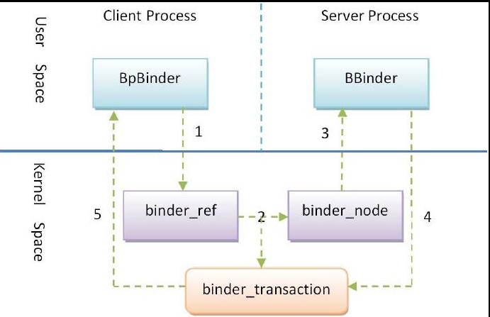
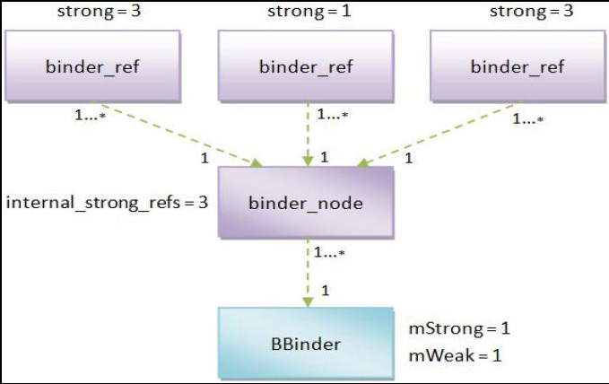
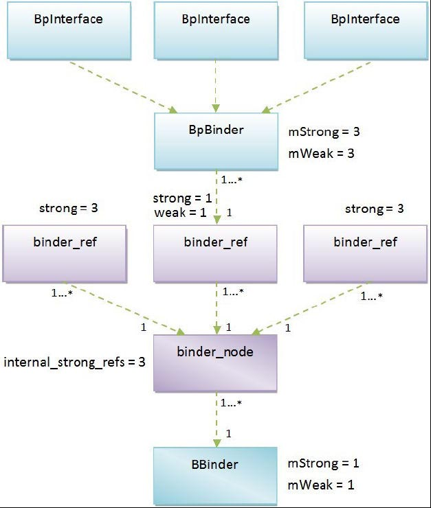

## 5.4　Binder对象引用计数技术

通过对Binder驱动程序和Binder库的学习，我们知道，在Client进程和Server进程的一次通信过程中，涉及了四种类型的对象，它们分别是位于Binder驱动程序中的Binder实体对象（binder_node）和Binder引用对象（binder_ref），以及位于Binder库中的Binder本地对象（BBinder）和Binder代理对象（BpBinder），它们的交互过程如图5-17所示。



它们的交互过程可以划分为五个步骤，如下所示。
1. 运行在Client进程中的Binder代理对象通过Binder驱动程序向运行在Server进程中的Binder本地对象发出一个进程间通信请求，Binder驱动程序接着就根据Client进程传递过来的Binder代理对象的句柄值来找到对应的Binder引用对象。
1. Binder驱动程序根据前面找到的Binder引用对象找到对应的Binder实体对象，并且创建一个事务（binder_transaction）来描述该次进程间通信过程。
1. Binder驱动程序根据前面找到的Binder实体对象来找到运行在Server进程中的Binder本地对象，并且将Client进程传递过来的通信数据发送给它处理。
1. Binder本地对象处理完成Client进程的通信请求之后，就将通信结果返回给Binder驱动程序，Binder驱动程序接着就找到前面所创建的一个事务。
1. Binder驱动程序根据前面找到的事务的相关属性来找到发出通信请求的Client进程，并且通知Client进程将通信结果返回给对应的Binder代理对象处理。

从这个过程就可以看出，Binder代理对象依赖于Binder引用对象，而Binder引用对象又依赖于Binder实体对象，最后，Binder实体对象又依赖于Binder本地对象。这样，Binder进程间通信机制就必须采用一种技术措施来保证，不能销毁一个还被其他对象依赖着的对象。为了维护这些Binder对象的依赖关系，Binder进程间通信机制采用了引用计数技术来维护每一个Binder对象的生命周期。

接下来，我们就分析Binder驱动程序和Binder库是如何维护Binder本地对象、Binder实体对象、Binder引用对象和Binder代理对象的生命周期的。

### 5.4.1　Binder本地对象的生命周期
Binder本地对象是一个类型为BBinder的对象，它是在用户空间中创建的，并且运行在Server进程中。Binder本地对象一方面会被运行在Server进程中的其他对象引用，另一方面也会被Binder驱动程序中的Binder实体对象引用。由于BBinder类继承了RefBase类，因此，Server进程中的其他对象可以简单地通过智能指针来引用这些Binder本地对象，以便可以控制它们的生命周期。由于Binder驱动程序中的Binder实体对象是运行在内核空间的，它不能够通过智能指针来引用运行在用户空间的Binder本地对象，因此，Binder驱动程序就需要和Server进程约定一套规则来维护它们的引用计数，避免它们在还被Binder实体对象引用的情况下销毁。

Server进程将一个Binder本地对象注册到Server Manager时，Binder驱动程序就会为它创建一个Binder实体对象。接下来，当Client进程通过Service Manager来查询一个Binder本地对象的代理对象接口时，Binder驱动程序就会为它所对应的Binder实体对象创建一个Binder引用对象，接着再使用BR_INCREFS和BR_ACQUIRE协议来通知对应的Server进程增加对应的Binder本地对象的弱引用计数和强引用计数。这样就能保证Client进程中的Binder代理对象在引用一个Binder本地对象期间，该Binder本地对象不会被销毁。当没有任何Binder代理对象引用一个Binder本地对象时，Binder驱动程序就会使用BR_DECREFS和BR_RELEASE协议来通知对应的Server进程减少对应的Binder本地对象的弱引用计数和强引用计数。

总结来说，Binder驱动程序就是通过BR_INCREFS、BR_ACQUIRE、BR_DECREFS和BR_RELEASE协议来引用运行在Server进程中的Binder本地对象的，相关的代码实现在函数binder_thread_read中，如下所示。

`kernel/drivers/staging/android/binder.c`
```cpp
static int
binder_thread_read(struct binder_proc *proc, struct binder_thread *thread,
	void  __user *buffer, int size, signed long *consumed, int non_block)
{
    ......
	while (1) {
		uint32_t cmd;
		struct binder_transaction_data tr;
		struct binder_work *w;
		struct binder_transaction *t = NULL;

		if (!list_empty(&thread->todo))
			w = list_first_entry(&thread->todo, struct binder_work, entry);
		else if (!list_empty(&proc->todo) && wait_for_proc_work)
			w = list_first_entry(&proc->todo, struct binder_work, entry);
		else {
            ......
		}

		if (end - ptr < sizeof(tr) + 4)
			break;

		switch (w->type) {
        ......
		case BINDER_WORK_NODE: {
			struct binder_node *node = container_of(w, struct binder_node, work);
			uint32_t cmd = BR_NOOP;
			const char *cmd_name;
			int strong = node->internal_strong_refs || node->local_strong_refs;
			int weak = !hlist_empty(&node->refs) || node->local_weak_refs || strong;
			if (weak && !node->has_weak_ref) {
				cmd = BR_INCREFS;
				cmd_name = "BR_INCREFS";
				node->has_weak_ref = 1;
				node->pending_weak_ref = 1;
				node->local_weak_refs++;
			} else if (strong && !node->has_strong_ref) {
				cmd = BR_ACQUIRE;
				cmd_name = "BR_ACQUIRE";
				node->has_strong_ref = 1;
				node->pending_strong_ref = 1;
				node->local_strong_refs++;
			} else if (!strong && node->has_strong_ref) {
				cmd = BR_RELEASE;
				cmd_name = "BR_RELEASE";
				node->has_strong_ref = 0;
			} else if (!weak && node->has_weak_ref) {
				cmd = BR_DECREFS;
				cmd_name = "BR_DECREFS";
				node->has_weak_ref = 0;
			}
			if (cmd != BR_NOOP) {
				if (put_user(cmd, (uint32_t __user *)ptr))
					return -EFAULT;
				ptr += sizeof(uint32_t);
				if (put_user(node->ptr, (void * __user *)ptr))
					return -EFAULT;
				ptr += sizeof(void *);
				if (put_user(node->cookie, (void * __user *)ptr))
					return -EFAULT;
				ptr += sizeof(void *);
                ......
			} else {
				list_del_init(&w->entry);
                ......
			}
		} break;
        ......
    }
    ......
	return 0;
}
```
**注意**

> 当Binder驱动程序要和目标进程或者目标线程通信时，它就会把一个工作项加入到它的todo队列中。目标进程或者目标线程会不断地调用Binder驱动程序中的函数binder_thread_read来检查它的todo队列中有没有新的工作项。如果有，目标进程或者目标线程就会将它取出来，并且返回到用户空间去处理。第13行到第19行的if语句就是用来检查目标进程或者目标线程中的todo队列的，并且将里面的待处理工作项保存在变量w中。

当Binder驱动程序使用协议BR_INCREFS、BR_ACQUIRE、BR_DECREFS和BR_RELEASE来和Server进程通信时，它就将一个类型为BINDER_WORK_NODE的工作项加入到该Server进程的todo队列中。类型为BINDER_WORK_NODE的工作项是与一个Binder实体对象相关的，表示要修改与该Binder实体对象所对应的Binder本地对象的引用计数。第29行和第30行检查该Binder实体对象是否有强引用计数和弱引用计数。如果该Binder实体对象有强引用计数，那么就将变量strong的值设置为1；否则，就设置为0。同样，如果该Binder实体对象有弱引用计数，那么就将变量weak的值设置为1；否则，就设置为0。

在前面的5.1.1小节中介绍结构体binder_node时提到，如果Binder驱动程序已经请求运行Server进程中的一个Binder本地对象为它内部的一个Binder实体对象增加了强引用计数和弱引用计数，那么Binder驱动程序就会将该Binder实体对象的成员变量has_strong_ref和has_weak_ref的值设置为1；否则，就设置为0，表示接下来要增加该Binder本地对象的强引用计数和弱引用计数。

第31行到第51行的if语句就根据变量strong和weak的值，以及目标Binder实体对象的成员变量has_strong_ref和has_weak_ref的值，来判断通知目标进程增加还是减少一个对应的Binder本地对象的强引用计数或者弱引用计数，判断规则如下所示。

- 如果变量weak的值等于1，并且目标Binder实体对象的成员变量has_weak_ref的值等于0，那么就说明该Binder实体对象已经引用了一个Binder本地对象，但是还没有增加它的弱引用计数。因此，第32行到第36行代码就使用BR_INCREFS协议来请求增加对应的Binder本地对象的弱引用计数。

- 如果变量strong的值等于1，并且目标Binder实体对象的成员变量has_strong_ref的值等于0，那么就说明该Binder实体对象已经引用了一个Binder本地对象，但是还没有增加它的强引用计数。因此，第38行到第42行代码就使用BR_ACQUIRE协议来请求增加对应的Binder本地对象的强引用计数。

- 如果变量strong的值等于0，并且目标Binder实体对象的成员变量has_strong_ref的值等于1，那么就说明该Binder实体对象已经不再引用一个Binder本地对象了，但是还没有减少它的强引用计数。因此，第44行到第46行代码就使用BR_RELEASE协议来请求减少对应的Binder本地对象的强引用计数。

- 如果变量weak的值等于0，并且目标Binder实体对象的成员变量has_weak_ref的值等于1，那么就说明该Binder实体对象已经不再引用一个Binder本地对象了，但是还没有减少它的弱引用计数。因此，第48行到第50行代码就使用BR_DECREFS协议来请求减少对应的Binder本地对象的弱引用计数。

第53行到第61行代码将前面准备好的协议以及协议内容写入到由Server进程所提供的一个用户空间缓冲区，然后返回到Server进程的用户空间。Server进程是通过Binder库提供的IPCThreadState接口来处理Binder驱动程序发送给它的协议的，具体来说，就是在IPCThreadState类的成员函数executeCommand中处理BR_INCREFS、BR_ACQUIRE、BR_DECREFS和BR_RELEASE这四个协议，如下所示。

`frameworks/base/libs/binder/IPCThreadState.cpp`
```cpp
status_t IPCThreadState::executeCommand(int32_t cmd)
{
    BBinder* obj;
    RefBase::weakref_type* refs;
    status_t result = NO_ERROR;
    
    switch (cmd) {
    ......
    case BR_ACQUIRE:
        refs = (RefBase::weakref_type*)mIn.readInt32();
        obj = (BBinder*)mIn.readInt32();
        ......
        obj->incStrong(mProcess.get());
        ......
        mOut.writeInt32(BC_ACQUIRE_DONE);
        mOut.writeInt32((int32_t)refs);
        mOut.writeInt32((int32_t)obj);
        break;
        
    case BR_RELEASE:
        refs = (RefBase::weakref_type*)mIn.readInt32();
        obj = (BBinder*)mIn.readInt32();
        ......
        mPendingStrongDerefs.push(obj);
        break;
        
    case BR_INCREFS:
        refs = (RefBase::weakref_type*)mIn.readInt32();
        obj = (BBinder*)mIn.readInt32();
        refs->incWeak(mProcess.get());
        mOut.writeInt32(BC_INCREFS_DONE);
        mOut.writeInt32((int32_t)refs);
        mOut.writeInt32((int32_t)obj);
        break;
        
    case BR_DECREFS:
        refs = (RefBase::weakref_type*)mIn.readInt32();
        obj = (BBinder*)mIn.readInt32();
        ......
        mPendingWeakDerefs.push(refs);
        break;
    ......
    }
    ......
    return result;
}
```
当Binder驱动程序请求Server进程增加或者减少一个Binder本地对象的强引用计数或者弱引用计数时，会将该Binder本地对象内部的一个弱引用计数对象（weakref_type），以及该Binder本地对象的地址传递过来，因此，IPCThreadState类的成员函数executeCommand就可以知道要修改的是哪一个Binder本地对象的引用计数了。Binder驱动程序传递给Server进程的数据保存在IPCThreadState类的成员变量mIn中，第10行和第11行、第20行和第21行、第27行和第28行，以及第36行和第37行就分别从它里面取出上述两个地址，并且分别将它转换为一个weakref_type对象refs和一个BBinder对象obj。

对于BR_ACQUIRE和BR_INCREFS协议，Server进程会马上增加目标Binder本地对象的强引用计数和弱引用计数，如第13行和第29行代码所示，并且使用BC_ACQUIRE_DONE和BC_INCREFS_DONE协议来通知Binder驱动程序，它已经增加相应的Binder本地对象的引用计数了。对于BR_RELEASE和BR_DECREFS协议，Server进程却不急于去处理，而是将它们缓存在IPCThreadState类的成员变量mPendingStrongDerefs和mPendingWeakDerefs中，如第23行和第39行代码所示，等到Server进程下次使用IO控制命令BINDER_WRITE_READ进入Binder驱动程序之前，再来处理它们。这是因为增加一个Binder本地对象的引用计数是一件紧急的事情，必须要马上处理；否则，该Binder本地对象就有可能提前被销毁。相反，减少一个Binder本地对象的引用计数是一件不重要的事情，至多就是延迟了Binder本地对象的生命周期。这样做的好处就是可以让Server进程优先去处理其他更重要的事情。

至此，我们就分析完成Binder本地对象的生命周期了。接下来，我们继续分析Binder实体对象的生命周期。

### 5.4.2　Binder实体对象的生命周期
Binder实体对象是一个类型为binder_node的对象，它是在Binder驱动程序中创建的，并且被Binder驱动程序中的Binder引用对象所引用。 

当Client进程第一次引用一个Binder实体对象时，Binder驱动程序就会在内部为它创建一个Binder引用对象。例如，当Client进程通过Service Manager来获得一个Service组件的代理对象接口时，Binder驱动程序就会找到与该Service组件对应的Binder实体对象，接着再创建一个Binder引用对象来引用它。这时候就需要增加被引用的Binder实体对象的引用计数。相应地，当Client进程不再引用一个Service组件时，它也会请求Binder驱动程序释放之前为它所创建的一个Binder引用对象。这时候就需要减少该Binder引用对象所引用的Binder实体对象的引用计数。

在Binder驱动程序中，增加一个Binder实体对象的引用计数是通过函数binder_inc_node来实现的，如下所示。

`kernel/drivers/staging/android/binder.c`
```cpp
01 static int
02 binder_inc_node(struct binder_node *node, int strong, int internal,
03 		struct list_head *target_list)
04 {
05 	if (strong) {
06 		if (internal) {
07 			if (target_list == NULL &&
08 			    node->internal_strong_refs == 0 &&
09 			    !(node == binder_context_mgr_node &&
10 			    node->has_strong_ref)) {
11 				printk(KERN_ERR "binder: invalid inc strong "
12 					"node for %d\n", node->debug_id);
13 				return -EINVAL;
14 			}
15 			node->internal_strong_refs++;
16 		} else
17 			node->local_strong_refs++;
18 		if (!node->has_strong_ref && target_list) {
19 			list_del_init(&node->work.entry);
20 			list_add_tail(&node->work.entry, target_list);
21 		}
22 	} else {
23 		if (!internal)
24 			node->local_weak_refs++;
25 		if (!node->has_weak_ref && list_empty(&node->work.entry)) {
26 			if (target_list == NULL) {
27 				printk(KERN_ERR "binder: invalid inc weak node "
28 					"for %d\n", node->debug_id);
29 				return -EINVAL;
30 			}
31 			list_add_tail(&node->work.entry, target_list);
32 		}
33 	}
34 	return 0;
35 }
```
第一个参数node表示要增加引用计数的Binder实体对象；第二个参数strong表示要增加强引用计数还是弱引用计数；第三个参数internal用来区分增加的是内部引用计数还是外部引用计数；第四个参数target_list指向一个目标进程或者目标线程的todo队列，当它不为NULL时，就表示增加了Binder实体对象node的引用计数之后，要相应地增加它所引用的Binder本地对象的引用计数。

在前面的5.1.1小节中介绍结构体binder_node时提到，每一个Binder实体对象都有一个Binder引用对象列表refs，以及三个引用计数internal_strong_refs、local_strong_refs和local_weak_refs。其中，local_strong_refs和local_weak_refs分别表示该Binder实体对象的内部强引用计数和弱引用计数；而internal_strong_refs是一个外部强引用计数，用来描述有多少个Binder引用对象是通过强引用计数来引用该Binder实体对象的。内部引用计数是相对于该Binder实体对象所在的Server进程而言的，而外部引用计数是相对于引用了该Binder实体对象的Client进程而言的。当Binder驱动程序请求Server进程中的某一个Binder本地对象来执行一个操作时，它就会增加与该Binder本地对象对应的Binder实体对象的内部引用计数，避免该Binder实体对象被过早地销毁；而当一个Client进程通过一个Binder引用对象来引用一个Binder实体对象时，Binder驱动程序就会增加它的外部引用计数，也是避免该Binder实体对象被过早地销毁。读者可能会觉得奇怪，为什么一个Binder实体对象的外部引用计数只有强引用计数internal_strong_refs，而没有一个对应的弱引用计数internal_weak_refs呢？原来，Binder实体对象的Binder引用对象列表refs的大小就已经隐含了它的外部弱引用计数，因此，就不需要使用一个额外的弱引用计数internal_weak_refs来描述它的外部弱引用计数了。

了解了这些基础知识之后，函数binder_inc_node的实现原理就容易理解了。

如果参数strong和internal的值均等于1，即第5行和第6行的if语句均为true，那么就表示要增加Binder实体对象node的外部强引用计数internal_strong_refs。当参数internal的值等于1时，意味着此时是Binder驱动程序在为一个Client进程增加Binder实体对象node的外部强引用计数。这时候如果它的外部强引用计数internal_strong_refs等于0，并且它还没有增加对应的Binder本地对象的强引用计数，即它的成员变量has_strong_ref也等于0，那么就需要增加该Binder本地对象的强引用计数了；否则，该Binder本地对象就可能会过早地被销毁。在这种情况下，就必须指定参数target_list的值，而且它必须指向该Binder本地对象所在进程的todo队列，以便函数binder_inc_node可以往里面加入一个工作项来通知该进程增加对应的Binder本地对象的强引用计数，如第18行到第21行的if语句所示。但是有一种特殊情况，即Binder实体对象node引用的Binder本地对象是Service Manager时，可以不指定参数target_list的值，因为这个Binder本地对象是不会被销毁的。在后面的5.6小节中，我们再详细分析Service Manager的实现原理。

如果参数strong和internal的值分别等于1和0，即第5行的if语句和第6行的if语句分别为true和false，那么函数binder_inc_node就只是简单地增加Binder实体对象node的内部强引用计数local_strong_refs，如第17行代码所示。接着同样调用第18行到第21行的if语句来判断是否需要增加相应的Binder本地对象的强引用计数。

如果参数strong和internal的值均等于0，即第5行的if语句和第23行的if语句分别为false和true，那么函数binder_inc_node就先增加Binder实体对象node的内部弱引用计数local_weak_refs。接着第25行判断Binder实体对象node的成员变量has_weak_ref是否等于0。如果等于0，就说明Binder驱动程序还没有增加过与Binder实体对象node对应的Binder本地对象的弱引用计数，因此，这时候参数target_list就必须指向该Binder本地对象所在进程的todo队列，以便函数binder_inc_node可以往里面加入一个工作项来通知该进程增加对应的Binder本地对象的弱引用计数，如第31行代码所示。

如果参数strong和internal的值分别等于0和1，那么Binder驱动程序在调用函数binder_inc_node之前，就已经将一个对应的Binder引用对象添加到Binder实体对象node的Binder引用对象列表中，即相当于增加了Binder实体对象node的外部弱引用计数，因此，这时候函数binder_inc_node就没有增加相应计数的操作。不过，它仍然需要调用第25行的if语句来判断是否要增加相应的Binder本地对象的弱引用计数。

在Binder驱动程序中，减少一个Binder实体对象的引用计数是通过函数binder_dec_node来实现的，如下所示。

`kernel/drivers/staging/android/binder.c`
```cpp
01 static int
02 binder_dec_node(struct binder_node *node, int strong, int internal)
03 {
04 	if (strong) {
05 		if (internal)
06 			node->internal_strong_refs--;
07 		else
08 			node->local_strong_refs--;
09 		if (node->local_strong_refs || node->internal_strong_refs)
10 			return 0;
11 	} else {
12 		if (!internal)
13 			node->local_weak_refs--;
14 		if (node->local_weak_refs || !hlist_empty(&node->refs))
15 			return 0;
16 	}
17 	if (node->proc && (node->has_strong_ref || node->has_weak_ref)) {
18 		if (list_empty(&node->work.entry)) {
19 			list_add_tail(&node->work.entry, &node->proc->todo);
20 			wake_up_interruptible(&node->proc->wait);
21 		}
22 	} else {
23 		if (hlist_empty(&node->refs) && !node->local_strong_refs &&
24 		    !node->local_weak_refs) {
25 			list_del_init(&node->work.entry);
26 			if (node->proc) {
27 				rb_erase(&node->rb_node, &node->proc->nodes);
28 				if (binder_debug_mask & BINDER_DEBUG_INTERNAL_REFS)
29 					printk(KERN_INFO "binder: refless node %d deleted\n", node->debug_id);
30 			} else {
31 				hlist_del(&node->dead_node);
32 				if (binder_debug_mask & BINDER_DEBUG_INTERNAL_REFS)
33 					printk(KERN_INFO "binder: dead node %d deleted\n", node->debug_id);
34 			}
35 			kfree(node);
36 			binder_stats.obj_deleted[BINDER_STAT_NODE]++;
37 		}
38 	}
39 
40 	return 0;
41 }
```
第一个参数node表示要减少引用计数的Binder实体对象；第二个参数strong表示要减少强引用计数还是弱引用计数；第三个参数internal用来区分减少的是内部引用计数，还是外部引用计数。

如果参数strong和internal的值均等于1，即第4行和第5行的if语句均为true，那么就表示要减少Binder实体对象node的外部强引用计数internal_strong_refs。
如果参数strong和internal的值分别等于1和0，即第4行和第5行的if语句分别为true和false，那么就表示要减少Binder实体对象node的内部强引用计数local_strong_refs。

如果参数strong和internal的值均等于0，即第4行和第12行的if语句分别为false和true，那么就表示要减少Binder实体对象node的内部弱引用计数local_weak_refs。
如果参数strong和internal的值分别等于0和1，那么Binder驱动程序在调用函数binder_dec_node之前，就已经将一个对应的Binder引用对象从Binder实体对象node的Binder引用对象列表删除了，即相当于减少了Binder实体对象node的外部弱引用计数，因此，这时候函数binder_dec_node就没有减少相应计数的操作。

函数binder_dec_node减少了Binder实体对象node的强引用计数或者弱引用计数之后，如果它的强引用计数或者弱引用计数不等于0，即第9行或者第14行的if语句为true，那么函数binder_dec_node就不用往下处理了；否则，就需要减少与Binder实体对象node对应的Binder本地对象的引用计数。

如果函数执行到第17行，就说明Binder实体对象node的强引用计数或者弱引用计数等于0了。这时候如果它的成员变量has_strong_ref和has_weak_ref的其中一个等于1，那么就需要减少与Binder实体对象node对应的Binder本地对象的强引用计数或者弱引用计数，因为此时Binder实体对象node不需要通过强引用计数或者弱引用计数来引用相应的Binder本地对象，但是之前增加过它的强引用计数或者弱引用计数。第18行判断是否已经将一个类型为BINDER_WORK_NODE的工作项添加到要减少引用计数的Binder本地对象所在进程的todo队列中。如果不是，那么第19行就添加该工作项，并且第20行调用函数wake_up_interruptible唤醒该进程来处理该工作项，以便它可以马上执行减少相应的Binder本地对象的引用计数的工作。

如果第17行的if语句为false，那么要么是Binder实体对象node的宿主进程结构体为NULL，要么是它的成员变量has_strong_ref和has_weak_ref都等于0。这时候如果Binder实体对象node的所有引用计数均等于0，即第23行和第24行的if语句为true，那么就需要销毁该Binder实体对象node。在销毁Binder实体对象node之前，如果发现它的宿主进程结构体为NULL，即第26行的if语句为false，就说明该Binder实体对象node之前是保存在一个死亡Binder实体对象列表中的，因此，第30行就将它从该列表中删除。如果它的宿主进程结构体不为NULL，即第26行的if语句为true，就说明它是保存在其宿主进程结构体的Binder实体对象红黑树中的，因此，第27行就将它从该红黑树中删除。最后，第33行调用函数kfree来销毁Binder实体对象node。

至此，我们就分析完成Binder实体对象的生命周期了。从分析的过程中，可以看到一个有趣的事实，如图5-18所示。


假设有三个Binder引用对象引用了一个Binder实体对象，并且这三个Binder引用对象的强引用计数都等于1。每当一个Binder引用对象的强引用计数由0变为1时，它都会增加对应的Binder实体体象的外部强引用计数internal_strong_refs，因此，图5-18中的Binder实体对象的外部强引用计数internal_strong_refs等于3。但是该Binder实体对象只增加了它所对应的Binder本地对象的1个强引用计数和1个弱引用计数，即一个Binder实体对象的外部强引用计数internal_strong_refs与它所对应的Binder本地对象的引用计数是多对一的关系。这样做的好处是可以减少Binder驱动程序和Server进程之间的交互，即可以减少它们之间的BR_INCREFS、BR_ACQUIRE、BR_DECREFS和BR_RELEASE协议来往。

接下来，我们继续分析Binder引用对象的生命周期。

### 5.4.3　Binder引用对象的生命周期
Binder引用对象是一个类型为binder_ref的对象，它是在Binder驱动程序中创建的，并且被用户空间中的Binder代理对象所引用。

当Client进程引用了Server进程中的一个Binder本地对象时，Binder驱动程序就会在内部为它创建一个Binder引用对象。由于Binde引用对象是运行在内核空间的，而引用了它的Binder代理对象是运行在用户空间的，因此，Client进程和Binder驱动程序就需要约定一套规则来维护Binder引用对象的引用计数，避免它们在还被Binder代理对象引用的情况下被销毁。

这套规则可以划分为BC_ACQUIRE、BC_INCREFS、BC_RELEASE和BC_DECREFS四个协议，分别用来增加和减少一个Binder引用对象的强引用计数和弱引用计数。相关的代码实现在Binder驱动程序的函数binder_thread_write中，如下所示。

`kernel/drivers/staging/android/binder.c`
```cpp
01 int
02 binder_thread_write(struct binder_proc *proc, struct binder_thread *thread,
03 		    void __user *buffer, int size, signed long *consumed)
04 {
05 	uint32_t cmd;
06 	void __user *ptr = buffer + *consumed;
07 	void __user *end = buffer + size;
08 
09 	while (ptr < end && thread->return_error == BR_OK) {
10 		if (get_user(cmd, (uint32_t __user *)ptr))
11 			return -EFAULT;
12 		ptr += sizeof(uint32_t);
13 
14 		switch (cmd) {
15 		case BC_INCREFS:
16 		case BC_ACQUIRE:
17 		case BC_RELEASE:
18 		case BC_DECREFS: {
19 			uint32_t target;
20 			struct binder_ref *ref;
21 			const char *debug_string;
22 
23 			if (get_user(target, (uint32_t __user *)ptr))
24 				return -EFAULT;
25 			ptr += sizeof(uint32_t);
26 			if (target == 0 && binder_context_mgr_node &&
27 			    (cmd == BC_INCREFS || cmd == BC_ACQUIRE)) {
28 				ref = binder_get_ref_for_node(proc,
29 					       binder_context_mgr_node);
30                 ......
31 			} else
32 				ref = binder_get_ref(proc, target);
33             .....
34 			switch (cmd) {
35 			case BC_INCREFS:
36 				debug_string = "IncRefs";
37 				binder_inc_ref(ref, 0, NULL);
38 				break;
39 			case BC_ACQUIRE:
40 				debug_string = "Acquire";
41 				binder_inc_ref(ref, 1, NULL);
42 				break;
43 			case BC_RELEASE:
44 				debug_string = "Release";
45 				binder_dec_ref(ref, 1);
46 				break;
47 			case BC_DECREFS:
48 			default:
49 				debug_string = "DecRefs";
50 				binder_dec_ref(ref, 0);
51 				break;
52 			}
53             ......
54 			break;
55 		}
56         ......
57 		}
58         
59         ......
60 		*consumed = ptr - buffer;
61 	}
62 	return 0;
63 }
```
Binder驱动程序会根据Client进程传进来的句柄值找到要修改引用计数的Binder引用对象。这个句柄值是Binder驱动程序为Client进程创建的，用来关联用户空间的Binder代理对象和内核空间的Binder引用对象。在Binder驱动程序中，有一个特殊的句柄值，它的值等于0，用来描述一个与Service Manager关联的Binder引用对象。

第23行首先获得由Client进程传进来的句柄值，并且保存在变量target中。接着第26行判断该句柄值是否等于0。如果等于0，那么第26行就会继续判断Binder驱动程序中是否存在一个引用了Service Manager的Binder实体对象，即全局变量binder_context_mgr_node的值是否不等于NULL。如果是，并且要执行的操作是增加它的强引用计数或者弱引用计数，那么第28行和第29行就会调用函数binder_get_ref_for_node来获得一个与Service Manager对应的Binder引用对象。如果Binder驱动程序之前尚未为Client进程创建过这个Binder引用对象，那么函数binder_get_ref_for_node就会为它创建一个，以便Client进程可以引用它。如果Client进程传进来的句柄值不等于0，那么第32行就会调用函数binder_get_ref来获取对应的Binder引用对象。如果对应的Binder引用对象不存在，那么函数binder_get_ref不会根据这个句柄值来创建一个Binder引用对象返回给调用者。因为句柄值本来就是在创建Binder引用对象的时候分配的，即先有Binder引用对象，再有句柄值，只不过值等于0的句柄比较特殊，它允许先有句柄值，再有Binder引用对象。

得到了目标Binder引用对象ref之后，第34行到第52行的switch语句根据不同的协议来增加或者减少它的强引用计数或者弱引用计数。其中，BC_ACQUIRE和BC_INCREFS协议用来增加一个Binder引用对象的强引用计数和弱引用计数，调用的函数为binder_inc_ref；而BC_RELEASE和BC_DECREFS协议用来减少一个Binder引用对象的强引用计数和弱引用计数，调用的函数为binder_dec_ref。下面我们就分别分析函数binder_inc_ref和binder_dec_ref的实现。

函数binder_inc_ref的实现如下所示。

`kernel/drivers/staging/android/binder.c`
```cpp
01 static int
02 binder_inc_ref(
03 	struct binder_ref *ref, int strong, struct list_head *target_list)
04 {
05 	int ret;
06 	if (strong) {
07 		if (ref->strong == 0) {
08 			ret = binder_inc_node(ref->node, 1, 1, target_list);
09 			if (ret)
10 				return ret;
11 		}
12 		ref->strong++;
13 	} else {
14 		if (ref->weak == 0) {
15 			ret = binder_inc_node(ref->node, 0, 1, target_list);
16 			if (ret)
17 				return ret;
18 		}
19 		ref->weak++;
20 	}
21 	return 0;
22 }
```
第一个参数ref用来描述要操作的Binder引用对象；第二个参数strong用来描述是要增加Binder引用对象ref的强引用计数还是弱引用计数；第三个参数target_list指向一个目标进程或者目标线程的todo队列，当它不为NULL时，就表示增加了Binder引用对象ref的引用计数之后，要相应地增加与它所引用的Binder实体对象对应的Binder本地对象的引用计数。

如果参数strong的值等于1，即第6行的if语句为true，那么就说明要增加Binder引用对象ref的强引用计数，因此，第12行就增加它的成员变量strong的值。如果一个Binder引用对象的强引用计数由0变成1，那么第8行还需要调用函数binder_inc_node来增加它所引用的Binder实体对象的外部强引用计数internal_strong_refs，避免它在还被一个Binder引用对象引用的情况下被销毁。

如果参数strong的值等于0，即第6行的if语句为false，那么就说明要增加Binder引用对象ref的弱引用计数，因此，第19行就增加它的成员变量weak的值。同样，如果一个Binder引用对象的弱引用计数由0变成1，那么第15行还需要调用函数binder_inc_node来增加它所引用的Binder实体对象的外部弱引用计数，避免它在还被一个Binder引用对象引用的情况下被销毁。

函数binder_inc_node的实现在前面的5.4.2小节已经分析过了。接下来，我们继续分析函数binder_dec_ref的实现，如下所示。

`kernel/drivers/staging/android/binder.c`
```cpp
01 static int
02 binder_dec_ref(struct binder_ref *ref, int strong)
03 {
04 	if (strong) {
05 		if (ref->strong == 0) {
06 			binder_user_error("binder: %d invalid dec strong, "
07 					  "ref %d desc %d s %d w %d\n",
08 					  ref->proc->pid, ref->debug_id,
09 					  ref->desc, ref->strong, ref->weak);
10 			return -EINVAL;
11 		}
12 		ref->strong--;
13 		if (ref->strong == 0) {
14 			int ret;
15 			ret = binder_dec_node(ref->node, strong, 1);
16 			if (ret)
17 				return ret;
18 		}
19 	} else {
20 		if (ref->weak == 0) {
21 			binder_user_error("binder: %d invalid dec weak, "
22 					  "ref %d desc %d s %d w %d\n",
23 					  ref->proc->pid, ref->debug_id,
24 					  ref->desc, ref->strong, ref->weak);
25 			return -EINVAL;
26 		}
27 		ref->weak--;
28 	}
29 	if (ref->strong == 0 && ref->weak == 0)
30 		binder_delete_ref(ref);
31 	return 0;
32 }
```
第一个参数ref用来描述要操作的Binder引用对象；第二个参数strong用来描述是要减少Binder引用对象ref的强引用计数还是弱引用计数。
如果参数strong的值等于1，即第4行的if语句为true，就说明要减少Binder引用对象ref的强引用计数，因此，第12行就减少它的成员变量strong的值。在减少一个Binder引用对象的强引用计数之前，首先要判断它的强用计数是否大于0。如果不是，即第5行的if语句为true，那么就说明出现了不对称的强引用计数增加和减少操作。如果一个Binder引用对象的强引用计数由1变成0，那么第15行就需要调用函数binder_dec_node来减少它所引用的Binder实体对象的外部强引用计数internal_strong_refs，表示它不再被该Binder引用对象通过外部强引用计数来引用了。

如果参数strong的值等于0，即第4行的if语句为false，就说明要减少Binder引用对象的弱引用计数，因此，第27行就减少它的成员变量weak的值。同样，在减少一个Binder引用对象的弱引用计数之前，首先要判断它的弱引用计数是否大于0。如果不是，即第20行的if语句为true，就说明出现了不对称的弱引用计数增加和减少操作。
一个Binder引用对象的生命周期同时受到它的强引用计数和弱引用计数影响，因此，当它们都等于0时，即第29行的if语句为true时，第30行就需要调用函数binder_delete_ref来销毁该binder_ref对象了。

函数binder_delete_ref的实现如下所示。

`kernel/drivers/staging/android/binder.c`
```cpp
01 static void
02 binder_delete_ref(struct binder_ref *ref)
03 {
04 	if (binder_debug_mask & BINDER_DEBUG_INTERNAL_REFS)
05 		printk(KERN_INFO "binder: %d delete ref %d desc %d for "
06 			"node %d\n", ref->proc->pid, ref->debug_id,
07 			ref->desc, ref->node->debug_id);
08 	rb_erase(&ref->rb_node_desc, &ref->proc->refs_by_desc);
09 	rb_erase(&ref->rb_node_node, &ref->proc->refs_by_node);
10 	if (ref->strong)
11 		binder_dec_node(ref->node, 1, 1);
12 	hlist_del(&ref->node_entry);
13 	binder_dec_node(ref->node, 0, 1);
14 	if (ref->death) {
15 		if (binder_debug_mask & BINDER_DEBUG_DEAD_BINDER)
16 			printk(KERN_INFO "binder: %d delete ref %d desc %d "
17 				"has death notification\n", ref->proc->pid,
18 				ref->debug_id, ref->desc);
19 		list_del(&ref->death->work.entry);
20 		kfree(ref->death);
21 		binder_stats.obj_deleted[BINDER_STAT_DEATH]++;
22 	}
23 	kfree(ref);
24 	binder_stats.obj_deleted[BINDER_STAT_REF]++;
25 }
```
在前面的5.1.1小节中介绍结构体binder_proc时提到，一个Binder引用对象分别保存在其宿主进程的两个红黑树中，因此，第5行和第6行就将它从这两个红黑树中移除。同时，在介绍结构体binder_node时提到，一个Binder引用对象还保存在它所引用的Binder实体对象的Binder引用对象列表中，因此，第9行就将它从该列表中移除。

如果一个Binder引用对象是被强行销毁的，即在它的强引用计数还大于0的情况下销毁，那么第8行就需要调用函数binder_dec_node来减少它所引用的Binder实体对象的外部强引用计数internal_strong_refs，因为当该Binder引用对象销毁之后，它所引用的Binder实体对象就少了一个Binder引用对象通过外部强引用计数来引用了。
第10行调用函数binder_dec_node来减少一个即将要销毁的Binder引用对象所引用的Binder实体对象的外部弱引用计数。但是从前面5.4.2小节的内容可以知道，一个Binder实体对象是没有一个类似于internal_strong_refs的外部弱引用计数的，这里调用函数binder_dec_node只是为了检查是否需要减少相应的Binder本地对象的弱引用计数。
第11行检查即将要销毁的Binder引用对象是否注册有一个死亡接收通知。如果是，那么第13行和第14行就删除以及销毁该死亡接收通知。在接下来的5.4.4小节中，我们再详细分析Binder驱动程序中的Service组件死亡通知机制。

最后，第17行就调用函数kfree来销毁Binder引用对象ref了。

至此，我们就分析完成Binder引用对象的生命周期了。从分析的过程中，可以看到一个有趣的事实，如图5-19所示。



假设有三个Binder引用对象引用了一个Binder实体对象，其中，有两个Binder引用对象的强引用计数等于3，另外一个Binder引用对象的强引用计数等于1。每当一个Binder引用对象的强引用计数由0变为1时，它都会增加对应的Binder实体对象的外部强引用计数internal_strong_refs。因此，图5-19中的Binder实体对象的外部强引用计数internal_strong_refs等于3，小于所有引用了它的Binder引用对象的强引用计数之和，即一个Binder引用对象的强引用计数与它所引用的Binder实体对象的外部强引用计数是多对一的关系。这样做的好处是可以减少执行修改Binder实体对象的引用计数的操作。

接下来，我们继续分析Binder代理对象的生命周期。

### 5.4.4　Binder代理对象的生命周期
Binder代理对象是一个类型为BpBinder的对象，它是在用户空间中创建的，并且运行在Client进程中。与Binder本地对象类似，Binder代理对象一方面会被运行在Client进程中的其他对象引用，另一方面它也会引用Binder驱动程序中的Binder引用对象。由于BpBinder类继承了RefBase类，因此，Client进程中的其他对象可以简单地通过智能指针来引用这些Binder代理对象，以便可以控制它们的生命周期。由于Binder驱动程序中的Binder引用对象是运行在内核空间的，Binder代理对象就不能通过智能指针来引用它们，因此，Client进程就需要通过BC_ACQUIRE、BC_INCREFS、BC_RELEASE和BC_DECREFS四个协议来引用Binder驱动程序中的Binder引用对象，如前面5.4.3小节的内容所示。

前面提到，每一个Binder代理对象都是通过一个句柄值来和一个Binder引用对象关联的，而Client进程就是通过这个句柄值来维护运行在它里面的Binder代理对象的。具体来说，就是Client进程会在内部建立一个handle_entry类型的Binder代理对象列表，它以句柄值作为关键字来维护它内部所有的Binder代理对象。

结构体handle_entry内部有一个IBinder指针，指向一个BpBinder对象，即一个Binder代理对象。每当Client进程接收到从Binder驱动程序传过来的句柄值时，它就会以该句柄值作为关键字在其内部的Binder代理对象列表中检查是否已经存在一个对应的handle_entry结构体。如果存在，那么Client进程就会使用该handle_entry结构体内部的IBinder指针所指向的BpBinder对象来和Server进程进行通信；否则，Client进程就会先创建一个BpBinder对象，并且将它保存在一个handle_entry结构体中，以及将该handle_entry结构体保存在内部的Binder代理对象列表中。这样做的好处是可以避免创建重复的Binder代理对象来引用Binder驱动程序中的同一个Binder引用对象，因为每一个Binder代理对象在创建时都会去增加相应的Binder引用对象的引用计数。

Binder代理对象的创建过程如下所示。

`frameworks/base/libs/binder/BpBinder.cpp`
```cpp
01 BpBinder::BpBinder(int32_t handle)
02     : mHandle(handle)
03     , mAlive(1)
04     , mObitsSent(0)
05     , mObituaries(NULL)
06 {
07     LOGV("Creating BpBinder %p handle %d\n", this, mHandle);
08 
09     extendObjectLifetime(OBJECT_LIFETIME_WEAK);
10     IPCThreadState::self()->incWeakHandle(handle);
11 }
```
第7行设置Binder代理对象的生命周期受到弱引用计数影响，接着第8行调用当前线程内部的IPCThreadState对象的成员函数incWeakHandle来增加相应的Binder引用对象的弱引用计数。

`frameworks/base/libs/binder/IPCThreadState.cpp`
```cpp
1 void IPCThreadState::incWeakHandle(int32_t handle)
2 {
3     LOG_REMOTEREFS("IPCThreadState::incWeakHandle(%d)\n", handle);
4     mOut.writeInt32(BC_INCREFS);
5     mOut.writeInt32(handle);
6 }
```
IPCThreadState类的成员函数incWeakHandle将增加Binder引用对象的弱引用计数的操作缓存在内部的一个成员变量mOut中，等到下次使用IO控制命令BINDER_WRITE_READ进入到Binder驱动程序时，再请求Binder驱动程序增加相应的Binder引用对象的弱引用计数。

另外，当一个Binder代理对象销毁时，当前线程就会调用其内部的IPCThreadState对象的成员函数decWeakHandle来减少相应的Binder引用对象的弱引用计数。

`frameworks/base/libs/binder/BpBinder.cpp`
```cpp
01 BpBinder::~BpBinder()
02 {
03     ......
04 
05     IPCThreadState* ipc = IPCThreadState::self();
06 
07     ......
08 
09     if (ipc) {
10         ipc->expungeHandle(mHandle, this);
11         ipc->decWeakHandle(mHandle);
12     }
13 }
```
IPCThreadState类的成员函数decWeakHandle的实现如下所示。

`frameworks/base/libs/binder/IPCThreadState.cpp`
```cpp
1 void IPCThreadState::decWeakHandle(int32_t handle)
2 {
3     LOG_REMOTEREFS("IPCThreadState::decWeakHandle(%d)\n", handle);
4     mOut.writeInt32(BC_DECREFS);
5     mOut.writeInt32(handle);
6 }
```
IPCThreadState类的成员函数decWeakHandle同样是将减少Binder引用对象的弱引用计数的操作缓存在内部的一个成员变量mOut中，等到下次使用IO控制命令BINDER_WRITE_READ进入到Binder驱动程序时，再请求Binder驱动程序减少相应的Binder引用对象的弱引用计数。

前面提到，一个Binder代理对象可能会被用户空间的其他对象引用，当其他对象通过强指针来引用这些Binder代理对象时，Client进程就需要请求Binder驱动程序增加相应的Binder引用对象的强引用计数。为了减少Client进程和Binder驱动程序的交互开销，当一个Binder代理对象第一次被强指针引用时，Client进程才会请求Binder驱动程序增加相应的Binder引用对象的强引用计数；同时，当一个Binder代理对象不再被任何强指针引用时，Client进程就会请求Binder驱动程序减少相应的Binder引用对象的强引用计数。

在前面第3章介绍Android系统的智能指针时提到，当一个对象第一次被强指针引用时，它的成员函数onFirstRef就会被调用；而当一个对象不再被任何强指针引用时，它的成员函数onLastStrongRef就会被调用。因此，接下来我们就分析Binder代理对象类BpBinder的成员函数onFirstRef和onLastStrongRef的实现。

BpBinder类的成员函数onFirstRef的实现如下所示。

`frameworks/base/libs/binder/BpBinder.cpp`
```cpp
1 void BpBinder::onFirstRef()
2 {
3     LOGV("onFirstRef BpBinder %p handle %d\n", this, mHandle);
4     IPCThreadState* ipc = IPCThreadState::self();
5     if (ipc) ipc->incStrongHandle(mHandle);
6 }
```
它调用当前线程内部的IPCThreadState对象的成员函数incStrongHandle来增加相应的Binder引用对象的强引用计数。

`frameworks/base/libs/binder/IPCThreadState.cpp`
```cpp
1 void IPCThreadState::incWeakHandle(int32_t handle)
2 {
3     LOG_REMOTEREFS("IPCThreadState::incWeakHandle(%d)\n", handle);
4     mOut.writeInt32(BC_INCREFS);
5     mOut.writeInt32(handle);
6 }
```
IPCThreadState类的成员函数incStrongHandle将增加Binder引用对象的强引用计数的操作缓存在内部的一个成员变量mOut中，等到下次使用IO控制命令BINDER_WRITE_READ进入到Binder驱动程序时，再请求Binder驱动程序增加相应的Binder引用对象的强引用计数。

BpBinder类的成员函数onLastStrongRef的实现如下所示。

`frameworks/base/libs/binder/BpBinder.cpp`
```cpp
1 void BpBinder::onLastStrongRef(const void* id)
2 {
3     ......
4     IPCThreadState* ipc = IPCThreadState::self();
5     if (ipc) ipc->decStrongHandle(mHandle);
6 }
```
它调用当前线程内部的IPCThreadState对象的成员函数decStrongHandle来减少相应的Binder引用对象的强引用计数。

`frameworks/base/libs/binder/IPCThreadState.cpp`
```cpp
1 void IPCThreadState::decStrongHandle(int32_t handle)
2 {
3     LOG_REMOTEREFS("IPCThreadState::decStrongHandle(%d)\n", handle);
4     mOut.writeInt32(BC_RELEASE);
5     mOut.writeInt32(handle);
6 }
```
IPCThreadState类的成员函数decStrongHandle同样是将减少Binder引用对象的强引用计数的操作缓存在内部的一个成员变量mOut中，等到下次使用IO控制命令BINDER_WRITE_READ进入到Binder驱动程序时，再请求Binder驱动程序减少相应的Binder引用对象的强引用计数。

至此，我们就分析完成Binder代理对象的生命周期了。从分析的过程中，可以看到一个有趣的事实，如图5-20所示。



假设有Client进程将一个Binder代理对象封装成三个不同的BpInterface对象，并且这三个BpInterface对象都通过强指针来引用该Binder代理对象，因此，该Binder代理对象的强引用计数和弱引用计数就等于3。由于一个Binder代理对象只有在创建时，才会增加相应的Binder引用对象的弱引用计数，并且只有在第一次被强指针引用时才会增加相应的Binder引用对象的强引用计数，因此，图5-20中的Binder引用对象的强引用计数和弱引用计数均等于1，小于引用了它的Binder代理对象的强引用计数和弱引用计数，即一个Binder代理对象的引用计数与它所引用的Binder引用对象的引用计数是多对一的关系。这样做的好处是可以减少Client进程和Binder驱动程序之间的交互，即可以减少它们之间的BC_ACQUIRE、BC_INCREFS、BC_RELEASE和BC_DECREFS协议来往。