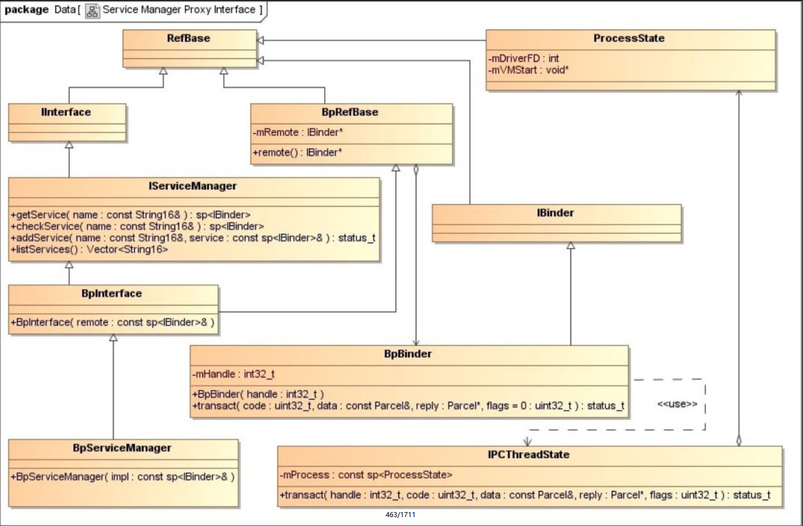

## 5.7　Service Manager代理对象的获取过程
Service组件在启动时，需要将自己注册到Service Manager中；而Client组件在使用Service组件提供的服务之前，也需要通过Service Manager来获得Serivce组件的代理对象。由于Service Manager本身也是一个Service组件，因此，其他的Service组件和Client组件在使用它提供的服务之前，也需要先获得它的代理对象。作为一个特殊的Service组件，Service Manager代理对象的获取过程与其他的Service代理对象的获取过程有所不同，在本节中，我们将详细分析这个过程。

Service Manager代理对象的类型为BpServiceManager，它用来描述一个实现了IServiceManager接口的Client组件。根据前面5.2小节中的图5-16所描述的Client组件实现原理图，我们将图中的IXXXXXX接口和BpXXXXXX类直接替换为IServiceManager接口和BpServiceManager类，就可以得到Service Manager代理对象的类关系图，如图5-21所示。



IServiceManager接口定义了四个成员函数getService、checkService、addService和listService，其中，getService和checkService用来获取Service组件的代理对象，addService用来注册Service组件，listService用来获取注册在Service Manager中的Service组件名称列表。

对于一般的Service组件来说，Client进程首先要通过Binder驱动程序来获得它的一个句柄值，然后才可以根据这个句柄创建一个Binder代理对象，最后将这个Binder代理对象封装成一个实现了特定接口的代理对象。由于Service Manager的句柄值恒为0，因此，获取它的一个代理对象的过程就省去了与Binder驱动程序交互的过程。

Android系统在应用程序框架层的Binder库中提供了一个函数defaultServiceManager来获得一个Service Manager代理对象。例如，在前面5.3小节中介绍的应用程序FregClient调用函数defaultServiceManager来获得一个Service Manager代理对象的代码片段如下所示。

`external/binder/client/FregClient.cpp`
```cpp

```
函数defaultServiceManager的实现如下所示。

`frameworks/base/libs/binder/IServiceManager.cpp`
```cpp
01 sp<IServiceManager> defaultServiceManager()
02 {
03     if (gDefaultServiceManager != NULL) return gDefaultServiceManager;
04     
05     {
06         AutoMutex _l(gDefaultServiceManagerLock);
07         if (gDefaultServiceManager == NULL) {
08             gDefaultServiceManager = interface_cast<IServiceManager>(
09                 ProcessState::self()->getContextObject(NULL));
10         }
11     }
12     
13     return gDefaultServiceManager;
14 }
```
Binder库定义了gDefaultServiceManager和gDefaultServiceManagerLock两个全局变量，如下所示。

`frameworks/base/libs/binder/Static.cpp`
```cpp
Mutex gDefaultServiceManagerLock;
sp<IServiceManager> gDefaultServiceManager;
```
全局变量gDefaultServiceManager是一个类型为IServiceManager的强指针，它指向进程内的一个BpServiceManager对象，即一个Service Manager代理对象；而全局变量gDefaultServiceManagerLock是一个互斥锁，是用来保证一个进程至多只有一个Service Manager代理对象的。结合锁机制来保证对象在进程中的唯一性，这是单例设计模式的经典实现。

在函数defaultServiceManager中，第3行首先检查全局变量gDefaultServiceManager是否不等于NULL。如果是，那么就说明Binder库已经为进程创建过一个Service Manager代理对象了，因此，第3行代码就可以直接将它返回给调用者；否则，第8行和第9行代码就创建一个Service Manager代理对象，并且将它保存在全局变量gDefaultServiceManager中，最后第13行将它返回给调用者。

第8行和第9行代码包含了三次函数调用。第一次是调用ProcessState类的静态成员函数self获得进程内的一个ProcessState对象，第二次是调用前面获得的ProcessState对象的成员函数getContextObject创建一个Binder代理对象，第三次是调用模板函数interface_cast<IServiceManager>将前面获得的Binder代理对象封装成一个Service Manager代理对象。下面我们就分别分析这三个函数的实现。

ProcessState类的静态成员函数self的实现如下所示。

`frameworks/base/libs/binder/ProcessState.cpp`
```cpp
1 sp<ProcessState> ProcessState::self()
2 {
3     if (gProcess != NULL) return gProcess;
4     
5     AutoMutex _l(gProcessMutex);
6     if (gProcess == NULL) gProcess = new ProcessState;
7     return gProcess;
8 }
```
在Binder库中，定义了gProcess和gProcessMutex两个全局变量，如下所示。

`frameworks/base/libs/binder/Static.cpp`
```cpp
Mutex gProcessMutex;
sp<ProcessState> gProcess;
```
全局变量gProcess是一个类型为ProcessState的强指针，它指向进程内的一个ProcessState对象；而全局变量gProcessMutex是一个互斥锁，是用来保证一个进程至多只有一个ProcessState对象的，这同样是一个单例设计模式。

在ProcessState类的静态成员函数self中，第3行首先检查全局变量gProcess是否不等于NULL。如果是，那么就说明Binder库已经为进程创建过一个ProcessState了，因此，第3行代码就可以直接将它返回给调用者；否则，第6行代码就直接创建一个ProcessState对象，并且将它保存在全局变量gProcess中，最后第7行将它返回给调用者。

进程中的ProcessState对象的创建过程如下所示。

`frameworks/base/libs/binder/ProcessState.cpp`
```cpp
01 ProcessState::ProcessState()
02     : mDriverFD(open_driver())
03     , mVMStart(MAP_FAILED)
04     ......
05 {
06     if (mDriverFD >= 0) {
07         ......
08         // mmap the binder, providing a chunk of virtual address space to receive transactions.
09         mVMStart = mmap(0, BINDER_VM_SIZE, PROT_READ, MAP_PRIVATE | MAP_NORESERVE, mDriverFD, 0);
10         ......
11     }
12     ......
13 }
```
在ProcessState类的构造函数中，第2行首先调用函数open_driver打开设备文件/dev/binder，并且将得到的文件描述符保存在成员变量mDriverFD中。接着第9行调用函数mmap把设备文件/dev/binder映射到进程的地址空间，映射的地址空间大小为BINDER_VM_SIZE，它的定义如下所示。

`frameworks/base/libs/binder/ProcessState.cpp`
```cpp
#define BINDER_VM_SIZE ((1*1024*1024) - (4096 *2))
```
从前面5.1.4小节的内容可以知道，将设备文件/dev/binder映射到进程的地址空间实际上是请求Binder驱动程序为进程分配内核缓冲区，这个内核缓冲区的大小被Binder库默认设置为1016Kb。

接下来，我们重点分析函数open_driver的实现，它的定义如下所示。

`frameworks/base/libs/binder/ProcessState.cpp`
```cpp
01 static int open_driver()
02 {
03     ......
04     int fd = open("/dev/binder", O_RDWR);
05     if (fd >= 0) {
06         fcntl(fd, F_SETFD, FD_CLOEXEC);
07         .....
08         status_t result = ioctl(fd, BINDER_VERSION, &vers);
09         ......
10         
11         if (result != 0 || vers != BINDER_CURRENT_PROTOCOL_VERSION) {
12             LOGE("Binder driver protocol does not match user space protocol!");
13             close(fd);
14             fd = -1;
15         }
16         
17         ......
18         size_t maxThreads = 15;
19         result = ioctl(fd, BINDER_SET_MAX_THREADS, &maxThreads);
20         ......
21 
22     } else {
23         LOGW("Opening '/dev/binder' failed: %s\n", strerror(errno));
24     }
25     return fd;
26 }
```
第5行首先调用函数open打开设备文件/dev/binder，接着第8行使用IO控制命令BINDER_VERSION来获得Binder驱动程序的版本号，最后第19行使用IO控制命令BINDER_SET_MAX_THREADS来通知Binder驱动程序，它最多可以请求进程创建15个Binder线程来处理进程间通信请求。

获得了进程的ProcessState对象之后，回到函数defaultServiceManager中，接着就调用它的成员函数getContextObject来创建一个Binder代理对象。

ProcessState类的成员函数getContextObject的实现如下所示。

`frameworks/base/libs/binder/ProcessState.cpp`
```cpp
1 sp<IBinder> ProcessState::getContextObject(const sp<IBinder>& caller)
2 {
3     if (supportsProcesses()) {
4         return getStrongProxyForHandle(0);
5     } else {
6         return getContextObject(String16("default"), caller);
7     }
8 }
```
第3行调用成员函数supportsProcesses来检查系统是否支持Binder进程间通信机制，即检查进程是否成功地打开了设备文件/dev/binder，它的实现如下所示。

`frameworks/base/libs/binder/ProcessState.cpp`
```cpp
bool ProcessState::supportsProcesses() const
{
    return mDriverFD >= 0;
}
```
回到ProcessState类的成员函数getContextObject中，假设系统是支持Binder进程间通信机制的，因此，它接着就会调用成员函数getStrongProxyForHandle来创建一个Binder代理对象，它的实现如下所示。

`frameworks/base/libs/binder/ProcessState.cpp`
```cpp
01 sp<IBinder> ProcessState::getStrongProxyForHandle(int32_t handle)
02 {
03     sp<IBinder> result;
04 
05     AutoMutex _l(mLock);
06 
07     handle_entry* e = lookupHandleLocked(handle);
08 
09     if (e != NULL) {
10         // We need to create a new BpBinder if there isn't currently one, OR we
11         // are unable to acquire a weak reference on this current one.  See comment
12         // in getWeakProxyForHandle() for more info about this.
13         IBinder* b = e->binder;
14         if (b == NULL || !e->refs->attemptIncWeak(this)) {
15             b = new BpBinder(handle); 
16             e->binder = b;
17             if (b) e->refs = b->getWeakRefs();
18             result = b;
19         } else {
20             // This little bit of nastyness is to allow us to add a primary
21             // reference to the remote proxy when this team doesn't have one
22             // but another team is sending the handle to us.
23             result.force_set(b);
24             e->refs->decWeak(this);
25         }
26     }
27 
28     return result;
29 }
```
从前面的调用过程可以知道，参数handle的值等于0，表示要创建的Binder代理对象的句柄值等于0，即要创建一个Service Manager代理对象。

在前面的5.4.4小节中介绍Binder代理对象的生命周期时提到，Binder库为每一个进程维护了一个handle_entry类型的Binder代理对象列表，它以句柄值作为关键字来维护进程内部所有的Binder代理对象。这个Binder代理对象列表保存在ProcessState类的成员变量mHandleToObject中，它的定义如下所示。

`frameworks/base/include/binder/ProcessState.h`
```cpp
01 class ProcessState : public virtual RefBase
02 {
03             ......
04             
05 private:
06             ......
07             struct handle_entry {
08                 IBinder* binder;
09                 RefBase::weakref_type* refs;
10             };
11 
12             ......
13             Vector<handle_entry>mHandleToObject;
14             
15             ......
16 };
```
每一个Binder代理对象都使用一个handle_entry结构体来描述。结构体handle_entry的两个成员变量binder和refs分别指向一个Binder代理对象，以及它内部的一个弱引用计数对象。

回到ProcessState类的成员函数getContextObject中，第7行首先调用成员函数lookupHandleLocked来检查成员变量mHandleToObject中是否已经存在一个与句柄值handle对应的handle_entry结构体，它的实现如下所示。

`frameworks/base/libs/binder/ProcessState.cpp`
```cpp
01 ProcessState::handle_entry* ProcessState::lookupHandleLocked(int32_t handle)
02 {
03     const size_t N=mHandleToObject.size();
04     if (N <= (size_t)handle) {
05         handle_entry e;
06         e.binder = NULL;
07         e.refs = NULL;
08         status_t err = mHandleToObject.insertAt(e, N, handle+1-N);
09         if (err < NO_ERROR) return NULL;
10     }
11     return &mHandleToObject.editItemAt(handle);
12 }
```
一个Binder代理对象的句柄值同时也是它在列表mHandleToObject中的索引值。第4行首先检查句柄值handle的值是否大于或者等于列表mHandleToObject的大小。如果是，即第4行的if语句为true，那么mHandleToObject列表里面就不存在一个与句柄值handle对应的handle_entry结构体，接下来第5行到第8行代码就会在列表mHandleToObject的第N到第（handle+1-N）个位置上分别插入一个handle_entry结构体，最后第11行就可以将与句柄值handle对应的handle_entry结构体返回给调用者。

**注意**
> 这些插入的handle_entry结构体与Binder代理对象都还没有关联起来，因此，它们的成员变量binder和refs均被初始化为NULL。如果句柄值handle的值小于列表mHandleToObject的大小，那么第11行就可以直接将与它对应的一个handle_entry结构体返回给调用者了。

回到ProcessState类的成员函数getContextObject中，第7行将前面从Binder代理对象列表中获得的handle_entry结构体保存在变量e中。

如果handle_entry结构体e的成员变量binder的值等于NULL，即第14行的if语句为true，就说明进程尚未为句柄值handle创建过Binder代理对象，因此，第15行就会根据句柄值handle创建一个Binder代理对象，并且将它保存在handle_entry结构体e的成员变量binder中。如果handle_entry结构体e的成员变量binder的值不为NULL，即它已经指向了一个Binder代理对象，就需要继续检查这个Binder代理对象是否还活着，方法是调用它的弱引用计数对象的成员函数attemptIncWeak来尝试增加它的弱引用计数。由于Binder代理对象（即BpBinder对象）的生命周期是受弱引用计数控制的，因此如果不能成功增加它的弱引用计数，那么就说明它已经被销毁了。在这种情况下，也需要重新为句柄值handle创建一个Binder代理对象。

如果handle_entry结构体e的成员变量binder的值不等于NULL，并且调用它的成员变量refs的成员函数attemptIncWeak能够成功地增加与它对应的一个Binder代理对象的弱引用计数，即第14行的if语句为false，那么就说明在进程中已经有一个Binder代理对象与句柄值handle相对应，并且这个Binder代理对象是有效的，因此，可以直接将它返回给调用者。

**注意**
> 函数在将这个Binder代理对象返回给调用者之前，第24行会减少它的弱引用计数，因为前面第14行增加了它的弱引用计数。

获得了与句柄值0对应的Binder代理对象之后，回到函数defaultServiceManager中，接着就调用模板函数interface_cast<IServiceManager>将这个Binder代理对象封装为一个Service Manager代理对象。

模板函数interface_cast<IServiceManager>的实现如下所示。

`frameworks/base/include/binder/IInterface.h`
```cpp
1 template<typename INTERFACE>
2 inline sp<INTERFACE> interface_cast(const sp<IBinder>& obj)
3 {
4     return INTERFACE::asInterface(obj);
5 }
```
模板参数INTERFACE指向IServiceManager接口，因此，它实际上是调用IServiceManager接口的成员函数asInterface，将一个句柄值为0的Binder代理对象封装为一个Service Manager代理对象。

IServiceManager接口的成员函数asInterface是通过宏IMPLEMENT_META_INTERFACE来定义的，如下所示。

`frameworks/base/libs/binder/IServiceManager.h`
```cpp
IMPLEMENT_META_INTERFACE(ServiceManager, "android.os.IServiceManager");
```
将宏IMPLEMENT_META_INTERFACE展开，就可以得到IServiceManager接口的成员函数asInterface，如下所示。

`frameworks/base/libs/binder/IServiceManager.h`
```cpp
```
从前面的调用过程可以知道，参数obj指向一个Binder代理对象，即一个BpBinder对象，它的成员函数queryLocalInterface的返回值为NULL。因此，最后会执行第10行代码创建一个Service Manager代理对象，即一个BpServiceManager对象，并且将它的IServiceManager接口返回给调用者。

至此，一个Service Manager代理对象的获取过程就分析完成了。有了这个Service Manager代理对象之后，Service组件就可以在启动的过程中使用它的成员函数addService将自己注册到Service Manager中，而Client组件就可以使用它的成员函数getService来获得一个指定名称的Service组件的代理对象了。在接下来的5.8和5.9小节中，我们继续分析Service组件的启动过程及其代理对象的获取过程。

