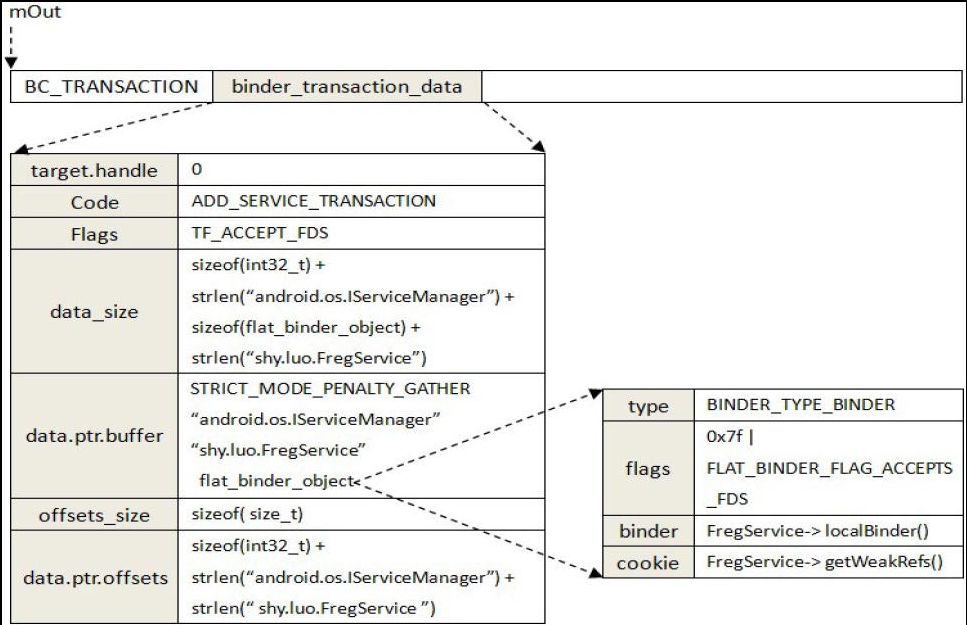

## 5.8　 Service 组件的启动过程
 `Service` 组件是在 `Server` 进程中运行的。 `Service` 进程在启动时，会首先将它里面的 `Service` 组件注册到 `Service Manager` 中，接着再启动一个 `Binder` 线程池来等待和处理 `Client` 进程的通信请求。在本节中，我们将以 `5.3` 小节介绍的 `Service` 组件 `FregService` 为例，详细分析一个 `Service` 组件的启动过程。

前面 `5.2` 小节的图 `5-15` 描述了 `Service` 组件的实现原理，我们将图中的 `IXXXXXX` 接口及 `BnXXXXXX` 和 `XXXXXX` 类直接替换为 `IFregService` 接口及 `BnFregService` 和 `FregService` 类，就可以得到 `Service` 组件 `FregService` 的类关系图，如图 `5-22` 所示。


 `Service` 组件 `FregService` 是运行在 `Freg Server` 进程中的， `FregServer` 进程的启动过程如下所示。

```cpp
int main(int argc, char* argv[]){
    FregService::instantiate();
    ProcessState::self()->startThreadPool();
    IPCThreadState::self()->joinThreadPool();
    return 0;
}
```
第 `3` 行调用 `FregService` 类的静态成员函数 `instantiate` 创建一个 `FregService` 组件，并且将它注册到 `Service Manager` 中；接着第 `5` 行启动了一个 `Binder` 线程池；最后第 `6` 行将主线程也加入到这个 `Binder` 线程池中去等待和处理 `Client` 进程的通信请求。
在接下来的内容中，我们先分析 `Service` 组件 `FregService` 的注册过程，然后再分析 `FregServer` 进程是如何启动一个 `Binder` 线程池来等待和处理 `Client` 进程的通信请求的。

### 5.8.1　注册 `Service` 组件
在将 `Service` 组件注册到 `Service Manager` 之前，我们首先要获得一个 `Service Manager` 代理对象，然后才可以通过它将该 `Service` 组件注册到 `Service Manager` 中。

以 `Service` 组件 `FregService` 的注册过程为例， `FregService` 类的静态成员函数 `instantiate` 首先调用 `Binder` 库提供的函数 `defaultServiceManager` 来获得一个 `Service Manager` 代理对象，然后再调用它的成员函数 `addService` 将该 `Service` 组件 `FregService` 注册到 `Service Manager` 中，它的实现如下所示。

```cpp
    static void instantiate(){
        defaultServiceManager()->addService(String16(FREG_SERVICE), new FregService());
    }
```
函数 `defaultServiceManager` 返回的 `Service Manager` 代理对象的类型为 `BpServiceManager` ，因此， `FregService` 类的静态成员函数 `instantiate` 实际上是调用了 `BpServiceManager` 类的成员函数 `addService` 来注册 `Service` 组件 `FregService` ，它的实现如下所示。

`frameworks/base/libs/binder/IServiceManager.cpp`
```cpp
01 class BpServiceManager : public BpInterface<IServiceManager>
02 {
03 public:
04     ......
05 
06     virtual status_t addService(const String16& name, const sp<IBinder>& service)
07     {
08         Parcel data, reply;
09         data.writeInterfaceToken(IServiceManager::getInterfaceDescriptor());
10         data.writeString16(name);
11         data.writeStrongBinder(service);
12         status_t err = remote()->transact(ADD_SERVICE_TRANSACTION, data, &reply);
13         return err == NO_ERROR ? reply.readExceptionCode() : err;
14     }
15 
16     ......
17 };
```
 `Client` 进程和 `Server` 进程的一次进程间通信过程可以划分为如下五个步骤。

1. `Client` 进程将进程间通信数据封装成一个 `Parcel` 对象，以便可以将进程间通信数据传递给 `Binder` 驱动程序。

2. `Client` 进程向 `Binder` 驱动程序发送一个 `BC_TRANSACTION` 命令协议。 `Binder` 驱动程序根据协议内容找到目标 `Server` 进程之后，就会向 `Client` 进程发送一个 `BR_TRANSACTION_COMPLETE` 返回协议，表示它的进程间通信请求已经被接受。 `Client` 进程接收到 `Binder` 驱动程序发送给它的 `BR_TRANSACTION_COMPLETE` 返回协议，并且对它进行处理之后，就会再次进入到 `Binder` 驱动程序中去等待目标 `Server` 进程返回进程间通信结果。

3. `Binder` 驱动程序在向 `Client` 进程发送 `BR_TRANSACTION_COMPLETE` 返回协议的同时，也会向目标 `Server` 进程发送一个 `BR_TRANSACTION` 返回协议，请求目标 `Server` 进程处理该进程间通信请求。

4. `Server` 进程接收到 `Binder` 驱动程序发来的 `BR_TRANSACTION` 返回协议，并且对它进行处理之后，就会向 `Binder` 驱动程序发送一个 `BC_REPLY` 命令协议。 `Binder` 驱动程序根据协议内容找到目标 `Client` 进程之后，就会向 `Server` 进程发送一个 `BR_TRANSACTION_COMPLETE` 返回协议，表示它返回的进程间通信结果已经收到了。 `Server` 进程接收到 `Binder` 驱动程序发送给它的 `BR_TRANSACTION_COMPLETE` 返回协议，并且对它进行处理之后，一次进程间通信过程就结束了。接着它会再次进入到 `Binder` 驱动程序中去等待下一次进程间通信请求。

5. `Binder` 驱动程序向 `Server` 进程发送 `BR_TRANSACTION_COMPLETE` 返回协议的同时，也会向目标 `Client` 进程发送一个 `BR_REPLY` 返回协议，表示 `Server` 进程已经处理完成它的进程间通信请求了，并且将进程间通信结果返回给它。

**注意**
> 在第 `2` 步和第 `4` 步中，为什么 `Binder` 驱动程序要发送一个 `BR_TRANSACTION_COMPLETE` 返回协议来响应 `Client` 进程和 `Server` 进程的 `BC_TRANSACTION` 与 `BC_REPLY` 命令协议呢？ `Client` 进程和 `Server` 进程其实并不需要对 `BR_TRANSACTION_COMPLETE` 返回协议做特殊的处理。这样做其实是为了让 `Client` 进程和 `Server` 进程在执行进程间通信的过程中，有机会返回到用户空间去做其他事情，从而增加它们的并发处理能力。

在本节接下来的内容中，我们将根据上述五个步骤来分析 `BpServiceManager` 类的成员函数 `addService` 的实现。

#### 5.8.1.1　封装进程间通信数据
在 `BpServiceManager` 类的成员函数 `addService` 中，第 `9` 行到第 `11` 行代码分别将进程间通信数据写入到一个 `Parcel` 对象 `data` 中，然后将 `Parcel` 对象 `data` 的内容传递给 `Binder` 驱动程序。

第 `9` 行 首先调用 `Parcel` 对象 `data` 的成员函数 `writeInterfaceToken` 写入一个 `Binder` 进程间通信请求头，它的实现如下所示。

`frameworks/base/libs/binder/Parcel.cpp`
```cpp
1 status_t Parcel::writeInterfaceToken(const String16& interface)
2 {
3     writeInt32(IPCThreadState::self()->getStrictModePolicy() |
4                STRICT_MODE_PENALTY_GATHER);
5     // currently the interface identification token is just its name as a string
6     return writeString16(interface);
7 }
```
`Binder` 进程间通信请求头由两部分内容组成。第一部分内容是一个整数值，用来描述一个 `Strict Mode Policy` ；第二部分内容是一个字符串，用来描述所请求服务的接口描述符。

在 `Android` 应用程序中，我们可以为线程定义一些 `Strict Mode Policy` 。如果线程在运行过程中违反了这些预先定义好的 `Strict Mode Policy` ，那么系统就会发出警告。这样开发人员就方便调试应用程序的功能，并且可以对它们进行优化。例如，我们可以禁止在应用程序的 `UI` 线程中执行写磁盘操作，因为写磁盘是一个耗时的操作，会影响用户体验。这时候我们就可以为应用程序的 `UI` 线程定义一个不允许写磁盘的 `Strict Mode Policy` 。当开发人员不小心在应用程序的 `UI` 线程中执行了一个写磁盘操作时，系统就会发出警告，这样开发人员就可以根据这个警告来对应用程序进行优化。

当 `Client` 进程中的一个线程将一个进程间通信请求发送给 `Server` 进程的某一个线程处理时，其实是要求这个 `Server` 线程代替它来执行某一个操作，因此， `Binder` 进程间通信机制就会尽量地将 `Server` 线程模拟成 `Client` 线程来执行这个操作，这样就要求将 `Client` 线程的某些属性设置到 `Server` 线程中， `Strict Mode Policy` 便是其中的一个属性。因此，第 `3` 行和第 `4` 行代码首先获得当前线程的 `Strict Mode Policy` ，然后将它与宏 `STRICT_MODE_PENALTY_GATHER` 执行一个按位或操作，最后将得到的结果写入到 `Parcel` 对象 `data` 中去传递给目标 `Server` 线程。 `STRICT_MODE_PENALTY_GATHER` 是用来描述一个线程的 `Strict Mode Policy` 的，它用于 `Binder` 进程间通信机制，表示 `Server` 线程在处理进程间通信请求时，即使违反了预先设定的 `Strict Mode Policy` ，系统也不应该发出警告，而是把这些警告收集起来，最后统一发送给 `Client` 线程来处理。

第 `6` 行将一个服务接口描述符写入到 `Parcel` 对象 `data` 中。 `Server` 组件在处理一个进程间通信请求时，会将这个服务接口的描述符读取出来，并且验证它是否是一个合法的服务接口描述符，即是否是自己所实现的服务接口的描述符。如果不是，则说明这是一个非法的进程间通信请求。

回到 `BpServiceManager` 类的成员函数 `addService` 中，接着第 `10` 行调用 `Parcel` 对象 `data` 的成员函数 `writeString16` 写入将要注册的 `Service` 组件的名称。

第 `11` 行调用 `Parcel` 对象 `data` 的成员函数 `writeStrongBinder` 将要注册的 `Service` 组件封装成一个 `flat_binder_object` 结构体，然后传递给 `Binder` 驱动程序。将一个 `Service` 组件封装成一个 `flat_binder_object` 结构体是 `Binder` 进程间通信过程的一个重要步骤，接下来我们就着重分析这个过程。

`Parcel` 类的成员函数 `writeStrongBinder` 的实现如下所示。

`frameworks/base/libs/binder/Parcel.cpp`
```cpp
1 status_t Parcel::writeStrongBinder(const sp<IBinder>& val)
2 {
3     return flatten_binder(ProcessState::self(), val, this);
4 }
```
第 `3` 行调用全局函数 `flatten_binder` 将一个 `Service` 组件封装成一个 `flat_binder_object` 结构体，它的实现如下所示。

`frameworks/base/libs/binder/Parcel.cpp`
```cpp
01 status_t flatten_binder(const sp<ProcessState>& proc,
02     const sp<IBinder>& binder, Parcel* out)
03 {
04     flat_binder_object obj;
05     
06     obj.flags = 0x7f | FLAT_BINDER_FLAG_ACCEPTS_FDS;
07     if (binder != NULL) {
08         IBinder *local = binder->localBinder();
09         if (!local) {
10             ......
11         } else {
12             obj.type = BINDER_TYPE_BINDER;
13             obj.binder = local->getWeakRefs();
14             obj.cookie = local;
15         }
16     } else {
17         ......
18     }
19     
20     return finish_flatten_binder(binder, obj, out);
21 }
```
第 `4` 行首先定义一个 `flat_binder_object` 结构体 `obj` ，接着第 `6` 行将它的标志值设置为 `(0x7f｜FLAT_BINDER_FLAG_ACCEPTS_FDS)` 。其中， `0x7f` 用来描述将要注册的 `Service` 组件在处理一个进程间通信请求时，它所使用的 `Server` 线程的优先级不能低于 `0x7f` ；而 `FLAT_BINDER_FLAG_ACCEPTS_FDS` 表示可以将包含文件描述符的进程间通信数据传递给将要注册的 `Service` 组件处理。

从前面的调用过程可以知道，参数 `binder` 指向的是一个 `FregService` 组件，它继承了 `BBinder` 类。 `BBinder` 类是用来描述一个 `Binder` 本地对象的，它的成员函数 `localBinder` 用来返回一个 `Binder` 本地对象接口。由于 `FregService` 组件是一个 `Binder` 本地对象，因此，第 `8` 行得到的变量 `local` 的值不等于 `NULL` 。接下来第 `12` 行到第 `14` 行代码就将 `flat_binder_object` 结构体 `obj` 设置为一个 `BINDER_TYPE_BINDER` 类型的 `Binder` 对象，并且将它的成员变量 `cookie` 和 `ptr` 的值分别设置为 `Binder` 本地对象 `local` 的地址值及其内部的一个弱引用计数对象的地址值。

最后，第 `20` 行调用全局函数 `finish_flatten_binder` 将 `flat_binder_object` 结构体 `obj` 写入到 `Parcel` 对象 `out` 中，它的实现如下所示。

`frameworks/base/libs/binder/Parcel.cpp`
```cpp
1 inline static status_t finish_flatten_binder(
2     const sp<IBinder>& binder, const flat_binder_object& flat, Parcel* out)
3 {
4     return out->writeObject(flat, false);
5 }
```
第 `4` 行调用 `Parcel` 对象 `out` 的成员函数 `writeObject` 将 `flat_binder_object` 结构体 `flat` 写入到内部。

`Parcel` 类的成员函数 `writeObject` 的实现如下所示。

`frameworks/base/libs/binder/Parcel.cpp`
```cpp
01 status_t Parcel::writeObject(const flat_binder_object& val, bool nullMetaData)
02 {
03     const bool enoughData = (mDataPos+sizeof(val)) <= mDataCapacity;
04     const bool enoughObjects = mObjectsSize < mObjectsCapacity;
05     if (enoughData && enoughObjects) {
06 restart_write:
07         *reinterpret_cast<flat_binder_object*>(mData+mDataPos) = val;
08         
09         // Need to write meta-data?
10         if (nullMetaData || val.binder != NULL) {
11             mObjects[mObjectsSize] = mDataPos;
12             acquire_object(ProcessState::self(), val, this);
13             mObjectsSize++;
14         }
15         
16         // remember if it's a file descriptor
17         if (val.type == BINDER_TYPE_FD) {
18             mHasFds = mFdsKnown = true;
19         }
20 
21         return finishWrite(sizeof(flat_binder_object));
22     }
23 
24     if (!enoughData) {
25         const status_t err = growData(sizeof(val));
26         if (err != NO_ERROR) return err;
27     }
28     if (!enoughObjects) {
29         size_t newSize = ((mObjectsSize+2)*3)/2;
30         size_t* objects = (size_t*)realloc(mObjects, newSize*sizeof(size_t));
31         if (objects == NULL) return NO_MEMORY;
32         mObjects = objects;
33         mObjectsCapacity = newSize;
34     }
35     
36     goto restart_write;
37 }
```
`Parcel` 类内部有 `mData` 和 `mObjects` 两个缓冲区，其中， `mData` 是一个数据缓冲区，它里面的内容可能包含有整数、字符串或者 `Binder` 对象，即 `flat_binder_object` 结构体； `mObjects` 是一个偏移数组，它保存了在数据缓冲区 `mData` 中的所有 `Binder` 对象的位置。 `Binder` 驱动程序就是通过这个偏移数组找到进程间通信数据中的 `Binder` 对象的，以便对它们进行特殊处理。

`Parcel` 类的成员变量 `mDataPos` 记录了数据缓冲区 `mData` 下一个用来写入数据的位置，而成员变量 `mDataCapacity` 则记录了数据缓冲区 `mData` 的总大小，因此，第 `3` 行代码用来判断数据缓冲区 `mData` 是否还有足够的空间来写入一个 `Binder` 对象。

`Parcel` 类的成员变量 `mObjectsSize` 记录了偏移数组 `mObjects` 下一个用来写入数据的位置，而成员变量 `mObjectsCapacity` 则记录了偏移数组 `mObjects` 的总大小，因此，第 `4` 行代码用来判断偏移数组 `mObjects` 是否还有足够的空间来写入一个 `Binder` 对象的偏移位置。

如果数据缓冲区 `mData` 和偏移数组 `mObjects` 还有足够的空间来写入一个 `Binder` 对象，即第 `5` 行的 `if` 语句为 `true` ，那么第 `7` 行到第 `14` 行代码就将参数 `val` 所描述的 `Binder` 对象写入到数据缓冲区 `mData` 和偏移数组 `mObjects` 中。

如果数据缓冲区 `mData` 或者偏移数组 `mObjects` 的空间不足以用来写入一个 `Binder` 对象，即第 `5` 行的 `if` 语句为 `false` ，那么第 `24` 行到第 `34` 行代码就会首先扩展它们的空间，然后第 `36` 行再跳转到第 `7` 行到第 `14` 行代码将参数 `val` 所描述的 `Binder` 对象写入到数据缓冲区 `mData` 和偏移数组 `mObjects` 中。

第 `17` 行判断刚才写入的 `Binder` 对象的类型是否为 `BINDER_TYPE_FD` 。如果是，那么就说明该 `Parcel` 对象的数据缓冲区中包含有文件描述符，因此，第 `18` 行将成员变量 `mHasFds` 和 `mFdsKnown` 的值设置为 `true` 。

最后，第 `21` 行调用成员函数 `finishWrite` 来调整数据缓冲区 `mData` 下一个用来写入数据的位置，即调整成员变量 `mDataPos` 的值。

至此，注册 `Service` 组件所需要的进程间通信数据都封装到一个 `Parcel` 对象中了。接下来就要使用 `BC_TRANSACTION` 命令协议将它传递给 `Binder` 驱动程序。

#### 5.8.1.2 发送和处理BC_TRANSACTION命令协议
回到 `BpServiceManager` 类的成员函数 `addService` 中，将要传递的通信数据封装到一个 `Parcel` 对象 `data` 中之后，接下来就调用内部的一个 `Binder` 代理对象的成员函数 `transact` 向 `Binder` 驱动程序发送一个 `BC_TRANSACTION` 命令协议。

在前面的 `5.1.1` 小节中介绍 `BC_TRANSACTION` 命令协议时提到， `BC_TRANSACTION` 命令协议后面跟的通信数据使用一个结构体 `binder_transaction_data` 来描述，而 `BC_TRANSACTION` 命令协议又是通过 `IO` 控制命令 `BINDER_WRITE_READ` 发送到 `Binder` 驱动程序中的。因此，在发送 `BC_TRANSACTION` 命令协议给 `Binder` 驱动程序之前，我们还需要将 `Parcel` 对象 `data` 的内容写入到一个 `binder_transaction_data` 结构体中，然后将这个 `binder_transaction_data` 结构体写入到一个 `binder_write_read` 结构体中，最后才能够通过 `IO` 控制命令 `BINDER_WRITE_READ` 将一个 `BC_TRANSACTION` 命令协议发送给 `Binder` 驱动程序处理。

`Binder` 代理对象的成员函数 `transact` 的实现如下所示。

`frameworks/base/libs/binder/BpBinder.cpp`
```cpp
01 status_t BpBinder::transact(
02     uint32_t code, const Parcel& data, Parcel* reply, uint32_t flags)
03 {
04     // Once a binder has died, it will never come back to life.
05     if (mAlive) {
06         status_t status = IPCThreadState::self()->transact(
07             mHandle, code, data, reply, flags);
08         if (status == DEAD_OBJECT) mAlive = 0;
09         return status;
10     }
11 
12     return DEAD_OBJECT;
13 }
```
从前面的调用过程可以知道，第一个参数 `code` 的值为 `ADD_SERVICE_TRANSACTION` ；第二个参数 `data` 包含了要传递给 `Binder` 驱动程序的进程间通信数据；第三个参数 `reply` 是一个输出参数，用来保存进程间通信结果；第四个参数 `flags` 用来描述这是一个同步的进程间通信请求，还是一个异步的进程间通信请求，它是一个默认参数，默认值为 `0` ，表示这是一个同步的进程间通信请求。

`Binder` 代理对象内部的成员变量 `mAlive` 用来描述该 `Binder` 代理对象所引用的 `Binder` 本地对象是否还活着。如果还活着，即它的值等于 `1` ，那么第 `6` 行和第 `7` 行才会调用当前线程的 `IPCThreadState` 对象的成员函数 `transact` 向 `Binder` 驱动程序发送一个 `BC_TRANSACTION` 命令协议；否则，第 `12` 行就直接返回一个 `DEAD_OBJECT` 给调用者，表示相应的 `Binder` 本地对象已经死亡了。

`Binder` 代理对象内部的成员变量 `mHandle` 用来描述该 `Binder` 代理对象的句柄值。由于目前 `Binder` 代理对象内部的成员变量 `mHandle` 用来描述该 `Binder` 代理对象的句柄值。由于目前正在处理的 `Binder` 代理对象指向的是一个 `Service Manager` 代理对象，因此，它的成员变量 `mHandle` 的值就等于 `0` 。

`IPCThreadState` 类的成员函数 `transact` 的实现如下所示。

`frameworks/base/libs/binder/IPCThreadState.cpp`
```cpp
01 status_t IPCThreadState::transact(int32_t handle,
02                                   uint32_t code, const Parcel& data,
03                                   Parcel* reply, uint32_t flags)
04 {
05     status_t err = data.errorCheck();
06 
07     flags |= TF_ACCEPT_FDS;
08 
09     ......
10     
11     if (err == NO_ERROR) {
12         ......
13         err = writeTransactionData(BC_TRANSACTION, flags, handle, code, data, NULL);
14     }
15     
16     ......
17     
18     if ((flags & TF_ONE_WAY) == 0) {
19         ......
20         if (reply) {
21             err = waitForResponse(reply);
22         } else {
23             ......
24         }
25         ......
26     } else {
27         err = waitForResponse(NULL, NULL);
28     }
29     
30     return err;
31 }
```
第 `5` 行检查 `Parcel` 对象 `data` 中的进程间通信数据是否正确，第 `7` 行将参数 `flags` 的 `TF_ACCEPT_FDS` 位设置为 `1` ，表示允许 `Server` 进程在返回结果中携带文件描述符。

如果 `Parcel` 对象 `data` 中的进程间通信数据没有问题，那么第 `13` 行就会调用成员函数 `writeTransactionData` 将它的内容写入到一个 `binder_transaction_data` 结构体中。接着第 `18` 行判断参数 `flags` 的 `TF_ONE_WAY` 位是否等于 `0` 。如果是，那么就说明这是一个同步的进程间通信请求，这时候如果用来保存通信结果的 `Parcel` 对象 `reply` 不等于 `NULL` ，那么第 `21` 行就调用成员函数 `waitForResponse` 向 `Binder` 驱动程序发送一个 `BC_TRANSACTION` 命令协议。

假设第 `11` 行、第 `18` 行和第 `20` 行的 `if` 语句均为 `true` ，接下来我们就分别分析 `IPCThreadState` 类的成员函数 `writeTransactionData` 和 `waitForResponse` 的实现。

`IPCThreadState` 类的成员函数 `writeTransactionData` 的实现如下所示。

`frameworks/base/libs/binder/IPCThreadState.cpp`
```cpp
01 status_t IPCThreadState::writeTransactionData(int32_t cmd, uint32_t binderFlags,
02     int32_t handle, uint32_t code, const Parcel& data, status_t* statusBuffer)
03 {
04     binder_transaction_data tr;
05 
06     tr.target.handle = handle;
07     tr.code = code;
08     tr.flags = binderFlags;
09     
10     const status_t err = data.errorCheck();
11     if (err == NO_ERROR) {
12         tr.data_size = data.ipcDataSize();
13         tr.data.ptr.buffer = data.ipcData();
14         tr.offsets_size = data.ipcObjectsCount()*sizeof(size_t);
15         tr.data.ptr.offsets = data.ipcObjects();
16     } else if (statusBuffer) {
17         ......
18     } else {
19         return (mLastError = err);
20     }
21     
22     mOut.writeInt32(cmd);
23     mOut.write(&tr, sizeof(tr));
24     
25     return NO_ERROR;
26 }
```
第 `4` 行定义了一个 `binder_transaction_data` 结构体 `tr` ，接着第 `6` 行到第 `8` 行代码分别用来初始化该结构体的成员变量 `target.handle` 、 `code` 和 `flags` 。从前面的调用过程可以知道，这三个成员变量分别被初始化为 `0` 、 `ADD_SERVICE_TRANSACTION` 和 `TF_ACCEPT_FDS` 。

第 `10` 行再次确认 `Parcel` 对象 `data` 中的进程间通信数据的正确性。如果没有问题，那么第 `12` 行到第 `15` 行代码就将它内部的数据缓冲区和偏移数组设置为 `binder_transaction_data` 结构体 `tr` 的数据缓冲区和偏移数组。

最后，第 `22` 行和第 `23` 行代码将命令协议号 `cmd` ，即 `BC_TRANSACTION` ，以及 `binder_transaction_data` 结构体 `tr` 写入到 `IPCThreadState` 类的成员变量 `mOut` 所描述的一个命令协议缓冲区中，表示它有一个 `BC_TRANSACTION` 命令协议需要发送给 `Binder` 驱动程序处理。

我们通过图 `5-23` 来描述此时命令协议缓冲区 `mOut` 的内存布局。



将 `BC_TRANSACTION` 命令协议及其内容写入到 `IPCThreadState` 类内部的命令协议缓冲区之后，回到 `IPCThreadState` 类的成员函数 `transact` 中，接下来就继续调用成员函数 `waitForResponse` 向 `Binder` 驱动程序发送这个 `BC_TRANSACTION` 命令协议。

`IPCThreadState` 类的成员函数 `waitForResponse` 的实现如下所示。

`frameworks/base/libs/binder/IPCThreadState.cpp`
```cpp
01 status_t IPCThreadState::waitForResponse(Parcel *reply, status_t *acquireResult)
02 {
03     int32_t cmd;
04     int32_t err;
05 
06     while (1) {
07         if ((err=talkWithDriver()) < NO_ERROR) break;
08         ......
09     }
10     
11     ......
12     return err;
13 }
```
这个函数通过一个 `while` 循环不断地调用成员函数 `talkWithDriver` 来与 `Binder` 驱动程序进行交互，以便可以将前面准备好的 `BC_TRANSACTION` 命令协议发送给 `Binder` 驱动程序处理，并等待 `Binder` 驱动程序将进程间通信结果返回来。

`IPCThreadState` 类的成员函数 `talkWithDriver` 的实现如下所示。

`frameworks/base/libs/binder/IPCThreadState.cpp`
```cpp
01 status_t IPCThreadState::talkWithDriver(bool doReceive)
02 {
03 
04     
05     binder_write_read bwr;
06     
07     // Is the read buffer empty?
08     const bool needRead = mIn.dataPosition() >= mIn.dataSize();
09     
10     // We don't want to write anything if we are still reading
11     // from data left in the input buffer and the caller
12     // has requested to read the next data.
13     const size_t outAvail = (!doReceive || needRead) ? mOut.dataSize() : 0;
14     
15     bwr.write_size = outAvail;
16     bwr.write_buffer = (long unsigned int)mOut.data();
17 
18     // This is what we'll read.
19     if (doReceive && needRead) {
20         bwr.read_size = mIn.dataCapacity();
21         bwr.read_buffer = (long unsigned int)mIn.data();
22     } else {
23         bwr.read_size = 0;
24     }
25     
26     ......
27     
28     // Return immediately if there is nothing to do.
29     if ((bwr.write_size == 0) && (bwr.read_size == 0)) return NO_ERROR;
30     
31     bwr.write_consumed = 0;
32     bwr.read_consumed = 0;
33     status_t err;
34     
35     do {
36         ......
37         if (ioctl(mProcess->mDriverFD, BINDER_WRITE_READ, &bwr) >= 0)
38             err = NO_ERROR;
39         else
40             err = -errno;
41         ......
42     } while (err == -EINTR);
43     
44     ......
45 
46     if (err >= NO_ERROR) {
47         if (bwr.write_consumed > 0) {
48             if (bwr.write_consumed < (ssize_t)mOut.dataSize())
49                 mOut.remove(0, bwr.write_consumed);
50             else
51                 mOut.setDataSize(0);
52         }
53         if (bwr.read_consumed > 0) {
54             mIn.setDataSize(bwr.read_consumed);
55             mIn.setDataPosition(0);
56         }
57         ......
58         return NO_ERROR;
59     }
60     
61     return err;
62 }
```
在 `IPCThreadState` 类内部，除了使用缓冲区 `mOut` 来保存即将要发送给 `Binder` 驱动程序的命令协议之外，还使用缓冲区 `mIn` 来保存那些从 `Binder` 驱动程序接收到的返回协议。从前面的调用过程可以知道，缓冲区 `mOut` 里面存在一个 `BC_TRANSACTION` 命令协议。

`IPCThreadState` 类的成员函数 `talkWithDriver` 是使用 `IO` 控制命令 `BINDER_WRITE_READ` 来与 `Binder` 驱动程序交互的，因此，它需要定义一个 `binder_write_read` 结构体来指定输入缓冲区和输出缓冲区。其中，输出缓冲区保存的是进程发送给 `Binder` 驱动程序的命令协议，而输入缓冲区保存的是 `Binder` 驱动程序发送给进程的返回协议，它们分别与 `IPCThreadState` 类内部的命令协议缓冲区 `mOut` 和返回协议缓冲区 `mIn` 对应。

参数 `doReceive` 用来描述调用者是否希望 `IPCThreadState` 类的成员函数 `talkWithDriver` 只接收 `Binder` 驱动程序发送给该进程的返回协议，它是一个默认参数，默认值为 `true` 。在前面的 `5.6` 小节中介绍 `Service Manager` 的启动过程时提到，一个进程使用 `IO` 控制命令 `BINDER_WRITE_READ` 进入到 `Binder` 驱动程序，当传递的 `binder_write_read` 结构体的输出缓冲区和输入缓冲区的长度分别等于 `0` 和大于 `0` 时， `Binder` 驱动程序就不会处理进程给它发送的命令协议，而只会向该进程发送返回协议，这样进程就达到了只接收返回协议的效果。

`IPCThreadState` 类的成员函数 `talkWithDriver` 是否只接收 `Binder` 驱动程序发送给它的返回协议还受到返回协议缓冲区 `mIn` 的影响。如果上次 `Binder` 发送给进程的返回协议已经处理完成，即返回协议缓冲区 `mIn` 中的返回协议已经处理完成，那么即使参数 `doReceive` 的值为 `true` ， `IPCThreadState` 类的成员函数 `talkWithDriver` 也会向 `Binder` 驱动程序发送命令协议。因此，如果返回协议缓冲区 `mIn` 的返回协议已经处理完成，即第 `8` 行得到的变量 `needRead` 的值为 `true` ，或者调用者不是只希望接收 `Binder` 驱动程序发送给进程的返回协议，即参数 `doReceive` 的值为 `false` ，那么第 `13` 行就将变量 `outAvail` 的值设置为 `IPCThreadState` 类内部的命令协议缓冲区的长度；否则，就将它的值设置为 `0` 。接着第 `15` 行将变量 `outAvail` 的值设置为 `binder_write_read` 结构体 `bwr` 的输出缓冲区的长度 `write_size` ，并且第 `16` 行将 `IPCThreadState` 类内部的命令协议缓冲区 `mOut` 设置为 `binder_write_read` 结构体 `bwr` 的输出缓冲区 `write_buffer` 。

**注意**
> 如果变量 `outAvail` 的值等于 `0` ，那么将 `IPCThreadState` 类内部的命令协议缓冲区 `mOut` 设置为 `binder_write_read` 结构体 `bwr` 的输出缓冲区 `write_buffer` 是起不到任何效果的。

如果调用者希望接收 `Binder` 驱动程序发送给进程的返回协议，即参数 `doReceive` 的值为 `true` ，并且进程已经处理完成 `Binder` 驱动程序发送给它的返回协议，即变量 `needRead` 的值也为 `true` ，那么第 `20` 行就将 `IPCThreadState` 类内部的返回协议缓冲区 `mIn` 的长度设置为 `binder_write_read` 结构体 `bwr` 的输入缓冲区的长度 `read_size` ，并且第 `21` 行将 `IPCThreadState` 类内部的返回协议缓冲区 `mIn` 设置为 `binder_write_read` 结构体 `bwr` 的输入缓冲区 `read_buffer` ；否则，第 `23` 行就将 `binder_write_read` 结构体 `bwr` 的输入缓冲区的长度 `read_size` 设置为 `0` ，表示不要从 `Binder` 驱动程序中读取返回协议。从前面的调用过程可以知道，参数 `doReceive` 的值为默认值，即为 `true` 。假设此时 `IPCThreadState` 类内部的返回协议缓冲区 `mIn` 没有包含未处理的返回协议，那么我们得到的 `binder_write_read` 结构体 `bwr` 的输入缓冲区的长度 `read_size` 就会大于 `0` ，并且它指向了 `IPCThreadState` 类内部的返回协议缓冲区 `mIn` 。

第 `29` 行的if语句判断 `binder_write_read` 结构体 `bwr` 的输出缓冲区的长度 `write_size` 和输入缓冲区的长度 `read_size` 的值是否都等于 `0` 。如果是，就说明 `IPCThreadState` 类的成员函数 `talkWithDriver` 根本就不需要进入到 `Binder` 驱动程序，因此，函数就从第 `29` 行返回了。从前面的调用过程可以知道， `binder_write_read` 结构体 `bwr` 的输出缓冲区 `write_buffer` 中包含了一个 `BC_TRANSACTION` 命令协议，因此，它的长度 `write_size` 大于 `0` ，函数继续往下执行。

第 `35` 行到第 `42` 行的 `while` 循环使用 `IO` 控制命令 `BINDER_WRITE_READ` 来与 `Binder` 驱动程序进行交互。由于这时候传递给 `Binder` 驱动程序的 `binder_write_read` 结构体 `bwr` 的输出缓冲区的长度 `write_size` 和输入缓冲区的长度 `read_size` 均大于 `0` ，因此， `Binder` 驱动程序在处理 `IO` 控制命令 `BINDER_WRITE_READ` 时，就会首先调用函数 `binder_thread_write` 来处理进程给它发送的 `BC_TRANSACTION` 命令协议，接着又会调用函数 `binder_thread_read` 来读取 `Binder` 驱动程序给进程发送的返回协议。

`IPCThreadState` 类的成员函数 `talkWithDriver` 从 `Binder` 驱动程序中返回来之后，第 `47` 行到第 `52` 行代码将 `Binder` 驱动程序已经处理的命令协议从 `IPCThreadState` 类内部的命令协议缓冲区 `mOut` 中移除，接着第 `53` 行到第 `56` 行代码将从 `Binder` 驱动程序中读取出来的返回协议保存在 `IPCThreadState` 类内部的返回协议缓冲区 `mIn` 中。这样， `IPCThreadState` 类的成员函数 `talkWithDriver` 返回到前面调用了它的成员函数 `waitForResponse` 时，后者就可以通过解析返回协议缓冲区 `mIn` 的内容来执行相应的操作了。

接下来，我们就进入到 `Binder` 驱动程序中，分析它的函数 `binder_thread_write` 和 `binder_thread_read` 的实现。

 `Binder` 驱动程序中的函数 `binder_thread_write` 的实现如下所示。

`kernel/drivers/staging/android/binder.c`
```cpp
01 int
02 binder_thread_write(struct binder_proc *proc, struct binder_thread *thread,
03 		    void __user *buffer, int size, signed long *consumed)
04 {
05 	uint32_t cmd;
06 	void __user *ptr = buffer + *consumed;
07 	void __user *end = buffer + size;
08 
09 	while (ptr < end && thread->return_error == BR_OK) {
10 		if (get_user(cmd, (uint32_t __user *)ptr))
11 			return -EFAULT;
12 		ptr += sizeof(uint32_t);
13         ......
14 		switch (cmd) {
15         ......
16 		case BC_TRANSACTION:
17 		case BC_REPLY: {
18 			struct binder_transaction_data tr;
19 
20 			if (copy_from_user(&tr, ptr, sizeof(tr)))
21 				return -EFAULT;
22 			ptr += sizeof(tr);
23 			binder_transaction(proc, thread, &tr, cmd == BC_REPLY);
24 			break;
25 		}
26         ......
27 		}
28         
29 		*consumed = ptr - buffer;
30 	}
31 	return 0;
32 }
```
参数 `buffer` 指向进程传递给 `Binder` 驱动程序的一个 `binder_read_write` 结构体的输出缓冲区 `write_buffer` 。从前面的调用过程可以可以知道，这个输出缓冲区包含了一个 `BC_TRANSACTION` 命令协议，因此，第 `20` 行接着就将 `BC_TRANSACTION` 命令协议后面所跟的进程间通信数据读取出来，并且保存在 `binder_transaction_data` 结构体 `tr` 中。最后，第 `23` 行调用函数 `binder_transaction` 来处理进程发送给它的 `BC_TRANSACTION` 命令协议。

从这里可以看出，命令协议 `BC_REPLY` 的处理流程与命令协议 `BC_TRANSACTION` 类似，因此，为了方便描述，在本章接下来的内容中，当进程向 `Binder` 驱动程序发送一个 `BC_TRANSACTION` 或者 `BC_REPLY` 命令协议时，我们就跳过函数 `binder_thread_write` 的执行过程，而直接分析函数 `binder_transaction` 是如何处理这两个命令协议的。

函数 `binder_transaction` 负责处理命令协议 `BC_TRANSACTION` 和 `BC_REPLY` ，它的实现比较长，我们分段来阅读。

`kernel/drivers/staging/android/binder.c`
```cpp
01 static void
02 binder_transaction(struct binder_proc *proc, struct binder_thread *thread,
03 	struct binder_transaction_data *tr, int reply)
04 {
05 	struct binder_transaction *t;
06 	struct binder_work *tcomplete;
07 	size_t *offp, *off_end;
08 	struct binder_proc *target_proc;
09 	struct binder_thread *target_thread = NULL;
10 	struct binder_node *target_node = NULL;
11 	struct list_head *target_list;
12 	wait_queue_head_t *target_wait;
13 	struct binder_transaction *in_reply_to = NULL;
14     ......
15 
16 	if (reply) {
17         ......
18 	} else {
19 		if (tr->target.handle) {
20 			struct binder_ref *ref;
21 			ref = binder_get_ref(proc, tr->target.handle);
22             ......
23 			target_node = ref->node;
24 		} else {
25 			target_node = binder_context_mgr_node;
26             ......
27 		}
28 		e->to_node = target_node->debug_id;
29 		target_proc = target_node->proc;
30         ......
31 		if (!(tr->flags & TF_ONE_WAY) && thread->transaction_stack) {
32 			struct binder_transaction *tmp;
33 			tmp = thread->transaction_stack;
34             ......
35 			while (tmp) {
36 				if (tmp->from && tmp->from->proc == target_proc)
37 					target_thread = tmp->from;
38 				tmp = tmp->from_parent;
39 			}
40 		}
41 	}
42 	if (target_thread) {
43 		e->to_thread = target_thread->pid;
44 		target_list = &target_thread->todo;
45 		target_wait = &target_thread->wait;
46 	} else {
47 		target_list = &target_proc->todo;
48 		target_wait = &target_proc->wait;
49 	}
```
参数 `reply` 用来描述函数 `binder_transaction` 当前要处理的是一个 `BC_TRANSACTION` 命令协议，还是一个 `BC_REPLY` 命令协议。当它的值等于 `0` 时，就表示处理的是 `BC_TRANSACTION` 命令协议；否则，就表示处理的是 `BC_REPLY` 命令协议。从前面的调用过程可以知道，参数 `reply` 的值等于 `0` ，因此，我们重点分析函数 `binder_transaction` 处理 `BC_TRANSACTION` 命令协议的过程。

我们首先回顾一下，发出该 `BC_TRANSACTION` 命令协议的源进程和源线程分别是 `FregServer` 应用程序进程及其主线程，它们分别使用 `binder_proc` 结构体 `proc` 和 `binder_thread` 结构体 `thread` 来描述。源进程 `proc` 发送 `BC_TRANSACTION` 命令协议给 `Binder` 驱动程序的目的是要将一个 `Service` 组件 `FregService` 注册到 `Service Manager` 中，因此，在 `binder_transaction_data` 结构体 `tr` 中，它指向的目标 `Binder` 对象是一个 `Binder` 引用对象，并且它的句柄值等于 `0` 。

由于目标 `Binder` 引用对象的句柄值等于 `0` ，即第 `19` 行的 `if` 语句为 `false` ，因此，第 `25` 行就将目标 `Binder` 实体对象 `target_node` 指向一个引用了 `Service Manager` 的 `Binder` 实体对象 `binder_context_mgr_node` ；否则，第 `21` 行就首先需要调用函数 `binder_get_ref` 来获得与句柄值 `tr->target.handle` 对应的 `Binder` 引用对象，接着第 `23` 行再通过这个 `Binder` 引用对象的成员变量 `node` 来找到目标 `Binder` 实体对象 `target_node` 。

**注意**
> 引用了 `Service Manager` 的 `Binder` 实体对象 `binder_context_mgr_node` 是 `Binder` 驱动程序在 `Service Manager` 启动时创建的，具体可以参考 `5.6.2` 小节的内容。

找到了目标 `Binder` 实体对象之后，第 `29` 行就可以根据它的成员变量 `proc` 来找到目标进程 `target_proc` 。从理论上说，找到了目标进程 `target_proc` 之后， `Binder` 驱动程序就可以向它发送一个 `BR_TRANSACTION` 返回协议，以便它可以处理注册 `Service` 组件 `FregService` 的进程间通信请求。发送给目标进程 `target_proc` 的 `BR_TRANSACTION` 返回协议最终是由它的空闲 `Binder` 线程来处理的。这些空闲的 `Binder` 线程可以划分为两种类型：第一种是因为无事可做而空闲；第二种不是真的空闲，而是它在处理某个事务的过程中，需要等待其他线程来完成另外一个事务。如果 `Binder` 驱动程序能够从目标进程 `target_proc` 中挑选出一个属于第二种类型的空闲 `Binder` 线程来处理 `BR_TRANSACTION` 返回协议，并且又不会影响该线程处理它原来的事务，那么 `Binder` 驱动程序就可以充分地利用目标进程 `target_proc` 的空闲 `Binder` 线程来处理进程间通信请求了。

考虑这样一个情景。进程 `S` 中有两个 `Binder` 线程 `A` 和 `B` ，其中，线程 `B` 处于空闲状态，而线程 `A` 正在处理事务 `T1` 。线程 `A` 在处理事务 `T1` 时，需要请求进程 `T` 中的线程 `C` 来完成事务 `T2` ，这时候线程 `A` 也处于空闲状态，因为它要等待线程 `C` 完成事务 `T2` 。线程 `C` 在处理事务 `T2` 时，又需要请求进程 `S` 来完成事务 `T3` 。这时候 `Binder` 驱动程序将进程 `S` 的事务 `T3` 是分配给线程 `A` 还是线程 `B` 来处理呢？最优的方案是分配给线程 `A` 来处理，因为即使 `Binder` 驱动程序将事务 `T3` 分配给线程 `B` 来处理，线程 `A` 仍然不可以去处理其他事务，它需要等待线程 `C` 处理完成事务 `T2` ，以及线程 `B` 处理完成事务 `T3` ，然后再继续处理事务 `T1` 。

第 `31` 行到第 `40` 行代码做了一个优化，它尝试在目标进程 `target_proc` 中找到一个属于第二种类型的 `Binder` 空闲线程 `target_thread` 来处理一个 `BR_TRANSACTION` 返回协议，以便可以提高目标进程 `target_proc` 的进程间通信并发处理能力。在前面的 `5.1.1` 小节中介绍结构体 `binder_transaction` 时已经详细分析过这个优化方案了，因此，读者可以结合这段代码来重新理解结构体 `binder_transaction` 的定义。不过有一个地方需要注意，只有当前正在处理的进程间通信请求是同步的，即 `binder_transaction` 结构体 `tr` 的成员变量 `flags` 的 `TF_ONE_WAY` 位等于 `0` ，才会执行该优化方案，因为异步的进程间通信请求根本就不会涉及一个线程等待另外一个线程的问题。

如果 `Binder` 驱动程序在目标进程 `target_proc` 中找到了一个最优的目标线程 `target_thread` 来接收 `BR_TRANSACTION` 返回协议，即第 `42` 行的 `if` 语句为 `true` ，那么就 `44` 行和第 `45` 行就将变量 `target_list` 和 `target_wait` 分别指向该目标线程 `target_thread` 的 `todo` 队列和 `wait` 等待队列；否则，第 `47` 行和第 `48` 行就将变量 `target_list` 和 `target_wait` 分别指向该目标进程 `target_proc` 的 `todo` 队列和 `wait` 等待队列。有了目标 `todo` 队列 `target_list` 和目标 `wait` 等待队列 `target_wait` 之后，函数接下来就可以将一个与 `BR_TRANSACTION` 返回协议相关的待处理工作项加入到目标 `todo` 队列 `target_list` 中，以及通过目标 `wait` 等待队列 `target_Wait` 将目标进程或者目标线程唤醒来处理这个工作项。

函数 `binder_transaction` 继续往下执行。

`kernel/drivers/staging/android/binder.c`
```cpp
50 	t = kzalloc(sizeof(*t), GFP_KERNEL);
51     ......
52 
53 	tcomplete = kzalloc(sizeof(*tcomplete), GFP_KERNEL);
54     ......
55 
56 	if (!reply && !(tr->flags & TF_ONE_WAY))
57 		t->from = thread;
58 	else
59 		t->from = NULL;
60 	t->sender_euid = proc->tsk->cred->euid;
61 	t->to_proc = target_proc;
62 	t->to_thread = target_thread;
63 	t->code = tr->code;
64 	t->flags = tr->flags;
65 	t->priority = task_nice(current);
66 	t->buffer = binder_alloc_buf(target_proc, tr->data_size,
67 		tr->offsets_size, !reply && (t->flags & TF_ONE_WAY));
68     ......
69 	t->buffer->allow_user_free = 0;
70 	t->buffer->debug_id = t->debug_id;
71 	t->buffer->transaction = t;
72 	t->buffer->target_node = target_node;
73 	if (target_node)
74 		binder_inc_node(target_node, 1, 0, NULL);
75 
76 	offp = (size_t *)(t->buffer->data + ALIGN(tr->data_size, sizeof(void *)));
77 
78 	if (copy_from_user(t->buffer->data, tr->data.ptr.buffer, tr->data_size)) {
79         ......
80 		goto err_copy_data_failed;
81 	}
82 	if (copy_from_user(offp, tr->data.ptr.offsets, tr->offsets_size)) {
83         ......
84 		goto err_copy_data_failed;
85 	}
86   ......
87 	off_end = (void *)offp + tr->offsets_size;
```
第 `50` 行分配了一个 `binder_transaction` 结构体 `t` ，后面会将它封装为一个 `BINDER_WORK_TRANSACTION` 类型的工作项加入到目标 `todo` 队列 `target_list` 中，以便目标线程可以接收到一个 `BR_TRANSACTION` 返回协议。

第 `53` 行分配了一个 `binder_work` 结构体 `tcomplete` ，后面会将它封装成一个 `BINDER_WORK_TRANSACTION_COMPLETE` 类型的工作项加入到源线程 `thread` 的 `todo` 队列中，以便该线程知道可以马上返回用户空间，并且知道它之前给 `Binder` 驱动程序发送的 `BC_TRANSACTION` 命令协议已经被接收了。

第 `56` 行到第 `72` 行代码初始化前面分配的 `binder_transaction` 结构体 `t` 。如果函数正在处理的是一个 `BC_TRANSACTION` 命令协议，并且它所描述的是一个同步的进程间通信请求，那么第 `57` 行就会将 `binder_transaction` 结构体 `t` 的成员变量 `from` 指向源线程 `thread` ，以便目标进程 `target_proc` 或者目标线程 `target_thread` 处理完该进程间通信请求之后，能够找回发出该进程间通信请求的线程，最终将进程间通信结果返回给它。第 `66` 行和第 `77` 行为 `binder_transaction` 结构体 `t` 分配一个内核缓冲区，以便可以将进程间通信数据拷贝到它里面，最后传递给目标进程 `target_proc` 或者目标线程 `target_thread` 处理。

**注意**
> 这个内核缓冲区是在目标进程 `target_proc` 中分配的。第 `74` 行调用函数 `binder_inc_node` 来增加目标 `Binder` 实体对象的强引用计数，因为 `binder_transaction` 结构体 `t` 通过成员变量 `target_node` 引用了它。

第 `78` 行和第 `82` 行代码分别将 `binder_transaction_data` 结构体 `tr` 的数据缓冲区，以及偏移数组的内容拷贝到分配给 `binder_transaction` 结构体 `t` 的内核缓冲区中。

第 `76` 行和第 `88` 行代码分别计算分配给 `binder_transaction` 结构体 `t` 的内核缓冲区中用来保存偏移数组的开始位置 `offp` 和结束位置 `off_end` 。接下来，函数就根据这两个位置来遍历进程间通信数据中的 `Binder` 对象，以便可以对它们进行处理。

函数 `binder_transaction` 继续往下执行。

`kernel/drivers/staging/android/binder.c`
```cpp
089 	for (; offp < off_end; offp++) {
090 		struct flat_binder_object *fp;
091         ......
092 		fp = (struct flat_binder_object *)(t->buffer->data + *offp);
093 		switch (fp->type) {
094 		case BINDER_TYPE_BINDER:
095 		case BINDER_TYPE_WEAK_BINDER: {
096 			struct binder_ref *ref;
097 			struct binder_node *node = binder_get_node(proc, fp->binder);
098 			if (node == NULL) {
099 				node = binder_new_node(proc, fp->binder, fp->cookie);
100                 ......
101 				node->min_priority = fp->flags & FLAT_BINDER_FLAG_PRIORITY_MASK;
102 				node->accept_fds = !!(fp->flags & FLAT_BINDER_FLAG_ACCEPTS_FDS);
103 			}
104             ......
105 			ref = binder_get_ref_for_node(target_proc, node);
106             ......
107 			if (fp->type == BINDER_TYPE_BINDER)
108 				fp->type = BINDER_TYPE_HANDLE;
109 			else
110 				fp->type = BINDER_TYPE_WEAK_HANDLE;
111 			fp->handle = ref->desc;
112 			binder_inc_ref(ref, fp->type == BINDER_TYPE_HANDLE, &thread->todo);
113             ......
114 		} break;
115         ......
116 	}
117 }
```
第 `89` 行到第 `118` 行的 `for` 循环依次处理进程间通信数据中的 `Binder` 对象。如果 `Binder` 驱动程序是第一次碰到这些 `Binder` 对象，那么 `Binder` 驱动程序就会根据它们的类型分别创建一个 `Binder` 实体对象或者一个 `Binder` 引用对象；否则，就会将之前为它们创建的 `Binder` 实体对象或者 `Binder` 引用对象获取回来，以便可以增加它们的引用计数，避免它们过早地被销毁。

从前面的调用过程可以知道，进程间通信数据中包含有一个类型为 `BINDER_TYPE_BINDER` 的 `Binder` 对象，即一个 `flat_binder_object` 结构体，它用来描述即将要注册到 `Service Manager` 中的 `Service` 组件 `FregService` 。由于 `Binder` 驱动程序是第一次碰到这个 `Binder` 对象，因此，第 `97` 行调用函数 `binder_get_node` 就无法获得一个引用了它的 `Binder` 实体对象，接着第 `99` 行就会调用函数 `binder_new_node` 为它创建一个 `Binder` 实体对象 `node` 。在创建 `Binder` 实体对象 `node` 时，第 `101` 行和第 `102` 行代码就会根据从用户空间传递进来的 `flat_binder_object` 结构体的内容来设置它的最小线程优先级 `min_priority` ，以及是否接收文件描述符标志 `accept_fds` 。

在前面的 `5.6` 小节中介绍 `Service Manager` 的启动过程时，我们已经分析过函数 `binder_new_node` 的实现了，下面就简要地分析函数 `binder_get_node` 的实现，它的定义如下所示。

`kernel/drivers/staging/android/binder.c`
```cpp
01 static struct binder_node *
02 binder_get_node(struct binder_proc *proc, void __user *ptr)
03 {
04 	struct rb_node *n = proc->nodes.rb_node;
05 	struct binder_node *node;
06 
07 	while (n) {
08 		node = rb_entry(n, struct binder_node, rb_node);
09 
10 		if (ptr < node->ptr)
11 			n = n->rb_left;
12 		else if (ptr > node->ptr)
13 			n = n->rb_right;
14 		else
15 			return node;
16 	}
17 	return NULL;
18 }
```
函数 `binder_get_node` 根据一个用户空间地址 `ptr` 在目标进程 `proc` 中找到一个对应的 `Binder` 实体对象。在前面的 `5.1.1` 小节中介绍结构体 `binder_proc` 时提到，一个进程中的所有 `Binder` 实体对象都以它们的成员变量 `ptr` 作为关键字保存在进程内部的一个红黑树 `nodes` 中。因此，函数就在目标进程 `proc` 的 `Binder` 实体对象红黑树 `nodes` 中检查是否存在一个与参数 `ptr` 对应的 `Binder` 实体对象。如果存在，就将对应的 `Binder` 对象返回给调用者；否则，就返回一个 `NULL` 值给调用者。

回到函数 `binder_transaction` 中，因为函数接下来就要将即将要注册的 `Service` 组件 `FregService` 从源进程 `proc` 传递到目标进程 `target_proc` 中，因此，第 `105` 行就需要调用函数 `binder_get_ref_for_node` 在目标进程 `target_proc` 中创建一个 `Binder` 引用对象来引用该 `Service` 组件 `FregService` 。

函数 `binder_get_ref_for_node` 的实现如下所示。

`kernel/drivers/staging/android/binder.c`
```cpp
01 static struct binder_ref *
02 binder_get_ref_for_node(struct binder_proc *proc, struct binder_node *node)
03 {
04 	struct rb_node *n;
05 	struct rb_node **p = &proc->refs_by_node.rb_node;
06 	struct rb_node *parent = NULL;
07 	struct binder_ref *ref, *new_ref;
08 
09 	while (*p) {
10 		parent = *p;
11 		ref = rb_entry(parent, struct binder_ref, rb_node_node);
12 
13 		if (node < ref->node)
14 			p = &(*p)->rb_left;
15 		else if (node > ref->node)
16 			p = &(*p)->rb_right;
17 		else
18 			return ref;
19 	}
20 	new_ref = kzalloc(sizeof(*ref), GFP_KERNEL);
21     ......
22 	new_ref->proc = proc;
23 	new_ref->node = node;
24 	rb_link_node(&new_ref->rb_node_node, parent, p);
25 	rb_insert_color(&new_ref->rb_node_node, &proc->refs_by_node);
26 
27 	new_ref->desc = (node == binder_context_mgr_node) ? 0 : 1;
28 	for (n = rb_first(&proc->refs_by_desc); n != NULL; n = rb_next(n)) {
29 		ref = rb_entry(n, struct binder_ref, rb_node_desc);
30 		if (ref->desc > new_ref->desc)
31 			break;
32 		new_ref->desc = ref->desc + 1;
33 	}
34 
35 	p = &proc->refs_by_desc.rb_node;
36 	while (*p) {
37 		parent = *p;
38 		ref = rb_entry(parent, struct binder_ref, rb_node_desc);
39 
40 		if (new_ref->desc < ref->desc)
41 			p = &(*p)->rb_left;
42 		else if (new_ref->desc > ref->desc)
43 			p = &(*p)->rb_right;
44 		else
45 			BUG();
46 	}
47 	rb_link_node(&new_ref->rb_node_desc, parent, p);
48 	rb_insert_color(&new_ref->rb_node_desc, &proc->refs_by_desc);
49 	if (node) {
50 		hlist_add_head(&new_ref->node_entry, &node->refs);
51         ......
52 	} else {
53         ......
54 	}
55 	return new_ref;
56 }
```
函数 `binder_get_ref_for_node` 首先判断是否已经在目标进程 `proc` 中为 `Binder` 实体对象 `node` 创建过一个 `Binder` 引用对象。如果已经创建过，那么就会将对应的 `Binder` 引用对象返回给调用者；否则，就会首先创建一个 `Binder` 引用对象来引用该 `Binder` 实体对象 `node` ，然后再将它返回给调用者。

在前面的 `5.1.1` 小节中介绍结构体 `binder_proc` 时提到，一个进程中的所有 `Binder` 引用对象都以它们的成员变量 `node` 作为关键字保存在一个红黑树 `refs_by_node` 中。因此，第 `9` 行到第 `19` 行的 `while` 循环就在目标进程 `proc` 的红黑树 `refs_by_node` 中检查是否已经存在一个与 `Binder` 实体对象 `node` 对应的 `Binder` 引用对象。如果存在，就直接将它返回给调用者；否则，接下来第 `20` 行代码就会在目标进程 `proc` 中为 `Binder` 实体对象 `node` 创建一个 `Binder` 引用对象 `new_ref` ，并且第 `24` 行和第 `25` 行代码将它添加到目标进程 `proc` 的红黑树 `refs_by_node` 中。

第 `27` 行到第 `33` 行代码为新创建的 `Binder` 引用对象 `new_ref` 分配句柄值。第 `27` 行检查 `Binder` 实体对象 `node` 是否引用了 `Service Manager` 的 `Binder` 实体对象 `binder_context_mgr_node` 。如果是，那么就将 `Binder` 引用对象 `new_ref` 的句柄值设置为 `0` ；否则，就先将 `Binder` 引用对象 `new_ref` 的句柄值设置为 `1` ，接着第 `28` 行到第 `33` 行的 `for` 循环再根据实际情况对它进行调整。第 `28` 行到第 `33` 行的 `for` 循环实际上是在目标进程 `proc` 中找到一个未使用的最小的句柄值来作为新创建的 `Binder` 引用对象 `new_ref` 的句柄值。

**注意**
> 一个进程中的 `Binder` 引用对象除了保存在红黑树 `refs_by_node` 中之外，还以它们的句柄值作为关键字保存在另外一个红黑树 `refs_by_desc` 中。当通过函数 `rb_first` 和 `rb_next` 遍历红黑树 `refs_by_desc` 时，就会按照句柄值从小到大的顺序来获得这些 `Binder` 引用对象，因此，第 `28` 行到第 `33` 行的 `for` 循环在目标进程 `proc` 中找到的未使用的句柄值是最小的。

为新创建的 `Binder` 引用对象 `new_ref` 分配好句柄值之后，第 `36` 行到第 `46` 行的 `while` 循环再次确认前面为 `Binder` 引用对象 `new_ref` 分配的句柄值是有效的。接着第 `47` 行和第 `48` 行代码将 `Binder` 引用对象 `new_ref` 添加到目标进程 `proc` 的红黑树 `refs_by_desc` 中。最后，第 `50` 行将 `Binder` 引用对象 `new_ref` 添加到它所引用的 `Binder` 实体对象 `node` 的 `Binder` 引用对象列表中。

回到函数 `binder_transaction` 中，第 `107` 行到第 `111` 行代码将 `flat_binder_object` 结构体 `fp` 的类型修改为 `BINDER_TYPE_HANDLE` ，并且设置好它的句柄值。这是因为当 `Binder` 驱动程序将进程间通信数据传递给目标进程 `target_proc` 时，进程间通信数据中的 `Binder` 实体对象就变成了 `Binder` 引用对象，因此，就需要修改 `flat_binder_object` 结构体 `fp` 的类型。

在目标进程 `target_proc` 创建好一个 `Binder` 引用对象 `ref` 后，接着就要将它传递给该目标进程了。在传递的过程中，必须要保证 `Binder` 引用对象 `ref` 不会被销毁，因此，第 `112` 行就调用函数 `binder_inc_ref` 来增加它的引用计数。

**注意**
前面在创建 `Binder` 引用对象 `ref` 时，尚未增加过与它所引用的 `Binder` 实体对象对应的 `Binder` 本地对象的引用计数，因此，在调用函数 `binder_inc_ref` 来增加 `Binder` 引用对象 `ref` 的引用计数时，需要将源线程 `thread` 的 `todo` 队列作为第三个参数传进去，以便 `Binder` 驱动程序可以将一个类型为 `BINDER_WORK_NODE` 的工作项添加到它里面。这样，当源线程 `thread` 从 `Binder` 驱动程序返回到用户空间时，就可以增加相应的 `Binder` 本地对象，即 `Service` 组件 `FregService` 的引用计数了。有关 `Binder` 对象引用计数的内容，可以参考前面 `5.2` 小节的内容。

函数 `binder_transaction` 继续往下执行。

`kernel/drivers/staging/android/binder.c`
```cpp
119 	if (reply) {
120         ......
121 	} else if (!(t->flags & TF_ONE_WAY)) {
122 		BUG_ON(t->buffer->async_transaction != 0);
123 		t->need_reply = 1;
124 		t->from_parent = thread->transaction_stack;
125 		thread->transaction_stack = t;
126 	} else {
127 		BUG_ON(target_node == NULL);
128 		BUG_ON(t->buffer->async_transaction != 1);
129 		if (target_node->has_async_transaction) {
130 			target_list = &target_node->async_todo;
131 			target_wait = NULL;
132 		} else
133 			target_node->has_async_transaction = 1;
134 	}
135 	t->work.type = BINDER_WORK_TRANSACTION;
136 	list_add_tail(&t->work.entry, target_list);
137 	tcomplete->type = BINDER_WORK_TRANSACTION_COMPLETE;
138 	list_add_tail(&tcomplete->entry, &thread->todo);
139 	if (target_wait)
140 		wake_up_interruptible(target_wait);
141 	return;
142 
143     ......
144 }
```
如果函数 `binder_transaction` 正在处理的是一个同步的进程间通信请求，即 `binder_transaction` 结构体 `t` 的成员变量 `flags` 的 `TF_ONE_WAY` 位等于 `0` ，那么第 `123` 行就设置它的成员变量 `need_reply` 的值为 `1` ，表示它需要等待回复。接着第 `124` 行和第 `125` 行将事务 `t` 压入到源线程 `thread` 的事务堆栈 `transaction_stack` 中。

如果函数 `binder_transaction` 正在处理的是一个异步的进程间通信请求，即 `binder_transaction` 结构体 `t` 的成员变量 `flags` 的 `TF_ONE_WAY` 位等于 `1` ，那么第 `129` 行的 `if` 语句就会检查目标 `Binder` 实体对象 `target_node` 当前是否正在处理异步事务。如果是，那么它的成员变量 `has_async_transaction` 的值就会等于 `1` 。在这种情况下， `Binder` 驱动程序就需要将 `binder_transaction` 结构体 `t` 封装成一个工作项添加到目标 `Binder` 实体对象 `target_node` 的 `async_todo` 队列中去等待处理，而不应该放到目标进程 `target_proc` 或者目标线程 `target_thread` 的 `todo` 队列中去等待处理。因此，第 `130` 行和第 `131` 行就需要修改目标 `todo` 队列 `target_list` 和目标 `wait` 等待队列 `target_wait` 的值。在前面的 `5.1.1` 小节中介绍结构体 `binder_node` 时提到，一个 `Binder` 实体对象的所有异步事务都必须是串行执行的，这是为了保证它所在的进程能够优先处理同步事务。因此，当一个 `Binder` 实体对象正在处理一个异步事务时，接下来的其余异步事务就必须要添加到它的异步事务队列 `async_todo` 中去等待处理。如果目标 `Binder` 实体对象 `target_node` 当前不是正在处理异步事务，那么就可以将 `binder_transaction` 结构体 `t` 封装成一个工作项添加到目标进程 `target_proc` 或者目标线程 `target_thread` 的 `todo` 队列中去等待处理，但是要将它的成员变量 `has_async_transaction` 的值设置为 `1` 。

第 `135` 行和第 `136` 行将 `binder_transaction` 结构体 `t` 封装成一个类型为 `BINDER_WORK_TRANSACTION` 的工作项添加到目标进程 `target_proc` 或者目标线程 `target_thread` 的 `todo` 队列中，并且第 `140` 行将目标进程 `target_proc` 或者目标线程 `target_thread` 唤醒，以便它们可以处理这个工作项。如果目标 `todo` 队列 `target_list` 指向的是一个 `Binder` 实体对象的异步事务队列 `async_todo` ，那么目标 `wait` 等待队列 `target_wait` 就会等于 `NULL` ，这时候就不需要将目标进程 `target_proc` 或者目标线程 `target_thread` 唤醒了。

第 `137` 行和第 `138` 行将 `binder_work` 结构体 `tcomplete` 封装成一个类型为 `BINDER_WORK_TRANSACTION_COMPLETE` 的工作项添加到源线程 `thread` 的 `todo` 队列中，以便它从 `Binder` 驱动程序返回到用户空间之前，可以处理该工作项。

程序执行到这里时，源线程 `thread` 、目标进程 `target_proc` 或者目标线程 `target_thread` 就会并发地去处理各自的 `todo` 队列中的工作项了。为了方便描述，我们假设源线程 `thread` 首先处理它的 `todo` 队列中类型为 `BINDER_WORK_TRANSACTION_COMPLETE` 的工作项，接着目标进程 `target_proc` 或者目标线程 `target_thread` 再处理它们的 `todo` 队列中类型为 `BINDER_WORK_TRANSACTION` 的工作项。

源线程 `thread` 从函数 `binder_transaction` 返回到函数 `binder_thread_write` 之后，再返回到函数 `binder_ioctl` 中。由于从用户空间传进来的 `binder_write_read` 结构体的输入缓冲区的长度 `read_size` 大于 `0` ，因此， `Binder` 驱动程序接下来就会调用函数 `binder_thread_read` 来处理源线程 `thread` 的 `todo` 队列中类型为 `BINDER_WORK_TRANSACTION_COMPLETE` 的工作项。

函数 `binder_thread_read` 的实现如下所示。

`kernel/drivers/staging/android/binder.c`
```cpp
01 static int
02 binder_thread_read(struct binder_proc *proc, struct binder_thread *thread,
03 	void  __user *buffer, int size, signed long *consumed, int non_block)
04 {
05 	void __user *ptr = buffer + *consumed;
06 	void __user *end = buffer + size;
07 
08 	int ret = 0;
09     ....
10 
11 	while (1) {
12 		uint32_t cmd;
13 		struct binder_transaction_data tr;
14 		struct binder_work *w;
15 		struct binder_transaction *t = NULL;
16 
17 		if (!list_empty(&thread->todo))
18 			w = list_first_entry(&thread->todo, struct binder_work, entry);
19 		else if (!list_empty(&proc->todo) && wait_for_proc_work)
20 			w = list_first_entry(&proc->todo, struct binder_work, entry);
21 		else {
22 			if (ptr - buffer == 4 && !(thread->looper & BINDER_LOOPER_STATE_NEED_RETURN)) /* no data added */
23 				goto retry;
24 			break;
25 		}
26 
27         ......
28 
29 		switch (w->type) {
30         ......
31 		case BINDER_WORK_TRANSACTION_COMPLETE: {
32 			cmd = BR_TRANSACTION_COMPLETE;
33 			if (put_user(cmd, (uint32_t __user *)ptr))
34 				return -EFAULT;
35 			ptr += sizeof(uint32_t);
36             ......
37 
38 			list_del(&w->entry);
39 			kfree(w);
40             ......
41 		} break;
42         ......
43 	}
44 
45 done:
46 
47 	*consumed = ptr - buffer;
48     ......
49 	return 0;
50 }
```
第 `18` 行将线程 `thread` 的 `todo` 队列中类型为 `BINDER_WORK_TRANSACTION_COMPLETE` 的工作项取出来，接着第 `33` 行就将一个 `BR_TRANSACTION_COMPLETE` 返回协议写入到用户空间提供的缓冲区中。从这里可以看出， `Binder` 驱动程序处理类型为 `BINDER_WORK_TRANSACTION_COMPLETE` 的工作项的方式是向相应的进程发送一个 `BR_TRANSACTION_COMPLETE` 返回协议。

函数 `binder_thread_read` 执行完成之后，就返回到函数 `binder_ioctl` 中，然后再返回到 `IPCThreadState` 类的成员函数 `talkWithDriver` 中，最后又返回到 `IPCThreadState` 类的成员函数 `waitForResponse` 中，以便可以处理 `Binder` 驱动程序给进程发送的 `BR_TRANSACTION_COMPLETE` 返回协议。

`IPCThreadState` 类的成员函数 `waitForResponse` 的实现如下所示。

`frameworks/base/libs/binder/IPCThreadState.cpp`
```cpp
01 status_t IPCThreadState::waitForResponse(Parcel *reply, status_t *acquireResult)
02 {
03     int32_t cmd;
04     int32_t err;
05 
06     while (1) {
07         if ((err=talkWithDriver()) < NO_ERROR) break;
08         err = mIn.errorCheck();
09         if (err < NO_ERROR) break;
10         if (mIn.dataAvail() == 0) continue;
11         
12         cmd = mIn.readInt32();
13         
14         ......
15 
16         switch (cmd) {
17         case BR_TRANSACTION_COMPLETE:
18             if (!reply && !acquireResult) goto finish;
19             break;
20         ......
21         }
22     }
23 
24     ......
25     return err;
26 }
```
`IPCThreadState` 类的成员函数 `talkWithDriver` 已经将 `Binder` 驱动程序给进程发送的 `BR_TRANSACTION_COMPLETE` 返回协议保存在内部的返回协议缓冲区 `mIn` 中，因此，第 `12` 行就可以通过返回协议缓冲区 `mIn` 来获得这个 `BR_TRANSACTION_COMPLETE` 返回协议。 `IPCThreadState` 类的成员函数 `waitForResponse` 对 `BR_TRANSACTION_COMPLETE` 返回协议的处理很简单，它跳出了第 `16` 行到第 `21` 行的 `switch` 语句之后，就重新执行外层的 `while` 循环，即再次调用成员函数 `talkWithDriver` 来与 `Binder` 驱动程序交互。

再次进入到 `IPCThreadState` 类的成员函数 `talkWithDriver` 中时，由于 `IPCThreadState` 类内部的命令协议缓冲区 `mOut` 中的命令协议，以及返回协议缓冲区 `mIn` 中的返回协议都已经处理完成了，因此，当它再次通过 `IO` 控制命令 `BINDER_WRITE_READ` 进入到 `Binder` 驱动程序的函数 `binder_ioctl` 中时，就会直接调用函数 `binder_thread_read` 等待目标进程将上次发出的进程间通信请求的结果返回来。

#### 5.8.1.3　发送和处理BR_TRANSACTION返回协议
在前面的 `5.6` 小节中分析 `Service Manager` 的启动过程时提到， `Service Manager` 在启动完成之后，它的主线程就会进入到 `Binder` 驱动程序的函数 `binder_thread_read` 中去等待它的 `todo` 队列或者它所属进程的 `todo` 队列中有新的工作项需要处理。

假设在前面的 `5.8.1.2` 小节中， `Binder` 驱动程序将一个类型为 `BINDER_WORK_TRANSACTION` 的工作项添加到了 `Service Manager` 进程的 `todo` 队列中，那么接下来 `Service Manager` 的主线程就会被唤醒，继续往下执行函数 `binder_thread_read` 。

函数 `binder_thread_read` 负责处理一个线程或者一个进程的 `todo` 队列中的工作项。处理完成之后，它就会向目标进程发送一个返回协议。

函数 `binder_thread_read` 的实现比较长，我们分段来阅读。

`kernel/drivers/staging/android/binder.c`
```cpp
01 static int
02 binder_thread_read(struct binder_proc *proc, struct binder_thread *thread,
03 	void  __user *buffer, int size, signed long *consumed, int non_block)
04 {
05 	void __user *ptr = buffer + *consumed;
06 	void __user *end = buffer + size;
07 
08 	int ret = 0;
09     ......
10 
11 	while (1) {
12 		uint32_t cmd;
13 		struct binder_transaction_data tr;
14 		struct binder_work *w;
15 		struct binder_transaction *t = NULL;
16 
17 		if (!list_empty(&thread->todo))
18 			w = list_first_entry(&thread->todo, struct binder_work, entry);
19 		else if (!list_empty(&proc->todo) && wait_for_proc_work)
20 			w = list_first_entry(&proc->todo, struct binder_work, entry);
21 		else {
22 			if (ptr - buffer == 4 && !(thread->looper & BINDER_LOOPER_STATE_NEED_RETURN)) /* no data added */
23 				goto retry;
24 			break;
25 		}
26 
27         ......
28 
29 		switch (w->type) {
30 		case BINDER_WORK_TRANSACTION: {
31 			t = container_of(w, struct binder_transaction, work);
32 		} break;
33      ......
```
第 `17` 行的 `if` 语句首先检查线程 `thread` 自己的 `todo` 队列中是否有工作项需要处理。如果没有，第 `19` 行的 `if` 语句再检查它所属进程 `proc` 的 `todo` 队列中是否有工作项需要处理。只要其中的一个 `todo` 队列中有工作项需要处理，函数 `binder_thread_read` 就将它取出来处理，并且保存在 `binder_work` 结构体 `w` 中。前面我们假设 `Binder` 驱动程序已经将一个类型为 `BINDER_WORK_TRANSACTION` 的工作项添加到了 `Service Manager` 进程的 `todo` 队列中，因此，第 `20` 行就会将该工作项取出来，并且保存在 `binder_work` 结构体 `w` 中。

由于 `binder_work` 结构体 `w` 的类型为 `BINDER_WORK_TRANSACTION` ，即它是一个嵌入在一个 `binder_transaction` 结构体中的工作项，因此，第 `31` 行就可以安全地将它转换为一个 `binder_transaction` 结构体 `t` 。

函数 `binder_thread_read` 继续往下执行。

`kernel/drivers/staging/android/binder.c`
```cpp
35 		if (t->buffer->target_node) {
36 			struct binder_node *target_node = t->buffer->target_node;
37 			tr.target.ptr = target_node->ptr;
38 			tr.cookie =  target_node->cookie;
39 			t->saved_priority = task_nice(current);
40 			if (t->priority < target_node->min_priority &&
41 			    !(t->flags & TF_ONE_WAY))
42 				binder_set_nice(t->priority);
43 			else if (!(t->flags & TF_ONE_WAY) ||
44 				 t->saved_priority > target_node->min_priority)
45 				binder_set_nice(target_node->min_priority);
46 			cmd = BR_TRANSACTION;
47 		} else {
48             ......
49 		}
50 		tr.code = t->code;
51 		tr.flags = t->flags;
52 		tr.sender_euid = t->sender_euid;
53 
54 		if (t->from) {
55 			struct task_struct *sender = t->from->proc->tsk;
56 			tr.sender_pid = task_tgid_nr_ns(sender, current->nsproxy->pid_ns);
57 		} else {
58 			tr.sender_pid = 0;
59 		}
60 
61 		tr.data_size = t->buffer->data_size;
62 		tr.offsets_size = t->buffer->offsets_size;
63 		tr.data.ptr.buffer = (void *)t->buffer->data + proc->user_buffer_offset;
64 		tr.data.ptr.offsets = tr.data.ptr.buffer + ALIGN(t->buffer->data_size, sizeof(void *));
65 
66 		if (put_user(cmd, (uint32_t __user *)ptr))
67 			return -EFAULT;
68 		ptr += sizeof(uint32_t);
69 		if (copy_to_user(ptr, &tr, sizeof(tr)))
70 			return -EFAULT;
71 		ptr += sizeof(tr);
72         ......
73 
74 		list_del(&t->work.entry);
75 		t->buffer->allow_user_free = 1;
76 		if (cmd == BR_TRANSACTION && !(t->flags & TF_ONE_WAY)) {
77 			t->to_parent = thread->transaction_stack;
78 			t->to_thread = thread;
79 			thread->transaction_stack = t;
80 		} else {
81 			t->buffer->transaction = NULL;
82 			kfree(t);
83             ......
84 		}
85 		break;
86 	}
87     ......
88 	return 0;
89 }
```
 `Binder` 驱动程序处理 `BINDER_WORK_TRANSACTION` 类型的工作项的方式是向目标线程 `thread` 发送一个 `BR_TRANSACTION` 返回协议。在前面的 `5.1.1` 小节中介绍 `Binder` 返回协议 `BinderDriverReturnProtocol` 时提到， `BR_TRANSACTION` 返回协议的内容是使用一个 `binder_transaction_data` 结构体来描述的，因此， `Binder` 驱动程序在向目标线程 `thread` 发送一个 `BR_TRANSACTION` 返回协议之前，需要定义一个 `binder_transaction_data` 结构体 `tr` ，并且将保存在 `binder_transaction` 结构体 `t` 中的进程间通信数据拷贝到它里面。

从前面 `5.8.1.2` 小节的内容可以知道， `binder_transaction` 结构体 `t` 的内核缓冲区 `buffer` 的成员变量 `target_node` 指向了引用了 `Service Manager` 的 `Binder` 实体对象 `binder_context_mgr_node` ，它的值不等于 `NULL` 。因此，第 `37` 行和第 `38` 行就将它里面的目标 `Binder` 本地对象信息拷贝到 `binder_transaction_data` 结构体 `tr` 中，以便目标线程 `thread` 接收到 `Binder` 驱动程序给它发送的 `BR_TRANSACTION` 返回协议之后，可以将该返回协议交给指定的  `Binder` 本地对象来处理。

在前面的 `5.1.1` 小节中介绍结构体 `binder_node` 时提到，每一个 `Binder` 实体对象在处理一个进程间通信请求时，都对它所运行在的线程的线程优先级有最低要求，这个最小线程优先级就保存在它的成员变量 `min_priority` 中。同时， `Binder` 驱动程序正在处理的 `binder_transaction` 结构体 `t` 的成员变量 `priority` 也包含了一个线程优先级，从前面 `5.8.1.2` 小节的内容可以知道，这个线程优先级就是发出由 `binder_transaction` 结构体 `t` 所描述的进程间通信请求的源线程的线程优先级。由于 `Binder` 进程间通信的本质是使用目标线程来代替源线程执行一个操作，因此， `Binder` 驱动程序就尽量地将目标线程模拟成源线程，使得源线程感觉不到目标线程的存在。为了达到这个目的， `Binder` 驱动程序需要做的一件事情就是保证目标线程的线程优先级不低于源线程的线程优先级。基于上述两个特性，第 `40` 行到第 `45` 行代码就需要相应地修改目标线程 `thread` 的线程优先级。不过，在修改目标线程 `thread` 的线程优先级之前，第 `39` 行首先将它原来的线程优先级保存在 `binder_transaction` 结构体 `t` 的成员变量 `saved_priority` 中，以便它处理完成该进程间通信请求之后， `Binder` 驱动程序可以恢复它原来的线程优先级。

如果 `binder_transaction` 结构体 `t` 描述的是一个同步的进程间通信请求，并且源线程的线程优先级 `t->priority` 高于目标 `Binder` 实体对象 `target_node` 所要求的最小线程优先级 `min_priority` ，即第 `40` 行的 `if` 语句为 `true` ，那么第 `42` 行就将目标线程 `thread` 的线程优先级设置为源线程的线程优先级。

当 `binder_transaction` 结构体 `t` 描述的是一个异步的进程间通信请求时，即第 `43` 行的 `if` 语句为 `true` ，那么 `Binder` 驱动程序在修改目标线程 `thread` 的线程优先级时，就不需要考虑源线程的线程优先级了。这是因为源线程不需要等待目标线程的进程间通信结果。因此， `Binder` 驱动程序就不需要将目标线程模拟成源线程来执行。不过，这时候 `Binder` 驱动程序仍然需要保证目标线程 `thread` 的线程优先级不能低于目标 `Binder` 实体对象 `target_node` 的最小线程优先级 `min_priority` 。因此，第 `43` 行的 `if` 语句为 `true` 时，需要进一步检查目标 `Binder` 实体对象 `target_node` 的最小线程优先级 `min_priority` 是否高于目标线程 `thread` 的线程优先级。如果是，那么第 `45` 行就将目标线程 `thread` 的线程优先级设置为目标 `Binder` 实体对象 `target_node` 的最小线程优先级 `min_priority` 。

第 `50` 行和第 `51` 行代码将 `binder_transaction` 结构体 `t` 中的进程间通信数据拷贝到 `binder_transaction_data` 结构体 `tr` 中。从前面 `5.8.1.2` 小节中的图 `5-23` 可以知道，拷贝到 `binder_transaction_data` 结构体 `tr`中的成员变量 `code` 和 `flags` 的值分别为 `ADD_SERVICE_TRANSACTION` 和 `TF_ACCEPT_FDS` 。

第 `52` 行到第 `59` 行代码设置 `binder_transaction_data` 结构体 `tr` 的成员变量 `sender_euid` 和 `sender_pid` ，它们分别指向源线程的有效用户 `ID` ，以及线程组 `PID` ，这样目标线程 `thread` 在处理一个进程间通信请求时，就可以识别出源线程的身份，以便做一些安全性和合法性检查。

第 `61` 行到第 `64` 行代码将 `binder_transaction` 结构体 `t` 中的数据缓冲区和偏移数组的内容拷贝到 `binder_transaction_data` 结构体 `tr` 中。

**注意**
>  `binder_transaction` 结构体 `t` 中的数据缓冲区和偏移数组保存在 `Binder` 驱动程序为目标进程分配的内核缓冲区中，它们使用内核空间地址来描述。

在前面的 `5.1.4` 小节中介绍进程内核缓冲区的分配过程时提到， `Binder` 驱动程序为进程分配的内核缓冲区是用来传输进程间通信数据的，即将进程间通信数据从内核地址空间传输到用户地址空间。为了减少一次数据拷贝操作， `Binder` 驱动程序分配给进程的内核缓冲区同时映射到了进程的内核地址空间和用户地址空间。因此，第 `63` 行和第 `64` 行代码其实并不是真的将 `binder_transaction` 结构体 `t` 中的数据缓冲区和偏移数组的内容拷贝到 `binder_transaction_data` 结构体 `tr`中，而是修改 `binder_transaction_data` 结构体 `tr` 中的数据缓冲区和偏移数组的地址值，使它们指向 `binder_transaction` 结构体 `t` 中的数据缓冲区和偏移数组。由于 `Binder` 驱动程序为目标进程 `proc` 分配的内核缓冲区的内核空间地址和用户空间地址相差一个固定值，并且保存在它的成员变量 `user_buffer_offset` 中，因此，知道了 `binder_transaction` 结构体 `t` 中的数据缓冲区和偏移数组的内核空间地址之后，就很容易知道它们对应的用户空间地址了。

`binder_transaction_data` 结构体 `tr` 的进程间通信数据设置完成之后，第 `66` 行到第 `71` 行代码将它以及它所对应的返回协议 `BR_TRANSACTION` 拷贝到由目标线程 `thread` 提供的一个用户空间缓冲区中。

第 `74` 行将 `binder_work` 结构体 `w` 从目标线程 `thread` 或者目标进程的 `todo` 队列中删除，因为它所描述的工作项已经得到处理了。接着第 `75` 行将 `binder_transaction` 结构体 `t` 的成员变量 `allow_user_free` 的值设置为 `1` ，表示 `Binder` 驱动程序为它所分配的内核缓冲区允许目标线程 `thread` 在用户空间中发出 `BC_FREE_BUFFER` 命令协议来释放。

如果 `Binder` 驱动程序向目标线程 `thread` 发送的是一个 `BR_TRANSACTION` 返回协议，并且 `binder_transaction` 结构体 `t` 的成员变量 `flags` 的 `TF_ONE_WAY` 位等于 `0` ，即第 `76` 行的 `if` 语句为 `true` ，那么就说明 `Binder` 驱动程序正在请求目标线程 `thread` 执行一个同步的进程间通信请求。这时候第 `77` 行到第 `79` 行就将 `binder_transaction` 结构体 `t` 压入到目标线程 `thread` 的事务堆栈 `transaction_stack` 中，以便 `Binder` 驱动程序以后可以从目标线程 `thread` 所属进程的 `Binder` 线程池中选择一个最优的空闲 `Binder` 线程来处理其他的进程间通信请求。

如果 `Binder` 驱动程序正在处理的不是一个同步的进程间通信请求，即第 `76` 行的 `if` 语句为 `false` ，那么第 `82` 行就释放 `binder_transaction` 结构体 `t` 所占用的内核空间；否则，就需要等到该同步的进程间通信请求处理完成之后，才可以释放 `binder_transaction` 结构体 `t` 所占用的内核空间。

这里所说的目标线程 `thread` ，即为 `Service Manager` 进程的主线程。从前面 `5.6` 小节的内容可以知道，当 `Service Manager` 进程的主线程在 `Binder` 驱动程序的函数 `binder_thread_read` 中被唤醒，并且返回到用户空间之后，它就会调用 `Service Manager` 进程中的函数 `binder_parse` 来处理从 `Binder` 驱动程序接收到的返回协议。

函数 `binder_parse` 的实现如下所示。

`frameworks/base/cmds/servicemanager/binder.c`
```cpp
01 int binder_parse(struct binder_state *bs, struct binder_io *bio,
02                  uint32_t *ptr, uint32_t size, binder_handler func)
03 {
04     int r = 1;
05     uint32_t *end = ptr + (size / 4);
06 
07     while (ptr < end) {
08         uint32_t cmd = *ptr++;
09 
10         switch(cmd) {
11         ......
12         case BR_TRANSACTION: {
13             struct binder_txn *txn = (void *) ptr;
14             ......
15             if (func) {
16                 unsigned rdata[256/4];
17                 struct binder_io msg;
18                 struct binder_io reply;
19                 int res;
20 
21                 bio_init(&reply, rdata, sizeof(rdata), 4);
22                 bio_init_from_txn(&msg, txn);
23                 res = func(bs, txn, &msg, &reply);
24                 binder_send_reply(bs, &reply, txn->data, res);
25             }
26             ptr += sizeof(*txn) / sizeof(uint32_t);
27             break;
28         }
29         ......
30     }
31 
32     return r;
33 }
```
在分析函数 `binder_parse` 的实现之前，我们首先介绍三个结构体： `binder_object` 、 `binder_txn` 和 `binder_io` ，它们的定义如下所示。

`frameworks/base/cmds/servicemanager/binder.h`
```cpp
struct binder_object
{
    uint32_t type;
    uint32_t flags;
    void *pointer;
    void *cookie;
};

struct binder_txn
{
    void *target;
    void *cookie;
    uint32_t code;
    uint32_t flags;

    uint32_t sender_pid;
    uint32_t sender_euid;

    uint32_t data_size;
    uint32_t offs_size;
    void *data;
    void *offs;
};

struct binder_io
{
    char *data;            /* pointer to read/write from */
    uint32_t *offs;        /* array of offsets */
    uint32_t data_avail;   /* bytes available in data buffer */
    uint32_t offs_avail;   /* entries available in offsets array */

    char *data0;           /* start of data buffer */
    uint32_t *offs0;       /* start of offsets buffer */
    uint32_t flags;
    uint32_t unused;
};
```
结构体 `binder_txn` 用来描述进程间通信数据，它等同于在前面 `5.1.1` 小节中介绍的结构体 `binder_transaction_data` 。结构体 `binder_object` 用来描述进程间通信数据中的一个 `Binder` 对象，它等同于在前面 `5.1.1` 小节中介绍的结构体 `flat_binder_object` 。结构体 `binder_io` 是用来解析进程间通信数据的，它的作用类似于 `Binder` 库中的 `Parcel` 类。

在结构体 `binder_io` 中，成员变量 `data` 和 `data0` 指向进程间通信数据中的数据缓冲区，成员变量 `offs` 和 `offs0` 指向进程间通信数据中的偏移数组，成员变量 `data_avail` 和 `offs_avail` 分别用来描述数据缓冲区 `data0` 和偏移数组 `offs0` 中还有多少内容是未被解析的。

在解析进程间通信数据的过程中，结构体 `binder_io` 的成员变量 `data0` 和 `offs0` 始终指向数据缓冲区和偏移数组的起始地址，而成员变量 `data` 和 `offs` 指向当前正在解析的数据缓冲区和偏移数组的地址。

结构体 `binder_io` 的成员变量 `unused` 保留给以后使用。成员变量 `flags` 用来描述数据缓冲区的属性，如下所示。

`frameworks/base/cmds/servicemanager/binder.c`
```cpp
#define BIO_F_SHARED    0x01  /* needs to be buffer freed */
#define BIO_F_OVERFLOW  0x02  /* ran out of space */
#define BIO_F_IOERROR   0x04
#define BIO_F_MALLOCED  0x08  /* needs to be free()'d */
```
宏 `BIO_F_SHARED` 表示结构体 `binder_io` 内部的数据缓冲区是一块在内核空间分配的内核缓冲区，并且可以通过用户空间地址来共享访问。当进程使用完成这个数据缓冲区之后，它就必须使用 `BC_FREE_BUFFER` 命令协议来通知 `Binder` 驱动程序释放相应的内核缓冲区。

宏 `BIO_F_MALLOCED` 表示结构体 `binder_io` 内部的数据缓冲区是通过函数 `malloc` 来分配的，即它指向的是一块在用户空间分配的缓冲区。当进程使用完成这个数据缓冲区之后，直接调用函数 `free` 释放它即可。

宏 `BIO_F_OVERFLOW` 和 `BIO_F_IOERROR` 表示两个错误代码，其中， `BIO_F_OVERFLOW` 表示数据溢出，即上次要求从结构体 `binder_io` 读出的数据的大小超出了其内部的数据缓冲区的大小； `BIO_F_IOERROR` 表示上次从结构体 `binder_io` 读数据时发生了 `IO` 错误。

回到函数 `binder_parse` 中，我们只需关注它处理 `BR_TRANSACTION` 返回协议的过程，因为前面它从 `Binder` 驱动程序中接收到了一个 `BR_TRANSACTION` 返回协议。第 `8` 行从缓冲区 `ptr` 读出 `BR_TRANSACTION` 返回协议代码之后，接着第 `13` 行又将 `BR_TRANSACTION` 返回协议内容读取到一个 `binder_txn` 结构体 `txn` 中。

第 `17` 行和第 `18` 行代码分别定义了两个 `binder_io` 结构体 `msg` 和 `reply` ，其中， `msg` 用来解析从 `Binder` 驱动程序读取回来的进程间通信数据；而 `reply` 用来将进程间通信结果数据保存到缓冲区 `rdata` 中，以便后面可以将它返回给 `Binder` 驱动程序。它们分别使用函数 `bio_init` 和 `bio_init_from_txn` 来初始化，接下来我们就分析这两个函数的实现。

函数bio_init的实现如下所示。

`frameworks/base/cmds/servicemanager/binder.c`
```cpp
01 void bio_init(struct binder_io *bio, void *data,
02               uint32_t maxdata, uint32_t maxoffs)
03 {
04     uint32_t n = maxoffs * sizeof(uint32_t);
05 
06     if (n > maxdata) {
07         bio->flags = BIO_F_OVERFLOW;
08         bio->data_avail = 0;
09         bio->offs_avail = 0;
10         return;
11     }
12 
13     bio->data = bio->data0 = data + n;
14     bio->offs = bio->offs0 = data;
15     bio->data_avail = maxdata - n;
16     bio->offs_avail = maxoffs;
17     bio->flags = 0;
18 }
```
第一个参数 `bio` 指向要初始化的 `binder_io` 结构体；第二个参数 `data` 指向 `binder_io` 结构体 `bio` 内部所使用的缓冲区；第三个参数 `maxdata` 用来描述缓冲区 `data` 的大小；第四个参数 `maxoffs` 描述 `binder_io` 结构体 `bio` 内部的偏移数组的大小。

第 `6` 行的 `if` 语句判断 `binder_io` 结构体 `bio` 所需要的偏移数组的大小是否大于缓冲区 `data` 的大小。如果是，那么就说明缓冲区 `data` 的大小不足，因此，第 `10` 行就直接返回了。

第 `13` 行和第 `14` 行代码将缓冲区 `data` 划分成两部分，其中一部分用于 `binder_io` 结构体 `bio` 的数据缓冲区，另一部分用于 `binder_io` 结构体 `bio` 的偏移数组。最后，第 `15` 行和第 `16` 行代码设置 `binder_io` 结构体 `bio` 的数据缓冲区和偏移数组的可用大小。

函数 `bio_init_from_txn` 的实现如下所示。

`frameworks/base/cmds/servicemanager/binder.c`
```cpp
1 void bio_init_from_txn(struct binder_io *bio, struct binder_txn *txn)
2 {
3     bio->data = bio->data0 = txn->data;
4     bio->offs = bio->offs0 = txn->offs;
5     bio->data_avail = txn->data_size;
6     bio->offs_avail = txn->offs_size / 4;
7     bio->flags = BIO_F_SHARED;
8 }
```
第一个参数 `bio` 指向要初始化的 `binder_io` 结构体；第二个参数 `txn` 指向一个 `binder_txn` 结构体 `txn` ，它里面包含了 `binder_io` 结构体 `bio` 要解析的数据缓冲区和偏移数组。

第 `3` 行和第 `4` 行代码用来设置 `binder_io` 结构体 `bio` 的数据缓冲区和偏移数组，它们分别指向 `binder_txn` 结构体 `txn` 中的数据缓冲区和偏移数组。接着第 `5` 行和第 `6` 行代码用来设置 `binder_io` 结构体 `bio` 的数据缓冲区和偏移数组的可用大小。

最后，第 `7` 行代码将 `binder_io` 结构体 `bio` 的成员变量 `flags` 的值设置为 `BIO_F_SHARED` ，表示它内部的数据缓冲区和偏移数组是在内核空间分配的。

回到函数 `binder_parse` 中，初始化完成 `binder_io` 结构体 `msg` 和 `reply` 之后，第 `23` 行就调用函数 `func` 来处理保存在 `binder_io` 结构体 `msg` 中的 `BR_TRANSACTION` 返回协议，并且将处理结果保存在 `binder_io` 结构体 `reply` 中。最后，第 `24` 行调用函数 `binder_send_reply` 将进程间通信结果，即 `binder_io` 结构体 `reply` 返回给 `Binder` 驱动程序。在接下来的 `5.8.1.4` 小节中，我们再详细分析函数 `binder_send_reply` 是如何将进程间通信结果返回给 `Binder` 驱动程序的。

从前面 `5.6.3` 小节中的内容可以知道，函数指针 `func` 指向的是 `Service Manager` 进程中的函数 `svcmgr_handler` ，它的实现如下所示。

`frameworks/base/cmds/servicemanager/service_manager.c`
```cpp
01 int svcmgr_handler(struct binder_state *bs,
02                    struct binder_txn *txn,
03                    struct binder_io *msg,
04                    struct binder_io *reply)
05 {
06     struct svcinfo *si;
07     uint16_t *s;
08     unsigned len;
09     void *ptr;
10     uint32_t strict_policy;
11 
12     ......
13     
14     if (txn->target != svcmgr_handle)
15         return -1;
16 
17     // Equivalent to Parcel::enforceInterface(), reading the RPC
18     // header with the strict mode policy mask and the interface name.
19     // Note that we ignore the strict_policy and don't propagate it
20     // further (since we do no outbound RPCs anyway).
21     strict_policy = bio_get_uint32(msg);
22     s = bio_get_string16(msg, &len);
23     if ((len != (sizeof(svcmgr_id) / 2)) ||
24         memcmp(svcmgr_id, s, sizeof(svcmgr_id))) {
25         fprintf(stderr,"invalid id %s\n", str8(s));
26         return -1;
27     }
28 
29     switch(txn->code) {
30     ......
31     case SVC_MGR_ADD_SERVICE:
32         s = bio_get_string16(msg, &len);
33         ptr = bio_get_ref(msg);
34         if (do_add_service(bs, s, len, ptr, txn->sender_euid))
35             return -1;
36         break;
37     ......
38     }
39 
40     bio_put_uint32(reply, 0);
41     return 0;
42 }
```
第 `14` 行检查从 `Binder` 驱动程序传进来的目标 `Binder` 本地对象 `txn->target` 是否指向在 `Service Manager` 中定义的虚拟 `Binder` 本地对象 `svcmgr_handle` 。如果不是，就说明 `Service Manager` 正在处理一个非法的进程间通信请求，因此，第 `15` 行就直接返回一个错误码 `-1` 给调用者。

第 `21` 行到第 `27` 行代码检查 `Binder` 进程间通信请求头是否合法。一个合法的 `Binder` 进程间通信请求头由一个 `Strict Mode Policy` 和一个服务接口描述符组成。 `Service Manager` 的服务接口描述符定义为 `svcmgr_id` ，它的定义如下所示。

`frameworks/base/cmds/servicemanager/service_manager.c`
```cpp
uint16_t svcmgr_id[] = { 
    'a','n','d','r','o','i','d','.','o','s','.',
    'I','S','e','r','v','i','c','e','M','a','n','a','g','e','r' 
};
```
它是一个 `uint16_t` 类型的字符数组，因此在计算 `svcmgr_id` 的字符串长度时，需要将数组的长度除以 `2` 。

回到函数 `svcmgr_handler` 中，从第 `17` 行到第 `20` 行的注释可以知道， `Service Manager` 忽略了 `Binder` 进程间通信请求头的 `Strict Mode Policy` 值，但是它需要验证传递过来的服务接口描述符是否等于 `svcmgr_id` 。如果不相等，就说明这是一个非法的进程间通信请求，因此，第 `26` 行就直接返回一个错误码 `-1` 给调用者。

由于 `FregServer` 进程请求 `Service Manager` 执行的操作是注册 `Service` 组件 `FregService` ，对应的操作代码为 `SVC_MGR_ADD_SERVICE` ，因此，接下来我们就只分析 `binder_txn` 结构体 `txn` 的成员变量 `code` 的值等于 `SVC_MGR_ADD_SERVICE` 的情况。

第 `32` 行从 `binder_io` 结构体 `msg` 的数据缓冲区中取出要注册的 `Service` 组件的名称，接着第 `33` 行调用函数 `bio_get_ref` 从 `binder_io` 结构体 `msg` 的数据缓冲区中获得一个 `Binder` 引用对象的句柄值，这个 `Binder` 引用对象是在 `Binder` 驱动程序中创建的，它引用了即将要注册的 `Serivce` 组件。

函数 `bio_get_ref` 的实现如下所示。

`frameworks/base/cmds/servicemanager/binder.c`
```cpp
01 void *bio_get_ref(struct binder_io *bio)
02 {
03     struct binder_object *obj;
04 
05     obj = _bio_get_obj(bio);
06     if (!obj)
07         return 0;
08 
09     if (obj->type == BINDER_TYPE_HANDLE)
10         return obj->pointer;
11 
12     return 0;
13 }
```
函数 `bio_get_ref` 通过调用函数 `_bio_get_obj` 从 `binder_io` 结构体 `bio` 中取出一个 `binder_object` 结构体 `obj` 。如果取出来的 `binder_object` 结构体 `obj` 的类型为 `BINDER_TYPE_HANDLE` ，那么就将它的成员变量 `pointer` 返回给调用者。类型为 `BINDER_TYPE_HANDLE` 的 `binder_object` 结构体的成员变量 `pointer` 保存的是一个由 `Binder` 驱动程序创建的 `Binder` 引用对象的句柄值，这个 `Binder` 引用对象引用了即将要注册的 `Service` 组件。

函数 `_bio_get_obj` 的实现如下所示。

`frameworks/base/cmds/servicemanager/binder.c`
```cpp
01 static struct binder_object *_bio_get_obj(struct binder_io *bio)
02 {
03     unsigned n;
04     unsigned off = bio->data - bio->data0;
05 
06         /* TODO: be smarter about this? */
07     for (n = 0; n < bio->offs_avail; n++) {
08         if (bio->offs[n] == off)
09             return bio_get(bio, sizeof(struct binder_object));
10     }
11 
12     bio->data_avail = 0;
13     bio->flags |= BIO_F_OVERFLOW;
14     return 0;
15 }
```
函数 `_bio_get_obj` 从 `binder_io` 结构体 `bio` 的数据缓冲区的当前位置读取一个 `binder_object` 结构体。第 `7` 行到第 `10` 行的 `for` 循环检查 `binder_io` 结构体 `bio` 的数据缓冲区的当前位置保存的是否是一个 `binder_object` 结构体，方法是检查 `binder_io` 结构体 `bio` 的偏移数组中是否有一个元素的值刚好等于 `binder_io` 结构体 `bio` 的数据缓冲区的当前位置。合法性检查通过之后，第 `9` 行就继续调用函数 `bio_get` 将该 `binder_object` 结构体读取出来。

函数 `bio_get` 的实现如下所示。

`frameworks/base/cmds/servicemanager/binder.c`
```cpp
01 static void *bio_get(struct binder_io *bio, uint32_t size)
02 {
03     size = (size + 3) & (~3);
04 
05     if (bio->data_avail < size){
06         bio->data_avail = 0;
07         bio->flags |= BIO_F_OVERFLOW;
08         return 0;
09     }  else {
10         void *ptr = bio->data;
11         bio->data += size;
12         bio->data_avail -= size;
13         return ptr;
14     }
15 }
```
参数 `size` 表示要从 `binder_io` 结构体 `bio` 的数据缓冲区的当前位置读取的数据对象的大小，第 `3` 行将它对齐到 `4` 个字节边界。从前面的调用过程可以知道，传进来的参数 `size` 的大小等于结构体 `binder_object` 的大小，它本身就是对齐到 `4` 个字节边界的，因此，第 `3` 行其实并没有改变参数 `size` 的大小。

第 `5` 行的 `if` 语句检查 `binder_io` 结构体 `bio` 的数据缓冲区的剩余未解析字节数 `data_avail` 是否小于要求读取的字节数 `size` 。如果是，就说明出错了，因此，第 `7` 行就将 `binder_io` 结构体 `bio` 的成员变量 `flags` 的 `BIO_F_OVERFLOW` 位设置为 `1` ，接着第 `8` 行返回一个地址值 `0` 给调用者。

如果 `binder_io` 结构体 `bio` 的数据缓冲区的剩余未解析字节数 `data_avail` 大于或者等于要求读取的字节数 `size` ，即第 `5` 行的 `if` 语句为 `false` ，那么第 `10` 行代码就将 `binder_io` 结构体 `bio` 的数据缓冲区 `data` 的当前位置保存在变量 `ptr` 中。接着第 `11` 行代码再将它往前推进 `size` 个字节，并且第 `12` 行代码将 `binder_io` 结构体 `bio` 的数据缓冲区的剩余未读取字节数减少 `size` 个字节，最后第 `13` 行将变量 `ptr` 的值返回给调用者。

回到函数 `svcmgr_handler` 中，获得了用来描述即将要注册的 `Service` 组件的一个句柄值 `ptr` 之后，接着第 `34` 行就调用函数 `do_add_service` 将这个 `Service` 组件注册到 `Service Manager` 中。

函数 `do_add_service` 的实现如下所示。

`frameworks/base/cmds/servicemanager/service_manager.c`
```cpp
01 int do_add_service(struct binder_state *bs,
02                    uint16_t *s, unsigned len,
03                    void *ptr, unsigned uid)
04 {
05     struct svcinfo *si;
06     ......
07 
08     if (!svc_can_register(uid, s)) {
09         ......
10         return -1;
11     }
12 
13     si = find_svc(s, len);
14     if (si) {
15         if (si->ptr) {
16             ......
17             return -1;
18         }
19         si->ptr = ptr;
20     } else {
21         si = malloc(sizeof(*si) + (len + 1) * sizeof(uint16_t));
22         ......
23         
24         si->ptr = ptr;
25         si->len = len;
26         memcpy(si->name, s, (len + 1) * sizeof(uint16_t));
27         si->name[len] = '\0';
28         si->death.func = svcinfo_death;
29         si->death.ptr = si;
30         si->next = svclist;
31         svclist = si;
32     }
33 
34     binder_acquire(bs, ptr);
35     binder_link_to_death(bs, ptr, &si->death);
36     return 0;
37 }
```
参数 `s` 表示要注册的 `Service` 组件的名称；参数 `uid` 表示请求 `Service Manager` 注册 `Service` 组件的进程的用户 `ID` 。第 `8` 行调用函数 `svc_can_register` 来检查用户 `ID` 为 `uid` 的进程是否有权限请求 `Service Manager` 注册一个名称为 `s` 的 `Serivce` 组件。如果没有，第 `10` 行就直接返回错误码 `-1` 给调用者。

函数 `svc_can_register` 的实现如下所示。

`frameworks/base/cmds/servicemanager/service_manager.c`
```cpp
01 int svc_can_register(unsigned uid, uint16_t *name)
02 {
03     unsigned n;
04     
05     if ((uid == 0) || (uid == AID_SYSTEM))
06         return 1;
07 
08     for (n = 0; n < sizeof(allowed) / sizeof(allowed[0]); n++)
09         if ((uid == allowed[n].uid) && str16eq(name, allowed[n].name))
10             return 1;
11 
12     return 0;
13 }
```
将 `Service` 组件注册到 `Service Manager` 是一种特权，即不是所有的进程都可以将 `Service` 组件注册 `Service Manager` 中。 `Service Manager` 定义了一个全局数组 `allowed` ，它定义了哪些进程可以注册什么名称的 `Service` 组件，它的定义如下所示。

`frameworks/base/cmds/servicemanager/service_manager.c`
```cpp
/* TODO:
 * These should come from a config file or perhaps be
 * based on some namespace rules of some sort (media
 * uid can register media.*, etc)
 */
static struct {
    unsigned uid;
    const char *name;
} allowed[] = {
#ifdef LVMX
    { AID_MEDIA, "com.lifevibes.mx.ipc" },
#endif
    { AID_MEDIA, "media.audio_flinger" },
    { AID_MEDIA, "media.player" },
    { AID_MEDIA, "media.camera" },
    { AID_MEDIA, "media.audio_policy" },
    { AID_NFC,   "nfc" },
    { AID_RADIO, "radio.phone" },
    { AID_RADIO, "radio.sms" },
    { AID_RADIO, "radio.phonesubinfo" },
    { AID_RADIO, "radio.simphonebook" },
/* TODO: remove after phone services are updated: */
    { AID_RADIO, "phone" },
    { AID_RADIO, "sip" },
    { AID_RADIO, "isms" },
    { AID_RADIO, "iphonesubinfo" },
    { AID_RADIO, "simphonebook" },
};
```
数组 `allowed` 中的每一个元素都使用一个匿名结构体来描述。在这个匿名结构体中，成员变量 `uid` 用来描述一个用户 `ID` ；成员变量 `name` 用来描述一个服务名称，即只有用户 `ID` 为 `uid` 的进程才可以注册名称为 `name` 的 `Service` 组件。例如，匿名结构体 `{AID_MEDIA, "com.lifevibes.mx.ipc"}` 表示只有用户 `ID` 为 `AID_MEDIA` 的进程才可以注册名称为 `com.lifevibes.mx.ipc` 的 `Service` 组件。

回到函数 `svc_can_register` 中，第 `8` 行到第 `10` 行的 `for` 循环检查参数 `uid` 和 `name` 是否对应于数组 `allowed` 中的某一个元素。如果是，就说明用户 `ID` 为 `uid` 的进程有权限将名称为 `name` 的 `Service` 组件注册到 `Service Manager` 中，因此，第 `10` 行就返回1给调用者，表示可以注册一个名称为 `name` 的 `Service` 组件。

有一种特殊情况，即请求注册 `Service` 组件的进程的用户 `ID` 等于 `0` 或者 `AID_SYSTEM` 的进程不受数组 `allowed` 的限制，它可以随意将 `Service` 组件注册到 `Service Manager` 中，因为它们是系统进程，具有比一般用户进程更高的权限。因此，在函数 `svc_can_register` 中，第 `5` 行的 `if` 语句如果发现参数 `uid` 的值等于 `0` 或者 `AID_SYSTEM` ，第 `10` 行就马上返回 `1` 给调用者，表示可以注册一个名称为 `name` 的 `Service` 组件。

回到函数 `svcmgr_handler` 中，通过了注册 `Service` 组件的权限检查之后，接着第 `13` 行继续调用函数 `find_svc` 来检查服务名称 `s` 是否被已经注册了的 `Service` 组件使用了。

函数 `find_svc` 的实现如下所示。

`frameworks/base/cmds/servicemanager/service_manager.c`
```cpp
01 struct svcinfo *find_svc(uint16_t *s16, unsigned len)
02 {
03     struct svcinfo *si;
04 
05     for (si = svclist; si; si = si->next) {
06         if ((len == si->len) &&
07             !memcmp(s16, si->name, len * sizeof(uint16_t))) {
08             return si;
09         }
10     }
11     return 0;
12 }
```
在 `Service Manager` 中，每一个被注册了的 `Service` 组件都使用一个 `svcinfo` 结构体来描述，并且保存在一个全局队列 `svclist` 中。

结构体 `svcinfo` 和全局队列 `svclist` 的定义如下所示。

`frameworks/base/cmds/servicemanager/service_manager.c`
```cpp
struct svcinfo 
{
    struct svcinfo *next;
    void *ptr;
    struct binder_death death;
    unsigned len;
    uint16_t name[0];
};

struct svcinfo *svclist = 0;
```
在结构体 `svcinfo` 中，成员变量 `next` 用来指向下一个 `svcinfo` 结构体；成员变量 `ptr` 是一个句柄值，用来描述一个注册了的 `Service` 组件；成员变量 `name` 和 `len` 分别用来描述已经注册了的 `Service` 组件的名称及其长度；成员变量 `death` 指向一个 `binder_death` 结构体，用来描述一个死亡接收通知。

结构体 `binder_death` 的定义如下所示。

`frameworks/base/cmds/servicemanager/binder.h`
```cpp
struct binder_death {
    void (*func)(struct binder_state *bs, void *ptr);
    void *ptr;
};  
```
在结构体 `binder_death` 中，成员变量 `ptr` 指向其宿主 `svcinfo` 结构体；成员变量 `func` 是一个函数指针，当与其宿主 `svcinfo` 结构体所对应的 `Service` 组件死亡时，该函数指针所指向的函数就会被调用，以便可以获得相应的 `Service` 组件的死亡通知。

回到函数 `find_svc` 中，第 `5` 行到第 `10` 行的 `for` 循环依次检查全局队列 `svclist` 中的已注册 `Service` 组件列表。如果发现参数 `s16` 所描述的 `Service` 组件名称已经被使用了，那么第 `8` 行就会将与参数 `s16` 所对应的一个 `svcinfo` 结构体返回给调用者。

回到函数 `do_add_service` 中，如果指定要注册的 `Service` 组件的名称 `s` 已经被使用了，即第 `14` 行的 `if` 语句为 `true` ，那么第 `15` 行就继续检查与名称 `s` 关联的 `svcinfo` 结构体 `si` 的成员变量 `ptr` 的值是否等于 `NULL` 。如果不等于，即第 `15` 行的 `if` 语句为 `true` ，那么就说明该名称 `s` 已经被使用了，因此，第 `17` 行直接返回一个错误码 `-1` 给调用者；否则，第 `19` 行就将 `svcinfo` 结构体 `si` 的成员变量 `ptr` 的值修改为参数 `ptr` 的值，即将它修改为一个引用了要注册的 `Service` 组件的 `Binder` 引用对象的句柄值。

如果指定要注册的 `Service` 组件的名称 `s` 没有被使用，即第 `14` 行的 `if` 语句为 `false` ，那么第 `21` 行到第 `31` 行代码就会创建一个 `svcinfo` 结构体来描述要注册的 `Service` 组件，并且将它添加到全局队列 `svclist` 中。

至此，一个进程就成功地将一个 `Service` 组件注册到 `Service Manager` 中了。从 `Service Manager` 的角度来看，由于它引用了新注册的 `Service` 组件，因此，第 `34` 行需要调用函数 `binder_acquire` 来增加相应的 `Binder` 引用对象的引用计数值，避免它过早地被销毁。函数 `binder_acquire` 实际上是使用 `BC_ACQUIRE` 命令协议来通知 `Binder` 驱动程序增加相应的 `Binder` 引用对象的引用计数的。 `BC_ACQUIRE` 命令协议的处理过程，可以参考前面 `5.4` 小节所介绍的 `Binder` 对象引用计数技术。由于新注册的 `Service` 组件可能会意外地死亡，因此，第 `35` 行需要调用函数 `binder_link_to_death` 向 `Binder` 驱动程序注册一个 `Binder` 本地对象死亡接收通知，以便 `Service Manager` 可以在该 `Service` 组件死亡时采取相应的处理措施。 `Binder` 本地对象死亡接收通知的注册过程，可以参考前面 `5.5` 小节所介绍的 `Binder` 对象死亡通知机制。

函数 `do_add_service` 成功地将一个 `Service` 组件注册到 `Service Manager` 中之后，就返回到函数 `svcmgr_handler` 中，接着第 `40` 行就调用函数 `bio_put_uint32` 将注册成功代码 `0` 写入到 `binder_io` 结构体 `reply` 中，以便后面可以将它返回给请求注册 `Service` 组件的进程。

#### 5.8.1.4　发送和处理 BC_REPLY 命令协议
从前面 `5.8.1.3` 小节的内容可以知道， `Service Manager` 成功地将一个 `Service` 组件注册到内部的 `Service` 组件列表 `svclist` 中之后，接着就会调用函数 `binder_send_reply` 将 `Service` 组件注册结果返回给 `Binder` 驱动程序， `Binder` 驱动程序再将该结果返回给请求注册 `Service` 组件的进程。

函数 `binder_send_reply` 的实现如下所示。

`frameworks/base/cmds/servicemanager/binder.c`
```cpp
01 void binder_send_reply(struct binder_state *bs,
02                        struct binder_io *reply,
03                        void *buffer_to_free,
04                        int status)
05 {
06     struct {
07         uint32_t cmd_free;
08         void *buffer;
09         uint32_t cmd_reply;
10         struct binder_txn txn;
11     } __attribute__((packed)) data;
12 
13     data.cmd_free = BC_FREE_BUFFER;
14     data.buffer = buffer_to_free;
15     data.cmd_reply = BC_REPLY;
16     data.txn.target = 0;
17     data.txn.cookie = 0;
18     data.txn.code = 0;
19     if (status) {
20         data.txn.flags = TF_STATUS_CODE;
21         data.txn.data_size = sizeof(int);
22         data.txn.offs_size = 0;
23         data.txn.data = &status;
24         data.txn.offs = 0;
25     } else {
26         data.txn.flags = 0;
27         data.txn.data_size = reply->data - reply->data0;
28         data.txn.offs_size = ((char*) reply->offs) - ((char*) reply->offs0);
29         data.txn.data = reply->data0;
30         data.txn.offs = reply->offs0;
31     }
32     binder_write(bs, &data, sizeof(data));
33 }
```
参数 `reply` 指向一个 `binder_io` 结构体，它内部包含了进程间通信结果数据；参数 `buffer_to_free` 是一个用户空间地址，它指向了一块用来传输进程间通信数据的内核缓冲区；参数 `status` 用来描述 `Service Manager` 是否成功地处理了一个进程间通信请求，即是否成功地注册了一个 `Service` 组件。

第 `6` 行到第 `11` 行代码定义了一个匿名结构体 `data` ，用来描述一个 `BC_FREE_BUFFER` 和一个 `BC_REPLY` 命令协议，分别用成员变量 `cmd_free` 和 `cmd_reply` 来表示。在前面的 `5.1.1` 小节中介绍 `Binder` 命令协议 `BinderDriverCommandProtocol` 时提到，命令协议 `BC_FREE_BUFFER` 后面跟的通信数据是一个内核缓冲区的用户空间地址，它就保存在成员变量 `buffer` 中；而命令协议 `BC_REPLY` 后面跟的通信数据是一个 `binder_transaction_data` 结构体，即一个 `binder_txn` 结构体，它就保存在成员变量 `txn` 中。

第 `13` 行和第 `14` 行代码用来设置匿名结构体 `data` 中的 `BC_FREE_BUFFER` 命令协议内容；第 `15` 行到第 `31` 行代码用来设置匿名结构体 `data` 中的 `BC_REPLY` 命令协议内容。

如果参数 `status` 的值不等于 `0` ，即第 `19` 行的 `if` 语句为 `true` ，就说明 `Service Manager` 在处理一个进程间通信请求时，发生了错误，错误代码就为 `status` 。在这种情况下， `Service Manager` 需要将该错误代码通过 `BC_REPLY` 命令协议返回给 `Binder` 驱动程序，以便 `Binder` 驱动程序可以继续将它返回给发出该进程间通信请求的 `Client` 进程，如第 `20` 行到第 `24` 行代码所示。

如果参数 `status` 的值等于 `0` ，即第 `19` 行的 `if` 语句为 `false` ，就说明 `Service Manager` 成功地处理了一个进程间通信请求。在这种情况下，进程间通信结果就保存在 `binder_io` 结构体 `reply` 中，因此，第 `26` 行到第 `30` 行代码就将 `binder_io` 结构体 `reply` 的数据缓冲区和偏移数组设置到匿名结构体 `data` 中，以便可以通过 `BC_REPLY` 命令协议返回给 `Binder` 驱动程序， `Binder` 驱动程序再将它们返回给发出该进程间通信请求的 `Client` 进程。

最后，第 `32` 行调用函数 `binder_write` 将匿名结构体 `data` 中的 `BC_FREE_BUFFER` 和 `BC_REPLY` 命令协议发送给 `Binder` 驱动程序。

函数 `binder_write` 的实现如下所示。

`frameworks/base/cmds/servicemanager/binder.c`
```cpp
01 int binder_write(struct binder_state *bs, void *data, unsigned len)
02 {
03     struct binder_write_read bwr;
04     int res;
05     bwr.write_size = len;
06     bwr.write_consumed = 0;
07     bwr.write_buffer = (unsigned) data;
08     bwr.read_size = 0;
09     bwr.read_consumed = 0;
10     bwr.read_buffer = 0;
11     res = ioctl(bs->fd, BINDER_WRITE_READ, &bwr);
12     if (res < 0) {
13         fprintf(stderr,"binder_write: ioctl failed (%s)\n",
14                 strerror(errno));
15     }
16     return res;
17 }
```
函数 `binder_write` 是通过 `IO` 控制命令 `BINDER_WRITE_READ` 来将 `BC_FREE_BUFFER` 和 `BC_REPLY` 命令协议发送给 `Binder` 驱动程序的，因此，第 `3` 行定义了一个 `binder_write_read` 结构体 `bwr` 。第 `7` 行将 `binder_write_read` 结构体 `bwr` 的输出缓冲区 `write_buffer` 设置为由参数 `data` 所描述的一块用户空间缓冲区。从前面的调用过程可以知道，参数 `data` 所描述的一块用户空间缓冲区包含了一个 `BC_FREE_BUFFER` 和一个 `BC_REPLY` 命令协议。

**注意**
> `binder_write_read` 结构体 `bwr` 的输入缓冲区 `read_buffer` 及其长度都被设置为 `0` ，因此，当 `Service Manager` 通过 `IO` 控制命令 `BINDER_WRITE_READ` 进入到 `Binder` 驱动程序时， `Binder` 驱动程序调用函数 `binder_thread_write` 处理完成 `binder_write_read` 结构体 `bwr` 的输出缓冲区中的 `BC_FREE_BUFFER` 和 `BC_REPLY` 命令协议之后，就会马上返回到 `Service Manager` 的用户空间。

接下来，我们就分别分析 `Binder` 驱动程序处理 `BC_FREE_BUFFER` 和 `BC_REPLY` 命令协议的过程。

`BC_FREE_BUFFER` 命令协议是在函数 `binder_thread_write` 中处理的，如下所示。

`kernel/drivers/staging/android/binder.c`
```cpp
01 int
02 binder_thread_write(struct binder_proc *proc, struct binder_thread *thread,
03 		    void __user *buffer, int size, signed long *consumed)
04 {
05 	uint32_t cmd;
06 	void __user *ptr = buffer + *consumed;
07 	void __user *end = buffer + size;
08 
09 	while (ptr < end && thread->return_error == BR_OK) {
10 		if (get_user(cmd, (uint32_t __user *)ptr))
11 			return -EFAULT;
12 		ptr += sizeof(uint32_t);
13         ......
14 		switch (cmd) {
15         ......
16 		case BC_FREE_BUFFER: {
17 			void __user *data_ptr;
18 			struct binder_buffer *buffer;
19 
20 			if (get_user(data_ptr, (void * __user *)ptr))
21 				return -EFAULT;
22 			ptr += sizeof(void *);
23 
24 			buffer = binder_buffer_lookup(proc, data_ptr);
25 			if (buffer == NULL) {
26                 ......
27 				break;
28 			}
29 			if (!buffer->allow_user_free) {
30                 ......
31 				break;
32 			}
33             ......
34             
35 			if (buffer->transaction) {
36 				buffer->transaction->buffer = NULL;
37 				buffer->transaction = NULL;
38 			}
39 			if (buffer->async_transaction && buffer->target_node) {
40 				BUG_ON(!buffer->target_node->has_async_transaction);
41 				if (list_empty(&buffer->target_node->async_todo))
42 					buffer->target_node->has_async_transaction = 0;
43 				else
44 					list_move_tail(buffer->target_node->async_todo.next, &thread->todo);
45 			}
46 			binder_transaction_buffer_release(proc, buffer, NULL);
47 			binder_free_buf(proc, buffer);
48 			break;
49 		}
50         ......
51 		}
52 		*consumed = ptr - buffer;
53 	}
54 	return 0;
55 }
```
第 `20` 行得到要释放的内核缓冲区的用户空间地址，保存在变量 `data_ptr` 中，接着第 `24` 行调用函数 `binder_buffer_lookup` 在进程 `proc` 中找到与用户空间地址 `data_ptr` 对应的内核缓冲区 `buffer` 。如果找到的内核缓冲区 `buffer` 为 `NULL` ，或者它的成员变量 `allow_user_free` 的值等于 `0` ，即不允许进程从用户空间发送 `BC_FREE_BUFFER` 命令协议来释放，那么函数就不往下处理了。

第 `35` 行的 `if` 语句检查内核缓冲区 `buffer` 的成员变量 `transaction` 是否不等于 `NULL` 。如果是，就说明该内核缓冲区是分配给一个 `binder_transaction` 结构体使用的。现在既然要释放这个内核缓冲区，第 `36` 行就将该 `binder_transaction` 结构体的成员变量 `buffer` 清空，并且第 `37` 行将该内核缓冲区的成员变量 `transaction` 也清空。

第 `39` 行的 `if` 语句检查内核缓冲区 `buffer` 是否是分配给一个 `Binder` 实体对象用来处理异步事务的。如果是，就需要对它的目标 `Binder` 实体对象的异步事务队列进行处理。因为当一个用于异步事务处理的内核缓冲区被用户空间通过 `BC_FREE_BUFFER` 命令协议释放时，就说明该异步事务已经处理完成，因此，就需要着手处理下一个异步事务了。第 `41` 行检查内核缓冲区 `buffer` 的目标 `Binder` 实体对象 `target_node` 的异步事务队列 `async_todo` 是否为空。如果是，就说明该 `Binder` 实体对象没有正在等待处理的异步事务，因此，第 `42` 行只需要将它的成员变量 `has_async_transaction` 的值设置为 `0` 即可。如果内核缓冲区 `buffer` 的目标 `Binder` 实体对象 `target_node` 的异步事务队列 `async_todo` 不为空，即第 `41` 行的 `if` 语句为 `false` ，那么第 `44` 行就将该异步事务队列 `async_todo` 中的下一个异步事务移至目标线程 `thread` 的 `todo` 队列中去等待处理。这样就可以保证一个 `Binder` 实体对象的所有异步事务都是串行处理的，相当于给予 `Binder` 实体对象更高的优先级来处理同步事务。

在前面的 `5.8.1.2` 小节中分析函数 `binder_transaction` 的实现时提到，分配给一个 `binder_transaction` 结构体使用的内核缓冲区是用来保存进程间通信数据的。这些进程间通信数据中可能包含有 `Binder` 对象， `Binder` 驱动程序将这些进程间通信数据传输给目标进程时，曾经增加过它们所对应的 `Binder` 实体对象或者 `Binder` 引用对象的引用计数，避免这些 `Binder` 实体对象或者 `Binder` 引用对象在该内核缓冲区使用期间被销毁。现在既然内核缓冲区 `buffer` 已经使用完成了，第 `46` 行就调用函数 `binder_transaction_buffer_release` 来减少它里面的 `Binder` 实体对象或者 `Binder` 引用对象的引用计数。此外，如果该内核缓冲区 `buffer` 的成员变量 `target_node` 的值不等于 `NULL` ，即它是分配给一个 `Binder` 实体对象使用的，那么函数 `binder_transaction_buffer_release` 也会减少该 `Binder` 实体对象的引用计数，因为之前曾经增加过它的引用计数，避免它在内核缓冲区 `buffer` 的使用期间被销毁。

最后，第 `47` 行调用函数 `binder_free_buf` 来释放内核缓冲区 `buffer` 。在前面的 `5.1.5.2` 小节中分析 `Binder` 驱动程序中的内核缓冲区释放过程时，我们已经分析过函数 `binder_free_buf` 的实现了，因此，接下来我们主要分析函数 `binder_transaction_buffer_release` 的实现。

函数 `binder_transaction_buffer_release` 的实现如下所示。

`kernel/drivers/staging/android/binder.c`
```cpp
01 static void
02 binder_transaction_buffer_release(struct binder_proc *proc, struct binder_buffer *buffer, size_t *failed_at)
03 {
04 	size_t *offp, *off_end;
05 	int debug_id = buffer->debug_id;
06     ......
07 
08 	if (buffer->target_node)
09 		binder_dec_node(buffer->target_node, 1, 0);
10 
11 	offp = (size_t *)(buffer->data + ALIGN(buffer->data_size, sizeof(void *)));
12 	if (failed_at)
13 		off_end = failed_at;
14 	else
15 		off_end = (void *)offp + buffer->offsets_size;
16 	for (; offp < off_end; offp++) {
17 		struct flat_binder_object *fp;
18         ......
19 		fp = (struct flat_binder_object *)(buffer->data + *offp);
20 		switch (fp->type) {
21 		case BINDER_TYPE_BINDER:
22 		case BINDER_TYPE_WEAK_BINDER: {
23 			struct binder_node *node = binder_get_node(proc, fp->binder);
24             ......
25 			binder_dec_node(node, fp->type == BINDER_TYPE_BINDER, 0);
26 		} break;
27 		case BINDER_TYPE_HANDLE:
28 		case BINDER_TYPE_WEAK_HANDLE: {
29 			struct binder_ref *ref = binder_get_ref(proc, fp->handle);
30             ......
31 			binder_dec_ref(ref, fp->type == BINDER_TYPE_HANDLE);
32 		} break;
33         ......
34 		}
35 	}
36 }
```
第 `8` 行检查即将要释放的内核缓冲区 `buffer` 是否是分配给一个 `Binder` 实体对象使用的，即它的成员变量 `target_node` 的值是否不等于 `NULL` 。如果是，那么第 `9` 行就调用函数 `binder_dec_node` 来减少它的引用计数。

第 `16` 行到第 `35` 行的 `for` 循环依次遍历即将要释放的内核缓冲区 `buffer` 中的 `Binder` 对象，并且减少它们所对应的 `Binder` 实体对象或者 `Binder` 引用对象的引用计数。

至此， `BC_FREE_BUFFER` 命令协议的处理过程就分析完成了。接下来，我们继续分析 `BC_REPLY` 命令协议的处理过程。

`BC_REPLY` 命令协议是在函数 `binder_transaction` 中处理的，如下所示。

`kernel/drivers/staging/android/binder.c`
```cpp
01 static void
02 binder_transaction(struct binder_proc *proc, struct binder_thread *thread,
03 	struct binder_transaction_data *tr, int reply)
04 {
05 	struct binder_transaction *t;
06 	struct binder_work *tcomplete;
07     ......
08 	struct binder_thread *target_thread = NULL;
09 	struct binder_node *target_node = NULL;
10 	struct list_head *target_list;
11 	wait_queue_head_t *target_wait;
12 	struct binder_transaction *in_reply_to = NULL;
13     uint32_t return_error;
14     .......
15 
16 	if (reply) {
17 		in_reply_to = thread->transaction_stack;
18 		if (in_reply_to == NULL) {
19             ......
20 			return_error = BR_FAILED_REPLY;
21 			goto err_empty_call_stack;
22 		}
23         
24 		binder_set_nice(in_reply_to->saved_priority);
25 		if (in_reply_to->to_thread != thread) {
26             ......
27 			return_error = BR_FAILED_REPLY;
28 			in_reply_to = NULL;
29 			goto err_bad_call_stack;
30 		}
31 		thread->transaction_stack = in_reply_to->to_parent;
32 		target_thread = in_reply_to->from;
33 		if (target_thread == NULL) {
34 			return_error = BR_DEAD_REPLY;
35 			goto err_dead_binder;
36 		}
37 		if (target_thread->transaction_stack != in_reply_to) {
38             ......
39 			return_error = BR_FAILED_REPLY;
40 			in_reply_to = NULL;
41 			target_thread = NULL;
42 			goto err_dead_binder;
43 		}
44 		......
45 	} else {
46         ......
47 	}
48 	if (target_thread) {
49 		
50 		target_list = &target_thread->todo;
51 		target_wait = &target_thread->wait;
52 	} else {
53         ......
54 	}
55 
56 
57 	t = kzalloc(sizeof(*t), GFP_KERNEL);
58     ......
59 
60 	tcomplete = kzalloc(sizeof(*tcomplete), GFP_KERNEL);
61     ......
62     
63 	if (reply) {
64 		BUG_ON(t->buffer->async_transaction != 0);
65 		binder_pop_transaction(target_thread, in_reply_to);
66 	} else if (!(t->flags & TF_ONE_WAY)) {
67         ......
68 	} else {
69         ......
70 	}
71 	t->work.type = BINDER_WORK_TRANSACTION;
72 	list_add_tail(&t->work.entry, target_list);
73 	tcomplete->type = BINDER_WORK_TRANSACTION_COMPLETE;
74 	list_add_tail(&tcomplete->entry, &thread->todo);
75 	if (target_wait)
76 		wake_up_interruptible(target_wait);
77 	return;
78 
79     ......
80 }
```
函数 `binder_transaction` 在处理 `BC_REPLY` 命令协议时，传进来的参数 `reply` 的值就等于 `1` ，以便可以区别于 `BC_TRANSACTION` 命令协议。

第 `17` 行到第 `44` 行代码用来找到之前请求与线程 `thread` 进行进程间通信的线程。找到了这个目标线程 `target_thread` 之后， `Binder` 驱动程序就可以向它发送一个 `BR_REPLY` 返回协议，以便将进程间通信结果返回给它。

从前面 `5.8.1.3` 小节的内容可以知道，当 `Binder` 驱动程序分发一个进程间通信请求给一个线程处理时，就会将一个 `binder_transaction` 结构体压入到它的事务堆栈中，因此，第 `17` 行就从线程 `thread` 的事务堆栈中将该 `binder_transaction` 结构体取出来，并且保存在变量 `in_reply_to` 中。 `binder_transaction` 结构体 `in_reply_to` 的成员变量 `from` 指向了之前请求与线程 `thread` 进行进程间通信的线程，因此，第 `32` 行就可以通过它来获得目标线程 `target_thread` 。

从前面 `5.8.1.3` 小节的内容还可以知道，当 `Binder` 驱动程序分发一个进程间通信请求给一个线程处理时，会相应地修改它的线程优先级，以便它可以按照需求来处理一个进程间通信请求。现在既然这个线程已经处理完成这个进程间通信请求了，第 `24` 行就调用函数 `binder_set_nice` 来恢复它原来的线程优先级。

在前面的 `5.1.1` 小节中介绍结构体 `binder_transaction` 时提到，它的成员变量 `to_parent` 指向了用来处理它的线程 `thread` 的下一个需要处理的事务，因此，第 `31` 行就将这个事务放在线程 `thread` 的事务堆栈 `transaction_stack` 的顶端，表示线程 `thread` 接下来要处理它。

找到了目标线程 `target_thread` 之后，第 `50` 行和第 `51` 行代码就分别将它的 `todo` 队列和 `wait` 等待队列作为目标 `todo` 队列 `target_list` 和目标 `wait` 等待队列 `target_wait` 。

第 `57` 行和第 `60` 行代码分别创建了一个 `binder_transaction` 结构体 `t` 和一个 `binder_work` 结构体 `tcomplete` ，后面会分别将它们封装成一个 `BINDER_WORK_TRANSACTION` 和一个 `BINDER_WORK_TRANSACTION_COMPLETE` 类型的工作项添加到目标 `todo` 队列和线程 `thread` 的 `todo` 队列中。

第 `65` 行调用函数 `binder_pop_transaction` 从目标线程 `target_thread` 的事务堆栈中删除 `binder_transaction` 结构体 `in_reply_to` ，因为它所描述的一个事务已经处理完成了，因此，目标线程 `target_thread` 就不需要再保存它了。

函数 `binder_pop_transaction` 的实现如下所示。

`kernel/drivers/staging/android/binder.c`
```cpp
01 static void
02 binder_pop_transaction(
03 	struct binder_thread *target_thread, struct binder_transaction *t)
04 {
05 	if (target_thread) {
06 		BUG_ON(target_thread->transaction_stack != t);
07 		BUG_ON(target_thread->transaction_stack->from != target_thread);
08 		target_thread->transaction_stack =
09 			target_thread->transaction_stack->from_parent;
10 		t->from = NULL;
11 	}
12 	t->need_reply = 0;
13 	if (t->buffer)
14 		t->buffer->transaction = NULL;
15 	kfree(t);
16 	binder_stats.obj_deleted[BINDER_STAT_TRANSACTION]++;
17 }
```
每一个线程正在处理的事务都应该位于它的事务堆栈的顶端，而只有当该事务处理完成之后，才可以将它删除。因此，第 `6` 行就验证要删除的 `binder_transaction` 结构体 `t` 是否位于目标线程 `target_thread` 的事务堆栈 `transaction_stack` 的顶端。接着第 `7` 行又继续验证要删除的 `binder_transaction` 结构体 `t` 是否是由目标线程 `target_thread` 创建的，即 `binder_transaction` 结构体 `t` 所描述的事务是否是由目标线程 `target_thread` 发起的。这两个合法性检查都通过之后，第 `8` 行和第 `9` 行就可以将目标线程 `target_thread` 的事务堆栈 `transaction_stack` 中的下一个事务移到它的顶端，相当于将 `binder_transaction` 结构体 `t` 所描述的事务从目标线程 `target_thread` 的事务堆栈 `transaction_stack` 的顶端移除。最后，第 `15` 行将 `binder_transaction` 结构体 `t` 所占用的内存释放。

回到函数 `binder_transaction` 中，第 `71` 行将前面创建的 `binder_transaction` 结构体 `t` 的类型设置为 `BINDER_WORK_TRANSACTION` 。接着第 `72` 行将它封装成一个工作项添加到目标 `todo` 队列，即目标线程 `target_thread` 的 `todo` 队列中。最后第 `76` 行会通过目标 `wait` 等待队列将该线程唤醒，以便它可以处理刚才添加到 `todo` 队列的工作项。

第 `73` 行将前面创建的 `binder_work` 结构体 `tcomplete` 的类型设置为 `BINDER_WORK_TRANSACTION_COMPLETE` 。接着第 `74` 行将它封装成一个工作项添加到线程 `thread` 的 `todo` 队列中，当线程 `thread` 从 `Binder` 驱动程序返回到用户空间之前，就会对该工作项进行处理。

在前面的 `5.8.1.2` 小节中，我们已经分析过类型为 `BINDER_WORK_TRANSACTION_COMPLETE` 的工作项的处理过程， `Binder` 驱动程序是通过向目标线程发送一个 `BR_TRANSACTION_COMPLETE` 返回协议来对它进行处理的。在上述情景中，目标线程即为 `Service Manager` 进程中的主线程，它处理完成 `Binder` 驱动程序给它发送的 `BR_TRANSACTION_COMPLETE` 返回协议之后，就彻底地处理完成一次进程间通信请求了。接下来它又会通过 `IO` 控制命令 `BINDER_WRITE_READ` 重新进入到 `Binder` 驱动程序中去等待新的进程间通信请求。

在这个情景中，目标线程 `target_thread` 即为 `FregServer` 进程中请求注册 `Service` 组件 `FregService` 的线程，在前面的 `5.8.1.2` 小节中，我们假设它正在 `Binder` 驱动程序的函数 `binder_thread_read` 中等待 `Service Manager` 完成对 `Service` 组件 `FregService` 的注册。现在既然 `Service Manager` 已经完成了对 `Service` 组件 `FregService` 的注册，并且将目标线程 `target_thread` 唤醒了，因此，接下来目标线程 `target_thread` 就会继续执行函数 `binder_thread_read` 来处理它的 `todo` 队列中的工作项。

#### 5.8.1.5　发送和处理 BR_REPLY 返回协议
在前面的 `5.8.1.2` 小节中，我们假设请求注册 `Service` 组件 `FregService` 的线程 `thread` 正在 `Binder` 驱动程序的函数 `binder_thread_read` 中等待 `Service Manager` 完成注册操作。现在既然 `Service Manager` 已经完成了对 `Service` 组件 `FregService` 的注册，并且线程 `thread` 已经被 `Binder` 驱动程序唤醒，接下来它就会继续执行函数 `binder_thread_read` 来处理它的 `todo` 队列中的工作项了。

从前面 `5.8.1.4` 小节的内容可以知道，现在请求注册 `Service` 组件 `FregService` 的线程 `thread` 的 `todo` 队列中有一个类型为 `BINDER_WORK_TRANSACTION` 的工作项，因此，接下来我们就分析函数 `binder_thread_read` 处理这个工作项的过程。

`kernel/drivers/staging/android/binder.c`
```cpp
01 static int
02 binder_thread_read(struct binder_proc *proc, struct binder_thread *thread,
03 	void  __user *buffer, int size, signed long *consumed, int non_block)
04 {
05 	void __user *ptr = buffer + *consumed;
06 	void __user *end = buffer + size;
07     ......
08 
09 	while (1) {
10 		uint32_t cmd;
11 		struct binder_transaction_data tr;
12 		struct binder_work *w;
13 		struct binder_transaction *t = NULL;
14 
15 		if (!list_empty(&thread->todo))
16 			w = list_first_entry(&thread->todo, struct binder_work, entry);
17 		else if (!list_empty(&proc->todo) && wait_for_proc_work)
18 			w = list_first_entry(&proc->todo, struct binder_work, entry);
19 		else {
20         ......
21 		}
22         
23         ......
24 
25 		switch (w->type) {
26 		case BINDER_WORK_TRANSACTION: {
27 			t = container_of(w, struct binder_transaction, work);
28 		} break;
29         ......
30         }
31         ......
32         
33 		if (t->buffer->target_node) {
34             ......
35 		} else {
36 			tr.target.ptr = NULL;
37 			tr.cookie = NULL;
38 			cmd = BR_REPLY;
39 		}
40         ......
41 
42 		tr.data_size = t->buffer->data_size;
43 		tr.offsets_size = t->buffer->offsets_size;
44 		tr.data.ptr.buffer = (void *)t->buffer->data + proc->user_buffer_offset;
45 		tr.data.ptr.offsets = tr.data.ptr.buffer + ALIGN(t->buffer->data_size, sizeof(void *));
46 
47 		if (put_user(cmd, (uint32_t __user *)ptr))
48 			return -EFAULT;
49 		ptr += sizeof(uint32_t);
50 		if (copy_to_user(ptr, &tr, sizeof(tr)))
51 			return -EFAULT;
52 		ptr += sizeof(tr);
53         ......
54         
55 		list_del(&t->work.entry);
56 		t->buffer->allow_user_free = 1;
57 		if (cmd == BR_TRANSACTION && !(t->flags & TF_ONE_WAY)) {
58             ......
59 		} else {
60 			t->buffer->transaction = NULL;
61 			kfree(t);
62             ......
63 		}
64 		break;
65 	}
66 
67 done:
68 	*consumed = ptr - buffer;
69     ......
70 	return 0;
71 }
```
第 `16` 行首先从线程 `thread` 的 `todo` 队列中取出这个类型为 `BINDER_WORK_TRANSACTION` 的工作项，并且保存在变量 `w` 中。接着第 `27` 行又将该工作项的宿主 `binder_transaction` 结构体取回来，并且保存在变量 `t` 中。

当一个 `Server` 线程将一个进程间通信结果返回给一个 `Client` 线程时，是不需要在进程间通信结果数据中指定一个目标 `Binder` 实体对象的，因此，前面得到的 `binder_transaction` 结构体 `t` 所使用的内核缓冲区 `buffer` 的成员变量 `target_node` 的值就等于 `NULL` 。这时候函数 `binder_thread_read` 就知道需要向线程 `thread` 发送一个 `BR_REPLY` 返回协议了，即第 `38` 行将变量 `cmd` 的值设置为 `BR_REPLY` ，以便可以将进程间通信结果返回给它。

返回给线程 `thread` 的进程间通信结果数据保存在 `binder_transaction` 结构体 `t` 的内核缓冲区 `buffer` 中，因此，第 `42` 行到第 `45` 行代码就将它们拷贝到 `binder_transaction_data` 结构体 `tr` 中。接着第 `47` 行和第 `50` 行又分别将 `BR_REPLY` 返回协议代码和 `binder_transaction_data` 结构体 `tr` 的内容，拷贝到由线程 `thread` 提供的一个用户空间缓冲区中。

现在，从线程 `thread` 的 `todo` 队列中取出来的工作项 `w` 已经得到处理了，因此，第 `55` 行就将它从队列中删除。接着第 `56` 行又将 `binder_transaction` 结构体 `t` 的内核缓冲区 `buffer` 的成员变量 `allow_user_free` 的值设置为 `1` ，表示该内核缓冲区可以由用户空间通过 `BC_FREE_BUFFER` 命令协议来释放。

与 `BR_TRANSACTION` 返回协议的处理过程不同， `Binder` 驱动程序向目标线程发送一个 `BR_REPLY` 返回协议之后，它就可以将与该 `BR_REPLY` 返回协议所关联的 `binder_transaction` 结构体释放了，因为 `Binder` 驱动程序不需要等待目标线程将 `BR_REPLY` 返回协议的处理结果返回来。因此，第 `61` 行就调用函数 `kfree` 来释放 `binder_transaction` 结构体 `t` 所占用的内存。

**注意**
> 这时候分配给 `binder_transaction` 结构体 `t` 的内核缓冲区 `buffer` 还未被释放，因为 `Binder` 驱动程序还需要通过它将进程间通信结果传递给线程 `thread` 。当线程 `thread` 处理完成 `Binder` 驱动程序给它发送的 `BR_REPLY` 返回协议之后，它就会使用 `BC_FREE_BUFFER` 命令协议来释放分配给 `binder_transaction` 结构体 `t` 的内核缓冲区 `buffer` 。

线程 `thread` 执行完成函数 `binder_thread_read` 之后，先返回到函数 `binder_ioctl` 中，接着再返回到 `IPCThreadState` 类的成员函数 `talkWithDriver` 中，最后返回到 `IPCThreadState` 类的成员函数 `waitForResponse` 中来处理 `BR_REPLY` 返回协议，如下所示。

`frameworks/base/libs/binder/IPCThreadState.cpp`
```cpp
01 status_t IPCThreadState::waitForResponse(Parcel *reply, status_t *acquireResult)
02 {
03     int32_t cmd;
04     int32_t err;
05 
06     while (1) {
07         if ((err=talkWithDriver()) < NO_ERROR) break;
08         ......
09         
10         cmd = mIn.readInt32();
11         
12         ......
13 
14         switch (cmd) {
15         ......
16         case BR_REPLY:
17             {
18                 binder_transaction_data tr;
19                 err = mIn.read(&tr, sizeof(tr));
20                 ......
21 
22                 if (reply) {
23                     if ((tr.flags & TF_STATUS_CODE) == 0) {
24                         reply->ipcSetDataReference(
25                             reinterpret_cast<const uint8_t*>(tr.data.ptr.buffer),
26                             tr.data_size,
27                             reinterpret_cast<const size_t*>(tr.data.ptr.offsets),
28                             tr.offsets_size/sizeof(size_t),
29                             freeBuffer, this);
30                     } else {
31                         ......
32                     }
33                 } else {
34                     ......
35                 }
36             }
37             goto finish;
38         ......
39         }
40     }
41 
42 finish:
43     ......
44     return err;
45 }
```
`IPCThreadState` 类的成员函数 `talkWithDriver` 在返回到成员函数 `waitForResponse` 中之前，已经将从 `Binder` 驱动程序中读取回来的 `BR_REPLY` 返回协议的内容保存在 `IPCThreadState` 类内部的返回协议缓冲区 `mIn` 中，因此，第 `10` 行代码就可以首先从返回协议缓冲区 `mIn` 中读出一个 `BR_REPLY` 返回协议代码。由于 `BR_REPLY` 返回协议的内容是使用一个 `binder_transaction_data` 结构体来描述的，因此，第 `19` 行代码就可以将返回协议缓冲区 `mIn` 的内容读到一个 `binder_transaction_data` 结构体 `tr` 中。

从前面 `5.8.1.4` 小节的内容可以知道，如果 `binder_transaction_data` 结构体 `tr` 的成员变量 `flags` 的 `TF_STATUS_CODE` 位等于 `0` ，即第 `23` 行的 `if` 语句为 `true` ，就说明当前线程之前所发出的一个进程间通信请求已经被成功地处理了。因此，第 `24` 行到第 `29` 行代码就将保存在 `binder_transaction_data` 结构体 `tr` 中的进程间通信结果保存在 `Parcel` 对象 `reply` 中，这是通过调用 `Parcel` 对象 `reply` 的成员函数 `ipcSetDataReference` 来实现的。

`Parcel` 类的成员函数 `ipcSetDataReference` 的实现如下所示。

`frameworks/base/libs/binder/Parcel.cpp`
```cpp
01 void Parcel::ipcSetDataReference(const uint8_t* data, size_t dataSize,
02     const size_t* objects, size_t objectsCount, release_func relFunc, void* relCookie)
03 {
04     freeDataNoInit();
05     mError = NO_ERROR;
06     mData = const_cast<uint8_t*>(data);
07     mDataSize = mDataCapacity = dataSize;
08 
09     mDataPos = 0;
10 
11     mObjects = const_cast<size_t*>(objects);
12     mObjectsSize = mObjectsCapacity = objectsCount;
13     mNextObjectHint = 0;
14     mOwner = relFunc;
15     mOwnerCookie = relCookie;
16     scanForFds();
17 }
```
第 `4` 行首先调用函数 `freeDataNoInit` 来释放当前 `Parcel` 对象内部的数据缓冲区所占用的内存，接着第 `5` 行到第 `15` 行代码再重新初始化当前 `Parcel` 对象内部所使用的数据缓冲区。

参数 `data` 指向了用来保存进程间通信结果数据的缓冲区，它的大小由参数 `dataSize` 来描述，第 `6` 行到第 `9` 行代码将该缓冲区作为当前 `Parcel` 对象内部使用的数据缓冲区。

参数 `objects` 指向了一个 `Binder` 对象偏移数组，用来描述保存在进程间通信数据缓冲区中的 `Binder` 对象的位置，它的大小由参数 `objectsCount` 来描述，第 `11` 行和第 `12` 行代码将该偏移数组作为当前 `Parcel` 对象内部使用的偏移数组。

参数 `relFunc` 是一个函数指针，它指向了 `IPCThreadState` 类的成员函数 `freeBuffer` ；参数 `relCookie` 指向了当前线程的 `IPCThreadState` 对象，第 `14` 行和第 `15` 行代码分别将它们保存在当前 `Parcel` 对象的成员变量 `mOwner` 和 `mOwnerCookie` 中。线程获得了保存在当前 `Parcel` 对象中的进程间通信结果数据之后，它就会析构该 `Parcel` 对象，而该 `Parcel` 对象在析构时，会通过它的成员变量 `mOwner` 和 `mOwnerCookie` 来调用 `IPCThreadState` 类的成员函数 `freeBuffer` 释放它内部使用的数据缓冲区 `mData` 。由于这个数据缓冲区 `mData` 是在 `Binder` 驱动程序中分配的，即它指向的是一个内核缓冲区，因此， `IPCThreadState` 类的成员函数 `freeBuffer` 会通过 `BC_FREE_BUFFER` 命令协议通知 `Binder` 驱动程序将该内核缓冲区释放掉。

返回到 `IPCThreadState` 类的成员函数 `waitForResponse` 中，然后再沿着调用过程，最后返回到 `FregServer` 进程的 `main` 函数中，至此， `Service` 组件 `FregService` 的注册过程就执行完成了。

注册了 `Service` 组件 `FregService` 之后，接下来 `FregServer` 进程就要启动一个 `Binder` 线程池来等待 `Client` 进程向 `Service` 组件 `FregService` 发送进程间通信请求。

### 5.8.2　启动 `Binder` 线程池
一个进程是通过调用其内部的 `ProcessState` 对象的成员函数 `startThreadPool` 来启动一个 `Binder` 线程池的。例如， `FregServer` 进程将 `Service` 组件 · 注册到 `Service Manager` 中之后，启动 `Binder` 线程池的代码片段如下所示。

```cpp
int main(int argc, char* argv[]){
    ......
    ProcessState::self()->startThreadPool();
    IPCThreadState::self()->joinThreadPool();

    return 0;
}
```
第 `5` 行调用当前进程的 `ProcessState` 对象的成员函数 `startThreadPool` 来启动一个 `Binder` 线程池，接着第 `6` 行继续调用当前线程的 `IPCThreadState` 对象的成员函数 `joinThreadPool` ，将当前线程加入到前面所启动的 `Binder` 线程池中去等待和处理来自 `Client` 进程的进程间通信请求。

下面我们就分析 `ProcessState` 类的成员函数 `startThreadPool` 的实现，在分析过程中，同时也会分析 `IPCThreadState` 类的成员函数 `joinThreadPool` 的实现。

ProcessState类的成员函数startThreadPool的实现如下所示。

`frameworks/base/libs/binder/ProcessState.cpp`
```cpp
1 void ProcessState::startThreadPool()
2 {
3     AutoMutex _l(mLock);
4     if (!mThreadPoolStarted) {
5         mThreadPoolStarted = true;
6         spawnPooledThread(true);
7     }
8 }
```
当前进程的 `ProcessState` 对象的成员变量 `mThreadPoolStarted` 被初始化为 `false` ，当它将一个 `Binder` 线程池启动起来之后，就会将内部的成员变量 `mThreadPoolStarted` 的值设置为 `true` ，防止它的成员函数 `spawnPooledThread` 被重复调用来启动 `Binder` 线程池。

`ProcessState` 类的成员函数 `spawnPooledThread` 的实现如下所示。

`frameworks/base/libs/binder/ProcessState.cpp`
```cpp
01 void ProcessState::spawnPooledThread(bool isMain)
02 {
03     if (mThreadPoolStarted) {
04         int32_t s = android_atomic_add(1, &mThreadPoolSeq);
05         char buf[32];
06         sprintf(buf, "Binder Thread #%d", s);
07         LOGV("Spawning new pooled thread, name=%s\n", buf);
08         sp<Thread> t = new PoolThread(isMain);
09         t->run(buf);
10     }
11 }
```
第 `8` 行创建了一个 `PoolThread` 对象 `t` ，接着第 `9` 行调用它的成员函数 `run` 来启动一个新的线程。

**注意**
> 前面传进来的参数 `isMain` 的值为 `true` ，表示线程 `t` 是进程主动创建来加入到它的 `Binder` 线程池的，以区别于 `Binder` 驱动程序请求进程创建新的线程来加入到它的 `Binder` 线程池的情况。

`PoolThread` 类继承了线程类 `Thread` ，并且重写了它的线程入口成员函数 `threadLoop` ，因此，当一个 `PoolThread` 对象 `t` 所对应的线程启动起来之后，它的成员函数 `threadLoop` 就会被调用。

`PoolThread` 类的成员函数 `threadLoop` 的实现如下所示。

`frameworks/base/libs/binder/ProcessState.cpp`
```cpp
class PoolThread : public Thread
{
public:
    PoolThread(bool isMain)
        : mIsMain(isMain)
    {
    }
    
protected:
    virtual bool threadLoop()
    {
        IPCThreadState::self()->joinThreadPool(mIsMain);
        return false;
    }
    
    const bool mIsMain;
};
```
第 `7` 行调用当前线程中的 `IPCThreadState` 对象的成员函数 `joinThreadPool` ，将当前线程注册到 `Binder` 驱动程序中去成为一个 `Binder` 线程，以便 `Binder` 驱动程序可以分发进程间通信请求给它处理。

`IPCThreadState` 类的成员函数 `joinThreadPool` 的实现如下所示。

`frameworks/base/libs/binder/ProcessState.cpp`
```cpp
01 void IPCThreadState::joinThreadPool(bool isMain)
02 {
03 
04 
05     mOut.writeInt32(isMain ? BC_ENTER_LOOPER : BC_REGISTER_LOOPER);
06 
07 
08         
09     status_t result;
10     do {
11         int32_t cmd;
12         
13         ......
14         
15         // now get the next command to be processed, waiting if necessary
16         result = talkWithDriver();
17         if (result >= NO_ERROR) {
18             size_t IN = mIn.dataAvail();
19             if (IN < sizeof(int32_t)) continue;
20             cmd = mIn.readInt32();
21             ......
22 
23             result = executeCommand(cmd);
24         }
25         
26         ......
27 
28         // Let this thread exit the thread pool if it is no longer
29         // needed and it is not the main process thread.
30         if(result == TIMED_OUT && !isMain) {
31             break;
32         }
33     } while (result != -ECONNREFUSED && result != -EBADF);
34 
35     ......
36     
37     mOut.writeInt32(BC_EXIT_LOOPER);
38     talkWithDriver(false);
39 }
```
参数 `isMain` 是一个默认参数，它的默认值为 `true` 。从前面的调用过程可以知道，无论是 `Freg Server` 进程的主线程，还是 `Freg Server` 进程刚才所创建的线程，它们都是主动请求加入到 `Binder` 线程池的，即它们都不是由于 `Binder` 驱动程序请求创建而加入到 `Binder` 线程池的，因此，当它们执行到这里的时候，传进来的参数 `isMain` 的值均等于 `true` 。

一个 `Binder` 线程的生命周期可以划分为三个阶段：第一阶段是将自己注册到 `Binder` 线程池中；第二个阶段是在一个无限循环中不断地等待和处理进程间通信请求；第三个阶段是退出 `Binder` 线程池。

第 `5` 行代码根据参数 `isMain` 的值不同，相应地将一个 `BC_ENTER_LOOPER` 或者 `BC_REGISTER_LOOPER` 命令协议写入到 `IPCThreadState` 类内部的命令协议缓冲区 `mOut` 中，以便接下来可以调用成员函数 `talkWithDriver` 将它里面的 `BC_ENTER_LOOPER` 或者 `BC_REGISTER_LOOPER` 命令协议发送给 `Binder` 驱动程序，从而完成注册 `Binder` 线程的过程。

第 `10` 行到第 `33` 行的 `while` 循环不断地调用 `IPCThreadState` 类的成员函数 `talkWithDriver` 来和 `Binder` 驱动程序交互，这是通过 `IO` 控制命令 `BINDER_WRITE_READ` 实现的。在进入 `Binder` 驱动程序之前， `IPCThreadState` 类的成员函数 `talkWithDriver` 会检查内部的命令协议缓冲区 `mOut` 是否有命令协议，如果有，就会将它们发送给 `Binder` 驱动程序处理。从 `Binder` 驱动程序返回之后，如果 `Binder` 驱动程序给它分发了返回协议，那么 `IPCThreadState` 类的成员函数 `talkWithDriver` 就会将它们保存在内部的返回协议缓冲区 `mIn` 中，接着第23行调用成员函数 `executeCommand` 来处理它们。

如果 `IPCThreadState` 类的成员函数 `talkWithDriver` 长时间没有等到进程间通信请求，或者成员函数 `executeCommand` 在处理一个进程间通信请求时发生超时，即变量 `result` 的值等于 `TIMED_OUT` ，并且当前线程不是进程主动创建来处理进程间通信请求的，即参数 `isMain` 的值等于 `false` ，那么第 `31` 行就跳出第 `10` 行到第 `33` 行的 `while` 循环。最后，当前线程就通过第 `37` 行和第 `38` 行代码向 `Binder` 驱动程序发送一个 `BC_EXIT_LOOPER` 命令协议，通知 `Binder` 驱动程序它要退出 `Binder` 线程池了。

至此，一个 `Service` 组件的启动过程就分析完成了。在接下来的 `5.9` 小节中，我们继续分析 `Client` 进程是如何获得一个已经注册到 `Service Manager` 中的 `Service` 组件的代理对象的。