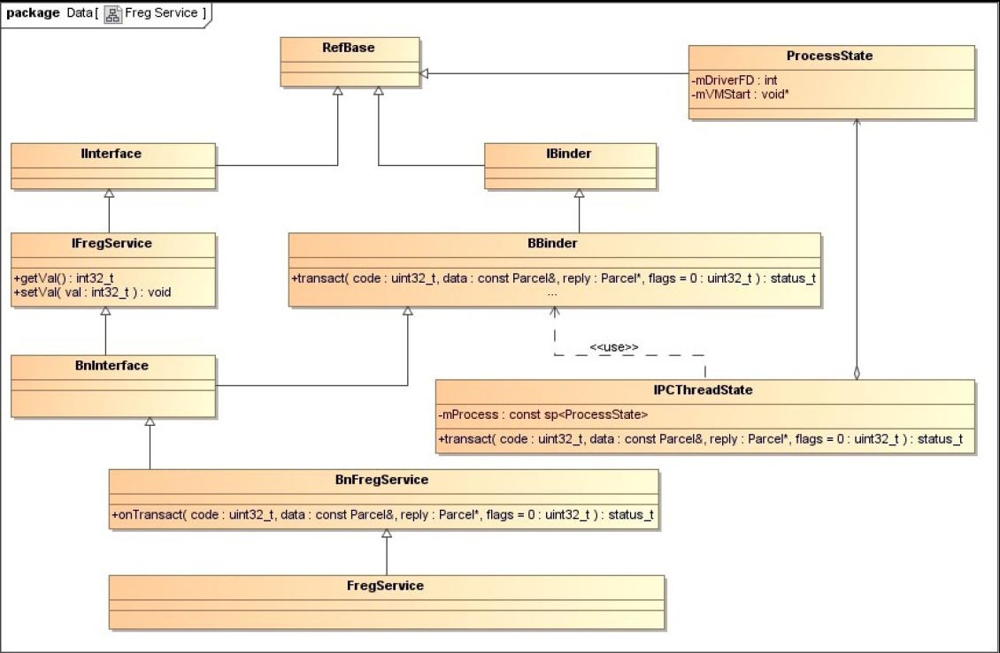

## 5.8　Service组件的启动过程
Service组件是在Server进程中运行的。Service进程在启动时，会首先将它里面的Service组件注册到Service Manager中，接着再启动一个Binder线程池来等待和处理Client进程的通信请求。在本节中，我们将以5.3小节介绍的Service组件FregService为例，详细分析一个Service组件的启动过程。

前面5.2小节的图5-15描述了Service组件的实现原理，我们将图中的IXXXXXX接口及BnXXXXXX和XXXXXX类直接替换为IFregService接口及BnFregService和FregService类，就可以得到Service组件FregService的类关系图，如图5-22所示。



Service组件FregService是运行在FregServer进程中的，FregServer进程的启动过程如下所示。

```cpp

```
第3行调用FregService类的静态成员函数instantiate创建一个FregService组件，并且将它注册到Service Manager中；接着第5行启动了一个Binder线程池；最后第6行将主线程也加入到这个Binder线程池中去等待和处理Client进程的通信请求。
在接下来的内容中，我们先分析Service组件FregService的注册过程，然后再分析FregServer进程是如何启动一个Binder线程池来等待和处理Client进程的通信请求的。

### 5.8.1　注册Service组件
在将Service组件注册到Service Manager之前，我们首先要获得一个Service Manager代理对象，然后才可以通过它将该Service组件注册到Service Manager中。

以Service组件FregService的注册过程为例，FregService类的静态成员函数instantiate首先调用Binder库提供的函数defaultServiceManager来获得一个Service Manager代理对象，然后再调用它的成员函数addService将该Service组件FregService注册到Service Manager中，它的实现如下所示。

```cpp

```
函数defaultServiceManager返回的Service Manager代理对象的类型为BpServiceManager，因此，FregService类的静态成员函数instantiate实际上是调用了BpServiceManager类的成员函数addService来注册Service组件FregService，它的实现如下所示。

`frameworks/base/libs/binder/IServiceManager.cpp`
```cpp
class BpServiceManager : public BpInterface<IServiceManager>
{
public:
    ......

    virtual status_t addService(const String16& name, const sp<IBinder>& service)
    {
        Parcel data, reply;
        data.writeInterfaceToken(IServiceManager::getInterfaceDescriptor());
        data.writeString16(name);
        data.writeStrongBinder(service);
        status_t err = remote()->transact(ADD_SERVICE_TRANSACTION, data, &reply);
        return err == NO_ERROR ? reply.readExceptionCode() : err;
    }

    ......
};
```
Client进程和Server进程的一次进程间通信过程可以划分为如下五个步骤。

1. Client进程将进程间通信数据封装成一个Parcel对象，以便可以将进程间通信数据传递给Binder驱动程序。
1. Client进程向Binder驱动程序发送一个BC_TRANSACTION命令协议。Binder驱动程序根据协议内容找到目标Server进程之后，就会向Client进程发送一个BR_TRANSACTION_COMPLETE返回协议，表示它的进程间通信请求已经被接受。Client进程接收到Binder驱动程序发送给它的BR_TRANSACTION_COMPLETE返回协议，并且对它进行处理之后，就会再次进入到Binder驱动程序中去等待目标Server进程返回进程间通信结果。
1. Binder驱动程序在向Client进程发送BR_TRANSACTION_COMPLETE返回协议的同时，也会向目标Server进程发送一个BR_TRANSACTION返回协议，请求目标Server进程处理该进程间通信请求。
1. Server进程接收到Binder驱动程序发来的BR_TRANSACTION返回协议，并且对它进行处理之后，就会向Binder驱动程序发送一个BC_REPLY命令协议。Binder驱动程序根据协议内容找到目标Client进程之后，就会向Server进程发送一个BR_TRANSACTION_COMPLETE返回协议，表示它返回的进程间通信结果已经收到了。Server进程接收到Binder驱动程序发送给它的BR_TRANSACTION_COMPLETE返回协议，并且对它进行处理之后，一次进程间通信过程就结束了。接着它会再次进入到Binder驱动程序中去等待下一次进程间通信请求。
1. Binder驱动程序向Server进程发送BR_TRANSACTION_COMPLETE返回协议的同时，也会向目标Client进程发送一个BR_REPLY返回协议，表示Server进程已经处理完成它的进程间通信请求了，并且将进程间通信结果返回给它。

**注意**
> 在第2步和第4步中，为什么Binder驱动程序要发送一个BR_TRANSACTION_COMPLETE返回协议来响应Client进程和Server进程的BC_TRANSACTION与BC_REPLY命令协议呢？Client进程和Server进程其实并不需要对BR_TRANSACTION_COMPLETE返回协议做特殊的处理。这样做其实是为了让Client进程和Server进程在执行进程间通信的过程中，有机会返回到用户空间去做其他事情，从而增加它们的并发处理能力。

在本节接下来的内容中，我们将根据上述五个步骤来分析BpServiceManager类的成员函数addService的实现。

#### 5.8.1.1　封装进程间通信数据
在BpServiceManager类的成员函数addService中，第9行到第11行代码分别将进程间通信数据写入到一个Parcel对象data中，然后将Parcel对象data的内容传递给Binder驱动程序。

第9行首先调用Parcel对象data的成员函数writeInterfaceToken写入一个Binder进程间通信请求头，它的实现如下所示。

`frameworks/base/libs/binder/Parcel.cpp`
```cpp
1 status_t Parcel::writeInterfaceToken(const String16& interface)
2 {
3     writeInt32(IPCThreadState::self()->getStrictModePolicy() |
4                STRICT_MODE_PENALTY_GATHER);
5     // currently the interface identification token is just its name as a string
6     return writeString16(interface);
7 }
```
Binder进程间通信请求头由两部分内容组成。第一部分内容是一个整数值，用来描述一个Strict Mode Policy；第二部分内容是一个字符串，用来描述所请求服务的接口描述符。

在Android应用程序中，我们可以为线程定义一些Strict Mode Policy。如果线程在运行过程中违反了这些预先定义好的Strict Mode Policy，那么系统就会发出警告。这样开发人员就方便调试应用程序的功能，并且可以对它们进行优化。例如，我们可以禁止在应用程序的UI线程中执行写磁盘操作，因为写磁盘是一个耗时的操作，会影响用户体验。这时候我们就可以为应用程序的UI线程定义一个不允许写磁盘的Strict Mode Policy。当开发人员不小心在应用程序的UI线程中执行了一个写磁盘操作时，系统就会发出警告，这样开发人员就可以根据这个警告来对应用程序进行优化。

当Client进程中的一个线程将一个进程间通信请求发送给Server进程的某一个线程处理时，其实是要求这个Server线程代替它来执行某一个操作，因此，Binder进程间通信机制就会尽量地将Server线程模拟成Client线程来执行这个操作，这样就要求将Client线程的某些属性设置到Server线程中，Strict Mode Policy便是其中的一个属性。因此，第3行和第4行代码首先获得当前线程的Strict Mode Policy，然后将它与宏STRICT_MODE_PENALTY_GATHER执行一个按位或操作，最后将得到的结果写入到Parcel对象data中去传递给目标Server线程。STRICT_MODE_PENALTY_GATHER是用来描述一个线程的Strict Mode Policy的，它用于Binder进程间通信机制，表示Server线程在处理进程间通信请求时，即使违反了预先设定的Strict Mode Policy，系统也不应该发出警告，而是把这些警告收集起来，最后统一发送给Client线程来处理。

第6行将一个服务接口描述符写入到Parcel对象data中。Server组件在处理一个进程间通信请求时，会将这个服务接口的描述符读取出来，并且验证它是否是一个合法的服务接口描述符，即是否是自己所实现的服务接口的描述符。如果不是，则说明这是一个非法的进程间通信请求。

回到BpServiceManager类的成员函数addService中，接着第10行调用Parcel对象data的成员函数writeString16写入将要注册的Service组件的名称。

第11行调用Parcel对象data的成员函数writeStrongBinder将要注册的Service组件封装成一个flat_binder_object结构体，然后传递给Binder驱动程序。将一个Service组件封装成一个flat_binder_object结构体是Binder进程间通信过程的一个重要步骤，接下来我们就着重分析这个过程。

Parcel类的成员函数writeStrongBinder的实现如下所示。

`frameworks/base/libs/binder/Parcel.cpp`
```cpp
1 status_t Parcel::writeStrongBinder(const sp<IBinder>& val)
2 {
3     return flatten_binder(ProcessState::self(), val, this);
4 }
```
第3行调用全局函数flatten_binder将一个Service组件封装成一个flat_binder_object结构体，它的实现如下所示。

`frameworks/base/libs/binder/Parcel.cpp`
```cpp
01 status_t flatten_binder(const sp<ProcessState>& proc,
02     const sp<IBinder>& binder, Parcel* out)
03 {
04     flat_binder_object obj;
05     
06     obj.flags = 0x7f | FLAT_BINDER_FLAG_ACCEPTS_FDS;
07     if (binder != NULL) {
08         IBinder *local = binder->localBinder();
09         if (!local) {
10             ......
11         } else {
12             obj.type = BINDER_TYPE_BINDER;
13             obj.binder = local->getWeakRefs();
14             obj.cookie = local;
15         }
16     } else {
17         ......
18     }
19     
20     return finish_flatten_binder(binder, obj, out);
21 }
```
第4行首先定义一个flat_binder_object结构体obj，接着第6行将它的标志值设置为（0x7f｜FLAT_BINDER_FLAG_ACCEPTS_FDS）。其中，0x7f用来描述将要注册的Service组件在处理一个进程间通信请求时，它所使用的Server线程的优先级不能低于0x7f；而FLAT_BINDER_FLAG_ACCEPTS_FDS表示可以将包含文件描述符的进程间通信数据传递给将要注册的Service组件处理。

从前面的调用过程可以知道，参数binder指向的是一个FregService组件，它继承了BBinder类。BBinder类是用来描述一个Binder本地对象的，它的成员函数localBinder用来返回一个Binder本地对象接口。由于FregService组件是一个Binder本地对象，因此，第8行得到的变量local的值不等于NULL。接下来第12行到第14行代码就将flat_binder_object结构体obj设置为一个BINDER_TYPE_BINDER类型的Binder对象，并且将它的成员变量cookie和ptr的值分别设置为Binder本地对象local的地址值及其内部的一个弱引用计数对象的地址值。

最后，第20行调用全局函数finish_flatten_binder将flat_binder_object结构体obj写入到Parcel对象out中，它的实现如下所示。

`frameworks/base/libs/binder/Parcel.cpp`
```cpp
1 inline static status_t finish_flatten_binder(
2     const sp<IBinder>& binder, const flat_binder_object& flat, Parcel* out)
3 {
4     return out->writeObject(flat, false);
5 }
```
第4行调用Parcel对象out的成员函数writeObject将flat_binder_object结构体flat写入到内部。

Parcel类的成员函数writeObject的实现如下所示。

`frameworks/base/libs/binder/Parcel.cpp`
```cpp
01 status_t Parcel::writeObject(const flat_binder_object& val, bool nullMetaData)
02 {
03     const bool enoughData = (mDataPos+sizeof(val)) <= mDataCapacity;
04     const bool enoughObjects = mObjectsSize < mObjectsCapacity;
05     if (enoughData && enoughObjects) {
06 restart_write:
07         *reinterpret_cast<flat_binder_object*>(mData+mDataPos) = val;
08         
09         // Need to write meta-data?
10         if (nullMetaData || val.binder != NULL) {
11             mObjects[mObjectsSize] = mDataPos;
12             acquire_object(ProcessState::self(), val, this);
13             mObjectsSize++;
14         }
15         
16         // remember if it's a file descriptor
17         if (val.type == BINDER_TYPE_FD) {
18             mHasFds = mFdsKnown = true;
19         }
20 
21         return finishWrite(sizeof(flat_binder_object));
22     }
23 
24     if (!enoughData) {
25         const status_t err = growData(sizeof(val));
26         if (err != NO_ERROR) return err;
27     }
28     if (!enoughObjects) {
29         size_t newSize = ((mObjectsSize+2)*3)/2;
30         size_t* objects = (size_t*)realloc(mObjects, newSize*sizeof(size_t));
31         if (objects == NULL) return NO_MEMORY;
32         mObjects = objects;
33         mObjectsCapacity = newSize;
34     }
35     
36     goto restart_write;
37 }
```
Parcel类内部有mData和mObjects两个缓冲区，其中，mData是一个数据缓冲区，它里面的内容可能包含有整数、字符串或者Binder对象，即flat_binder_object结构体；mObjects是一个偏移数组，它保存了在数据缓冲区mData中的所有Binder对象的位置。Binder驱动程序就是通过这个偏移数组找到进程间通信数据中的Binder对象的，以便对它们进行特殊处理。

Parcel类的成员变量mDataPos记录了数据缓冲区mData下一个用来写入数据的位置，而成员变量mDataCapacity则记录了数据缓冲区mData的总大小，因此，第3行代码用来判断数据缓冲区mData是否还有足够的空间来写入一个Binder对象。

Parcel类的成员变量mObjectsSize记录了偏移数组mObjects下一个用来写入数据的位置，而成员变量mObjectsCapacity则记录了偏移数组mObjects的总大小，因此，第4行代码用来判断偏移数组mObjects是否还有足够的空间来写入一个Binder对象的偏移位置。

如果数据缓冲区mData和偏移数组mObjects还有足够的空间来写入一个Binder对象，即第5行的if语句为true，那么第7行到第14行代码就将参数val所描述的Binder对象写入到数据缓冲区mData和偏移数组mObjects中。

如果数据缓冲区mData或者偏移数组mObjects的空间不足以用来写入一个Binder对象，即第5行的if语句为false，那么第24行到第34行代码就会首先扩展它们的空间，然后第36行再跳转到第7行到第14行代码将参数val所描述的Binder对象写入到数据缓冲区mData和偏移数组mObjects中。

第17行判断刚才写入的Binder对象的类型是否为BINDER_TYPE_FD。如果是，那么就说明该Parcel对象的数据缓冲区中包含有文件描述符，因此，第18行将成员变量mHasFds和mFdsKnown的值设置为true。

最后，第21行调用成员函数finishWrite来调整数据缓冲区mData下一个用来写入数据的位置，即调整成员变量mDataPos的值。

至此，注册Service组件所需要的进程间通信数据都封装到一个Parcel对象中了。接下来就要使用BC_TRANSACTION命令协议将它传递给Binder驱动程序。

#### 5.8.1.2　发送和处理BC_TRANSACTION命令协议
回到BpServiceManager类的成员函数addService中，将要传递的通信数据封装到一个Parcel对象data中之后，接下来就调用内部的一个Binder代理对象的成员函数transact向Binder驱动程序发送一个BC_TRANSACTION命令协议。

在前面的5.1.1小节中介绍BC_TRANSACTION命令协议时提到，BC_TRANSACTION命令协议后面跟的通信数据使用一个结构体binder_transaction_data来描述，而BC_TRANSACTION命令协议又是通过IO控制命令BINDER_WRITE_READ发送到Binder驱动程序中的。因此，在发送BC_TRANSACTION命令协议给Binder驱动程序之前，我们还需要将Parcel对象data的内容写入到一个binder_transaction_data结构体中，然后将这个binder_transaction_data结构体写入到一个binder_write_read结构体中，最后才能够通过IO控制命令BINDER_WRITE_READ将一个BC_TRANSACTION命令协议发送给Binder驱动程序处理。

Binder代理对象的成员函数transact的实现如下所示。

`frameworks/base/libs/binder/BpBinder.cpp`
```cpp
01 status_t BpBinder::transact(
02     uint32_t code, const Parcel& data, Parcel* reply, uint32_t flags)
03 {
04     // Once a binder has died, it will never come back to life.
05     if (mAlive) {
06         status_t status = IPCThreadState::self()->transact(
07             mHandle, code, data, reply, flags);
08         if (status == DEAD_OBJECT) mAlive = 0;
09         return status;
10     }
11 
12     return DEAD_OBJECT;
13 }
```
从前面的调用过程可以知道，第一个参数code的值为ADD_SERVICE_TRANSACTION；第二个参数data包含了要传递给Binder驱动程序的进程间通信数据；第三个参数reply是一个输出参数，用来保存进程间通信结果；第四个参数flags用来描述这是一个同步的进程间通信请求，还是一个异步的进程间通信请求，它是一个默认参数，默认值为0，表示这是一个同步的进程间通信请求。

Binder代理对象内部的成员变量mAlive用来描述该Binder代理对象所引用的Binder本地对象是否还活着。如果还活着，即它的值等于1，那么第6行和第7行才会调用当前线程的IPCThreadState对象的成员函数transact向Binder驱动程序发送一个BC_TRANSACTION命令协议；否则，第12行就直接返回一个DEAD_OBJECT给调用者，表示相应的Binder本地对象已经死亡了。

Binder代理对象内部的成员变量mHandle用来描述该Binder代理对象的句柄值。由于目前Binder代理对象内部的成员变量mHandle用来描述该Binder代理对象的句柄值。由于目前正在处理的Binder代理对象指向的是一个Service Manager代理对象，因此，它的成员变量mHandle的值就等于0。

IPCThreadState类的成员函数transact的实现如下所示。

`frameworks/base/libs/binder/IPCThreadState.cpp`
```cpp
01 status_t IPCThreadState::transact(int32_t handle,
02                                   uint32_t code, const Parcel& data,
03                                   Parcel* reply, uint32_t flags)
04 {
05     status_t err = data.errorCheck();
06 
07     flags |= TF_ACCEPT_FDS;
08 
09     ......
10     
11     if (err == NO_ERROR) {
12         ......
13         err = writeTransactionData(BC_TRANSACTION, flags, handle, code, data, NULL);
14     }
15     
16     ......
17     
18     if ((flags & TF_ONE_WAY) == 0) {
19         ......
20         if (reply) {
21             err = waitForResponse(reply);
22         } else {
23             ......
24         }
25         ......
26     } else {
27         err = waitForResponse(NULL, NULL);
28     }
29     
30     return err;
31 }
```
第5行检查Parcel对象data中的进程间通信数据是否正确，第7行将参数flags的TF_ACCEPT_FDS位设置为1，表示允许Server进程在返回结果中携带文件描述符。

如果Parcel对象data中的进程间通信数据没有问题，那么第13行就会调用成员函数writeTransactionData将它的内容写入到一个binder_transaction_data结构体中。接着第18行判断参数flags的TF_ONE_WAY位是否等于0。如果是，那么就说明这是一个同步的进程间通信请求，这时候如果用来保存通信结果的Parcel对象reply不等于NULL，那么第21行就调用成员函数waitForResponse向Binder驱动程序发送一个BC_TRANSACTION命令协议。

假设第11行、第18行和第20行的if语句均为true，接下来我们就分别分析IPCThreadState类的成员函数writeTransactionData和waitForResponse的实现。

IPCThreadState类的成员函数writeTransactionData的实现如下所示。

`frameworks/base/libs/binder/IPCThreadState.cpp`
```cpp
01 status_t IPCThreadState::writeTransactionData(int32_t cmd, uint32_t binderFlags,
02     int32_t handle, uint32_t code, const Parcel& data, status_t* statusBuffer)
03 {
04     binder_transaction_data tr;
05 
06     tr.target.handle = handle;
07     tr.code = code;
08     tr.flags = binderFlags;
09     
10     const status_t err = data.errorCheck();
11     if (err == NO_ERROR) {
12         tr.data_size = data.ipcDataSize();
13         tr.data.ptr.buffer = data.ipcData();
14         tr.offsets_size = data.ipcObjectsCount()*sizeof(size_t);
15         tr.data.ptr.offsets = data.ipcObjects();
16     } else if (statusBuffer) {
17         ......
18     } else {
19         return (mLastError = err);
20     }
21     
22     mOut.writeInt32(cmd);
23     mOut.write(&tr, sizeof(tr));
24     
25     return NO_ERROR;
26 }
```
第4行定义了一个binder_transaction_data结构体tr，接着第6行到第8行代码分别用来初始化该结构体的成员变量target.handle、code和flags。从前面的调用过程可以知道，这三个成员变量分别被初始化为0、ADD_SERVICE_TRANSACTION和TF_ACCEPT_FDS。

第10行再次确认Parcel对象data中的进程间通信数据的正确性。如果没有问题，那么第12行到第15行代码就将它内部的数据缓冲区和偏移数组设置为binder_transaction_data结构体tr的数据缓冲区和偏移数组。

最后，第22行和第23行代码将命令协议号cmd，即BC_TRANSACTION，以及binder_transaction_data结构体tr写入到IPCThreadState类的成员变量mOut所描述的一个命令协议缓冲区中，表示它有一个BC_TRANSACTION命令协议需要发送给Binder驱动程序处理。

我们通过图5-23来描述此时命令协议缓冲区mOut的内存布局。


将BC_TRANSACTION命令协议及其内容写入到IPCThreadState类内部的命令协议缓冲区之后，回到IPCThreadState类的成员函数transact中，接下来就继续调用成员函数waitForResponse向Binder驱动程序发送这个BC_TRANSACTION命令协议。

IPCThreadState类的成员函数waitForResponse的实现如下所示。

`frameworks/base/libs/binder/IPCThreadState.cpp`
```cpp
01 status_t IPCThreadState::waitForResponse(Parcel *reply, status_t *acquireResult)
02 {
03     int32_t cmd;
04     int32_t err;
05 
06     while (1) {
07         if ((err=talkWithDriver()) < NO_ERROR) break;
08         ......
09     }
10     
11     ......
12     return err;
13 }
```
这个函数通过一个while循环不断地调用成员函数talkWithDriver来与Binder驱动程序进行交互，以便可以将前面准备好的BC_TRANSACTION命令协议发送给Binder驱动程序处理，并等待Binder驱动程序将进程间通信结果返回来。

IPCThreadState类的成员函数talkWithDriver的实现如下所示。

`frameworks/base/libs/binder/IPCThreadState.cpp`
```cpp
01 status_t IPCThreadState::talkWithDriver(bool doReceive)
02 {
03 
04     
05     binder_write_read bwr;
06     
07     // Is the read buffer empty?
08     const bool needRead = mIn.dataPosition() >= mIn.dataSize();
09     
10     // We don't want to write anything if we are still reading
11     // from data left in the input buffer and the caller
12     // has requested to read the next data.
13     const size_t outAvail = (!doReceive || needRead) ? mOut.dataSize() : 0;
14     
15     bwr.write_size = outAvail;
16     bwr.write_buffer = (long unsigned int)mOut.data();
17 
18     // This is what we'll read.
19     if (doReceive && needRead) {
20         bwr.read_size = mIn.dataCapacity();
21         bwr.read_buffer = (long unsigned int)mIn.data();
22     } else {
23         bwr.read_size = 0;
24     }
25     
26     ......
27     
28     // Return immediately if there is nothing to do.
29     if ((bwr.write_size == 0) && (bwr.read_size == 0)) return NO_ERROR;
30     
31     bwr.write_consumed = 0;
32     bwr.read_consumed = 0;
33     status_t err;
34     
35     do {
36         ......
37         if (ioctl(mProcess->mDriverFD, BINDER_WRITE_READ, &bwr) >= 0)
38             err = NO_ERROR;
39         else
40             err = -errno;
41         ......
42     } while (err == -EINTR);
43     
44     ......
45 
46     if (err >= NO_ERROR) {
47         if (bwr.write_consumed > 0) {
48             if (bwr.write_consumed < (ssize_t)mOut.dataSize())
49                 mOut.remove(0, bwr.write_consumed);
50             else
51                 mOut.setDataSize(0);
52         }
53         if (bwr.read_consumed > 0) {
54             mIn.setDataSize(bwr.read_consumed);
55             mIn.setDataPosition(0);
56         }
57         ......
58         return NO_ERROR;
59     }
60     
61     return err;
62 }
```
在IPCThreadState类内部，除了使用缓冲区mOut来保存即将要发送给Binder驱动程序的命令协议之外，还使用缓冲区mIn来保存那些从Binder驱动程序接收到的返回协议。从前面的调用过程可以知道，缓冲区mOut里面存在一个BC_TRANSACTION命令协议。

IPCThreadState类的成员函数talkWithDriver是使用IO控制命令BINDER_WRITE_READ来与Binder驱动程序交互的，因此，它需要定义一个binder_write_read结构体来指定输入缓冲区和输出缓冲区。其中，输出缓冲区保存的是进程发送给Binder驱动程序的命令协议，而输入缓冲区保存的是Binder驱动程序发送给进程的返回协议，它们分别与IPCThreadState类内部的命令协议缓冲区mOut和返回协议缓冲区mIn对应。

参数doReceive用来描述调用者是否希望IPCThreadState类的成员函数talkWithDriver只接收Binder驱动程序发送给该进程的返回协议，它是一个默认参数，默认值为true。在前面的5.6小节中介绍Service Manager的启动过程时提到，一个进程使用IO控制命令BINDER_WRITE_READ进入到Binder驱动程序，当传递的binder_write_read结构体的输出缓冲区和输入缓冲区的长度分别等于0和大于0时，Binder驱动程序就不会处理进程给它发送的命令协议，而只会向该进程发送返回协议，这样进程就达到了只接收返回协议的效果。

IPCThreadState类的成员函数talkWithDriver是否只接收Binder驱动程序发送给它的返回协议还受到返回协议缓冲区mIn的影响。如果上次Binder发送给进程的返回协议已经处理完成，即返回协议缓冲区mIn中的返回协议已经处理完成，那么即使参数doReceive的值为true，IPCThreadState类的成员函数talkWithDriver也会向Binder驱动程序发送命令协议。因此，如果返回协议缓冲区mIn的返回协议已经处理完成，即第8行得到的变量needRead的值为true，或者调用者不是只希望接收Binder驱动程序发送给进程的返回协议，即参数doReceive的值为false，那么第13行就将变量outAvail的值设置为IPCThreadState类内部的命令协议缓冲区的长度；否则，就将它的值设置为0。接着第15行将变量outAvail的值设置为binder_write_read结构体bwr的输出缓冲区的长度write_size，并且第16行将IPCThreadState类内部的命令协议缓冲区mOut设置为binder_write_read结构体bwr的输出缓冲区write_buffer。

**注意**
> 如果变量outAvail的值等于0，那么将IPCThreadState类内部的命令协议缓冲区mOut设置为binder_write_read结构体bwr的输出缓冲区write_buffer是起不到任何效果的。

如果调用者希望接收Binder驱动程序发送给进程的返回协议，即参数doReceive的值为true，并且进程已经处理完成Binder驱动程序发送给它的返回协议，即变量needRead的值也为true，那么第20行就将IPCThreadState类内部的返回协议缓冲区mIn的长度设置为binder_write_read结构体bwr的输入缓冲区的长度read_size，并且第21行将IPCThreadState类内部的返回协议缓冲区mIn设置为binder_write_read结构体bwr的输入缓冲区read_buffer；否则，第23行就将binder_write_read结构体bwr的输入缓冲区的长度read_size设置为0，表示不要从Binder驱动程序中读取返回协议。从前面的调用过程可以知道，参数doReceive的值为默认值，即为true。假设此时IPCThreadState类内部的返回协议缓冲区mIn没有包含未处理的返回协议，那么我们得到的binder_write_read结构体bwr的输入缓冲区的长度read_size就会大于0，并且它指向了IPCThreadState类内部的返回协议缓冲区mIn。

第29行的if语句判断binder_write_read结构体bwr的输出缓冲区的长度write_size和输入缓冲区的长度read_size的值是否都等于0。如果是，就说明IPCThreadState类的成员函数talkWithDriver根本就不需要进入到Binder驱动程序，因此，函数就从第29行返回了。从前面的调用过程可以知道，binder_write_read结构体bwr的输出缓冲区write_buffer中包含了一个BC_TRANSACTION命令协议，因此，它的长度write_size大于0，函数继续往下执行。

第35行到第42行的while循环使用IO控制命令BINDER_WRITE_READ来与Binder驱动程序进行交互。由于这时候传递给Binder驱动程序的binder_write_read结构体bwr的输出缓冲区的长度write_size和输入缓冲区的长度read_size均大于0，因此，Binder驱动程序在处理IO控制命令BINDER_WRITE_READ时，就会首先调用函数binder_thread_write来处理进程给它发送的BC_TRANSACTION命令协议，接着又会调用函数binder_thread_read来读取Binder驱动程序给进程发送的返回协议。

IPCThreadState类的成员函数talkWithDriver从Binder驱动程序中返回来之后，第47行到第52行代码将Binder驱动程序已经处理的命令协议从IPCThreadState类内部的命令协议缓冲区mOut中移除，接着第53行到第56行代码将从Binder驱动程序中读取出来的返回协议保存在IPCThreadState类内部的返回协议缓冲区mIn中。这样，IPCThreadState类的成员函数talkWithDriver返回到前面调用了它的成员函数waitForResponse时，后者就可以通过解析返回协议缓冲区mIn的内容来执行相应的操作了。

接下来，我们就进入到Binder驱动程序中，分析它的函数binder_thread_write和binder_thread_read的实现。

Binder驱动程序中的函数binder_thread_write的实现如下所示。

`kernel/drivers/staging/android/binder.c`
```cpp
01 int
02 binder_thread_write(struct binder_proc *proc, struct binder_thread *thread,
03 		    void __user *buffer, int size, signed long *consumed)
04 {
05 	uint32_t cmd;
06 	void __user *ptr = buffer + *consumed;
07 	void __user *end = buffer + size;
08 
09 	while (ptr < end && thread->return_error == BR_OK) {
10 		if (get_user(cmd, (uint32_t __user *)ptr))
11 			return -EFAULT;
12 		ptr += sizeof(uint32_t);
13         ......
14 		switch (cmd) {
15         ......
16 		case BC_TRANSACTION:
17 		case BC_REPLY: {
18 			struct binder_transaction_data tr;
19 
20 			if (copy_from_user(&tr, ptr, sizeof(tr)))
21 				return -EFAULT;
22 			ptr += sizeof(tr);
23 			binder_transaction(proc, thread, &tr, cmd == BC_REPLY);
24 			break;
25 		}
26         ......
27 		}
28         
29 		*consumed = ptr - buffer;
30 	}
31 	return 0;
32 }
```
参数buffer指向进程传递给Binder驱动程序的一个binder_read_write结构体的输出缓冲区write_buffer。从前面的调用过程可以可以知道，这个输出缓冲区包含了一个BC_TRANSACTION命令协议，因此，第20行接着就将BC_TRANSACTION命令协议后面所跟的进程间通信数据读取出来，并且保存在binder_transaction_data结构体tr中。最后，第23行调用函数binder_transaction来处理进程发送给它的BC_TRANSACTION命令协议。

从这里可以看出，命令协议BC_REPLY的处理流程与命令协议BC_TRANSACTION类似，因此，为了方便描述，在本章接下来的内容中，当进程向Binder驱动程序发送一个BC_TRANSACTION或者BC_REPLY命令协议时，我们就跳过函数binder_thread_write的执行过程，而直接分析函数binder_transaction是如何处理这两个命令协议的。

函数binder_transaction负责处理命令协议BC_TRANSACTION和BC_REPLY，它的实现比较长，我们分段来阅读。

`kernel/drivers/staging/android/binder.c`
```cpp
01 static void
02 binder_transaction(struct binder_proc *proc, struct binder_thread *thread,
03 	struct binder_transaction_data *tr, int reply)
04 {
05 	struct binder_transaction *t;
06 	struct binder_work *tcomplete;
07 	size_t *offp, *off_end;
08 	struct binder_proc *target_proc;
09 	struct binder_thread *target_thread = NULL;
10 	struct binder_node *target_node = NULL;
11 	struct list_head *target_list;
12 	wait_queue_head_t *target_wait;
13 	struct binder_transaction *in_reply_to = NULL;
14     ......
15 
16 	if (reply) {
17         ......
18 	} else {
19 		if (tr->target.handle) {
20 			struct binder_ref *ref;
21 			ref = binder_get_ref(proc, tr->target.handle);
22             ......
23 			target_node = ref->node;
24 		} else {
25 			target_node = binder_context_mgr_node;
26             ......
27 		}
28 		e->to_node = target_node->debug_id;
29 		target_proc = target_node->proc;
30         ......
31 		if (!(tr->flags & TF_ONE_WAY) && thread->transaction_stack) {
32 			struct binder_transaction *tmp;
33 			tmp = thread->transaction_stack;
34             ......
35 			while (tmp) {
36 				if (tmp->from && tmp->from->proc == target_proc)
37 					target_thread = tmp->from;
38 				tmp = tmp->from_parent;
39 			}
40 		}
41 	}
42 	if (target_thread) {
43 		e->to_thread = target_thread->pid;
44 		target_list = &target_thread->todo;
45 		target_wait = &target_thread->wait;
46 	} else {
47 		target_list = &target_proc->todo;
48 		target_wait = &target_proc->wait;
49 	}
```
参数reply用来描述函数binder_transaction当前要处理的是一个BC_TRANSACTION命令协议，还是一个BC_REPLY命令协议。当它的值等于0时，就表示处理的是BC_TRANSACTION命令协议；否则，就表示处理的是BC_REPLY命令协议。从前面的调用过程可以知道，参数reply的值等于0，因此，我们重点分析函数binder_transaction处理BC_TRANSACTION命令协议的过程。

我们首先回顾一下，发出该BC_TRANSACTION命令协议的源进程和源线程分别是FregServer应用程序进程及其主线程，它们分别使用binder_proc结构体proc和binder_thread结构体thread来描述。源进程proc发送BC_TRANSACTION命令协议给Binder驱动程序的目的是要将一个Service组件FregService注册到Service Manager中，因此，在binder_transaction_data结构体tr中，它指向的目标Binder对象是一个Binder引用对象，并且它的句柄值等于0。

由于目标Binder引用对象的句柄值等于0，即第19行的if语句为false，因此，第25行就将目标Binder实体对象target_node指向一个引用了Service Manager的Binder实体对象binder_context_mgr_node；否则，第21行就首先需要调用函数binder_get_ref来获得与句柄值tr->target.handle对应的Binder引用对象，接着第23行再通过这个Binder引用对象的成员变量node来找到目标Binder实体对象target_node。

**注意**
> 引用了Service Manager的Binder实体对象binder_context_mgr_node是Binder驱动程序在Service Manager启动时创建的，具体可以参考5.6.2小节的内容。

找到了目标Binder实体对象之后，第29行就可以根据它的成员变量proc来找到目标进程target_proc。从理论上说，找到了目标进程target_proc之后，Binder驱动程序就可以向它发送一个BR_TRANSACTION返回协议，以便它可以处理注册Service组件FregService的进程间通信请求。发送给目标进程target_proc的BR_TRANSACTION返回协议最终是由它的空闲Binder线程来处理的。这些空闲的Binder线程可以划分为两种类型：第一种是因为无事可做而空闲；第二种不是真的空闲，而是它在处理某个事务的过程中，需要等待其他线程来完成另外一个事务。如果Binder驱动程序能够从目标进程target_proc中挑选出一个属于第二种类型的空闲Binder线程来处理BR_TRANSACTION返回协议，并且又不会影响该线程处理它原来的事务，那么Binder驱动程序就可以充分地利用目标进程target_proc的空闲Binder线程来处理进程间通信请求了。

考虑这样一个情景。进程S中有两个Binder线程A和B，其中，线程B处于空闲状态，而线程A正在处理事务T1。线程A在处理事务T1时，需要请求进程T中的线程C来完成事务T2，这时候线程A也处于空闲状态，因为它要等待线程C完成事务T2。线程C在处理事务T2时，又需要请求进程S来完成事务T3。这时候Binder驱动程序将进程S的事务T3是分配给线程A还是线程B来处理呢？最优的方案是分配给线程A来处理，因为即使Binder驱动程序将事务T3分配给线程B来处理，线程A仍然不可以去处理其他事务，它需要等待线程C处理完成事务T2，以及线程B处理完成事务T3，然后再继续处理事务T1。

第31行到第40行代码做了一个优化，它尝试在目标进程target_proc中找到一个属于第二种类型的Binder空闲线程target_thread来处理一个BR_TRANSACTION返回协议，以便可以提高目标进程target_proc的进程间通信并发处理能力。在前面的5.1.1小节中介绍结构体binder_transaction时已经详细分析过这个优化方案了，因此，读者可以结合这段代码来重新理解结构体binder_transaction的定义。不过有一个地方需要注意，只有当前正在处理的进程间通信请求是同步的，即binder_transaction结构体tr的成员变量flags的TF_ONE_WAY位等于0，才会执行该优化方案，因为异步的进程间通信请求根本就不会涉及一个线程等待另外一个线程的问题。

如果Binder驱动程序在目标进程target_proc中找到了一个最优的目标线程target_thread来接收BR_TRANSACTION返回协议，即第42行的if语句为true，那么就44行和第45行就将变量target_list和target_wait分别指向该目标线程target_thread的todo队列和wait等待队列；否则，第47行和第48行就将变量target_list和target_wait分别指向该目标进程target_proc的todo队列和wait等待队列。有了目标todo队列target_list和目标wait等待队列target_wait之后，函数接下来就可以将一个与BR_TRANSACTION返回协议相关的待处理工作项加入到目标todo队列target_list中，以及通过目标wait等待队列target_Wait将目标进程或者目标线程唤醒来处理这个工作项。

函数binder_transaction继续往下执行。

`kernel/drivers/staging/android/binder.c`
```cpp
50 	t = kzalloc(sizeof(*t), GFP_KERNEL);
51     ......
52 
53 	tcomplete = kzalloc(sizeof(*tcomplete), GFP_KERNEL);
54     ......
55 
56 	if (!reply && !(tr->flags & TF_ONE_WAY))
57 		t->from = thread;
58 	else
59 		t->from = NULL;
60 	t->sender_euid = proc->tsk->cred->euid;
61 	t->to_proc = target_proc;
62 	t->to_thread = target_thread;
63 	t->code = tr->code;
64 	t->flags = tr->flags;
65 	t->priority = task_nice(current);
66 	t->buffer = binder_alloc_buf(target_proc, tr->data_size,
67 		tr->offsets_size, !reply && (t->flags & TF_ONE_WAY));
68     ......
69 	t->buffer->allow_user_free = 0;
70 	t->buffer->debug_id = t->debug_id;
71 	t->buffer->transaction = t;
72 	t->buffer->target_node = target_node;
73 	if (target_node)
74 		binder_inc_node(target_node, 1, 0, NULL);
75 
76 	offp = (size_t *)(t->buffer->data + ALIGN(tr->data_size, sizeof(void *)));
77 
78 	if (copy_from_user(t->buffer->data, tr->data.ptr.buffer, tr->data_size)) {
79         ......
80 		goto err_copy_data_failed;
81 	}
82 	if (copy_from_user(offp, tr->data.ptr.offsets, tr->offsets_size)) {
83         ......
84 		goto err_copy_data_failed;
85 	}
86   ......
87 	off_end = (void *)offp + tr->offsets_size;
```
第50行分配了一个binder_transaction结构体t，后面会将它封装为一个BINDER_WORK_TRANSACTION类型的工作项加入到目标todo队列target_list中，以便目标线程可以接收到一个BR_TRANSACTION返回协议。

第53行分配了一个binder_work结构体tcomplete，后面会将它封装成一个BINDER_WORK_TRANSACTION_COMPLETE类型的工作项加入到源线程thread的todo队列中，以便该线程知道可以马上返回用户空间，并且知道它之前给Binder驱动程序发送的BC_TRANSACTION命令协议已经被接收了。

第56行到第72行代码初始化前面分配的binder_transaction结构体t。如果函数正在处理的是一个BC_TRANSACTION命令协议，并且它所描述的是一个同步的进程间通信请求，那么第57行就会将binder_transaction结构体t的成员变量from指向源线程thread，以便目标进程target_proc或者目标线程target_thread处理完该进程间通信请求之后，能够找回发出该进程间通信请求的线程，最终将进程间通信结果返回给它。第66行和第77行为binder_transaction结构体t分配一个内核缓冲区，以便可以将进程间通信数据拷贝到它里面，最后传递给目标进程target_proc或者目标线程target_thread处理。

**注意**
> 这个内核缓冲区是在目标进程target_proc中分配的。第74行调用函数binder_inc_node来增加目标Binder实体对象的强引用计数，因为binder_transaction结构体t通过成员变量target_node引用了它。

第78行和第82行代码分别将binder_transaction_data结构体tr的数据缓冲区，以及偏移数组的内容拷贝到分配给binder_transaction结构体t的内核缓冲区中。

第76行和第88行代码分别计算分配给binder_transaction结构体t的内核缓冲区中用来保存偏移数组的开始位置offp和结束位置off_end。接下来，函数就根据这两个位置来遍历进程间通信数据中的Binder对象，以便可以对它们进行处理。

函数binder_transaction继续往下执行。

`kernel/drivers/staging/android/binder.c`
```cpp
089 	for (; offp < off_end; offp++) {
090 		struct flat_binder_object *fp;
091         ......
092 		fp = (struct flat_binder_object *)(t->buffer->data + *offp);
093 		switch (fp->type) {
094 		case BINDER_TYPE_BINDER:
095 		case BINDER_TYPE_WEAK_BINDER: {
096 			struct binder_ref *ref;
097 			struct binder_node *node = binder_get_node(proc, fp->binder);
098 			if (node == NULL) {
099 				node = binder_new_node(proc, fp->binder, fp->cookie);
100                 ......
101 				node->min_priority = fp->flags & FLAT_BINDER_FLAG_PRIORITY_MASK;
102 				node->accept_fds = !!(fp->flags & FLAT_BINDER_FLAG_ACCEPTS_FDS);
103 			}
104             ......
105 			ref = binder_get_ref_for_node(target_proc, node);
106             ......
107 			if (fp->type == BINDER_TYPE_BINDER)
108 				fp->type = BINDER_TYPE_HANDLE;
109 			else
110 				fp->type = BINDER_TYPE_WEAK_HANDLE;
111 			fp->handle = ref->desc;
112 			binder_inc_ref(ref, fp->type == BINDER_TYPE_HANDLE, &thread->todo);
113             ......
114 		} break;
115         ......
116 	}
117 }
```
第89行到第118行的for循环依次处理进程间通信数据中的Binder对象。如果Binder驱动程序是第一次碰到这些Binder对象，那么Binder驱动程序就会根据它们的类型分别创建一个Binder实体对象或者一个Binder引用对象；否则，就会将之前为它们创建的Binder实体对象或者Binder引用对象获取回来，以便可以增加它们的引用计数，避免它们过早地被销毁。

从前面的调用过程可以知道，进程间通信数据中包含有一个类型为BINDER_TYPE_BINDER的Binder对象，即一个flat_binder_object结构体，它用来描述即将要注册到Service Manager中的Service组件FregService。由于Binder驱动程序是第一次碰到这个Binder对象，因此，第97行调用函数binder_get_node就无法获得一个引用了它的Binder实体对象，接着第99行就会调用函数binder_new_node为它创建一个Binder实体对象node。在创建Binder实体对象node时，第101行和第102行代码就会根据从用户空间传递进来的flat_binder_object结构体的内容来设置它的最小线程优先级min_priority，以及是否接收文件描述符标志accept_fds。

在前面的5.6小节中介绍Service Manager的启动过程时，我们已经分析过函数binder_new_node的实现了，下面就简要地分析函数binder_get_node的实现，它的定义如下所示。

`kernel/drivers/staging/android/binder.c`
```cpp
01 static struct binder_node *
02 binder_get_node(struct binder_proc *proc, void __user *ptr)
03 {
04 	struct rb_node *n = proc->nodes.rb_node;
05 	struct binder_node *node;
06 
07 	while (n) {
08 		node = rb_entry(n, struct binder_node, rb_node);
09 
10 		if (ptr < node->ptr)
11 			n = n->rb_left;
12 		else if (ptr > node->ptr)
13 			n = n->rb_right;
14 		else
15 			return node;
16 	}
17 	return NULL;
18 }
```
函数binder_get_node根据一个用户空间地址ptr在目标进程proc中找到一个对应的Binder实体对象。在前面的5.1.1小节中介绍结构体binder_proc时提到，一个进程中的所有Binder实体对象都以它们的成员变量ptr作为关键字保存在进程内部的一个红黑树nodes中。因此，函数就在目标进程proc的Binder实体对象红黑树nodes中检查是否存在一个与参数ptr对应的Binder实体对象。如果存在，就将对应的Binder对象返回给调用者；否则，就返回一个NULL值给调用者。

回到函数binder_transaction中，因为函数接下来就要将即将要注册的Service组件FregService从源进程proc传递到目标进程target_proc中，因此，第105行就需要调用函数binder_get_ref_for_node在目标进程target_proc中创建一个Binder引用对象来引用该Service组件FregService。

函数binder_get_ref_for_node的实现如下所示。

`kernel/drivers/staging/android/binder.c`
```cpp
01 static struct binder_ref *
02 binder_get_ref_for_node(struct binder_proc *proc, struct binder_node *node)
03 {
04 	struct rb_node *n;
05 	struct rb_node **p = &proc->refs_by_node.rb_node;
06 	struct rb_node *parent = NULL;
07 	struct binder_ref *ref, *new_ref;
08 
09 	while (*p) {
10 		parent = *p;
11 		ref = rb_entry(parent, struct binder_ref, rb_node_node);
12 
13 		if (node < ref->node)
14 			p = &(*p)->rb_left;
15 		else if (node > ref->node)
16 			p = &(*p)->rb_right;
17 		else
18 			return ref;
19 	}
20 	new_ref = kzalloc(sizeof(*ref), GFP_KERNEL);
21     ......
22 	new_ref->proc = proc;
23 	new_ref->node = node;
24 	rb_link_node(&new_ref->rb_node_node, parent, p);
25 	rb_insert_color(&new_ref->rb_node_node, &proc->refs_by_node);
26 
27 	new_ref->desc = (node == binder_context_mgr_node) ? 0 : 1;
28 	for (n = rb_first(&proc->refs_by_desc); n != NULL; n = rb_next(n)) {
29 		ref = rb_entry(n, struct binder_ref, rb_node_desc);
30 		if (ref->desc > new_ref->desc)
31 			break;
32 		new_ref->desc = ref->desc + 1;
33 	}
34 
35 	p = &proc->refs_by_desc.rb_node;
36 	while (*p) {
37 		parent = *p;
38 		ref = rb_entry(parent, struct binder_ref, rb_node_desc);
39 
40 		if (new_ref->desc < ref->desc)
41 			p = &(*p)->rb_left;
42 		else if (new_ref->desc > ref->desc)
43 			p = &(*p)->rb_right;
44 		else
45 			BUG();
46 	}
47 	rb_link_node(&new_ref->rb_node_desc, parent, p);
48 	rb_insert_color(&new_ref->rb_node_desc, &proc->refs_by_desc);
49 	if (node) {
50 		hlist_add_head(&new_ref->node_entry, &node->refs);
51         ......
52 	} else {
53         ......
54 	}
55 	return new_ref;
56 }
```
函数binder_get_ref_for_node首先判断是否已经在目标进程proc中为Binder实体对象node创建过一个Binder引用对象。如果已经创建过，那么就会将对应的Binder引用对象返回给调用者；否则，就会首先创建一个Binder引用对象来引用该Binder实体对象node，然后再将它返回给调用者。

在前面的5.1.1小节中介绍结构体binder_proc时提到，一个进程中的所有Binder引用对象都以它们的成员变量node作为关键字保存在一个红黑树refs_by_node中。因此，第9行到第19行的while循环就在目标进程proc的红黑树refs_by_node中检查是否已经存在一个与Binder实体对象node对应的Binder引用对象。如果存在，就直接将它返回给调用者；否则，接下来第20行代码就会在目标进程proc中为Binder实体对象node创建一个Binder引用对象new_ref，并且第24行和第25行代码将它添加到目标进程proc的红黑树refs_by_node中。

第27行到第33行代码为新创建的Binder引用对象new_ref分配句柄值。第27行检查Binder实体对象node是否引用了Service Manager的Binder实体对象binder_context_mgr_node。如果是，那么就将Binder引用对象new_ref的句柄值设置为0；否则，就先将Binder引用对象new_ref的句柄值设置为1，接着第28行到第33行的for循环再根据实际情况对它进行调整。第28行到第33行的for循环实际上是在目标进程proc中找到一个未使用的最小的句柄值来作为新创建的Binder引用对象new_ref的句柄值。

**注意**
> 一个进程中的Binder引用对象除了保存在红黑树refs_by_node中之外，还以它们的句柄值作为关键字保存在另外一个红黑树refs_by_desc中。当通过函数rb_first和rb_next遍历红黑树refs_by_desc时，就会按照句柄值从小到大的顺序来获得这些Binder引用对象，因此，第28行到第33行的for循环在目标进程proc中找到的未使用的句柄值是最小的。

为新创建的Binder引用对象new_ref分配好句柄值之后，第36行到第46行的while循环再次确认前面为Binder引用对象new_ref分配的句柄值是有效的。接着第47行和第48行代码将Binder引用对象new_ref添加到目标进程proc的红黑树refs_by_desc中。最后，第50行将Binder引用对象new_ref添加到它所引用的Binder实体对象node的Binder引用对象列表中。

回到函数binder_transaction中，第107行到第111行代码将flat_binder_object结构体fp的类型修改为BINDER_TYPE_HANDLE，并且设置好它的句柄值。这是因为当Binder驱动程序将进程间通信数据传递给目标进程target_proc时，进程间通信数据中的Binder实体对象就变成了Binder引用对象，因此，就需要修改flat_binder_object结构体fp的类型。

在目标进程target_proc创建好一个Binder引用对象ref后，接着就要将它传递给该目标进程了。在传递的过程中，必须要保证Binder引用对象ref不会被销毁，因此，第112行就调用函数binder_inc_ref来增加它的引用计数。

**注意**
前面在创建Binder引用对象ref时，尚未增加过与它所引用的Binder实体对象对应的Binder本地对象的引用计数，因此，在调用函数binder_inc_ref来增加Binder引用对象ref的引用计数时，需要将源线程thread的todo队列作为第三个参数传进去，以便Binder驱动程序可以将一个类型为BINDER_WORK_NODE的工作项添加到它里面。这样，当源线程thread从Binder驱动程序返回到用户空间时，就可以增加相应的Binder本地对象，即Service组件FregService的引用计数了。有关Binder对象引用计数的内容，可以参考前面5.2小节的内容。

函数binder_transaction继续往下执行。

`kernel/drivers/staging/android/binder.c`
```cpp
119 	if (reply) {
120         ......
121 	} else if (!(t->flags & TF_ONE_WAY)) {
122 		BUG_ON(t->buffer->async_transaction != 0);
123 		t->need_reply = 1;
124 		t->from_parent = thread->transaction_stack;
125 		thread->transaction_stack = t;
126 	} else {
127 		BUG_ON(target_node == NULL);
128 		BUG_ON(t->buffer->async_transaction != 1);
129 		if (target_node->has_async_transaction) {
130 			target_list = &target_node->async_todo;
131 			target_wait = NULL;
132 		} else
133 			target_node->has_async_transaction = 1;
134 	}
135 	t->work.type = BINDER_WORK_TRANSACTION;
136 	list_add_tail(&t->work.entry, target_list);
137 	tcomplete->type = BINDER_WORK_TRANSACTION_COMPLETE;
138 	list_add_tail(&tcomplete->entry, &thread->todo);
139 	if (target_wait)
140 		wake_up_interruptible(target_wait);
141 	return;
142 
143     ......
144 }
```
如果函数binder_transaction正在处理的是一个同步的进程间通信请求，即binder_transaction结构体t的成员变量flags的TF_ONE_WAY位等于0，那么第123行就设置它的成员变量need_reply的值为1，表示它需要等待回复。接着第124行和第125行将事务t压入到源线程thread的事务堆栈transaction_stack中。

如果函数binder_transaction正在处理的是一个异步的进程间通信请求，即binder_transaction结构体t的成员变量flags的TF_ONE_WAY位等于1，那么第129行的if语句就会检查目标Binder实体对象target_node当前是否正在处理异步事务。如果是，那么它的成员变量has_async_transaction的值就会等于1。在这种情况下，Binder驱动程序就需要将binder_transaction结构体t封装成一个工作项添加到目标Binder实体对象target_node的async_todo队列中去等待处理，而不应该放到目标进程target_proc或者目标线程target_thread的todo队列中去等待处理。因此，第130行和第131行就需要修改目标todo队列target_list和目标wait等待队列target_wait的值。在前面的5.1.1小节中介绍结构体binder_node时提到，一个Binder实体对象的所有异步事务都必须是串行执行的，这是为了保证它所在的进程能够优先处理同步事务。因此，当一个Binder实体对象正在处理一个异步事务时，接下来的其余异步事务就必须要添加到它的异步事务队列async_todo中去等待处理。如果目标Binder实体对象target_node当前不是正在处理异步事务，那么就可以将binder_transaction结构体t封装成一个工作项添加到目标进程target_proc或者目标线程target_thread的todo队列中去等待处理，但是要将它的成员变量has_async_transaction的值设置为1。

第135行和第136行将binder_transaction结构体t封装成一个类型为BINDER_WORK_TRANSACTION的工作项添加到目标进程target_proc或者目标线程target_thread的todo队列中，并且第140行将目标进程target_proc或者目标线程target_thread唤醒，以便它们可以处理这个工作项。如果目标todo队列target_list指向的是一个Binder实体对象的异步事务队列async_todo，那么目标wait等待队列target_wait就会等于NULL，这时候就不需要将目标进程target_proc或者目标线程target_thread唤醒了。

第137行和第138行将binder_work结构体tcomplete封装成一个类型为BINDER_WORK_TRANSACTION_COMPLETE的工作项添加到源线程thread的todo队列中，以便它从Binder驱动程序返回到用户空间之前，可以处理该工作项。

程序执行到这里时，源线程thread、目标进程target_proc或者目标线程target_thread就会并发地去处理各自的todo队列中的工作项了。为了方便描述，我们假设源线程thread首先处理它的todo队列中类型为BINDER_WORK_TRANSACTION_COMPLETE的工作项，接着目标进程target_proc或者目标线程target_thread再处理它们的todo队列中类型为BINDER_WORK_TRANSACTION的工作项。

源线程thread从函数binder_transaction返回到函数binder_thread_write之后，再返回到函数binder_ioctl中。由于从用户空间传进来的binder_write_read结构体的输入缓冲区的长度read_size大于0，因此，Binder驱动程序接下来就会调用函数binder_thread_read来处理源线程thread的todo队列中类型为BINDER_WORK_TRANSACTION_COMPLETE的工作项。

函数binder_thread_read的实现如下所示。

`kernel/drivers/staging/android/binder.c`
```cpp
01 static int
02 binder_thread_read(struct binder_proc *proc, struct binder_thread *thread,
03 	void  __user *buffer, int size, signed long *consumed, int non_block)
04 {
05 	void __user *ptr = buffer + *consumed;
06 	void __user *end = buffer + size;
07 
08 	int ret = 0;
09     ....
10 
11 	while (1) {
12 		uint32_t cmd;
13 		struct binder_transaction_data tr;
14 		struct binder_work *w;
15 		struct binder_transaction *t = NULL;
16 
17 		if (!list_empty(&thread->todo))
18 			w = list_first_entry(&thread->todo, struct binder_work, entry);
19 		else if (!list_empty(&proc->todo) && wait_for_proc_work)
20 			w = list_first_entry(&proc->todo, struct binder_work, entry);
21 		else {
22 			if (ptr - buffer == 4 && !(thread->looper & BINDER_LOOPER_STATE_NEED_RETURN)) /* no data added */
23 				goto retry;
24 			break;
25 		}
26 
27         ......
28 
29 		switch (w->type) {
30         ......
31 		case BINDER_WORK_TRANSACTION_COMPLETE: {
32 			cmd = BR_TRANSACTION_COMPLETE;
33 			if (put_user(cmd, (uint32_t __user *)ptr))
34 				return -EFAULT;
35 			ptr += sizeof(uint32_t);
36             ......
37 
38 			list_del(&w->entry);
39 			kfree(w);
40             ......
41 		} break;
42         ......
43 	}
44 
45 done:
46 
47 	*consumed = ptr - buffer;
48     ......
49 	return 0;
50 }
```
第18行将线程thread的todo队列中类型为BINDER_WORK_TRANSACTION_COMPLETE的工作项取出来，接着第33行就将一个BR_TRANSACTION_COMPLETE返回协议写入到用户空间提供的缓冲区中。从这里可以看出，Binder驱动程序处理类型为BINDER_WORK_TRANSACTION_COMPLETE的工作项的方式是向相应的进程发送一个BR_TRANSACTION_COMPLETE返回协议。

函数binder_thread_read执行完成之后，就返回到函数binder_ioctl中，然后再返回到IPCThreadState类的成员函数talkWithDriver中，最后又返回到IPCThreadState类的成员函数waitForResponse中，以便可以处理Binder驱动程序给进程发送的BR_TRANSACTION_COMPLETE返回协议。

IPCThreadState类的成员函数waitForResponse的实现如下所示。

`frameworks/base/libs/binder/IPCThreadState.cpp`
```cpp
01 status_t IPCThreadState::waitForResponse(Parcel *reply, status_t *acquireResult)
02 {
03     int32_t cmd;
04     int32_t err;
05 
06     while (1) {
07         if ((err=talkWithDriver()) < NO_ERROR) break;
08         err = mIn.errorCheck();
09         if (err < NO_ERROR) break;
10         if (mIn.dataAvail() == 0) continue;
11         
12         cmd = mIn.readInt32();
13         
14         ......
15 
16         switch (cmd) {
17         case BR_TRANSACTION_COMPLETE:
18             if (!reply && !acquireResult) goto finish;
19             break;
20         ......
21         }
22     }
23 
24     ......
25     return err;
26 }
```
IPCThreadState类的成员函数talkWithDriver已经将Binder驱动程序给进程发送的BR_TRANSACTION_COMPLETE返回协议保存在内部的返回协议缓冲区mIn中，因此，第12行就可以通过返回协议缓冲区mIn来获得这个BR_TRANSACTION_COMPLETE返回协议。IPCThreadState类的成员函数waitForResponse对BR_TRANSACTION_COMPLETE返回协议的处理很简单，它跳出了第16行到第21行的switch语句之后，就重新执行外层的while循环，即再次调用成员函数talkWithDriver来与Binder驱动程序交互。

再次进入到IPCThreadState类的成员函数talkWithDriver中时，由于IPCThreadState类内部的命令协议缓冲区mOut中的命令协议，以及返回协议缓冲区mIn中的返回协议都已经处理完成了，因此，当它再次通过IO控制命令BINDER_WRITE_READ进入到Binder驱动程序的函数binder_ioctl中时，就会直接调用函数binder_thread_read等待目标进程将上次发出的进程间通信请求的结果返回来。

#### 5.8.1.3　发送和处理BR_TRANSACTION返回协议
在前面的5.6小节中分析Service Manager的启动过程时提到，Service Manager在启动完成之后，它的主线程就会进入到Binder驱动程序的函数binder_thread_read中去等待它的todo队列或者它所属进程的todo队列中有新的工作项需要处理。

假设在前面的5.8.1.2小节中，Binder驱动程序将一个类型为BINDER_WORK_TRANSACTION的工作项添加到了Service Manager进程的todo队列中，那么接下来Service Manager的主线程就会被唤醒，继续往下执行函数binder_thread_read。

函数binder_thread_read负责处理一个线程或者一个进程的todo队列中的工作项。处理完成之后，它就会向目标进程发送一个返回协议。

函数binder_thread_read的实现比较长，我们分段来阅读。

`kernel/drivers/staging/android/binder.c`
```cpp
01 static int
02 binder_thread_read(struct binder_proc *proc, struct binder_thread *thread,
03 	void  __user *buffer, int size, signed long *consumed, int non_block)
04 {
05 	void __user *ptr = buffer + *consumed;
06 	void __user *end = buffer + size;
07 
08 	int ret = 0;
09     ......
10 
11 	while (1) {
12 		uint32_t cmd;
13 		struct binder_transaction_data tr;
14 		struct binder_work *w;
15 		struct binder_transaction *t = NULL;
16 
17 		if (!list_empty(&thread->todo))
18 			w = list_first_entry(&thread->todo, struct binder_work, entry);
19 		else if (!list_empty(&proc->todo) && wait_for_proc_work)
20 			w = list_first_entry(&proc->todo, struct binder_work, entry);
21 		else {
22 			if (ptr - buffer == 4 && !(thread->looper & BINDER_LOOPER_STATE_NEED_RETURN)) /* no data added */
23 				goto retry;
24 			break;
25 		}
26 
27         ......
28 
29 		switch (w->type) {
30 		case BINDER_WORK_TRANSACTION: {
31 			t = container_of(w, struct binder_transaction, work);
32 		} break;
33      ......
```
第17行的if语句首先检查线程thread自己的todo队列中是否有工作项需要处理。如果没有，第19行的if语句再检查它所属进程proc的todo队列中是否有工作项需要处理。只要其中的一个todo队列中有工作项需要处理，函数binder_thread_read就将它取出来处理，并且保存在binder_work结构体w中。前面我们假设Binder驱动程序已经将一个类型为BINDER_WORK_TRANSACTION的工作项添加到了Service Manager进程的todo队列中，因此，第20行就会将该工作项取出来，并且保存在binder_work结构体w中。

由于binder_work结构体w的类型为BINDER_WORK_TRANSACTION，即它是一个嵌入在一个binder_transaction结构体中的工作项，因此，第31行就可以安全地将它转换为一个binder_transaction结构体t。

函数binder_thread_read继续往下执行。

`kernel/drivers/staging/android/binder.c`
```cpp
35 		if (t->buffer->target_node) {
36 			struct binder_node *target_node = t->buffer->target_node;
37 			tr.target.ptr = target_node->ptr;
38 			tr.cookie =  target_node->cookie;
39 			t->saved_priority = task_nice(current);
40 			if (t->priority < target_node->min_priority &&
41 			    !(t->flags & TF_ONE_WAY))
42 				binder_set_nice(t->priority);
43 			else if (!(t->flags & TF_ONE_WAY) ||
44 				 t->saved_priority > target_node->min_priority)
45 				binder_set_nice(target_node->min_priority);
46 			cmd = BR_TRANSACTION;
47 		} else {
48             ......
49 		}
50 		tr.code = t->code;
51 		tr.flags = t->flags;
52 		tr.sender_euid = t->sender_euid;
53 
54 		if (t->from) {
55 			struct task_struct *sender = t->from->proc->tsk;
56 			tr.sender_pid = task_tgid_nr_ns(sender, current->nsproxy->pid_ns);
57 		} else {
58 			tr.sender_pid = 0;
59 		}
60 
61 		tr.data_size = t->buffer->data_size;
62 		tr.offsets_size = t->buffer->offsets_size;
63 		tr.data.ptr.buffer = (void *)t->buffer->data + proc->user_buffer_offset;
64 		tr.data.ptr.offsets = tr.data.ptr.buffer + ALIGN(t->buffer->data_size, sizeof(void *));
65 
66 		if (put_user(cmd, (uint32_t __user *)ptr))
67 			return -EFAULT;
68 		ptr += sizeof(uint32_t);
69 		if (copy_to_user(ptr, &tr, sizeof(tr)))
70 			return -EFAULT;
71 		ptr += sizeof(tr);
72         ......
73 
74 		list_del(&t->work.entry);
75 		t->buffer->allow_user_free = 1;
76 		if (cmd == BR_TRANSACTION && !(t->flags & TF_ONE_WAY)) {
77 			t->to_parent = thread->transaction_stack;
78 			t->to_thread = thread;
79 			thread->transaction_stack = t;
80 		} else {
81 			t->buffer->transaction = NULL;
82 			kfree(t);
83             ......
84 		}
85 		break;
86 	}
87     ......
88 	return 0;
89 }
```
Binder驱动程序处理BINDER_WORK_TRANSACTION类型的工作项的方式是向目标线程thread发送一个BR_TRANSACTION返回协议。在前面的5.1.1小节中介绍Binder返回协议BinderDriverReturnProtocol时提到，BR_TRANSACTION返回协议的内容是使用一个binder_transaction_data结构体来描述的，因此，Binder驱动程序在向目标线程thread发送一个BR_TRANSACTION返回协议之前，需要定义一个binder_transaction_data结构体tr，并且将保存在binder_transaction结构体t中的进程间通信数据拷贝到它里面。

从前面5.8.1.2小节的内容可以知道，binder_transaction结构体t的内核缓冲区buffer的成员变量target_node指向了引用了Service Manager的Binder实体对象binder_context_mgr_node，它的值不等于NULL。因此，第37行和第38行就将它里面的目标Binder本地对象信息拷贝到binder_transaction_data结构体tr中，以便目标线程thread接收到Binder驱动程序给它发送的BR_TRANSACTION返回协议之后，可以将该返回协议交给指定的Binder本地对象来处理。

在前面的5.1.1小节中介绍结构体binder_node时提到，每一个Binder实体对象在处理一个进程间通信请求时，都对它所运行在的线程的线程优先级有最低要求，这个最小线程优先级就保存在它的成员变量min_priority中。同时，Binder驱动程序正在处理的binder_transaction结构体t的成员变量priority也包含了一个线程优先级，从前面5.8.1.2小节的内容可以知道，这个线程优先级就是发出由binder_transaction结构体t所描述的进程间通信请求的源线程的线程优先级。由于Binder进程间通信的本质是使用目标线程来代替源线程执行一个操作，因此，Binder驱动程序就尽量地将目标线程模拟成源线程，使得源线程感觉不到目标线程的存在。为了达到这个目的，Binder驱动程序需要做的一件事情就是保证目标线程的线程优先级不低于源线程的线程优先级。基于上述两个特性，第40行到第45行代码就需要相应地修改目标线程thread的线程优先级。不过，在修改目标线程thread的线程优先级之前，第39行首先将它原来的线程优先级保存在binder_transaction结构体t的成员变量saved_priority中，以便它处理完成该进程间通信请求之后，Binder驱动程序可以恢复它原来的线程优先级。

如果binder_transaction结构体t描述的是一个同步的进程间通信请求，并且源线程的线程优先级t->priority高于目标Binder实体对象target_node所要求的最小线程优先级min_priority，即第40行的if语句为true，那么第42行就将目标线程thread的线程优先级设置为源线程的线程优先级。

当binder_transaction结构体t描述的是一个异步的进程间通信请求时，即第43行的if语句为true，那么Binder驱动程序在修改目标线程thread的线程优先级时，就不需要考虑源线程的线程优先级了。这是因为源线程不需要等待目标线程的进程间通信结果。因此，Binder驱动程序就不需要将目标线程模拟成源线程来执行。不过，这时候Binder驱动程序仍然需要保证目标线程thread的线程优先级不能低于目标Binder实体对象target_node的最小线程优先级min_priority。因此，第43行的if语句为true时，需要进一步检查目标Binder实体对象target_node的最小线程优先级min_priority是否高于目标线程thread的线程优先级。如果是，那么第45行就将目标线程thread的线程优先级设置为目标Binder实体对象target_node的最小线程优先级min_priority。

第50行和第51行代码将binder_transaction结构体t中的进程间通信数据拷贝到binder_transaction_data结构体tr中。从前面5.8.1.2小节中的图5-23可以知道，拷贝到binder_transaction_data结构体tr中的成员变量code和flags的值分别为ADD_SERVICE_TRANSACTION和TF_ACCEPT_FDS。

第52行到第59行代码设置binder_transaction_data结构体tr的成员变量sender_euid和sender_pid，它们分别指向源线程的有效用户ID，以及线程组PID，这样目标线程thread在处理一个进程间通信请求时，就可以识别出源线程的身份，以便做一些安全性和合法性检查。

第61行到第64行代码将binder_transaction结构体t中的数据缓冲区和偏移数组的内容拷贝到binder_transaction_data结构体tr中。

**注意**
> binder_transaction结构体t中的数据缓冲区和偏移数组保存在Binder驱动程序为目标进程分配的内核缓冲区中，它们使用内核空间地址来描述。

在前面的5.1.4小节中介绍进程内核缓冲区的分配过程时提到，Binder驱动程序为进程分配的内核缓冲区是用来传输进程间通信数据的，即将进程间通信数据从内核地址空间传输到用户地址空间。为了减少一次数据拷贝操作，Binder驱动程序分配给进程的内核缓冲区同时映射到了进程的内核地址空间和用户地址空间。因此，第63行和第64行代码其实并不是真的将binder_transaction结构体t中的数据缓冲区和偏移数组的内容拷贝到binder_transaction_data结构体tr中，而是修改binder_transaction_data结构体tr中的数据缓冲区和偏移数组的地址值，使它们指向binder_transaction结构体t中的数据缓冲区和偏移数组。由于Binder驱动程序为目标进程proc分配的内核缓冲区的内核空间地址和用户空间地址相差一个固定值，并且保存在它的成员变量user_buffer_offset中，因此，知道了binder_transaction结构体t中的数据缓冲区和偏移数组的内核空间地址之后，就很容易知道它们对应的用户空间地址了。

binder_transaction_data结构体tr的进程间通信数据设置完成之后，第66行到第71行代码将它以及它所对应的返回协议BR_TRANSACTION拷贝到由目标线程thread提供的一个用户空间缓冲区中。

第74行将binder_work结构体w从目标线程thread或者目标进程的todo队列中删除，因为它所描述的工作项已经得到处理了。接着第75行将binder_transaction结构体t的成员变量allow_user_free的值设置为1，表示Binder驱动程序为它所分配的内核缓冲区允许目标线程thread在用户空间中发出BC_FREE_BUFFER命令协议来释放。

如果Binder驱动程序向目标线程thread发送的是一个BR_TRANSACTION返回协议，并且binder_transaction结构体t的成员变量flags的TF_ONE_WAY位等于0，即第76行的if语句为true，那么就说明Binder驱动程序正在请求目标线程thread执行一个同步的进程间通信请求。这时候第77行到第79行就将binder_transaction结构体t压入到目标线程thread的事务堆栈transaction_stack中，以便Binder驱动程序以后可以从目标线程thread所属进程的Binder线程池中选择一个最优的空闲Binder线程来处理其他的进程间通信请求。

如果Binder驱动程序正在处理的不是一个同步的进程间通信请求，即第76行的if语句为false，那么第82行就释放binder_transaction结构体t所占用的内核空间；否则，就需要等到该同步的进程间通信请求处理完成之后，才可以释放binder_transaction结构体t所占用的内核空间。

这里所说的目标线程thread，即为Service Manager进程的主线程。从前面5.6小节的内容可以知道，当Service Manager进程的主线程在Binder驱动程序的函数binder_thread_read中被唤醒，并且返回到用户空间之后，它就会调用Service Manager进程中的函数binder_parse来处理从Binder驱动程序接收到的返回协议。

函数binder_parse的实现如下所示。

`frameworks/base/cmds/servicemanager/binder.c`
```cpp
01 int binder_parse(struct binder_state *bs, struct binder_io *bio,
02                  uint32_t *ptr, uint32_t size, binder_handler func)
03 {
04     int r = 1;
05     uint32_t *end = ptr + (size / 4);
06 
07     while (ptr < end) {
08         uint32_t cmd = *ptr++;
09 
10         switch(cmd) {
11         ......
12         case BR_TRANSACTION: {
13             struct binder_txn *txn = (void *) ptr;
14             ......
15             if (func) {
16                 unsigned rdata[256/4];
17                 struct binder_io msg;
18                 struct binder_io reply;
19                 int res;
20 
21                 bio_init(&reply, rdata, sizeof(rdata), 4);
22                 bio_init_from_txn(&msg, txn);
23                 res = func(bs, txn, &msg, &reply);
24                 binder_send_reply(bs, &reply, txn->data, res);
25             }
26             ptr += sizeof(*txn) / sizeof(uint32_t);
27             break;
28         }
29         ......
30     }
31 
32     return r;
33 }
```
在分析函数binder_parse的实现之前，我们首先介绍三个结构体：binder_object、binder_txn和binder_io，它们的定义如下所示。

`frameworks/base/cmds/servicemanager/binder.h`
```cpp
struct binder_object
{
    uint32_t type;
    uint32_t flags;
    void *pointer;
    void *cookie;
};

struct binder_txn
{
    void *target;
    void *cookie;
    uint32_t code;
    uint32_t flags;

    uint32_t sender_pid;
    uint32_t sender_euid;

    uint32_t data_size;
    uint32_t offs_size;
    void *data;
    void *offs;
};

struct binder_io
{
    char *data;            /* pointer to read/write from */
    uint32_t *offs;        /* array of offsets */
    uint32_t data_avail;   /* bytes available in data buffer */
    uint32_t offs_avail;   /* entries available in offsets array */

    char *data0;           /* start of data buffer */
    uint32_t *offs0;       /* start of offsets buffer */
    uint32_t flags;
    uint32_t unused;
};
```
结构体binder_txn用来描述进程间通信数据，它等同于在前面5.1.1小节中介绍的结构体binder_transaction_data。结构体binder_object用来描述进程间通信数据中的一个Binder对象，它等同于在前面5.1.1小节中介绍的结构体flat_binder_objec。结构体binder_io是用来解析进程间通信数据的，它的作用类似于Binder库中的Parcel类。

在结构体binder_io中，成员变量data和data0指向进程间通信数据中的数据缓冲区，成员变量offs和offs0指向进程间通信数据中的偏移数组，成员变量data_avail和offs_avail分别用来描述数据缓冲区data0和偏移数组offs0中还有多少内容是未被解析的。

在解析进程间通信数据的过程中，结构体binder_io的成员变量data0和offs0始终指向数据缓冲区和偏移数组的起始地址，而成员变量data和offs指向当前正在解析的数据缓冲区和偏移数组的地址。

结构体binder_io的成员变量unused保留给以后使用。成员变量flags用来描述数据缓冲区的属性，如下所示。

`frameworks/base/cmds/servicemanager/binder.c`
```cpp
#define BIO_F_SHARED    0x01  /* needs to be buffer freed */
#define BIO_F_OVERFLOW  0x02  /* ran out of space */
#define BIO_F_IOERROR   0x04
#define BIO_F_MALLOCED  0x08  /* needs to be free()'d */
```
宏BIO_F_SHARED表示结构体binder_io内部的数据缓冲区是一块在内核空间分配的内核缓冲区，并且可以通过用户空间地址来共享访问。当进程使用完成这个数据缓冲区之后，它就必须使用BC_FREE_BUFFER命令协议来通知Binder驱动程序释放相应的内核缓冲区。

宏BIO_F_MALLOCED表示结构体binder_io内部的数据缓冲区是通过函数malloc来分配的，即它指向的是一块在用户空间分配的缓冲区。当进程使用完成这个数据缓冲区之后，直接调用函数free释放它即可。

宏BIO_F_OVERFLOW和BIO_F_IOERROR表示两个错误代码，其中，BIO_F_OVERFLOW表示数据溢出，即上次要求从结构体binder_io读出的数据的大小超出了其内部的数据缓冲区的大小；BIO_F_IOERROR表示上次从结构体binder_io读数据时发生了IO错误。

回到函数binder_parse中，我们只需关注它处理BR_TRANSACTION返回协议的过程，因为前面它从Binder驱动程序中接收到了一个BR_TRANSACTION返回协议。第8行从缓冲区ptr读出BR_TRANSACTION返回协议代码之后，接着第13行又将BR_TRANSACTION返回协议内容读取到一个binder_txn结构体txn中。

第17行和第18行代码分别定义了两个binder_io结构体msg和reply，其中，msg用来解析从Binder驱动程序读取回来的进程间通信数据；而reply用来将进程间通信结果数据保存到缓冲区rdata中，以便后面可以将它返回给Binder驱动程序。它们分别使用函数bio_init和bio_init_from_txn来初始化，接下来我们就分析这两个函数的实现。

函数bio_init的实现如下所示。

`frameworks/base/cmds/servicemanager/binder.c`
```cpp
01 void bio_init(struct binder_io *bio, void *data,
02               uint32_t maxdata, uint32_t maxoffs)
03 {
04     uint32_t n = maxoffs * sizeof(uint32_t);
05 
06     if (n > maxdata) {
07         bio->flags = BIO_F_OVERFLOW;
08         bio->data_avail = 0;
09         bio->offs_avail = 0;
10         return;
11     }
12 
13     bio->data = bio->data0 = data + n;
14     bio->offs = bio->offs0 = data;
15     bio->data_avail = maxdata - n;
16     bio->offs_avail = maxoffs;
17     bio->flags = 0;
18 }
```
第一个参数bio指向要初始化的binder_io结构体；第二个参数data指向binder_io结构体bio内部所使用的缓冲区；第三个参数maxdata用来描述缓冲区data的大小；第四个参数maxoffs描述binder_io结构体bio内部的偏移数组的大小。

第6行的if语句判断binder_io结构体bio所需要的偏移数组的大小是否大于缓冲区data的大小。如果是，那么就说明缓冲区data的大小不足，因此，第10行就直接返回了。

第13行和第14行代码将缓冲区data划分成两部分，其中一部分用于binder_io结构体bio的数据缓冲区，另一部分用于binder_io结构体bio的偏移数组。最后，第15行和第16行代码设置binder_io结构体bio的数据缓冲区和偏移数组的可用大小。

函数bio_init_from_txn的实现如下所示。

`frameworks/base/cmds/servicemanager/binder.c`
```cpp
1 void bio_init_from_txn(struct binder_io *bio, struct binder_txn *txn)
2 {
3     bio->data = bio->data0 = txn->data;
4     bio->offs = bio->offs0 = txn->offs;
5     bio->data_avail = txn->data_size;
6     bio->offs_avail = txn->offs_size / 4;
7     bio->flags = BIO_F_SHARED;
8 }
```
第一个参数bio指向要初始化的binder_io结构体；第二个参数txn指向一个binder_txn结构体txn，它里面包含了binder_io结构体bio要解析的数据缓冲区和偏移数组。

第3行和第4行代码用来设置binder_io结构体bio的数据缓冲区和偏移数组，它们分别指向binder_txn结构体txn中的数据缓冲区和偏移数组。接着第5行和第6行代码用来设置binder_io结构体bio的数据缓冲区和偏移数组的可用大小。

最后，第7行代码将binder_io结构体bio的成员变量flags的值设置为BIO_F_SHARED，表示它内部的数据缓冲区和偏移数组是在内核空间分配的。

回到函数binder_parse中，初始化完成binder_io结构体msg和reply之后，第23行就调用函数func来处理保存在binder_io结构体msg中的BR_TRANSACTION返回协议，并且将处理结果保存在binder_io结构体reply中。最后，第24行调用函数binder_send_reply将进程间通信结果，即binder_io结构体reply返回给Binder驱动程序。在接下来的5.8.1.4小节中，我们再详细分析函数binder_send_reply是如何将进程间通信结果返回给Binder驱动程序的。

从前面5.6.3小节中的内容可以知道，函数指针func指向的是Service Manager进程中的函数svcmgr_handler，它的实现如下所示。

`frameworks/base/cmds/servicemanager/service_manager.c`
```cpp
01 int svcmgr_handler(struct binder_state *bs,
02                    struct binder_txn *txn,
03                    struct binder_io *msg,
04                    struct binder_io *reply)
05 {
06     struct svcinfo *si;
07     uint16_t *s;
08     unsigned len;
09     void *ptr;
10     uint32_t strict_policy;
11 
12     ......
13     
14     if (txn->target != svcmgr_handle)
15         return -1;
16 
17     // Equivalent to Parcel::enforceInterface(), reading the RPC
18     // header with the strict mode policy mask and the interface name.
19     // Note that we ignore the strict_policy and don't propagate it
20     // further (since we do no outbound RPCs anyway).
21     strict_policy = bio_get_uint32(msg);
22     s = bio_get_string16(msg, &len);
23     if ((len != (sizeof(svcmgr_id) / 2)) ||
24         memcmp(svcmgr_id, s, sizeof(svcmgr_id))) {
25         fprintf(stderr,"invalid id %s\n", str8(s));
26         return -1;
27     }
28 
29     switch(txn->code) {
30     ......
31     case SVC_MGR_ADD_SERVICE:
32         s = bio_get_string16(msg, &len);
33         ptr = bio_get_ref(msg);
34         if (do_add_service(bs, s, len, ptr, txn->sender_euid))
35             return -1;
36         break;
37     ......
38     }
39 
40     bio_put_uint32(reply, 0);
41     return 0;
42 }
```
第14行检查从Binder驱动程序传进来的目标Binder本地对象txn->target是否指向在Service Manager中定义的虚拟Binder本地对象svcmgr_handle。如果不是，就说明Service Manager正在处理一个非法的进程间通信请求，因此，第15行就直接返回一个错误码-1给调用者。

第21行到第27行代码检查Binder进程间通信请求头是否合法。一个合法的Binder进程间通信请求头由一个Strict Mode Policy和一个服务接口描述符组成。Service Manager的服务接口描述符定义为svcmgr_id，它的定义如下所示。

`frameworks/base/cmds/servicemanager/service_manager.c`
```cpp
uint16_t svcmgr_id[] = { 
    'a','n','d','r','o','i','d','.','o','s','.',
    'I','S','e','r','v','i','c','e','M','a','n','a','g','e','r' 
};
```
它是一个uint16_t类型的字符数组，因此在计算svcmgr_id的字符串长度时，需要将数组的长度除以2。

回到函数svcmgr_handler中，从第17行到第20行的注释可以知道，Service Manager忽略了Binder进程间通信请求头的Strict Mode Policy值，但是它需要验证传递过来的服务接口描述符是否等于svcmgr_id。如果不相等，就说明这是一个非法的进程间通信请求，因此，第26行就直接返回一个错误码-1给调用者。

由于FregServer进程请求Service Manager执行的操作是注册Service组件FregService，对应的操作代码为SVC_MGR_ADD_SERVICE，因此，接下来我们就只分析binder_txn结构体txn的成员变量code的值等于SVC_MGR_ADD_SERVICE的情况。

第32行从binder_io结构体msg的数据缓冲区中取出要注册的Service组件的名称，接着第32行从binder_io结构体msg的数据缓冲区中取出要注册的Service组件的名称，接着第33行调用函数bio_get_ref从binder_io结构体msg的数据缓冲区中获得一个Binder引用对象的句柄值，这个Binder引用对象是在Binder驱动程序中创建的，它引用了即将要注册的Serivce组件。

函数bio_get_ref的实现如下所示。

`frameworks/base/cmds/servicemanager/binder.c`
```cpp
01 void *bio_get_ref(struct binder_io *bio)
02 {
03     struct binder_object *obj;
04 
05     obj = _bio_get_obj(bio);
06     if (!obj)
07         return 0;
08 
09     if (obj->type == BINDER_TYPE_HANDLE)
10         return obj->pointer;
11 
12     return 0;
13 }
```
函数bio_get_ref通过调用函数_bio_get_obj从binder_io结构体bio中取出一个binder_object结构体obj。如果取出来的binder_object结构体obj的类型为BINDER_TYPE_HANDLE，那么就将它的成员变量pointer返回给调用者。类型为BINDER_TYPE_HANDLE的binder_object结构体的成员变量pointer保存的是一个由Binder驱动程序创建的Binder引用对象的句柄值，这个Binder引用对象引用了即将要注册的Service组件。

函数_bio_get_obj的实现如下所示。

`frameworks/base/cmds/servicemanager/binder.c`
```cpp
01 static struct binder_object *_bio_get_obj(struct binder_io *bio)
02 {
03     unsigned n;
04     unsigned off = bio->data - bio->data0;
05 
06         /* TODO: be smarter about this? */
07     for (n = 0; n < bio->offs_avail; n++) {
08         if (bio->offs[n] == off)
09             return bio_get(bio, sizeof(struct binder_object));
10     }
11 
12     bio->data_avail = 0;
13     bio->flags |= BIO_F_OVERFLOW;
14     return 0;
15 }
```
函数_bio_get_obj从binder_io结构体bio的数据缓冲区的当前位置读取一个binder_object结构体。第7行到第10行的for循环检查binder_io结构体bio的数据缓冲区的当前位置保存的是否是一个binder_object结构体，方法是检查binder_io结构体bio的偏移数组中是否有一个元素的值刚好等于binder_io结构体bio的数据缓冲区的当前位置。合法性检查通过之后，第9行就继续调用函数bio_get将该binder_object结构体读取出来。

函数bio_get的实现如下所示。

`frameworks/base/cmds/servicemanager/binder.c`
```cpp
01 static void *bio_get(struct binder_io *bio, uint32_t size)
02 {
03     size = (size + 3) & (~3);
04 
05     if (bio->data_avail < size){
06         bio->data_avail = 0;
07         bio->flags |= BIO_F_OVERFLOW;
08         return 0;
09     }  else {
10         void *ptr = bio->data;
11         bio->data += size;
12         bio->data_avail -= size;
13         return ptr;
14     }
15 }
```
参数size表示要从binder_io结构体bio的数据缓冲区的当前位置读取的数据对象的大小，第3行将它对齐到4个字节边界。从前面的调用过程可以知道，传进来的参数size的大小等于结构体binder_object的大小，它本身就是对齐到4个字节边界的，因此，第3行其实并没有改变参数size的大小。

第5行的if语句检查binder_io结构体bio的数据缓冲区的剩余未解析字节数data_avail是否小于要求读取的字节数size。如果是，就说明出错了，因此，第7行就将binder_io结构体bio的成员变量flags的BIO_F_OVERFLOW位设置为1，接着第8行返回一个地址值0给调用者。

如果binder_io结构体bio的数据缓冲区的剩余未解析字节数data_avail大于或者等于要求读取的字节数size，即第5行的if语句为false，那么第10行代码就将binder_io结构体bio的数据缓冲区data的当前位置保存在变量ptr中。接着第11行代码再将它往前推进size个字节，并且第12行代码将binder_io结构体bio的数据缓冲区的剩余未读取字节数减少size个字节，最后第13行将变量ptr的值返回给调用者。

回到函数svcmgr_handler中，获得了用来描述即将要注册的Service组件的一个句柄值ptr之后，接着第34行就调用函数do_add_service将这个Service组件注册到Service Manager中。

函数do_add_service的实现如下所示。

`frameworks/base/cmds/servicemanager/service_manager.c`
```cpp
01 int do_add_service(struct binder_state *bs,
02                    uint16_t *s, unsigned len,
03                    void *ptr, unsigned uid)
04 {
05     struct svcinfo *si;
06     ......
07 
08     if (!svc_can_register(uid, s)) {
09         ......
10         return -1;
11     }
12 
13     si = find_svc(s, len);
14     if (si) {
15         if (si->ptr) {
16             ......
17             return -1;
18         }
19         si->ptr = ptr;
20     } else {
21         si = malloc(sizeof(*si) + (len + 1) * sizeof(uint16_t));
22         ......
23         
24         si->ptr = ptr;
25         si->len = len;
26         memcpy(si->name, s, (len + 1) * sizeof(uint16_t));
27         si->name[len] = '\0';
28         si->death.func = svcinfo_death;
29         si->death.ptr = si;
30         si->next = svclist;
31         svclist = si;
32     }
33 
34     binder_acquire(bs, ptr);
35     binder_link_to_death(bs, ptr, &si->death);
36     return 0;
37 }
```
参数s表示要注册的Service组件的名称；参数uid表示请求Service Manager注册Service组件的进程的用户ID。第8行调用函数svc_can_register来检查用户ID为uid的进程是否有权限请求Service Manager注册一个名称为s的Serivce组件。如果没有，第10行就直接返回错误码-1给调用者。

函数svc_can_register的实现如下所示。

`frameworks/base/cmds/servicemanager/service_manager.c`
```cpp
01 int svc_can_register(unsigned uid, uint16_t *name)
02 {
03     unsigned n;
04     
05     if ((uid == 0) || (uid == AID_SYSTEM))
06         return 1;
07 
08     for (n = 0; n < sizeof(allowed) / sizeof(allowed[0]); n++)
09         if ((uid == allowed[n].uid) && str16eq(name, allowed[n].name))
10             return 1;
11 
12     return 0;
13 }
```
将Service组件注册到Service Manager是一种特权，即不是所有的进程都可以将Service组件注册Service Manager中。Service Manager定义了一个全局数组allowed，它定义了哪些进程可以注册什么名称的Service组件，它的定义如下所示。

`frameworks/base/cmds/servicemanager/service_manager.c`
```cpp
/* TODO:
 * These should come from a config file or perhaps be
 * based on some namespace rules of some sort (media
 * uid can register media.*, etc)
 */
static struct {
    unsigned uid;
    const char *name;
} allowed[] = {
#ifdef LVMX
    { AID_MEDIA, "com.lifevibes.mx.ipc" },
#endif
    { AID_MEDIA, "media.audio_flinger" },
    { AID_MEDIA, "media.player" },
    { AID_MEDIA, "media.camera" },
    { AID_MEDIA, "media.audio_policy" },
    { AID_NFC,   "nfc" },
    { AID_RADIO, "radio.phone" },
    { AID_RADIO, "radio.sms" },
    { AID_RADIO, "radio.phonesubinfo" },
    { AID_RADIO, "radio.simphonebook" },
/* TODO: remove after phone services are updated: */
    { AID_RADIO, "phone" },
    { AID_RADIO, "sip" },
    { AID_RADIO, "isms" },
    { AID_RADIO, "iphonesubinfo" },
    { AID_RADIO, "simphonebook" },
};
```
数组allowed中的每一个元素都使用一个匿名结构体来描述。在这个匿名结构体中，成员变量uid用来描述一个用户ID；成员变量name用来描述一个服务名称，即只有用户ID为uid的进程才可以注册名称为name的Service组件。例如，匿名结构体{AID_MEDIA, "com.lifevibes.mx.ipc"}表示只有用户ID为AID_MEDIA的进程才可以注册名称为“com.lifevibes.mx.ipc”的Service组件。

回到函数svc_can_register中，第8行到第10行的for循环检查参数uid和name是否对应于数组allowed中的某一个元素。如果是，就说明用户ID为uid的进程有权限将名称为name的Service组件注册到Service Manager中，因此，第10行就返回1给调用者，表示可以注册一个名称为name的Service组件。

有一种特殊情况，即请求注册Service组件的进程的用户ID等于0或者AID_SYSTEM的进程不受数组allowed的限制，它可以随意将Service组件注册到Service Manager中，因为它们是系统进程，具有比一般用户进程更高的权限。因此，在函数svc_can_register中，第5行的if语句如果发现参数uid的值等于0或者AID_SYSTEM，第10行就马上返回1给调用者，表示可以注册一个名称为name的Service组件。

回到函数svcmgr_handler中，通过了注册Service组件的权限检查之后，接着第13行继续调用函数find_svc来检查服务名称s是否被已经注册了的Service组件使用了。

函数find_svc的实现如下所示。

`frameworks/base/cmds/servicemanager/service_manager.c`
```cpp
01 struct svcinfo *find_svc(uint16_t *s16, unsigned len)
02 {
03     struct svcinfo *si;
04 
05     for (si = svclist; si; si = si->next) {
06         if ((len == si->len) &&
07             !memcmp(s16, si->name, len * sizeof(uint16_t))) {
08             return si;
09         }
10     }
11     return 0;
12 }
```
在Service Manager中，每一个被注册了的Service组件都使用一个svcinfo结构体来描述，并且保存在一个全局队列svclist中。

结构体svcinfo和全局队列svclist的定义如下所示。

`frameworks/base/cmds/servicemanager/service_manager.c`
```cpp
struct svcinfo 
{
    struct svcinfo *next;
    void *ptr;
    struct binder_death death;
    unsigned len;
    uint16_t name[0];
};

struct svcinfo *svclist = 0;
```
在结构体svcinfo中，成员变量next用来指向下一个svcinfo结构体；成员变量ptr是一个句柄值，用来描述一个注册了的Service组件；成员变量name和len分别用来描述已经注册了的Service组件的名称及其长度；成员变量death指向一个binder_death结构体，用来描述一个死亡接收通知。

结构体binder_death的定义如下所示。

`frameworks/base/cmds/servicemanager/binder.h`
```cpp
struct binder_death {
    void (*func)(struct binder_state *bs, void *ptr);
    void *ptr;
};  
```
在结构体binder_death中，成员变量ptr指向其宿主svcinfo结构体；成员变量func是一个函数指针，当与其宿主svcinfo结构体所对应的Service组件死亡时，该函数指针所指向的函数就会被调用，以便可以获得相应的Service组件的死亡通知。

回到函数find_svc中，第5行到第10行的for循环依次检查全局队列svclist中的已注册Service组件列表。如果发现参数s16所描述的Service组件名称已经被使用了，那么第8行就会将与参数s16所对应的一个svcinfo结构体返回给调用者。

回到函数do_add_service中，如果指定要注册的Service组件的名称s已经被使用了，即第14行的if语句为true，那么第15行就继续检查与名称s关联的svcinfo结构体si的成员变量ptr的值是否等于NULL。如果不等于，即第15行的if语句为true，那么就说明该名称s已经被使用了，因此，第17行直接返回一个错误码-1给调用者；否则，第19行就将svcinfo结构体si的成员变量ptr的值修改为参数ptr的值，即将它修改为一个引用了要注册的Service组件的Binder引用对象的句柄值。

如果指定要注册的Service组件的名称s没有被使用，即第14行的if语句为false，那么第21行到第31行代码就会创建一个svcinfo结构体来描述要注册的Service组件，并且将它添加到全局队列svclist中。

至此，一个进程就成功地将一个Service组件注册到Service Manager中了。从Service Manager的角度来看，由于它引用了新注册的Service组件，因此，第34行需要调用函数binder_acquire来增加相应的Binder引用对象的引用计数值，避免它过早地被销毁。函数binder_acquire实际上是使用BC_ACQUIRE命令协议来通知Binder驱动程序增加相应的Binder引用对象的引用计数的。BC_ACQUIRE命令协议的处理过程，可以参考前面5.4小节所介绍的Binder对象引用计数技术。由于新注册的Service组件可能会意外地死亡，因此，第35行需要调用函数binder_link_to_death向Binder驱动程序注册一个Binder本地对象死亡接收通知，以便Service Manager可以在该Service组件死亡时采取相应的处理措施。Binder本地对象死亡接收通知的注册过程，可以参考前面5.5小节所介绍的Binder对象死亡通知机制。

函数do_add_service成功地将一个Service组件注册到Service Manager中之后，就返回到函数svcmgr_handler中，接着第40行就调用函数bio_put_uint32将注册成功代码0写入到binder_io结构体reply中，以便后面可以将它返回给请求注册Service组件的进程。

#### 5.8.1.4　发送和处理BC_REPLY命令协议
从前面5.8.1.3小节的内容可以知道，Service Manager成功地将一个Service组件注册到内部的Service组件列表svclist中之后，接着就会调用函数binder_send_reply将Service组件注册结果返回给Binder驱动程序，Binder驱动程序再将该结果返回给请求注册Service组件的进程。

函数binder_send_reply的实现如下所示。

`frameworks/base/cmds/servicemanager/binder.c`
```cpp
01 void binder_send_reply(struct binder_state *bs,
02                        struct binder_io *reply,
03                        void *buffer_to_free,
04                        int status)
05 {
06     struct {
07         uint32_t cmd_free;
08         void *buffer;
09         uint32_t cmd_reply;
10         struct binder_txn txn;
11     } __attribute__((packed)) data;
12 
13     data.cmd_free = BC_FREE_BUFFER;
14     data.buffer = buffer_to_free;
15     data.cmd_reply = BC_REPLY;
16     data.txn.target = 0;
17     data.txn.cookie = 0;
18     data.txn.code = 0;
19     if (status) {
20         data.txn.flags = TF_STATUS_CODE;
21         data.txn.data_size = sizeof(int);
22         data.txn.offs_size = 0;
23         data.txn.data = &status;
24         data.txn.offs = 0;
25     } else {
26         data.txn.flags = 0;
27         data.txn.data_size = reply->data - reply->data0;
28         data.txn.offs_size = ((char*) reply->offs) - ((char*) reply->offs0);
29         data.txn.data = reply->data0;
30         data.txn.offs = reply->offs0;
31     }
32     binder_write(bs, &data, sizeof(data));
33 }
```
参数reply指向一个binder_io结构体，它内部包含了进程间通信结果数据；参数buffer_to_free是一个用户空间地址，它指向了一块用来传输进程间通信数据的内核缓冲区；参数status用来描述Service Manager是否成功地处理了一个进程间通信请求，即是否成功地注册了一个Service组件。

第6行到第11行代码定义了一个匿名结构体data，用来描述一个BC_FREE_BUFFER和一个BC_REPLY命令协议，分别用成员变量cmd_free和cmd_reply来表示。在前面的5.1.1小节中介绍Binder命令协议BinderDriverCommandProtocol时提到，命令协议BC_FREE_BUFFER后面跟的通信数据是一个内核缓冲区的用户空间地址，它就保存在成员变量buffer中；而命令协议BC_REPLY后面跟的通信数据是一个binder_transaction_data结构体，即一个binder_txn结构体，它就保存在成员变量txn中。

第13行和第14行代码用来设置匿名结构体data中的BC_FREE_BUFFER命令协议内容；第15行到第31行代码用来设置匿名结构体data中的BC_REPLY命令协议内容。

如果参数status的值不等于0，即第19行的if语句为true，就说明Service Manager在处理一个进程间通信请求时，发生了错误，错误代码就为status。在这种情况下，Service Manager需要将该错误代码通过BC_REPLY命令协议返回给Binder驱动程序，以便Binder驱动程序可以继续将它返回给发出该进程间通信请求的Client进程，如第20行到第24行代码所示。

如果参数status的值等于0，即第19行的if语句为false，就说明Service Manager成功地处理了一个进程间通信请求。在这种情况下，进程间通信结果就保存在binder_io结构体reply中，因此，第26行到第30行代码就将binder_io结构体reply的数据缓冲区和偏移数组设置到匿名结构体data中，以便可以通过BC_REPLY命令协议返回给Binder驱动程序，Binder驱动程序再将它们返回给发出该进程间通信请求的Client进程。

最后，第32行调用函数binder_write将匿名结构体data中的BC_FREE_BUFFER和BC_REPLY命令协议发送给Binder驱动程序。

函数binder_write的实现如下所示。

`frameworks/base/cmds/servicemanager/binder.c`
```cpp
01 int binder_write(struct binder_state *bs, void *data, unsigned len)
02 {
03     struct binder_write_read bwr;
04     int res;
05     bwr.write_size = len;
06     bwr.write_consumed = 0;
07     bwr.write_buffer = (unsigned) data;
08     bwr.read_size = 0;
09     bwr.read_consumed = 0;
10     bwr.read_buffer = 0;
11     res = ioctl(bs->fd, BINDER_WRITE_READ, &bwr);
12     if (res < 0) {
13         fprintf(stderr,"binder_write: ioctl failed (%s)\n",
14                 strerror(errno));
15     }
16     return res;
17 }
```
函数binder_write是通过IO控制命令BINDER_WRITE_READ来将BC_FREE_BUFFER和BC_REPLY命令协议发送给Binder驱动程序的，因此，第3行定义了一个binder_write_read结构体bwr。第7行将binder_write_read结构体bwr的输出缓冲区write_buffer设置为由参数data所描述的一块用户空间缓冲区。从前面的调用过程可以知道，参数data所描述的一块用户空间缓冲区包含了一个BC_FREE_BUFFER和一个BC_REPLY命令协议。

**注意**
> binder_write_read结构体bwr的输入缓冲区read_buffer及其长度都被设置为0，因此，当Service Manager通过IO控制命令BINDER_WRITE_READ进入到Binder驱动程序时，Binder驱动程序调用函数binder_thread_write处理完成binder_write_read结构体bwr的输出缓冲区中的BC_FREE_BUFFER和BC_REPLY命令协议之后，就会马上返回到Service Manager的用户空间。

接下来，我们就分别分析Binder驱动程序处理BC_FREE_BUFFER和BC_REPLY命令协议的过程。

BC_FREE_BUFFER命令协议是在函数binder_thread_write中处理的，如下所示。

`kernel/drivers/staging/android/binder.c`
```cpp
01 int
02 binder_thread_write(struct binder_proc *proc, struct binder_thread *thread,
03 		    void __user *buffer, int size, signed long *consumed)
04 {
05 	uint32_t cmd;
06 	void __user *ptr = buffer + *consumed;
07 	void __user *end = buffer + size;
08 
09 	while (ptr < end && thread->return_error == BR_OK) {
10 		if (get_user(cmd, (uint32_t __user *)ptr))
11 			return -EFAULT;
12 		ptr += sizeof(uint32_t);
13         ......
14 		switch (cmd) {
15         ......
16 		case BC_FREE_BUFFER: {
17 			void __user *data_ptr;
18 			struct binder_buffer *buffer;
19 
20 			if (get_user(data_ptr, (void * __user *)ptr))
21 				return -EFAULT;
22 			ptr += sizeof(void *);
23 
24 			buffer = binder_buffer_lookup(proc, data_ptr);
25 			if (buffer == NULL) {
26                 ......
27 				break;
28 			}
29 			if (!buffer->allow_user_free) {
30                 ......
31 				break;
32 			}
33             ......
34             
35 			if (buffer->transaction) {
36 				buffer->transaction->buffer = NULL;
37 				buffer->transaction = NULL;
38 			}
39 			if (buffer->async_transaction && buffer->target_node) {
40 				BUG_ON(!buffer->target_node->has_async_transaction);
41 				if (list_empty(&buffer->target_node->async_todo))
42 					buffer->target_node->has_async_transaction = 0;
43 				else
44 					list_move_tail(buffer->target_node->async_todo.next, &thread->todo);
45 			}
46 			binder_transaction_buffer_release(proc, buffer, NULL);
47 			binder_free_buf(proc, buffer);
48 			break;
49 		}
50         ......
51 		}
52 		*consumed = ptr - buffer;
53 	}
54 	return 0;
55 }
```
第20行得到要释放的内核缓冲区的用户空间地址，保存在变量data_ptr中，接着第24行调用函数binder_buffer_lookup在进程proc中找到与用户空间地址data_ptr对应的内核缓冲区buffer。如果找到的内核缓冲区buffer为NULL，或者它的成员变量allow_user_free的值等于0，即不允许进程从用户空间发送BC_FREE_BUFFER命令协议来释放，那么函数就不往下处理了。

第35行的if语句检查内核缓冲区buffer的成员变量transaction是否不等于NULL。如果是，就说明该内核缓冲区是分配给一个binder_transaction结构体使用的。现在既然要释放这个内核缓冲区，第36行就将该binder_transaction结构体的成员变量buffer清空，并且第37行将该内核缓冲区的成员变量transaction也清空。

第39行的if语句检查内核缓冲区buffer是否是分配给一个Binder实体对象用来处理异步事务的。如果是，就需要对它的目标Binder实体对象的异步事务队列进行处理。因为当一个用于异步事务处理的内核缓冲区被用户空间通过BC_FREE_BUFFER命令协议释放时，就说明该异步事务已经处理完成，因此，就需要着手处理下一个异步事务了。第41行检查内核缓冲区buffer的目标Binder实体对象target_node的异步事务队列async_todo是否为空。如果是，就说明该Binder实体对象没有正在等待处理的异步事务，因此，第42行只需要将它的成员变量has_async_transaction的值设置为0即可。如果内核缓冲区buffer的目标Binder实体对象target_node的异步事务队列async_todo不为空，即第41行的if语句为false，那么第44行就将该异步事务队列async_todo中的下一个异步事务移至目标线程thread的todo队列中去等待处理。这样就可以保证一个Binder实体对象的所有异步事务都是串行处理的，相当于给予Binder实体对象更高的优先级来处理同步事务。

在前面的5.8.1.2小节中分析函数binder_transaction的实现时提到，分配给一个binder_transaction结构体使用的内核缓冲区是用来保存进程间通信数据的。这些进程间通信数据中可能包含有Binder对象，Binder驱动程序将这些进程间通信数据传输给目标进程时，曾经增加过它们所对应的Binder实体对象或者Binder引用对象的引用计数，避免这些Binder实体对象或者Binder引用对象在该内核缓冲区使用期间被销毁。现在既然内核缓冲区buffer已经使用完成了，第46行就调用函数binder_transaction_buffer_release来减少它里面的Binder实体对象或者Binder引用对象的引用计数。此外，如果该内核缓冲区buffer的成员变量target_node的值不等于NULL，即它是分配给一个Binder实体对象使用的，那么函数binder_transaction_buffer_release也会减少该Binder实体对象的引用计数，因为之前曾经增加过它的引用计数，避免它在内核缓冲区buffer的使用期间被销毁。

最后，第47行调用函数binder_free_buf来释放内核缓冲区buffer。在前面的5.1.5.2小节中分析Binder驱动程序中的内核缓冲区释放过程时，我们已经分析过函数binder_free_buf的实现了，因此，接下来我们主要分析函数binder_transaction_buffer_release的实现。

函数binder_transaction_buffer_release的实现如下所示。

`kernel/drivers/staging/android/binder.c`
```cpp
01 static void
02 binder_transaction_buffer_release(struct binder_proc *proc, struct binder_buffer *buffer, size_t *failed_at)
03 {
04 	size_t *offp, *off_end;
05 	int debug_id = buffer->debug_id;
06     ......
07 
08 	if (buffer->target_node)
09 		binder_dec_node(buffer->target_node, 1, 0);
10 
11 	offp = (size_t *)(buffer->data + ALIGN(buffer->data_size, sizeof(void *)));
12 	if (failed_at)
13 		off_end = failed_at;
14 	else
15 		off_end = (void *)offp + buffer->offsets_size;
16 	for (; offp < off_end; offp++) {
17 		struct flat_binder_object *fp;
18         ......
19 		fp = (struct flat_binder_object *)(buffer->data + *offp);
20 		switch (fp->type) {
21 		case BINDER_TYPE_BINDER:
22 		case BINDER_TYPE_WEAK_BINDER: {
23 			struct binder_node *node = binder_get_node(proc, fp->binder);
24             ......
25 			binder_dec_node(node, fp->type == BINDER_TYPE_BINDER, 0);
26 		} break;
27 		case BINDER_TYPE_HANDLE:
28 		case BINDER_TYPE_WEAK_HANDLE: {
29 			struct binder_ref *ref = binder_get_ref(proc, fp->handle);
30             ......
31 			binder_dec_ref(ref, fp->type == BINDER_TYPE_HANDLE);
32 		} break;
33         ......
34 		}
35 	}
36 }
```
第8行检查即将要释放的内核缓冲区buffer是否是分配给一个Binder实体对象使用的，即它的成员变量target_node的值是否不等于NULL。如果是，那么第9行就调用函数binder_dec_node来减少它的引用计数。
第16行到第35行的for循环依次遍历即将要释放的内核缓冲区buffer中的Binder对象，并且减少它们所对应的Binder实体对象或者Binder引用对象的引用计数。

至此，BC_FREE_BUFFER命令协议的处理过程就分析完成了。接下来，我们继续分析BC_REPLY命令协议的处理过程。

BC_REPLY命令协议是在函数binder_transaction中处理的，如下所示。

`kernel/drivers/staging/android/binder.c`
```cpp
01 static void
02 binder_transaction(struct binder_proc *proc, struct binder_thread *thread,
03 	struct binder_transaction_data *tr, int reply)
04 {
05 	struct binder_transaction *t;
06 	struct binder_work *tcomplete;
07     ......
08 	struct binder_thread *target_thread = NULL;
09 	struct binder_node *target_node = NULL;
10 	struct list_head *target_list;
11 	wait_queue_head_t *target_wait;
12 	struct binder_transaction *in_reply_to = NULL;
13     uint32_t return_error;
14     .......
15 
16 	if (reply) {
17 		in_reply_to = thread->transaction_stack;
18 		if (in_reply_to == NULL) {
19             ......
20 			return_error = BR_FAILED_REPLY;
21 			goto err_empty_call_stack;
22 		}
23         
24 		binder_set_nice(in_reply_to->saved_priority);
25 		if (in_reply_to->to_thread != thread) {
26             ......
27 			return_error = BR_FAILED_REPLY;
28 			in_reply_to = NULL;
29 			goto err_bad_call_stack;
30 		}
31 		thread->transaction_stack = in_reply_to->to_parent;
32 		target_thread = in_reply_to->from;
33 		if (target_thread == NULL) {
34 			return_error = BR_DEAD_REPLY;
35 			goto err_dead_binder;
36 		}
37 		if (target_thread->transaction_stack != in_reply_to) {
38             ......
39 			return_error = BR_FAILED_REPLY;
40 			in_reply_to = NULL;
41 			target_thread = NULL;
42 			goto err_dead_binder;
43 		}
44 		......
45 	} else {
46         ......
47 	}
48 	if (target_thread) {
49 		
50 		target_list = &target_thread->todo;
51 		target_wait = &target_thread->wait;
52 	} else {
53         ......
54 	}
55 
56 
57 	t = kzalloc(sizeof(*t), GFP_KERNEL);
58     ......
59 
60 	tcomplete = kzalloc(sizeof(*tcomplete), GFP_KERNEL);
61     ......
62     
63 	if (reply) {
64 		BUG_ON(t->buffer->async_transaction != 0);
65 		binder_pop_transaction(target_thread, in_reply_to);
66 	} else if (!(t->flags & TF_ONE_WAY)) {
67         ......
68 	} else {
69         ......
70 	}
71 	t->work.type = BINDER_WORK_TRANSACTION;
72 	list_add_tail(&t->work.entry, target_list);
73 	tcomplete->type = BINDER_WORK_TRANSACTION_COMPLETE;
74 	list_add_tail(&tcomplete->entry, &thread->todo);
75 	if (target_wait)
76 		wake_up_interruptible(target_wait);
77 	return;
78 
79     ......
80 }
```
函数binder_transaction在处理BC_REPLY命令协议时，传进来的参数reply的值就等于1，以便可以区别于BC_TRANSACTION命令协议。

第17行到第44行代码用来找到之前请求与线程thread进行进程间通信的线程。找到了这个目标线程target_thread之后，Binder驱动程序就可以向它发送一个BR_REPLY返回协议，以便将进程间通信结果返回给它。

从前面5.8.1.3小节的内容可以知道，当Binder驱动程序分发一个进程间通信请求给一个线程处理时，就会将一个binder_transaction结构体压入到它的事务堆栈中，因此，第17行就从线程thread的事务堆栈中将该binder_transaction结构体取出来，并且保存在变量in_reply_to中。binder_transaction结构体in_reply_to的成员变量from指向了之前请求与线程thread进行进程间通信的线程，因此，第32行就可以通过它来获得目标线程target_thread。

从前面5.8.1.3小节的内容还可以知道，当Binder驱动程序分发一个进程间通信请求给一个线程处理时，会相应地修改它的线程优先级，以便它可以按照需求来处理一个进程间通信请求。现在既然这个线程已经处理完成这个进程间通信请求了，第24行就调用函数binder_set_nice来恢复它原来的线程优先级。

在前面的5.1.1小节中介绍结构体binder_transaction时提到，它的成员变量to_parent指向了用来处理它的线程thread的下一个需要处理的事务，因此，第31行就将这个事务放在线程thread的事务堆栈transaction_stack的顶端，表示线程thread接下来要处理它。

找到了目标线程target_thread之后，第50行和第51行代码就分别将它的todo队列和wait等待队列作为目标todo队列target_list和目标wait等待队列target_wait。

第57行和第60行代码分别创建了一个binder_transaction结构体t和一个binder_work结构体tcomplete，后面会分别将它们封装成一个BINDER_WORK_TRANSACTION和一个BINDER_WORK_TRANSACTION_COMPLETE类型的工作项添加到目标todo队列和线程thread的todo队列中。

第65行调用函数binder_pop_transaction从目标线程target_thread的事务堆栈中删除binder_transaction结构体in_reply_to，因为它所描述的一个事务已经处理完成了，因此，目标线程target_thread就不需要再保存它了。

函数binder_pop_transaction的实现如下所示。

`kernel/drivers/staging/android/binder.c`
```cpp
01 static void
02 binder_pop_transaction(
03 	struct binder_thread *target_thread, struct binder_transaction *t)
04 {
05 	if (target_thread) {
06 		BUG_ON(target_thread->transaction_stack != t);
07 		BUG_ON(target_thread->transaction_stack->from != target_thread);
08 		target_thread->transaction_stack =
09 			target_thread->transaction_stack->from_parent;
10 		t->from = NULL;
11 	}
12 	t->need_reply = 0;
13 	if (t->buffer)
14 		t->buffer->transaction = NULL;
15 	kfree(t);
16 	binder_stats.obj_deleted[BINDER_STAT_TRANSACTION]++;
17 }
```
每一个线程正在处理的事务都应该位于它的事务堆栈的顶端，而只有当该事务处理完成之后，才可以将它删除。因此，第6行就验证要删除的binder_transaction结构体t是否位于目标线程target_thread的事务堆栈transaction_stack的顶端。接着第7行又继续验证要删除的binder_transaction结构体t是否是由目标线程target_thread创建的，即binder_transaction结构体t所描述的事务是否是由目标线程target_thread发起的。这两个合法性检查都通过之后，第8行和第9行就可以将目标线程target_thread的事务堆栈transaction_stack中的下一个事务移到它的顶端，相当于将binder_transaction结构体t所描述的事务从目标线程target_thread的事务堆栈transaction_stack的顶端移除。最后，第15行将binder_transaction结构体t所占用的内存释放。

回到函数binder_transaction中，第71行将前面创建的binder_transaction结构体t的类型设置为BINDER_WORK_TRANSACTION。接着第72行将它封装成一个工作项添加到目标todo队列，即目标线程target_thread的todo队列中。最后第76行会通过目标wait等待队列将该线程唤醒，以便它可以处理刚才添加到todo队列的工作项。

第73行将前面创建的binder_work结构体tcomplete的类型设置为BINDER_WORK_TRANSACTION_COMPLETE。接着第74行将它封装成一个工作项添加到线程thread的todo队列中，当线程thread从Binder驱动程序返回到用户空间之前，就会对该工作项进行处理。

在前面的5.8.1.2小节中，我们已经分析过类型为BINDER_WORK_TRANSACTION_COMPLETE的工作项的处理过程，Binder驱动程序是通过向目标线程发送一个BR_TRANSACTION_COMPLETE返回协议来对它进行处理的。在上述情景中，目标线程即为Service Manager进程中的主线程，它处理完成Binder驱动程序给它发送的BR_TRANSACTION_COMPLETE返回协议之后，就彻底地处理完成一次进程间通信请求了。接下来它又会通过IO控制命令BINDER_WRITE_READ重新进入到Binder驱动程序中去等待新的进程间通信请求。

在这个情景中，目标线程target_thread即为FregServer进程中请求注册Service组件FregService的线程，在前面的5.8.1.2小节中，我们假设它正在Binder驱动程序的函件FregService的线程，在前面的5.8.1.2小节中，我们假设它正在Binder驱动程序的函数binder_thread_read中等待Service Manager完成对Service组件FregService的注册。现在既然Service Manager已经完成了对Service组件FregService的注册，并且将目标线程target_thread唤醒了，因此，接下来目标线程target_thread就会继续执行函数binder_thread_read来处理它的todo队列中的工作项。

#### 5.8.1.5　发送和处理BR_REPLY返回协议
在前面的5.8.1.2小节中，我们假设请求注册Service组件FregService的线程thread正在Binder驱动程序的函数binder_thread_read中等待Service Manager完成注册操作。现在既然Service Manager已经完成了对Service组件FregService的注册，并且线程thread已经被Binder驱动程序唤醒，接下来它就会继续执行函数binder_thread_read来处理它的todo队列中的工作项了。

从前面5.8.1.4小节的内容可以知道，现在请求注册Service组件FregService的线程thread的todo队列中有一个类型为BINDER_WORK_TRANSACTION的工作项，因此，接下来我们就分析函数binder_thread_read处理这个工作项的过程。

`kernel/drivers/staging/android/binder.c`
```cpp
01 static int
02 binder_thread_read(struct binder_proc *proc, struct binder_thread *thread,
03 	void  __user *buffer, int size, signed long *consumed, int non_block)
04 {
05 	void __user *ptr = buffer + *consumed;
06 	void __user *end = buffer + size;
07     ......
08 
09 	while (1) {
10 		uint32_t cmd;
11 		struct binder_transaction_data tr;
12 		struct binder_work *w;
13 		struct binder_transaction *t = NULL;
14 
15 		if (!list_empty(&thread->todo))
16 			w = list_first_entry(&thread->todo, struct binder_work, entry);
17 		else if (!list_empty(&proc->todo) && wait_for_proc_work)
18 			w = list_first_entry(&proc->todo, struct binder_work, entry);
19 		else {
20         ......
21 		}
22         
23         ......
24 
25 		switch (w->type) {
26 		case BINDER_WORK_TRANSACTION: {
27 			t = container_of(w, struct binder_transaction, work);
28 		} break;
29         ......
30         }
31         ......
32         
33 		if (t->buffer->target_node) {
34             ......
35 		} else {
36 			tr.target.ptr = NULL;
37 			tr.cookie = NULL;
38 			cmd = BR_REPLY;
39 		}
40         ......
41 
42 		tr.data_size = t->buffer->data_size;
43 		tr.offsets_size = t->buffer->offsets_size;
44 		tr.data.ptr.buffer = (void *)t->buffer->data + proc->user_buffer_offset;
45 		tr.data.ptr.offsets = tr.data.ptr.buffer + ALIGN(t->buffer->data_size, sizeof(void *));
46 
47 		if (put_user(cmd, (uint32_t __user *)ptr))
48 			return -EFAULT;
49 		ptr += sizeof(uint32_t);
50 		if (copy_to_user(ptr, &tr, sizeof(tr)))
51 			return -EFAULT;
52 		ptr += sizeof(tr);
53         ......
54         
55 		list_del(&t->work.entry);
56 		t->buffer->allow_user_free = 1;
57 		if (cmd == BR_TRANSACTION && !(t->flags & TF_ONE_WAY)) {
58             ......
59 		} else {
60 			t->buffer->transaction = NULL;
61 			kfree(t);
62             ......
63 		}
64 		break;
65 	}
66 
67 done:
68 	*consumed = ptr - buffer;
69     ......
70 	return 0;
71 }
```
第16行首先从线程thread的todo队列中取出这个类型为BINDER_WORK_TRANSACTION的工作项，并且保存在变量w中。接着第27行又将该工作项的宿主binder_transaction结构体取回来，并且保存在变量t中。

当一个Server线程将一个进程间通信结果返回给一个Client线程时，是不需要在进程间通信结果数据中指定一个目标Binder实体对象的，因此，前面得到的binder_transaction结构体t所使用的内核缓冲区buffer的成员变量target_node的值就等于NULL。这时候函数binder_thread_read就知道需要向线程thread发送一个BR_REPLY返回协议了，即第38行将变量cmd的值设置为BR_REPLY，以便可以将进程间通信结果返回给它。

返回给线程thread的进程间通信结果数据保存在binder_transaction结构体t的内核缓冲区buffer中，因此，第42行到第45行代码就将它们拷贝到binder_transaction_data结构体tr中。接着第47行和第50行又分别将BR_REPLY返回协议代码和binder_transaction_data结构体tr的内容，拷贝到由线程thread提供的一个用户空间缓冲区中。

现在，从线程thread的todo队列中取出来的工作项w已经得到处理了，因此，第55行就将它从队列中删除。接着第56行又将binder_transaction结构体t的内核缓冲区buffer的成员变量allow_user_free的值设置为1，表示该内核缓冲区可以由用户空间通过BC_FREE_BUFFER命令协议来释放。

与BR_TRANSACTION返回协议的处理过程不同，Binder驱动程序向目标线程发送一个BR_REPLY返回协议之后，它就可以将与该BR_REPLY返回协议所关联的binder_transaction结构体释放了，因为Binder驱动程序不需要等待目标线程将BR_REPLY返回协议的处理结果返回来。因此，第61行就调用函数kfree来释放binder_transaction结构体t所占用的内存。

**注意**
> 这时候分配给binder_transaction结构体t的内核缓冲区buffer还未被释放，因为Binder驱动程序还需要通过它将进程间通信结果传递给线程thread。当线程thread处理完成Binder驱动程序给它发送的BR_REPLY返回协议之后，它就会使用BC_FREE_BUFFER命令协议来释放分配给binder_transaction结构体t的内核缓冲区buffer。

线程thread执行完成函数binder_thread_read之后，先返回到函数binder_ioctl中，接着再返回到IPCThreadState类的成员函数talkWithDriver中，最后返回到IPCThreadState类的成员函数waitForResponse中来处理BR_REPLY返回协议，如下所示。

`frameworks/base/libs/binder/IPCThreadState.cpp`
```cpp
01 status_t IPCThreadState::waitForResponse(Parcel *reply, status_t *acquireResult)
02 {
03     int32_t cmd;
04     int32_t err;
05 
06     while (1) {
07         if ((err=talkWithDriver()) < NO_ERROR) break;
08         ......
09         
10         cmd = mIn.readInt32();
11         
12         ......
13 
14         switch (cmd) {
15         ......
16         case BR_REPLY:
17             {
18                 binder_transaction_data tr;
19                 err = mIn.read(&tr, sizeof(tr));
20                 ......
21 
22                 if (reply) {
23                     if ((tr.flags & TF_STATUS_CODE) == 0) {
24                         reply->ipcSetDataReference(
25                             reinterpret_cast<const uint8_t*>(tr.data.ptr.buffer),
26                             tr.data_size,
27                             reinterpret_cast<const size_t*>(tr.data.ptr.offsets),
28                             tr.offsets_size/sizeof(size_t),
29                             freeBuffer, this);
30                     } else {
31                         ......
32                     }
33                 } else {
34                     ......
35                 }
36             }
37             goto finish;
38         ......
39         }
40     }
41 
42 finish:
43     ......
44     return err;
45 }
```
IPCThreadState类的成员函数talkWithDriver在返回到成员函数waitForResponse中之前，已经将从Binder驱动程序中读取回来的BR_REPLY返回协议的内容保存在IPCThreadState类内部的返回协议缓冲区mIn中，因此，第10行代码就可以首先从返回协议缓冲区mIn中读出一个BR_REPLY返回协议代码。由于BR_REPLY返回协议的内容是使用一个binder_transaction_data结构体来描述的，因此，第19行代码就可以将返回协议缓冲区mIn的内容读到一个binder_transaction_data结构体tr中。

从前面5.8.1.4小节的内容可以知道，如果binder_transaction_data结构体tr的成员变量flags的TF_STATUS_CODE位等于0，即第23行的if语句为true，就说明当前线程之前所发出的一个进程间通信请求已经被成功地处理了。因此，第24行到第29行代码就将保存在binder_transaction_data结构体tr中的进程间通信结果保存在Parcel对象reply中，这是通过调用Parcel对象reply的成员函数ipcSetDataReference来实现的。

Parcel类的成员函数ipcSetDataReference的实现如下所示。

`frameworks/base/libs/binder/Parcel.cpp`
```cpp
01 void Parcel::ipcSetDataReference(const uint8_t* data, size_t dataSize,
02     const size_t* objects, size_t objectsCount, release_func relFunc, void* relCookie)
03 {
04     freeDataNoInit();
05     mError = NO_ERROR;
06     mData = const_cast<uint8_t*>(data);
07     mDataSize = mDataCapacity = dataSize;
08 
09     mDataPos = 0;
10 
11     mObjects = const_cast<size_t*>(objects);
12     mObjectsSize = mObjectsCapacity = objectsCount;
13     mNextObjectHint = 0;
14     mOwner = relFunc;
15     mOwnerCookie = relCookie;
16     scanForFds();
17 }
```
第4行首先调用函数freeDataNoInit来释放当前Parcel对象内部的数据缓冲区所占用的内存，接着第5行到第15行代码再重新初始化当前Parcel对象内部所使用的数据缓冲区。

参数data指向了用来保存进程间通信结果数据的缓冲区，它的大小由参数dataSize来描述，第6行到第9行代码将该缓冲区作为当前Parcel对象内部使用的数据缓冲区。

参数objects指向了一个Binder对象偏移数组，用来描述保存在进程间通信数据缓冲区中的Binder对象的位置，它的大小由参数objectsCount来描述，第11行和第12行代码将该偏移数组作为当前Parcel对象内部使用的偏移数组。

参数relFunc是一个函数指针，它指向了IPCThreadState类的成员函数freeBuffer；参数relCookie指向了当前线程的IPCThreadState对象，第14行和第15行代码分别将它们保存在当前Parcel对象的成员变量mOwner和mOwnerCookie中。线程获得了保存在当前Parcel对象中的进程间通信结果数据之后，它就会析构该Parcel对象，而该Parcel对象在析构时，会通过它的成员变量mOwner和mOwnerCookie来调用IPCThreadState类的成员函数freeBuffer释放它内部使用的数据缓冲区mData。由于这个数据缓冲区mData是在Binder驱动程序中分配的，即它指向的是一个内核缓冲区，因此，IPCThreadState类的成员函数freeBuffer会通过BC_FREE_BUFFER命令协议通知Binder驱动程序将该内核缓冲区释放掉。
返回到IPCThreadState类的成员函数waitForResponse中，然后再沿着调用过程，最后返回到FregServer进程的main函数中，至此，Service组件FregService的注册过程就执行完成了。

注册了Service组件FregService之后，接下来FregServer进程就要启动一个Binder线程池来等待Client进程向Service组件FregService发送进程间通信请求。

### 5.8.2　启动Binder线程池
一个进程是通过调用其内部的ProcessState对象的成员函数startThreadPool来启动一个Binder线程池的。例如，FregServer进程将Service组件FregService注册到Service Manager中之后，启动Binder线程池的代码片段如下所示。

```cpp

```
第5行调用当前进程的ProcessState对象的成员函数startThreadPool来启动一个Binder线程池，接着第6行继续调用当前线程的IPCThreadState对象的成员函数joinThreadPool，将当前线程加入到前面所启动的Binder线程池中去等待和处理来自Client进程的进程间通信请求。

下面我们就分析ProcessState类的成员函数startThreadPool的实现，在分析过程中，同时也会分析IPCThreadState类的成员函数joinThreadPool的实现。

ProcessState类的成员函数startThreadPool的实现如下所示。

`frameworks/base/libs/binder/ProcessState.cpp`
```cpp
1 void ProcessState::startThreadPool()
2 {
3     AutoMutex _l(mLock);
4     if (!mThreadPoolStarted) {
5         mThreadPoolStarted = true;
6         spawnPooledThread(true);
7     }
8 }
```
第8行创建了一个PoolThread对象t，接着第9行调用它的成员函数run来启动一个新的线程。

**注意**
> 前面传进来的参数isMain的值为true，表示线程t是进程主动创建来加入到它的Binder线程池的，以区别于Binder驱动程序请求进程创建新的线程来加入到它的Binder线程池的情况。

PoolThread类继承了线程类Thread，并且重写了它的线程入口成员函数threadLoop，因此，当一个PoolThread对象t所对应的线程启动起来之后，它的成员函数threadLoop就会被调用。

PoolThread类的成员函数threadLoop的实现如下所示。

`frameworks/base/libs/binder/ProcessState.cpp`
```cpp
class PoolThread : public Thread
{
public:
    PoolThread(bool isMain)
        : mIsMain(isMain)
    {
    }
    
protected:
    virtual bool threadLoop()
    {
        IPCThreadState::self()->joinThreadPool(mIsMain);
        return false;
    }
    
    const bool mIsMain;
};
```
第7行调用当前线程中的IPCThreadState对象的成员函数joinThreadPool，将当前线程注册到Binder驱动程序中去成为一个Binder线程，以便Binder驱动程序可以分发进程间通信请求给它处理。
IPCThreadState类的成员函数joinThreadPool的实现如下所示。

`frameworks/base/libs/binder/ProcessState.cpp`
```cpp
01 void IPCThreadState::joinThreadPool(bool isMain)
02 {
03 
04 
05     mOut.writeInt32(isMain ? BC_ENTER_LOOPER : BC_REGISTER_LOOPER);
06 
07 
08         
09     status_t result;
10     do {
11         int32_t cmd;
12         
13         ......
14         
15         // now get the next command to be processed, waiting if necessary
16         result = talkWithDriver();
17         if (result >= NO_ERROR) {
18             size_t IN = mIn.dataAvail();
19             if (IN < sizeof(int32_t)) continue;
20             cmd = mIn.readInt32();
21             ......
22 
23             result = executeCommand(cmd);
24         }
25         
26         ......
27 
28         // Let this thread exit the thread pool if it is no longer
29         // needed and it is not the main process thread.
30         if(result == TIMED_OUT && !isMain) {
31             break;
32         }
33     } while (result != -ECONNREFUSED && result != -EBADF);
34 
35     ......
36     
37     mOut.writeInt32(BC_EXIT_LOOPER);
38     talkWithDriver(false);
39 }
```
参数isMain是一个默认参数，它的默认值为true。从前面的调用过程可以知道，无论是FregServer进程的主线程，还是FregServer进程刚才所创建的线程，它们都是主动请求加入到Binder线程池的，即它们都不是由于Binder驱动程序请求创建而加入到Binder线程池的，因此，当它们执行到这里的时候，传进来的参数isMain的值均等于true。

一个Binder线程的生命周期可以划分为三个阶段：第一阶段是将自己注册到Binder线程池中；第二个阶段是在一个无限循环中不断地等待和处理进程间通信请求；第三个阶段是退出Binder线程池。

第5行代码根据参数isMain的值不同，相应地将一个BC_ENTER_LOOPER或者BC_REGISTER_LOOPER命令协议写入到IPCThreadState类内部的命令协议缓冲区mOut中，以便接下来可以调用成员函数talkWithDriver将它里面的BC_ENTER_LOOPER或者BC_REGISTER_LOOPER命令协议发送给Binder驱动程序，从而完成注册Binder线程的过程。

第10行到第33行的while循环不断地调用IPCThreadState类的成员函数talkWithDriver来和Binder驱动程序交互，这是通过IO控制命令BINDER_WRITE_READ实现的。在进入Binder驱动程序之前，IPCThreadState类的成员函数talkWithDriver会检查内部的命令协议缓冲区mOut是否有命令协议，如果有，就会将它们发送给Binder驱动程序处理。从Binder驱动程序返回之后，如果Binder驱动程序给它分发了返回协议，那么IPCThreadState类的成员函数talkWithDriver就会将它们保存在内部的返回协议缓冲区mIn中，接着第23行调用成员函数executeCommand来处理它们。

如果IPCThreadState类的成员函数talkWithDriver长时间没有等到进程间通信请求，或者成员函数executeCommand在处理一个进程间通信请求时发生超时，即变量result的值等于TIMED_OUT，并且当前线程不是进程主动创建来处理进程间通信请求的，即参数isMain的值等于false，那么第31行就跳出第10行到第33行的while循环。最后，当前线程就通过第37行和第38行代码向Binder驱动程序发送一个BC_EXIT_LOOPER命令协议，通知Binder驱动程序它要退出Binder线程池了。

至此，一个Service组件的启动过程就分析完成了。在接下来的5.9小节中，我们继续分析Client进程是如何获得一个已经注册到Service Manager中的Service组件的代理对象的。