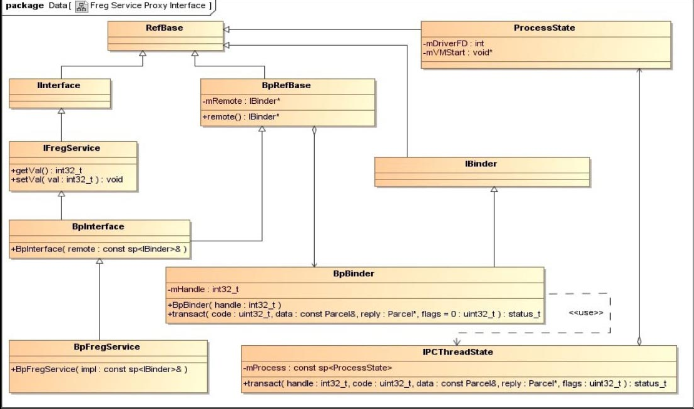

## 5.9　 `Service` 代理对象的获取过程
 `Service` 组件将自己注册到 `Service Manager` 中之后，它就在 `Server` 进程中等待 `Client` 进程将进程间通信请求发送过来。 `Client` 进程为了和运行在 `Server` 进程中的 `Service` 组件通信，首先要获得它的一个代理对象，这是通过 `Service Manager` 提供的 `Service` 组件查询服务来实现的。在本节中，我们将以 `5.3` 小节中介绍的应用程序 `FregClient` 为例，详细分析一个 `Service` 代理对象的获取过程。

`FregService` 代理对象的类型为 `BpFregService` ，它用来描述一个实现了 `IFregService` 接口的 `Client` 组件。根据前面 `5.2` 小节中的图 `5-16` 所描述的 `Client` 组件实现原理图，我们将图中的 `IXXXXXX` 接口和 `BpXXXXXX` 类直接替换为 `IFregService` 接口和 `BpFregService` 类，就可以得到 `FregService` 代理对象的类关系图，如图 `5-24` 所示。



为了创建一个 `FregService` 代理对象，即一个 `BpFregService` 对象，首先要通过 `Binder` 驱动程序来获得一个引用了运行在 `FregServer` 进程中的 `FregService` 组件的 `Binder` 引用对象的句柄值，然后再通过这个句柄值创建一个 `Binder` 代理对象，即一个 `BpBinder` 对象，最后将这个 `Binder` 代理对象封装成一个 `FregService` 代理对象。

 `Service Manager` 代理对象的成员函数 `getService` 提供了获取一个 `Service` 组件的代理对象的功能，而 `Service Manager` 代理对象可以通过 `Binder` 库提供的函数 `defaultServiceManager` 来获得。在调用 `Service Manager` 代理对象的成员函数 `getService` 来获得一个 `Service` 组件的代理对象时，需要指定这个 `Service` 组件注册到 `Service Manager` 中的名称。

在前面的 `5.3 `小节中，`FregClient` 进程获得运行在 `FregServer` 进程中的 `Service` 组件 `FregService` 的代理对象的代码片段如下所示。

`external/binder/client/FregClient.cpp`
```cpp
int main(){
    sp<IBinder> binder = defaultServiceManager()->getService(String16(FREG_SERVICE));
    if (binder == NULL){
        LOGE("Failed to get freg service: %s.\n", FREG_SERVICE);
        return -1;
    }
    sp<IFregService> service = IFregService::asInterface(binder);
    if (service == NULL){
        LOGE("Failed to get freg service interface.\n");
        return -2;
    }
	......
}
```
第 `3` 行首先调用 `Binder` 库提供的函数 `defaultServiceManager` 在 `FregClient` 进程中获得一个 `Service Manager` 代理对象，接着再调用它的成员函数 `getService` 来获得一个名称为 `FREG_SERVICE` 的 `Service` 组件的代理对象。由于前面获得的 `Service` 组件的代理对象的类型为 `BpBinder` ，因此，第 `9` 行需要通过 `IFregService` 类的静态成员函数 `asInterface` 将它封装成一个 `BpFregService` 类型的代理对象，并且获得它的一个 `IFregService` 接口，最后就可以通过这个接口来向运行在 `FregServer` 进程中的 `Service` 组件 `FregService` 发送进程间通信请求了。

接下来，我们就分别分析 `Service Manager` 代理对象的成员函数 `getService` 和 `IFregService` 类的静态成员函数 `asInterface` 的实现。

 `Service Manager` 代理对象的成员函数 `getService` 的实现如下所示。

`frameworks/base/libs/binder/IServiceManager.cpp`
```cpp
class BpServiceManager : public BpInterface<IServiceManager>
{
public:
    ......

    virtual sp<IBinder> getService(const String16& name) const
    {
        unsigned n;
        for (n = 0; n < 5; n++){
            sp<IBinder> svc = checkService(name);
            if (svc != NULL) return svc;
            LOGI("Waiting for service %s...\n", String8(name).string());
            sleep(1);
        }
        return NULL;
    }
    ......
};
```
这个函数最多会尝试 `5` 次来获得一个名称为 `name` 的 `Service` 组件的代理对象。如果上一次获得失败，那么第 `13` 行就调用函数 `sleep` 使得当前线程睡眠 `1` 毫秒，然后再重新去获取；否则，第 `11` 行就直接将获得的 `Service` 组件的代理对象返回给调用者。

第 `10` 行调用了成员函数 `checkService` 来获得一个名称为 `name` 的 `Service` 组件的代理对象，它的实现如下所示。

`frameworks/base/libs/binder/IServiceManager.cpp`
```cpp
class BpServiceManager : public BpInterface<IServiceManager>
{
public:
    ......

    virtual sp<IBinder> checkService( const String16& name) const
    {
        Parcel data, reply;
        data.writeInterfaceToken(IServiceManager::getInterfaceDescriptor());
        data.writeString16(name);
        remote()->transact(CHECK_SERVICE_TRANSACTION, data, &reply);
        return reply.readStrongBinder();
    }
    ......
};
```
与在前面 `5.8` 小节中分析的 `Service Manager` 代理对象的成员函数 `addService` 的实现类似， `Service Manager` 代理对象的成员函数 `getService` 也是通过内部一个句柄值为 `0` 的 `Binder` 代理对象来与 `Service Manager` 通信的。两者的区别在于请求 `Service Manager` 执行的操作不同，其中，前者请求 `Service Manager` 执行一个 `ADD_SERVICE_TRANSACTION` 操作，而后者请求 `Service Manager` 执行一个 `CHECK_SERVICE_TRANSACTION` 操作。

 `Service Manager` 代理对象的成员函数 `getService` 实现的是一个标准的 `Binder` 进程间通信过程，它可以划分为下面五个步骤。

1. `FregClient` 进程将进程间通信数据，即要获得其代理对象的 `Service` 组件 `FregService` 的名称，封装在一个 `Parcel` 对象中，用来传递给 `Binder` 驱动程序。

2. `FregClient` 进程向 `Binder` 驱动程序发送一个 `BC_TRANSACTION` 命令协议， `Binder` 驱动程序根据协议内容找到 `Service Manager` 进程之后，就会向 `FregClient` 进程发送一个 `BR_TRANSACTION_COMPLETE` 返回协议，表示它的进程间通信请求已经被接受。 `FregClient` 进程接收到 `Binder` 驱动程序发送给它的 `BR_TRANSACTION_COMPLETE` 返回协议，并且对它进行处理之后，就会再次进入到 `Binder` 驱动程序中去等待 `Service Manager` 进程将它要获取的 `Binder` 代理对象的句柄值返回来。

3. `Binder` 驱动程序在向 `FregClient` 进程发送 `BR_TRANSACTION_COMPLETE` 返回协议的同时，也会向 `Service Manager` 进程发送一个 `BR_TRANSACTION` 返回协议，请求 `Service Manager` 进程执行一个 `CHECK_SERVICE_TRANSACTION` 操作。

4.  `Service Manager` 进程执行完成 `FregClient` 进程请求的 `CHECK_SERVICE_TRANSACTION` 操作之后，就会向 `Binder` 驱动程序发送一个 `BC_REPLY` 命令协议，协议内容包含了 `Service` 组件 `FregService` 的信息。 `Binder` 驱动程序根据协议内容中的 `Service` 组件 `FregService` 的信息为 `FregClient` 进程创建一个 `Binder` 引用对象，接着就会向 `Service Manager` 进程发送一个 `BR_TRANSACTION_COMPLETE` 返回协议，表示它返回的 `Service` 组件 `FregService` 的信息已经收到了。 `Service Manager` 进程接收到 `Binder` 驱动程序发送给它的 `BR_TRANSACTION_COMPLETE` 返回协议，并且对它进行处理之后，一次进程间通信过程就结束了，接着它会再次进入到 `Binder` 驱动程序中去等待下一次进程间通信请求。

5. `Binder` 驱动程序在向 `Service Manager` 进程发送 `BR_TRANSACTION_COMPLETE` 返回协议的同时，也向 `FregClient` 进程发送一个 `BR_REPLY` 返回协议，协议内容包含了前面所创建的一个 `Binder` 引用对象的句柄值，这时候 `FregClient` 进程就可以通过这个句柄来创建一个 `Binder` 代理对象。

由于这是一个标准的 `Binder` 进程间通信过程，并且我们已经在前面的 `5.8.1` 小节中详细分析过这五个步骤了，因此，在介绍获取 `Service` 组件 `FregSerivce` 的代理对象的过程中，我们只分析以下三个子过程。

1. `Service Manager` 进程处理操作代码为 `CHECK_SERVICE_TRANSACTION` 的进程间通信请求的过程。

2. `Binder` 驱动程序为 `FregClient` 进程创建一个引用了 `Service` 组件 `FregService` 的 `Binder` 引用对象的过程。

3. `Binder` 库为 `FregClient` 进程创建一个 `Binder` 代理对象的过程。

从前面 `5.8.1.3` 的内容可以知道， `Service Manager` 是统一在函数 `svcmgr_handler` 中处理来自 `Client` 进程的进程间通信请求的，它处理操作代码为 `CHECK_SERVICE_TRANSACTION` 的进程间通信请求的过程如下所示。

`frameworks/base/cmds/servicemanager/service_manager.c`
```cpp
01 int svcmgr_handler(struct binder_state *bs,
02                    struct binder_txn *txn,
03                    struct binder_io *msg,
04                    struct binder_io *reply)
05 {
06     struct svcinfo *si;
07     uint16_t *s;
08     unsigned len;
09     void *ptr;
10     ......
11 
12     switch(txn->code) {
13     case SVC_MGR_GET_SERVICE:
14     case SVC_MGR_CHECK_SERVICE:
15         s = bio_get_string16(msg, &len);
16         ptr = do_find_service(bs, s, len);
17         if (!ptr)
18             break;
19         bio_put_ref(reply, ptr);
20         return 0;
21     ......
22     }
23 
24     bio_put_uint32(reply, 0);
25     return 0;
26 }
```
`FregClient` 进程传递过来的 `Service` 组件 `FregService` 的名称为 `FREG_SERVICE` ，即 "CKCat.FregService" ，第 `15` 行调用函数 `bio_get_string16` 将它从 `binder_io` 结构体 `msg` 的数据缓冲区中获取回来，接着第 `16` 行调用函数 `do_find_service` 在已注册 `Service` 组件列表 `svclist` 中查找与它对应的一个 `svcinfo` 结构体。

函数 `do_find_service` 的实现如下所示。

`frameworks/base/cmds/servicemanager/service_manager.c`
```cpp
01 void *do_find_service(struct binder_state *bs, uint16_t *s, unsigned len)
02 {
03     struct svcinfo *si;
04     si = find_svc(s, len);
05 
06 
07     if (si && si->ptr) {
08         return si->ptr;
09     } else {
10         return 0;
11     }
12 }
```
第 `4` 行调用函数 `find_svc` 来查找与字符串 `s` 对应的一个 `svcinfo` 结构体 `si` 。在前面的 `5.8.1.3` 小节中，我们已经分析过函数 `find_svc` 的实现了，它通过遍历已注册 `Service` 组件列表 `svclist` 来查找与字符串 `s` 对应的一个 `svcinfo` 结构体。如果找到了与字符串 `s` 对应的 `svcinfo` 结构体 `si` ，并且它的成员变量 `ptr` 的值不为 `0` ，即第 `7` 行的 `if` 语句为 `true` ，那么第 `8` 行就将它的成员变量 `ptr` 的值返回给调用者。

从前面 `5.8.1.3` 小节的内容可以知道，结构体 `svcinfo` 的成员变量 `ptr` 保存的是一个引用了注册到 `Service Manager` 中的 `Service` 组件的 `Binder` 引用对象的句柄值。当 `Service Manager` 将这个句柄值返回给 `Binder` 驱动程序时， `Binder` 驱动程序就可以根据它找到相应的 `Binder` 引用对象，接着找到该 `Binder` 引用对象所引用的 `Binder` 实体对象，最后 `Binder` 驱动程序就可以在请求获取该 `Service` 组件的代理对象的 `Client` 进程中创建另一个 `Binder` 引用对象了。

返回到函数 `svcmgr_handler` 中，接着第 `19` 行将前面获得的一个句柄值封装成一个 `binder_object` 结构体，并且写入到 `binder_io` 结构体 `reply` 中，以便可以将它返回给 `Binder` 驱动程序，这是通过调用函数 `bio_put_ref` 来实现的。

函数 `bio_put_ref` 的实现如下所示。

`frameworks/base/cmds/servicemanager/binder.c`
```cpp
01 void bio_put_ref(struct binder_io *bio, void *ptr)
02 {
03     struct binder_object *obj;
04 
05     if (ptr)
06         obj = bio_alloc_obj(bio);
07     else
08         obj = bio_alloc(bio, sizeof(*obj));
09 
10     if (!obj)
11         return;
12 
13     obj->flags = 0x7f | FLAT_BINDER_FLAG_ACCEPTS_FDS;
14     obj->type = BINDER_TYPE_HANDLE;
15     obj->pointer = ptr;
16     obj->cookie = 0;
17 }
```
由于传进来的参数 `ptr` 的值不等于 `0` ，因此，第 `6` 行就调用函数 `bio_alloc_obj` 在 `binder_io` 结构体 `bio` 的数据缓冲区中分配一个 `binder_object` 结构体 `obj` 。

函数 `bio_alloc_obj` 的实现如下所示。

`frameworks/base/cmds/servicemanager/binder.c`
```cpp
01 static struct binder_object *bio_alloc_obj(struct binder_io *bio)
02 {
03     struct binder_object *obj;
04 
05     obj = bio_alloc(bio, sizeof(*obj));
06     
07     if (obj && bio->offs_avail) {
08         bio->offs_avail--;
09         *bio->offs++ = ((char*) obj) - ((char*) bio->data0);
10         return obj;
11     }
12 
13     bio->flags |= BIO_F_OVERFLOW;
14     return 0;
15 }
```
第 `5` 行调用函数 `bio_alloc` 在 `binder_io` 结构体 `bio` 的数据缓冲区中分配一个未初始化的 `binder_object` 结构体 `obj` ，接着第 `7` 行到第 `11` 行代码在 `binder_io` 结构体 `bio` 的偏移数组中分配一个元素来保存 `binder_object` 结构体 `obj` 在数据缓冲区中的位置。这样 `Binder` 驱动程序就可以知道 `Service Manager` 给它返回的进程间通信结果数据中包含了一个 `Binder` 对象。

回到函数 `bio_put_ref` 中，第 `13` 行到第 `16` 行代码对前面从 `binder_io` 结构体 `bio` 的数据缓冲区中分配的 `binder_object` 结构体 `obj` 进行初始化。第 `14` 行将 `binder_object` 结构体 `obj` 所描述的 `Binder` 对象的类型设置为 `BINDER_TYPE_HANDLE` ，接着第 `15` 行又将这个 `Binder` 对象的句柄值设置为 `ptr` 。

回到函数 `svcmgr_handler` 中，现在要返回给 `Binder` 驱动程序的进程间通信结果数据都保存在 `binder_io` 结构体 `reply` 中了。接着它又返回到函数 `binder_parse` 中，最后调用函数 `binder_send_reply` 将 `binder_io` 结构体 `reply` 的内容返回给 `Binder` 驱动程序，这是通过向 `Binder` 驱动程序发送一个 `BC_REPLY` 命令协议来实现的。

在前面的 `5.8.1.4` 小节中，我们已经分析过函数 `binder_send_reply` 向 `Binder` 驱动程序发送一个 `BC_REPLY` 命令协议的过程了。 `Binder` 驱动程序接收到 `Service Manager` 发送给它的 `BC_REPLY` 命令协议之后，就在函数 `binder_transaction` 中对它进行处理，如下所示。

`kernel/drivers/staging/android/binder.c`
```cpp
01 static void
02 binder_transaction(struct binder_proc *proc, struct binder_thread *thread,
03 	struct binder_transaction_data *tr, int reply)
04 {
05 	struct binder_transaction *t;
06 	struct binder_work *tcomplete;
07 	size_t *offp, *off_end;
08 	struct binder_proc *target_proc;
09 	struct binder_thread *target_thread = NULL;
10 	struct binder_node *target_node = NULL;
11 	struct list_head *target_list;
12 	wait_queue_head_t *target_wait;
13 	struct binder_transaction *in_reply_to = NULL;
14     ......
15 
16 	t = kzalloc(sizeof(*t), GFP_KERNEL);
17     ......
18 
19 	tcomplete = kzalloc(sizeof(*tcomplete), GFP_KERNEL);
20     ......
21     
22 	offp = (size_t *)(t->buffer->data + ALIGN(tr->data_size, sizeof(void *)));
23 
24     ......
25     
26 	off_end = (void *)offp + tr->offsets_size;
27     
28 	for (; offp < off_end; offp++) {
29 		struct flat_binder_object *fp;
30         ......
31 		fp = (struct flat_binder_object *)(t->buffer->data + *offp);
32 		switch (fp->type) {
33         ......
34 		case BINDER_TYPE_HANDLE:
35 		case BINDER_TYPE_WEAK_HANDLE: {
36 			struct binder_ref *ref = binder_get_ref(proc, fp->handle);
37             ......
38 			if (ref->node->proc == target_proc) {
39                 ......
40 			} else {
41 				struct binder_ref *new_ref;
42 				new_ref = binder_get_ref_for_node(target_proc, ref->node);
43                 ......
44 				fp->handle = new_ref->desc;
45 				binder_inc_ref(new_ref, fp->type == BINDER_TYPE_HANDLE, NULL);
46 	            ......
47 			}
48 		} break;
49         ......
50         }
51 	}
52     
53 	t->work.type = BINDER_WORK_TRANSACTION;
54 	list_add_tail(&t->work.entry, target_list);
55 	tcomplete->type = BINDER_WORK_TRANSACTION_COMPLETE;
56 	list_add_tail(&tcomplete->entry, &thread->todo);
57 	if (target_wait)
58 		wake_up_interruptible(target_wait);
59 	return;
60 
61     ......
62 }
```
在前面的 `5.8.1.4` 小节中，我们已经分析过函数 `binder_transaction` 处理 `BC_REPLY` 命令协议的过程了，这里只关注它处理进程间通信结果数据中的 `Binder` 对象的过程，即第 `28` 行到第 `51` 行的 `for` 循环的处理逻辑。

从前面的调用过程可以知道， `Service Manager` 进程返回给 `Binder` 驱动程序的进程间通信结果数据中包含了一个类型为 `BINDER_TYPE_HANDLE` 的 `binder_object` 结构体，即一个 `flat_binder_object` 结构体。因此，第 `36` 行到第 `47` 行代码就需要对这个 `flat_binder_object` 结构体进行处理。

第 `36` 行根据 `flat_binder_object` 结构体 `fp` 的句柄值在进程 `proc` 中找到对应的 `Binder` 引用对象 `ref` 。由于 `Binder` 引用对象 `ref` 所引用的 `Binder` 本地对象是运行在 `FregServer` 进程中的 `Service` 组件 `FregService` ，而目标进程 `target_proc` 指向了要获取 `Service` 组件 `FregService` 的代理对象的 `FregClient` 进程，因此，第 `38` 行的 `if` 语句为 `false` ，接下来就会调用第 `41` 行到第 `45` 行代码。

第 `42` 行调用函数 `binder_get_ref_for_node` 在 `FregClient` 进程中查找是否已经存在一个 `Binder` 引用对象，它引用了 `Binder` 实体对象 `ref->node` ，即引用了 `Service` 组件 `FregService` 。如果不存在，那么函数 `binder_get_ref_for_node` 就会为 `FregClient` 进程创建一个引用了 `Service` 组件 `FregService` 的 `Binder` 引用对象，并且返回给调用者；否则，就直接将该 `Binder` 引用对象返回给调用者。

第 `44` 行将 `flat_binder_object` 结构体 `fp` 的句柄值修改为 `FregClient` 进程创建的一个 `Binder` 引用对象 `new_ref` 的句柄值。因为接下来 `Binder` 驱动程序需要将 `flat_binder_object` 结构体 `fp` 返回给 `FregClient` 进程，以便 `FregClient` 进程可以根据这个句柄值创建一个引用了 `Service` 组件 `FregService` 的 `Binder` 代理对象。

第 `45` 行调用函数 `binder_inc_ref` 增加 `Binder` 引用对象 `new_ref` 的引用计数，因为它被保存在 `binder_transaction` 结构体t的内核缓冲区 `buffer` 中，即被 `binder_transaction` 结构体 `t` 的内核缓冲区 `buffer` 引用了。等到 `binder_transaction` 结构体 `t` 的内核缓冲区 `buffer` 被释放时， `Binder` 驱动程序就会相应地减少 `Binder` 引用对象 `new_ref` 的引用计数。

第 `53` 行和第 `54` 行将 `binder_transaction` 结构体 `t` 封装成一个类型为 `BINDER_WORK_TRANSACTION` 的工作项添加到目标进程 `target_proc` 或者目标线程 `target_thread` 的 `todo` 队列中，并且第 `58` 行将目标进程 `target_proc` 或者目标线程 `target_thread` 唤醒，以便它们可以处理这个工作项。

第 `55` 行和第 `56` 行将 `binder_work` 结构体 `tcomplete` 封装成一个类型为 `BINDER_WORK_TRANSACTION_COMPLETE` 的工作项添加到源线程 `thread` 的 `todo` 队列中，以便它从 `Binder` 驱动程序返回到用户空间之前，可以处理该工作项。

接下来，我们假设类型为 `BINDER_WORK_TRANSACTION` 的工作项是添加到目标线程 `target_thread` 的 `todo` 队列中的，即添加到调用 `Service Manager` 代理对象的成员函数 `getService` 来获得一个 `Service` 组件 `FregService` 的代理对象的 `FregClient` 线程的 `todo` 队列中。当这个目标线程 `target_thread` 被唤醒之后，它就会继续执行 `Binder` 驱动程序中的函数 `binder_thread_read` ，最终获得了一个 `BR_REPLY` 返回协议，协议内容包含了前面为 `FregClient` 进程创建的 `Binder` 引用对象 `new_ref` 的句柄值。

目标线程 `target_thread` 返回到用户空间之后，就在 `IPCThreadState` 类的成员函数 `waitForResponse` 中处理从 `Binder` 驱动程序中读取回来的 `BR_REPLY` 返回协议，它主要是将协议内容，即进程间通信结果数据封装在一个 `Parcel` 对象 `reply` 中，最后返回到 `Service Manager` 代理对象的成员函数 `checkService` 中。

为了方便描述，我们将 `Service Manager` 代理对象的成员函数 `checkService` 的代码重新列出来，如下所示。

`frameworks/base/libs/binder/IServiceManager.cpp`
```cpp
01 class BpServiceManager : public BpInterface<IServiceManager>
02 {
03 public:
04     ......
05 
06     virtual sp<IBinder> checkService( const String16& name) const
07     {
08         Parcel data, reply;
09         data.writeInterfaceToken(IServiceManager::getInterfaceDescriptor());
10         data.writeString16(name);
11         remote()->transact(CHECK_SERVICE_TRANSACTION, data, &reply);
12         return reply.readStrongBinder();
13     }
14     ......
15 };
```
当前线程从 `IPCThreadState` 类的成员函数 `waitForResponse` 返回到 `Service Manager` 代理对象的成员函数 `checkService` 之后，第 `12` 行就调用 `Parcel` 对象 `reply` 的成员函数 `readStrongBinder` 来获得一个 `Binder` 代理对象。

`Parcel` 类的成员函数 `readStrongBinder` 的实现如下所示。

`frameworks/base/libs/binder/Parcel.cpp`
```cpp
1 sp<IBinder> Parcel::readStrongBinder() const
2 {
3     sp<IBinder> val;
4     unflatten_binder(ProcessState::self(), *this, &val);
5     return val;
6 }
```
从前面的调用过程可以知道， `Parcel` 对象 `reply` 内部的数据缓冲区保存了 `Binder` 驱动程序返回给当前线程的进程间通信结果数据，即它里面包含了一个类型为 `BINDER_TYPE_HANDLE` 的 `flat_binder_object` 结构体，因此，第 `4` 行就调用函数 `unflatten_binder` 来获得这个 `flat_binder_object` 结构体。

函数 `unflatten_binder` 的实现如下所示。

`frameworks/base/libs/binder/Parcel.cpp`
```cpp
01 status_t unflatten_binder(const sp<ProcessState>& proc,
02     const Parcel& in, sp<IBinder>* out)
03 {
04     const flat_binder_object* flat = in.readObject(false);
05     
06     if (flat) {
07         switch (flat->type) {
08             ......
09             case BINDER_TYPE_HANDLE:
10                 *out = proc->getStrongProxyForHandle(flat->handle);
11                 return finish_unflatten_binder(
12                     static_cast<BpBinder*>(out->get()), *flat, in);
13         }        
14     }
15     return BAD_TYPE;
16 }
```
从 `Parcel` 对象 `in` 获得的 `flat_binder_object` 结构体 `flat` 的类型为 `BINDER_TYPE_HANDLE` ，因此，第 `10` 行就调用当前进程的 `ProcessState` 对象 `proc` 的成员函数 `getStrongProxyForHandle` 来查找一个与它的句柄值相对应的 `Binder` 代理对象，即一个 `BpBinder` 对象。

在前面的 `5.7` 小节中介绍 `Service Manager` 代理对象的获取过程时，我们已经分析过 `ProcessState` 类的成员函数 `getStrongProxyForHandle` 的实现了。它首先在内部的一个 `Binder` 代理对象列表中检查是否已经存在一个与 `flat_binder_object` 结构体 `flat` 的句柄值 `handle` 相对应的 `Binder` 代理对象。如果存在，就将它返回给调用者；否则，就会使用 `flat_binder_object` 结构体 `flat` 的句柄值 `handle` 来创建一个 `Binder` 代理对象，然后再返回给调用者。由于 `flat_binder_object` 结构体 `flat` 的句柄值 `handle` 是一个引用了 `Service` 组件 `FregService` 的 `Binder` 引用对象的句柄值，因此，从 `ProcessState` 类的成员函数 `getStrongProxyForHandle` 返回来的 `Binder` 代理对象也是引用了 `Service` 组件 `FregService` 的。

 `Service Manager` 代理对象的成员函数 `checkService` 执行完成之后，就将一个 `Binder` 代理对象的 `IBinder` 接口返回给 `FregClient` 进程的入口函数 `main` ，接着该函数就继续调用 `IFregService` 类的静态成员函数 `asInterface` 将该 `Binder` 代理对象封装成一个类型为 `BpFregService` 的 `Binder` 代理对象。

`IFregService` 类的静态成员函数 `asInterface` 是通过宏 `IMPLEMENT_META_INTERFACE` 来定义的，它的实现如下所示。

```cpp
    android::sp<IFregService> IFregService::asInterface(                
            const android::sp<android::IBinder>& obj)                   
    {                                                                   
        android::sp<IFregService> intr;                                 
        if (obj != NULL) {                                              
            intr = static_cast<IFregService*>(                          
                obj->queryLocalInterface(                               
                        IFregService::descriptor).get());               
            if (intr == NULL) {                                         
                intr = new BpFregService(obj);                          
            }                                                           
        }                                                               
        return intr;                                                    
    }
```
参数 `obj` 指向的是前面获得的一个 `Binder` 代理对象，即一个 `BpBinder` 对象，它的成员函参数 `obj` 指向的是前面获得的一个 `Binder` 代理对象，即一个 `BpBinder` 对象，它的成员函数 `queryLocalInterface` 的返回值为 `NULL` 。因此，第 `10` 行将这个 `Binder` 代理对象封装成一个 `BpFregService` 类型的 `Binder` 代理对象，并且将它的 `IFregService` 接口返回给调用者。

至此， `FregClient` 进程就成功地通过 `Service Manager` 获得了一个运行在 `FregServer` 进程中的 `Service` 组件 `FregService` 的代理对象。有了这个代理对象之后， `FregClient` 进程就可以向 `Service` 组件 `FregService` 发送进程间通信请求了，即可以使用它提供的服务了。