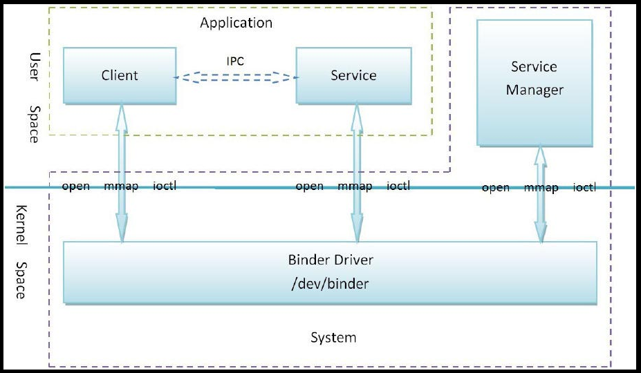

# 第5章　Binder进程间通信系统

Android应用程序是由Activity、Service、Broadcast Receiver和Content Provider四种类型的组件构成的，它们有可能运行在同一个进程中，也有可能运行在不同的进程中。此外，各种系统组件也运行在独立的进程中，例如，Activity管理服务ActivityManagerService和Package管理服务PackageManagerService都运行在系统进程System中。那么，这些运行在不同进程中的应用程序组件和系统组件是如何通信的呢？

我们知道，Android系统是基于Linux内核开发的。Linux内核提供了丰富的进程间通信机制，如管道（Pipe）、信号（Signal）、消息队列（Message）、共享内存（Share Memory）和插口（Socket）等。然而，Android系统并没有采用这些传统的进程间通信机制，而是开发了一套新的进程间通信机制——Binder。与传统的进程间通信机制相比，Binder进程间通信机制在进程间传输数据时，只需要执行一次拷贝操作，因此，它不仅提高了效率，而且节省了内存空间【4】。

Binder进程间通信机制是在OpenBinder的基础上实现的【5】，它采用CS通信方式，其中，提供服务的进程称为Server进程，而访问服务的进程称为Client进程。同一个Server进程可以同时运行多个组件来向Client进程提供服务，这些组件称为Service组件【6】。同时，同一个Client进程也可以同时向多个Service组件请求服务，每一个请求都对应有一个Client组件，或者称为Service代理对象。Binder进程间通信机制的每一个Server进程和Client进程都维护一个Binder线程池来处理进程间的通信请求，因此，Server进程和Client进程可以并发地提供和访问服务。Server进程和Client进程的通信要依靠运行在内核空间的Binder驱动程序来进行。Binder驱动程序向用户空间暴露了一个设备文件/dev/binder，使得应用程序进程可以间接地通过它来建立通信通道。Service组件在启动时，会将自己注册到一个Service Manager组件中，以便Client组件可以通过Service Manager组件找到它。因此，我们将Service Manager组件称为Binder进程间通信机制的上下文管理者，同时由于它也需要与普通的Server进程和Client进程通信，我们也将它看作是一个Service组件，只不过它是一个特殊的Service组件。

以上描述的Binder进程间通信机制中涉及了Client、Service、Service Manager和Binder驱动程序四个角色，它们的关系如图5-1所示。

从图5-1可以看出，Client、Service和Service Manager运行在用户空间，而Binder驱动程序运行在内核空间，其中，Service Manager和Binder驱动程序由系统负责提供，而Client和Service组件由应用程序来实现。Client、Service和Service Manager均是通过系统调用open、mmap和ioctl来访问设备文件/dev/binder，从而实现与Binder驱动程序的交互，而交互的目的就是为了能够间接地执行进程间通信。

在本章内容中，我们首先分析Binder驱动程序的基础知识，然后介绍它在用户空间中的一个Binder进程间通信库。了解了这些知识点之后，再通过一个实例说明应用程序进程是如何使用Binder进程间通信库来通信的。接着我们再继续进一步分析Binder驱动程序的实现原理，包括Binder对象的引用计数技术和死亡通知机制。

在Android系统中，Binder进程间通信机制的使用是相当广泛的，因此，掌握Binder进程间通信机制，对理解整个Android系统的实现是有非常大的帮助的。为了进一步加深对Binder进程间通信机制的理解，我们分析了Binder进程间通信机制的四个使用情景，分别是：
    （1）Service Manager的启动过程。
    （2）Service Manager代理对象的获取过程。
    （3）Service组件的启动过程。
    （4）Service代理对象的获取过程。

上述四个使用情景都是基于Binder进程间通信机制的C/C++实现来分析的。由于Android应用程序是使用Java语言开发的，因此，在本章的最后一节中，我们将详细介绍Binder进程间通信机制的Java调用接口。
