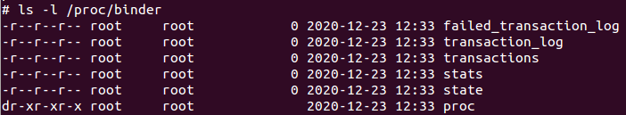

# 主要结构体
Binder驱动中包含了很多的结构体。为了便于下文讲解，这里我们先对这些结构体做一些介绍。

驱动中的结构体可以分为两类。

## 第一类
一类是与用户空间共用的，这些结构体在 `Binder` 通信协议过程中会用到。因此，这些结构体定义在 `binder.h` 中，包括：

| 结构体名称              | 说明                                           |
| ----------------------- | ---------------------------------------------- |
| flat_binder_object      | 描述在 Binder IPC 中传递的对象，见下文           |
| **binder_write_read**       | 存储一次读写操作的数据                         |
| binder_version          | 存储 Binder 的版本号                             |
| transaction_flags       | 描述事务的 flag ，例如是否是异步请求，是否支持fd |
| **binder_transaction_data** | 存储一次事务的数据                             |
| binder_ptr_cookie       | 包含了一个指针和一个cookie                     |
| binder_handle_cookie    | 包含了一个句柄和一个cookie                     |
| binder_pri_desc         | 暂未用到                                       |
| binder_pri_ptr_cookie   | 暂未用到                                       |

这其中， `binder_write_read` 和 `binder_transaction_data` 这两个结构体最为重要，它们存储了IPC调用过程中的数据。

## 第二类
Binder驱动中，还有一类结构体是仅仅Binder驱动内部实现过程中需要的，它们定义在binder.c中，包括：

| 结构体名称                   | 说明                                     |
| ---------------------------- | ---------------------------------------- |
| **binder_node**                  | 描述 Binder 实体节点，即：对应了一个Server |
| **binder_ref**                   | 描述对于 Binder 实体的引用                 |
| **binder_buffer**                | 描述 Binder 通信过程中存储数据的Buffer     |
| **binder_proc**                  | 描述使用 Binder 的进程                     |
| **binder_thread**                | 描述使用 Binder 的线程                     |
| binder_work                  | 描述通信过程中的一项任务                 |
| binder_transaction           | 描述一次事务的相关信息                   |
| binder_deferred_state        | 描述延迟任务                             |
| binder_ref_death             | 描述 Binder 实体死亡的信息                 |
| binder_transaction_log       | debugfs 日志                              |
| binder_transaction_log_entry | debugfs 日志条目                          |

# Binder协议

Binder协议可以分为控制协议和驱动协议两类。

控制协议是进程通过ioctl(“/dev/binder”) 与Binder设备进行通讯的协议，该协议包含以下几种命令：

| 命令                     | 说明                                                        | 参数类型          |
| ------------------------ | ----------------------------------------------------------- | ----------------- |
| BINDER_WRITE_READ        | 读写操作，最常用的命令。IPC过程就是通过这个命令进行数据传递 | binder_write_read |
| BINDER_SET_MAX_THREADS   | 设置进程支持的最大线程数量                                  | size_t            |
| BINDER_SET_CONTEXT_MGR   | 设置自身为ServiceManager                                    | 无                |
| BINDER_THREAD_EXIT       | 通知驱动Binder线程退出                                      | 无                |
| BINDER_VERSION           | 获取Binder驱动的版本号                                      | binder_version    |
| BINDER_SET_IDLE_PRIORITY | 暂未用到                                                    | -                 |
| BINDER_SET_IDLE_TIMEOUT  | 暂未用到                                                    | -                 |

Binder的驱动协议描述了对于Binder驱动的具体使用过程。驱动协议又可以分为两类：

- 一类是binder_driver_command_protocol，描述了进程发送给Binder驱动的命令
- 一类是binder_driver_return_protocol，描述了Binder驱动发送给进程的命令

binder_driver_command_protocol共包含17个命令，分别是：

| 命令                          | 说明                                   | 参数类型                |
| ----------------------------- | -------------------------------------- | ----------------------- |
| BC_TRANSACTION                | Binder事务，即：Client对于Server的请求 | binder_transaction_data |
| BC_REPLY                      | 事务的应答，即：Server对于Client的回复 | binder_transaction_data |
| BC_FREE_BUFFER                | 通知驱动释放Buffer                     | binder_uintptr_t        |
| BC_ACQUIRE                    | 强引用计数+1                           | __u32                   |
| BC_RELEASE                    | 强引用计数-1                           | __u32                   |
| BC_INCREFS                    | 弱引用计数+1                           | __u32                   |
| BC_DECREFS                    | 弱引用计数-1                           | __u32                   |
| BC_ACQUIRE_DONE               | BR_ACQUIRE的回复                       | binder_ptr_cookie       |
| BC_INCREFS_DONE               | BR_INCREFS的回复                       | binder_ptr_cookie       |
| BC_ENTER_LOOPER               | 通知驱动主线程ready                    | void                    |
| BC_REGISTER_LOOPER            | 通知驱动子线程ready                    | void                    |
| BC_EXIT_LOOPER                | 通知驱动线程已经退出                   | void                    |
| BC_REQUEST_DEATH_NOTIFICATION | 请求接收死亡通知                       | binder_handle_cookie    |
| BC_CLEAR_DEATH_NOTIFICATION   | 去除接收死亡通知                       | binder_handle_cookie    |
| BC_DEAD_BINDER_DONE           | 已经处理完死亡通知                     | binder_uintptr_t        |
| BC_ATTEMPT_ACQUIRE            | 暂未实现                               | -                       |
| BC_ACQUIRE_RESULT             | 暂未实现                               | -                       |

binder_driver_return_protocol共包含18个命令，分别是：
| 返回类型                         | 说明                                   | 参数类型                |
| -------------------------------- | -------------------------------------- | ----------------------- |
| BR_OK                            | 操作完成                               | void                    |
| BR_NOOP                          | 操作完成                               | void                    |
| BR_ERROR                         | 发生错误                               | __s32                   |
| BR_TRANSACTION                   | 通知进程收到一次Binder请求（Server端） | binder_transaction_data |
| BR_REPLY                         | 通知进程收到Binder请求的回复（Client） | binder_transaction_data |
| BR_TRANSACTION_COMPLETE          | 驱动对于接受请求的确认回复             | void                    |
| BR_FAILED_REPLY                  | 告知发送方通信目标不存在               | void                    |
| BR_SPAWN_LOOPER                  | 通知Binder进程创建一个新的线程         | void                    |
| BR_ACQUIRE                       | 强引用计数+1请求                       | binder_ptr_cookie       |
| BR_RELEASE                       | 强引用计数-1请求                       | binder_ptr_cookie       |
| BR_INCREFS                       | 弱引用计数+1请求                       | binder_ptr_cookie       |
| BR_DECREFS                       | 若引用计数-1请求                       | binder_ptr_cookie       |
| BR_DEAD_BINDER                   | 发送死亡通知                           | binder_uintptr_t        |
| BR_CLEAR_DEATH_NOTIFICATION_DONE | 清理死亡通知完成                       | binder_uintptr_t        |
| BR_DEAD_REPLY                    | 告知发送方对方已经死亡                 | void                    |
| BR_ACQUIRE_RESULT                | 暂未实现                               | -                       |
| BR_ATTEMPT_ACQUIRE               | 暂未实现                               | -                       |
| BR_FINISHED                      | 暂未实现                               | -                       |

通过在 `/kernel/arch/arm/configs/goldfish_defconfig` 文件中开启 `CONFIG_DEBUG_FS=y` 选项可以产生 `Binder` 调试目录，如下图所示。

**注意**
> `/kernel/arch/arm/configs/goldfish_defconfig` 文件表示编译 `goldfish` 版的内核，如果需要编译其他版的内核，修改对应的文件即可。高版本的 `Android` 内核对应的 `binder` 调试目录可能不是 `/proc/binder` ，这里需要根据源码进行确认。