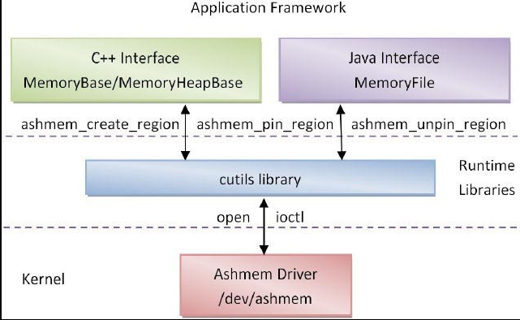

# 第6章 Ashmem匿名共享内存系统
Android系统实现了一个匿名共享内存（Anonymous Shared Memory）子系统，用来在应用程序之间共享数据。匿名共享内存与传统的Linux系统实现的共享内存一样，都是基于内核提供的临时文件系统tmpfs实现的【9】，但是前者对内存块进行了更为精细化的管理。应用程序可以动态地将一块匿名共享内存划分为若干个小块，当这些小块内存不再需要使用时，它们就可以被内存管理系统回收。通过这种动态的、分而治之的内存管理方式，Android系统就能够有效地使用系统内存，适应内存较小的移动设备环境。

匿名共享内存系统是以Ashmem驱动程序为基础的，系统中所有的匿名共享内存都由Ashmem驱动程序负责分配和管理。为了方便应用程序使用匿名共享内存，Android系统在运行时库cutils中提供了C接口来访问Ashmem驱动程序；同时，又在应用程序框架层中提供了更高级的C++和Java接口来访问运行时库cutils中的匿名共享内存C接口。上述Ashmem匿名共享内存系统的架构如图6-1所示。

在应用程序框架层中，提供了两个C++类MemoryBase和MemoryHeapBase，以及一个Java类MemoryFile来使用匿名共享内存；而在运行时库cutils中，主要提供了三个C函数ashmem_create_region、ashmem_pin_region和ashmem_unpin_region来访问Ashmem驱动程序。Ashmem驱动程序在启动时，会创建一个/dev/ashmem设备文件，这样，运行时库cutils中的匿名共享内存C接口就可以通过文件操作函数open和ioctl等来访问Ashmem驱动程序。

传统的Linux系统使用一个整数来标志一块共享内存，而Android系统则使用一个文件描述符来标志一块匿名共享内存。使用文件描述符来描述一块匿名共享内存有两个好处：一是可以方便地将它映射到进程的地址空间，从而可以直接访问它的内容；二是可以使用Binder进程间通信机制来传输这个文件描述符，从而实现在不同的应用程序之间共享一块匿名内存。Binder进程间通信机制使用一个类型为BINDER_TYPE_FD的Binder对象来描述一个文件描述符，当Binder驱动程序发现进程间通信数据中包含有这种Binder对象时，就会将对应的文件描述符复制到目标进程中，从而实现在两个进程中共享同一个文件。

接下来，我们就先分析Ashmem驱动程序的实现，接着再分析匿名共享内存系统在运行时库cutils中的C接口，以及在应用程序框架层中的C++和Java接口，最后结合Binder驱动程序来分析匿名共享内存在进程间的共享原理。