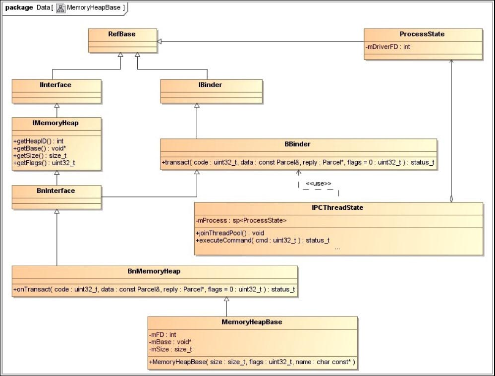
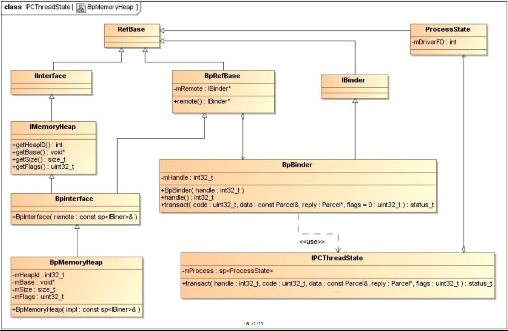
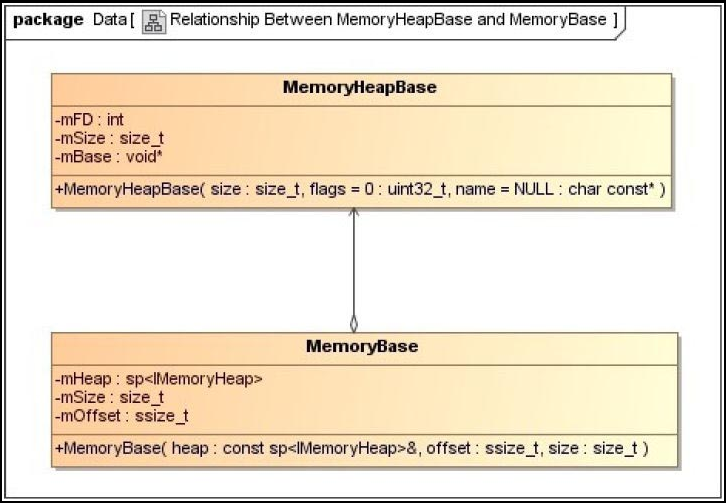
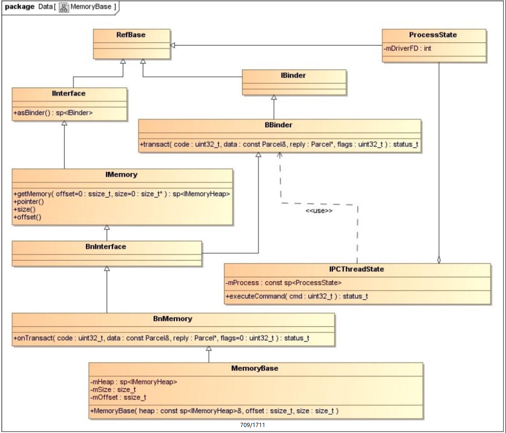
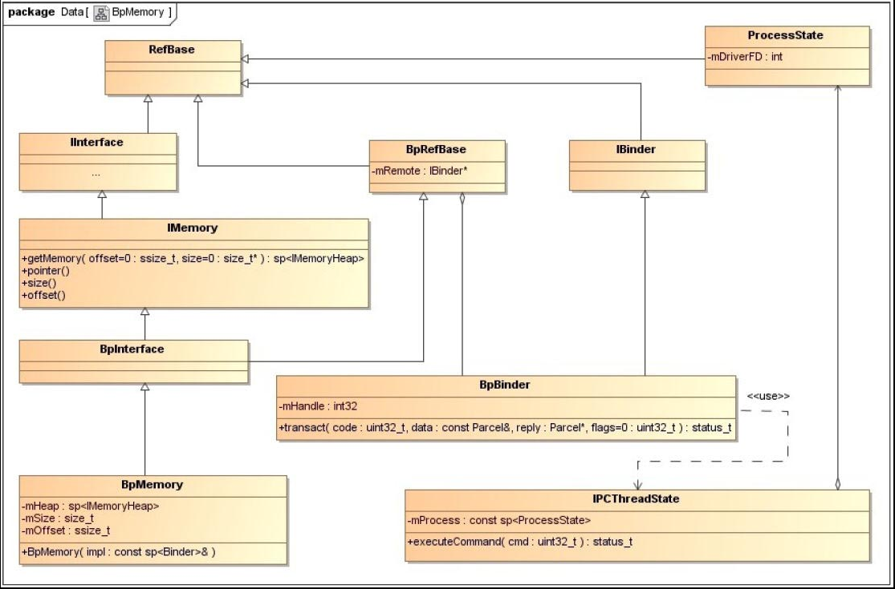

## 6.3　匿名共享内存的 C++ 访问接口
为了方便应用程序使用匿名共享内存， `Android` 系统在应用程序框架层中提供了两个 `C++` 类 `MemoryHeapBase` 和 `MemoryBase` 来创建和管理匿名共享内存。如果一个进程需要与其他进程共享一块完整的匿名共享内存，那么它就可以使用 `MemoryHeapBase` 类创建这块匿名共享内存。如果一个进程创建了一块匿名共享内存之后，只希望与其他进程共享其中的一部分，那么它就可以使用 `MemoryBase` 类来创建这块匿名共享内存。

 `MemoryBase` 类是在 `MemoryHeapBase` 类的基础上实现的，将它们实例化之后就得到一个 `Service` 组件，从而可以用来执行进程间通信，即将一块匿名共享内存从一个进程传输到另一个进程。接下来，我们首先分析 `MemoryHeapBase` 类的实现，然后再分析 `MemoryBase` 类的实现，最后通过一个应用实例来说明它们的使用方法。

### 6.3.1 MemoryHeapBase
前面提到， `MemoryHeapBase` 类的实例是一个 `Service` 组件，相应地，它会有一个对应的 `Client` 组件。我们知道， `Service` 组件必须要实现 `BnInterface` 接口，并且是运行在 `Server` 进程中的；而 `Client` 组件必须要实现 `BpInterface` 接口，并且是运行在 `Client` 进程中的。接下来，我们就首先分析 `MemoryHeapBase` 类在 `Server` 端的实现，然后再分析它在 `Client` 端的代理对象的实现。

#### 6.3.1.1 Server 端实现
在前面的 `5.2` 小节的图 `5-15` 中，我们描述了 `Service` 组件的实现原理，现在将图中的 `IXXXXXX` 接口以及 `BnXXXXXX` 和 `XXXXXX` 类直接替换为 `IMemoryHeap` 接口以及 `BnMemoryHeap` 和 `MemoryHeapBase` 类，就可以得到 `MemoryHeapBase` 类在 `Server` 端的实现关系图，如图 `6-3` 所示。



图 `6-3` 中的类按照其功能不同可以划分为三种类型。第一种类型是和业务相关的，即与匿名共享内存的创建和管理相关的，它们包括三个类 `IMemoryHeap` 、 `BnMemoryHeap` 和 `MemoryHeapBase` ；第二种类型是和 `Binder` 进程间通信机制相关的，它们包括六个类 `IInterface` 、 `IBinder` 、 `BBinder` 、 `BnInterface` 、 `ProcessState` 和 `IPCThreadState` ；第三种类型是和智能指针相关的，即 `RefBase` 类。在前面的第 `3` 章和第 `5` 章中，我们已经分析过后面两种类型的类的实现了，因此，在本节中，我们只关注与匿名共享内存创建和管理相关的三个类 `IMemoryHeap` 、 `BnMemoryHeap` 和 `MemoryHeapBase` 的实现。

`IMemoryBase` 类定义了 `MemoryHeapBase` 服务接口，它包含了四个成员函数 `getHeapID` 、 `getBase` 、 `getSize` 和 `getFlags` ，分别用来获取一个匿名共享内存块的文件描述符、映射地址、大小和访问保护位，它们的定义如下所示。

`frameworks/base/include/binder/IMemory.h`
```cpp
01 class IMemoryHeap : public IInterface
02 {
03 public:
04     ......
05 
06     virtual int         getHeapID() const = 0;
07     virtual void*       getBase() const = 0;
08     virtual size_t      getSize() const = 0;
09     virtual uint32_t    getFlags() const = 0;
10 
11     ......
12 };
```
`BnMemoryHeap` 类是一个 `Binder` 本地对象类，它只有一个成员函数 `onTransact` ，用来处理 `Client` 进程发送过来的 `HEAP_ID` 请求，如下所示。

`frameworks/base/libs/binder/IMemory.cpp`
```cpp
01 status_t BnMemory::onTransact(
02     uint32_t code, const Parcel& data, Parcel* reply, uint32_t flags)
03 {
04     switch(code) {
05         case GET_MEMORY: {
06             CHECK_INTERFACE(IMemory, data, reply);
07             ssize_t offset;
08             size_t size;
09             reply->writeStrongBinder( getMemory(&offset, &size)->asBinder() );
10             reply->writeInt32(offset);
11             reply->writeInt32(size);
12             return NO_ERROR;
13         } break;
14         default:
15             return BBinder::onTransact(code, data, reply, flags);
16     }
17 }
```
第 `7` 行到第 `9` 行代码分别调用由其子类重写的成员函数 `getHeapID` 、 `getSize` 和 `getFlags` 来获取一个匿名共享内存块的文件描述符、大小和访问保护位，并且将它们写入到 `Parcel` 对象 `reply` 中，以便可以将它们返回给 `Client` 进程。

`MemoryHeapBase` 类用来描述一个匿名共享内存服务，它继承了 `BnMemoryHeap` 类，并且实现了 `IMemoryBase` 接口的四个成员函数 `getHeapID` 、 `getBase` 、 `getSize` 和 `getFlags` ，它的定义如下所示。

`frameworks/base/include/binder/MemoryHeapBase.h`
```cpp
01 class MemoryHeapBase : public virtual BnMemoryHeap 
02 {
03 public:
04     ......
05     
06     /*
07      * maps memory from ashmem, with the given name for debugging
08      */
09     MemoryHeapBase(size_t size, uint32_t flags = 0, char const* name = NULL);
10 
11     virtual ~MemoryHeapBase();
12 
13     /* implement IMemoryHeap interface */
14     virtual int         getHeapID() const;
15     virtual void*       getBase() const;
16     virtual size_t      getSize() const;
17     virtual uint32_t    getFlags() const;
18     ......
19 private:
20     status_t mapfd(int fd, size_t size, uint32_t offset = 0);
21 
22     int         mFD;
23     size_t      mSize;
24     void*       mBase;
25     uint32_t    mFlags;
26     const char* mDevice;
27     bool        mNeedUnmap;
28 };
```
成员变量 `mFD` 是一个文件描述符，它是打开设备文件 `/dev/ashmem` 后得到的，用来描述一个匿名共享内存块；成员变量 `mSize` 、 `mBase` 和 `mFlags` 分别用来描述这块匿名共享内存块的一个匿名共享内存块；成员变量 `mSize` 、 `mBase` 和 `mFlags` 分别用来描述这块匿名共享内存块的大小、映射地址和访问保护位。

匿名共享内存服务 `MemoryHeapBase` 的内部包含了一块匿名共享内存，它的创建过程如下所示。

`frameworks/base/libs/binder/MemoryHeapBase.cpp`
```cpp
01 MemoryHeapBase::MemoryHeapBase(size_t size, uint32_t flags, char const * name)
02     : mFD(-1), mSize(0), mBase(MAP_FAILED), mFlags(flags),
03       mDevice(0), mNeedUnmap(false)
04 {
05     const size_t pagesize = getpagesize();
06     size = ((size + pagesize-1) & ~(pagesize-1));
07     int fd = ashmem_create_region(name == NULL ? "MemoryHeapBase" : name, size);
08     LOGE_IF(fd<0, "error creating ashmem region: %s", strerror(errno));
09     if (fd >= 0) {
10         if (mapfd(fd, size) == NO_ERROR) {
11             if (flags & READ_ONLY) {
12                 ashmem_set_prot_region(fd, PROT_READ);
13             }
14         }
15     }
16 }
```
参数 `size` 、 `flags` 和 `name` 分别表示要创建的匿名共享内存块的大小、访问保护位和名称，其中，参数 `name` 是可选的。

`Ashmem` 驱动程序为应用程序创建的匿名共享内存的大小是以页面为单位的，因此，第 `5` 行首先调用函数 `getpagesize` 获得一个页面的大小，接着第 `6` 行将参数 `size` 的大小对齐到页面边界，即如果参数 `size` 的大小不是页面大小的倍数，那么就增加它的值，使得它的大小是一个页面大小的整数倍。

第 `7` 行调用由运行时库 `cutils` 提供的函数 `ashmem_create_region` 来创建一块匿名共享内存，它的返回值是一个文件描述符 `fd` 。

**注意**
> 如果没有指定要创建的匿名共享内存的名称，即参数 `name` 的值为 `NULL` ，那么第 `7` 行就会使用 `"MemoryHeapBase"` 作为要创建的匿名共享内存的名称。

接着第 `10` 行调用成员函数 `mapfd` 将前面所创建的匿名共享内存块映射到进程的地址空间。最后第 `11` 行检查所创建的匿名共享内存块是否是只读的，即参数 `flags` 的 `READ_ONLY` 位是否等于 `1` 。如果是，那么第 `12` 行就调用由运行时库 `cutils` 提供的函数 `ashmem_set_prot_region` 来设置前面所创建的匿名共享内存的访问保护位。

在前面的 `6.2` 小节中，我们已经分析过函数 `ashmem_create_region` 和 `ashmem_set_prot_region` 的实现了。因此，接下来我们就重点分析 `MemoryHeapBase` 类的成员函数 `mapfd` 的实现，它的定义如下所示。

`frameworks/base/libs/binder/MemoryHeapBase.cpp`
```cpp
01 status_t MemoryHeapBase::mapfd(int fd, size_t size, uint32_t offset)
02 {
03     ......
04 
05     if ((mFlags & DONT_MAP_LOCALLY) == 0) {
06         void* base = (uint8_t*)mmap(0, size,
07                 PROT_READ|PROT_WRITE, MAP_SHARED, fd, offset);
08         if (base == MAP_FAILED) {
09             ......
10             close(fd);
11             return -errno;
12         }
13         ......
14         mBase = base;
15         mNeedUnmap = true;
16     } else  {
17         mBase = 0; // not MAP_FAILED
18         mNeedUnmap = false;
19     }
20     mFD = fd;
21     mSize = size;
22     return NO_ERROR;
23 }
```
如果 `MemoryHeapBase` 服务的成员变量 `mFlags` 的 `DONT_MAP_LOCALLY` 位等于 `1` ，即第 `5` 行的 `if` 语句为 `false` ，就表示不要将它内部的匿名共享内存块映射到进程的地址空间。这时候第 `17` 行将这块匿名共享内存映射到进程地址空间的开始地址 `mBase` 设置为 `0` ，并且第 `18` 行将成员变量 `mNeedUnmap` 的值设置为 `false` ，表示当这个 `MemoryHeapBase` 服务被销毁时，不需要撤销它内部的匿名共享内存的内存映射。

如果 `MemoryHeapBase` 服务的成员变量 `mFlags` 的 `DONT_MAP_LOCALLY` 位等于 `0` ，即第 `5` 行的 `if` 语句为 `true` ，那么第 `6` 行和第 `7` 行就调用函数 `mmap` 将它内部的匿名共享内存映射到进程的地址空间。接着第 `14` 行将获得的映射地址保存在成员变量 `mBase` 中，并且第 `15` 行将它的成员变量 `mNeedUnmap` 的值设置为 `true` ，表示当这个 `MemoryHeapBase` 服务被销毁时，需要撤销它内部的匿名共享内存的内存映射。

**注意**
> 在将这块匿名共享内存映射到进程的地址空间时，指定这块匿名共享内存的访问保护位为 `PROT_READ|PROT_WRITE` ，即只可以对它进行读写，同时，指定要映射的虚拟内存地址的内容是可以和其他进程共享的。

 `MemoryHeapBase` 服务的另外四个成员函数 `getHeapID` 、 `getBase` 、 `getSize` 和 `getFlags` 的实现如下所示。

`frameworks/base/libs/binder/MemoryHeapBase.cpp`
```cpp
01 int MemoryHeapBase::getHeapID() const {
02     return mFD;
03 }
04 
05 void* MemoryHeapBase::getBase() const {
06     return mBase;
07 }
08 
09 size_t MemoryHeapBase::getSize() const {
10     return mSize;
11 }
12 
13 uint32_t MemoryHeapBase::getFlags() const {
14     return mFlags;
15 }
```
它们分别将一个 `MemoryHeapBase` 服务内部的匿名共享内存块的文件描述符 `mFD` 、映射地址 `mBase` 、大小 `mSize` 和访问保护位 `mFlags` 返回给调用者。

至此， `MemoryHeapBase` 类在 `Server` 端的实现就分析完成了，它主要是通过调用运行时库 `cutils` 提供的匿名共享内存接口在内部创建一块可以与其他进程共享的匿名共享内存。接下来，我们继续分析 `MemoryHeapBase` 类在 `Client` 端的实现。

#### 6.3.1.2 Client 端实现
 `MemoryHeapBase` 类在 `Client` 端主要是实现一个类型为 `BpMemoryHeap` 的 `Client` 组件，即一个实现了 `IMemoryHeap` 接口的 `Binder` 代理对象，通过它可以获得运行在 `Server` 端的 `MemoryHeapBase` 服务内部的匿名共享内存块的文件描述符、大小和访问保护位。有了这个匿名共享内存块的信息之后， `Client` 端就可以将它映射到 `Client` 进程的地址空间，从而可以访问在 `Server` 端创建的匿名共享内存块。

根据前面 `5.2` 小节中的图 `5-16` 所描述的 `Client` 组件实现原理图，我们将图中的 `IXXXXXX` 接口和 `BpXXXXXX` 类直接替换为 `IMemoryHeap` 接口和 `BpMemoryHeap` 类，就可以得到 `MemoryHeapBase` 类在 `Client` 端的实现关系图，如图 `6-4` 所示。



图 `6-4` 中的类按照其功能不同可以划分为三种类型。第一种类型是和业务相关的，即与匿名共享内存的创建和管理相关的，它们包括两个类 `IMemoryHeap` 和 `BpMemoryHeap` ；第二种类型是和 `Binder` 进程间通信机制相关的，它们包括七个类 `IInterface` 、 `IBinder` 、 `BpRefBase` 、 `BpBinder` 、 `BpInterface` 、 `ProcessState` 和 `IPCThreadState` ；第三种类型是和智能指针相关的，即 `RefBase` 类。在前面的第 `3` 章、第 `5` 章以及 `6.3.1.1` 小节中，我们已经分析过后面两种类型的类以及 `IMemoryHeap` 类的实现了，因此，在本节中，我们只关注 `BpMemoryHeap` 类的实现。

 `BpMemoryHeap` 类用来描述一个 `MemoryHeapBase` 服务的代理对象，它的定义如下所示。

`frameworks/base/libs/binder/IMemory.cpp`
```cpp
01 class BpMemoryHeap : public BpInterface<IMemoryHeap>
02 {
03 public:
04     BpMemoryHeap(const sp<IBinder>& impl);
05     virtual ~BpMemoryHeap();
06 
07     virtual int getHeapID() const;
08     virtual void* getBase() const;
09     virtual size_t getSize() const;
10     virtual uint32_t getFlags() const;
11 
12     ......
13 
14     mutable volatile int32_t mHeapId;
15     mutable void*       mBase;
16     mutable size_t      mSize;
17     mutable uint32_t    mFlags;
18     ......
19 };
```

成员变量 `mHeapId` 是一个文件描述符，它是通过请求 `MemoryHeapBase` 服务获得的，用来描述一个匿名共享内存块；成员变量 `mBase` 、 `mSize` 和 `mFlags` 分别用来描述这块匿名共享内存的地址、大小和访问保护位。

 `BpMemoryHeap` 类所描述的 `MemoryHeapBase` 代理对象的创建过程如下所示：

`frameworks/base/libs/binder/IMemory.cpp`
```cpp
1 BpMemoryHeap::BpMemoryHeap(const sp<IBinder>& impl)
2     : BpInterface<IMemoryHeap>(impl),
3         mHeapId(-1), mBase(MAP_FAILED), mSize(0), mFlags(0), mRealHeap(false)
4 {
5 }
```
参数 `impl` 指向一个 `Binder` 代理对象，它引用了运行在 `Server` 端的一个 `MemoryHeapBase` 服务，第 `2` 行使用它初始化父类 `BpInterface` 。

第 `3` 行分别将一个 `MemoryHeapBase` 代理对象的成员变量 `mHeapId` 、 `mBase` 、 `mSize` 和 `mFlags` 的值设置为 `-1` 、 `MAP_FAILED` 、 `0` 和 `0` ，表示该 `MemoryHeapBase` 代理对象内部的匿名共享内存尚未映射到 `Client` 进程的地址空间。

当 `Client` 进程第一次访问这个 `MemoryHeapBase` 代理对象内部的匿名共享内存块时，它就会请求运行在 `Server` 端的 `MemoryHeapBase` 服务返回其内部的匿名共享内存块的信息，然后根据返回的信息将这块匿名共享内存映射到 `Client` 进程的地址空间，最后就可以访问这块匿名共享内存了。

 `MemoryHeapBase` 代理对象的另外四个成员函数 `getHeapID` 、 `getBase` 、 `getSize` 和 `getFlags` 的实现如下所示。

`frameworks/base/libs/binder/IMemory.cpp`
```cpp
01 int BpMemoryHeap::getHeapID() const {
02     assertMapped();
03     return mHeapId;
04 }
05 
06 void* BpMemoryHeap::getBase() const {
07     assertMapped();
08     return mBase;
09 }
10 
11 size_t BpMemoryHeap::getSize() const {
12     assertMapped();
13     return mSize;
14 }
15 
16 uint32_t BpMemoryHeap::getFlags() const {
17     assertMapped();
18     return mFlags;
19 }
```
它们分别将一个 `MemoryHeapBase` 代理对象内部的匿名共享内存块的文件描述符 `mHeapId` 、地址 `mBase` 、大小 `mSize` 和访问保护位 `mFlags` 返回给调用者。

当这四个成员函数的其中一个第一次被调用时，成员函数 `assertMapped` 就会被调用来请求运行在 `Server` 端的 `MemoryHeapBase` 服务，返回其内部的匿名共享内存块的文件描述符、大小和访问保护位，以便可以将这块匿名共享内存映射到 `Client` 进程的地址空间。

 `MemoryHeapBase` 代理对象的成员函数 `assertMapped` 的实现如下所示。

`frameworks/base/libs/binder/IMemory.cpp`
```cpp
01 void BpMemoryHeap::assertMapped() const
02 {
03     if (mHeapId == -1) {
04         sp<IBinder> binder(const_cast<BpMemoryHeap*>(this)->asBinder());
05         sp<BpMemoryHeap> heap(static_cast<BpMemoryHeap*>(find_heap(binder).get()));
06         heap->assertReallyMapped();
07         if (heap->mBase != MAP_FAILED) {
08             Mutex::Autolock _l(mLock);
09             if (mHeapId == -1) {
10                 mBase   = heap->mBase;
11                 mSize   = heap->mSize;
12                 android_atomic_write( dup( heap->mHeapId ), &mHeapId );
13             }
14         } else {
15             // something went wrong
16             free_heap(binder);
17         }
18     }
19 }
```
第 `3` 行判断一个 `MemoryHeapBase` 代理对象的成员变量 `mHeapId` 的值是否等于 `-1` 。如果等于 `-1` ，那么就说明它尚未将运行在 `Server` 端的 `MemoryHeapBase` 服务内部的匿名共享内存块映射到 `Client` 进程的地址空间来。因此，第 `4` 行到第 `6` 行代码就会先请求运行在 `Server` 端的 `MemoryHeapBase` 服务返回其内部的匿名共享内存块的信息，然后根据这些信息将这块匿名共享内存映射到 `Client` 进程的地址空间。

`Binder` 库为 `Client` 进程维护了一个类型为 `HeapCache` 的强指针 `gHeapCache` ，它的定义如下所示。

`frameworks/base/libs/binder/IMemory.cpp`
```cpp
static sp<HeapCache> gHeapCache = new HeapCache();
```
在 `Client` 进程中，可能会存在多个不同的 `MemoryHeapBase` 代理对象引用了同一个 `MemoryHeapBase` 服务的情况，在这种情况下，它们内部都引用了同一个 `Binder` 代理对象。当其中一个 `MemoryHeapBase` 代理对象请求运行在 `Server` 端的 `MemoryHeapBase` 服务返回其内部的匿名共享内存块的信息之后，它就可以将这块匿名共享内存映射到 `Client` 进程的地址空间了。这时候，其他的 `MemoryHeapBase` 代理对象就没有必要再将这块匿名共享内存映射到 `Client` 进程的地址空间了。

`HeapCache` 类的定义如下所示。

`frameworks/base/libs/binder/IMemory.cpp`
```cpp
01 class HeapCache : public IBinder::DeathRecipient
02 {
03 public:
04     ......
05 
06     sp<IMemoryHeap> find_heap(const sp<IBinder>& binder); 
07     ......
08     sp<IMemoryHeap> get_heap(const sp<IBinder>& binder);
09     ......
10 
11 private:
12     // For IMemory.cpp
13     struct heap_info_t {
14         sp<IMemoryHeap> heap;
15         int32_t         count;
16     };
17     
18     ......
19     
20     KeyedVector< wp<IBinder>, heap_info_t > mHeapCache;
21 };
```
`HeapCache` 类内部有一个成员变量 `mHeapCache` ，用来描述一个类型为 `KeyedVector` 的列表。列表 `mHeapCache` 中保存的是 `Client` 进程的 `MemoryHeapBase` 代理对象，这些 `MemoryHeapBase` 代理对象分别使用一个 `heap_info_t` 结构体来描述，并且以一个指向它们内部的 `Binder` 代理对象的弱指针作为关键字保存在列表 `mHeapCache` 中。

由于在 `Client` 进程中，引用了同一个 `MemoryHeapBase` 服务的不同 `MemoryHeapBase` 代理对象都引用了同一个 `Binder` 代理对象，因此，当第一个 `MemoryHeapBase` 代理对象请求运行在 `Server` 端的 `MemoryHeapBase` 服务返回其内部的匿名共享内存块的信息时，它就会将自己保存在全局变量 `gHeapCache` 内部的列表 `mHeapCache` 中。这样，其他的 `MemoryHeapBase` 代理对象就可以通过内部的同一个 `Binder` 代理对象在全局变量 `gHeapCache` 内部的列表 `mHeapCache` 中找到第一个 `MemoryHeapBase` 代理对象，从而可以获得已经映射到 `Client` 进程中的匿名共享内存块的信息。

回到 `MemoryHeapBase` 代理对象的成员函数 `assertMapped` 中，第 `4` 行首先获得一个 `MemoryHeapBase` 代理对象内部的 `Binder` 代理对象 `binder` ，接着第 `5` 行将这个 `Binder` 代理对象作为参数来调用成员函数 `find_heap` ，试图在全局变量 `gHeapCache` 中找到一个 `MemoryHeapBase` 代理对象 `heap` 。找到的 `MemoryHeapBase` 代理对象 `heap` 就是第一个请求运行在 `Server` 端的 `MemoryHeapBase` 服务返回其内部的匿名共享内存块的信息的 `MemoryHeapBase` 代理对象。

 `MemoryHeapBase` 代理对象的成员函数 `find_heap` 的实现如下所示。

`frameworks/base/libs/binder/IMemory.cpp`
```cpp
class BpMemoryHeap : public BpInterface<IMemoryHeap>
{
    ......
    
    static inline sp<IMemoryHeap> find_heap(const sp<IBinder>& binder) {
        return gHeapCache->find_heap(binder);
    }
        ......
};
```
它调用了全局变量 `gHeapCache` 的成员函数 `find_heap` 找到一个与 `Binder` 代理对象 `binder` 对应的 `MemoryHeapBase` 代理对象。

`HeapCache` 类的成员函数 `find_heap` 的实现如下所示。

`frameworks/base/libs/binder/IMemory.cpp`
```cpp
01 sp<IMemoryHeap> HeapCache::find_heap(const sp<IBinder>& binder) 
02 {
03     Mutex::Autolock _l(mHeapCacheLock);
04     ssize_t i = mHeapCache.indexOfKey(binder);
05     if (i>=0) {
06         heap_info_t& info = mHeapCache.editValueAt(i);
07         ......
08         android_atomic_inc(&info.count);
09         return info.heap;
10     } else {
11         heap_info_t info;
12         info.heap = interface_cast<IMemoryHeap>(binder);
13         info.count = 1;
14         ......
15         mHeapCache.add(binder, info);
16         return info.heap;
17     }
18 }
```
第4行以 `Binder` 代理对象 `binder` 作为关键字，试图在列表 `mHeapCache` 中找到一个对应的 `heap_info_t` 结构体。

如果能成功地找到一个对应的 `heap_info_t` 结构体，即第 `5` 行的 `if` 语句为 `true` ，那么第 `9` 行就将这个 `heap_info_t` 结构体的成员变量 `heap` 所指向的一个 `MemoryHeapBase` 代理对象返回给调用者。在返回之前，第 `8` 行会增加这个 `heap_info_t` 结构体的成员变量 `count` 的值，表示与这个 `heap_info_t` 结构体对应的 `MemoryHeapBase` 代理对象又多了一个引用者。

如果不能找到一个对应的 `heap_info_t` 结构体，即第 `5` 行的 `if` 语句为 `false` ，那么第 `11` 行到第 `13` 行代码就会先创建一个 `heap_info_t` 结构体 `info` ，并且将它的成员变量 `heap` 指向在内部引用了 `Binder` 代理对象 `binder` 的 `MemoryHeapBase` 代理对象。接着第 `15` 行代码就以 `Binder` 代理对象 `binder` 作为关键字，将 `heap_info_t` 结构体 `info` 保存在列表 `mHeapCache` 中。最后第 `16` 行将 `heap_info_t` 结构体 `info` 的成员变量 `heap` 所指向的 `MemoryHeapBase` 代理对象返回给调用者。

回到 `MemoryHeapBase` 代理对象的成员函数 `assertMapped` 中，第 `6` 行调用前面所获得的 `MemoryHeapBase` 代理对象 `heap` 的成员函数 `assertReallyMapped` ，来请求运行在 `Server` 端的 `MemoryHeapBase` 服务返回其内部的匿名共享内存块的信息，并且将该匿名共享内存块映射到 `Client` 进程的地址空间，最后就得到该匿名共享内存块在 `Client` 进程的映射地址、大小和文件描述符了，分别保存在 `MemoryHeapBase` 代理对象heap的成员变量 `mBase` 、 `mSize` 和 `mHeapId` 中。

**注意**
> 第 `10` 行到第 `12` 行代码在将 `MemoryHeapBase` 代理对象 `heap` 的成员变量 `mBase` 、 `mSize` 和 `mHeapId` 拷贝到当前 `MemoryHeapBase` 代理对象的成员变量 `mBase` 、 `mSize` 和 `mHeapId` 之前，为什么第 `9` 行的 `if` 语句需要重复判断当前 `MemoryHeapBase` 代理对象的成员变量 `mHeapId` 是否等于 `-1` 呢？前面第 `3` 行的 `if` 语句不是已经判断过了吗？这是因为当前 `MemoryHeapBase` 代理对象与 `MemoryHeapBase` 代理对象heap可能是同一个 `MemoryHeapBase` 代理对象，因此，为了避免将自己的成员变量 `mBase` 、 `mSize` 和 `mHeapId` 重复拷贝给自己，第 `9` 行就需要再次判断当前 `MemoryHeapBase` 代理对象的成员变量 `mHeapId` 是否等于 `-1` 。

接下来，我们继续分析 `MemoryHeapBase` 代理对象的成员函数 `assertReallyMapped` 是如何请求运行在 `Server` 端的 `MemoryHeapBase` 服务返回其内部的匿名共享内存块的信息的。

 `MemoryHeapBase` 代理对象的成员函数 `assertReallyMapped` 的实现如下所示。

`frameworks/base/libs/binder/IMemory.cpp`
```cpp
01 void BpMemoryHeap::assertReallyMapped() const
02 {
03     if (mHeapId == -1) {
04         ......
05         
06         Parcel data, reply;
07         data.writeInterfaceToken(IMemoryHeap::getInterfaceDescriptor());
08         status_t err = remote()->transact(HEAP_ID, data, &reply);
09         int parcel_fd = reply.readFileDescriptor();
10         ssize_t size = reply.readInt32();
11         uint32_t flags = reply.readInt32();
12 
13         ......
14 
15         int fd = dup( parcel_fd );
16         ......
17 
18         int access = PROT_READ;
19         if (!(flags & READ_ONLY)) {
20             access |= PROT_WRITE;
21         }
22 
23         Mutex::Autolock _l(mLock);
24         if (mHeapId == -1) {
25             mRealHeap = true;
26             mBase = mmap(0, size, access, MAP_SHARED, fd, 0);
27             if (mBase == MAP_FAILED) {
28               ......
29                 close(fd);
30             } else {
31                 mSize = size;
32                 mFlags = flags;
33                 android_atomic_write(fd, &mHeapId);
34             }
35         }
36     }
37 }
```
第 `3` 行首先判断成员变量 `mHeapId` 的值是否等于 `-1` 。如果不等于 `-1` ，那么就说明该 `MemoryHeapBase` 代理对象已经请求过运行在 `Server` 端的 `MemoryHeapBase` 服务返回其内部的匿名共享内存块的信息了。因此，这时候函数什么也不用做就可以返回了。

第 `8` 行通过成员函数 `remote` 来获得该 `MemoryHeapBase` 代理对象内部的 `Binder` 代理对象，接着再调用这个 `Binder` 代理对象的成员函数 `transact` 向运行在 `Server` 端的 `MemoryHeapBase` 服务发送一个类型为 `HEAP_ID` 的进程间通信请求，即请求该 `MemoryHeapBase` 服务返回其内部的匿名共享内存的文件描述符、大小和访问保护位。

 `MemoryHeapBase` 服务将其内部的匿名共享内存的文件描述符经过Binder驱动程序返回给 `Client` 进程时，Binder驱动程序会在 `Client` 进程中复制这个文件描述符，使得它指向 `MemoryHeapBase` 服务中的匿名共享内存。在后面的6.5小节中，我们再详细描述这个过程。

获得了一个指向运行在 `Server` 端的 `MemoryHeapBase` 服务内部的匿名共享内存的文件描述符之后，接着第 `26` 行就可以调用函数 `mmap` 将这块匿名共享内存映射到 `Client` 进程的地址空间，最后就可以获得它的地址，并且保存在成员变量 `mBase` 中。这样， `Client` 进程就可以通过这个地址来访问这块匿名共享内存了，即与 `Server` 端共享了同一块匿名共享内存。

**注意**
> 第 `26` 行调用函数 `mmap` 将运行在 `Server` 端的 `MemoryHeapBase` 服务内部的匿名共享内存映射到 `Client` 进程的地址空间之前，为什么第 `24` 行的 `if` 语句需要重复判断当前 `MemoryHeapBase` 代理对象的成员变量 `mHeapId` 是否等于 `-1` 呢？前面第 `3` 行的 `if` 语句不是已经判断过了吗？这是因为第 `8` 行的代码是一个同步的 `Binder` 进程间通信过程，在通信过程中，当前线程可能会进入睡眠状态。在当前线程进入睡眠状态的过程中，可能其他线程正在调用当前 `BpMemoryHeap` 对象的成员函数 `assertReallyMapped` 来请求运行在 `Server` 端的 `MemoryHeapBase` 服务返回其内部的匿名共享内存的信息。当这个其他的线程先于当前线程获得这块匿名共享内存的信息时，它就会将这块匿名共享内存映射到 `Client` 进程的地址空间。因此，第 `24` 行的 `if` 语句就需要重复判断当前 `BpMemoryHeap` 对象的成员变量 `mHeapId` 的值是否等于 `-1` 。的地址空间。因此，第 `24` 行的 `if` 语句就需要重复判断当前 `BpMemoryHeap` 对象的成员变量 `mHeapId` 的值是否等于 `-1` 。如果不等于，那么就不需要重复将这块匿名共享内存映射到 `Client` 进程的地址空间了。

至此， `MemoryHeapBase` 类在 `Server` 端和 `Client` 端的实现就分析完成了。接下来，我们继续分析另外一个匿名共享内存的 `C++` 访问接口 `MemoryBase` 的实现。

### 6.3.2 MemoryBase
前面提到， `MemoryBase` 类是在 `MemoryHeapBase` 类的基础上实现的，它们都可以用来描述一个匿名共享内存服务，它们的关系如图 `6-5` 所示。



`MemoryBase` 类内部有一个类型为 `IMemoryHeap`的强指针 `mHeap` ，它指向一个 `MemoryHeapBase` 服务， `MemoryBase` 类就是通过它来描述一个匿名共享内存服务的。 `MemoryBase` 类所维护的匿名共享内存其实只是其内部的 `MemoryHeapBase` 服务所维护的匿名共享内存的其中一小块。这一小块匿名共享内存用另外两个成员变量 `mOffset` 和 `mSize` 来描述，其中， `mOffset` 表示这一小块匿名共享内存在一块完整的匿名共享内存中的偏移值； `mSize` 则表示这一小块匿名共享内存的大小。

类似于 `MemoryHeapBase` 类， `MemoryBase` 类的实现也分为 `Server` 端和 `Client` 端两个部分，因此，接下来我们首先分析它在 `Server` 端的实现，然后再分析它在 `Client` 端的实现。

#### 6.3.2.1 Server 端实现
在前面的 `5.2` 小节的图 `5-15` 中，我们描述了 `Service` 组件的实现原理，现在将图中的 `IXXXXXX` 接口以及 `BnXXXXXX` 和 `XXXXXX` 类直接替换为 `IMemory` 接口以及 `BnMemory` 和 `MemoryBase` 类，就可以得到 `MemoryBase` 类在 `Server` 端的实现关系图，如图 `6-6` 所示。



 `MemoryBase` 类在 `Server` 端的实现与 `MemoryHeapBase` 类在 `Server` 端的实现类似，只要将图 `6-6` 中的三个类 `IMemory` 、 `BnMemory` 和 `MemoryBase` 分别替换成 `IMemoryHeap`、 `BnMemoryHeap` 和 `MemoryHeapBase` 类，就可以得到图 `6-3` 所描述的 `MemoryHeapBase` 类在 `Server` 端的实现关系图。接下来我们主要分析三个类 `IMemory` 、 `BnMemory` 和 `MemoryBase` 的实现。

`IMemory` 类定义了 `MemoryBase` 服务接口，它主要包含四个成员函数 `getMemory` 、 `pointer` 、 `size` 和 `offset` ，它们的定义如下所示。

`frameworks/base/include/binder/IMemory.h`
```cpp
01 class IMemory : public IInterface
02 {
03 public:
04     DECLARE_META_INTERFACE(Memory);
05     virtual sp<IMemoryHeap> getMemory(ssize_t* offset=0, size_t* size=0) const = 0;
06 
07     void* fastPointer(const sp<IBinder>& heap, ssize_t offset) const;
08     void* pointer() const;
09     size_t size() const;
10     ssize_t offset() const;
11 };
```
成员函数 `getMemory` 用来获取一个 `MemoryBase` 服务内部的 `MemoryHeapBase` 服务。当它被调用时，如果指定的参数 `offset` 和 `size` 不等于 `NULL` ，那么它还会返回这个 `MemoryBase` 服务内部的一小块匿名共享内存的偏移值和大小，这两个信息同样可以通过成员函数 `size` 和 `offset` 来获取。成员函数 `pointer` 用来获取一个 `MemoryBase` 服务内部的小块匿名共享内存的地址。

在这四个成员函数中，只有 `getMemory` 是纯虚函数，需要由其子类来重写，其余三个成员函数是由 `IMemory` 类实现的，如下所示。

`frameworks/base/libs/binder/IMemory.cpp`
```cpp
01 void* IMemory::pointer() const {
02     ssize_t offset;
03     sp<IMemoryHeap> heap = getMemory(&offset);
04     void* const base = heap!=0 ? heap->base() : MAP_FAILED;
05     if (base == MAP_FAILED)
06         return 0;
07     return static_cast<char*>(base) + offset;
08 }
09 
10 size_t IMemory::size() const {
11     size_t size;
12     getMemory(NULL, &size);
13     return size;
14 }
15 
16 ssize_t IMemory::offset() const {
17     ssize_t offset;
18     getMemory(&offset);
19     return offset;
20 }
```
成员函数 `pointer` 首先调用由其子类重写的成员函数 `getMemory` 来获取一个 `MemoryHeapBase` 服务 `heap` ，以及一个偏移值 `offset` ，接着再获得这个 `MemoryHeapBase` 服务内部的匿名共享内存的地址 `base` ，最后将变量 `base` 和 `offset` 的值相加，就得到了一个 `MemoryBase` 服务内部的一小块匿名共享内存的地址。成员函数 `size` 和 `offset` 也是通过调用由子类重写的成员函数 `getMemory` 来获取一个 `MemoryBase` 服务内部的一小块匿名共享内存的大小和偏移值的。

`BnMemory` 类是一个 `Binder` 本地对象类，它只有一个成员函数 `onTransact` ，用来处理 `Client` 进程发送过来的 `GET_MEMORY` 请求，如下所示。

`frameworks/base/libs/binder/IMemory.cpp`
```cpp
01 status_t BnMemory::onTransact(
02     uint32_t code, const Parcel& data, Parcel* reply, uint32_t flags)
03 {
04     switch(code) {
05         case GET_MEMORY: {
06             CHECK_INTERFACE(IMemory, data, reply);
07             ssize_t offset;
08             size_t size;
09             reply->writeStrongBinder( getMemory(&offset, &size)->asBinder() );
10             reply->writeInt32(offset);
11             reply->writeInt32(size);
12             return NO_ERROR;
13         } break;
14         default:
15             return BBinder::onTransact(code, data, reply, flags);
16     }
17 }
```
第 `9` 行首先调用由其子类实现的成员函数 `getMemory` 来获得一个 `MemoryHeapBase` 服务，以及一小块匿名共享内存的偏移值和大小，接着再将它们写入到 `Parcel` 对象 `reply` 中，以便可以将它们返回给 `Client` 进程。

 `MemoryBase` 类用来描述一个匿名共享内存服务，它继承了 `BnMemory` 类，并且实现了 `IMemory` 接口的成员函数 `getMemory` ，它的定义如下所示。

`frameworks/base/libs/binder/MemoryBase.cpp`
```cpp
01 class MemoryBase : public BnMemory 
02 {
03 public:
04     MemoryBase(const sp<IMemoryHeap>& heap, ssize_t offset, size_t size);
05     virtual ~MemoryBase();
06     virtual sp<IMemoryHeap> getMemory(ssize_t* offset, size_t* size) const;
07 
08     ......
09 
10 private:
11     size_t          mSize;
12     ssize_t         mOffset;
13     sp<IMemoryHeap> mHeap;
14 };
```
成员变量 `mHeap` 指向一个 `MemoryHeapBase` 服务；成员变量 `mSize` 和 `mOffset` 分别用来描述一小块匿名共享内存的大小和偏移值，它们都是在构造函数中初始化的，如下所示。

`frameworks/base/libs/binder/MemoryBase.cpp`
```cpp
MemoryBase::MemoryBase(const sp<IMemoryHeap>& heap,
        ssize_t offset, size_t size)
    : mSize(size), mOffset(offset), mHeap(heap)
{
}
```
 `MemoryBase` 类的成员函数 `getMemory` 的实现如下所示。

`frameworks/base/libs/binder/MemoryBase.cpp`
```cpp
1 sp<IMemoryHeap> MemoryBase::getMemory(ssize_t* offset, size_t* size) const
2 {
3     if (offset) *offset = mOffset;
4     if (size)   *size = mSize;
5     return mHeap;
6 }
```
第 `3` 行和第 `4` 行的 `if` 语句分别判断参数 `offset` 和 `size` 的值是否不等于 `NULL` 。如果不等于，那么函数就分别将成员变量 `mOffset` 和 `mSize` 所描述的一小块匿名共享内存的偏移值和大小设置到它们的地址中。最后第5行将成员变量 `mHeap` 所指向的一个 `MemoryHeapBase` 服务返回给调用者。

至此， `MemoryBase` 类在 `Server` 端的实现就分析完成了，它主要通过一个 `MemoryHeapBase` 服务在内部维护一小块可以与其他进程共享的匿名共享内存。接下来，我们继续分析 `MemoryBase` 类在 `Client` 端的实现。

#### 6.3.2.2 Client 端实现
 `MemoryBase` 类在 `Client` 端主要是实现一个类型为 `BpMemory` 的 `Client` 组件，即一个实现了 `IMemory` 接口的 `Binder` 代理对象，通过它可以获得运行在 `Server` 端的 `MemoryBase` 服务内部的一小块匿名共享内存的偏移值和大小，以及一个 `MemoryHeapBase` 代理对象。有了这个 `MemoryHeapBase` 代理对象之后， `Client` 端就可以将在 `Server` 端创建的一块匿名共享内存映射到自己的地址空间了。

根据前面 `5.2` 小节中的图 `5-16` 所描述的 `Client` 组件实现原理图，我们将图中的 `IXXXXXX` 接口和 `BpXXXXXX` 类直接替换为 `IMemory` 接口和 `BpMemory` 类，就可以得到 `MemoryBase` 类在 `Client` 端的实现关系图，如图 `6-7` 所示。



 `MemoryBase` 类在 `Client` 端的实现与 `MemoryHeapBase` 类在 `Client` 端的实现类似，只要把图 `6-7` 中的两个类 `IMemory` 和 `BpMemory` 分别替换成 `IMemoryHeap`和 `BpMemoryHeap` 类，就可以得到图 `6-4` 所描述的 `MemoryHeapBase` 类在 `Client` 端的实现关系图了。在前面的 `6.3.2.1` 小节中，我们已经分析过 `IMemory` 类的实现了，因此，在本节中，我们只关注 `BpMemory` 类的实现。


`BpMemory` 类用来描述一个 `MemoryBase` 服务的代理对象，它的定义如下所示。

`frameworks/base/libs/binder/IMemory.cpp`
```cpp
01 class BpMemory : public BpInterface<IMemory>
02 {
03 public:
04     BpMemory(const sp<IBinder>& impl);
05     virtual ~BpMemory();
06     virtual sp<IMemoryHeap> getMemory(ssize_t* offset=0, size_t* size=0) const;
07     
08 private:
09     mutable sp<IMemoryHeap> mHeap;
10     mutable ssize_t mOffset;
11     mutable size_t mSize;
12 };
```
成员变量 `mHeap` 指向一个 `MemoryHeapBase` 代理对象；成员变量 `mOffset` 和 `mSize` 分别用来描述一小块匿名共享内存的偏移值和大小。

`BpMemory` 类所描述的 `MemoryBase` 代理对象的创建过程如下所示。

`frameworks/base/libs/binder/IMemory.cpp`
```cpp
BpMemory::BpMemory(const sp<IBinder>& impl)
    : BpInterface<IMemory>(impl), mOffset(0), mSize(0)
{
}
```
参数 `impl` 指向一个 `Binder` 代理对象，它引用了运行在 `Server` 端的一个 `MemoryBase` 服务，第 `2` 行使用它初始化父类 `Bplnterface` 。第 `2` 行还将一个 `MemoryBase` 代理对象的成员变量 `mOffset` 和 `mSize` 的值设置为 `0` ，表示该 `MemoryBase` 代理对象内部的一小块匿名共享内存尚未映射到 `Client` 进程的地址空间。

当 `Client` 进程第一次访问这个 `MemoryBase` 代理对象内部的一小块匿名共享内存时，它就会请求运行在 `Server` 端的 `MemoryBase` 服务返回其内部的一个 `MemoryHeapBase` 服务代理对象，然后通过这个 `MemoryHeapBase` 代理对象将在 `Server` 端创建的一块匿名共享内存映射到 `Client` 进程的地址空间。

`BpMemory` 类的成员函数 `getMemory` 的实现如下所示。

`frameworks/base/libs/binder/IMemory.cpp`
```cpp
01 sp<IMemoryHeap> BpMemory::getMemory(ssize_t* offset, size_t* size) const
02 {
03     if (mHeap == 0) {
04         Parcel data, reply;
05         data.writeInterfaceToken(IMemory::getInterfaceDescriptor());
06         if (remote()->transact(GET_MEMORY, data, &reply) == NO_ERROR) {
07             sp<IBinder> heap = reply.readStrongBinder();
08             ssize_t o = reply.readInt32();
09             size_t s = reply.readInt32();
10             if (heap != 0) {
11                 mHeap = interface_cast<IMemoryHeap>(heap);
12                 if (mHeap != 0) {
13                     mOffset = o;
14                     mSize = s;
15                 }
16             }
17         }
18     }
19     if (offset) *offset = mOffset;
20     if (size) *size = mSize;
21     return mHeap;
22 }
```
第 `3` 行的 `if` 语句判断一个 `MemoryBase` 代理对象的成员变量 `mHeap` 的值是否等于 `0` 。如果不等于 `0` ，那么就说明该 `MemoryBase` 代理对象已经请求过运行在 `Server` 端的 `MemoryBase` 服务返回其内部的一个 `MemoryHeapBase` 服务代理对象，以及一小块匿名共享内存的信息了。因此，第 `19` 行到第 `21` 行代码就可以直接将这一小块匿名共享内存的偏移值 `mOffset` 和大小 `mSize` ，以及这个 `MemoryHeapBase` 代理对象 `mHeap` 返回给调用者了。

第 `6` 行首先通过成员函数 `remote` 来获得该 `MemoryBase` 代理对象内部的 `Binder` 代理对象，然后调用这个 `Binder` 代理对象的成员函数 `transact` 向运行在 `Server` 端的 `MemoryBase` 服务发送一个类型为 `GET_MEMORY` 的进程间通信请求，即请求该 `MemoryBase` 服务返回其内部的一个 `MemoryHeapBase` 服务代理对象，以及一小块匿名共享内存的偏移值和大小。接着第 `8` 行到第 `16` 行代码将这个 `MemoryHeapBase` 代理对象，以及这一小块匿名共享内存的偏移值和大小分别保存在该 `MemoryBase` 代理对象的成员变量 `mHeap` 、 `mOffset` 和 `mSize` 中。最后第 `19` 行到第 `21` 行代码将这些信息返回给调用者。

至此， `MemoryBase` 类在 `Server` 端和 `Client` 端的实现就分析完成了。接下来，我们通过一个应用实例来说明它们的使用方法。

### 6.3.3 应用实例
在本节中，我们将创建两个应用程序 `SharedBufferServer` 和 `SharedBufferClient` 。应用程序 `SharedBufferServer` 在启动时，会创建一个共享缓冲区服务 `SharedBufferService` ，并且将它注册到 `Service Manager` 中，以便可以提供一段共享缓冲区给其他应用程序使用。应用程序 `SharedBufferClient` 在启动时，会请求 `Service Manager` 返回在应用程序 `SharedBufferServer` 中创建的共享缓冲区服务 `SharedBufferService` 的一个代理对象，接着就通过这个代理对象将在应用程序 `SharedBufferServer` 中创建的一段共享缓冲区映射到本进程的地址空间，最后就可以使用这段共享缓冲区了。共享缓冲区服务 `SharedBufferService` 实现了共享缓冲区服务接口 `ISharedBuffer` ，它是在匿名共享内存服务 `MemoryBase` 的基础上来实现一段共享缓冲区的。

应用程序 `SharedBufferServer` 和 `SharedBufferClient` 由三个模块组成：第一个是公共模块，用来定义 `SharedBufferService` 服务接口 `ISharedBuffer` 、 `Binder` 本地对象类 `BnSharedBuffer` 和 `Binder` 代理对象类 `BpSharedBuffer` ；第二个是 `Server` 端模块，用来实现应用程序 `SharedBufferServer` ；第三个是 `Client` 端模块，用来实现应用程序 `SharedBufferClient` 。

这三个模块的目录结构如下：

```bash
---- common
    ---- IShareBuffer.h
    ---- IShareBuffer.cpp
---- server
    ---- ShareBufferServer.cpp
    ---- Android.mk
---- client
    ---- ShareBufferClient.cpp
    ---- Android.mk
```
`common` 模块由文件 `ISharedBuffer.h` 和 `ISharedBuffer.cpp` 组成， `server` 模块由文件 `SharedBufferServer.cpp` 和 `Android.mk` 组成； `client` 模块由文件 `SharedBufferClient.cpp` 和 `Android.mk` 组成。接下来，我们就分别介绍各个文件的内容。

`common/IShareBuffer.h`
```cpp
01 #ifndef ISHAREDBUFFER_H_
02 #define ISHAREDBUFFER_H_
03 
04 #include <utils/RefBase.h>
05 #include <binder/IInterface.h>
06 #include <binder/Parcel.h>
07 
08 #define SHARED_BUFFER_SERVICE "shy.luo.SharedBuffer"
09 #define SHARED_BUFFER_SIZE 4
10 
11 using namespace android;
12 
13 class ISharedBuffer: public IInterface
14 {
15 public:
16 	DECLARE_META_INTERFACE(SharedBuffer);
17 	virtual sp<IMemory> getBuffer() = 0;
18 };
19 
20 class BnSharedBuffer: public BnInterface<ISharedBuffer>
21 {
22 public:
23 	virtual status_t onTransact(uint32_t code, const Parcel& data, Parcel* reply, uint32_t flags = 0);
24 };
25 
26 #endif
```
第 `13` 行到第 `18` 行定义了共享缓冲区服务接口 `ISharedBuffer` ，它只有一个成员函数 `getBuffer` ，用来返回一个匿名共享内存服务接口 `IMemory` 。

第 `20` 行到第 `24` 行定义了共享缓冲区服务必须要继承的 `Binder` 本地对象类 `BnSharedBuffer` ，它只有一个成员函数 `onTransact` ，用来接收进程间通信请求。

此外，第 `8` 行和第 `9` 行定义了两个宏 `SHARED_BUFFER_SERVICE` 和 `SHARED_BUFFER_SIZE` ，其中， `SHARED_BUFFER_SERVICE` 是一个字符串，用来描述共享缓冲区服务 `SharedBufferService` 注册到 `Service Manager` 中的名称；而 `SHARED_BUFFER_SIZE` 是一个整数，用来描述共享缓冲区服务 `SharedBufferService` 内部所创建的共享缓冲区的大小。

`common/IShareBuffer.cpp`
```cpp
01 #define LOG_TAG "ISharedBuffer"
02 
03 #include <utils/Log.h>
04 #include <binder/MemoryBase.h>
05 
06 #include "ISharedBuffer.h"
07 
08 using namespace android;
09 
10 enum 
11 {
12 	GET_BUFFER = IBinder::FIRST_CALL_TRANSACTION
13 };
14 
15 class BpSharedBuffer: public BpInterface<ISharedBuffer>
16 {
17 public:
18 	BpSharedBuffer(const sp<IBinder>& impl) 
19 		: BpInterface<ISharedBuffer>(impl)
20 	{
21 
22 	}
23 
24 public:
25 	sp<IMemory> getBuffer()
26 	{
27 		Parcel data;
28 		data.writeInterfaceToken(ISharedBuffer::getInterfaceDescriptor());
29 		
30 		Parcel reply;
31 		remote()->transact(GET_BUFFER, data, &reply);
32 
33 		sp<IMemory> buffer = interface_cast<IMemory>(reply.readStrongBinder());
34 		
35 		return buffer;
36 	}
37 };
38 
39 IMPLEMENT_META_INTERFACE(SharedBuffer, "shy.luo.ISharedBuffer");
40 
41 status_t BnSharedBuffer::onTransact(uint32_t code, const Parcel& data, Parcel* reply, uint32_t flags)
42 {
43 	switch(code)
44 	{
45 		case GET_BUFFER:
46 		{
47 			CHECK_INTERFACE(ISharedBuffer, data, reply);
48 			
49 			sp<IMemory> buffer = getBuffer();
50 			if(buffer != NULL)
51 			{
52 				reply->writeStrongBinder(buffer->asBinder());
53 			}
54 			
55 			return NO_ERROR;
56 		}
57 		default:
58 		{
59 			return BBinder::onTransact(code, data, reply, flags);
60 		}
61 	}
62 }
```
第 `15` 行到第 `37` 行定义了共享缓冲区服务 `SharedBufferService` 的 `Binder` 代理对象类 `BpSharedBuffer` ，用来描述一个共享缓冲区服务 `SharedBufferService` 的代理对象。

`BpSharedBuffer` 类的成员函数 `getBuffer` 通过内部的一个 `Binder` 代理对象向应用程序 `SharedBufferServer` 发送一个类型为 `GET_BUFFER` 的进程间通信请求，以便应用程序 `SharedBufferServer` 可以向它返回一个 `MemoryBase` 服务代理对象。

第 `41` 行到第 `62` 行定义了共享缓冲区服务 `SharedBufferService` 的 `Binder` 本地对象类 `BnSharedBuffer` 的成员函数 `onTransact` ，用来处理从应用程序 `SharedBufferClient` 发送过来的类型为 `GET_BUFFER` 的进程间通信请求。第 `49` 行首先调用由其子类重写的成员函数 `getBuffer` 来获得一个 `MemoryBase` 服务，接着第 `52` 行将这个 `MemoryBase` 服务写入到 `Parcel` 对象 `reply` 中，以便可以返回给应用程序 `SharedBufferClient` 。

`server/SharedBufferServer.cpp`
```cpp
01 #define LOG_TAG "SharedBufferServer"
02 
03 #include <utils/Log.h>
04 #include <binder/MemoryBase.h>
05 #include <binder/MemoryHeapBase.h>
06 #include <binder/IServiceManager.h>
07 #include <binder/IPCThreadState.h>
08 
09 #include "../common/ISharedBuffer.h"
10 
11 class SharedBufferService : public BnSharedBuffer
12 {
13 public:
14 	SharedBufferService()
15 	{
16 		sp<MemoryHeapBase> heap = new MemoryHeapBase(SHARED_BUFFER_SIZE, 0, "SharedBuffer");
17 		if(heap != NULL)
18 		{
19 			mMemory = new MemoryBase(heap, 0, SHARED_BUFFER_SIZE);
20 			
21 			int32_t* data = (int32_t*)mMemory->pointer();
22 			if(data != NULL)
23 			{
24 				*data = 0;
25 			}
26 		}
27 	}
28 
29 	virtual ~SharedBufferService()
30 	{
31 		mMemory = NULL;
32 	}
33 
34 public:
35 	static void instantiate()
36 	{
37 		defaultServiceManager()->addService(String16(SHARED_BUFFER_SERVICE), new SharedBufferService());
38 	}
39 
40 	virtual sp<IMemory> getBuffer()
41 	{
42 		return mMemory;
43 	}
44 
45 private:
46 	sp<MemoryBase> mMemory;
47 };
48 
49 int main(int argc, char** argv)
50 {
51 	SharedBufferService::instantiate();
52 
53 	ProcessState::self()->startThreadPool();
54 	IPCThreadState::self()->joinThreadPool();  
55 
56 	return 0;
57 }
```
第 `11` 行到第 `47` 行定义了共享缓冲区服务 `SharedBufferService` 类，它继承了 `Binder` 本地对象类 `BnSharedBuffer` ，并且实现了 `ISharedBuffer` 接口的成员函数 `getBuffer` 。

在 `SharedBufferService` 类的构造函数中，第 `16` 行首先创建一个 `MemoryHeapBase` 服务 `heap` ，接着第 `19` 行通过 `MemoryHeapBase` 服务 `heap` 来创建一个 `MemoryBase` 服务，并且保存在成员变量 `mMemory` 中，最后第 `21` 行到第 `25` 行将在 `MemoryHeapBase` 服务 `heap` 中创建的一块匿名共享内存的内容初始化为 `0` 。由于这块匿名共享内存的大小等于 `4` 个字节，因此，我们可以把它当作一个整型缓冲区来使用。

在 `SharedBufferService` 类的静态成员函数 `instantiate` 中，第 `37` 行首先创建一个 `SharedBufferService` 服务，接着再将它注册到 `Service Manager` 中。

第 `49` 行到第 `57` 行定义了应用程序 `SharedBufferServer` 的入口函数 `main` 。第 `51` 行首先调用 `SharedBufferService` 类的静态成员函数 `instantiate` 创建和注册一个 `SharedBufferService` 服务，接着第 `53` 行启动一个 `Binder` 线程池，最后第 `54` 行将当前线程加入到前面所启动的 `Binder` 线程池中，以便可以接收和处理进程间通信请求。

`server/Android.mk`
```makefile
LOCAL_PATH := $(call my-dir)

include $(CLEAR_VARS)

LOCAL_MODULE_TAGS := optional

LOCAL_SRC_FILES := ../common/ISharedBuffer.cpp \
	SharedBufferServer.cpp

LOCAL_SHARED_LIBRARIES:= libcutils libutils libbinder

LOCAL_MODULE := SharedBufferServer

include $(BUILD_EXECUTABLE)
```
这是应用程序 `SharedBufferServer` 的编译脚本文件，用来编译源文件 `ISharedBuffer.cpp` 和 `SharedBufferServer.cpp` 。

`client/SharedBufferClient.cpp`
```cpp
01 #define LOG_TAG "SharedBufferClient"
02 
03 #include <utils/Log.h>
04 #include <binder/MemoryBase.h>
05 #include <binder/IServiceManager.h>
06 
07 #include "../common/ISharedBuffer.h"
08 
09 int main()
10 {
11 	sp<IBinder> binder = defaultServiceManager()->getService(String16(SHARED_BUFFER_SERVICE));
12 	if(binder == NULL)
13 	{
14 		printf("Failed to get service: %s.\n", SHARED_BUFFER_SERVICE);
15 		return -1;
16 	}
17 
18 	sp<ISharedBuffer> service = ISharedBuffer::asInterface(binder);
19 	if(service == NULL)
20 	{
21 		return -2;
22 	}
23 
24 	sp<IMemory> buffer = service->getBuffer();
25 	if(buffer == NULL)
26 	{
27 		return -3;
28 	}
29 
30 	int32_t* data = (int32_t*)buffer->pointer();
31 	if(data == NULL)
32 	{
33 		return -4;
34 	}
35 
36 	printf("The value of the shared buffer is %d.\n", *data);		
37 
38 	*data = *data + 1;
39 	
40 	printf("Add value 1 to the shared buffer.\n");
41 	
42 	return 0;
43 }
```
第 `9` 行到第 `43` 行定义了应用程序 `SharedBufferClient` 的入口函数 `main` 。第 `11` 行首先通过  `Service Manager` 来获得运行在应用程序 `SharedBufferServer` 中的 `SharedBufferService` 服务的一个 `Binder` 代理对象 `binder` ，接着第18行将 `Binder` 代理对象 `binder` 封装成一个 `SharedBufferService` 代理对象 `service` 。有了 `SharedBufferService` 代理对象 `service` 之后，第 `24` 行就可以通过它来获得一个 `MemoryBase` 代理对象 `buffer` 了。

第 `30` 行调用 `MemoryBase` 代理对象 `buffer` 的成员函数 `pointer` 将在应用程序 `SharedBufferServer` 中创建的一块匿名共享内存映射到本进程的地址空间，并且获得它的访问地址 `data` 。有了这个地址之后，第 `36` 行首先将它里面的整数值读取出来，接着第 `38` 行将读取到的整数值增加 `1` ，并且写入到原来的匿名共享内存中。

当我们重复运行应用程序 `SharedBufferClient` 时，如果每次打印出来的整数值都比上一次大 `1` ，那么就说明我们成功地在应用程序 `SharedBufferServer` 和 `SharedBufferClient` 中共享一段缓冲区了，即共享一块匿名共享内存了。

`client/Android.mk`
```makefile
LOCAL_PATH := $(call my-dir)

include $(CLEAR_VARS)

LOCAL_MODULE_TAGS := optional

LOCAL_SRC_FILES := ../common/ISharedBuffer.cpp \
	SharedBufferClient.cpp

LOCAL_SHARED_LIBRARIES:= libcutils libutils libbinder

LOCAL_MODULE := SharedBufferClient

include $(BUILD_EXECUTABLE)
```
这是应用程序 `SharedBufferClient` 的编译脚本文件，用来编译源文件 `ISharedBuffer.cpp` 和 `SharedBufferClient.cpp` 。

上述文件都准备好之后，我们就可以对应用程序 `SharedBufferServer` 和 `SharedBufferClient` 进行编译和打包了。

```bash
mmm ./external/ashmem/server/
mmm ./external/ashmem/client/
make snod
```
编译成功之后，就可以在 `out/target/product/gerneric/system/bin` 目录下看到应用程序文件 `SharedBufferServer` 和 `SharedBufferClient` 了；打包成功之后，应用程序 `SharedBufferServer` 和 `SharedBufferClient` 就包含在 `out/target/product/gerneric` 目录下的 `Android` 系统镜像文件 `system.img` 中了。

最后，我们使用新得到的系统镜像文件 `system.img` 来启动 `Android` 模拟器。 `Android` 模拟器启动起来之后，使用 `adb` 工具连接上它，并且进入到 `/system/bin` 目录中，将应用程序 `SharedBufferServer` 和 `SharedBufferClient` 运行起来，以便验证它们是否共享了一段缓冲区。

```bash
emulator -kernel kernel/arch/arm/boot/zImage &
adb shell
cd /system/bin
./SharedBufferServer&
./SharedBufferClient
./SharedBufferClient
```
应用程序 `SharedBufferServer` 启动起来之后，再连续四次运行应用程序 `SharedBufferClient` ，如果打印出来的整数分别为 `0、1、2` 和 `3` ，那么就说明应用程序SharedBufferServer和 `SharedBufferClient` 成功地共享一段缓冲区了，即成功地共享一块匿名共享内存了。