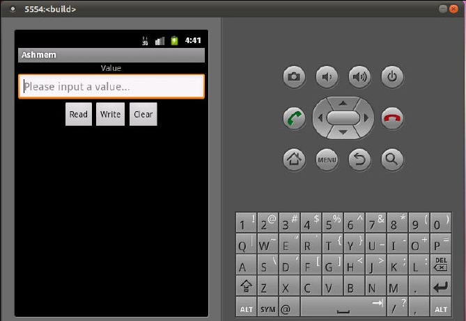

## 6.4　匿名共享内存的Java访问接口
为了方便 `Android` 应用程序使用匿名共享内存， `Android` 系统在应用程序框架层中提供了 `Java` 类 `MemoryFile` 来创建和管理匿名共享内存。使用 `Java` 类 `MemoryFile` 创建的匿名共享内存可以在不同的 `Android` 应用程序之间进行共享。在本节中，我们首先分析 `Java` 类 `MemoryFile` 的实现原理，然后通过一个应用实例来说明它的使用方法。

### 6.4.1　MemoryFile
`MemoryFile` 类提供两个构造函数来创建一块匿名共享内存，如下所示。

`frameworks/base/core/java/android/os/MemoryFile.java`
```java
01 public class MemoryFile
02 {
03 	......
04 	
05     public MemoryFile(String name, int length) throws IOException {
06         mLength = length;
07         mFD = native_open(name, length);
08         mAddress = native_mmap(mFD, length, PROT_READ | PROT_WRITE);
09         mOwnsRegion = true;
10     }
11 	
12 	......
13 	
14 	public MemoryFile(FileDescriptor fd, int length, String mode) throws IOException {
15         if (fd == null) {
16             throw new NullPointerException("File descriptor is null.");
17         }
18         if (!isMemoryFile(fd)) {
19             throw new IllegalArgumentException("Not a memory file.");
20         }
21         mLength = length;
22         mFD = fd;
23         mAddress = native_mmap(mFD, length, modeToProt(mode));
24         mOwnsRegion = false;
25     }
26 	
27 		......
28 }
```
第一个构造函数有两个参数 `name` 和 `length` ，分别用来描述要创建的匿名共享内存的名称和大小。第 `7` 行首先调用 `JNI` 方法 `native_open` 打开设备文件 `/dev/ashmem` ，即请求 `Ashmem` 驱动程序创建一块匿名共享内存，接着第 `8` 行调用 `JNI` 方法 `native_mmap` 将这块匿名共享内存映射到进程的地址空间，并且将得到的地址保存在成员变量 `mAddress` 中。

第二个构造函数有三个参数 `fd` 、 `length` 和 `mode` ，其中，参数 `fd` 是一个文件描述符，它指向一块匿名共享内存；参数 `length` 和 `mode` 用来描述这块匿名共享内存的大小和访问保护位。第 `18` 行调用成员函数 `isMemoryFile` 来验证文件描述符 `fd` 是否指向一块匿名共享内存。如果不是，那么参数 `fd` 就是一个非法参数，因此，第 `19` 行就抛出一个异常；否则，第 `23` 行就调用 `JNI` 方法 `native_mmap` 将参数 `fd` 所指向的一块匿名共享内存映射到进程的地址空间，并且将得到的地址保存在成员变量 `mAddress` 中。

一般来说， `Server` 端应用程序首先使用第一个构造函数来创建一块匿名共享内存，接着再将这块匿名共享内存的文件描述符、大小以及访问保护位传递给 `Client` 端应用程序，以便它可以使用第二个构造函数将前面已经创建好的匿名共享内存映射到本进程的地址空间，这样 `Server` 端应用程序和 `Client` 端应用程序就可以共享同一块匿名共享内存了。

`MemoryFile` 类的成员函数 `isMemoryFile` 的实现如下所示。

`frameworks/base/core/java/android/os/MemoryFile.java`
```java
01 public class MemoryFile
02 {
03 	......
04 	
05     public static boolean isMemoryFile(FileDescriptor fd) throws IOException {
06         return (native_get_size(fd) >= 0);
07     }
08 	
09 		......
10 }
```
第 `6` 行调用了一个 `JNI` 方法 `native_get_size` 来获得文件描述符 `fd` 所指向的一块匿名共享内存的大小。如果获得的大小不是一个负数，那么就说明文件描述符 `fd` 指向的是一块匿名共享内存，这时候函数的返回值就等于 `true` 。

接下来，我们分别分析 `JNI` 方法 `native_get_size` 、 `native_open` 和 `native_mmap` 的实现。

`JNI` 方法 `native_get_size` 的实现如下所示。

`frameworks/base/core/jni/android_os_MemoryFile.cpp`
```cpp
01 static jint android_os_MemoryFile_get_size(JNIEnv* env, jobject clazz,
02         jobject fileDescriptor) {
03     int fd = jniGetFDFromFileDescriptor(env, fileDescriptor);
04     // Use ASHMEM_GET_SIZE to find out if the fd refers to an ashmem region.
05     // ASHMEM_GET_SIZE should succeed for all ashmem regions, and the kernel
06     // should return ENOTTY for all other valid file descriptors
07     int result = ashmem_get_size_region(fd);
08     if (result < 0) {
09         if (errno == ENOTTY) {
10             // ENOTTY means that the ioctl does not apply to this object,
11             // i.e., it is not an ashmem region.
12             return (jint) -1;
13         }
14         // Some other error, throw exception
15         jniThrowIOException(env, errno);
16         return (jint) -1;
17     }
18     return (jint) result;
19 }
```
第 `3` 行首先调用函数 `jniGetFDFromFileDescriptor` 将 `Java` 层的文件描述符 `fileDescriptor` 转换成一个 `C++` 层的文件描述符 `fd` ，接着第 `7` 行调用运行时库 `cutils` 提供的函数 `ashmem_get_size_region` 向 `Ashmem` 驱动程序发出一个 `IO` 控制命令 `ASHMEM_GET_SIZE` ，以便它可以返回与文件描述符 `fd` 对应的匿名共享内存的大小。如果文件描述符 `fd` 指向的不是一块匿名共享内存，那么在调用函数 `ashmem_get_size_region` 时，就不会进入到 `Ashmem` 驱动程序中，而是进入到其他的驱动程序中。由于其他的驱动程序没有实现 `IO` 控制命令 `ASHMEM_GET_SIZE` ，因此，它就会返回一个错误代码 `ENOTTY` 给调用者。这样， `JNI` 方法 `native_get_size` 就可以判断出一个文件描述符是否指向了一块匿名共享内存。

`JNI` 方法 `native_open` 的实现如下所示。

`frameworks/base/core/jni/android_os_MemoryFile.cpp`
```cpp
01 static jobject android_os_MemoryFile_open(JNIEnv* env, jobject clazz, jstring name, jint length)
02 {
03     const char* namestr = (name ? env->GetStringUTFChars(name, NULL) : NULL);
04 
05     int result = ashmem_create_region(namestr, length);
06 
07     if (name)
08         env->ReleaseStringUTFChars(name, namestr);
09 
10     if (result < 0) {
11         jniThrowException(env, "java/io/IOException", "ashmem_create_region failed");
12         return NULL;
13     }
14 
15     return jniCreateFileDescriptor(env, result);
16 }
```
第 `5` 行调用运行时库 `cutils` 提供的函数 `ashmem_create_region` 来创建一块匿名共享内存。创建成功之后，就会得到一个 `C++` 层的文件描述符 `result` ，接着第 `15` 行调用函数 `jniCreateFileDescriptor` 将它转换成一个 `Java` 层的文件描述，并且返回给调用者。

`JNI` 方法 `native_mmap` 的实现如下所示。

`frameworks/base/core/jni/android_os_MemoryFile.cpp`
```cpp
1 static jint android_os_MemoryFile_mmap(JNIEnv* env, jobject clazz, jobject fileDescriptor,
2         jint length, jint prot)
3 {
4     int fd = jniGetFDFromFileDescriptor(env, fileDescriptor);
5     jint result = (jint)mmap(NULL, length, prot, MAP_SHARED, fd, 0);
6     if (!result)
7         jniThrowException(env, "java/io/IOException", "mmap failed");
8     return result;
9 }
```
第 `4` 行首先调用函数 `jniGetFDFromFileDescriptor` 将 `Java` 层的文件描述符 `fileDescriptor` 转换成一个 `C++` 层的文件描述符 `fd` ，接着再调用函数 `mmap` 将它所指向的一块匿名共享内存映射到进程的地址空间，最后第 `8` 行将得到的地址 `result` 返回给调用者。

`MemoryFile` 类的成员函数 `readBytes` 和 `writeBytes` 分别用来读取和写入一块匿名共享内存的内容，它们的实现如下所示。

`frameworks/base/core/java/android/os/MemoryFile.java`
```java
01 public class MemoryFile
02 {
03 	......
04 	
05     public int readBytes(byte[] buffer, int srcOffset, int destOffset, int count) 
06             throws IOException {
07         if (isDeactivated()) {
08             throw new IOException("Can't read from deactivated memory file.");
09         }
10         if (destOffset < 0 || destOffset > buffer.length || count < 0
11                 || count > buffer.length - destOffset
12                 || srcOffset < 0 || srcOffset > mLength
13                 || count > mLength - srcOffset) {
14             throw new IndexOutOfBoundsException();
15         }
16         return native_read(mFD, mAddress, buffer, srcOffset, destOffset, count, mAllowPurging);
17     }
18 	
19 	public void writeBytes(byte[] buffer, int srcOffset, int destOffset, int count)
20             throws IOException {
21         if (isDeactivated()) {
22             throw new IOException("Can't write to deactivated memory file.");
23         }
24         if (srcOffset < 0 || srcOffset > buffer.length || count < 0
25                 || count > buffer.length - srcOffset
26                 || destOffset < 0 || destOffset > mLength
27                 || count > mLength - destOffset) {
28             throw new IndexOutOfBoundsException();
29         }
30         native_write(mFD, mAddress, buffer, srcOffset, destOffset, count, mAllowPurging);
31     }
32 	
33 	......
34 }
```
在读取或者写入一块匿名共享内存时，首先要保证这块匿名共享内存已经映射到进程的地址空间中，这是通过调用成员函数 `isDeactivated` 来判断的，它的实现如下所示。

`frameworks/base/core/java/android/os/MemoryFile.java`
```java
01 public class MemoryFile
02 {
03 	......
04 	
05     private boolean isDeactivated() {
06         return mAddress == 0;
07     }
08 	
09 	......
10 }
```
`MemoryFile` 类的成员变量 `mAddress` 保存的是一块匿名共享内存的地址值。如果它的值等于 `0` ，那么就说明这块匿名共享内存尚未映射到进程的地址空间，因此，成员函数 `isDeactivated` 的返回值就等于 `true` 。

回到 `MemoryFile` 类的成员函数 `readBytes` 或者 `writeBytes` 中，前者最后调用 `JNI` 方法 `native_read` 将一块匿名共享内存的内容读入到缓冲区 `buffer` 中，而后者最后调用 `JNI` 方法将缓冲区 `buffer` 的内容写入到一块匿名共享内存中。

接下来，我们就一起分析 `JNI` 方法 `native_read` 和 `native_write` 的实现。这两个 `JNI` 方法是分别由 `C++` 层中的函数 `android_os_MemoryFile_read` 和 `android_os_MemoryFile_write` 来实现的，如下所示。

`frameworks/base/core/jni/android_os_MemoryFile.cpp`
```cpp
01 static jint android_os_MemoryFile_read(JNIEnv* env, jobject clazz,
02         jobject fileDescriptor, jint address, jbyteArray buffer, jint srcOffset, jint destOffset,
03         jint count, jboolean unpinned)
04 {
05     int fd = jniGetFDFromFileDescriptor(env, fileDescriptor);
06     if (unpinned && ashmem_pin_region(fd, 0, 0) == ASHMEM_WAS_PURGED) {
07         ashmem_unpin_region(fd, 0, 0);
08         jniThrowException(env, "java/io/IOException", "ashmem region was purged");
09         return -1;
10     }
11 
12     env->SetByteArrayRegion(buffer, destOffset, count, (const jbyte *)address + srcOffset);
13 
14     if (unpinned) {
15         ashmem_unpin_region(fd, 0, 0);
16     }
17     return count;
18 }
19 
20 static jint android_os_MemoryFile_write(JNIEnv* env, jobject clazz,
21         jobject fileDescriptor, jint address, jbyteArray buffer, jint srcOffset, jint destOffset,
22         jint count, jboolean unpinned)
23 {
24     int fd = jniGetFDFromFileDescriptor(env, fileDescriptor);
25     if (unpinned && ashmem_pin_region(fd, 0, 0) == ASHMEM_WAS_PURGED) {
26         ashmem_unpin_region(fd, 0, 0);
27         jniThrowException(env, "java/io/IOException", "ashmem region was purged");
28         return -1;
29     }
30 
31     env->GetByteArrayRegion(buffer, srcOffset, count, (jbyte *)address + destOffset);
32 
33     if (unpinned) {
34         ashmem_unpin_region(fd, 0, 0);
35     }
36     return count;
37 }
```
`MemoryFile` 类有一个成员变量 `mAllowPurging` ，它是一个布尔变量。如果它的值等于 `true` ，那么就表示每次访问 `MemoryFile` 类内部的匿名共享内存之后，都要将它解锁，以便它可以被内存管理系统回收。

在函数 `android_os_MemoryFile_read` 和 `android_os_MemoryFile_write` 中，参数 `unpinned` 的值就对应于 `MemoryFile` 类的成员变量 `mAllowPurging` 的值，因此，当它等于 `true` 时，这两个 `JNI` 方法就需要调用运行时库 `cutils` 提供的函数 `ashmem_pin_region` 来判断 `MemoryFile` 类内部的匿名共享内存是否已经被内存管理系统回收。如果函数 `ashmem_pin_region` 的返回值等于 `ASHMEM_WAS_PURGED` ，就说明这块匿名共享内存已经被内存管理系统回收了，这时候这两个 `JNI` 方法就会返回一个错误代码-1给调用者，表示它们不能够再访问 `MemoryFile` 类内部的匿名共享内存了。

如果 `MemoryFile` 类内部的匿名共享内存还没有被内存管理系统回收，那么第 `12` 行和第 `31` 行就可以正常访问它的内容了。访问结束之后，如果发现参数 `unpinned` 的值等于 `true` ，那么第 `15` 行和第 `34` 行还需要将这块匿名共享内存解锁，以便在系统内存不足时，内存管理系统可以将它回收。

至此，匿名共享内存的 `Java` 访问接口 `MemoryFile` 就分析完成了。接下来，我们通过一个应用实例来说明它的使用方法。

### 6.4.2　应用实例
在本节中，我们将创建一个 `Android` 应用程序 `Ashmem` ，它由一个 `Service` 组件 `Server` 和一个 `Activity` 组件 `Client` 组成。 `Server` 组件运行在一个独立的进程中，它内部有一个内存访问服务 `MemoryService` ，后者通过 `MemoryFile` 类创建了一块匿名共享内存。 `Client` 组件运行在另外一个进程中，它会将内存访问服务 `MemoryService` 创建的那块匿名共享内存映射到本进程的地址空间，以便可以访问它的内容，从而可以和 `Server` 组件共享同一块匿名共享内存。
应用程序 `Ashmem` 的目录结构如下：

`~Android/packages/experimental/Ashmem`
```bash
.
├── Android.mk
├── AndroidManifest.xml
├── res
│   ├── drawable
│   │   └── icon.png
│   ├── layout
│   │   └── main.xml
│   └── values
│       └── strings.xml
└── src
    └── shy
        └── luo
            └── ashmem
                ├── Client.java
                ├── IMemoryService.java
                ├── MemoryService.java
                └── Server.java
```
应用程序 `Ashmem` 包含了一个源代码目录 `src` 、一个资源目录 `res` 、一个程序配置文件 `AndroidManifest.xml` 和一个编译脚本文件 `Android.mk` 。接下来，我们就分别介绍每一个文件的内容。

`IMemoryService.java`
```java
001 package shy.luo.ashmem;
002 
003 import android.util.Log;
004 import android.os.IInterface;
005 import android.os.Binder;
006 import android.os.IBinder;
007 import android.os.Parcel;
008 import android.os.ParcelFileDescriptor;
009 import android.os.RemoteException;
010 
011 public interface IMemoryService extends IInterface {
012 	public static abstract class Stub extends Binder implements IMemoryService {
013 		private static final String DESCRIPTOR = "shy.luo.ashmem.IMemoryService";
014 
015 		public Stub() {
016 			attachInterface(this, DESCRIPTOR);
017 		}
018 
019 		public static IMemoryService asInterface(IBinder obj) {
020 			if (obj == null) {
021 				return null;
022 			}
023 
024 			IInterface iin = (IInterface)obj.queryLocalInterface(DESCRIPTOR);
025 			if (iin != null && iin instanceof IMemoryService) {
026 				return (IMemoryService)iin;
027 			}
028 
029 			return new IMemoryService.Stub.Proxy(obj);
030 		}
031 
032 		public IBinder asBinder() {
033 			return this;
034 		}
035 
036 		@Override 
037 		public boolean onTransact(int code, Parcel data, Parcel reply, int flags) throws android.os.RemoteException {
038 			switch (code) {
039 			case INTERFACE_TRANSACTION: {
040 				reply.writeString(DESCRIPTOR);
041 				return true;
042 			}
043 			case TRANSACTION_getFileDescriptor: {
044 				data.enforceInterface(DESCRIPTOR);
045 				
046 				ParcelFileDescriptor result = this.getFileDescriptor();
047 				
048 				reply.writeNoException();
049 				
050 				if (result != null) {
051 					reply.writeInt(1);
052 					result.writeToParcel(reply, 0);
053 				} else {
054 					reply.writeInt(0);
055 				}
056 
057 				return true;
058 			}
059 			case TRANSACTION_setValue: {
060 				data.enforceInterface(DESCRIPTOR);
061 				
062 				int val = data.readInt();
063 				setValue(val);
064 				
065 				reply.writeNoException();
066 				
067 				return true;
068 			}
069 			}
070 
071 			return super.onTransact(code, data, reply, flags);
072 		}
073 
074 		private static class Proxy implements IMemoryService {
075 			private IBinder mRemote;
076 
077 			Proxy(IBinder remote) {
078 				mRemote = remote;
079 			}
080 
081 			public IBinder asBinder() {
082 				return mRemote;
083 			}
084 
085 			public String getInterfaceDescriptor() {
086 				return DESCRIPTOR;
087 			}
088 
089 			public ParcelFileDescriptor getFileDescriptor() throws RemoteException {
090 				Parcel data = Parcel.obtain();
091 				Parcel reply = Parcel.obtain();
092 
093 				ParcelFileDescriptor result;
094 	
095 				try {
096 					data.writeInterfaceToken(DESCRIPTOR);
097 
098 					mRemote.transact(Stub.TRANSACTION_getFileDescriptor, data, reply, 0);
099 		
100 					reply.readException();
101 					if (0 != reply.readInt()) {
102 						result = ParcelFileDescriptor.CREATOR.createFromParcel(reply);
103 					} else {
104 						result = null;
105 					}
106 				} finally {
107 					reply.recycle();
108 					data.recycle();
109 				}
110 	
111 				return result;
112 			}
113 
114 			public void setValue(int val) throws RemoteException {
115 				Parcel data = Parcel.obtain();
116 				Parcel reply = Parcel.obtain();
117 
118 				try {
119 					data.writeInterfaceToken(DESCRIPTOR);
120 					data.writeInt(val);
121 
122 					mRemote.transact(Stub.TRANSACTION_setValue, data, reply, 0);
123 					
124 					reply.readException();
125 				} finally {
126 					reply.recycle();
127 					data.recycle();
128 				}
129 			}
130 		}
131 
132 		static final int TRANSACTION_getFileDescriptor = IBinder.FIRST_CALL_TRANSACTION + 0;
133 		static final int TRANSACTION_setValue = IBinder.FIRST_CALL_TRANSACTION + 1;
134 
135 	}
136 
137 	public ParcelFileDescriptor getFileDescriptor() throws RemoteException;
138 	public void setValue(int val) throws RemoteException;
139 }
```
这个文件定义了 `MemoryService` 的服务接口 `IMemoryService` 、 `Java` 本地服务类 `IMemoryService.Stub` 和 `Java` 服务代理对象类 `IMemoryService.Stub.Proxy` 。

`IMemoryFile` 接口定义了两个成员函数 `getFileDescriptor` 和 `setValue` ，其中， `getFileDescriptor` 用来获得一块匿名共享内存的文件描述符，而 `setValue` `用来往这块匿名共享内存中写入一个整数。IMemoryFile` 接口的成员函数 `getFileDescriptor` 的返回值是一个 `ParcelFileDescriptor` 对象，它也是用来描述一个文件描述符的，不过，它描述的文件描述符是用来从一个进程传递到另一个进程的。

 `IMemoryService.Stub` 是一个 `Java` 本地服务类，内存访问服务 `MemoryService` 必须以它为父类。成员函数 `onTransact` 用来处理类型为 `TRANSACTION_getFileDescriptor` 或者 `TRANSACTION_setValue` 的进程间通信请求，其中，第 `46` 行调用由其子类重写的成员函数 `getFileDescriptor` 来处理类型为 `TRANSACTION_getFileDescriptor` 的进程间通信请求，而第 `62` 行调用由其子类重写的成员函数 `setValue` 来处理类型为 `TRANSACTION_setValue` 的进程间通信请求。静态成员函数 `aslnterface` 用来将一个 `Java` 服务代理对象封装成一个实现了 `IMemoryService` 接口的 `Java` 服务代理对象，即一个 `IMemoryService.Stub.Proxy` 对象。

 `IMemoryService.Stub.Proxy` 是一个 `Java` 服务代理对象类，用来描述一个内存访问服务 `MemoryService` 的 `Java` 代理对象。成员变量 `mRemote` 指向一个 `Java` 服务代理对象，用来向运行在另外一个进程中的 `MemoryService` 服务发送进程间通信请求。成员函数 `getFileDescriptor` 用来向运行在另外一个进程中的 `MemoryService` 服务发送一个类型为 `TRANSACTION_getFileDescriptor` 的进程间通信请求，以便可以获得该 `MemoryService` 服务内部的一块匿名共享内存的文件描述符。成员函数 `setValue` 用来向运行在另外一个进程中的 `MemoryService` 服务发送一个类型为 `TRANSACTION_setValue` 的进程间通信请求，以便可以向该 `MemoryService` 服务内部的一块匿名共享内存中写入一个整数值。

`MemoryService.java`
```java
01 package shy.luo.ashmem;
02 
03 import java.io.FileDescriptor;
04 import java.io.IOException;
05 
06 import android.os.Parcel;
07 import android.os.MemoryFile;
08 import android.os.ParcelFileDescriptor;
09 import android.util.Log;
10 
11 public class MemoryService extends IMemoryService.Stub {
12 	private final static String LOG_TAG = "shy.luo.ashmem.MemoryService";
13 	private MemoryFile file = null;
14 	
15 	public MemoryService() {
16 		try {
17                         file = new MemoryFile("Ashmem", 4);
18                         setValue(0);
19                 }
20                 catch(IOException ex) {
21                         Log.i(LOG_TAG, "Failed to create memory file.");
22                         ex.printStackTrace();
23                 }
24 	}
25 
26 	public ParcelFileDescriptor getFileDescriptor() {
27 		Log.i(LOG_TAG, "Get File Descriptor.");
28 
29 		ParcelFileDescriptor pfd = null;
30 
31 		try {
32 			pfd = file.getParcelFileDescriptor();
33 		} catch(IOException ex) {
34 			Log.i(LOG_TAG, "Failed to get file descriptor.");
35 			ex.printStackTrace();
36 		}
37 
38 		return pfd;
39 	}
40 	
41 	public void setValue(int val) {
42 		if(file == null) {
43 			return;
44 		}
45 
46 		byte[] buffer = new byte[4];   
47 		buffer[0] = (byte)((val >>> 24) & 0xFF);
48 		buffer[1] = (byte)((val >>> 16) & 0xFF);
49 		buffer[2] = (byte)((val >>> 8) & 0xFF); 
50 		buffer[3] = (byte)(val & 0xFF);
51 		
52 		try {
53 			file.writeBytes(buffer, 0, 0, 4);
54 			Log.i(LOG_TAG, "Set value " + val + " to memory file. ");
55 		}
56 		catch(IOException ex) {
57 			Log.i(LOG_TAG, "Failed to write bytes to memory file.");
58 			ex.printStackTrace();
59 		}
60 	}
61 }
```
这个文件定义了一个 `Java` 服务 `MemoryService` ，它继承了 `IMemoryService.Stub` 类，并且实现了 `IMemoryService` 接口的成员函数 `getFileDescriptor` 和 `setValue` 。

在 `MemoryService` 类的构造函数中，第 `17` 行创建了一个 `MemoryFile` 对象，并且将它保存在成员变量 `file` 中。从前面 `6.4.1` 小节的内容可以知道， `MemoryFile` 对象 `file` 在创建的过程中，会请求 `Ashmem` 驱动程序创建一块匿名共享内存，这块匿名共享内存的名称和大小分别为 `"Ashmem"` 和 `4` 。

在 `MemoryService` 类的成员函数 `getFileDescriptor` 中，第 `30` 行调用成员变量 `file` 的成员函数 `getParcelFileDescriptor` 来获得其内部的一块匿名共享内存的文件描述符，最后第 `36` 行将它返回给调用者。

在 `MemoryService` 类的成员函数 `setValue` 中，第 `44` 行到第 `48` 行代码首先将整型参数 `val` 写入到一个字节数组 `buffer` 中，接着调用成员变量 `file` 的成员函数 `writeBytes` 将它的内容写入到其内部的一块匿名共享内存中。

`Server.java`
```java
01 package shy.luo.ashmem;
02 
03 import android.app.Service;
04 import android.content.Intent;
05 import android.os.IBinder;
06 import android.util.Log;
07 import android.os.ServiceManager;
08 
09 public class Server extends Service {
10     private final static String LOG_TAG = "shy.luo.ashmem.Server";
11 
12     private MemoryService memoryService = null;
13 
14     @Override
15     public IBinder onBind(Intent intent) {
16         return null;
17     }
18 
19     @Override
20     public void onCreate() {
21 	Log.i(LOG_TAG, "Create Memory Service...");
22 
23 	memoryService = new MemoryService();
24 
25         try {
26             ServiceManager.addService("AnonymousSharedMemory", memoryService);
27             Log.i(LOG_TAG, "Succeed to add memory service.");
28         } catch (RuntimeException ex) {
29             Log.i(LOG_TAG, "Failed to add Memory Service.");
30             ex.printStackTrace();
31         }
32 
33 	//int div = 0;
34 	//int sum = 10;
35 
36 	//int ave = sum / div;
37     }
38 
39     @Override
40     public void onStart(Intent intent, int startId) {
41         Log.i(LOG_TAG, "Start Memory Service.");
42     }
43 
44     @Override
45     public void onDestroy() {
46 	Log.i(LOG_TAG, "Destroy Memory Service.");
47     }
48 }
```
这个文件定义了一个 `Service` 组件 `Server` 。

**注意**
> 这是一个标准的 `Android` 应用程序组件，与 `Binder` 进程间通信机制中的 `Service` 组件是两个不同的概念。

`Server` 组件运行在一个独立的进程中，它在启动时，第 `20` 行首先会创建一个内存访问服务 `MemoryService` ，接着第 `23` 行将这个服务注册到 ` `Service Manager` ` 中。

内存访问服务 `MemoryService` 注册到 ` `Service Manager` ` 中的名称被指定为 `"AnonymousSharedMemory"` ，这样，其他进程就可以通过这个名称来获得 `MemoryService` 服务的一个 `Java` 代理对象。

`Client.java`
```java
001 package shy.luo.ashmem;
002 
003 import java.io.FileDescriptor;
004 import java.io.IOException;
005 
006 import android.app.Activity;
007 import android.content.Intent;
008 import android.os.Bundle;
009 import android.os.MemoryFile;
010 import android.os.ParcelFileDescriptor;
011 import android.os.ServiceManager;
012 import android.os.RemoteException;
013 import android.util.Log;
014 import android.view.View;
015 import android.view.View.OnClickListener;
016 import android.widget.Button;
017 import android.widget.EditText;
018 
019 public class Client extends Activity implements OnClickListener {
020 	private final static String LOG_TAG = "shy.luo.ashmem.Client";
021 	
022 	IMemoryService memoryService = null;
023 	MemoryFile memoryFile = null;
024 	
025 	private EditText valueText = null;
026 	private Button readButton = null;
027 	private Button writeButton = null;
028 	private Button clearButton = null;
029 	
030     	@Override
031     	public void onCreate(Bundle savedInstanceState) {
032         	super.onCreate(savedInstanceState);
033         	setContentView(R.layout.main);
034 
035 		IMemoryService ms = getMemoryService();
036 		if(ms == null) {        
037 			Log.i(LOG_TAG, "start shy.luo.ashmem.server");
038         		startService(new Intent("shy.luo.ashmem.server"));
039 		} else {
040 			Log.i(LOG_TAG, "Memory Service has started.");
041 		}
042 
043         	valueText = (EditText)findViewById(R.id.edit_value);
044         	readButton = (Button)findViewById(R.id.button_read);
045         	writeButton = (Button)findViewById(R.id.button_write);
046         	clearButton = (Button)findViewById(R.id.button_clear);
047 
048 		readButton.setOnClickListener(this);
049         	writeButton.setOnClickListener(this);
050         	clearButton.setOnClickListener(this);
051         
052         	Log.i(LOG_TAG, "Client Activity Created.");
053     	}
054 
055     	@Override
056     	public void onResume() {
057 		super.onResume();
058 
059 		Log.i(LOG_TAG, "Client Activity Resumed.");
060     	}
061 
062     	@Override
063     	public void onPause() {
064 		super.onPause();
065 
066 		Log.i(LOG_TAG, "Client Activity Paused.");
067     	}
068     
069     	@Override
070     	public void onClick(View v) {
071     		if(v.equals(readButton)) {
072     			int val = 0;
073     		
074     			MemoryFile mf = getMemoryFile();
075     			if(mf != null) {
076 				try {
077     					byte[] buffer = new byte[4];
078     					mf.readBytes(buffer, 0, 0, 4);
079     			
080     					val = (buffer[0] << 24) | ((buffer[1] & 0xFF) << 16) | ((buffer[2] & 0xFF) << 8) | (buffer[3] & 0xFF);
081 				} catch(IOException ex) {
082 					Log.i(LOG_TAG, "Failed to read bytes from memory file.");
083 					ex.printStackTrace();
084 				}
085     			}	
086     		
087     			String text = String.valueOf(val);
088     			valueText.setText(text);
089     		} else if(v.equals(writeButton)) {
090     			String text = valueText.getText().toString();
091     			int val = Integer.parseInt(text);
092     		
093     			IMemoryService ms = getMemoryService();
094     			if(ms != null) {
095 				try {
096     					ms.setValue(val);
097 				} catch(RemoteException ex) {
098 					Log.i(LOG_TAG, "Failed to set value to memory service.");
099 					ex.printStackTrace();
100 				}
101     			}
102     		} else if(v.equals(clearButton)) {
103     			String text = "";
104     			valueText.setText(text);
105     		}
106     	}
107     
108     	private IMemoryService getMemoryService() {
109     		if(memoryService != null) {
110     			return memoryService;
111     		}
112     	
113     		memoryService = IMemoryService.Stub.asInterface(
114                 			ServiceManager.getService("AnonymousSharedMemory"));
115 
116 		Log.i(LOG_TAG, memoryService != null ? "Succeed to get memeory service." : "Failed to get memory service.");
117     	
118     		return memoryService;
119     	}
120     
121     	private MemoryFile getMemoryFile() {
122     		if(memoryFile != null) {
123     			return memoryFile;
124     		}
125     		
126     		IMemoryService ms = getMemoryService();
127     		if(ms != null) {
128 			try {
129     				ParcelFileDescriptor pfd = ms.getFileDescriptor();
130 				if(pfd == null) {
131 					Log.i(LOG_TAG, "Failed to get memory file descriptor.");
132 					return null;
133 				}
134 
135 				try {
136 					FileDescriptor fd = pfd.getFileDescriptor();
137 					if(fd == null) {
138 						Log.i(LOG_TAG, "Failed to get memeory file descriptor.");
139 						return null;                      
140 					}	
141 
142     					memoryFile = new MemoryFile(fd, 4, "r");
143 				} catch(IOException ex) {
144 					Log.i(LOG_TAG, "Failed to create memory file.");
145 					ex.printStackTrace();
146 				}
147     			} catch(RemoteException ex) {
148 				Log.i(LOG_TAG, "Failed to get file descriptor from memory service.");
149 				ex.printStackTrace();
150 			}
151 		}
152     	
153     		return memoryFile;
154     	}
155 }
```
这个文件定义了一个 `Activity` 组件 `Client` ，用来描述应用程序 `Ashmem` 的主界面。

 `Client` 组件在启动时，第 `38` 行会调用成员函数 `startService` 来启动应用程序 `Ashmem` 的 `Server` 组件。前面提到，这个 `Server` 组件是运行在一个独立的进程中的，它在启动时，会创建一块匿名共享内存，并且将用来管理这块匿名共享内存的 `MemoryService` 服务注册到 `Service Manager` 中。

注意
应用程序 `Ashmem` 的 `Server` 组件是被隐式启动的， `Client` 组件在调用成员函数 `startService` 时，只要指定 `Server` 组件的 `Action` 名称 `"start shy.luo.ashmem.server"` 就可以将它隐式启动起来。

 `Client` 组件的界面上有三个按钮 `Read` 、 `Write` 和 `Clear` ，以及一个文本框 `EditText` 。当点击 `Read` 按钮时， `Client` 组件便会将在 `MemoryService` 服务中创建的匿名共享内存的内容读取出来，并且显示在文本框 `EditText` 中。当点击 `Write` 按钮时， `Client` 组件便会将输入在文本框 `EditText` 中的整数写入到在 `MemoryService` 服务中创建的匿名共享内存中。当点击 `Clear` 按钮时， `Client` 组件便会清空文本框 `EditText` 的内容。

 `Client` 组件的成员函数 `getMemoryService` 用来获取一个 `MemoryService` 服务代理对象。第一次调用 `Client` 组件的成员函数 `getMemoryService` 时， `Client` 组件会通过 `Service Manager` 来获得 `MemoryService` 服务的一个 `Java` 代理对象，并且将它保存在成员变量 `memoryService` 中。

 `Client` 组件的成员函数 `getMemoryFile` 用来获得一个 `MemoryFile` 对象。第一次调用 `Client` 组件的成员函数 `getMemoryFile` 时， `Client` 组件会通过内部的成员变量 `memoryService` 来请求 `MemoryService` 服务返回其内部的一块匿名共享内存的文件描述符 `fd` 。有了文件描述符 `fd` 之后， `Client` 组件就可以在内部创建一个 `MemoryFile` 对象，并且将这个 `MemoryFile` 对象保存在成员变量 `memoryFile` 中。从前面 `6.4.1` 小节的内容可以知道， `MemoryFile` 对象 `memoryFile` 在创建的过程中，会将与文件描述符 `fd` 对应的匿名共享内存映射到本进程的地址空间，即将在 `MemoryService` 服务中创建的那块匿名共享内存映射到本进程的地址空间，这样就可以在本进程中直接访问这块匿名共享内存的内容了。

**注意**
当点击界面上的 `Read` 按钮时， `Client` 组件是通过调用其内部的 `MemoryFile` 对象 `memoryFile` 的成员函数 `readBytes` 来访问在 `MemoryService` 服务中创建的匿名共享内存的内容的，即通过本进程的地址空间来访问这块匿名共享内存的内容；而当点击界面上的Write按钮时， `Client` 组件是通过调用其内部的 `MemoryService` 服务代理对象 `memoryService` 的成员函数 `setValue` 来将一个整数值写入到在 `MemoryService` 服务中创建的匿名共享内存中的。

`main.xml`
```xml
<?xml version="1.0" encoding="utf-8"?>
<LinearLayout xmlns:android="http://schemas.android.com/apk/res/android"
    android:orientation="vertical"
    android:layout_width="fill_parent"
    android:layout_height="fill_parent"
    >
    <LinearLayout
    	android:layout_width="fill_parent"
    	android:layout_height="wrap_content"
    	android:orientation="vertical" 
    	android:gravity="center">
    	<TextView 
			android:layout_width="wrap_content"
       		android:layout_height="wrap_content" 
        	android:text="@string/value">
    	</TextView>
    	<EditText 
     		android:layout_width="fill_parent"
        	android:layout_height="wrap_content" 
        	android:id="@+id/edit_value"
        	android:hint="@string/hint">
    	</EditText>
    </LinearLayout>
     <LinearLayout
    	android:layout_width="fill_parent"
    	android:layout_height="wrap_content"
    	android:orientation="horizontal" 
    	android:gravity="center">
    	<Button 
    		android:id="@+id/button_read"
    		android:layout_width="wrap_content"
    		android:layout_height="wrap_content"
    		android:text="@string/read">
    	</Button>
    	<Button 
    		android:id="@+id/button_write"
    		android:layout_width="wrap_content"
    		android:layout_height="wrap_content"
    		android:text="@string/write">
    	</Button>
    	<Button 
    		android:id="@+id/button_clear"
    		android:layout_width="wrap_content"
    		android:layout_height="wrap_content"
    		android:text="@string/clear">
    	</Button>
    </LinearLayout>
</LinearLayout>
```
这是 `Client` 组件的界面配置文件，在屏幕中间显示一个 `EditText` 控件和三个 `Button` 控件。

`strings.xml`
```xml
<?xml version="1.0" encoding="utf-8"?>
<resources>
	<string name="app_name">Ashmem</string>
    <string name="value">Value</string>
    <string name="hint">Please input a value...</string>
    <string name="read">Read</string>
    <string name="write">Write</string>
    <string name="clear">Clear</string>
</resources>
```
这是应用程序 `Ashmem` 的字符串资源文件，定义了在应用程序中用到的各个字符串。

`AndroidManifest.xml`
```xml
<?xml version="1.0" encoding="utf-8"?>
<manifest xmlns:android="http://schemas.android.com/apk/res/android"
      package="shy.luo.ashmem"
      android:sharedUserId="android.uid.system"
      android:versionCode="1"
      android:versionName="1.0">
    <application android:icon="@drawable/icon" android:label="@string/app_name">
        <activity android:name=".Client"
                  android:label="@string/app_name">
            <intent-filter>
                <action android:name="android.intent.action.MAIN" />
                <category android:name="android.intent.category.LAUNCHER" />
            </intent-filter>
        </activity>
		<service 
			android:enabled="true" 
			android:name=".Server"
			android:process=".Server" >
			<intent-filter>
                <action android:name="shy.luo.ashmem.server"/>
                <category android:name="android.intent.category.DEFAULT"/>
            </intent-filter>
		</service>
    </application>

</manifest> 
```
这是应用程序 `Ashmem` 的配置文件。由于在程序中使用到了 `Activity` 组件 `Client` 和 `Service` 组件 `Server` ，因此，我们需要在这里对它们进行配置。

**注意**
> 我们将Client组件作为应用程序 `Ashmem` 的根 `Activity` ；同时，在配置 `Server` 组件时，我们将它的 `android:process` 属性设置为 `"shy.luo.ashmem.server"` ，即告诉 `Android` 系统，将这个 `Server` 组件运行在一个名称为 `"shy.luo.ashmem.server"` 的独立进程中。

由于我们需要在应用程序 `Ashmem` 中注册 `MemoryService` 服务，因此，需要为应用程序 `Ashmem` 申请 `System` 用户权限，即将应用程序 `Ashmem` 的 `android:sharedUserId` 属性设置为 `"android.uid.system"` ，以便应用程序 `Ashmem` 可以获得注册服务的权限。

`Android.mk`
```makefile
LOCAL_PATH:= $(call my-dir)
include $(CLEAR_VARS)

LOCAL_MODULE_TAGS := optional

LOCAL_SRC_FILES += $(call all-subdir-java-files)

LOCAL_PACKAGE_NAME := Ashmem

LOCAL_CERTIFICATE := platform

include $(BUILD_PACKAGE)
```
这是应用程序 `Ashmem` 的编译脚本文件。由于我们需要在应用程序 `Ashmem` 中注册服务，因此，就需要使用平台类型的证书来编译应用程序 `Ashmem` ，即将变量 `LOCAL_CERTIFICATE` 的值设置为 `"platform"` ，以便应用程序 `Ashmem` 可以获得注册服务的权限。

上述文件都准备好之后，我们就可以对应用程序 `Ashmem` 进行编译和打包了。
```bash
mmm ./packages/experimental/Ashmem/
make snod
```
编译成功之后，就可以在 `out/target/product/gerneric/system/app` 目录下看到应用程序文件 `Ashmem.apk `了；打包成功之后，应用程序 `Ashmem` 就包含在 `out/target/product/gerneric` 目录下的 `Android` 系统镜像文件 `system.img` 中了。

最后，我们使用新得到的系统镜像文件 `system.img` 来启动 `Android` 模拟器。
```bash
emulator
```
`Android` 模拟器运行起来之后，我们就可以在应用程序启动器中启动应用程序 `Ashmem` 了，它的界面如图 `6-8` 所示。



在这个界面中，我们可以通过点击 `Read` 和 `Write` 按钮来验证应用程序 `Ashmem` 的两个进程是否成功地共享了同一块匿名共享内存。

至此，匿名共享内存的 `C++` 和 `Java` 访问接口就分析完成了。接下来，我们继续分析匿名共享内存在两个不同的进程当中进行共享的原理。