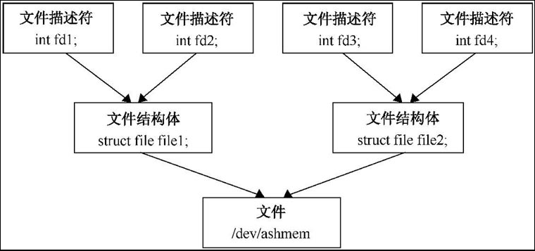
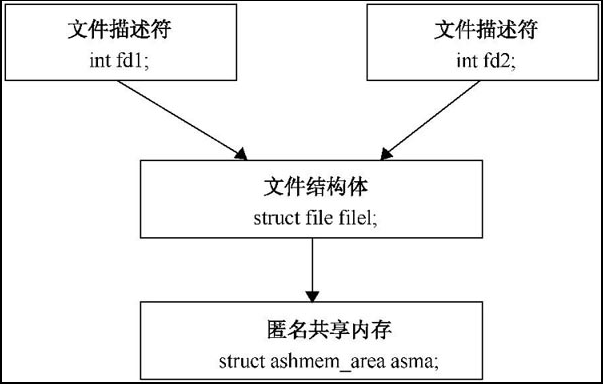
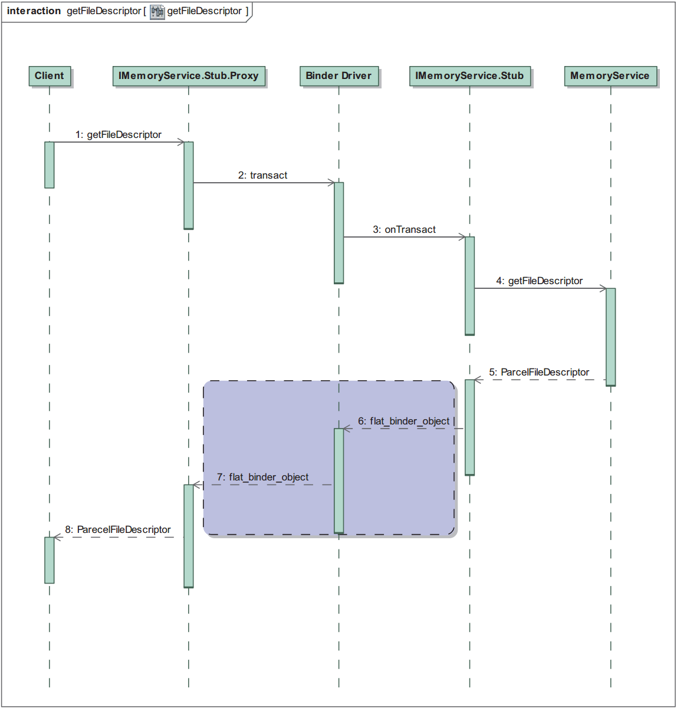

## 6.5 匿名共享内存的共享原理

在 `Android` 系统中，每一块匿名共享内存都是使用一个文件描述符来描述的，而这个文件描述符是通过打开设备文件 `/dev/ashmem` 获得的。当两个进程需要共享一块匿名共享内存时，只要把它的文件描述符从一个进程传递给别外一个进程即可。

我们知道，在 `Linux` 系统中，文件描述符其实就是一个整数，它只在进程范围内有效，即值相等的两个文件描述符在两个不同的进程中具有不同的含义。在 `Linux` 内核中，每一个文件描述符都对应有一个文件结构体（ `struct file` ）。文件结构体是一个内核对象，每一个打开的文件都有一个对应的文件结构体。文件描述符、文件结构体和文件的关系如图 `6-9` 所示。



不同的文件描述符可以对应于同一个文件结构体，而不同的文件结构体也可以对应于同一个文件。当应用程序调用函数 `open` 来打开一个文件时，文件系统就会为该文件创建一个文件结构体和一个文件描述符，最后将这个文件描述符返回给应用程序。

由于应用程序打开设备文件 `/dev/ashmem` 时， `Ashmem` 驱动程序会为它在内核中创建一块匿名共享内存。因此，文件描述符、文件结构体和匿名共享内存的关系就如图 `6-10` 所示。



匿名共享内存能够在两个不同的进程中共享的奥妙就在于，这两个进程分别有一个文件描述符 `fd1` 和 `fd2` ，它们指向了同一个文件结构体 `file1` ，而这个文件结构体又指向了一块匿名共享内存 `asma` 。这时候，如果这两个进程的文件描述符 `fd1` 和 `fd2` 分别被映射到各自的地址空间，那么它们就会把同一块匿名共享内存映射到各自的地址空间，从而实现在两个不同的进程中共享同一块匿名共享内存。

现在的问题就是如何让两个位于不同进程中的文件描述符 `fd1` 和 `fd2` 指向同一个用来描述匿名共享内存 `asma` 的文件结构体 `file1` 。

假设进程 `p1` 首先调用函数 `open` 来打开设备文件 `/dev/ashmem` ，这样它就得到了一块匿名共享内存 `asma` 、一个文件结构体 `file1` 和一个文件描述符 `fd1` 。接着进程 `p2` 通过 `Binder` 进程间通信机制请求进程 `p1` 将文件描述符 `fd1` 返回给它，进程 `p1` 要通过 `Binder` 驱动程序将文件描述符 `fd1` 返回给进程 `p2` 。由于文件描述符 `fd1` 只在进程 `p1` 中有效，因此， `Binder` 驱动程序就不能直接将文件描述符 `fd1` 返回给进程 `p2` 。这时候 `Binder` 驱动程序就会在进程 `p2` 中创建一个新的文件描述符 `fd2` ，使得它也指向文件结构体 `file1` ，最后再将文件描述符 `fd2` 返回给进程 `p2` 。这样，文件描述符 `fd1` 和 `fd2` 就指向同一个文件结构体 `file1` 了，即指向了同一块匿名共享内存。

在前面的 `6.4.2` 小节中， `Client` 组件通过其内部的一个 `MemoryService` 代理对象的成员函数 `getFileDescriptor` 来请求运行在另外一个进程中的 `MemoryService` 服务返回其内部的一块匿名共享内存的文件描述符，这个过程如图 `6-11` 所示。



第 `1` 步到第 `4` 步是 `Client` 组件请求 `MemoryService` 服务返回其内部的匿名共享内存的文件描述符的过程，而第 `5` 步到第 `8` 步是 `MemoryService` 服务返回其内部的匿名共享内存的文件描述符给 `Client` 组件的过程。

在第 `5` 步中， `MemoryService` 服务将内部的匿名共享内存的文件描述符封装成一个 `ParcelFileDescriptor` 对象，然后把它从 `Java` 层传输到 `C++` 层。到了第 `6` 步时，这个正在传输的 `ParcelFileDescriptor` 对象首先被转换为一个类型为 `BINDER_TYPE_FD` 的 `flat_binder_object` 结构体，然后传输给 `Binder` 驱动程序。到了第7步时， `Binder` 驱动程序就会对第 `6` 步传输过来的 `flat_binder_object` 结构体进行处理，然后再返回给 `Client` 组件。

接下来，我们就分析 `Binder` 驱动程序是如何处理进程间通信数据中类型为 `BINDER_TYPE_FD` 的 `flat_binder_object` 结构体的。

`Binder` 驱动程序是在函数 `binder_transaction` 中处理进程间通信数据中类型为 `BINDER_TYPE_FD` 的 `flat_binder_object` 结构体的，如下所示。

`kernel/drivers/staging/android/binder.c`
```c
01 static void
02 binder_transaction(struct binder_proc *proc, struct binder_thread *thread,
03 	struct binder_transaction_data *tr, int reply)
04 {
05 	......
06 	
07 	for (; offp < off_end; offp++) {
08 		struct flat_binder_object *fp;
09 		......
10 		fp = (struct flat_binder_object *)(t->buffer->data + *offp);
11 		switch (fp->type) {
12 		......
13 		case BINDER_TYPE_FD: {
14 			int target_fd;
15 			struct file *file;
16 
17 			......
18 			
19 			file = fget(fp->handle);
20 			if (file == NULL) {
21 				......
22 				return_error = BR_FAILED_REPLY;
23 				goto err_fget_failed;
24 			}
25 			target_fd = task_get_unused_fd_flags(target_proc, O_CLOEXEC);
26 			if (target_fd < 0) {
27 				fput(file);
28 				return_error = BR_FAILED_REPLY;
29 				goto err_get_unused_fd_failed;
30 			}
31 			task_fd_install(target_proc, target_fd, file);
32 			......
33 			fp->handle = target_fd;
34 		} break;
35 		......
36 		}
37 	}
38 	......
39 }
```
第 `10` 行首先从进程间通信数据中获得一个类型为 `BINDER_TYPE_FD` 的 `flat_binder_object` 结构体 `fp` ，它的成员变量 `handle` 就是用来描述一个文件描述符的。

**注意**
> 这个文件描述符只在源进程中有效。接着第 `19` 行调用函数 `fget` 来获得与文件描述符 `fp->handle` 对应的文件结构体 `file` 。

第 `25` 行调用函数 `task_get_unused_fd_flags` 在目标进程 `target_proc` 中获得一个未使用的文件描述符 `target_fd` ，接着第 `31` 行调用函数 `task_fd_install` 将它和文件结构体 `file` 关联起来。这样，源进程中的文件描述符 `fp->handle` 和目标进程中的文件描述符 `target_fd` 就指向了同一个文件结构体，即指向了同一块匿名共享内存。

最后，第 `33` 行将 `flat_binder_object` 结构体 `fp` 的成员变量 `handle` 的值设置为文件描述符 `target_fd` ，以便可以将它返回给目标进程，即返回给 `Client` 组件。

`Client` 组件从 `Binder` 驱动程序中获得了 `flat_binder_object` 结构体 `fp` 之后，首先将它封装成一个 `ParcelFileDescriptor` 对象，然后再将它转换成一个 `FileDescriptor` 对象，最后就可以使用这个 `FileDescriptor` 对象来创建一个 `MemoryFile` 对象，即将 `MemoryService` 服务内部的匿名共享内存映射到 `Client` 组件所在的进程的地址空间，从而达到了在不同的进程中共享同一块匿名共享内存的目的。
